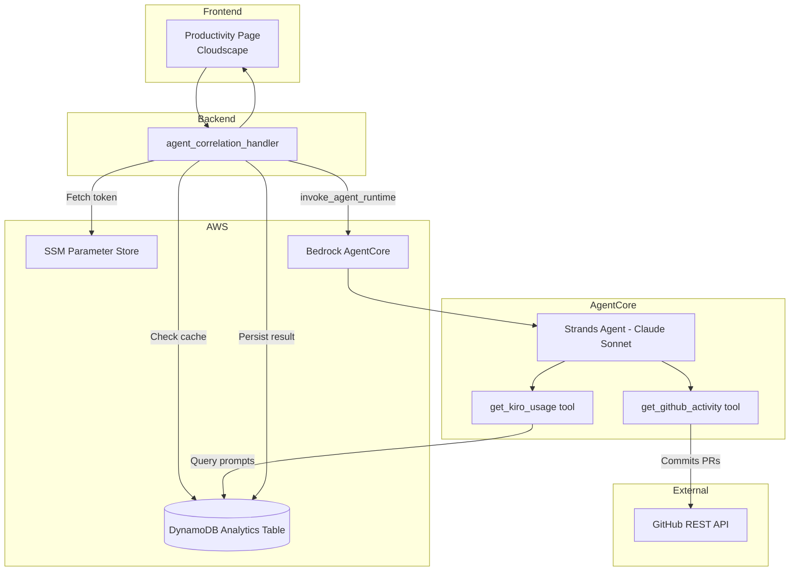
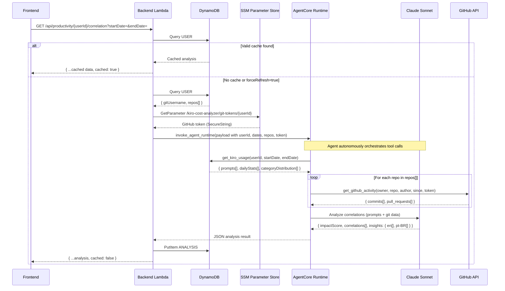

# Design Document — Git-Kiro Semantic Correlation via AI Agent (AgentCore)

## Overview

This feature replaces the legacy Git sync pipeline (Step Functions + periodic sync + Pearson correlation from PR #15) with an on-demand AI Agent deployed on Amazon Bedrock AgentCore (sa-east-1). The agent uses the Strands Agents SDK with Claude Sonnet to perform **semantic correlation** between Kiro prompts and GitHub activity (commits and PRs).

Instead of statistical correlation (Pearson's r between daily counts), the LLM compares textual content — prompt descriptions vs. commit messages and PR titles — to identify causal relationships. Results are cached in DynamoDB (24h TTL for freshness, 7-day TTL for expiry) to avoid redundant LLM invocations.

### Key Design Decisions

| # | Decision | Rationale |
|---|----------|-----------|
| 1 | **AgentCore as runtime** | Serverless microVM in sa-east-1. No infra management, auto-scaling, session isolation. |
| 2 | **On-demand, not periodic** | Git data fetched via GitHub API at analysis time. Eliminates ETL, Step Functions, and sync state. |
| 3 | **GitHub-only (v1)** | Removes multi-provider complexity (GitLab, Bitbucket, CodeCommit). Focuses on the real use case. |
| 4 | **Cache analysis results, not raw data** | Persists agent output (insights, scores, correlations) in DynamoDB. GitHub remains source of truth for Git data. |
| 5 | **Backend as proxy** | Frontend never invokes AgentCore directly. Backend Lambda checks cache → fetches token → invokes agent → persists result. |
| 6 | **Semantic > statistical** | LLM compares content (prompt vs commit message) for causal correlations, not just temporal coincidence. |
| 7 | **Stateless agent** | No memory between invocations. Each analysis is self-contained with all data passed in the prompt. |
| 8 | **Token passed in payload** | Backend fetches GitHub token from SSM and passes it in the AgentCore invocation payload. The agent's tool receives it as a parameter. |
| 9 | **Bilingual insights in a single LLM call** | The agent emits insights for `en` and `pt-BR` in the same JSON response (parallel arrays). One LLM call, no per-locale cache fragmentation, instant locale switching on the frontend. Cost trade-off: ~10-15% extra output tokens per analysis. |
| 10 | **Backend stays English-only for prose** | Per `development-standards §4.1`, the backend never returns localized prose. User-facing status conditions (no mapping, token expired, insufficient data) are returned as stable English `status` slugs; the frontend resolves them through the i18n catalog. The bilingual insights are an exception because their content is LLM-generated and must travel as data, not as static prose. |

## Architecture

### High-Level Architecture Diagram



### Sequence Diagram



## Components and Interfaces

### 1. Agent Code Structure

```
agent/app/GitCorrelationAgent/
├── main.py                    # @app.entrypoint — AgentCore handler
├── prompts.py                 # SYSTEM_PROMPT + OUTPUT_SCHEMA
├── tools/
│   ├── __init__.py
│   ├── github_tool.py         # @tool get_github_activity
│   └── kiro_data.py           # @tool get_kiro_usage
├── requirements.txt           # strands-agents, bedrock-agentcore, boto3, requests
└── pyproject.toml
```

### 2. Agent Entrypoint (`main.py`)

```python
from strands import Agent, tool
from strands.models.bedrock import BedrockModel
from bedrock_agentcore.runtime import BedrockAgentCoreApp

app = BedrockAgentCoreApp()

@app.entrypoint
def handler(payload: dict) -> str:
    """Receive invocation payload, build agent with tools, run analysis."""
    user_id = payload["userId"]
    start_date = payload["startDate"]
    end_date = payload["endDate"]
    git_username = payload["gitUsername"]
    repos = payload["repos"]          # [{owner, repo}, ...]
    token = payload["token"]          # GitHub PAT from SSM

    # Build tools with closure over token and table name
    kiro_tool = build_kiro_tool(os.environ["ANALYTICS_TABLE"])
    github_tool = build_github_tool(token)

    model = BedrockModel(
        model_id="global.anthropic.claude-sonnet-4-6-v1",
        region_name="sa-east-1",
    )

    agent = Agent(
        model=model,
        tools=[kiro_tool, github_tool],
        system_prompt=SYSTEM_PROMPT,
    )

    user_prompt = build_user_prompt(user_id, start_date, end_date, git_username, repos)
    result = agent(user_prompt)

    return parse_and_return(result)
```

### 3. Tools Interface

#### `get_kiro_usage` Tool

```python
@tool
def get_kiro_usage(user_id: str, start_date: str, end_date: str) -> dict:
    """Fetch Kiro AI assistant usage data for a user in a date range.

    Args:
        user_id: Kiro user identifier
        start_date: Start date (YYYY-MM-DD)
        end_date: End date (YYYY-MM-DD)

    Returns:
        Dict with prompts (list), daily_stats (list), category_distribution (list)
    """
```

**Behavior:**
- Queries DynamoDB `Analytics_Table` via `AnalyticsRepository`
- Returns prompts (truncated to 500 chars each), daily stats, category distribution
- Returns structured error if user not found or no data in period

#### `get_github_activity` Tool

```python
@tool
def get_github_activity(owner: str, repo: str, author: str, since: str, token: str) -> dict:
    """Fetch GitHub commits and pull requests for a repository.

    Args:
        owner: Repository owner (user or org)
        repo: Repository name
        author: Git author username to filter by
        since: ISO 8601 date — only activity after this date
        token: GitHub personal access token

    Returns:
        Dict with commits (list) and pull_requests (list)
    """
```

**Behavior:**
- Calls GitHub REST API (`/repos/{owner}/{repo}/commits` and `/repos/{owner}/{repo}/pulls`)
- Filters by author and date range
- Handles HTTP 429 (rate limit) with structured error response
- Handles HTTP 401/403 (auth failure) with structured error response
- Returns max 100 commits and 50 PRs per repo

### 4. Backend Handler (`agent_correlation_handler.py`)

```python
def handle_agent_correlation(
    user_id: str,
    query_params: dict,
    claims: dict,
    dynamodb_resource=None,
) -> dict:
```

**Flow:**
1. Validate authorization (any authenticated user can view any user — manager use case)
2. Default date range to last 7 days if not provided
3. Check Git mapping exists → return message if not
4. Check cache (unless `forceRefresh=true`) → return cached if valid
5. Fetch GitHub token from SSM
6. Build payload and invoke AgentCore (60s timeout)
7. Persist result in DynamoDB
8. Return formatted response

### 5. Frontend Component (`ProductivityPage.tsx`)

- User selector (Cloudscape `Select` with filtering)
- Impact score display (`ProgressBar` + `StatusIndicator`)
- Correlations table (`Table` with columns: prompt, git activity, confidence, type)
- Insights list (rendered as `Box` paragraphs)
- Refresh button (invokes with `forceRefresh=true`)
- Loading state with informative message
- No-mapping alert directing to settings page

### 6. System Prompt Specification

```
You are a productivity analyst that correlates AI assistant usage (Kiro prompts)
with Git activity (commits and PRs) to identify causal relationships.

Given a user's Kiro prompts and their Git activity for a time period, you must:

1. Call get_kiro_usage to fetch the user's Kiro prompts and daily stats
2. Call get_github_activity for each repository to fetch commits and PRs
3. Compare prompt content with commit messages and PR titles to find semantic matches
4. Identify patterns: which prompts likely generated which commits/PRs
5. Calculate an impact score (0-100) based on:
   - Number of strong correlations found (confidence > 0.7)
   - Ratio of Git activity that can be traced to Kiro usage
   - Consistency of correlation over time
6. Generate actionable insights in BOTH English (`en`) and Brazilian Portuguese
   (`pt-BR`). The two lists MUST have IDENTICAL length and parallel ordering:
   index `i` in `insights.en` is the same insight as index `i` in
   `insights["pt-BR"]`, only the language differs.

Output ONLY a JSON object (no markdown, no explanation):
{
  "impactScore": int (0-100) or null,
  "impactLevel": "low" | "moderate" | "high" | "veryHigh",
  "correlations": [
    {
      "promptSummary": "brief description of the prompt (English)",
      "gitActivity": "commit/PR description (English, verbatim from source)",
      "confidence": float (0.5-1.0),
      "type": "prompt_to_commit" | "prompt_to_pr"
    }
  ],
  "insights": {
    "en": ["insight 1 in English", "insight 2 in English", ...],
    "pt-BR": ["insight 1 em pt-BR", "insight 2 em pt-BR", ...]
  }
}

Rules:
- Only report correlations with confidence >= 0.5
- Maximum 20 correlations per analysis
- `correlations[].promptSummary` and `correlations[].gitActivity` MUST be in
  English. Do NOT translate them. Quote technical content verbatim.
- `insights.en` and `insights["pt-BR"]` MUST exist, be non-empty, and have the
  SAME length. Each list MUST follow the format `"Title: description text"`
  where Title is a short label (2-4 words) in the corresponding language.
- The brand strings "Kiro" and "Kiro Cost Analyzer" are NEVER translated and
  appear identically in both lists.
- Address the developer in the second person:
  - en: "you" / "your"
  - pt-BR: "você" / "seu" / "sua"
  Do NOT use third person ("the user", "the developer", "o usuário").
- If insufficient data, set impactScore to null and explain in BOTH lists
  (one entry per list, parallel content).
- impactLevel thresholds: 0-25=low, 26-50=moderate, 51-75=high, 76-100=veryHigh
```

## Data Models

### ANALYSIS Record (New — DynamoDB Single-Table)

| Field | Type | Description |
|-------|------|-------------|
| PK | String | `USER#{userId}` |
| SK | String | `ANALYSIS#{YYYY-MM-DD}#{8-char-uuid}` |
| impactScore | Number \| null | 0-100 or null if insufficient data |
| impactLevel | String | `low` \| `moderate` \| `high` \| `veryHigh` |
| correlations | List<Map> | Each: { promptSummary, gitActivity, confidence, type } — strings in English |
| insights | Map<String, List<String>> | Bilingual_Insights: `{ en: [str, ...], "pt-BR": [str, ...] }`. Both keys present; lists of equal length; parallel ordering. |
| period | Map | { startDate: String, endDate: String } |
| analyzedAt | String | ISO 8601 timestamp (e.g., `2026-05-05T14:30:00Z`) |
| model | String | Model identifier used (e.g., `global.anthropic.claude-sonnet-4-6-v1`) |
| tokensUsed | Number | Approximate token count for the invocation |
| TTL | Number | Epoch seconds — 7 days from creation |

### GITMAP Record (Existing — Reused)

| Field | Type | Description |
|-------|------|-------------|
| PK | String | `USER#{userId}` |
| SK | String | `GITMAP#github#{gitUsername}` |
| gitUsername | String | GitHub username |
| provider | String | Always `github` in v1 |
| repos | List<String> | Repository URLs (e.g., `owner/repo-name`) |
| createdAt | String | ISO 8601 timestamp |

### API Response Contract

```typescript
interface CorrelationAnalysis {
  userId: string;
  impactScore: number | null;
  impactLevel: 'low' | 'moderate' | 'high' | 'veryHigh' | null;
  correlations: CorrelationItem[];
  insights: BilingualInsights;
  period: { startDate?: string; endDate?: string };
  analyzedAt: string | null;
  cached: boolean;
  status?: CorrelationStatusSlug;  // Present on non-success branches; absent on success.
}

interface BilingualInsights {
  en: string[];
  'pt-BR': string[];
  // Both keys are always present. The two arrays have equal length and
  // parallel ordering: index i in `en` is the same insight as index i in
  // `pt-BR`. The frontend selects the list to render based on the active
  // locale and falls back to `en` if the active locale's list is missing
  // or empty.
}

interface CorrelationItem {
  promptSummary: string;  // English, verbatim or summarized.
  gitActivity: string;    // English, typically commit/PR title verbatim.
  confidence: number;     // 0.5 - 1.0
  type: 'prompt_to_commit' | 'prompt_to_pr';
}

// Stable English status slugs. The frontend maps each to a translation key
// under `productivity.correlation.status.<slug>`.
type CorrelationStatusSlug =
  | 'GIT_MAPPING_MISSING'      // User has no Git mapping configured.
  | 'GITHUB_TOKEN_MISSING'     // SSM has no token for this user.
  | 'GITHUB_AUTH_FAILED'       // GitHub returned 401/403.
  | 'GITHUB_RATE_LIMIT'        // GitHub returned 429.
  | 'INSUFFICIENT_DATA'        // Agent ran but found nothing to correlate.
  | 'AGENT_TIMEOUT'            // AgentCore invocation exceeded 60s.
  | 'AGENT_ERROR';             // Generic agent failure (parse, runtime, etc.).
```

### AgentCore Invocation Payload

```typescript
interface AgentPayload {
  userId: string;
  startDate: string;       // YYYY-MM-DD
  endDate: string;         // YYYY-MM-DD
  gitUsername: string;
  repos: Array<{ owner: string; repo: string }>;
  token: string;           // GitHub PAT (from SSM)
}
```


## Correctness Properties

*A property is a characteristic or behavior that should hold true across all valid executions of a system — essentially, a formal statement about what the system should do. Properties serve as the bridge between human-readable specifications and machine-verifiable correctness guarantees.*

### Property 1: Prompt Truncation Invariant

*For any* string of any length passed as prompt content to `get_kiro_usage`, the returned prompt content SHALL never exceed 500 characters, AND strings with length ≤ 500 SHALL be returned unchanged.

**Validates: Requirements 1.4**

### Property 2: Kiro Data Tool Output Structure

*For any* valid user_id and date range where data exists in DynamoDB, `get_kiro_usage` SHALL return a dict containing exactly the keys `prompts` (list), `dailyStats` (list), and `categoryDistribution` (list), where each prompt item contains `timestamp`, `content`, and `category` fields.

**Validates: Requirements 1.2**

### Property 3: GitHub Tool Output Structure

*For any* valid GitHub API response (mocked), `get_github_activity` SHALL return a dict containing exactly the keys `commits` (list) and `pull_requests` (list), where each commit has `sha`, `message`, and `date` fields, and each PR has `number`, `title`, `state`, and `created_at` fields.

**Validates: Requirements 1.3**

### Property 4: Agent Output JSON Parsing

*For any* valid JSON string conforming to the OUTPUT_SCHEMA (containing impactScore, impactLevel, correlations, and `insights` as a map with keys `en` and `pt-BR`), `parse_agent_output` SHALL extract all fields correctly, including when the JSON is wrapped in markdown code fences, AND SHALL preserve the bilingual map shape (no flattening to a single list).

**Validates: Requirements 2.5, 8.2**

### Property 5: Fallback on Invalid JSON

*For any* string that is NOT valid JSON (including empty strings, partial JSON, XML, plain text), `parse_agent_output` SHALL raise an exception, and the entrypoint SHALL return a fallback response with `impactScore=null` and an `insights` map of shape `{ en: [str], "pt-BR": [str] }` where both lists are non-empty and have equal length.

**Validates: Requirements 2.6, 8.2, 8.8**

### Property 6: Handler Returns Valid JSON

*For any* analysis result (valid or fallback), the `@app.entrypoint` handler SHALL return a string that is parseable as valid JSON.

**Validates: Requirements 2.7**

### Property 7: Cache Freshness Logic

*For any* set of ANALYSIS records in DynamoDB for a user, `get_latest_analysis` SHALL return the most recent record where `analyzedAt` is less than 24 hours old AND the period matches the requested dates, OR None if no such record exists.

**Validates: Requirements 3.2, 5.3**

### Property 8: Error Resilience

*For any* exception raised during agent invocation (TimeoutError, ConnectionError, ClientError, or generic Exception), the Backend_Handler SHALL return a response with `_status_code=503` and a structured error message, never propagating the exception to the caller.

**Validates: Requirements 3.6**

### Property 9: Response Contract Completeness

*For any* successful analysis (cached or fresh), `_format_response` SHALL produce a dict containing ALL of: `userId` (str), `impactScore` (int|null), `impactLevel` (str|null), `correlations` (list), `insights` (dict with both keys `en` and `pt-BR`, each mapped to a list), `period` (dict), `analyzedAt` (str|null), and `cached` (bool). The two insight lists SHALL have equal length.

**Validates: Requirements 3.8, 8.2, 8.3**

### Property 10: Analysis Persistence Format and Completeness

*For any* valid analysis data passed to `put_analysis`, the stored DynamoDB item SHALL have PK matching `USER#{userId}`, SK matching the regex `ANALYSIS#\d{4}-\d{2}-\d{2}#[a-f0-9]{8}`, a TTL value within 7 days (±1 second) of the current time, AND contain all required fields: impactScore, impactLevel, correlations, insights (dict with both `en` and `pt-BR` keys, lists of equal length), period, analyzedAt.

**Validates: Requirements 5.1, 5.2, 5.5, 8.2, 8.3**

### Property 11: Multiple Repos Round-Trip

*For any* list of 1-10 repository URL strings stored in a Git mapping, querying the mapping back SHALL return the exact same list of repos in the same order.

**Validates: Requirements 4.5**

### Property 12: Bilingual Insights Parity

*For any* successful agent response containing a non-empty `insights` map, `len(insights["en"]) == len(insights["pt-BR"])` SHALL hold, AND the brand strings `"Kiro"` and `"Kiro Cost Analyzer"` SHALL appear with the same casing and spelling in any insight that mentions them across both lists.

**Validates: Requirements 8.3, 8.6**

### Property 13: Legacy Cache Coercion

*For any* DynamoDB Cache_Analysis item written before this feature (legacy shape: `insights: List<String>` in pt-BR), `get_latest_analysis` SHALL return a record whose `insights` field is the bilingual map `{ "en": [], "pt-BR": <legacy list> }`. The function SHALL NOT mutate the underlying DynamoDB item — coercion is read-only and one-way.

**Validates: Requirements 8.10**

### Property 14: Status Slug Vocabulary

*For any* non-success response branch (no Git mapping, missing token, GitHub auth failed, GitHub rate limited, agent timeout, agent error, insufficient data), the `status` field SHALL be one of the values defined in the `CorrelationStatusSlug` union, AND the response body SHALL NOT contain a human-readable Portuguese or English `message` prose field.

**Validates: Requirements 3.8, 3.9**

## Error Handling

### Agent-Level Errors

| Error Condition | Handling | User Impact |
|----------------|----------|-------------|
| GitHub API rate limit (HTTP 429) | Tool returns `{ error: "GITHUB_RATE_LIMIT", retryable: true }`. Agent surfaces it as a parallel insight in both `insights.en` and `insights["pt-BR"]`. | Partial analysis with a parallel-language insight explaining the rate limit. |
| GitHub auth failure (HTTP 401/403) | Tool returns `{ error: "GITHUB_AUTH_FAILED", retryable: false }`. Agent surfaces it as a parallel insight in both lists. | Analysis with null impactScore and parallel insights directing the user to update the token. |
| DynamoDB query failure | Tool raises exception. Agent catches and surfaces it as a parallel insight in both lists. | Fallback response with bilingual error insight. |
| LLM output not valid JSON | `parse_agent_output` raises `JSONDecodeError`. Entrypoint returns fallback with `insights = { en: ["Analysis could not be processed. Please try again."], "pt-BR": ["Não foi possível processar a análise. Tente novamente."] }`. | Response with impactScore=null and bilingual generic error insight. |
| LLM timeout (model latency) | AgentCore handles internally. If total exceeds 60s, backend times out. | HTTP 503 to frontend with `status="AGENT_TIMEOUT"`. |

### Backend-Level Errors

| Error Condition | Handling | HTTP Status | Response `status` slug |
|----------------|----------|-------------|------------------------|
| AgentCore invocation timeout (>60s) | Catch `TimeoutError`, return structured error. | 503 | `AGENT_TIMEOUT` |
| AgentCore invocation failure (any) | Catch generic `Exception`, log with stack trace, return structured error. | 503 | `AGENT_ERROR` |
| SSM token not found | Catch `ParameterNotFound`, return response with empty bilingual insights. | 200 | `GITHUB_TOKEN_MISSING` |
| No Git mapping for user | Return early with impactScore=null and empty bilingual insights. | 200 | `GIT_MAPPING_MISSING` |
| Invalid date range | Default to last 7 days. | 200 | (none) |
| DynamoDB write failure (persist) | Log error, still return analysis to user (best-effort cache). | 200 | (none) |

### Frontend-Level Errors

| Error Condition | Handling | User Experience |
|----------------|----------|----------------|
| API returns 503 (`status` slug `AGENT_TIMEOUT` or `AGENT_ERROR`) | Map slug to `productivity.correlation.status.agentTimeout` / `agentError` translation key. Display Cloudscape `Alert type="error"` with retry suggestion. | Localized error message + retry button. |
| API returns 200 with `status="GIT_MAPPING_MISSING"` | Map slug to `productivity.correlation.status.gitMappingMissing` translation key. Display info Alert directing to settings page. | Localized informative guidance. |
| API returns 200 with `status="GITHUB_TOKEN_MISSING"` | Map slug to `productivity.correlation.status.githubTokenMissing` translation key. Display warning Alert. | Localized prompt to configure the token. |
| API returns 200 with `status="GITHUB_AUTH_FAILED"` / `GITHUB_RATE_LIMIT` / `INSUFFICIENT_DATA` | Map slug to corresponding `productivity.correlation.status.*` key. Display warning or info Alert. | Localized explanation. |
| Network timeout | Catch in `fetchAnalysis`, set `analysisError` state. | Error Alert (translated) with retry. |
| Loading state | Show `StatusIndicator type="loading"` with translated text. | Localized "Analyzing..." message. |

### Structured Logging

All errors are logged via `StructuredLogger` with:
- `level`: ERROR
- `message`: Human-readable description
- `userId`: Target user
- `errorType`: Exception class name
- `errorMessage`: Exception string
- `correlationId`: Request correlation ID (when available)

## Testing Strategy

### Unit Tests (pytest + moto)

| Component | Test File | Focus |
|-----------|-----------|-------|
| `get_kiro_usage` tool | `tests/test_kiro_data_tool.py` | Input validation, DynamoDB queries, truncation, error cases |
| `get_github_activity` tool | `tests/test_github_tool.py` | Response parsing, rate limit handling, auth errors |
| `parse_agent_output` | `tests/test_agent_main.py` | JSON extraction (plain, code-fenced), fallback on invalid |
| `agent_correlation_handler` | `tests/test_agent_correlation_handler.py` | Cache logic, agent invocation, error handling, response format |
| `put_analysis` / `get_latest_analysis` | `tests/test_analytics_repository.py` | Persistence format, TTL, cache freshness query |
| `_format_response` | `tests/test_agent_correlation_handler.py` | Response contract completeness |

### Property-Based Tests (Hypothesis)

Each property test runs a minimum of **100 iterations** with randomized inputs.

| Property | Test Location | Strategy |
|----------|---------------|----------|
| P1: Truncation invariant | `tests/test_kiro_data_tool.py` | `st.text(min_size=0, max_size=10000)` — verify output ≤ 500 chars |
| P2: Kiro tool output structure | `tests/test_kiro_data_tool.py` | Generate random DynamoDB items, verify output keys/types |
| P3: GitHub tool output structure | `tests/test_github_tool.py` | Generate random API response JSON, verify parsed structure |
| P4: JSON parsing (bilingual) | `tests/test_agent_main.py` | Generate valid analysis JSON with `insights = { en: [...], "pt-BR": [...] }`, with/without code fences, verify extraction preserves the map |
| P5: Fallback on invalid JSON (bilingual) | `tests/test_agent_main.py` | `st.text()` filtered to non-JSON, verify fallback response has both `en` and `pt-BR` keys with equal-length non-empty lists |
| P6: Handler returns valid JSON | `tests/test_agent_main.py` | Generate random analysis dicts, verify `json.loads(handler_result)` succeeds |
| P7: Cache freshness | `tests/test_analytics_repository.py` | Generate records with random timestamps, verify correct cache hit/miss |
| P8: Error resilience | `tests/test_agent_correlation_handler.py` | Generate random exceptions, verify 503 response with appropriate `status` slug |
| P9: Response contract (bilingual) | `tests/test_agent_correlation_handler.py` | Generate random analysis data, verify all keys present including `insights.en` and `insights["pt-BR"]` of equal length |
| P10: Persistence format (bilingual) | `tests/test_analytics_repository.py` | Generate random analysis data, verify PK/SK/TTL format and bilingual `insights` map persisted |
| P11: Repos round-trip | `tests/test_git_repository.py` | Generate random repo URL lists, verify store/retrieve identity |
| P12: Bilingual parity | `tests/test_agent_main.py` | Generate analyses, verify `len(insights.en) == len(insights["pt-BR"])` and brand-string invariance |
| P13: Legacy cache coercion | `tests/test_analytics_repository.py` | Insert legacy `insights: List<String>` items into mocked DynamoDB, verify read returns `{ en: [], "pt-BR": <legacy> }` |
| P14: Status slug vocabulary | `tests/test_agent_correlation_handler.py` | For each non-success branch, verify `status` is one of `CorrelationStatusSlug` and `message` is absent |

**Tag format**: Each property test includes a comment:
```python
# Feature: agent-git-correlation, Property {N}: {property_text}
```

### Integration Tests

| Scenario | Approach |
|----------|----------|
| Full handler flow (cache miss → invoke → persist) | Mock AgentCore client, real moto DynamoDB |
| Cache hit flow | Pre-populate DynamoDB, verify no AgentCore call |
| SSM token retrieval | Mock SSM with moto |
| Frontend rendering | Vitest + Testing Library with mocked API responses |

### Test Configuration

- **Python**: pytest + moto + hypothesis (already in project)
- **TypeScript**: vitest + @testing-library/react (already in project)
- **Hypothesis settings**: `@settings(max_examples=100)`
- **Moto decorators**: `@mock_aws` for DynamoDB, SSM, and Bedrock mocks

### Cost Estimates

| Component | Cost per Analysis | Notes |
|-----------|-------------------|-------|
| AgentCore Runtime | ~$0.002 | Serverless microVM invocation |
| Claude Sonnet (Bedrock) | ~$0.017 | ~4K tokens input + ~1.2K output (bilingual insights add ~10-15% to output vs single-language) |
| DynamoDB (cache write) | Negligible | 1 PutItem per analysis |
| GitHub API | Free | Rate limit: 5000 req/h with token |
| SSM GetParameter | Negligible | 1 call per uncached analysis |
| **Total per analysis** | **~$0.02** | |
| **100 analyses/month** | **~$2.00/month** | |
