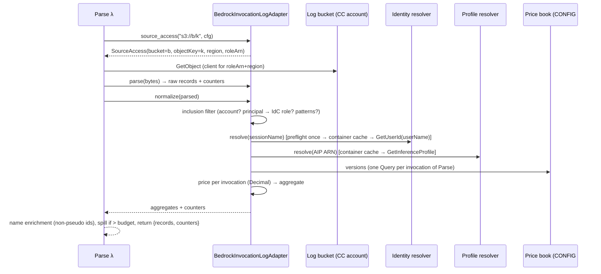

# Design — Claude Code on Amazon Bedrock Ingestion

Requirements: `requirements.md` in this directory. The authoritative author decisions are restated in §0. Every "Decision" (§24) is a resolution made inside those constraints. Where a decision is an interpretation of an author constraint rather than a literal reading, it is marked as such and its confirmation is recorded in §25.

## 0. Constraints this design must honor

1. **Topology.** Logs live in the customer's own S3 buckets. The buckets are usually in a dedicated Claude Code account, and possibly in the KCA account. There is one bucket per Region. KCA supports a list of locations and an optional cross-account role. Bucket, role and client are per-adapter. Kiro behavior does not change.
2. **Metadata only.** No bodies, no `PROMPT#`, no categorization. The author's "the adapter emits only activity records" is read as "the adapter emits no prompt records". The activity is delivered as usage aggregates through a new `token_usage` record kind rather than the seam's existing `activity` kind (interpretation, D2, Q6).
3. **Price at ingest.** USD is computed in `Decimal`. Tokens are persisted per user, day and model together with `priceVersion`. Edits apply forward only. Unpriced invocations are counted. AIPs are resolved through `bedrock:GetInferenceProfile`.
4. **Identity in the ETL.** IdC is mandatory. The session name (an IdC `UserName`) is resolved to an IdC UserId through the Identity Store, cached per run. Unresolved session names go to a URL-safe pseudo-user. There are no mappings, ledger, persistent identity cache or re-attribution.
5. **Inclusion.** Only `AWSReservedSSO_*` roles are ingested. Optional refinements are permission-set patterns and an AIP allowlist. Every drop is counted.
6. **Coexistence.** `clientType=CLAUDE_CODE`. Credits and USD are never summed. Tier and dormant logic use Kiro credit activity only. Claude Code gets its own engagement signal. Usage is pre-aggregated per `(user, day, model)`. A read model exposes the data. Kiro-only deployments see zero change.
7. **Process.** The spike and fixtures come first. The feature is enabled only after every checkpoint has landed (checkpoints 0–5 and tasks 6.1–6.8; task 6.9 is the enabling step).

## 1. Architecture overview

```
Claude Code account (dedicated)                         KCA account
┌──────────────────────────────────────┐   ┌──────────────────────────────────────────────────────┐
│ Developer: aws configure sso         │   │ Step Functions (Standard)                            │
│ AWS_PROFILE=… CLAUDE_CODE_USE_BEDROCK│   │  ListNewFiles ──► ListFiles λ                        │
│ ANTHROPIC_MODEL=<AIP ARN>            │   │     │  Kiro adapters: Kiro bucket (unchanged)        │
│        │ InvokeModelWithResponse…    │   │     │  Bedrock adapter: each location, via log role  │
│        ▼                             │   │     │   (+ retry ledger, seed, discovery status)     │
│ bedrock-runtime (us-east-1, …)       │   │     ▼  newFiles[{key:"s3://b/k", fileType:"bedrock_…"}]
│        │ invocation logging (per Rgn)│   │  ProcessFiles (Distributed Map, Express children)    │
│        ▼                             │   │     ParseAndNormalize ──► Parse λ                    │
│ S3 log bucket per Region             │◄──┼─────── GetObject (assumed log role)                  │
│  {p}/AWSLogs/{acct}/BedrockModel…    │   │        parse NDJSON → include → identity → price     │
│ AIPs (tagged)                        │◄──┼─────── GetInferenceProfile (cached)                  │
│ log role kiro-cost-analyzer-bedrock- │   │        aggregate (user, day, region, modelRefSk)     │
│   log-read (bedrock-log-role.yaml)   │   │     WriteToDynamoDB ──► Writer λ (record_kind        │
└──────────────────────────────────────┘   │        token_usage) → AnalyticsTable                 │
IdC / Identity Store (IdC home Region)     │     MarkFileProcessed (qualified key)                │
┌──────────────────────────────────────┐   │  RecordStatus λ → EXEC#.sourceCounters, retry ledger │
│ identitystore:GetUserId/DescribeUser │◄──┼─ Parse (IdentityStoreRoleArn creds, IdC home Region) │
└──────────────────────────────────────┘   │ Backend λ → read model → React UI (USD, separate)    │
                                           └──────────────────────────────────────────────────────┘
```

The state-machine definition is unchanged. `ItemSelector` passes only `bucket`, `key` and `fileType` (`template.yaml:1397-1400`), and every child receives the same top-level `$.listResult.bucket`. The Bedrock location therefore travels inside the **qualified key** `s3://{bucket}/{objectKey}`. The adapter decodes it in Parse (§4.3, D3).



## 2. Existing behavior this design relies on

| Fact | Evidence |
|---|---|
| Adapter protocol has `list_files/claim/read/parse/normalize`, plus per-adapter `record_kind` and `requires_content_placement` | `etl/sources/base.py:62-87` |
| `ParsedSource` is `records + metadata` only | `etl/sources/base.py:54-59` |
| The registry is built at import. The first claim wins. Unknown `fileType` raises `ValueError` | `etl/sources/__init__.py:48-60, 89` |
| Discovery passes one bucket and one client to every adapter, in one loop with no per-adapter error guard | `etl/sources/__init__.py:62-86`; `etl/list_handler.py:73-82` |
| ListFiles re-raises every exception; `ListNewFiles` retries `States.TaskFailed` twice and has no Catch | `etl/list_handler.py:139-149`; `template.yaml:1345-1355` |
| `ListNewFiles` has no `Parameters`/`InputPath`, so on `hasMore` iterations its input contains the previous `listResult` | `template.yaml:1345-1350, 1476-1482` |
| ListFiles returns a single top-level `bucket`. Kiro counts are explicit fields | `etl/list_handler.py:114-125` |
| Processed keys are a full Scan, filtered by exact key. Only `MarkFileProcessed` writes keys, with `status=SUCCESS`, after Writer; failed children write nothing | `etl/processing_tracker.py:11-33, 64-66`; `template.yaml:1440-1458` |
| `CheckEtlErrors` goes to a `Fail` state whenever `recordStatusResult.filesFailed > 0`, which skips `ListUncategorizedPrompts`, categorization and `ReconcileUsers` | `template.yaml:1491-1505`; `etl/record_status_handler.py:146-179, 382-385` |
| The no-new-files path writes `EXEC#` with a direct DynamoDB `putItem`, bypassing RecordStatus | `template.yaml:1357-1389` |
| ListFiles has no `ANALYTICS_TABLE` env var; Parse has neither `ANALYTICS_TABLE` nor any AnalyticsTable grant | `template.yaml:934-941, 993-1002` |
| Parse builds one Kiro cross-account client before adapter dispatch, and falls back to the event bucket | `etl/parse_handler.py:149-169` |
| Parse swallows identity-client construction errors (name enrichment is best-effort) | `etl/parse_handler.py:157-163` |
| Name enrichment calls `DescribeUser` for every userId, and caches only successes | `etl/parse_handler.py:203-212`; `etl/user_name_resolver.py:85-127` |
| The identitystore clients are built without `region_name` | `etl/sts_session.py:150-155`; `etl/user_name_resolver.py:78` |
| Parse returns all records inline; content placement offloads only prompt fields | `etl/parse_handler.py:214-234` |
| Writer dispatches by `record_kind` with no source conditional; it has no `s3:GetObject` grant | `etl/writer_handler.py:61-71`; `template.yaml:1092-1116` |
| The activity writer casts `estimatedCostUsd` to `float` | `etl/writer_handler.py:123` |
| The activity path SETs `clientType` on the user daily row (last writer wins) | `layers/shared/shared/analytics_writer.py:148-153` |
| `upsert_activity_summary` ADDs `activeDays` per call and SETs `lastActiveDate` | `layers/shared/shared/analytics_writer.py:424-465`; `etl/writer_handler.py:193, 275` |
| RecordStatus sums only `writeResult` and writes `EXEC#` with fixed counters | `etl/record_status_handler.py:146-179, 223-283` |
| `normalize_sk_value` replaces every character outside `[a-z0-9]` with `-`, collapses hyphens and truncates to 128 | `layers/shared/shared/sk_normalizer.py:30-50` |
| `get_config` uses one `GetParameters` call (≤ 10 names; 6 used today) and the `NONE` sentinel | `etl/config.py:92-123` |
| The STS helpers build clients without a region parameter | `etl/sts_session.py:85-155` |
| `scan_user_stats` filters `STATS#DAILY#`, and `daysActive += 1` per row; it filters, sorts and computes the summary over the full population before pagination | `backend/repository/analytics_repository.py:438-578` (`:516`, `:536-563`) |
| `_format_user` rebuilds every row from a fixed whitelist | `backend/handlers/usage_handler.py:86-105` |
| The single-user path returns `users: []` when there are no daily stats | `backend/handlers/usage_handler.py:116-128` |
| Activity summaries are read by exact `SK = ACTIVITY_SUMMARY` | `backend/repository/analytics_repository.py:722, 747, 776` |
| Tier projection is `credits / daysActive × 30`, and users without a tier are skipped | `backend/handlers/recommendation_engine.py:427-447`; `recommendation_handler.py:181-210` |
| Inactive subscribers use `ACTIVITY_SUMMARY.lastActiveDate` | `backend/handlers/recommendation_handler.py:221-273` |
| Engagement adds every activity summary as an idle user, and classification needs `totalMessages` | `backend/handlers/engagement_handler.py:93-125`; `segmentation_engine.py:52-83` |
| `parse_thresholds` falls back to all defaults when `validate_thresholds` fails on the whole document; PUT writes the body verbatim; the settings panel sends only the Kiro keys | `backend/handlers/segmentation_engine.py:190-210`; `engagement_handler.py:229-247`; `frontend/src/components/EngagementSettingsPanel.tsx:105-109` |
| Account breakdown percentages are computed over credits | `backend/handlers/account_usage_handler.py:68-113` |
| User details returns 404 when there are no daily stats and no prompts | `backend/handlers/user_details_handler.py:76-83` |
| Export reuses `handle_usage`, with credit-only CSV columns; JSON is `json.dumps(users)` | `backend/handlers/export_handler.py:9-27, 41-72` |
| The dashboard sends a `clientType` filter that the backend ignores | `frontend/src/pages/DashboardPage.tsx:96-101, 160-161`; `backend/handlers/usage_handler.py:212-223` |
| Git settings and Productivity use `/api/usage` rows as user-picker options; the user page defaults to the Productivity tab | `frontend/src/pages/GitSettingsPage.tsx:103-107`; `ProductivityPage.tsx:45-71`; `UserPage.tsx:103` |
| User links interpolate `userId` without encoding | `frontend/src/components/UsageTable.tsx:179-182`; `frontend/src/pages/UserPage.tsx:175` |
| Parse IAM: `DescribeUser` and `ListUsers` only; S3 on the source bucket only | `template.yaml:1005-1010, 1041-1048` |
| Identity Store role: `DescribeUser` and `ListUsers` only, pinned by a test | `identity-store-role.yaml:33-45`; `tests/test_identity_store_role_template.py:168-192` |
| Source role: fixed name, one bucket, one KMS key | `source-account-role.yaml:29, 50-61, 73-79` |
| Express child workflows; Parse and Writer each have a 300 s timeout | `template.yaml:990, 1085, 1404` |

## 3. Configuration model

### 3.1 Stack parameters (redeploy-only)

| Parameter | Type | Default | Meaning |
|---|---|---|---|
| `BedrockIngestionEnabled` | `String` (`true`/`false`) | `false` | Gates discovery (§17) |
| `BedrockLogBuckets` | `CommaDelimitedList` | `""` | Log bucket names; also scope IAM |
| `BedrockLogRegions` | `CommaDelimitedList` | `""` | Region per bucket; same length as buckets |
| `BedrockLogPrefixes` | `CommaDelimitedList` | `""` | Key prefix per bucket. Empty means none; one value applies to all |
| `BedrockLogRoleArn` | `String` | `""` | Optional log role in the Claude Code account. Its account is the reader account |
| `BedrockPermissionSetPatterns` | `CommaDelimitedList` | `""` | Optional glob patterns, e.g. `ClaudeCode*` |
| `BedrockInferenceProfileAllowlist` | `CommaDelimitedList` | `""` | Optional AIP ARNs or IDs |
| `BedrockBackfillStartDate` | `String` | `""` | `YYYY-MM-DD`. Empty means 30 days before each run's UTC date (sliding, D20) |
| `BedrockIdentityStoreRegion` | `String` | `""` | IdC home Region for `GetUserId`. Empty means the Lambda's Region |

The location list uses parallel lists (D4). CloudFormation cannot parse JSON or map over a list, so IAM scoping needs plain bucket names. Prefix and Region travel in parallel lists that the ETL zips and validates.

### 3.2 SSM

There is a single parameter, `/kiro-cost-analyzer/bedrock-ingestion`, written with `!Sub`. List parameters are pre-joined with `!Join`:

```json
{"enabled":"false","buckets":"b1,b2","regions":"us-east-1,us-west-2","prefixes":"bedrock-logs",
 "roleArn":"NONE","permissionSetPatterns":"","inferenceProfileAllowlist":"","backfillStartDate":"",
 "identityStoreRegion":""}
```

`get_config()` adds the path through a new env var, `SSM_BEDROCK_INGESTION`. That brings `GetParameters` to 7 names, below the limit of 10 (`etl/config.py:109-110`). A unit test asserts that the name count is ≤ 10.

### 3.3 `EtlConfig.bedrock`

A new frozen field, `bedrock: BedrockIngestionConfig`, holds `enabled: bool`, `configured: bool`, `locations: tuple[LogLocation, ...]`, `role_arn: str`, `permission_set_patterns: tuple[str, ...]`, `inference_profile_allowlist: frozenset[str]`, `backfill_start_date: date | None`, `identity_store_region: str` and `config_error: str | None`. `LogLocation` is `(bucket, prefix, region)`. The prefix is normalized to `""` or `"{segments}/"`, with no leading slash.

Parsing rules:
- An absent parameter, `NONE` or an empty value means disabled with no locations.
- Mismatched list lengths or an invalid date, Region or role ARN produce a `config_error` string, and `enabled` is forced to false. The error is surfaced through the discovery status item (§5.2) and `GET /api/config` (the Backend parses the same SSM value), and logged by ListFiles. It is not a ListFiles counter, because nothing carries ListFiles counters to `EXEC#` and the no-files path bypasses RecordStatus (`template.yaml:1357-1389`). Parse raises for Bedrock files only (§17). Kiro is unaffected because Kiro fields are parsed independently.

## 4. Seam extensions (checkpoint 1, no Bedrock behavior)

### 4.1 `etl/sources/base.py`

```python
@dataclass(frozen=True)
class SourceAccess:
    bucket: str
    object_key: str
    region: str        # "" = Lambda default region
    role_arn: str      # "" = execution role

@dataclass(frozen=True)
class DiscoveryContext:
    processed_keys: frozenset[str]
    now: datetime                       # UTC, injected for tests
    clients: "ClientFactory"            # §6
    cursors: Mapping[str, str]          # source_type → last key dispatched in this execution
    analytics_table: str                # ANALYTICS_TABLE env, "" when absent

@dataclass(frozen=True)
class ParsedSource:
    records: list[Any]
    metadata: PathMetadata
    counters: dict[str, int] = field(default_factory=dict)   # new, default empty
    context: Any = None                                       # new, adapter-private
```

Protocol additions are optional, and the registry supplies defaults when an adapter omits them:
- `list_files(bucket, config, s3_client=None, *, context: DiscoveryContext | None = None)`. The Kiro adapters accept and ignore `context`.
- `source_access(key, config) -> SourceAccess | None`. Kiro adapters return `None`, which means: use the event bucket and the Kiro client, as today.
- `enabled(config) -> bool`. It controls whether ListFiles reports the adapter's count field. Kiro adapters return `True`, and their fields are emitted as today.
- Class attributes with Kiro-preserving defaults: `dispatch_once_per_execution = False`, `failure_isolated = False`, `retry_ledger_pk: str | None = None`, `spill_records = False`.

### 4.2 ListFiles

1. Load `processed_keys` **before** discovery. This is a reorder with no observable change.
2. Read `cursors` from `event["listResult"]["cursors"]` when present (only on `hasMore` iterations of an execution that emitted them), build `DiscoveryContext` and pass it through `discover_files`. The registry loop is unchanged; the Bedrock adapter contains its own per-location error guard (§5.2), so no source-specific conditional is added to `list_handler.py` (#55 Requirement 1.5).
3. Keep `cfg.bucket_name` and the Kiro client for the Kiro adapters, exactly as `list_handler.py:73-82` does today.
4. Cap the batch by `MAX_BATCH_SIZE` **and** a serialized-size budget of 180,000 bytes, measured as `len(json.dumps(new_files))`. Kiro keys are about 120 bytes, so 500 Kiro files are about 60 KB and the budget never binds for Kiro (P1).
5. For each adapter with `dispatch_once_per_execution`, set `cursors[source_type]` to the last key of that adapter in the emitted batch (or carry the previous cursor forward when none was emitted). Add `cursors` to the result only when it is non-empty.
6. Add `totalBedrockLogFiles` to the result only when `adapter.enabled(cfg)` is true.

The Bedrock adapter returns its candidates sorted ascending and filtered to keys greater than its cursor, so the emitted Bedrock keys are always a prefix of that order and every Bedrock key is dispatched at most once per execution (Requirement 3.10, P13). This bounds the `hasMore` loop for Bedrock. The same loop for persistently failing Kiro files is pre-existing and out of scope.

### 4.3 Parse

```python
adapter = resolve_adapter(file_type)
access = adapter.source_access(key, cfg)            # None for Kiro
if access is None:
    client, read_bucket = <existing Kiro client>, bucket   # unchanged path
else:
    client, read_bucket = clients.s3(access.role_arn, access.region), access.bucket
...
parsed = adapter.parse(content, key, cfg)
records = adapter.normalize(parsed)
...
if adapter.spill_records and serialized_size(records) > 200_000:
    records = [spill_to_data_bucket(records, key)]   # {"recordsRef": "s3://{DATA_BUCKET}/etl-spill/{sourceFile}.json"}
result = {"records": records, "key": key, "fileType": file_type, "recordCount": record_count}
if parsed.counters: result["counters"] = parsed.counters
```

- The existing Kiro client is built only on the Kiro branch, preserving the current behavior for Kiro files. Bedrock files no longer assume the Kiro source role. This decouples a broken Kiro role from Bedrock ingestion.
- `_collect_user_ids` skips `is_pseudo_user(id)` (§9).
- `requires_content_placement=False` for Bedrock. The spill (D34) is a separate, whole-batch mechanism: the Writer's `token_usage` path detects the single `recordsRef` record and loads the batch (§12). `recordCount` is the number of aggregates either way.
- Unclaimed keys keep today's behavior: an empty result (`parse_handler.py:180-186`). §17 explains why the Bedrock adapter claims by key shape only and raises from `source_access` when the location is unknown.

### 4.4 Writer

There is a new record kind, `token_usage`, dispatched next to `activity` and `prompt` (`writer_handler.py:61-71`). The dispatch is a record-kind branch, not a source conditional, which matches #55 Requirement 1.5. Because the token writer needs per-file grouping, it receives the whole record list (§12). Writer returns `alreadyApplied` in its result only when it is greater than 0.

### 4.5 RecordStatus

- `_compute_summary` also sums `result["parseResult"]["counters"]` and `writeResult.alreadyApplied` per `fileType` → source type, and counts `filesFailed` per source type. A failed child's source type comes from its `Input.fileType` (the normalized error item already decodes `Input`). The child Output already contains `parseResult` (`ResultPath: $.parseResult`).
- **Failure isolation (D29).** The `filesFailed` value returned to the state machine counts failures of adapters with `failure_isolated = False` (the Kiro adapters) plus manifest read failures, exactly as today. Failures of isolated adapters (Bedrock) are reported in `sourceCounters[...].filesFailed`, included in `errors` after the Kiro errors, and make the persisted `status` `ERROR`, but they do not route `CheckEtlErrors` to `EtlFilesFailed`. Kiro categorization and ReconcileUsers therefore still run (Requirement 11.5). For Kiro-only runs the output is identical. No state-machine change is needed.
- **Retry ledger (D30).** For each failed child of an adapter with `retry_ledger_pk`, RecordStatus runs `UpdateItem` on `PK={retry_ledger_pk}`, `SK={qualifiedKey}`: `ADD attempts 1`, `SET lastFailedAt, lastErrorClass, executionName`, `SET firstFailedAt = if_not_exists(...)`. Ledger write errors are logged and swallowed, like the history write; the residual risk is R13.
- `_write_execution_record` adds `sourceCounters` as a map only when it is non-empty. The SSM `etl-status` payload (4 KB) is unchanged in shape (D26).

## 5. The Bedrock adapter

File: `etl/sources/bedrock_invocation_log.py`. Pure helpers live in `etl/sources/bedrock/`: `keys.py`, `log_parser.py`, `principal.py`, `inclusion.py`, `model_ref.py`, `aggregate.py`, `identity.py`, `profiles.py`, `discovery_state.py` and `services.py`. Shared pricing and pseudo-user code lives in `layers/shared/shared/`: `bedrock_pricing.py`, `bedrock_price_seed.json` and `pseudo_users.py`. These modules use the dual import pattern of `etl/sources/kiro_prompt_log.py:8-19`.

| Attribute | Value |
|---|---|
| `source_type` | `bedrock_invocation_log` |
| `aliases` | `()` |
| `wire_type` | `bedrock_invocation_log` |
| `record_kind` | `token_usage` |
| `count_key` | `totalBedrockLogFiles` |
| `requires_content_placement` | `False` |
| `dispatch_once_per_execution` | `True` |
| `failure_isolated` | `True` |
| `retry_ledger_pk` | `BEDROCK#RETRY` |
| `spill_records` | `True` |
| Registry position | last |

### 5.1 Key layout and claim

AWS layout: `{prefix}AWSLogs/{accountId}/BedrockModelInvocationLogs/{region}/{YYYY}/{MM}/{DD}/{HH}/{name}.json.gz`. Large bodies go under a `data/` segment, and AWS writes a `…/amazon-bedrock-logs-permission-check` object. The spike pins the exact names (S2).

`claim(key, cfg)` returns true iff all of the following hold:
1. `key` starts with `s3://` and decodes to `(bucket, objectKey)`.
2. `objectKey` matches the regex `^(?P<p>.*)AWSLogs/(?P<acct>\d{12})/BedrockModelInvocationLogs/(?P<region>[a-z0-9-]+)/(?P<y>\d{4})/(?P<m>\d{2})/(?P<d>\d{2})/(?P<h>\d{2})/[^/]+\.json\.gz$`.
3. No path segment equals `data`, and the basename does not contain `permission-check`.

The claim deliberately does **not** require the location to still be configured (D21, §17). Kiro keys never start with `s3://`, and Kiro claims require their configured prefixes (`kiro_prompt_log.py:40-42`; `kiro_csv.py:39`), so the claims are disjoint (P2).

`source_access(key, cfg)` decodes the key, finds the location with an equal bucket and a matching prefix, and returns `SourceAccess(bucket, objectKey, location.region, cfg.bedrock.role_arn)`. IF no location matches THEN it raises `BedrockLocationNotConfigured`.

### 5.2 Discovery (`list_files`)

`list_files` returns `[]` and touches nothing when `not cfg.bedrock.enabled` (P1). Otherwise:

1. **Reader account.** The account of `role_arn`, or the KCA account (`sts:GetCallerIdentity`, once per container, no IAM grant needed) when the role is `NONE` (D31).
2. **Seed** (§10.1), inside an error guard.
3. **Retry ledger.** `Query PK=BEDROCK#RETRY`. Entries whose key is in `processed_keys` are deleted. The remaining entries whose location is still configured become candidates; the others are kept and counted as `orphaned` in the status.
4. **Per location**, inside a `try/except Exception` guard (Requirement 2.9):
   1. `client = clients.s3(role_arn, location.region)`.
   2. `base = f"{prefix}AWSLogs/{readerAccount}/BedrockModelInvocationLogs/{region}/"`. Only the reader account is listed; there is no account discovery.
   3. **Watermark**: the maximum `(y, m, d)` among `context.processed_keys` that start with `s3://{bucket}/{base}`.
   4. `start = max(backfill_start, watermark − 2 days)`, or `backfill_start` when there is no watermark. `end = context.now.date()` (UTC). `backfill_start` is `BedrockBackfillStartDate` or `now − 30 days` (D20).
   5. For each day `d` in `[start, end]`, run `ListObjectsV2(Prefix=f"{base}{YYYY}/{MM}/{DD}/")`, paginated, and keep claimed keys qualified as `s3://{bucket}/{key}`.
   6. On an exception, log `Bedrock discovery failed` with the error class, record it for the location, and return no window keys for it. AssumeRole is never retried with the Lambda's own credentials (Requirement 2.6).
5. `candidates = sorted((window keys ∪ ledger keys) − processed_keys)`, filtered to keys greater than `context.cursors.get(source_type)`.
6. **Discovery status.** `PutItem PK=BEDROCK#DISCOVERY`, `SK=STATUS` with `updatedAt`, `configError`, `retryLedgerSize`, `retryMaxAttempts`, `orphaned`, `seedError`, and `locations` (a map keyed by `{bucket}/{prefix}@{region}` with `lastListedAt`, `lastErrorAt`, `lastErrorClass`). A status write error is logged and swallowed. When the configuration is invalid (`config_error`), only this item is written.

Late delivery is covered by the two-day overlap, and failed files by the ledger (P13). ProcessedFiles already de-duplicates files.

**Cost.** Steady state is locations × 3 day-prefixes of List calls per run, plus one ledger Query and one status PutItem. The first run is about 30 day-prefixes per location.

### 5.3 Read and parse

- `read(bucket, key, s3_client)` performs a GetObject of `objectKey` from the decoded qualified key, and returns bytes.
- `log_parser.parse_invocation_log(data: bytes, now: datetime) -> (list[RawInvocation], counters)`:
  - Decompress with `gzip.decompress`, which handles multi-member files. A gzip error raises, because a corrupt file is a file failure and goes to the retry ledger.
  - Decode as UTF-8 with `errors="replace"`, then split lines and skip blank ones.
  - Run `json.loads` on each line. Failures, non-objects, missing required fields, invalid token values and timestamps more than 15 minutes after `now` are counted in `malformedRecords`.

`RawInvocation` is a frozen dataclass of extracted fields only:

| Field | Source path | Notes |
|---|---|---|
| `timestamp` | `timestamp` | ISO-8601. Converted to UTC; an offset-less value is UTC; `date = timestamp.date()` |
| `request_id` | `requestId` | De-duplicated within the file |
| `account_id` | `accountId` | Compared with the reader account (§7) |
| `region` | `region` | Calling Region. Used for pricing and the key |
| `inference_region` | `inferenceRegion` | Optional; informational |
| `operation` | `operation` | Allowed: `InvokeModel`, `InvokeModelWithResponseStream`, `Converse`, `ConverseStream` |
| `model_id` | `modelId` | Raw value |
| `principal_arn` | `identity.arn` | |
| `input_tokens` | `input.inputTokenCount` | Non-cached input (prompt-caching docs). `None` when absent |
| `cache_read_tokens` | `input.cacheReadInputTokenCount` | Absent → 0, counted in `cacheFieldsAbsent` |
| `cache_write_tokens` | `input.cacheWriteInputTokenCount` | 5m + 1h combined. Absent → 0, counted |
| `output_tokens` | `output.outputTokenCount` | Top-level count only. The stream's `message_start` usage is provisional. `None` when absent |
| `error_code` | `errorCode` | Non-null → failed |

Required fields are `timestamp`, `requestId`, `accountId`, `region`, `modelId`, `identity.arn` and `operation` (Requirement 4.1). Missing token fields on a failed record are allowed. On a successful record a missing `inputTokenCount` or `outputTokenCount` becomes 0 for that bucket and the invocation is unpriced with `tokenCountsAbsent` (Requirement 4.10).

The extractor reads **only** the paths above. `inputBodyJson`, `outputBodyJson`, `*BodyS3Path` and `requestMetadata` are never accessed, and no field of `RawInvocation` can hold them (P4).

### 5.4 Normalize pipeline

`normalize(parsed)` runs:

1. **Dedupe** by `request_id`, keeping the first occurrence and counting the rest in `duplicateRecords`.
2. **Operation filter**, counting rejects in `droppedUnsupportedOperation`.
3. **Inclusion filter** (§7). The result is `Included(principal)` or `Dropped(reason)`. Included invocations are counted in `includedInvocations`.
4. **Failure split.** When `error_code` is set: `failedInvocations += 1`, no tokens and no price (Requirement 4.9, subject to S8). The invocation still contributes to the aggregate key, so failures are visible per user and day, but such an aggregate has `invocations = 0` unless the key also has successes, and only aggregates with `invocations > 0` count as activity (§12, Requirement 16.7).
5. **Identity** (§8). Resolve `principal.session_name` to a `userId`, or to a pseudo-user.
6. **Model reference** (§10.2). `classify_model_id(model_id, region)` returns a `ModelRef`, resolving AIPs (§10.3).
7. **Pricing** (§10.5), per successful invocation. The result is `(cost: Decimal | None, unpriced_reason | None, long_context: bool)`.
8. **Aggregate** by `(userId, date, region, modelRefSk)` (§5.5).
9. Emit the aggregates as dicts (§5.6). Counters are merged into `parsed.counters`.

The services (identity resolver, profile resolver, price book) come from `services.py`. A factory keyed by the config identity caches them per container. The adapter constructor accepts an injected factory, which tests use (§21).

### 5.5 Pre-aggregation key

`(userId, utcDate, region, modelRefSk)`, where:
- `modelRef.key` is `aip-{profileId}` for an AIP, the lowercased system-profile ID or base-model ID otherwise, or `provisioned-{id}` for a provisioned model;
- `modelRefSk = normalize_sk_value(modelRef.key)[:111] + "-" + sha256(modelRef.key)[:16]`. `normalize_sk_value` maps `.` and `:` to `-` (`sk_normalizer.py:40-50`), so the SK segment alone is lossy; the hash suffix makes the encoding collision-free in practice, and the aggregation key is the same value as the SK segment (P18). Readers use the `modelRef` attribute, never the SK, for display;
- `region` is the record's calling Region.

This refines the author's `(user, day, model)` key. The price key `(baseModelId, scope, region)` is a deterministic function of `(modelRef, region)`, because an AIP's backing model cannot be changed after creation. A recompute also needs to know which tokens were billed at long-context rates, because that is decided per invocation (Requirement 9.6). The aggregate therefore stores the long-context subset of each token bucket, `longContextInvocations` and the threshold used (Requirement 10.1). With these fields, recomputing from the stored aggregate equals the ingest cost for the same version (P17); a later version with a different threshold cannot be applied exactly, which is documented. Keeping the AIP ID also preserves the team dimension for the out-of-scope follow-up at negligible cost (D9).

### 5.6 Normalized record (Writer envelope)

```json
{
  "userId": "94482488-3041-7026-18f3-be45837cd0e4",
  "date": "2026-10-05",
  "clientType": "CLAUDE_CODE",
  "accountId": "111111111111",
  "region": "us-east-1",
  "modelRef": "aip-abc123def456",
  "modelRefSk": "aip-abc123def456-3f9a1c2b7d4e5f60",
  "rawModelId": "arn:aws:bedrock:us-east-1:111111111111:application-inference-profile/abc123def456",
  "inferenceProfileName": "claude-code-sonnet",
  "baseModelId": "anthropic.claude-sonnet-4-5-20250929-v1:0",
  "priceScope": "geo",
  "inputTokens": 1200, "outputTokens": 3400, "cacheReadTokens": 250000, "cacheWriteTokens": 18000,
  "longContextInvocations": 0,
  "invocations": 37, "failedInvocations": 1,
  "unpricedInvocations": 0,
  "estimatedCostUsd": "0.21534000",
  "priceVersion": "seed-2026-10-01",
  "sourceFile": "9f2c4e1a7b3d5c60",
  "isPseudoUser": false
}
```

- `invocations` counts successful, included invocations.
- Unpriced reasons are emitted as `unpriced{Reason}` keys only when non-zero (`unpricedNoPriceEntry`, `unpricedNoPriceVersion`, `unpricedAipUnresolved`, `unpricedAipForeignAccount`, `unpricedProvisioned`, `unpricedTokenCountsAbsent`).
- When `longContextInvocations > 0`, the record adds `longContextInputTokens`, `longContextOutputTokens`, `longContextCacheReadTokens`, `longContextCacheWriteTokens` and `longContextThreshold`.
- `estimatedCostUsd` is present only when at least one invocation in the aggregate was priced. `priceVersion` is `null` only when no version applies (`noPriceVersion`).
- `sourceFile` is the first 16 hex characters of `sha256(qualifiedKey)`. It is the idempotency token (§12).
- Pseudo-user records add `pseudoAccountId` and `pseudoPermissionSet`.

## 6. Multi-region and cross-account clients

`ClientFactory` lives in `etl/sts_session.py` and adds alongside the existing functions without changing them:

- `s3(role_arn, region)` and `bedrock(role_arn, region)` return clients built from `_assume_role` credentials when `role_arn` is set, or from default credentials otherwise. They always pass `region_name` explicitly. An AssumeRole error raises; there is no fallback to default credentials.
- `identitystore(region)` builds the client from `cfg.identity_store_role_arn` credentials (or default credentials) with `region_name = cfg.bedrock.identity_store_region or the Lambda Region`, **without** the `None`-on-error fallback that Parse uses for Kiro name enrichment (`parse_handler.py:157-163`). Bedrock attribution must fail loudly (§8.4). The existing Kiro helpers are unchanged.
- There is a per-container cache keyed by `(service, role_arn, region)`. Credentials are refreshed when they are within 5 minutes of `Expiration` (`DurationSeconds=3600`, `sts_session.py:56-60`).
- Each client uses botocore `retries={"mode": "adaptive", "max_attempts": 5}`, so throttling backs off before surfacing.

## 7. Inclusion filter

`principal.parse_principal(arn) -> Principal` is a pure function. It never raises.

- `kind` is one of `assumed_role`, `iam_user`, `root`, `federated_user` or `unknown`.
- `assumed_role` comes from `arn:{partition}:sts::{acct}:assumed-role/{roleName}/{sessionName}`. Partitions `aws`, `aws-us-gov` and `aws-cn` are accepted.
- An IdC role matches `^AWSReservedSSO_(?P<ps>[\w+=,.@-]+)_(?P<suffix>[0-9a-f]{16})$` on the role name. The greedy group and the anchored suffix handle permission-set names that contain underscores. The suffix length and alphabet are provisional and pinned by spike S10 with a fixture-driven assertion. `permission_set` is `ps`.

`inclusion.evaluate(record, principal, reader_account, cfg) -> Outcome` returns the first matching reason:

1. `record.account_id != reader_account` → `droppedForeignAccount` (D31)
2. `kind == unknown` → `droppedUnparseablePrincipal`
3. `kind != assumed_role` → `droppedNotAssumedRole`. This covers IAM users, which include long-term Bedrock API keys.
4. The role is not IdC → `droppedNotIdcRole`. This covers this stack's categorizer and AgentCore roles and every service role.
5. Patterns are set and none matches `permission_set` (`fnmatch.fnmatchcase`) → `droppedPermissionSetFilter`.
6. An allowlist is set, and the raw `modelId` is not an allowlisted AIP ARN or ID → `droppedInferenceProfileFilter`. This check runs on the raw ID and needs no AIP resolution.
7. Otherwise → `Included`.

Every outcome increments exactly one counter (P5). No self-invocation list exists (Requirement 5.7). In the dedicated-account topology the stack's own calls are not in the logs at all. In the same-account topology they are dropped by rule 4.

The assumed-role ARN in `identity.arn` carries no IAM path, so the filter trusts the role **name**. IdC-provisioned roles live under `/aws-reserved/sso.amazonaws.com/`, but a principal allowed to create IAM roles in the Claude Code account could create a same-named role elsewhere and choose any session name. v1 documents this assumption and recommends an SCP that denies `iam:CreateRole` for `AWSReservedSSO_*` names (Requirement 20.1). Verifying the path with `iam:GetRole` is a possible later hardening (R11).

## 8. Identity resolution

### 8.1 Lookup chain

`identity.IdentityResolver.resolve(session_name, principal) -> Resolution`:

1. **Preflight**, once per container: `ListUsers(IdentityStoreId=…, MaxResults=1)` on the identity client (§6). `ListUsers` is already granted to Parse and to the Identity Store role. A failure (wrong Region, wrong store ID, AccessDenied, an unavailable KMS key) raises `BedrockIdentityNotReachable`; no "not found" result is accepted until the preflight passes (Requirement 6.8).
2. **Container cache.** A dict `session_name → Resolution(userId | NotFound)` for the life of the container, including negative results (Requirement 6.3). There is no persistent cache (D33).
3. **`identitystore:GetUserId`** with `AlternateIdentifier.UniqueAttribute` `{AttributePath: "userName", AttributeValue: session_name}`. No other attribute path is tried (Requirement 6.1).
4. **Classification.** `ResourceNotFoundException` with `ResourceType == "USER"` and no `Reason` → `NotFound`. Every other variant (`IDENTITY_STORE`, a `Reason` such as an unavailable customer-managed KMS key) is a configuration error and raises (Requirement 6.4).

Case behavior of `GetUserId` for `userName` is pinned by spike S4; the call uses the session name as logged.

Steady-state cost: one `GetUserId` per distinct session name per Parse container, plus one `ListUsers` preflight per container (§19).

### 8.2 Why no persistent identity cache

A persistent `session name → UserId` cache would be a durable per-principal identity table that the author did not ask for, and it would make attribution non-deterministic: if a user name is deleted, renamed or reassigned, a cached entry keeps returning the old UserId until it expires, and there is no re-attribution job. Resolving against the Identity Store on every run, cached only in the container, makes the result a function of the Identity Store state at ingest time. A `userName` GSI on `UserNamesTable` was also rejected, because it would change Kiro rows (Requirement 11.1).

Known limits (Requirement 6.9, documented): a user renamed between sign-in and ingestion resolves to `NotFound` and becomes unattributed; a reused user name resolves to its current holder; an identity source whose session name differs from `UserName` (spike S4, Requirement 1.7) is unsupported.

### 8.3 Merge with Kiro

The resolved UserId is the Identity Store UserId. Kiro `userId` values are the same IDs, resolved by `DescribeUser(UserId=…)` (`user_name_resolver.py:94-97`). Writes therefore land in the same `USER#{userId}` partition. The existing name enrichment then calls `DescribeUser` for CLAUDE_CODE-only users and caches them in `UserNamesTable`. ReconcileUsers can then tombstone them like any IdC user (`etl/user_reconciler.py:25-62`). Self-view works, because `custom:kiro_user_id` holds the same IdC UserId (`backend/handler.py:143-151`).

### 8.4 Error policy

| Condition | Effect |
|---|---|
| `ResourceNotFoundException`, `ResourceType=USER`, no `Reason`, after a passing preflight | Pseudo-user; `unmappedInvocations += n`. The name is logged once per container and truncated to 64 characters |
| Any other `ResourceNotFoundException` variant, or a failed preflight | Raise `BedrockIdentityNotReachable`. The file fails with the hint "check IdentityStoreId, BedrockIdentityStoreRegion and the KMS key policy" |
| `AccessDeniedException` | Raise. The file fails with the hint "Identity Store role needs identitystore:GetUserId" |
| Throttling after adaptive retries, or another error | Raise |
| `identity_store_id` not configured | Raise `BedrockIdentityNotConfigured`. IdC is mandatory (P1) |

Failing the file is safe and contained:
- the file is not marked processed (`MarkFileProcessed` runs only after Writer), and the Writer has not run;
- RecordStatus puts the key in the retry ledger, and every later run lists it until it succeeds, regardless of the watermark (§5.2, Requirement 3.9);
- the failure is isolated from the Kiro error check, so categorization and ReconcileUsers still run (§4.5, Requirement 11.5).

Misattribution, on the other hand, would be permanent because there is no re-attribution (D10).

## 9. Pseudo-users

- **Builder** (`shared/pseudo_users.py`): `build_pseudo_user_id(account_id, permission_set) = f"unmapped-{account_id}-{slug(permission_set)}"`.
  - `slug` lowercases the name, replaces runs of characters outside `[a-z0-9]` with a single `-`, strips leading and trailing `-`, truncates to 96 characters, and becomes `unknown` when empty.
  - IF the slug was changed or truncated THEN the builder appends `-{first 8 hex of sha256(permission_set)}`, so different permission sets never collide.
- **Predicate**: `is_pseudo_user(uid)` is true iff `uid` matches `^unmapped-\d{12}-[a-z0-9-]+$`. IdC UserIds are UUID-shaped, or a 10-hex prefix plus a UUID, and never begin with `unmapped-` (P9).
- **Granularity**: one pseudo-user per `(account, permission set)` (D11). The session name is not encoded in the ID. Unresolved names appear in logs and in counters, not in item keys.
- **Display**: the API returns `isPseudoUser: true`, `pseudoAccountId` and `pseudoPermissionSet`. The UI renders `users.unattributed.label` ("Unattributed — {{permissionSet}} ({{accountId}})"). No name is stored.
- **Exclusions**: per §14.

## 10. Pricing

### 10.1 Storage

Storage is DynamoDB (`AnalyticsTable`) (D6):

| PK | SK | Attributes |
|---|---|---|
| `CONFIG#BEDROCK_PRICING` | `VERSION#{effectiveFrom}#{versionId}` (admin) or `VERSION#1970-01-01#seed` (seed) | `versionId`, `effectiveFrom` (`YYYY-MM-DD`), `createdAt`, `createdBy`, `source` (`seed`/`admin`), `currency` (`USD`), `cacheWriteTtlAssumption` (`5m`/`1h`), `entries` (L of M), `sourceUrl`, `notes` |

An entry looks like this. Rates are USD per 1M tokens, stored as decimal strings:

```json
{"baseModelId":"anthropic.claude-sonnet-4-5-20250929-v1:0","scope":"geo","region":"*",
 "input":"3.30","output":"16.50","cacheRead":"0.33","cacheWrite5m":"4.125","cacheWrite1h":"6.60",
 "longContext":{"thresholdInputTokens":200000,"input":"6.60","output":"24.75","cacheRead":"0.66",
                "cacheWrite5m":"8.25","cacheWrite1h":"13.20"}}
```

The figures above are illustrative only. Seed values come from spike task 0.6.

**Seed.** `layers/shared/shared/bedrock_price_seed.json` carries `versionId: seed-{capturedOn}`, `effectiveFrom: 1970-01-01`, `sourceUrl` and `capturedOn`. When ingestion is enabled, the Bedrock adapter's `list_files` (§5.2 step 2, not `list_handler.py`) runs `PutItem` on the fixed key `VERSION#1970-01-01#seed` with `ConditionExpression=attribute_not_exists(PK)`. The condition makes it a no-op once a seed exists, whether or not admin versions were created first (Requirement 8.4), so there is never more than one seed. Once materialized, the seed is immutable. A later code release with a newer seed file does **not** change a deployment's prices. The admin UI shows "a newer bundled price table is available" when the bundled `versionId` differs from the materialized seed, and the admin applies it as a new version (§10.6). A seed write error is recorded in the discovery status and does not fail ListFiles.

### 10.2 Model-ID classification

`model_ref.classify_model_id(model_id, region) -> ModelRef(kind, key, base_model_id, scope, profile_id)`:

| Input shape | kind | scope | base |
|---|---|---|---|
| `anthropic.claude-…` (no profile prefix), or `arn:…:foundation-model/{id}` | `base` | `in-region` | `{id}` |
| `{geo}.anthropic.…`, where `geo ∈ {us, eu, apac, jp, au, ca, us-gov}` (the list is extensible and pinned by S6) | `system_profile` | `geo` | strip `{geo}.` |
| `global.anthropic.…` | `system_profile` | `global` | strip `global.` |
| `arn:…:inference-profile/{sysId}` | `system_profile` | as above, by `{sysId}` | as above |
| `arn:…:application-inference-profile/{id}` | `application_profile` | resolved (§10.3) | resolved |
| `arn:…:provisioned-model/{id}` | `provisioned` | n/a | n/a (unpriced, `provisioned`) |
| anything else | `unknown` | n/a | n/a (unpriced, `noPriceEntry`) |

The ARN parser accepts empty Region and account fields (`arn:aws:bedrock:::foundation-model/{id}`). This single canonicalizer is used for both pricing and display. No `STATS#MODEL#` row is written for Claude Code (D24), so the split-row problem of `writer_handler.py:253-257` does not arise.

### 10.3 AIP resolution

`profiles.ProfileResolver.resolve(arn)` works as follows:
- It parses the region, account and profile ID from the ARN.
- IF the ARN's account differs from the reader account THEN it returns unpriced `aipForeignAccount` without calling the API (Requirement 9.4). `GetInferenceProfile` has no cross-account mode.
- Otherwise it calls `bedrock(role_arn, region).get_inference_profile(inferenceProfileIdentifier=arn)`.
- It caches the result in the container per ARN with no expiry, because an AIP's models are immutable once created.
- From the response it takes `inferenceProfileName`, `type` and `models[].modelArn`.

Base model: the `foundation-model/{id}` of the model ARNs. They must all be equal; otherwise the AIP is treated as unresolved.

Scope rule (D19 and spike S5):
- any model ARN with an empty Region field (`arn:aws:bedrock:::foundation-model/…`, the documented global form) → `global`;
- otherwise more than one distinct Region → `geo`;
- exactly one Region → `in-region`.

The `models` array is capped at 5 items, so the Region count is a heuristic for geo; the empty-Region discriminator is the primary signal for global. IF S5 does not confirm the empty-Region form THEN a multi-Region AIP is priced as `geo` with `priceScopeAssumed: true` (Q2).

Errors:
- `ResourceNotFoundException` (deleted AIP) or `ValidationException` (input validation failed; a retry cannot succeed) → unpriced, `aipUnresolved`. The allowlist still matches on the raw ARN.
- `AccessDenied`, throttling or another error on a same-account AIP → raise (the file fails and goes to the retry ledger). Pricing is fixed at ingest, so a transient error must not become a permanent `unpriced`.

### 10.4 Version selection

`select_version(versions, d) = max(v for v in versions if v.effectiveFrom ≤ d, key=effectiveFrom)`, or `None` when no version is effective on `d`. `effectiveFrom` is unique across versions (§10.6), so there are no ties. `None` makes every invocation of that day unpriced with `noPriceVersion` and `priceVersion = null` (Requirement 9.8). Parse runs one `Query` per invocation of Parse on `PK=CONFIG#BEDROCK_PRICING`. The partition is small, typically under 20 items. There is no container cache (D8). The versions are loaded once per file and reused for every invocation in that file.

### 10.5 Price computation

`shared/bedrock_pricing.price_invocation(tokens, entry, ttl) -> (Decimal, long_context: bool)` is a pure function, using a `decimal` context with `prec=28`:

```
lc    = entry.longContext and (in + cacheRead + cacheWrite) > entry.longContext.threshold
rates = entry.longContext if lc else entry
cw    = rates.cacheWrite1h if ttl == "1h" else rates.cacheWrite5m
cost  = (in·rates.input + out·rates.output + cr·rates.cacheRead + cw_tokens·cw) / 1_000_000
```

- Lookup: `(base, scope, region)`, then `(base, scope, "*")`. No match → unpriced, `noPriceEntry`.
- When `lc` is true, the invocation's tokens are also added to the aggregate's long-context subset counters (§5.6).
- The aggregate cost is the sum of per-invocation costs, quantized once to `Decimal("0.00000001")` with `ROUND_HALF_EVEN`, and emitted as `str`. No intermediate rounding occurs (P7).
- `priceVersion` is the selected version's ID. With the forward-only rule (§10.6), every invocation of a given UTC date selects the same version. That makes `priceVersion` a function of the date and lets the aggregate key omit it.

### 10.6 Forward-only editing

API (Admins only), modeled on `/api/config/tier-pricing` (`backend/handler.py:406-426`):

- `GET /api/config/bedrock-pricing` → `{versions: [...], current, bundledSeed: {versionId, capturedOn}, today}`
- `POST /api/config/bedrock-pricing/versions` → body `{effectiveFrom, cacheWriteTtlAssumption, entries, notes}`. Validation runs `validate_bedrock_pricing` (pure). It requires `effectiveFrom > today (UTC)` and that no existing version has the same `effectiveFrom` (the admin deletes the future one first). The `versionId` is generated as `v{effectiveFrom}-{6 hex}`. The write is a `PutItem` with `attribute_not_exists`.
- `DELETE /api/config/bedrock-pricing/versions/{versionId}` → allowed only while `effectiveFrom > today`. Otherwise it returns 409.

**Invariant (P8).** For any UTC date `D`, the set of versions with `effectiveFrom ≤ D` is fixed once `D` begins:
- creation requires `effectiveFrom > creation date`;
- deletion requires `effectiveFrom > deletion date`;
- usage for `D` can only be ingested on or after `D` (timestamps more than 15 minutes in the future are malformed, Requirement 4.11).

Hence edits never reprice ingested usage, and late files for a past day get the same version as earlier files for that day. The UI states that edits apply from their effective date and that already-ingested usage is not recomputed. The stored tokens, long-context subsets and `priceVersions` make a future recompute job possible (out of scope).

## 11. Data model

New items. Every new attribute is written only by the Bedrock path.

| PK | SK | Writer | Attributes |
|---|---|---|---|
| `USER#{userId}` | `STATS#TOKENS#CLAUDE_CODE#{date}#{region}#{modelRefSk}` | Writer | ADD: `inputTokens`, `outputTokens`, `cacheReadTokens`, `cacheWriteTokens`, `longContext*` subsets, `longContextInvocations`, `invocations`, `failedInvocations`, `unpricedInvocations`, `unpriced{Reason}`, `estimatedCostUsd` (N), `priceVersions` (SS). SET: `clientType`, `date`, `region`, `modelRef`, `accountId`, `baseModelId`, `priceScope`, `priceScopeAssumed`, `longContextThreshold`; `if_not_exists`: `rawModelId`, `inferenceProfileName`. Pseudo-users also get `isPseudoUser`, `pseudoAccountId` and `pseudoPermissionSet` |
| `GLOBAL` | `STATS#TOKENS#CLAUDE_CODE#{date}#{region}#{modelRefSk}` | Writer | The same ADD counters and SET/`if_not_exists` model attributes (`modelRef`, `baseModelId`, `priceScope`, `inferenceProfileName`, `rawModelId`) and `priceVersions` (SS), summed per file, plus `pseudoEstimatedCostUsd` and `pseudoInvocations` |
| `BEDROCK#APPLIED#{sourceFile}` | `{itemPK}#{itemSK}` | Writer | `appliedAt`. One idempotency marker per (file, aggregate item) (D12) |
| `USER#{userId}` | `ACTIVITY_SUMMARY#CLAUDE_CODE` | Writer (non-pseudo, `invocations > 0` only) | `firstActiveDate` (if_not_exists), `lastActiveDate` (conditional greater) |
| `CONFIG#BEDROCK_PRICING` | `VERSION#…` | Bedrock adapter in ListFiles (seed), Backend | §10.1 |
| `BEDROCK#RETRY` | `{qualifiedKey}` | RecordStatus (upsert), ListFiles (delete when processed) | `attempts`, `firstFailedAt`, `lastFailedAt`, `lastErrorClass`, `executionName` |
| `BEDROCK#DISCOVERY` | `STATUS` | Bedrock adapter in ListFiles | §5.2 step 6 |
| `ETL_STATUS` | `EXEC#{executionName}` | RecordStatus | Adds `sourceCounters` (M) only when non-empty |

SK safety:
- `modelRefSk` (§5.5) contains only `[a-z0-9-]`, is at most 128 characters, and is collision-free across distinct `modelRef` values (P18). The full SK stays well below the 1,024-byte limit.
- The prefix `STATS#TOKENS#` does not begin with `STATS#DAILY#`, so `scan_user_stats`, `get_user_daily_stats` and `get_global_daily_stats` never see these items.
- `ACTIVITY_SUMMARY#CLAUDE_CODE` is not equal to `ACTIVITY_SUMMARY`, so the three Kiro summary readers (`analytics_repository.py:722, 747, 776`) never see it (D14).
- `BEDROCK#…` partitions are never matched by any Kiro reader, which use `USER#`, `GLOBAL`, `ETL_STATUS` and `CONFIG#` keys.

Unchanged and not written by Claude Code: `STATS#DAILY#` (user and GLOBAL), `STATS#TIER#`, `STATS#CLIENT#`, `STATS#MODEL#`, `PROMPT#`, the Kiro `ACTIVITY_SUMMARY`, and `UserNamesTable` rows for pseudo-users.

Item size: aggregate items have a fixed attribute set, because the idempotency marker lives in separate items. Marker items are about 150 bytes each, one per aggregate item per file. Their count grows linearly with ingested aggregates and is measured from the spike's files-per-day figure (S12, R9).

## 12. Writer (`token_usage`)

`_write_token_usage_records(writer, records, logger)` is invoked once per file with the whole batch:

0. **Spill.** IF the batch is a single `{"recordsRef": …}` record THEN load the aggregates from the data bucket (`s3:GetObject` on the `etl-spill/` prefix, Requirement 18.4).
1. **Per record.** `AnalyticsWriter.apply_token_usage(user_id, sk, record, source_file)` runs one `TransactWriteItems` with two actions: a `Put` of the marker `PK=BEDROCK#APPLIED#{sourceFile}`, `SK=USER#{userId}#{sk}` with `attribute_not_exists(PK)`, and an `Update` of the aggregate item with `ADD` counters, `ADD priceVersions :pv` and the SET clauses above. A `TransactionCanceledException` whose marker reason is `ConditionalCheckFailed` → `alreadyApplied += 1`, and processing continues.
2. **Global.** Records are grouped by global SK, the counters are summed in `Decimal`/`int`, and one transaction runs per group with the marker `SK=GLOBAL#{sk}`.
3. **Activity summary.** Non-pseudo records with `invocations > 0` are grouped by user, taking the min and max date. `upsert_client_activity_summary(user_id, "CLAUDE_CODE", min_date, max_date)` runs once per user. The operation is naturally idempotent. Failed-only aggregates never update it (Requirement 10.5, 16.7).
4. `estimatedCostUsd` is converted with `Decimal(record["estimatedCostUsd"])` straight from the string. It never passes through `float`, unlike `writer_handler.py:123`.

Idempotency (P10): a Writer Retry (`template.yaml` `WriteToDynamoDB.Retry`) or a re-run after a crash before `MarkFileProcessed` re-applies only the items that lack the file's marker. This assumes that `normalize` produces the same records for the file. A Writer Retry reuses the same Parse output, so it always holds. It can fail only when a partially written file is re-parsed on a later run **and** an identity resolution changed in between (for example, a user created in IdC after the first attempt): usage already written under the pseudo-user would be written again under the real `USER#`, so per-user totals and the unattributed total double count for that file, while the `GLOBAL` items (keyed by model, not user) do not. This window needs a Writer crash mid-file followed by an Identity Store change before the retry; it is accepted, documented and pinned by a test (Requirement 10.7, R12). The Kiro paths keep their existing non-idempotent `ADD` semantics. That is pre-existing and out of scope.

Write budget: the number of records per file is the number of distinct `(user, day, region, modelRefSk)` keys, typically 1–50 (S12 measures the maximum). Each record and each global group is one two-item transaction (2× WCU per item), plus one update per distinct user, which stays far inside the Express 5-minute limit (§19).

## 13. Read model

### 13.1 Repository (`backend/repository/analytics_repository.py`)

- `scan_user_stats(..., include_claude_code: bool = False, client_type: str | None = None)`. When `include_claude_code` is true, the Scan filter becomes `(begins_with(SK, "STATS#DAILY#") AND <existing Kiro bounds>) OR (SK >= "STATS#TOKENS#CLAUDE_CODE#{start}" AND SK <= "STATS#TOKENS#CLAUDE_CODE#{end}#￿")`, still in a single Scan. The token upper bound appends `#￿`, because these SKs continue after the date; copying the Kiro `<= prefix+end` bound would drop every item of the end date. Without a range, `begins_with(SK, "STATS#TOKENS#CLAUDE_CODE#")` is used.
  - A second aggregator builds `cc_map[userId]` with Decimal sums. Rows are the union. Kiro fields come only from `STATS#DAILY#` items, so the existing aggregation code is untouched, and CC-only rows get Kiro fields at zero.
  - Each row gains `sources`, `isPseudoUser` and, with usage, `claudeCode`. `CLAUDE_CODE ∈ sources` only when the window has a successful invocation; `claudeCode.activeDays` and `claudeCode.lastActiveDate` count only days with `invocations > 0` (Requirement 13.1, 16.7).
  - `claudeCode.estimatedCostUsdExact` is the Decimal sum quantized to 8 dp and serialized as a string **before** `_convert_decimals`; `claudeCode.estimatedCostUsd` is the float (6 dp) for display.
  - The `client_type` filter is applied with the `subscription_tier` filter, before sorting, summary and pagination: `CLAUDE_CODE` keeps rows with `CLAUDE_CODE ∈ sources` or pseudo rows with usage; any other value keeps rows with `KIRO ∈ sources` (Requirement 13.5).
  - Sorting: by `claudeCode.estimatedCostUsd` desc for `CLAUDE_CODE`; otherwise by `totalCredits` desc, then `claudeCode.estimatedCostUsd` desc, which is stable for Kiro-only data.
  - The summary is computed over the full filtered population before pagination, as today: `aggregate_user_summary` over the Kiro rows (unchanged; `totalUsers`, `totalCredits`, `averageCreditsPerUser` keep their Kiro meaning), plus `claude_code_summary(rows)` (a pure helper) for the `claudeCode` block (`users`, `bothUsers`, `people`, `estimatedCostUsd`, `estimatedCostUsdExact`, `unattributedCostUsd`, token totals, `invocations`, `unpricedInvocations`, `priceVersions`). The summary is therefore invariant to `limit` and `nextToken` (P20).
  - The default `False` keeps `engagement_handler.py:93` and `recommendation_handler.py` (the windowed and lifetime scans) byte-identical (D15).
- `get_user_token_usage(user_id, start, end)` queries `USER#{id}` with `SK between STATS#TOKENS#CLAUDE_CODE#{start} AND STATS#TOKENS#CLAUDE_CODE#{end}#￿`, or `begins_with` when there is no range.
- `get_global_token_usage(start, end)` runs the same query on `GLOBAL`. Account-level totals, timeline and model breakdown come from these items, never from the per-user scan (Requirement 13.8).
- `has_claude_code_data(start, end)`: the same `GLOBAL` query with `Limit=1`. It is the cheap "any Claude Code data" probe for the omission rule.
- `scan_claude_code_token_usage(start, end)`: a Scan restricted to the token family, returning per-user Decimal sums and active days. Engagement calls it only when Claude Code is visible (§13.2); it is an extra Scan per engagement request in that case (documented in `docs/cost.md`).
- `scan_client_activity_summaries("CLAUDE_CODE")` uses `FilterExpression SK = ACTIVITY_SUMMARY#CLAUDE_CODE`.
- `get_bedrock_discovery_status()`: `GetItem BEDROCK#DISCOVERY / STATUS`, plus the ledger size from a `Select=COUNT` Query.
- `list_bedrock_price_versions()`, `put_bedrock_price_version()` and `delete_bedrock_price_version()`.
- Pure helpers live in `backend/handlers/claude_code_read_model.py`: `aggregate_cc_items(items)` (per-user, per-day and per-model Decimal sums; Decimal → float at the API boundary, rounded to 6 dp, with the exact string kept alongside), `claude_code_summary(rows)` and `merge_price_versions`.

Scale: the union scan is benchmarked as a pure aggregation over 500 users × 90 days × 3 models (135,000 token items) plus the Kiro rows, with a stated time budget (Requirement 13.8). Larger organizations are a known limit of the Scan-based read model, shared with the Kiro path.

### 13.2 APIs

**Omission rule.** `cc_visible = configured or has_claude_code_data(window)`, where "configured" means at least one location in `/kiro-cost-analyzer/bedrock-ingestion` (the Backend reads it through SSM; `ssm:GetParameter` on `/kiro-cost-analyzer/*` is already granted). When `cc_visible` is false, every Claude Code field listed in Requirement 11.3 is omitted. With no locations and no data the responses are byte-identical to today (Requirement 11.1); with locations configured and ingestion disabled they differ only by these fields.

`GET /api/usage`:
- Claude Code is included only when the request has `includeClaudeCode=true` **and** `cc_visible`. The Dashboard and the export send the flag. Git settings and Productivity do not, so their pickers keep receiving today's Kiro rows, and pseudo-users and CC-only users are not Git-mapping or productivity targets in v1 (Requirement 7.3).
- `_format_user` is extended to pass through `claudeCode`, `sources`, `isPseudoUser`, `pseudoAccountId` and `pseudoPermissionSet` when the repository row has them; Kiro-only rows are formatted exactly as today. The existing `lastActiveDate`/`daysSinceLastActive` enrichment stays Kiro-only.
- The summary is the repository's (§13.1): Kiro fields unchanged plus the `claudeCode` block.
- `clientType` is passed to the repository when Claude Code is included; without the flag it is ignored, as today.
- Pseudo rows are admin-only. Non-admin requests are already scoped to a single user (`backend/handler.py:268-279`).

`GET /api/usage?userId=…` (single user): the early return of `usage_handler.py:116-128` happens only when the user has neither Kiro daily stats nor Claude Code token items. A CC-only user gets one row with Kiro fields at zero plus `claudeCode` and `sources: ["CLAUDE_CODE"]` (Requirement 13.6).

`GET /api/usage/account` adds `claudeCode: {totals, timeline[{period, estimatedCostUsd, inputTokens, outputTokens, cacheReadTokens, cacheWriteTokens, invocations}], breakdownByModel[{modelRef, baseModelId, displayName, estimatedCostUsd, tokens, percentage}], unattributedCostUsd, unpricedInvocations, priceVersions}` from the `GLOBAL` items. Timeline grouping reuses `_group_key_for_date` (`account_usage_handler.py:47-65`). The model breakdown percentage is computed over USD only. The account block has no distinct-user count, because `GLOBAL` sums cannot provide one; the user counts live in the usage summary (Users tab).

`GET /api/usage/{userId}/details` adds `claudeCode: {summary, dailyUsage[{date, estimatedCostUsd, tokens…, invocations, failedInvocations}], modelBreakdown, priceVersions}`. The 404 rule extends `user_details_handler.py:76-83` with "and no Claude Code items". The existing `averageCostPerInteraction` stays credit-based.

`GET /api/usage/export`: when `cc_visible`, it calls `handle_usage` with `includeClaudeCode=true`. The CSV appends the columns of Requirement 14.4 after the existing ones, with `ClaudeCodeEstimatedCostUsd` taken from `claudeCode.estimatedCostUsdExact`. The JSON export stays `json.dumps(users)`, so it carries the rows as `/api/usage` returns them (nested `claudeCode` including `estimatedCostUsdExact`, `sources`, `isPseudoUser`). The existing 50-row cap (`export_handler.py:63-65`, `usage_handler.py:213`) is untouched (D23).

`GET /api/usage/engagement`: the existing fields are unchanged. When `cc_visible`, it adds `segmentationByClient: {CLAUDE_CODE: [{category, count, percentage}]}` (§14.3), built from `scan_claude_code_token_usage` plus `scan_client_activity_summaries("CLAUDE_CODE")`.

`PUT /api/config/engagement-thresholds`: validates the Kiro keys exactly as today and the optional `claudeCode` block separately. When the body omits `claudeCode`, the stored block is read and preserved in the written value (merge-on-PUT). For a Kiro-only deployment the stored value never has the key, so the written value is unchanged (Requirement 16.6).

`GET /api/config`: when configured, adds `claudeCodeIngestion: {configured, enabled, roleConfigured, locations[{bucket, prefix, region, lastListedAt, lastErrorAt, lastErrorClass}], permissionSetPatterns, inferenceProfileAllowlist, backfillStartDate, identityStoreRegion, configError, retryLedgerSize, retryMaxAttempts, statusUpdatedAt}`. `configError` comes from the Backend's own parse of SSM, so it is visible even when no ETL has run.

`GET /api/etl/executions`: each execution adds `sourceCounters` when present (`etl_executions_handler.py:197-206`).

### 13.3 Frontend

The following are added to `frontend/src/types/index.ts`:
- interfaces `ClaudeCodeUsage`, `ClaudeCodeSummary`, `ClaudeCodeAccountUsage`, `ClaudeCodeDailyUsage`, `ClaudeCodeModelBreakdown`, `ClaudeCodeSegmentation`, `BedrockPriceVersion`, `BedrockPriceEntry`, `ClaudeCodeIngestionConfig` and `SourceCounters`;
- optional fields on `UserUsage`, `UsageSummary`, `AccountUsageResponse`, `UserDetailResponse`, `EngagementResponse`, `AppConfig` and `EtlExecution`.

New components:
- `ClaudeCodeSummaryCards`: estimated USD, tokens, users (`summary.claudeCode.users`, `bothUsers`, `people`, Users tab only), unattributed USD, and a partial-estimate badge. Values come from the population-wide summary or the account block, never from table rows.
- `ClaudeCodeTimelineChart` and `ClaudeCodeModelBreakdown`.
- `ClaudeCodeUserPanel`.
- `ClaudeCodeSegmentationWidget`: renders `segmentationByClient.CLAUDE_CODE` next to the existing `EngagementSegmentationWidget`.
- `EstimateDisclaimer`: list-price, version and forward-only text.
- `BedrockPricingPanel`: an admin editor modeled on `PricingSettingsPanel.tsx`, with a version list, a create-version form with a date picker whose minimum is tomorrow (UTC) and that rejects an existing `effectiveFrom`, delete for future versions, and the "newer bundled table" notice.
- `ClaudeCodeIngestionConfigView`: read-only, including the discovery status and retry backlog.
- `SourceBadge`.

Changes to existing views:
- `DashboardPage`: sends `includeClaudeCode=true`; a separate Claude Code section. The `CLAUDE_CODE` filter option is offered only when `claudeCodeIngestion.configured`. `SummaryCards` keep their Kiro meaning (Requirement 17.11).
- `UsageTable`: an optional USD column and source badges. When Claude Code data is present, the frequency, last-active and days-ago columns are labeled as Kiro, and a Claude Code last-active column shows `claudeCode.lastActiveDate`. `encodeURIComponent(userId)` is applied in `href` and `navigate`, and the unattributed label is used for pseudo rows.
- `UserPage`: the Claude Code panel, plus `encodeURIComponent` in the API path. For a pseudo-user the Productivity tab is hidden and the default tab is Usage.
- `AccountUsagePage`: the Claude Code panel.
- `DashboardPage` (which hosts `EngagementSegmentationWidget` today): the `ClaudeCodeSegmentationWidget`, rendered next to it.
- `SettingsPage`: the two new panels.
- `EtlExecutionHistory`: an expandable counters list. Labels come from `etl.counters.{name}`, with a fallback label for unknown names.
- `GitSettingsPage` and `ProductivityPage`: no change, because they do not send `includeClaudeCode`.

Every Claude Code element is conditionally rendered, so Kiro-only snapshots stay identical (`frontend/src/pages/ptBrSnapshots.test.tsx`, `__snapshots__/`).

Locales: new keys under `claudeCode.*`, `pricing.bedrock.*`, `users.unattributed.*`, `etl.counters.*` and `brand.claudeCode`/`brand.amazonBedrock`, in both catalogs, sorted. `npm run build` runs `check:locales`. A Vitest test, modeled on `UserPage.slugMaps.property.test.ts`, asserts that every name in a shared counter-name constant (mirroring §15) has an `etl.counters.*` key (Requirement 17.12). "Credits" and "USD" never share a chart axis or a card.

## 14. Coexistence rules

### 14.1 Separation by construction

Claude Code never writes a Kiro-semantic item (§11). The following are therefore unchanged for every user, including mixed users:
- `daysActive`, `averageDailyCredits`, the tier projection (`recommendation_engine.py:441-447`), inactive-subscriber `lastActiveDate` (`recommendation_handler.py:257-265`) and Kiro engagement;
- account totals and breakdowns (credits);
- the correlation agent's inputs (`STATS#DAILY#` and `PROMPT#`).

This is stronger than "readers filter by source". There is nothing to filter, and a forgotten reader cannot regress (P12).

### 14.2 Readers that must change

| Reader | Change |
|---|---|
| `scan_user_stats` (usage with the flag, export) | `include_claude_code=True`, `client_type`; union rows; `sources`; CC summary block computed in the repository |
| `aggregate_user_summary` | Unchanged; runs over the Kiro rows. `claude_code_summary` runs next to it in the repository |
| `usage_handler` | Opt-in flag; `_format_user` pass-through; single-user early-return rule |
| `engagement_handler` | Unchanged Kiro path. It adds the Claude Code segmentation from `scan_claude_code_token_usage` plus `scan_client_activity_summaries("CLAUDE_CODE")`, excluding pseudo-users; merge-on-PUT for thresholds |
| `segmentation_engine.parse_thresholds` | Ignores the `claudeCode` key for Kiro validation; `parse_claude_code_thresholds` parses it separately |
| `user_details_handler` | Claude Code block; 404 rule |
| `account_usage_handler` | Claude Code block from `GLOBAL` items |
| `export_handler` | Opt-in flag; conditional CSV columns from the exact string |
| `config_handler` (`GET /api/config`) | `claudeCodeIngestion` with discovery status |
| `recommendation_handler` | **None.** Claude Code is excluded because the default `include_claude_code=False` applies. Tests only |
| `funnel_calculator` | **None.** The Kiro population only |
| `GitSettingsPage`, `ProductivityPage` | **None.** No flag, so Kiro rows only |

### 14.3 Claude Code engagement signal

Inputs per non-pseudo user in the window:
- `activeDays`: distinct dates of token items with `invocations > 0`;
- `invocations`: the sum of successful invocations.

`classify_claude_code_user` mirrors `classify_user` (`segmentation_engine.py:52-83`) with AND logic:
- power: `invocations ≥ 1000 AND activeDays ≥ 10`;
- active: `≥ 100 AND ≥ 3`;
- light: `≥ 1`;
- otherwise idle.

Users present in `ACTIVITY_SUMMARY#CLAUDE_CODE` but without successful invocations in the window are `idle`. `reclassify_dormant` is reused with `daysSince(lastActiveDate)` from the Claude Code summary and the shared `dormantDaysThreshold`. Because that summary is updated only from aggregates with `invocations > 0`, a user whose calls all fail becomes dormant like any inactive user (Requirement 16.7).

Thresholds are read from the optional `claudeCode: {power:{invocations, daysActive}, active:{invocations, daysActive}}` key in `/kiro-cost-analyzer/engagement-thresholds`. `validate_thresholds` and `parse_thresholds` ignore the key for the Kiro thresholds, so an invalid `claudeCode` block can never reset the Kiro values. `validate_claude_code_thresholds` and `parse_claude_code_thresholds` apply the same strict-greater rules to the block and fall back to the Claude Code defaults only. PUT merges the stored block when the body omits it (§13.2). v1 has no UI editor for the block; `docs/features.md` documents it. The defaults are provisional and get calibrated with spike data (Q3).

### 14.4 Pseudo-user exclusion points

Pseudo-users are excluded from:
- `_collect_user_ids` (Parse);
- `ACTIVITY_SUMMARY#CLAUDE_CODE` writes;
- `summary.claudeCode.users`, `bothUsers` and `people`, and the Kiro `totalUsers` (they have no Kiro rows);
- Claude Code segmentation;
- the Git-mapping and Productivity pickers (no flag, §13.2);
- the Productivity tab of the user page;
- the Kiro paths, where they never appear (no `STATS#DAILY#` row).

They are included in the USD and token totals and reported as `unattributedCostUsd` (account: `pseudoEstimatedCostUsd`). Rows are admin-only.

## 15. Counters and observability

Per-file counters (Parse), all integers. Keys are omitted when zero, which keeps payloads small: `recordsRead`, `malformedRecords`, `duplicateRecords`, `includedInvocations`, `failedInvocations`, `droppedForeignAccount`, `droppedUnparseablePrincipal`, `droppedNotAssumedRole`, `droppedNotIdcRole`, `droppedPermissionSetFilter`, `droppedInferenceProfileFilter`, `droppedUnsupportedOperation`, `unpricedNoPriceEntry`, `unpricedNoPriceVersion`, `unpricedAipUnresolved`, `unpricedAipForeignAccount`, `unpricedProvisioned`, `unpricedTokenCountsAbsent`, `unmappedInvocations`, `cacheFieldsAbsent`, `longContextInvocations`, `aggregatesEmitted`, `spilled`.

Requirement reason names map to these keys by prefix: a drop reason `x` (Requirements 2.8, 4.7, 5.2–5.4) is `dropped{X}`, an unpriced reason `y` (Requirements 4.10, 9.4, 9.8) is `unpriced{Y}`, `unmapped` is `unmappedInvocations`, malformed is `malformedRecords`, and `duplicateRecords` and `cacheFieldsAbsent` keep their names. The shared counter-name constant used by the locale test (Requirement 17.12) lists exactly these keys plus `alreadyApplied` and `filesFailed`.

Writer adds `alreadyApplied`. RecordStatus adds `filesFailed` per source type. Configuration and discovery errors live in the discovery status (§5.2) and `GET /api/config`, not in counters (Requirement 12.6).

The conservation identities, tested as P5:

```
recordsRead         = malformedRecords + duplicateRecords + droppedUnsupportedOperation
                      + Σ dropped{Inclusion reason} + includedInvocations
includedInvocations = Σ aggregate.invocations + failedInvocations
```

`includedInvocations` counts every included invocation, successful or failed; `failedInvocations` is the failed subset (Requirement 12.3).

Structured logs:
- per file: `Bedrock file parsed` with the counters;
- `Unresolved IdC session name` (once per name per container);
- `Bedrock pricing version selected` (versionId and date range);
- `Bedrock discovery failed` (location and error class).

These go through the existing `StructuredLogger`. Bodies are never logged, because they are never read.

## 16. IAM changes

| Principal | Change | Condition |
|---|---|---|
| ListFiles | `s3:ListBucket` on `arn:aws:s3:::{each bucket}` | `HasBedrockLogBuckets` and not `HasBedrockLogRole` |
| ListFiles | `sts:AssumeRole` on `BedrockLogRoleArn` | `HasBedrockLogRole` |
| ListFiles | `dynamodb:Query`, `dynamodb:PutItem` and `dynamodb:DeleteItem` on `AnalyticsTable` with `ForAllValues:StringEquals dynamodb:LeadingKeys ["CONFIG#BEDROCK_PRICING", "BEDROCK#RETRY", "BEDROCK#DISCOVERY"]`; KMS for DynamoDB (as existing) | `HasBedrockLogBuckets` |
| ListFiles | env `ANALYTICS_TABLE: !Ref AnalyticsTable`, `SSM_BEDROCK_INGESTION` | always (inert without the statements) |
| Parse | `s3:GetObject` on `arn:aws:s3:::{each bucket}/*`; `bedrock:GetInferenceProfile` on `arn:aws:bedrock:*:${AWS::AccountId}:application-inference-profile/*` | `HasBedrockLogBuckets` and not `HasBedrockLogRole` |
| Parse | `sts:AssumeRole` on `BedrockLogRoleArn` | `HasBedrockLogRole` |
| Parse | `identitystore:GetUserId` in a new statement `BedrockIdentityLookup` (`Resource "*"`, as the existing pattern); `IdentityCenterAccess` is unchanged | `HasBedrockLogBuckets` |
| Parse | `dynamodb:Query` on `AnalyticsTable` with `ForAllValues:StringEquals dynamodb:LeadingKeys ["CONFIG#BEDROCK_PRICING"]`, plus KMS for DynamoDB | `HasBedrockLogBuckets` |
| Parse | env `ANALYTICS_TABLE: !Ref AnalyticsTable`, `SSM_BEDROCK_INGESTION` | always (inert without the statements) |
| Writer | `s3:GetObject` on `arn:aws:s3:::${DataBucket}/etl-spill/*` (existing `PutItem`/`UpdateItem` cover the transactions) | `HasBedrockLogBuckets` |
| RecordStatus | `dynamodb:UpdateItem` on `AnalyticsTable` with `ForAllValues:StringEquals dynamodb:LeadingKeys ["BEDROCK#RETRY"]` | `HasBedrockLogBuckets` |
| Backend | none for DynamoDB (`AnalyticsTableReadAccess` and `AnalyticsTableWriteForGit` cover Query, GetItem, PutItem, DeleteItem and UpdateItem, `template.yaml:1953-1963, 2035-2042`); SSM read is already granted; env `SSM_BEDROCK_INGESTION` | — |
| `identity-store-role.yaml` | new parameter `IncludeClaudeCodeLookup` (default `false`); `identitystore:GetUserId` in a separate statement under that condition. The default action set stays `DescribeUser` + `ListUsers` | `IncludeClaudeCodeLookup` |
| New `bedrock-log-role.yaml` (Claude Code account) | Role `kiro-cost-analyzer-bedrock-log-read`, trusted by the KCA account root with `aws:PrincipalAccount`, mirroring `source-account-role.yaml:30-39`. It grants `s3:ListBucket` on each bucket, `s3:GetObject` on `{bucket}/*`, optional `kms:Decrypt` and `kms:DescribeKey` on `KMSKeyArns`, and `bedrock:GetInferenceProfile` on `arn:aws:bedrock:*:${AWS::AccountId}:application-inference-profile/*` | — |

The rows marked "`HasBedrockLogBuckets` and not `HasBedrockLogRole`" use a named composite condition, `HasBedrockSameAccountLogs: !And [!Condition HasBedrockLogBuckets, !Not [!Condition HasBedrockLogRole]]`.

Bucket ARN lists are built without a wildcard bucket, using `!Split [",", !Join ["", ["arn:aws:s3:::", !Join [",arn:aws:s3:::", !Ref BedrockLogBuckets]]]]`. The `/*` object variant joins with `"/*,arn:aws:s3:::"` and appends `"/*"`.

The existing `KMSDecrypt` statement on Parse (`kms:Decrypt` on `*`, `template.yaml:1017-1025`) already covers a same-account SSE-KMS log bucket. Cross-account keys are covered by the log role plus the key policy (`docs/deploy.md`). An IdC instance encrypted with a customer-managed KMS key needs `kms:Decrypt` for the Identity Store reader in that key's policy (documented; the preflight surfaces it).

Grants depend on configured buckets, not on `BedrockIngestionEnabled`. In-flight files can therefore finish after a disable (§17). Template-structure tests (`tests/test_bedrock_ingestion_template.py`, `tests/test_bedrock_log_role_template.py`, and the updated `tests/test_identity_store_role_template.py`) pin every row of this table, the unchanged Kiro statements and the unchanged state machine (Requirement 18.9).

## 17. Configuration and feature-flag lifecycle

| State | Discovery | Parse of an in-flight Bedrock file | Read model |
|---|---|---|---|
| Not configured (default) | none | n/a | Claude Code fields omitted |
| Configured, `enabled=false` | none | processed normally (location configured, IAM present) | Claude Code data shown if present; "ingestion disabled" note; `claudeCodeIngestion` in `/api/config` |
| Configured, `enabled=true` | per §5.2 | processed | shown |
| Location removed while a file is in flight | none for that location | `source_access` raises → file fails → retry ledger → listed again only if the location is re-added (otherwise counted as `orphaned`) | historical data shown |

Rollout order (Requirement 19):

1. Deploy the code for checkpoints 0–5 and tasks 6.1–6.8 with `BedrockIngestionEnabled=false`. Optionally configure the locations at the same time. Parse and Writer then understand `bedrock_invocation_log` before any List emits it, which removes the new-List/old-Parse hazard (`.kiro/specs/etl-source-adapter/requirements.md` Requirement 4.5). Checkpoints 3–4 are verified with moto and explicit env vars; the template wiring they need (env vars, IAM) lands in 6.1, which is safe because discovery stays disabled.
2. Deploy the log role in the Claude Code account and redeploy the Identity Store role with `IncludeClaudeCodeLookup=true` (cross-account IdC only).
3. Update the stack with `BedrockIngestionEnabled=true` (task 6.9).

Disabling keeps the data, and the UI notes that ingestion is off. Purging is an optional script (task 6.6\*). It deletes `STATS#TOKENS#CLAUDE_CODE#*` (user and GLOBAL), `ACTIVITY_SUMMARY#CLAUDE_CODE`, `BEDROCK#APPLIED#*`, `BEDROCK#RETRY`, `BEDROCK#DISCOVERY` and the qualified ProcessedFiles keys. `CONFIG#BEDROCK_PRICING` is kept unless `--include-pricing` is passed. All Claude Code data is in families that only Claude Code writes, so a purge never touches Kiro items. That is one reason for D1/D14.

## 18. Security and privacy

- **No content.** The parser structurally cannot emit bodies (§5.3, P4). This holds even when the customer enables body delivery. KCA never fetches `data/` objects, because `claim` rejects them and nothing follows body S3 references. This narrows the privacy posture compared with Kiro prompt ingestion. No body-object content is committed as a fixture (Requirement 1.1).
- **Least privilege.** Read-only S3 on named buckets. `GetInferenceProfile` is limited to application profiles in one account. The cross-account trust is pinned with `aws:PrincipalAccount`. No wildcard-bucket grant is used (cf. the resolved finding in `docs/security.md`). Every new grant is conditional on configured buckets, and the Identity Store role gains `GetUserId` only when opted in.
- **Identity data.** No session-name → UserId mapping is persisted (D33). IdC user names are already stored for Kiro (`UserNamesTable.userName`). Unresolved names appear only in CloudWatch logs, truncated, once per container.
- **Pseudo-users** are admin-only. Non-admin scoping is unchanged (`backend/handler.py:311-318`).
- **Deploy warning.** Enabling logging with text delivery in KCA's account and Region would copy the categorizer's Kiro prompt inputs into the log bucket. `docs/deploy.md` recommends the least body delivery that still produces records (Requirement 1.6) and the dedicated account (Requirement 20.2).
- **Threat model.** New entries:
  - a spoofed session name: the filter trusts the `AWSReservedSSO_*` role **name** because `identity.arn` carries no IAM path. This is mitigated only if no one in the Claude Code account can create roles with that name outside the IdC reserved path; `docs/deploy.md` recommends an SCP that denies it (R11);
  - untrusted log bucket content: the parser is total and bounded, tokens are integers validated `≥ 0` and capped at 10⁹ per record, values above the cap and future timestamps are counted as malformed;
  - a tampered price table: Admins-only, versioned, `createdBy` recorded.

## 19. Performance and limits

| Limit | Handling |
|---|---|
| Step Functions payload of 256 KB (List and Parse output) | ListFiles byte budget (§4.2). Parse emits aggregates, so the size is O(distinct keys), not O(invocations). Above 200 KB the batch is spilled to the data bucket and Parse returns one reference record (D34). Tests: a 5,000-invocation, 50-user, 3-model file stays inline under 64 KB; a 1,000-key file takes the spill path and the inline output stays under 200 KB (Requirement 10.6) |
| `hasMore` loop | Each Bedrock key is dispatched at most once per execution through the cursor (§4.2) |
| Express child limit of 5 minutes | Parse: one GetObject, cached identity and profile lookups, one pricing Query. Writer: O(keys) two-item transactions. A timing test runs a 5,000-invocation file with fakes in < 10 s |
| `GetParameters` limit of 10 names | 7 used (§3.2) |
| Identity Store throttling | One `ListUsers` preflight and one `GetUserId` per distinct session name per Parse container. With up to 40 concurrent children this is bounded by 40 × distinct users per run; adaptive retries absorb bursts |
| `ProcessedFilesTable` full Scan | Grows by about 300 keys per day per Region (risk R6; a follow-up is out of scope) |
| Hot GLOBAL items | One transaction per file per global key, after per-file summing. Items do not grow, because markers are separate |
| Union scan | Benchmarked at 500 users × 90 days × 3 models (§13.1) |

## 20. Correctness properties

Each property gets a Hypothesis test with at least 100 examples, unless it is noted as TypeScript.

- **P1 Kiro invariance.** Generate Kiro CSV and prompt inputs (the existing strategies in `tests/test_source_adapter_equivalence.py`). With the Bedrock adapter registered and the config disabled (with or without locations), the List output, Parse outputs, Writer DynamoDB items and RecordStatus summary equal the committed pre-feature baseline (task 1.0). With ingestion enabled and zero Bedrock objects, the same holds except for the `totalBedrockLogFiles` field and the `BEDROCK#DISCOVERY`/seed items, which are exempt.
- **P2 Claim disjointness.** For generated keys (Kiro-shaped, Bedrock-shaped, `data/`, `permission-check`, random), at most one adapter claims each key. The Bedrock adapter never claims `data/` or `permission-check` keys.
- **P3 Parser totality.** For arbitrary bytes inside valid gzip, `parse_invocation_log` never raises. `len(records) + malformedRecords = number of non-blank lines`.
- **P4 Body exclusion.** For generated records whose bodies contain a unique sentinel string, no normalized output field, at any nesting depth, contains the sentinel.
- **P5 Outcome uniqueness and conservation.** Every parsed record has exactly one outcome, and both identities of §15 hold. A non-`AWSReservedSSO_` principal or a foreign-account record is never included.
- **P6 Aggregation conservation.** For included, de-duplicated invocations, Σ tokens per bucket and Σ invocations over the aggregates equal the raw sums. Aggregate keys are unique. The output is invariant under permutation of the input lines.
- **P7 Pricing exactness.** `price(aggregate) = quantize(Σ price(invocation))`. Cost is ≥ 0, and is linear in tokens when the long-context threshold is not crossed. `invocations = priced + unpriced` per aggregate. `estimatedCostUsd` is absent iff the number of priced invocations is 0.
- **P8 Forward-only determinism.** For any sequence of valid create and delete operations, each performed on its own date, and for any date `D` ≤ the operation date, `select_version(versions_after_ops, D) = select_version(versions_before_ops, D)`.
- **P9 Pseudo-user IDs.** For any `(account, permissionSet)`, the ID matches `^[a-z0-9-]{1,128}$` and is deterministic, and `is_pseudo_user` is true. Distinct inputs give distinct IDs. For generated IdC-shaped UserIds, `is_pseudo_user` is false.
- **P10 Writer idempotency** (moto). Assuming identical `normalize` output for a file, applying a file's records twice, or applying a random prefix of the records followed by all of them, yields the same aggregate items as applying them once. A separate example test pins the documented double-count window of §12 (re-parse after an identity change).
- **P11 Payload bound.** For a generated file with up to 1,000 distinct aggregate keys and any number of invocations, the serialized Parse output is under 200 KB, and it is a single spill reference whenever the inline aggregates would exceed 200 KB.
- **P12 Read-model separation** (metamorphic). Adding arbitrary Claude Code token items for existing and new users does not change any Kiro field of any user, the tier recommendations, the inactive subscribers, the Kiro segmentation or the funnel. No API field equals a sum of a credit field and a USD field.
- **P13 Listing window and retries.** For any processed-key set, retry ledger, cursor and `now`, the candidates cover every key in `[max(backfillStart, watermark − 2), now]` and every ledger key whose location is configured, minus processed keys and keys ≤ the cursor. A key that failed on day `D` is still a candidate after the watermark passes `D + 2`. Over any sequence of `hasMore` iterations, no key is emitted twice. Re-enabling after N disabled days starts at `max(backfillStart, watermark − 2)` with the sliding default.
- **P14 Principal parser.** It round-trips for generated IdC ARNs (permission-set names with `_`, `+`, `=`, `.`, `@`, `-`), never raises on arbitrary strings, and classifies IAM-user and API-key ARNs as `iam_user`.
- **P15 Price-config validator.** It accepts every config produced by a valid-config generator. It rejects every config with an injected defect (a negative rate, a duplicate key, a bad scope, a past `effectiveFrom` at creation, a duplicate `effectiveFrom`).
- **P16 (TypeScript, fast-check).** USD formatting never renders credit units, and every new locale key exists in both catalogs. The second part is covered by the existing `keyParity.property.test.ts`.
- **P17 Recompute equality.** For any generated invocations and price version, recomputing an aggregate's cost from its stored fields (standard = totals − long-context subsets) equals the ingest cost.
- **P18 SK encoding.** For distinct generated `modelRef` values from one file, `modelRefSk` values are distinct, match `^[a-z0-9-]{1,128}$`, and the aggregation key equals the SK segment.
- **P19 Failure isolation.** For any mix of Kiro and Bedrock child results, RecordStatus's returned `filesFailed` equals the Kiro failures plus manifest read failures, and `sourceCounters.bedrock_invocation_log.filesFailed` equals the Bedrock failures.
- **P20 Summary invariance.** The `claudeCode` summary block, like the Kiro summary, is invariant to `limit` and `nextToken`.

## 21. Testing strategy

- **Baselines** (task 1.0 and 5.0): golden outputs generated from the pre-feature commit (`fa550e7`) and committed before any handler changes.
- **Fixtures** (`tests/fixtures/bedrock_invocation_logs/`): the sanitized spike outputs, plus generated `.json.gz` builders in `tests/bedrock_fixtures.py`. A guard test rejects real-looking account IDs and body fields.
- **Unit and property tests** (checkpoint 2): `tests/test_bedrock_keys.py`, `test_bedrock_log_parser.py`, `test_bedrock_principal.py`, `test_bedrock_inclusion.py`, `test_bedrock_model_ref.py`, `test_bedrock_pricing.py`, `test_bedrock_aggregate.py` and `test_pseudo_users.py`.
- **Adapter** (checkpoint 3): fixture-driven `test_bedrock_invocation_log_adapter.py` with fake services, plus registry tests (order, disjointness, unknown types), discovery tests (per-location guard: a raising location leaves the Kiro `newFiles` unchanged; ledger keys listed; cursor), a two-account fixture (foreign records dropped, foreign AIP unpriced), and the payload and timing tests.
- **Handlers**:
  - `test_list_handler.py`: the Kiro baseline is byte-identical; Bedrock discovery uses the watermark and the ledger; the byte budget applies; `cursors` emitted only when Bedrock emits keys; a Bedrock `list_files` that raises inside a location does not fail ListFiles.
  - `test_parse_handler.py`: Kiro unchanged; Bedrock `source_access` and client selection; `counters`; pseudo-users skipped from enrichment; spill path; error policy (AccessDenied → raise).
  - `test_writer_handler.py`: `token_usage`, spill resolution and idempotency (moto).
  - `test_record_status_handler.py`: counter summing; `sourceCounters` present only when non-empty; failure isolation (P19); ledger upserts; ledger write failure swallowed.
  - `test_record_status_state_machine.py`: a Bedrock-only failure leaves `filesFailed = 0`, so the definition routes to `ListUncategorizedPrompts`.
- **Identity and profiles** (checkpoint 4): botocore `Stubber` for `identitystore.list_users`, `identitystore.get_user_id` (USER not-found, IDENTITY_STORE not-found, a `Reason`, AccessDenied, preflight failure, wrong Region) and `bedrock.get_inference_profile` (moto coverage is partial).
- **Backend** (checkpoint 5): mixed-user fixtures (Kiro only, Claude Code only, both, failed-only, pseudo) across usage, account, details, export, engagement and recommendations. P12 runs as a metamorphic test. Every new admin route has a 403 test. Golden JSON for a Kiro-only table covers usage, account, details, export, engagement and config. A visibility test with 60 Kiro users plus CC-only and pseudo rows checks the `CLAUDE_CODE` filter ordering and the population-wide summary. End-date-inclusive tests cover the scan, the user Query and the GLOBAL Query. Thresholds: an invalid `claudeCode` block leaves Kiro thresholds unchanged; a Kiro-only PUT preserves `claudeCode`. A CC-only non-admin self-view returns one row.
- **Templates** (checkpoint 6): `tests/test_bedrock_ingestion_template.py`, `tests/test_bedrock_log_role_template.py`, the updated `tests/test_identity_store_role_template.py`.
- **Frontend**: Vitest for each new component. Snapshot tests prove Kiro-only rendering is unchanged. A pseudo-row label test, a pseudo-user tab test, an `encodeURIComponent` test and the counter-label test are included. The locale check runs in the build.
- **Gates**: full pytest, `npm run build` and `npm run test`, `sam build` and cfn-lint.

## 22. Risks and spike items

### Spike items (checkpoint 0)

- **S1 Field paths.** Token, cache, `errorCode`, `inferenceRegion` and `operation` paths and types. The `schemaVersion` value. The `timestamp` offset format.
- **S2 S3 layout.** The exact key format, the `data/` and permission-check naming (key names only), records per file, file size and delivery latency.
- **S3 Metadata-only (gating).** Whether records with token counts and identity are delivered with every body-delivery flag off. If not, the documented configuration becomes Text delivery with a lifecycle policy on the data prefix, and the storage cost and privacy warning go into `docs/deploy.md` (Requirement 1.6).
- **S4 Session name.** Confirm that it equals the IdC `UserName`, including case, for each available identity source (IdC directory, external IdP with SCIM, Active Directory). Confirm `GetUserId` case sensitivity for `userName`, its not-found error shape (`ResourceType`), the behavior for a wrong Region and a wrong store ID, and the behavior for user names longer than 64 characters.
- **S5 AIP scope.** `GetInferenceProfile` responses for AIPs copied from a foundation model, a `us.` profile and a `global.` profile. Test the Region-less foundation-model ARN as the global discriminator.
- **S6 Geo prefixes.** The current list of system-profile prefixes.
- **S7 Long context.** Whether long-context pricing applies to the models in the seed and at what threshold.
- **S8 Error and cancelled records.** The shape of a throttled, an invalid-model and a client-cancelled stream record, and whether they carry token counts.
- **S9 Prices.** Seed list prices for the in-region, geo and global scopes, with the URL and date.
- **S10 IdC role name.** The suffix length and alphabet of `AWSReservedSSO_{ps}_{suffix}`.
- **S11 Cross-file duplicates.** Whether a `requestId` appears in more than one object over a capture window.
- **S12 Volumes.** Files per day per Region, and the maximum distinct `(user, day, region, modelRef)` keys per file.

### Risks

- **R1 Mantle migration.** Orgs moving Claude Code to Mantle become invisible. This is documented, and a CUR-based follow-up is the mitigation.
- **R2 Non-Claude-Code IdC usage.** A console playground or scripts under an IdC role that pass the filters are counted as Claude Code. Mitigation: recommend a dedicated permission set plus `BedrockPermissionSetPatterns` and/or the AIP allowlist.
- **R3 Username/session mismatch.** IdP-synced user names longer than 64 characters, names that contain characters invalid in a session name, identity sources whose session name differs from `UserName`, and users renamed between sign-in and ingestion can never resolve, so they become pseudo-users. They are counted and visible, and S4 quantifies the risk. A reused user name is attributed to its current holder.
- **R4 Identity Store mismatch.** A wrong store ID or Region is caught by the preflight and fails files loudly instead of creating pseudo-users. A *different but reachable* IdC instance still makes every name `NotFound`; this shows up as 100% `unmappedInvocations`, and the docs list it as the first check.
- **R5 Price staleness.** The seed ages, and USD remains labeled an estimate with a version. The "newer bundled table" notice helps.
- **R6 ProcessedFiles growth.** Bedrock adds about 100k keys per Region per year to the full Scan in ListFiles. This is acceptable for v1 and is flagged as a follow-up.
- **R7 Failing files on identity errors.** A missing `GetUserId` permission or a wrong IdC Region fails every Bedrock file until it is fixed. The failures are isolated from the Kiro error check (Kiro categorization and ReconcileUsers still run), every failed key is kept in the retry ledger, and the backlog is shown in Settings. The deploy doc orders the role update before enabling.
- **R8 Clock and midnight.** Forward-only depends on UTC dates computed by the Backend and the ETL. Both use `datetime.now(timezone.utc)`.
- **R9 Marker growth.** One marker item per aggregate item per file. Measured from S12; purge removes them.
- **R10 Field drift.** AWS may rename log fields. Required-field misses show up as `malformedRecords` spikes, and absent cache fields as `cacheFieldsAbsent`.
- **R11 Role-name spoofing.** See §7 and §18. Mitigated by an SCP; `iam:GetRole` path verification is a possible later hardening.
- **R12 Double count after re-parse.** See §12. Requires a Writer crash mid-file plus an Identity Store change before the retry.
- **R13 Lost ledger write.** If RecordStatus cannot write a ledger entry (or fails before it, for example on a manifest read failure), a failed key relies on the two-day overlap only. The error is logged; the run's `EXEC#` status is `ERROR`.

## 23. Alternatives considered

| Alternative | Why not |
|---|---|
| Write Claude Code into the shared `STATS#DAILY#` row through the #55 activity path, with source-aware readers | Every Kiro reader would need to filter by attribute presence, `clientType` would be last-writer-wins (`analytics_writer.py:148-153`), `activeDays` and `lastActiveDate` would be distorted, and a purge would have to subtract from shared counters. A dedicated SK family makes separation structural (D1) |
| Per-file `bucket` in `newFiles` plus an `ItemSelector` change | A state-machine change, and a rolling-deploy hazard for in-flight executions. The qualified key needs no definition change (D3) |
| Extend `source-account-role.yaml` | Fixed role name, a single bucket and key, and Kiro's role lifecycle would be coupled to Claude Code. A separate template keeps Kiro untouched and supports the Claude Code account being the Kiro source account too (D5) |
| Price table in SSM (the tier-pricing precedent) | A 4 KB Standard-tier limit for multi-model, multi-scope tables, no immutable version history, and a container-cache staleness risk. DynamoDB versions give `priceVersion` audit and forward-only enforcement (D6) |
| USD computed at read time from tokens | Overruled by the author's decision to price at ingest. Tokens plus `priceVersion` are kept so a future recompute is possible |
| `ListUsers` full map per run | O(directory) calls per Parse container, and `ListUsers` filters are deprecated. `GetUserId` with a container cache is O(distinct users) |
| A persistent `session name → UserId` cache in AnalyticsTable | Not asked for by the author, non-deterministic under renames and reuse, and it adds IAM, purge and threat surface (D33) |
| `UserNamesTable` GSI on `userName` | Changes Kiro rows, or fails on empty-string keys (§8.2) |
| An `emails.value` fallback in `GetUserId` | A second, heuristic matching rule that the IdC premise does not justify; it can match another person and would mask a broken premise (Requirement 6.1) |
| Make Bedrock failures fail the execution after categorization and reconcile | Needs a state-machine change (Requirement 2.5). Isolation in RecordStatus keeps Bedrock failures loud (`status=ERROR`, `sourceCounters`, ledger) without blocking Kiro (D29) |
| Watermark = oldest day with an unprocessed key | Needs a persisted per-location cursor anyway and still loses keys outside the window after a long outage. The retry ledger keeps the exact failed keys (D30) |
| Per-account role map for several Claude Code accounts | Out of scope for v1; one reader account keeps IAM, AIP resolution and discovery simple (D31, Q7) |
| Register the adapter only when enabled | The registry is built at import (`sources/__init__.py:89`). Disabling would make in-flight children fail with `Unknown fileType`. The repo's precedent gates discovery instead (`kiro_prompt_log.py:35-42`) |
| IDENTMAP admin mapping, static mode, raw principal ledger, re-attribution job, self-invocation list | Rejected by author decisions 4 and 5. The IdC premise makes resolution deterministic, and the IdC-role filter excludes stack roles |
| `requestMetadata`/header attribution | Not signed by default from Claude Code (unverified), and not needed under the IdC premise. Out of scope |
| CUR 2.0 or OTel | Out of scope. CUR is daily and billed but not per request. OTel needs client configuration |

## 24. Decisions

- **D1 — Dedicated SK family `STATS#TOKENS#CLAUDE_CODE#{date}#{region}#{modelRefSk}`.** No Claude Code writes go to `STATS#DAILY#`. *Rationale*: this makes "tier and dormant use Kiro credit activity only" and "Kiro-only zero change" structural rather than reader discipline, and it keeps the purge trivial. Mixed users still merge under the same `USER#` partition.
- **D2 — New record kind `token_usage` with a batch writer (interpretation of author decision 2).** "The adapter emits only activity records" is read as "no prompt records"; the activity is delivered as usage aggregates through `token_usage`, not through the seam's `activity` kind. *Rationale*: the existing activity writer writes Kiro-semantic items and is per-record. Per-file grouping is needed for global sums and idempotency markers. Listed as Q6.
- **D3 — Qualified keys `s3://{bucket}/{key}` carry the location.** *Rationale*: no state-machine change, ProcessedFiles keys are unique across buckets, and Kiro keys are unchanged.
- **D4 — Locations as parallel CFN lists plus one JSON SSM parameter.** *Rationale*: IAM must be scoped to bucket names without wildcards, and CFN cannot parse structured lists. One SSM name keeps `GetParameters` at 7 of 10. Redeploy-only follows `s3-source-config-readonly`.
- **D5 — A separate `bedrock-log-role.yaml` (`kiro-cost-analyzer-bedrock-log-read`) and the `make deploy-bedrock-log-role` target.** *Rationale*: §23.
- **D6 — Prices in DynamoDB as immutable versions; the seed is materialized once, by the adapter's discovery, under a fixed key.** *Rationale*: auditable `priceVersion`, no 4 KB limit, later code seeds never silently reprice a deployment, and an admin version created first cannot block the seed.
- **D7 — Forward-only is enforced by `effectiveFrom > today (UTC)` on create and delete, and `effectiveFrom` is unique.** *Rationale*: it guarantees one version per UTC day (P8) without tie-breaks, which makes `priceVersion` a function of the date and makes late files consistent.
- **D8 — Parse reads the price versions once per invocation, with no container cache.** *Rationale*: one small Query per file is cheap, and it removes any staleness window around midnight.
- **D9 — The aggregation key adds `region` and `modelRefSk` to `(user, day)`, and aggregates keep long-context subsets.** *Rationale*: the price key, the long-context split and the AIP identity are derivable, which enables an exact recompute and a future team dimension.
- **D10 — Only a definitive `NotFound` (`ResourceType=USER`, no `Reason`, after a passing preflight) creates a pseudo-user. Every other error fails the file.** *Rationale*: attribution is permanent, and a retry is safe because ProcessedFiles marks only after Writer, the ledger keeps the key, and the failure is isolated from Kiro.
- **D11 — One pseudo-user per `(account, permission set)`: `unmapped-{account}-{slug}`.** *Rationale*: URL-safe, it keeps the cost visible per permission set, and it puts no user name in item keys.
- **D12 — Per-(file, item) marker items in `BEDROCK#APPLIED#{sourceFile}`, written in a transaction with the counter update.** *Rationale*: Writer retries and post-crash re-runs no longer double-count Claude Code, and the aggregate items never grow, unlike an `appliedFiles` set on hot GLOBAL items.
- **D13 — Claude Code engagement = `activeDays` AND successful `invocations`, with its own thresholds parsed separately from Kiro's.** *Rationale*: it mirrors the Kiro AND logic, avoids `totalMessages`, is available from metadata alone, and cannot regress Kiro thresholds.
- **D14 — Claude Code activity dates go in `ACTIVITY_SUMMARY#CLAUDE_CODE`, not the Kiro summary, and only from successful invocations.** Claude Code also writes no `STATS#CLIENT#` or GLOBAL `STATS#DAILY#`. *Rationale*: the Kiro readers use exact SK matches. Separation is structural, and the credit breakdowns stay credit-only.
- **D15 — `scan_user_stats(include_claude_code=False)` by default; only usage (with the flag) and export opt in.** *Rationale*: recommendation and engagement code paths stay byte-identical.
- **D16 — `totalUsers` and `averageCreditsPerUser` keep their Kiro meaning; the cross-source people count and per-source counts live in `summary.claudeCode`.** *Rationale*: the existing credit cards stay consistent with each other and with the funnel, and Kiro-only output is identical.
- **D17 — Failed invocations carry no tokens or cost but are counted per aggregate; failed-only aggregates are not activity.**
- **D18 — Cache writes are priced at the version's `cacheWriteTtlAssumption` (default `5m`).** *Rationale*: the log combines the 5m and 1h writes. The split lives only in bodies, which are out of scope. The assumption is shown in the UI.
- **D19 — AIP scope: a Region-less model ARN → `global`; several Regions → `geo`; one Region → `in-region`.** Pending S5; without confirmation, multi-Region AIPs are `geo` with `priceScopeAssumed`. Provisioned models are unpriced with reason `provisioned`.
- **D20 — The backfill defaults to a sliding 30 days before each run; the watermark overlap is 2 days.** Re-enabling after a long disable back-fills at most 30 days unless `BedrockBackfillStartDate` is set.
- **D21 — The adapter is always registered. The flag gates discovery. `claim` checks key shape only, and `source_access` raises for an unknown location.** *Rationale*: in-flight files are never marked processed unread.
- **D22 — Disabling keeps the data visible; purging is an optional script.**
- **D23 — The export's 50-row cap and the dashboard's ignored Kiro filters are not fixed here, beyond the source-level row filter for Kiro `clientType` values when Claude Code rows are included.** *Rationale*: they are pre-existing Kiro behaviors, and the zero-change rule applies. They are tracked as separate issues.
- **D24 — No `STATS#MODEL#` writes for Claude Code.** The Claude Code model breakdown comes from token items. *Rationale*: Kiro counts prompts and Claude Code counts invocations, so the units differ, and it avoids the canonicalizer merge problem.
- **D25 — Inclusion refinements (patterns, allowlist) are redeploy-only.** *Rationale*: they change ingest permanently, and the change should be deliberate and auditable through the stack history.
- **D26 — `sourceCounters` go to `EXEC#` and the API, not to the SSM `etl-status` (4 KB).**
- **D27 — Accepted operations are the four runtime operations. Others are dropped and counted.**
- **D28 — The "Kiro User ID" label is not renamed in v1.** The value is already the IdC UserId that Claude Code resolves to.
- **D29 — Bedrock file failures are isolated in RecordStatus.** They set `status=ERROR` and are counted per source, but do not raise the `filesFailed` value that `CheckEtlErrors` reads. *Rationale*: Kiro categorization and ReconcileUsers keep running, with no state-machine change.
- **D30 — A retry ledger (`BEDROCK#RETRY`) written by RecordStatus and read by discovery, plus a per-execution cursor.** *Rationale*: a failed file can never fall out of the listing window, and persistently failing files cannot loop `hasMore`.
- **D31 — One reader account per deployment.** *Rationale*: `GetInferenceProfile` has no cross-account mode and the log role lives in one account; records and AIPs from other accounts are counted, never a file failure.
- **D32 — `/api/usage` includes Claude Code only on `includeClaudeCode=true`.** *Rationale*: callers that use rows as user pickers (Git settings, Productivity) stay unchanged, and pseudo-users never become mapping targets.
- **D33 — No persistent identity cache.** *Rationale*: author decision 4 (cached per run, deterministic).
- **D34 — Oversized Parse output is spilled as one batch to the data bucket.** *Rationale*: the state machine passes only `parseResult.records` to Writer, so the reference must travel inside `records`.

## 25. Resolved questions

The author accepted the recommended answer for each question on 2026-10-07. A spike result may still amend Q2 and Q3 through task 0.7.

- **Q1 — Seed price table ownership.** Ship a dated seed of list prices in the repository, refreshed opportunistically. An empty table would leave every invocation unpriced on first use.
- **Q2 — Global-scope AIPs.** Option (a): if S5 does not confirm the Region-less ARN discriminator, price multi-Region AIPs at `geo` and label them `priceScopeAssumed`. This overestimates `global` usage by about 10% rather than underestimating it.
- **Q3 — Claude Code engagement thresholds.** Keep the provisional defaults (power ≥ 1000 invocations and ≥ 10 days; active ≥ 100 and ≥ 3), and calibrate them from real usage before release.
- **Q4 — Default inclusion with no refinements.** In a dedicated account every `AWSReservedSSO_*` principal counts as Claude Code. When the logs are in the KCA account, the deploy doc requires `BedrockPermissionSetPatterns` (Requirement 20.6).
- **Q5 — Backfill window.** A sliding 30 days is the default, with `BedrockBackfillStartDate` as the override (D20).
- **Q6 — "Activity records" (D2).** The new `token_usage` record kind is an accepted reading of author decision 2.
- **Q7 — Several Claude Code accounts.** v1 reads one reader account (D31). A per-account role map is a follow-up.
- **Q8 — Failure policy (D29).** Bedrock failures mark the run `ERROR` without failing the Step Functions execution.
