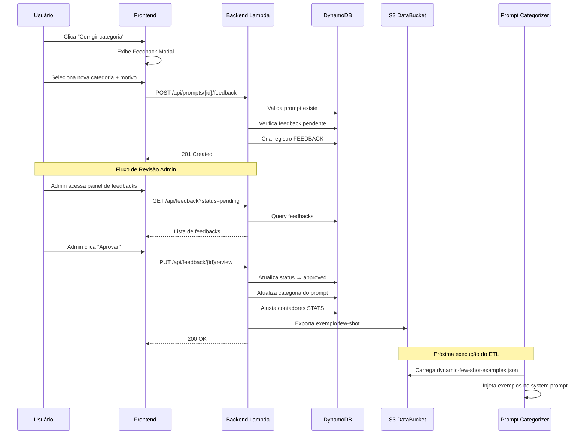

# Design Técnico — Category Feedback Loop

## Visão Geral

Esta feature implementa um ciclo de feedback para o classificador de prompts do Kiro Cost Analyzer. O fluxo é:

1. **Usuário** corrige a categoria de um prompt via modal no `PromptDetailPanel`
2. **Backend** armazena o feedback como registro pendente no DynamoDB
3. **Administrador** revisa e aprova/rejeita o feedback via painel administrativo
4. **Ao aprovar**: o sistema atualiza a categoria do prompt original, ajusta os contadores de distribuição e exporta o exemplo para um arquivo JSON no S3
5. **Classificador** carrega os exemplos dinâmicos do S3 e os injeta no system prompt como few-shot examples adicionais

O design reutiliza a infraestrutura existente (Analytics_Table, Backend Lambda, S3 DataBucket) e segue os padrões do projeto: single-table design, injeção de dependência, Cloudscape no frontend.



## Arquitetura

### Componentes Modificados

| Componente | Tipo | Modificação |
|---|---|---|
| `backend/handler.py` | Router | Adicionar rotas para feedback endpoints |
| `backend/handlers/feedback_handler.py` | Handler (novo) | Lógica dos endpoints de feedback |
| `backend/handlers/prompts_handler.py` | Handler | Nenhuma — reutiliza `get_prompt_by_request_id` |
| `backend/repository/analytics_repository.py` | Repository | Nenhuma — prompts continuam na Analytics_Table |
| `backend/repository/feedback_repository.py` | Repository (novo) | Leitura/escrita na FeedbackTable |
| `etl/repository/analytics_writer.py` | Writer | Adicionar `update_prompt_category` e `decrement_category_count` |
| `etl/prompt_categorizer.py` | Categorizer | Carregar exemplos do S3 (fonte única) |
| `frontend/src/components/PromptDetailPanel.tsx` | Component | Adicionar botão "Corrigir categoria" |
| `frontend/src/components/FeedbackModal.tsx` | Component (novo) | Modal de correção de categoria |
| `frontend/src/pages/FeedbackAdminPage.tsx` | Page (novo) | Painel administrativo de feedbacks |
| `frontend/src/types/index.ts` | Types | Adicionar interfaces de feedback |
| `template.yaml` | IaC | Adicionar FeedbackTable + permissão S3 para Backend Lambda |

### Decisões de Design

1. **Feedback no Backend Lambda (não no ETL)**: A aprovação de feedback é uma operação síncrona iniciada pelo admin. Executar no Backend Lambda mantém a resposta imediata e evita complexidade de Step Functions para uma operação simples.

2. **Exportação S3 síncrona na aprovação**: O arquivo `config/few-shot-examples.json` é pequeno (máximo 14 categorias × 5 exemplos = 70 entradas). Ler, atualizar e reescrever no S3 durante a aprovação é rápido e evita eventual consistency de um processo assíncrono.

3. **S3 como fonte única de exemplos few-shot**: O arquivo `config/few-shot-examples.json` no S3 é a **única fonte de verdade** para os exemplos do classificador. Os exemplos atualmente hardcoded no `prompt_categorizer.py` serão migrados para esse arquivo como seed inicial, e o código Python deixará de conter exemplos inline. Isso centraliza a gestão de exemplos em um único lugar e permite que feedbacks aprovados enriqueçam o classificador sem tocar em código. O bucket S3 (Standard) oferece 99.999999999% de durabilidade e 99.99% de disponibilidade. Versionamento será habilitado no bucket para proteção contra escritas acidentais ou corrompidas.

4. **PK=FEEDBACK#{requestId}**: Usar o requestId como parte da PK permite verificar rapidamente se já existe feedback pendente para um prompt. O SK com timestamp permite múltiplos feedbacks históricos (após aprovação/rejeição, um novo pode ser submetido).

5. **Limite de 5 exemplos por categoria**: Evita que o system prompt cresça indefinidamente. 5 exemplos por categoria × 14 categorias = 70 exemplos máximos, adicionando ~3-5KB ao prompt — dentro dos limites do Bedrock.

6. **Admin verifica no frontend via `user.groups`**: O `AuthProvider` já expõe `groups` no `AuthUser`. A verificação de admin no frontend é apenas UX — a proteção real está no backend via `_is_admin(claims)`.

## Componentes e Interfaces

### API Endpoints

#### POST `/api/prompts/{requestId}/feedback`
Submissão de feedback por qualquer usuário autenticado.

**Request Body:**
```json
{
  "suggestedCategory": "Debugging",
  "reason": "O prompt é claramente sobre depuração, não code review"
}
```

**Responses:**
- `201`: Feedback criado com sucesso
- `400`: Categoria inválida, mesma categoria, ou body inválido
- `404`: Prompt não encontrado
- `409`: Já existe feedback pendente para este prompt

#### GET `/api/feedback`
Listagem de feedbacks (admin-only).

**Query Parameters:**
- `status` (opcional): `pending` | `approved` | `rejected`
- `limit` (opcional): máximo 50, default 20
- `nextToken` (opcional): token de paginação

**Response:**
```json
{
  "feedbacks": [
    {
      "feedbackId": "FEEDBACK#req123#2025-01-15T10:30:00Z",
      "requestId": "req123",
      "originalCategory": "Code Review",
      "suggestedCategory": "Debugging",
      "promptSnippet": "esse erro TypeError tá aparecendo...",
      "reason": "É claramente debugging",
      "submittedBy": "user@example.com",
      "status": "pending",
      "createdAt": "2025-01-15T10:30:00Z",
      "reviewedBy": null,
      "reviewedAt": null
    }
  ],
  "nextToken": null,
  "total": 1
}
```

#### PUT `/api/feedback/{feedbackId}/review`
Revisão de feedback (admin-only).

**Request Body:**
```json
{
  "action": "approve"
}
```

**Responses:**
- `200`: Feedback revisado com sucesso
- `400`: Feedback já revisado, ou action inválida
- `403`: Não é administrador
- `404`: Feedback não encontrado

### Backend — `feedback_handler.py`

```python
# backend/handlers/feedback_handler.py

def handle_submit_feedback(request_id: str, body: dict, claims: dict,
                           dynamodb_resource=None, s3_client=None) -> dict:
    """Handle POST /api/prompts/{requestId}/feedback."""

def handle_list_feedback(query_params: dict,
                         dynamodb_resource=None) -> dict:
    """Handle GET /api/feedback."""

def handle_review_feedback(feedback_id: str, body: dict, claims: dict,
                           dynamodb_resource=None, s3_client=None) -> dict:
    """Handle PUT /api/feedback/{feedbackId}/review."""
```

### Backend — `category_corrector.py`

```python
# backend/handlers/category_corrector.py

class CategoryCorrector:
    """Applies approved feedback: updates prompt category and distribution counters."""

    def __init__(self, table_name: str, dynamodb_resource=None):
        ...

    def apply_correction(self, feedback: dict) -> None:
        """Update prompt category and adjust STATS#CATEGORY# counters atomically."""
```

### Backend — `few_shot_exporter.py`

```python
# backend/handlers/few_shot_exporter.py

class FewShotExporter:
    """Manages the few-shot examples file in S3 (single source of truth).

    The file at S3_KEY contains ALL examples used by the classifier —
    both the original seed examples (migrated from the hardcoded Python
    prompt) and user-feedback examples. There is no separate hardcoded
    fallback; this file IS the source of truth.
    """

    S3_KEY = "config/few-shot-examples.json"
    MAX_EXAMPLES_PER_CATEGORY = 5

    def __init__(self, bucket: str, s3_client=None):
        ...

    def add_example(self, category: str, prompt_snippet: str,
                    feedback_id: str, approved_at: str) -> None:
        """Add an approved example, enforcing the per-category cap.

        Reads the current file (or creates it if missing), appends the
        new example, trims to MAX_EXAMPLES_PER_CATEGORY per category
        keeping the most recent, and writes back.
        """

    def load_examples(self) -> list[dict]:
        """Load all examples from S3. Returns [] if file doesn't exist."""

    def _save_examples(self, examples: list[dict]) -> None:
        """Serialize and write examples to S3 with UTF-8 encoding and indentation."""

    @staticmethod
    def seed_initial_examples(bucket: str, s3_client=None) -> None:
        """One-time migration: write the original hardcoded examples to S3.

        Called during deployment or manually to populate the initial file.
        Skips if the file already exists to avoid overwriting feedback examples.
        """
```

### Repository — Novos métodos em `AnalyticsRepository`

```python
# Nenhuma adição necessária — feedbacks ficam na FeedbackTable separada.
# Prompts e contadores de categoria continuam na Analytics_Table.
```

### Repository — Novo `FeedbackRepository`

```python
# backend/repository/feedback_repository.py

class FeedbackRepository:
    """Read/write operations for the FeedbackTable."""

    def __init__(self, table_name: str, dynamodb_resource=None):
        ...

    def write_feedback(self, feedback: dict) -> None:
        """PutItem for a feedback record."""

    def get_pending_by_request_id(self, request_id: str) -> dict | None:
        """Query FEEDBACK#{requestId} items filtered by status=pending."""

    def list_feedbacks(self, status: str | None = None, limit: int = 20,
                       next_token: str | None = None) -> dict:
        """Scan feedbacks with optional status filter and pagination."""

    def get_feedback_by_pk_sk(self, pk: str, sk: str) -> dict | None:
        """Get a specific feedback record by its PK/SK."""

    def update_feedback_status(self, pk: str, sk: str, status: str,
                               reviewed_by: str, reviewed_at: str) -> None:
        """Update feedback status, reviewedBy, and reviewedAt."""
```

### Repository — Novos métodos em `AnalyticsWriter`

```python
# Adições ao etl/repository/analytics_writer.py (usado também pelo backend)

def update_prompt_category(self, pk: str, sk: str, new_category: str) -> None:
    """Update the category field on a prompt record in Analytics_Table."""

def decrement_category_count(self, user_id: str, normalized_category: str) -> None:
    """ADD #count :neg_one for STATS#CATEGORY#{normalizedCategory} in Analytics_Table."""
```

### ETL — Modificações em `PromptCategorizer`

```python
# Modificações em etl/prompt_categorizer.py

class PromptCategorizer:
    def __init__(self, model_id: str, region: str,
                 bedrock_client=None, s3_client=None,
                 data_bucket: str = ""):
        # Carrega exemplos do S3 (fonte única de verdade)
        self._examples = self._load_examples_from_s3()
        self._full_system_prompt = self._build_system_prompt()

    def _load_examples_from_s3(self) -> list[dict]:
        """Load all few-shot examples from S3.

        The S3 file is the single source of truth — there are no
        hardcoded examples in this module. If the file doesn't exist
        or can't be read, logs a warning and returns [], which means
        the classifier operates with the base prompt only (category
        definitions and rules, but no examples).
        """

    def _build_system_prompt(self) -> str:
        """Build system prompt: base template + examples from S3.

        The base template contains category definitions and classification
        rules. Examples are injected from the S3 file, grouped by category.
        """

    @staticmethod
    def build_system_prompt_with_examples(examples: list[dict]) -> str:
        """Pure function: construct system prompt from base template + examples.
        Testable without Bedrock/S3 dependencies."""
```

**Nota sobre migração**: Os exemplos atualmente hardcoded no `SYSTEM_PROMPT` do `prompt_categorizer.py` serão extraídos para o arquivo `config/few-shot-examples.json` no S3 via `FewShotExporter.seed_initial_examples()`. O módulo Python manterá apenas o template base (definições de categorias e regras de classificação), sem exemplos inline.

### Frontend — Novas Interfaces em `types/index.ts`

```typescript
export interface FeedbackSubmission {
  suggestedCategory: string;
  reason?: string;
}

export interface FeedbackRecord {
  feedbackId: string;
  requestId: string;
  originalCategory: string;
  suggestedCategory: string;
  promptSnippet: string;
  reason: string;
  submittedBy: string;
  status: 'pending' | 'approved' | 'rejected';
  createdAt: string;
  reviewedBy: string | null;
  reviewedAt: string | null;
}

export interface FeedbackListResponse {
  feedbacks: FeedbackRecord[];
  nextToken: string | null;
  total: number;
}

export interface FeedbackReviewAction {
  action: 'approve' | 'reject';
}
```

### Frontend — `FeedbackModal.tsx`

Componente modal usando Cloudscape `Modal`, `Select`, `Input`, `Button`. Recebe a categoria atual e o requestId como props. Desabilita o botão "Confirmar" enquanto a categoria selecionada for igual à atual.

### Frontend — `FeedbackAdminPage.tsx`

Página acessível via rota `/feedback` no `SideNavigation` (visível apenas para admins). Usa Cloudscape `Table`, `Select` para filtro de status, `ButtonGroup` para ações de aprovação/rejeição.

## Modelos de Dados

### DynamoDB — Nova Tabela `FeedbackTable`

Feedbacks são armazenados em uma tabela dedicada, separada da `Analytics_Table`, para manter a separação de domínios e evitar impacto nos scans de agregação de analytics.

**Tabela:** `FeedbackTable`
**KeySchema:** PK (HASH) + SK (RANGE), ambos String
**BillingMode:** PAY_PER_REQUEST

| Entidade | PK | SK | Atributos |
|---|---|---|---|
| Feedback | `FEEDBACK#{requestId}` | `FEEDBACK#{timestamp}` | `requestId`, `originalCategory`, `suggestedCategory`, `promptSnippet` (max 200 chars), `reason` (max 500 chars), `submittedBy`, `status`, `createdAt`, `reviewedBy`, `reviewedAt`, `promptPK`, `promptSK` |

Campos adicionais `promptPK` e `promptSK` armazenam as chaves do prompt original na `Analytics_Table` para permitir a atualização direta sem precisar de uma query adicional no GSI.

A tabela será definida no `template.yaml` como recurso SAM. O nome será passado via variável de ambiente `FEEDBACK_TABLE` para as Lambdas.

### S3 — Arquivo de Exemplos Few-Shot (Fonte Única de Verdade)

**Caminho:** `config/few-shot-examples.json`

Este arquivo é a **única fonte de exemplos** para o classificador. Contém tanto os exemplos originais (migrados do código Python) quanto os exemplos adicionados via feedback de usuários. O bucket usa S3 Standard com versionamento habilitado para proteção contra escritas acidentais.

```json
[
  {
    "category": "Debugging",
    "example": "esse erro TypeError tá aparecendo quando clico no botão",
    "source": "seed",
    "feedbackId": null,
    "approvedAt": null
  },
  {
    "category": "Debugging",
    "example": "o fetch tá retornando 500, investiga",
    "source": "feedback",
    "feedbackId": "req-abc123",
    "approvedAt": "2025-01-15T10:30:00Z"
  }
]
```

O campo `source` distingue exemplos originais (`"seed"`) de exemplos vindos de feedback (`"feedback"`). Máximo de 5 exemplos por categoria, ordenados por `approvedAt` descendente. Ao exceder 5, os mais antigos são removidos (exemplos `seed` podem ser substituídos por exemplos `feedback` mais recentes).

### Rotas no Router (`handler.py`)

Novos patterns e rotas:

```python
_FEEDBACK_SUBMIT_PATTERN = re.compile(r"^/api/prompts/(.+)/feedback$")
_FEEDBACK_REVIEW_PATTERN = re.compile(r"^/api/feedback/(.+)/review$")

# POST /api/prompts/{requestId}/feedback — qualquer usuário autenticado
# GET /api/feedback — admin only
# PUT /api/feedback/{feedbackId}/review — admin only
```

## Propriedades de Corretude

*Uma propriedade é uma característica ou comportamento que deve ser verdadeiro em todas as execuções válidas de um sistema — essencialmente, uma declaração formal sobre o que o sistema deve fazer. Propriedades servem como ponte entre especificações legíveis por humanos e garantias de corretude verificáveis por máquina.*

### Property 1: Validação de categoria aceita apenas Valid_Categories

*Para qualquer* string `s`, a Feedback_API deve aceitar `s` como `suggestedCategory` se e somente se `s` pertence ao conjunto das 14 Valid_Categories. Qualquer outra string deve resultar em rejeição com status 400.

**Validates: Requirements 2.1, 8.1**

### Property 2: Rejeição de mesma categoria

*Para qualquer* prompt com categoria `C` e qualquer submissão de feedback com `suggestedCategory` igual a `C`, a Feedback_API deve rejeitar a requisição com status 400.

**Validates: Requirements 2.2**

### Property 3: Completude do registro de feedback

*Para qualquer* submissão válida de feedback (categoria válida, diferente da atual, prompt existente, sem feedback pendente), o registro criado no DynamoDB deve conter todos os campos obrigatórios: `PK`, `SK`, `originalCategory`, `suggestedCategory`, `promptSnippet`, `reason`, `submittedBy`, `status="pending"`, `createdAt`, `promptPK`, `promptSK`.

**Validates: Requirements 2.3**

### Property 4: Filtro de listagem retorna apenas status correspondente

*Para qualquer* conjunto de feedbacks com status variados e qualquer filtro de status `F`, todos os feedbacks retornados pela API de listagem devem ter `status == F`.

**Validates: Requirements 3.1**

### Property 5: Transição de estado na revisão

*Para qualquer* feedback com status "pending" e qualquer ação válida ("approve" ou "reject"), após a revisão o feedback deve ter o status correspondente à ação, `reviewedBy` preenchido com o username do admin, e `reviewedAt` preenchido com um timestamp válido.

**Validates: Requirements 3.3**

### Property 6: Correção atualiza categoria do prompt

*Para qualquer* feedback aprovado com `suggestedCategory` `C`, o registro do prompt original no DynamoDB deve ter seu campo `category` atualizado para `C`.

**Validates: Requirements 4.1**

### Property 7: Invariante de soma dos contadores de distribuição

*Para qualquer* usuário e qualquer sequência de aprovações de feedback, a soma de todos os contadores `STATS#CATEGORY#*` para esse usuário deve permanecer igual ao total de prompts do usuário. Em outras palavras, aprovar um feedback decrementa a categoria original e incrementa a nova categoria, mantendo a soma constante.

**Validates: Requirements 4.2, 4.3, 8.4**

### Property 8: Exportação few-shot respeita limite por categoria

*Para qualquer* sequência de aprovações de feedback, cada categoria no arquivo de exemplos dinâmicos deve conter no máximo 5 exemplos, e esses devem ser os 5 mais recentes (por `approvedAt`).

**Validates: Requirements 5.1, 5.2, 5.3**

### Property 9: Round-trip de serialização JSON dos exemplos dinâmicos

*Para qualquer* lista válida de exemplos dinâmicos, serializar para JSON (UTF-8) e depois deserializar deve produzir uma lista equivalente à original.

**Validates: Requirements 5.4, 8.5**

### Property 10: Construção do system prompt usa template base + exemplos S3

*Para qualquer* conjunto de exemplos carregados do S3, o system prompt construído deve conter o template base (definições de categorias e regras) inalterado, seguido dos exemplos agrupados por categoria. Extrair a porção do template base do prompt construído deve ser idêntica ao template original.

**Validates: Requirements 6.3, 6.4, 6.5**

### Property 11: Truncamento de campos

*Para qualquer* string `reason` de comprimento arbitrário, o valor armazenado deve ter no máximo 500 caracteres. *Para qualquer* string `promptSnippet` de comprimento arbitrário, o valor armazenado deve ter no máximo 200 caracteres. Em ambos os casos, o valor armazenado deve ser um prefixo do valor original.

**Validates: Requirements 8.2, 8.3**

## Tratamento de Erros

### Backend API

| Cenário | Status | Mensagem |
|---|---|---|
| Body JSON inválido | 400 | "Request body is not valid JSON" (existente no router) |
| `suggestedCategory` não é Valid_Category | 400 | "Categoria inválida. Categorias válidas: ..." |
| `suggestedCategory` igual à categoria atual | 400 | "A categoria sugerida deve ser diferente da categoria atual" |
| `action` não é "approve" nem "reject" | 400 | "Ação inválida. Use 'approve' ou 'reject'" |
| Feedback já revisado (não-pending) | 400 | "Este feedback já foi revisado" |
| Prompt não encontrado | 404 | "Prompt com requestId '{id}' não encontrado" |
| Feedback não encontrado | 404 | "Feedback não encontrado" |
| Feedback pendente já existe | 409 | "Já existe uma correção pendente para este prompt" |
| Usuário não é admin (endpoints admin) | 403 | "Acesso restrito a administradores" |
| DynamoDB throttling | 503 | "Serviço temporariamente indisponível" (existente no router) |
| Erro interno | 500 | "Erro interno do servidor" (existente no router) |

### ETL — PromptCategorizer

| Cenário | Comportamento |
|---|---|
| Arquivo S3 não existe (NoSuchKey) | Log warning, opera com template base sem exemplos |
| Arquivo S3 com JSON inválido | Log error, opera com template base sem exemplos |
| Erro de rede ao ler S3 | Log error, opera com template base sem exemplos |

### Frontend

| Cenário | Comportamento |
|---|---|
| Erro 400 na submissão | Exibe mensagem do servidor no modal |
| Erro 409 (feedback pendente) | Exibe "Já existe uma correção pendente para este prompt" |
| Erro 500 / rede | Exibe "Erro ao enviar correção. Tente novamente." |
| Erro ao carregar lista de feedbacks | Exibe Alert de erro com botão de retry |

## Estratégia de Testes

### Testes Unitários (Python — pytest + moto)

- **`test_feedback_handler.py`**: Testa cada endpoint (submit, list, review) com DynamoDB mockado via moto. Cobre validações, erros, e fluxo feliz.
- **`test_category_corrector.py`**: Testa atualização de categoria e ajuste de contadores com DynamoDB mockado.
- **`test_few_shot_exporter.py`**: Testa exportação, carregamento, limite por categoria, e serialização com S3 mockado.
- **`test_prompt_categorizer_dynamic.py`**: Testa carregamento de exemplos dinâmicos e construção do system prompt.

### Testes Property-Based (Python — Hypothesis)

Cada propriedade de corretude será implementada como um teste property-based com mínimo de 100 iterações:

- **Property 1**: Gerar strings aleatórias, verificar que apenas Valid_Categories são aceitas pela função de validação.
- **Property 2**: Gerar categorias válidas aleatórias, verificar rejeição quando suggestedCategory == currentCategory.
- **Property 7**: Gerar sequências aleatórias de feedbacks e aprovações, verificar invariante de soma dos contadores.
- **Property 8**: Gerar sequências de exemplos por categoria, verificar limite de 5 e ordenação por recência.
- **Property 9**: Gerar listas aleatórias de exemplos, verificar round-trip JSON.
- **Property 10**: Gerar conjuntos aleatórios de exemplos dinâmicos, verificar que o system prompt preserva a parte hardcoded.
- **Property 11**: Gerar strings de comprimento aleatório, verificar truncamento correto.

Cada teste será tagueado com: `Feature: category-feedback-loop, Property {N}: {título}`

### Testes Unitários (TypeScript — Vitest + Testing Library)

- **`FeedbackModal.test.tsx`**: Testa renderização, pré-seleção, validação de submit, e tratamento de erros.
- **`FeedbackAdminPage.test.tsx`**: Testa tabela, filtros, ações de aprovação/rejeição.
- **`PromptDetailPanel.test.tsx`**: Testa exibição do botão "Corrigir categoria" e ocultação para System_Categories.

### Testes Property-Based (TypeScript — fast-check)

- **Property 9 (frontend)**: Round-trip de serialização/deserialização de FeedbackRecord.
- **Property 11 (frontend)**: Truncamento de reason e snippet no frontend antes do envio.
