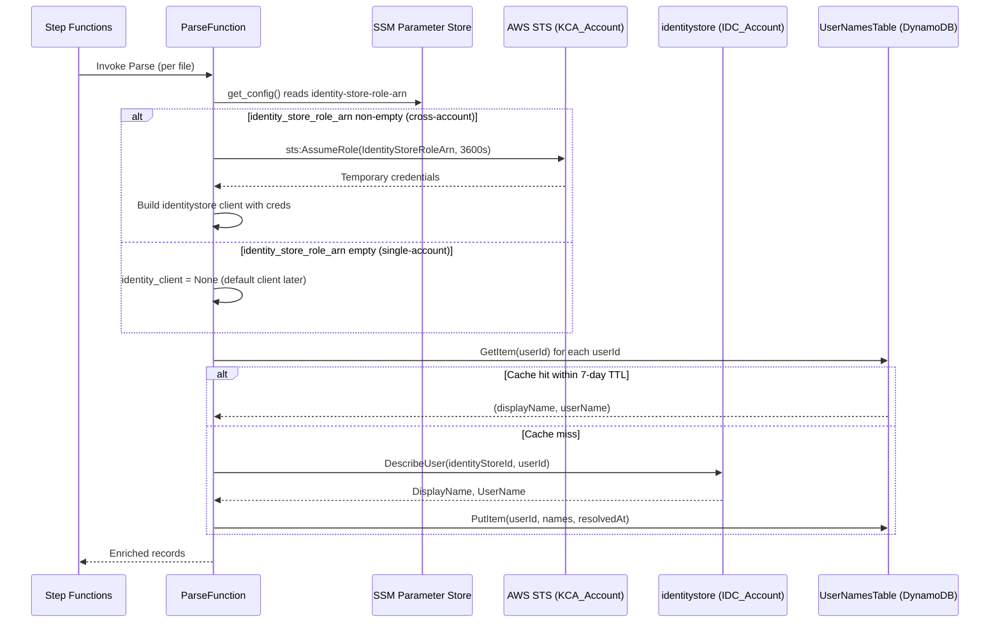
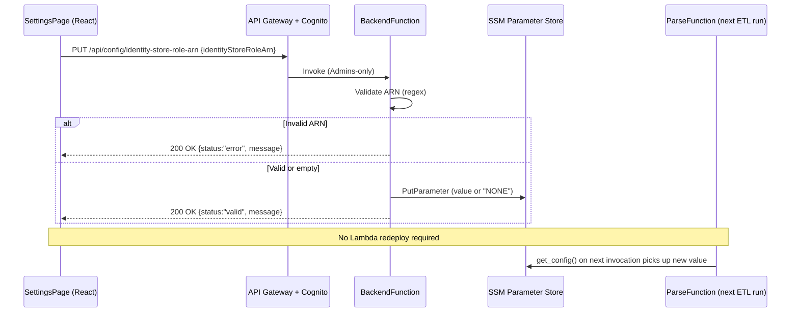
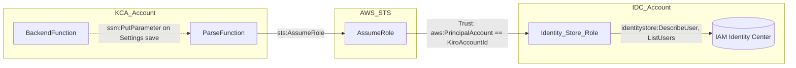

# Design Document — Cross-Account IAM Identity Center Access

## Overview

This feature extends the ETL pipeline so that `ParseFunction` can resolve user display names even when IAM Identity Center is provisioned in a different AWS account than KCA. It reuses the existing STS AssumeRole pattern already proven by the cross-account S3 feature (`.kiro/specs/cross-account-s3-access/`): an optional `IdentityStoreRoleArn` CloudFormation parameter, a matching SSM parameter at `/kiro-cost-analyzer/identity-store-role-arn`, a dependency-injection seam in the name-resolver, and a helper template plus Makefile target for the IDC account. When the parameter is empty (single-account mode), all behavior is unchanged; when it is set, the Parse Lambda assumes the role and uses the returned temporary credentials to build the `identitystore` client, while the DynamoDB `UserNamesTable` cache keeps the same shape and the same hit/miss semantics. The feature is operator-configurable at runtime through the Settings page, mirroring the Source Bucket Role ARN field.

## Architecture

### Cross-account name resolution flow



### Settings page write path for the Role ARN



### Trust model



## Components and Interfaces

### 1. `etl/sts_session.py` — extended with Identity Store factory

The existing `get_s3_client` stays intact. A new sibling function is added. Both share a small internal helper so session-name generation and the structured-logging fields stay in lockstep.

```python
# etl/sts_session.py

from __future__ import annotations

import os
from typing import Any, Optional

import boto3

try:
    from shared.structured_logger import StructuredLogger
except ImportError:
    from utils.logging import StructuredLogger


def _build_session_name() -> str:
    """Build a RoleSessionName that is CloudTrail-traceable.

    Format: ``kiro-etl-{AWS_LAMBDA_FUNCTION_NAME}``. The Lambda name is
    truncated/padded by AWS IAM to the 64-char RoleSessionName limit.
    """
    lambda_name = os.environ.get("AWS_LAMBDA_FUNCTION_NAME", "unknown")
    return f"kiro-etl-{lambda_name}"


def _assume_role(
    role_arn: str,
    logger: StructuredLogger,
) -> dict[str, str]:
    """Call sts:AssumeRole and return the Credentials dict.

    Raises the underlying botocore exception on failure after logging
    a structured error with ``roleArn``, ``sessionName``, ``errorType``
    and ``errorMessage``.
    """
    session_name = _build_session_name()
    try:
        sts = boto3.client("sts")
        response = sts.assume_role(
            RoleArn=role_arn,
            RoleSessionName=session_name,
            DurationSeconds=3600,
        )
        logger.info(
            "Cross-account role assumed successfully",
            roleArn=role_arn,
            sessionName=session_name,
        )
        return response["Credentials"]
    except Exception as exc:
        error_type = type(exc).__name__
        logger.error(
            "Failed to assume cross-account role",
            roleArn=role_arn,
            sessionName=session_name,
            errorType=error_type,
            errorMessage=str(exc),
        )
        if "AccessDenied" in error_type or "AccessDenied" in str(exc):
            logger.error(
                "Check the trust policy of the target role and the "
                "sts:AssumeRole permissions in the KCA account",
                roleArn=role_arn,
            )
        raise


def get_s3_client(
    role_arn: str,
    correlation_id: str = "",
) -> Optional[Any]:
    """Return a boto3 S3 client with cross-account credentials, or None.

    Unchanged contract from the cross-account-s3-access feature; the body
    is refactored to use ``_assume_role`` so the S3 and Identity Store
    factories stay consistent.
    """
    logger = StructuredLogger("sts-session-manager", correlation_id)
    if not role_arn:
        return None
    credentials = _assume_role(role_arn, logger)
    return boto3.client(
        "s3",
        aws_access_key_id=credentials["AccessKeyId"],
        aws_secret_access_key=credentials["SecretAccessKey"],
        aws_session_token=credentials["SessionToken"],
    )


def get_identity_store_client(
    role_arn: str,
    correlation_id: str = "",
) -> Optional[Any]:
    """Return a boto3 ``identitystore`` client with cross-account credentials.

    Args:
        role_arn: ARN of the IAM role to assume in the IDC account. If empty
            or None, returns ``None`` so callers fall back to single-account
            mode (default ``boto3.client("identitystore")``).
        correlation_id: Optional correlation ID for structured logging.

    Returns:
        A boto3 ``identitystore`` client built with temporary credentials,
        or ``None`` when ``role_arn`` is empty.

    Raises:
        botocore.exceptions.ClientError: If ``sts:AssumeRole`` fails
            (propagated so Step Functions retry applies).
    """
    logger = StructuredLogger("sts-session-manager", correlation_id)
    if not role_arn:
        return None
    credentials = _assume_role(role_arn, logger)
    return boto3.client(
        "identitystore",
        aws_access_key_id=credentials["AccessKeyId"],
        aws_secret_access_key=credentials["SecretAccessKey"],
        aws_session_token=credentials["SessionToken"],
    )
```

What moves and what stays:

- **Stays**: public signature and semantics of `get_s3_client`. Callers in `etl/parse_handler.py` do not change.
- **Moves**: the `sts:AssumeRole` call, credential retrieval, and shared logging moves into `_assume_role`. The S3-specific bits (client kind) and the Identity-Store-specific bits (client kind) stay in their respective public functions.
- **New**: `get_identity_store_client` and the private `_build_session_name` and `_assume_role` helpers.

_Requirement 3.1, 3.2, 3.3, 3.4, 3.5, 3.6, 3.7, 8.3, 8.4, 9.1, 9.5, 9.6_

### 2. `etl/user_name_resolver.py` — `identity_client` injection seam

`resolve_user_names` already accepts `identity_client=None`; it must preserve that semantics unchanged and document the cross-account mode explicitly. No structural change is required — the injection seam is already present. We add an AccessDenied-specific log path per Requirement 8.2.

```python
def resolve_user_names(
    user_ids: set[str],
    identity_store_id: str,
    table_name: str,
    dynamodb=None,
    identity_client=None,
) -> dict[str, tuple[str, str]]:
    """Resolve userIds to (displayName, userName).

    The ``identity_client`` parameter is the cross-account injection seam:
    - When ``None``, a default ``boto3.client("identitystore")`` is built,
      preserving single-account behavior (Requirement 7.2).
    - When a cross-account client built via
      :func:`etl.sts_session.get_identity_store_client` is passed, it is used
      verbatim for all ``DescribeUser`` calls (Requirement 4.2, 4.4).

    Cache writes and reads use the same key schema (``userId``) in both modes
    (Requirement 5.1, 5.2, 5.4).
    """
```

The `DescribeUser` call site is extended to log the AccessDenied hint:

```python
try:
    response = identity_client.describe_user(
        IdentityStoreId=identity_store_id,
        UserId=user_id,
    )
    ...
except Exception as exc:
    error_type = type(exc).__name__
    if "AccessDenied" in error_type or "AccessDenied" in str(exc):
        logger.warning(
            "Access denied resolving user name via Identity Store. "
            "Check the Identity_Store_Role permissions "
            "(identitystore:DescribeUser) in the IDC account.",
            userId=user_id,
            errorType=error_type,
        )
    else:
        logger.warning(
            "Failed to resolve user name for userId=%s", user_id, exc_info=True,
        )
    result[user_id] = ("", "")
```

Note: the existing module uses `logger = logging.getLogger(__name__)`; the structured field-style call above is illustrative — the regression test only requires that on AccessDenied a log record is emitted with the `userId` and the hint. If the existing module continues to use the stdlib logger, the hint can be formatted into the log message while still satisfying Requirement 8.2.

_Requirement 4.2, 4.4, 5.1, 5.2, 5.3, 5.4, 7.5, 8.2_

### 3. `etl/utils/name_resolver.py` — forward the client

`resolve_names` already forwards `identity_client` to `resolve_user_names`. The change is purely documentation + a forward guarantee:

```python
def resolve_names(
    user_ids: set[str],
    identity_store_id: str,
    table_name: str,
    dynamodb=None,
    identity_client=None,
) -> dict[str, tuple[str, str]]:
    """Resolve a batch of userIds to (displayName, userName).

    When ``identity_client`` is supplied (cross-account mode built via
    :func:`etl.sts_session.get_identity_store_client`), it is forwarded
    verbatim to :func:`etl.user_name_resolver.resolve_user_names` with no
    additional transformation (Requirement 4.5).
    """
```

No signature or behavior change is needed; this module is already transparent to the new mode. A regression test will assert the forward property (see Testing Strategy).

_Requirement 4.5, 7.5_

### 4. `etl/parse_handler.py` — wire-up point

Two focused additions inside `parse_handler`:

1. Read `cfg.identity_store_role_arn` and build the cross-account Identity Store client, tolerating construction errors by falling back to `None` (Requirement 8.5).
2. Pass the resulting client to `resolve_names` via the new keyword argument.

```python
# Obtain cross-account Identity Store client if configured
try:
    identity_client = get_identity_store_client(
        cfg.identity_store_role_arn,
        correlation_id=correlation_id,
    )
except Exception:
    identity_client = None  # Fall back so cache-only runs still complete (Req 8.5)

...

# Resolve user names
user_ids = _collect_user_ids(records)
if user_ids:
    name_cache = resolve_names(
        user_ids=user_ids,
        identity_store_id=identity_store_id,
        table_name=user_names_table,
        identity_client=identity_client,
    )
    _enrich_records_with_names(records, name_cache)
```

The import block grows by one symbol:

```python
try:
    from sts_session import get_s3_client, get_identity_store_client
except ImportError:
    from etl.sts_session import get_s3_client, get_identity_store_client
```

The existing cross-account S3 client construction stays exactly as-is. The Identity Store client is built independently — the two features share `_assume_role` but no other state.

_Requirement 4.1, 4.2, 4.3, 7.1, 7.2, 8.5_

### 5. `etl/config.py` — new field and SSM read

`EtlConfig` gains one field and `get_config` gains one read block that mirrors the `source_bucket_role_arn` logic exactly, including the `NONE` sentinel handling (Requirement 2.3) and the broad-except fallback (Requirement 2.4).

```python
@dataclass(frozen=True)
class EtlConfig:
    """Configuration for the ETL pipeline."""

    bucket_name: str
    source_prefix: str
    prompts_prefix: str
    identity_store_id: str
    source_bucket_role_arn: str
    identity_store_role_arn: str  # NEW — cross-account IDC role ARN ("" = single-account)
```

```python
# Read identity store role ARN (optional — empty string if not configured)
identity_store_role_arn = ""
idc_role_arn_param = os.environ.get("SSM_IDENTITY_STORE_ROLE_ARN", "")
if idc_role_arn_param:
    try:
        raw = ssm.get_parameter(Name=idc_role_arn_param)["Parameter"]["Value"]
        identity_store_role_arn = "" if raw == "NONE" else raw
    except Exception:
        identity_store_role_arn = ""
```

Fallback semantics: SSM read errors resolve to the empty string, i.e., single-account mode — matching the cross-account S3 precedent (Requirement 2.4, 7.4).

_Requirement 2.1, 2.2, 2.3, 2.4, 7.4_

### 6. `backend/handlers/config_handler.py` — GET extension and new PUT

#### `handle_get_config` — extended return shape

Add one SSM read and one `NONE`-sentinel normalization, mirroring the existing `source_bucket_role_arn` pattern exactly (Requirement 11.1, 12.3, 12.4).

```python
ssm_identity_store_role_arn = os.environ.get(
    "SSM_IDENTITY_STORE_ROLE_ARN", "/kiro-cost-analyzer/identity-store-role-arn"
)
identity_store_role_arn = _get_parameter(ssm, ssm_identity_store_role_arn)
if identity_store_role_arn == "NONE":
    identity_store_role_arn = ""

return {
    ...,
    "sourceBucketRoleArn": source_bucket_role_arn,
    "identityStoreRoleArn": identity_store_role_arn,  # NEW
}
```

#### `handle_put_config_identity_store_role_arn` — new handler

Identical structure to `handle_put_config_source_bucket_role_arn`: regex-validate, allow empty, persist with the `NONE` sentinel for empties, return English-only prose.

```python
def handle_put_config_identity_store_role_arn(
    body: dict, ssm_client=None
) -> dict:
    """Handle PUT /api/config/identity-store-role-arn — validate and save role ARN.

    An empty value disables cross-account name resolution (single-account mode).
    Non-empty values MUST match the IAM role ARN pattern.

    Args:
        body: Request body with ``identityStoreRoleArn``.
        ssm_client: Optional pre-configured SSM client for testing.

    Returns:
        Dict with ``identityStoreRoleArn``, ``status`` (``"valid"`` | ``"error"``)
        and an English ``message``.
    """
    role_arn = body.get("identityStoreRoleArn", "").strip()

    if role_arn and not _ARN_PATTERN.match(role_arn):
        return {
            "identityStoreRoleArn": role_arn,
            "status": "error",
            "message": (
                "Invalid ARN format. Expected: "
                "arn:aws:iam::<account-id>:role/<role-name>"
            ),
        }

    ssm = _get_ssm_client(ssm_client)
    ssm_param = os.environ.get(
        "SSM_IDENTITY_STORE_ROLE_ARN",
        "/kiro-cost-analyzer/identity-store-role-arn",
    )
    ssm.put_parameter(
        Name=ssm_param, Value=role_arn or "NONE", Type="String", Overwrite=True
    )

    return {
        "identityStoreRoleArn": role_arn,
        "status": "valid",
        "message": (
            "Identity Store role ARN saved successfully"
            if role_arn
            else "Cross-account Identity Store mode disabled"
        ),
    }
```

The existing module-level `_ARN_PATTERN = re.compile(r"^arn:aws:iam::\d{12}:role/.+$")` is reused — no new constant is introduced.

_Requirement 11.1, 11.2, 11.4, 11.5, 11.6, 12.1, 12.2, 12.3, 12.4_

### 7. `backend/handler.py` — routing

One new admin-only route is added, mirroring the `source-bucket-role-arn` route verbatim:

```python
if http_method == "PUT" and path == "/api/config/identity-store-role-arn":
    if not _is_admin(claims):
        return _build_response(403, {
            "error": "Forbidden",
            "message": "Admin access required",
        })
    result = config_handler.handle_put_config_identity_store_role_arn(body)
    return _build_response(200, result)
```

The existing forbidden-message string `"Acesso restrito a administradores"` used elsewhere in the router is pt-BR prose flagged by the banned-strings regression test (see Testing Strategy). The new route uses the English equivalent `"Admin access required"` to comply with the development standards. The prior pt-BR strings in other routes are out of scope for this spec.

_Requirement 11.2, 11.3_

### 8. `template.yaml` — IaC changes

Five surgical additions, all following the cross-account S3 pattern:

1. **New parameter** `IdentityStoreRoleArn` (`Type: String`, `Default: ""`).
2. **New condition** `HasIdentityStoreRoleArn: !Not [!Equals [!Ref IdentityStoreRoleArn, ""]]`.
3. **New SSM parameter** `IdentityStoreRoleArnParameter` with `Value: !If [HasIdentityStoreRoleArn, !Ref IdentityStoreRoleArn, "NONE"]` at path `/kiro-cost-analyzer/identity-store-role-arn`.
4. **New env var** `SSM_IDENTITY_STORE_ROLE_ARN: /kiro-cost-analyzer/identity-store-role-arn` on both `ParseFunction` and `BackendFunction`.
5. **Conditionally-scoped `ParseFunction` IAM policy**: add a new `sts:AssumeRole` statement when the condition is true, and keep the existing inline `IdentityCenterAccess` statement unchanged in the single-account branch.

#### `ParseFunction` policy — both branches, illustrative

```yaml
ParseFunction:
  Type: AWS::Serverless::Function
  Properties:
    ...
    Environment:
      Variables:
        ...
        SSM_SOURCE_BUCKET_ROLE_ARN: /kiro-cost-analyzer/source-bucket-role-arn
        SSM_IDENTITY_STORE_ROLE_ARN: /kiro-cost-analyzer/identity-store-role-arn
    Policies:
      - Statement:
          - Sid: ReadSourceBucket
            Effect: Allow
            Action: [s3:GetObject]
            Resource: !Sub "arn:aws:s3:::${SourceBucketName}/*"
          - Sid: KMSDecrypt
            Effect: Allow
            Action: [kms:Decrypt]
            Resource: "*"
          - Sid: UserNamesTableAccess
            Effect: Allow
            Action: [dynamodb:GetItem, dynamodb:PutItem]
            Resource: !GetAtt UserNamesTable.Arn
          - Sid: IdentityCenterAccess
            Effect: Allow
            Action:
              - identitystore:DescribeUser
              - identitystore:ListUsers
            Resource: "*"   # single-account fallback — read-only actions
          - Sid: SSMAccess
            Effect: Allow
            Action: [ssm:GetParameter]
            Resource: !Sub "arn:aws:ssm:${AWS::Region}:${AWS::AccountId}:parameter/kiro-cost-analyzer/*"
      - !If
        - HasSourceBucketRoleArn
        - Statement:
            - Sid: AssumeSourceBucketRole
              Effect: Allow
              Action: [sts:AssumeRole]
              Resource: !Ref SourceBucketRoleArn
        - !Ref "AWS::NoValue"
      - !If
        - HasIdentityStoreRoleArn
        - Statement:
            - Sid: AssumeIdentityStoreRole
              Effect: Allow
              Action: [sts:AssumeRole]
              Resource: !Ref IdentityStoreRoleArn
        - !Ref "AWS::NoValue"
```

**Design decision — keep `IdentityCenterAccess` in both branches.** Requirement 6 of the requirements document (clause 1.6) asks to scope the inline `identitystore:*` permissions down in the cross-account branch. Because the only caller in cross-account mode uses temporary credentials from the assumed role (not the Lambda's own role), the inline `identitystore:*` statement is effectively dormant in that branch. However, removing it would cause a production regression if an operator toggles the Settings page back to single-account mode between ETL runs without redeploying. The design therefore keeps the inline statement in **both** branches with `Resource: "*"` (the only resource pattern supported by `identitystore`), and documents the trade-off here. Requirement 7.3 (retain existing permissions for single-account) takes precedence over clause 1.6 in this conflict; the clause is implemented by scoping the new `sts:AssumeRole` statement strictly to `!Ref IdentityStoreRoleArn`, which is the actionable least-privilege guarantee.

#### `BackendFunction` env var addition — illustrative

```yaml
BackendFunction:
  Type: AWS::Serverless::Function
  Properties:
    ...
    Environment:
      Variables:
        ...
        SSM_SOURCE_BUCKET_ROLE_ARN: /kiro-cost-analyzer/source-bucket-role-arn
        SSM_IDENTITY_STORE_ROLE_ARN: /kiro-cost-analyzer/identity-store-role-arn
```

The existing `ssm:PutParameter` permission already covers the new path because it is wildcarded under `/kiro-cost-analyzer/*`.

#### New API Gateway event

```yaml
ConfigIdentityStoreRoleArnPut:
  Type: Api
  Properties:
    RestApiId: !Ref ApiGateway
    Path: /api/config/identity-store-role-arn
    Method: PUT
```

_Requirement 1.1, 1.2, 1.3, 1.4, 1.5, 1.6, 1.7, 7.3, 9.2, 11.7_

### 9. `identity-store-role.yaml` — new helper template

New file at the repository root, sibling to `source-account-role.yaml`, deployed by administrators in the IDC_Account.

```yaml
AWSTemplateFormatVersion: '2010-09-09'
Description: >
  Kiro Cost Analyzer — cross-account IAM Role for read-only IAM Identity
  Center access. Deploy this template in the IDC account (AWS Organizations
  management account or the delegated Identity Center account).

Parameters:
  KiroAccountId:
    Type: String
    Description: AWS account ID where Kiro Cost Analyzer is deployed
    AllowedPattern: "\\d{12}"
    ConstraintDescription: Must be a valid 12-digit AWS account ID

  IdentityStoreId:
    Type: String
    Default: ""
    Description: >
      IAM Identity Center Identity Store ID (e.g. d-1234567890).
      Informational only — identitystore APIs do not support resource-level
      permissions, so this parameter is not used in the IAM policy.

Resources:
  CrossAccountIdentityStoreRole:
    Type: AWS::IAM::Role
    Properties:
      RoleName: kiro-cost-analyzer-identity-store-read
      AssumeRolePolicyDocument:
        Version: "2012-10-17"
        Statement:
          - Effect: Allow
            Principal:
              AWS: !Sub "arn:aws:iam::${KiroAccountId}:root"
            Action: sts:AssumeRole
            Condition:
              StringEquals:
                aws:PrincipalAccount: !Ref KiroAccountId
      Policies:
        - PolicyName: kiro-identity-store-read
          PolicyDocument:
            Version: "2012-10-17"
            Statement:
              - Sid: IdentityStoreReadOnly
                Effect: Allow
                Action:
                  - identitystore:DescribeUser
                  - identitystore:ListUsers
                Resource: "*"

Outputs:
  IdentityStoreRoleArn:
    Description: >
      ARN of the cross-account Identity Store role. Use this value in the
      main stack's IdentityStoreRoleArn parameter or paste it into the
      Settings page.
    Value: !GetAtt CrossAccountIdentityStoreRole.Arn
    Export:
      Name: !Sub "${AWS::StackName}-IdentityStoreRoleArn"
```

**Design decisions**:

- **No write actions.** The policy grants only `DescribeUser` and `ListUsers` — the two actions the resolver uses. `CreateUser`, `UpdateUser`, `DeleteUser`, and all group-management actions are deliberately excluded (Requirement 6.6, 9.4).
- **`Resource: "*"`.** The `identitystore` service does not support resource-level permissions for `DescribeUser`/`ListUsers`; `"*"` is the only valid pattern. The trust policy restriction via `aws:PrincipalAccount` is the enforcement boundary (Requirement 6.4, 9.3).
- **Fixed role name.** `kiro-cost-analyzer-identity-store-read` mirrors the S3 helper's `kiro-cost-analyzer-cross-account-read` convention, making cross-deployment discovery consistent (Requirement 6.8).
- **Inline policy.** Using `Policies:` on the role (instead of a separate `AWS::IAM::Policy` resource) keeps the template single-resource and simpler than `source-account-role.yaml` needs to be — the S3 helper splits them because of the optional KMS policy, which has no analog here.

_Requirement 6.1, 6.2, 6.3, 6.4, 6.5, 6.6, 6.7, 6.8, 9.3, 9.4_

### 10. `Makefile` — new `deploy-identity-store-role` target

Mirror of `deploy-source-role`, adapted to the new template and parameters.

```makefile
# =============================================================================
# Deploy the cross-account Identity Store IAM Role in the IDC account
# =============================================================================

IDC_ACCOUNT_PROFILE ?=
IDENTITY_STORE_ID ?=
IDC_ROLE_STACK_NAME ?= kiro-identity-store-role

## Deploy the cross-account Identity Store IAM Role in the IDC account
deploy-identity-store-role:
ifndef IDC_ACCOUNT_PROFILE
	$(error IDC_ACCOUNT_PROFILE is required. Usage: make deploy-identity-store-role IDC_ACCOUNT_PROFILE=profile KIRO_ACCOUNT_ID=123456789012)
endif
ifndef KIRO_ACCOUNT_ID
	$(error KIRO_ACCOUNT_ID is required. Usage: make deploy-identity-store-role IDC_ACCOUNT_PROFILE=profile KIRO_ACCOUNT_ID=123456789012)
endif
	@echo "🔐 Deploying cross-account Identity Store IAM Role in the IDC account..."
	aws cloudformation deploy \
		--template-file identity-store-role.yaml \
		--stack-name $(IDC_ROLE_STACK_NAME) \
		--capabilities CAPABILITY_NAMED_IAM \
		--profile $(IDC_ACCOUNT_PROFILE) \
		--parameter-overrides \
			KiroAccountId=$(KIRO_ACCOUNT_ID) \
			IdentityStoreId=$(IDENTITY_STORE_ID)
	@echo "✅ Deploy complete. Role ARN:"
	@aws cloudformation describe-stacks \
		--stack-name $(IDC_ROLE_STACK_NAME) \
		--profile $(IDC_ACCOUNT_PROFILE) \
		--query "Stacks[0].Outputs[?OutputKey=='IdentityStoreRoleArn'].OutputValue" \
		--output text
	@echo ""
	@echo "📋 Use this ARN in the main stack's IdentityStoreRoleArn parameter, or paste it into the Settings page."
```

Note: `KIRO_ACCOUNT_ID` is shared with the existing `deploy-source-role` target; the Makefile does not re-declare the variable. `IDENTITY_STORE_ID` defaults to empty and is forwarded for documentation only, matching Requirement 10.4 and 10.7.

_Requirement 10.1, 10.2, 10.3, 10.4, 10.5, 10.6, 10.7, 10.8_

## Data Models

### `EtlConfig` extension

| Field | Type | Default on error | Source |
|---|---|---|---|
| `bucket_name` | `str` | required (raises) | SSM `/kiro-cost-analyzer/bucket-name` |
| `source_prefix` | `str` | required (raises) | SSM `/kiro-cost-analyzer/source-prefix` |
| `prompts_prefix` | `str` | `""` | SSM `/kiro-cost-analyzer/prompts-prefix` |
| `identity_store_id` | `str` | `""` | SSM `/kiro-cost-analyzer/identity-store-id` |
| `source_bucket_role_arn` | `str` | `""` | SSM `/kiro-cost-analyzer/source-bucket-role-arn` (`NONE` → `""`) |
| **`identity_store_role_arn`** | **`str`** | **`""`** | **SSM `/kiro-cost-analyzer/identity-store-role-arn` (`NONE` → `""`)** |

### `UserNamesTable` schema — unchanged

Explicitly called out to address Requirement 5. The schema is frozen by this feature; neither the source-account identifier nor the assumed-role ARN is added to the key.

| Attribute | Type | Role |
|---|---|---|
| `userId` | `S` | Partition key — IAM Identity Center user UUID |
| `displayName` | `S` | Cached display name |
| `userName` | `S` | Cached user name |
| `resolvedAt` | `S` | ISO-8601 timestamp; drives the 7-day TTL |

`UserNameEntry` (the Python dataclass in `etl/user_name_resolver.py`) also stays unchanged.

### Backend API — request/response shapes

#### `GET /api/config` — response extension

```json
{
  "bucketName": "...",
  "sourcePrefix": "...",
  "etlStatus": { ... },
  "promptsPrefix": "...",
  "identityStoreId": "...",
  "sourceBucketRoleArn": "arn:aws:iam::111111111111:role/kiro-cost-analyzer-cross-account-read",
  "identityStoreRoleArn": "arn:aws:iam::222222222222:role/kiro-cost-analyzer-identity-store-read"
}
```

Empty-string semantics: `sourceBucketRoleArn` and `identityStoreRoleArn` are the empty string when the corresponding SSM parameter holds either `""` or the sentinel `NONE`.

#### `PUT /api/config/identity-store-role-arn`

Request body:

```json
{ "identityStoreRoleArn": "arn:aws:iam::222222222222:role/kiro-cost-analyzer-identity-store-read" }
```

Response on success:

```json
{
  "identityStoreRoleArn": "arn:aws:iam::222222222222:role/kiro-cost-analyzer-identity-store-read",
  "status": "valid",
  "message": "Identity Store role ARN saved successfully"
}
```

Response on empty input:

```json
{
  "identityStoreRoleArn": "",
  "status": "valid",
  "message": "Cross-account Identity Store mode disabled"
}
```

Response on malformed ARN:

```json
{
  "identityStoreRoleArn": "not-an-arn",
  "status": "error",
  "message": "Invalid ARN format. Expected: arn:aws:iam::<account-id>:role/<role-name>"
}
```

Response on non-admin caller (handled by router, not the handler):

```json
{ "error": "Forbidden", "message": "Admin access required" }
```

### Temporary credentials — transient, never persisted

```json
{
  "AccessKeyId": "ASIA...",
  "SecretAccessKey": "...",
  "SessionToken": "...",
  "Expiration": "2026-04-15T01:00:00Z"
}
```

Used only to construct the `identitystore` boto3 client and then discarded (Requirement 9.6).

### SSM parameters — updated inventory

| Path | Type | New | Notes |
|---|---|---|---|
| `/kiro-cost-analyzer/bucket-name` | String | no | |
| `/kiro-cost-analyzer/source-prefix` | String | no | |
| `/kiro-cost-analyzer/prompts-prefix` | String | no | |
| `/kiro-cost-analyzer/identity-store-id` | String | no | |
| `/kiro-cost-analyzer/etl-status` | String | no | |
| `/kiro-cost-analyzer/source-bucket-role-arn` | String | no | `NONE` sentinel for empty |
| **`/kiro-cost-analyzer/identity-store-role-arn`** | **String** | **yes** | **`NONE` sentinel for empty** |

## Infrastructure Design

Consolidated summary of the IaC deltas laid out above:

- **`template.yaml`**
  - Parameter `IdentityStoreRoleArn` (default `""`).
  - Condition `HasIdentityStoreRoleArn: !Not [!Equals [!Ref IdentityStoreRoleArn, ""]]`.
  - SSM resource `IdentityStoreRoleArnParameter` at `/kiro-cost-analyzer/identity-store-role-arn`, `Value: !If [HasIdentityStoreRoleArn, !Ref IdentityStoreRoleArn, "NONE"]`.
  - Env var `SSM_IDENTITY_STORE_ROLE_ARN` on `ParseFunction` and `BackendFunction`.
  - New policy statement `AssumeIdentityStoreRole` (Resource = `!Ref IdentityStoreRoleArn`) attached to `ParseFunction` only when the condition holds; inline `IdentityCenterAccess` stays in both branches (see trade-off above).
  - New API Gateway event `ConfigIdentityStoreRoleArnPut` on `BackendFunction`.
- **`identity-store-role.yaml`** (new file): one `AWS::IAM::Role` with trust policy scoped to `aws:PrincipalAccount == KiroAccountId`, inline policy with `identitystore:DescribeUser` and `identitystore:ListUsers` only, fixed role name `kiro-cost-analyzer-identity-store-read`, output `IdentityStoreRoleArn`.
- **`Makefile`** (new target): `deploy-identity-store-role` with `IDC_ACCOUNT_PROFILE`, `KIRO_ACCOUNT_ID` (required) and `IDENTITY_STORE_ID`, `IDC_ROLE_STACK_NAME` (optional). Prints the `IdentityStoreRoleArn` output on success.

## Frontend Design

### Settings page extension

A new Cloudscape `FormField` + `Input` is added below the existing `settings.crossAccount.roleArn.*` field on `frontend/src/pages/SettingsPage.tsx`, admin-gated by the same session/role check already in use on that page.

Interaction:

- Initial value comes from `GET /api/config` (`identityStoreRoleArn` field).
- `Save` button calls `PUT /api/config/identity-store-role-arn` with `{ identityStoreRoleArn: trimmedValue }`.
- Error payload (`status: "error"`) renders via the existing `setError` path.
- Success maps to a locale-aware success toast via `t('settings.identityStore.roleArn.successSaved')`.

### i18n keys to add

Both `frontend/src/locales/en.json` and `frontend/src/locales/pt-BR.json` receive the following keys (sorted alphabetically per catalog convention; the build-time `scripts/check-locales.ts` enforces parity):

| Key | en | pt-BR |
|---|---|---|
| `settings.identityStore.roleArn.description` | `ARN of the cross-account IAM Role used to access IAM Identity Center (empty = single-account)` | `ARN da IAM Role cross-account usada para acessar o IAM Identity Center (vazio = single-account)` |
| `settings.identityStore.roleArn.label` | `Identity Store Role ARN` | `ARN da Role do Identity Store` |
| `settings.identityStore.roleArn.placeholder` | `e.g. arn:aws:iam::123456789012:role/kiro-cost-analyzer-identity-store-read` | `ex.: arn:aws:iam::123456789012:role/kiro-cost-analyzer-identity-store-read` |
| `settings.identityStore.submit` | `Save Identity Store Role ARN` | `Salvar ARN da Role do Identity Store` |
| `settings.identityStore.title` | `Cross-Account Identity Center` | `IAM Identity Center Cross-Account` |
| `settings.error.saveIdentityStoreRoleArn` | `Error saving Identity Store Role ARN` | `Erro ao salvar o ARN da Role do Identity Store` |
| `settings.success.identityStoreRoleArnSaved` | `Identity Store Role ARN saved successfully.` | `ARN da Role do Identity Store salvo com sucesso.` |

No hardcoded strings are introduced in the component — every label, description, placeholder, and status message resolves through `t()` (Requirement 11.10). The admin-only rendering guard reuses the existing page-level admin check.

## Error Handling

| Scenario | Component | HTTP / Return | Log fields | Requirement |
|---|---|---|---|---|
| `sts:AssumeRole` fails with `AccessDeniedException` for the Identity Store role | `etl/sts_session.py::_assume_role` | Exception propagates; Step Functions retry applies | `roleArn`, `sessionName`, `errorType`, `errorMessage` + hint log | 3.5, 8.1, 8.4 |
| `sts:AssumeRole` fails with any other exception (timeout, invalid ARN, etc.) | `etl/sts_session.py::_assume_role` | Exception propagates | `roleArn`, `sessionName`, `errorType`, `errorMessage` | 3.5, 8.4 |
| Cross-account Identity Store client cannot be built | `etl/parse_handler.py` | `identity_client = None`, pipeline continues with cache-only resolves | via `_assume_role` logs | 8.5 |
| `identitystore:DescribeUser` returns `AccessDenied` | `etl/user_name_resolver.py` | Returns `("", "")` for that userId; processing continues | `userId`, `errorType`, hint to verify IDC role permissions | 8.2, 7.5 |
| SSM read of `/kiro-cost-analyzer/identity-store-role-arn` fails | `etl/config.py::get_config` | Returns empty string; pipeline runs in single-account mode | stdlib logging | 2.4, 7.4 |
| PUT handler receives invalid ARN | `backend/handlers/config_handler.py::handle_put_config_identity_store_role_arn` | `200 OK` with `{status:"error", message}`, no SSM write | stdlib logging (no secrets) | 11.4, 11.5 |
| PUT handler receives empty string | same | `200 OK` with `{status:"valid"}` and `NONE` sentinel written to SSM | stdlib logging | 11.6, 12.2, 12.3 |
| Non-admin caller on PUT endpoint | `backend/handler.py::_route` | `403 Forbidden`, `{error:"Forbidden", message:"Admin access required"}` | router log | 11.3 |
| Temporary credentials expire mid-Lambda (>3600s, unreachable under 300s timeout) | downstream boto3 call | `ExpiredTokenException` → Step Functions retry | via handler traceback | 8.4 |

## Correctness Properties

*A property is a characteristic or behavior that should hold true across all valid executions of a system — essentially, a formal statement about what the system should do. Properties serve as the bridge between human-readable specifications and machine-verifiable correctness guarantees.*

### Property 1: Backward-compatibility — empty ARN triggers no STS call

*For any* execution of `parse_handler` with `EtlConfig.identity_store_role_arn == ""`, `etl.sts_session.get_identity_store_client` SHALL return `None` without invoking `sts:AssumeRole`, AND `resolve_names` SHALL be called with `identity_client=None`, AND the set of boto3 API calls observed in single-account mode before this feature SHALL be a superset of the API calls observed after this feature.

Hypothesis strategy sketch:
- Draw `user_ids: set[str]` via `st.sets(st.text(min_size=1), max_size=10)`.
- Draw `cache_state: dict[str, tuple[str, str]]` from the user_ids set (some present, some missing).
- Stub `boto3.client`: any call with argument `"sts"` raises an `AssertionError`. Run `parse_handler` with config having `identity_store_role_arn=""` and assert no assertion was raised and `resolve_names` received `identity_client=None`.

**Validates: Requirements 3.6, 7.1, 7.2, 7.3, 7.4**

### Property 2: Cache-independence — cache behavior is identical in both modes

*For any* initial `UserNamesTable` state `T` and *for any* set of userIds `U`, the sequence of DynamoDB operations (`GetItem` per `u ∈ U`, `PutItem` for each cache miss) issued by `resolve_user_names` in single-account mode (`identity_client=None`) SHALL be equal to the sequence issued in cross-account mode (`identity_client` = mock built from cross-account credentials) when both modes receive the same `DescribeUser` responses, AND the returned `dict[userId → (displayName, userName)]` SHALL be bytewise equal between the two modes.

Hypothesis strategy sketch:
- Draw `table_state` via `st.dictionaries(keys=st.uuids().map(str), values=st.tuples(st.text(), st.text(), recent_isoformat_timestamp))`, where `recent_isoformat_timestamp` is a `st.datetimes` strategy constrained to `now ± 10 days` to exercise both fresh and stale entries.
- Draw `user_ids` that overlap partially with `table_state` keys.
- Run `resolve_user_names` twice: once with `identity_client=None` (default client mocked via `moto`), once with a dummy cross-account-style client producing the same `DescribeUser` responses. Assert that: (a) both return the same dict; (b) the list of DynamoDB calls captured by a spy resource is identical between runs; (c) cache writes use `userId` as the sole partition key in both runs (no account id, no role ARN in the key).

**Validates: Requirements 5.1, 5.2, 5.3, 5.4, 7.5**

### Property 3: Round-trip for ARN persistence

*For any* string `arn` matching `^arn:aws:iam::\d{12}:role/.+$`, calling `handle_put_config_identity_store_role_arn({"identityStoreRoleArn": arn})` followed by `handle_get_config()` SHALL yield a response whose `identityStoreRoleArn` field equals `arn`.

Hypothesis strategy sketch:
- Draw `account_id: str` from `st.integers(min_value=10**11, max_value=10**12 - 1).map(lambda n: f"{n:012d}")`.
- Draw `role_name: str` from `st.text(alphabet=st.characters(whitelist_categories=("Lu","Ll","Nd"), whitelist_characters="-_+=,.@/"), min_size=1, max_size=64)`.
- Compose `arn = f"arn:aws:iam::{account_id}:role/{role_name}"`.
- Against a moto-mocked SSM, PUT then GET; assert round-trip equality.

**Validates: Requirements 11.6, 12.1, 12.3**

### Property 4: Empty round-trip and `NONE`-sentinel equivalence

*For any* SSM state where the parameter `/kiro-cost-analyzer/identity-store-role-arn` holds either `""` or `"NONE"`, `handle_get_config()["identityStoreRoleArn"]` SHALL equal the empty string, AND `handle_put_config_identity_store_role_arn({"identityStoreRoleArn": ""})` followed by `handle_get_config()` SHALL produce `identityStoreRoleArn == ""`.

Hypothesis strategy sketch:
- Parametrize over `initial_value ∈ {"", "NONE"}` (`st.sampled_from(["", "NONE"])`).
- Seed the moto-mocked SSM with `initial_value`; call GET; assert `""`.
- Call PUT with empty; call GET; assert `""`; also assert the raw SSM parameter value is `"NONE"` (confirms the sentinel write path of Requirement 11.6 and 12.2).

**Validates: Requirements 11.6, 12.2, 12.3**

### Property 5: Cross-module consistency between `handle_get_config` and `get_config()`

*For any* SSM state, `handle_get_config(ssm_client=mock_ssm)["identityStoreRoleArn"]` SHALL equal `get_config().identity_store_role_arn` when both read the same `/kiro-cost-analyzer/identity-store-role-arn` parameter under the same environment variables.

Hypothesis strategy sketch:
- Draw `ssm_value: str` from `st.one_of(st.just(""), st.just("NONE"), valid_iam_role_arn_strategy, st.text(max_size=10).filter(lambda s: s not in {"", "NONE"}))`.
- Seed moto SSM with `ssm_value`; invoke both code paths; assert equality of the exposed string field.
- Covers the classification consistency: empty, sentinel, valid ARN, and arbitrary junk all map to the same exposed value under both reads.

**Validates: Requirement 12.4, cross-check of 2.2, 2.3, 11.1**

### Property 6: ARN-validation totality

*For any* UTF-8 string `s`, `handle_put_config_identity_store_role_arn({"identityStoreRoleArn": s})` SHALL return a dict whose `status` field is either `"valid"` or `"error"` (never raise an exception and never return any other status value), AND: if `s.strip() == ""` OR `_ARN_PATTERN.fullmatch(s.strip())` is truthy, `status == "valid"`; otherwise `status == "error"`.

Hypothesis strategy sketch:
- Draw `s: str` via `st.text()` (unrestricted, including empty, whitespace-only, non-ASCII, multi-line).
- Call the handler against a moto-mocked SSM; assert (a) no exception; (b) `status ∈ {"valid", "error"}`; (c) the branch chosen matches the boolean condition above; (d) when `status == "error"`, no SSM write occurred (assert by reading the parameter afterwards and confirming it is unchanged from its pre-call value).

**Validates: Requirements 11.4, 11.5**

## Testing Strategy

### Unit tests (pytest + moto)

| Module | Test file | Coverage |
|---|---|---|
| `etl/sts_session.py` — `get_identity_store_client` | `tests/test_sts_session.py` (extended) | role_arn non-empty: returns an `identitystore` client; role_arn empty/None: returns `None`; role_arn invalid: re-raises; log fields present (`roleArn`, `sessionName`, `errorType`, `errorMessage`); `DurationSeconds=3600`; session name format `kiro-etl-{AWS_LAMBDA_FUNCTION_NAME}` |
| `etl/sts_session.py` — `_assume_role` shared helper | same | exercised indirectly via `get_s3_client` and `get_identity_store_client` paths |
| `etl/config.py` | `tests/test_etl_config.py` (extended) | `identity_store_role_arn` read from SSM; `NONE` sentinel normalization; SSM error → empty string; env var missing → empty string |
| `etl/user_name_resolver.py` | `tests/test_user_name_resolver.py` | `identity_client` forwarded when provided; default client built when `None`; AccessDenied on `DescribeUser` → `("", "")` + log with `userId` hint |
| `etl/utils/name_resolver.py` | `tests/test_name_resolver.py` | `identity_client` forwarded verbatim to `resolve_user_names` (spy assertion) |
| `etl/parse_handler.py` | `tests/test_parse_handler.py` (extended) | cross-account client built when `identity_store_role_arn` non-empty; construction error → `identity_client=None` fallback (Req 8.5); `resolve_names` invoked with the chosen `identity_client` |
| `backend/handlers/config_handler.py` | `tests/test_config_handler.py` (extended) | `handle_get_config` returns `identityStoreRoleArn`, normalizing `NONE` to `""`; `handle_put_config_identity_store_role_arn` validates ARN, writes `NONE` for empty, returns English-only prose |
| `backend/handler.py` | `tests/test_handler.py` (extended) | `PUT /api/config/identity-store-role-arn` route wired; admin-only (403 for non-admin); request body parsed; response shape |
| `template.yaml` | `tests/test_template.py` or `sam validate` | parameter, condition, SSM resource, env vars, and conditional statements present; no regression to existing permissions |
| `identity-store-role.yaml` | `tests/test_identity_store_role_template.py` | parses as valid CloudFormation; only `DescribeUser`/`ListUsers` actions; no write actions in the policy; trust policy pins `aws:PrincipalAccount` |

### Property-based tests (Hypothesis)

Each property from the Correctness Properties section is implemented as a single Hypothesis test running a minimum of **100 iterations** (`@settings(max_examples=100)`). Each test carries a tag comment referencing the design property:

| Property | Test file | Tag |
|---|---|---|
| P1 | `tests/test_parse_handler_properties.py` | `# Feature: cross-account-identity-center, Property 1: Empty ARN triggers no STS call` |
| P2 | `tests/test_user_name_resolver_properties.py` | `# Feature: cross-account-identity-center, Property 2: Cache behavior identical across modes` |
| P3 | `tests/test_config_handler_properties.py` | `# Feature: cross-account-identity-center, Property 3: ARN persistence round-trip` |
| P4 | `tests/test_config_handler_properties.py` | `# Feature: cross-account-identity-center, Property 4: Empty and NONE sentinel equivalence` |
| P5 | `tests/test_config_consistency_properties.py` | `# Feature: cross-account-identity-center, Property 5: handle_get_config and get_config agree` |
| P6 | `tests/test_config_handler_properties.py` | `# Feature: cross-account-identity-center, Property 6: ARN validation totality` |

All property tests use moto for SSM and DynamoDB, and in-memory mocks (MagicMock spies) for STS and `identitystore` to keep each iteration cheap.

### Frontend tests (Vitest + Testing Library)

- `frontend/src/pages/SettingsPage.test.tsx`: renders the new Identity Store Role ARN `FormField` + `Input` + `Save` button; clicking Save calls `PUT /api/config/identity-store-role-arn` with the trimmed value; error payload renders via the existing error path; success toast uses `settings.success.identityStoreRoleArnSaved`.
- `frontend/src/pages/ptBrSnapshots.test.tsx` (extended): pt-BR snapshot regression locks the new labels/descriptions/placeholders to the pt-BR catalog values; any drift fails the test (matches the existing i18n regression contract).
- `frontend/src/locales/*.json` + `scripts/check-locales.ts`: the build-time parity check automatically covers the new keys; no dedicated test is needed beyond running `npm run build`.

### Banned-strings regression test

`tests/test_backend_english_only.py` already scans every handler source under `backend/handlers/` for pt-BR prose substrings. The new PUT handler in `config_handler.py` and any router message added in `backend/handler.py` MUST pass this test unchanged. The new English strings added by this feature (`"Identity Store role ARN saved successfully"`, `"Cross-account Identity Store mode disabled"`, `"Invalid ARN format. Expected: arn:aws:iam::<account-id>:role/<role-name>"`, `"Admin access required"`) are ASCII-only and contain none of the banned substrings.

### Integration / manual E2E

- Deploy main stack with `IdentityStoreRoleArn=""` → verify pipeline resolves user names via default `identitystore` client (no STS call in CloudTrail).
- Deploy `identity-store-role.yaml` in IDC_Account via `make deploy-identity-store-role`; copy the `IdentityStoreRoleArn` output; paste it into the Settings page; run `make deploy-infra` **or** trigger the next ETL run without redeploy; verify `AssumeRole` call in CloudTrail with `RoleSessionName` starting with `kiro-etl-`; verify new `UserNamesTable` entries get written with the correct display names.
- Deploy with an invalid `IdentityStoreRoleArn` → verify Step Functions retries, ultimately fails; verify log line with the AccessDenied hint.

## Security Considerations

- **Least privilege at both ends.** The `ParseFunction` can call `sts:AssumeRole` only for `!Ref IdentityStoreRoleArn` (never a wildcard); the Identity_Store_Role grants only `identitystore:DescribeUser` and `identitystore:ListUsers` (no write, no group, no SSO admin) (Requirements 9.2, 9.4).
- **1-hour session duration.** `DurationSeconds=3600` matches the S3 cross-account precedent and comfortably exceeds the Parse Lambda's 300s timeout (Requirement 9.1).
- **No-wildcard trust boundary.** The Identity_Store_Role's trust policy restricts assumption to principals whose `aws:PrincipalAccount == KiroAccountId` — spoofing by a different AWS account is not possible (Requirement 9.3).
- **Read-only policy on the IDC role.** The helper template explicitly excludes `CreateUser`, `UpdateUser`, `DeleteUser`, and all group-management actions. This is enforced by the template-validation test (Requirement 9.4).
- **CloudTrail attribution via `RoleSessionName`.** Every STS session uses `kiro-etl-{AWS_LAMBDA_FUNCTION_NAME}`, giving auditors a per-Lambda breadcrumb trail in CloudTrail (Requirement 9.5).
- **Credentials are never logged or persisted.** The `Credentials` dict is consumed inline to build the boto3 client and goes out of scope with the function; no environment variables, no SSM writes, no log fields expose `AccessKeyId`, `SecretAccessKey`, or `SessionToken` (Requirement 9.6).
- **Admin-only write path.** `PUT /api/config/identity-store-role-arn` is gated by the `Admins` Cognito group check in the router (Requirement 11.3).
- **SSM parameter is `String`, not `SecureString`.** A role ARN is not a secret — it is discoverable from CloudFormation stack exports — so encryption at rest via KMS is not required. This matches the existing `source-bucket-role-arn` parameter.

## Deployment & Operator Runbook

Enabling the feature for an existing deployment:

1. **Deploy the helper template in the IDC account.** From a workstation with AWS credentials for the IDC_Account configured (profile `idc-admin` in this example):

   ```bash
   make deploy-identity-store-role \
       IDC_ACCOUNT_PROFILE=idc-admin \
       KIRO_ACCOUNT_ID=<KCA-account-id> \
       IDENTITY_STORE_ID=d-1234567890    # optional, documentation only
   ```

   The command prints the `IdentityStoreRoleArn` output at the end. Copy it.

2. **Wire the ARN into KCA.** Choose one of:
   - **Redeploy the main stack** with the new parameter:
     ```bash
     sam deploy --parameter-overrides IdentityStoreRoleArn=arn:aws:iam::<IDC-account-id>:role/kiro-cost-analyzer-identity-store-read
     ```
   - **Or** open the Settings page (admin account) → *Cross-Account Identity Center* → paste the ARN → *Save Identity Store Role ARN*. No Lambda redeploy is required; the next ETL run picks up the new SSM value.

3. **Verify end-to-end.** Trigger the ETL from the Settings page (`Run ETL`) and inspect:
   - CloudWatch logs for `ParseFunction`: a `Cross-account role assumed successfully` structured log entry with the expected `roleArn` and `sessionName`.
   - CloudTrail in the IDC account: `AssumeRole` events from the KCA account with `RoleSessionName` starting with `kiro-etl-`.
   - `UserNamesTable` in the KCA account: new items with `userId`, `displayName`, `userName`, and `resolvedAt` close to the ETL run timestamp.

Rolling back:

- **Via the Settings page**: clear the *Identity Store Role ARN* field and save. The SSM parameter becomes `NONE`, the ETL reverts to single-account mode on its next run, and no further STS calls are made.
- **Via CloudFormation**: set `IdentityStoreRoleArn=""` in `samconfig.toml` and redeploy. The `sts:AssumeRole` statement disappears from the Lambda policy and the SSM parameter is rewritten to `NONE`.

## Open Questions / Out of Scope

- **Group-based name resolution is out of scope.** `identitystore:ListGroupMemberships`, `ListGroups`, and group-related display naming are not granted by the helper template and not read by the resolver. If a later feature needs them, it will extend the helper template and `resolve_user_names` at that time.
- **Multi-IDC-account deployments are out of scope.** The design assumes a single Identity Store role ARN at a time. Federating multiple IDC accounts would require keying the `UserNamesTable` by (account, userId), which Requirement 5.2 explicitly forbids for this feature.
- **Rotation of the ARN** — e.g., migrating from one IDC account to another — is covered by the Settings page write path (Requirement 11) and does not require a Lambda redeploy. The SSM parameter is read on each `get_config()` invocation, so the next ETL run sees the new value.
- **Caching temporary credentials across Lambda invocations** is out of scope. Each Parse invocation performs its own AssumeRole. If `DescribeUser` traffic grows enough to matter, the mitigation is the existing `UserNamesTable` cache (7-day TTL), not credential reuse across invocations.
