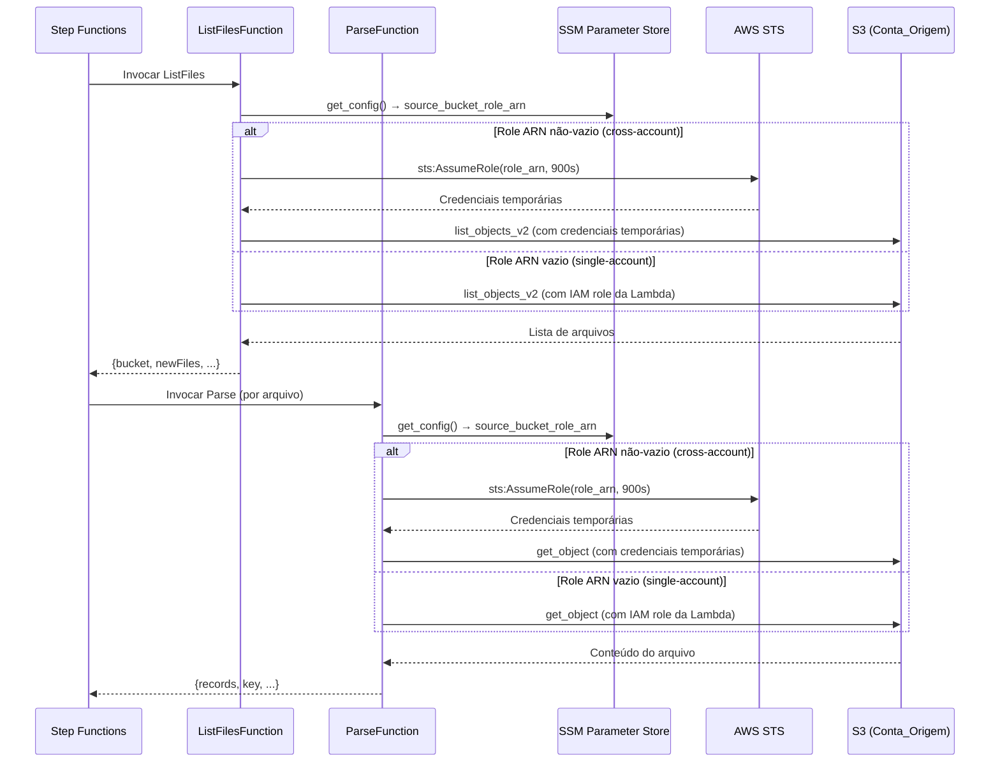
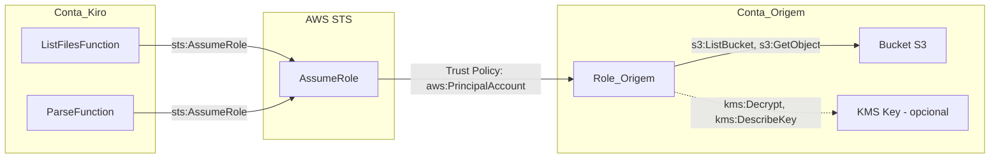
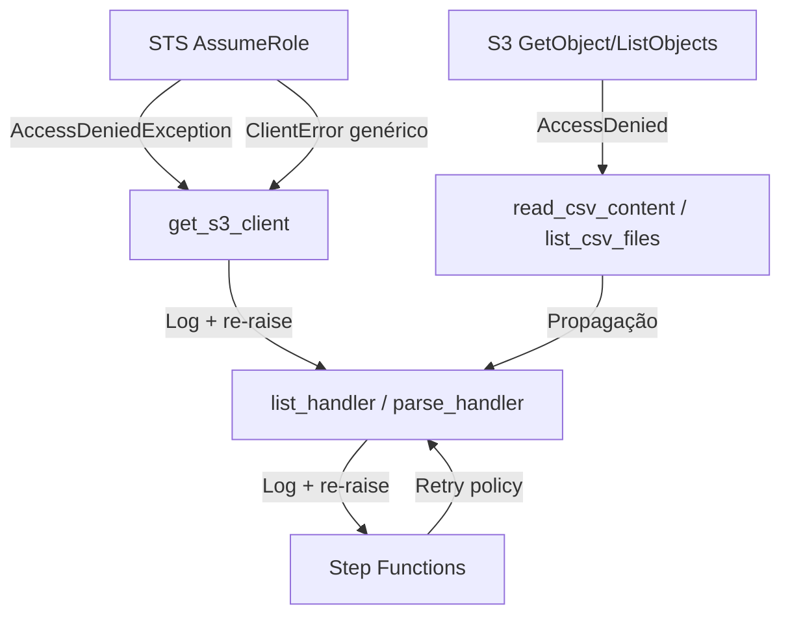

# Documento de Design — Acesso Cross-Account ao S3

## Visão Geral

Esta feature implementa o padrão **STS AssumeRole** para permitir que as Lambdas do pipeline ETL (`ListFilesFunction` e `ParseFunction`) acessem buckets S3 em contas AWS diferentes da Conta_Kiro. A solução é retrocompatível: quando o parâmetro `SourceBucketRoleArn` está vazio, o sistema opera em modo single-account sem nenhuma alteração de comportamento.

### Decisões de Design

1. **Módulo centralizado (`etl/sts_session.py`)**: Toda a lógica de AssumeRole fica em um único módulo reutilizável, evitando duplicação entre handlers e facilitando testes.
2. **Injeção de dependência via `s3_client` opcional**: As funções de leitura S3 (`list_csv_files`, `list_prompt_files`, `read_csv_content`, `read_prompt_file`) recebem um parâmetro opcional `s3_client`. Quando fornecido, substituem a criação interna de `boto3.client("s3")`. Isso segue o padrão já estabelecido no projeto (ex: `AnalyticsWriter` aceita `dynamodb_resource` e `s3_client`).
3. **Credenciais efêmeras (3600s)**: O `DurationSeconds` de 3600 segundos (1 hora) dá margem confortável para o tempo de execução das Lambdas (60s para list, 300s para parse) e para retries do Step Functions. O máximo padrão de uma IAM Role é 1 hora; pode ser estendido até 12 horas via `MaxSessionDuration` na role.
4. **SSM Parameter Store como intermediário**: O Role ARN é armazenado no SSM para que alterações não exijam redeploy das Lambdas — basta atualizar o parâmetro.
5. **Template helper separado**: O `source-account-role.yaml` é deployado na Conta_Origem por um administrador, isolando a criação da Role_Origem do stack principal.

## Arquitetura

### Fluxo Cross-Account



### Modelo de Trust Cross-Account



## Componentes e Interfaces

### 1. `etl/sts_session.py` — Gerenciador STS (NOVO)

Módulo centralizado para criação de clientes S3 com credenciais cross-account.

```python
"""STS session manager — creates cross-account S3 clients via AssumeRole."""

from __future__ import annotations

import os
from typing import Optional

import boto3

try:
    from shared.structured_logger import StructuredLogger
except ImportError:
    from utils.logging import StructuredLogger


def get_s3_client(
    role_arn: str,
    correlation_id: str = "",
) -> Optional[boto3.client]:
    """Obtain an S3 client with cross-account credentials via STS AssumeRole.

    Args:
        role_arn: ARN of the IAM role to assume. If empty or None, returns None
                  to indicate single-account mode.
        correlation_id: Optional correlation ID for structured logging.

    Returns:
        A boto3 S3 client with temporary credentials, or None if role_arn is empty.

    Raises:
        botocore.exceptions.ClientError: If AssumeRole fails (propagated).
    """
    logger = StructuredLogger("sts-session-manager", correlation_id)

    if not role_arn:
        return None

    lambda_name = os.environ.get("AWS_LAMBDA_FUNCTION_NAME", "unknown")
    session_name = f"kiro-etl-{lambda_name}"

    try:
        sts = boto3.client("sts")
        response = sts.assume_role(
            RoleArn=role_arn,
            RoleSessionName=session_name,
            DurationSeconds=3600,
        )
        credentials = response["Credentials"]

        logger.info(
            "Cross-account role assumed successfully",
            roleArn=role_arn,
            sessionName=session_name,
        )

        return boto3.client(
            "s3",
            aws_access_key_id=credentials["AccessKeyId"],
            aws_secret_access_key=credentials["SecretAccessKey"],
            aws_session_token=credentials["SessionToken"],
        )

    except Exception as exc:
        error_type = type(exc).__name__
        logger.error(
            "Failed to assume cross-account role",
            roleArn=role_arn,
            sessionName=session_name,
            errorType=error_type,
            errorMessage=str(exc),
        )
        if "AccessDenied" in error_type or "AccessDenied" in str(exc):
            logger.error(
                "Verifique a trust policy da Role_Origem e as permissões "
                "sts:AssumeRole na Conta_Kiro",
                roleArn=role_arn,
            )
        raise
```

**Decisão**: O `RoleSessionName` inclui o nome da Lambda (`AWS_LAMBDA_FUNCTION_NAME`) para rastreabilidade em CloudTrail. O formato `kiro-etl-{lambda_name}` permite identificar qual Lambda originou cada sessão.

### 2. `etl/config.py` — Alterações

Adicionar o campo `source_bucket_role_arn` ao `EtlConfig` e ler do SSM.

```python
@dataclass(frozen=True)
class EtlConfig:
    """Configuration for the ETL pipeline."""
    bucket_name: str
    source_prefix: str
    prompts_prefix: str
    identity_store_id: str
    source_bucket_role_arn: str  # NOVO — ARN da role cross-account (vazio = single-account)
```

A leitura segue o mesmo padrão dos campos opcionais existentes (`prompts_prefix`, `identity_store_id`):

```python
# Read source bucket role ARN (optional — empty string if not configured)
source_bucket_role_arn = ""
role_arn_param = os.environ.get("SSM_SOURCE_BUCKET_ROLE_ARN", "")
if role_arn_param:
    try:
        source_bucket_role_arn = ssm.get_parameter(Name=role_arn_param)["Parameter"]["Value"]
    except Exception:
        source_bucket_role_arn = ""
```

**Decisão**: Falhas na leitura do SSM retornam string vazia (modo single-account) em vez de propagar exceção, garantindo que o pipeline não quebre por um parâmetro opcional ausente.

### 3. `etl/s3_reader.py` — Alterações

Adicionar parâmetro opcional `s3_client` às funções `list_csv_files` e `read_csv_content`:

```python
def list_csv_files(bucket: str, prefix: str, s3_client=None) -> List[str]:
    s3 = s3_client or boto3.client("s3")
    # ... resto inalterado

def read_csv_content(bucket: str, key: str, s3_client=None) -> str:
    s3 = s3_client or boto3.client("s3")
    # ... resto inalterado
```

### 4. `etl/prompt_s3_reader.py` — Alterações

Mesmo padrão do `s3_reader.py`:

```python
def list_prompt_files(bucket: str, prompts_prefix: str, s3_client=None) -> List[str]:
    s3 = s3_client or boto3.client("s3")
    # ... resto inalterado

def read_prompt_file(bucket: str, key: str, s3_client=None) -> bytes:
    s3 = s3_client or boto3.client("s3")
    # ... resto inalterado
```

### 5. `etl/list_handler.py` — Alterações

Integrar com o Gerenciador_STS no handler:

```python
try:
    from sts_session import get_s3_client
except ImportError:
    from etl.sts_session import get_s3_client

def list_handler(event, context):
    # ... setup existente ...
    cfg = get_config()

    # Obter cliente S3 cross-account se configurado
    cross_account_client = get_s3_client(
        cfg.source_bucket_role_arn,
        correlation_id=correlation_id,
    )

    # Passar cliente para funções de listagem
    csv_keys = list_csv_files(cfg.bucket_name, cfg.source_prefix, s3_client=cross_account_client)
    prompt_keys = list_prompt_files(cfg.bucket_name, cfg.prompts_prefix, s3_client=cross_account_client)
    # ... resto inalterado ...
```

### 6. `etl/parse_handler.py` — Alterações

Mesmo padrão do `list_handler.py`:

```python
try:
    from sts_session import get_s3_client
except ImportError:
    from etl.sts_session import get_s3_client

def parse_handler(event, context):
    # ... setup existente ...
    cfg = get_config()

    cross_account_client = get_s3_client(
        cfg.source_bucket_role_arn,
        correlation_id=correlation_id,
    )

    # Passar cliente para funções de leitura
    if file_type == "csv":
        records = _process_csv_file(bucket, key, source_prefix, logger, s3_client=cross_account_client)
    elif file_type == "prompt":
        records = _process_prompt_file(bucket, key, prompts_prefix, logger, s3_client=cross_account_client)
```

As funções internas `_process_csv_file` e `_process_prompt_file` recebem o `s3_client` e o repassam para `read_csv_content` e `read_prompt_file`.

### 7. `template.yaml` — Alterações

#### Novo Parâmetro

```yaml
Parameters:
  # ... parâmetros existentes ...
  SourceBucketRoleArn:
    Type: String
    Default: ""
    Description: "ARN da IAM Role na conta de origem para acesso cross-account ao S3 (vazio = single-account)"
```

#### Novo Recurso SSM

```yaml
SourceBucketRoleArnParameter:
  Type: AWS::SSM::Parameter
  Properties:
    Name: /kiro-cost-analyzer/source-bucket-role-arn
    Type: String
    Value: !Ref SourceBucketRoleArn
    Description: ARN da IAM Role cross-account para acesso ao bucket S3 de origem
```

#### Condição para IAM Policy

```yaml
Conditions:
  HasSourceBucketRoleArn: !Not [!Equals [!Ref SourceBucketRoleArn, ""]]
```

#### Variável de Ambiente (ListFilesFunction e ParseFunction)

```yaml
Environment:
  Variables:
    # ... variáveis existentes ...
    SSM_SOURCE_BUCKET_ROLE_ARN: /kiro-cost-analyzer/source-bucket-role-arn
```

#### IAM Policy Condicional (ListFilesFunction e ParseFunction)

```yaml
- !If
  - HasSourceBucketRoleArn
  - Sid: AssumeSourceBucketRole
    Effect: Allow
    Action:
      - sts:AssumeRole
    Resource:
      - !Ref SourceBucketRoleArn
  - !Ref "AWS::NoValue"
```

**Decisão**: A policy `sts:AssumeRole` é condicional — só é criada quando `SourceBucketRoleArn` é fornecido. Isso segue o princípio de menor privilégio: em modo single-account, as Lambdas não têm permissão para assumir roles.

#### Variável de Ambiente (BackendFunction)

```yaml
Environment:
  Variables:
    # ... variáveis existentes ...
    SSM_SOURCE_BUCKET_ROLE_ARN: /kiro-cost-analyzer/source-bucket-role-arn
```

#### Novo Endpoint API Gateway (BackendFunction)

```yaml
Events:
  # ... eventos existentes ...
  ConfigSourceBucketRoleArnPut:
    Type: Api
    Properties:
      RestApiId: !Ref ApiGateway
      Path: /api/config/source-bucket-role-arn
      Method: PUT
```

### 8. `source-account-role.yaml` — Template Helper (NOVO)

```yaml
AWSTemplateFormatVersion: '2010-09-09'
Description: >
  Kiro Cost Analyzer — IAM Role cross-account para acesso de leitura ao bucket S3 de origem.
  Deploy este template na conta onde reside o bucket S3.

Parameters:
  KiroAccountId:
    Type: String
    Description: ID da conta AWS onde o Kiro Cost Analyzer está deployado
    AllowedPattern: "\\d{12}"
    ConstraintDescription: Deve ser um ID de conta AWS válido (12 dígitos)

  SourceBucketName:
    Type: String
    Description: Nome do bucket S3 de origem com os CSVs e logs de prompt

  KMSKeyArn:
    Type: String
    Default: ""
    Description: ARN da chave KMS CMK usada para criptografar o bucket (vazio se SSE-S3)

Conditions:
  HasKMSKey: !Not [!Equals [!Ref KMSKeyArn, ""]]

Resources:
  CrossAccountRole:
    Type: AWS::IAM::Role
    Properties:
      RoleName: kiro-cost-analyzer-cross-account-read
      AssumeRolePolicyDocument:
        Version: "2012-10-17"
        Statement:
          - Effect: Allow
            Principal:
              AWS: !Sub "arn:aws:iam::${KiroAccountId}:root"
            Action: sts:AssumeRole
            Condition:
              StringEquals:
                aws:PrincipalAccount: !Ref KiroAccountId

  S3ReadPolicy:
    Type: AWS::IAM::Policy
    Properties:
      PolicyName: kiro-s3-read-access
      Roles:
        - !Ref CrossAccountRole
      PolicyDocument:
        Version: "2012-10-17"
        Statement:
          - Sid: ListSourceBucket
            Effect: Allow
            Action:
              - s3:ListBucket
            Resource:
              - !Sub "arn:aws:s3:::${SourceBucketName}"
          - Sid: ReadSourceObjects
            Effect: Allow
            Action:
              - s3:GetObject
            Resource:
              - !Sub "arn:aws:s3:::${SourceBucketName}/*"

  KMSDecryptPolicy:
    Type: AWS::IAM::Policy
    Condition: HasKMSKey
    Properties:
      PolicyName: kiro-kms-decrypt-access
      Roles:
        - !Ref CrossAccountRole
      PolicyDocument:
        Version: "2012-10-17"
        Statement:
          - Sid: DecryptSourceObjects
            Effect: Allow
            Action:
              - kms:Decrypt
              - kms:DescribeKey
            Resource:
              - !Ref KMSKeyArn

Outputs:
  CrossAccountRoleArn:
    Description: ARN da IAM Role cross-account — use este valor no parâmetro SourceBucketRoleArn do stack principal
    Value: !GetAtt CrossAccountRole.Arn
    Export:
      Name: !Sub "${AWS::StackName}-CrossAccountRoleArn"
```

### 9. `Makefile` — Novo Target

```makefile
# Variáveis para deploy da role na conta de origem
SOURCE_ACCOUNT_PROFILE ?=
KIRO_ACCOUNT_ID ?=
SOURCE_BUCKET_NAME ?=
KMS_KEY_ARN ?=
SOURCE_ROLE_STACK_NAME ?= kiro-cross-account-role

## Deploy da IAM Role cross-account na conta de origem
deploy-source-role:
ifndef SOURCE_ACCOUNT_PROFILE
	$(error SOURCE_ACCOUNT_PROFILE é obrigatório. Uso: make deploy-source-role SOURCE_ACCOUNT_PROFILE=profile KIRO_ACCOUNT_ID=123456789012 SOURCE_BUCKET_NAME=my-bucket)
endif
ifndef KIRO_ACCOUNT_ID
	$(error KIRO_ACCOUNT_ID é obrigatório. Uso: make deploy-source-role SOURCE_ACCOUNT_PROFILE=profile KIRO_ACCOUNT_ID=123456789012 SOURCE_BUCKET_NAME=my-bucket)
endif
ifndef SOURCE_BUCKET_NAME
	$(error SOURCE_BUCKET_NAME é obrigatório. Uso: make deploy-source-role SOURCE_ACCOUNT_PROFILE=profile KIRO_ACCOUNT_ID=123456789012 SOURCE_BUCKET_NAME=my-bucket)
endif
	@echo "🔐 Fazendo deploy da IAM Role cross-account na conta de origem..."
	aws cloudformation deploy \
		--template-file source-account-role.yaml \
		--stack-name $(SOURCE_ROLE_STACK_NAME) \
		--capabilities CAPABILITY_NAMED_IAM \
		--profile $(SOURCE_ACCOUNT_PROFILE) \
		--parameter-overrides \
			KiroAccountId=$(KIRO_ACCOUNT_ID) \
			SourceBucketName=$(SOURCE_BUCKET_NAME) \
			KMSKeyArn=$(KMS_KEY_ARN)
	@echo "✅ Deploy concluído! ARN da Role:"
	@aws cloudformation describe-stacks \
		--stack-name $(SOURCE_ROLE_STACK_NAME) \
		--profile $(SOURCE_ACCOUNT_PROFILE) \
		--query "Stacks[0].Outputs[?OutputKey=='CrossAccountRoleArn'].OutputValue" \
		--output text
	@echo ""
	@echo "📋 Use este ARN no parâmetro SourceBucketRoleArn do stack principal."
```

## Modelos de Dados

### Componente 10: `backend/handlers/config_handler.py` — Alterações

#### GET /api/config — Retornar `sourceBucketRoleArn`

Adicionar leitura do SSM parameter ao `handle_get_config`:

```python
def handle_get_config(ssm_client=None) -> dict:
    # ... leituras existentes ...
    ssm_source_bucket_role_arn = os.environ.get(
        "SSM_SOURCE_BUCKET_ROLE_ARN", "/kiro-cost-analyzer/source-bucket-role-arn"
    )
    source_bucket_role_arn = _get_parameter(ssm, ssm_source_bucket_role_arn)

    return {
        # ... campos existentes ...
        "sourceBucketRoleArn": source_bucket_role_arn,
    }
```

#### PUT /api/config/source-bucket-role-arn — Novo handler

Segue o mesmo padrão dos handlers existentes (`handle_put_config_prompts_prefix`, `handle_put_config_identity_store_id`), com validação de formato ARN:

```python
_ARN_PATTERN = re.compile(r"^arn:aws:iam::\d{12}:role/.+$")


def handle_put_config_source_bucket_role_arn(body: dict, ssm_client=None) -> dict:
    """Handle PUT /api/config/source-bucket-role-arn — validate and save role ARN."""
    role_arn = body.get("sourceBucketRoleArn", "").strip()

    # Permitir valor vazio (desabilita cross-account)
    if role_arn and not _ARN_PATTERN.match(role_arn):
        return {
            "sourceBucketRoleArn": role_arn,
            "status": "error",
            "message": "Formato de ARN inválido. Esperado: arn:aws:iam::<account-id>:role/<role-name>",
        }

    ssm = _get_ssm_client(ssm_client)
    ssm_param = os.environ.get(
        "SSM_SOURCE_BUCKET_ROLE_ARN", "/kiro-cost-analyzer/source-bucket-role-arn"
    )
    ssm.put_parameter(Name=ssm_param, Value=role_arn, Type="String", Overwrite=True)

    return {
        "sourceBucketRoleArn": role_arn,
        "status": "valid",
        "message": "Source bucket role ARN salvo com sucesso"
        if role_arn
        else "Modo cross-account desabilitado",
    }
```

**Decisão**: A validação usa regex `^arn:aws:iam::\d{12}:role/.+$` para garantir formato mínimo de ARN IAM. Valor vazio é permitido para desabilitar cross-account.

### Componente 11: `frontend/src/pages/SettingsPage.tsx` — Alterações

Adicionar campo editável para `sourceBucketRoleArn` na seção de configuração, seguindo o mesmo padrão visual dos campos existentes (bucket name, prompts prefix, identity store ID):

- Campo `Input` do Cloudscape com label "Source Bucket Role ARN"
- Descrição: "ARN da IAM Role cross-account para acesso ao bucket S3 de origem (vazio = single-account)"
- Botão "Salvar" que chama `PUT /api/config/source-bucket-role-arn`
- Feedback visual de sucesso/erro seguindo o padrão existente

### Componente 12: `backend/handler.py` — Roteamento

Adicionar rota para o novo endpoint no roteador principal:

```python
# No bloco de roteamento existente
elif path == "/api/config/source-bucket-role-arn" and method == "PUT":
    result = handle_put_config_source_bucket_role_arn(body)
```

## Modelos de Dados

### EtlConfig (atualizado)

```python
@dataclass(frozen=True)
class EtlConfig:
    bucket_name: str            # Nome do bucket S3 de origem
    source_prefix: str          # Prefixo dos CSVs de atividade
    prompts_prefix: str         # Prefixo dos logs de prompt
    identity_store_id: str      # IAM Identity Center ID
    source_bucket_role_arn: str  # NOVO — ARN da role cross-account (vazio = single-account)
```

### Credenciais Temporárias STS (transiente)

As credenciais retornadas pelo `sts:AssumeRole` são usadas apenas para criar o cliente S3 e nunca são armazenadas:

```python
{
    "AccessKeyId": "ASIA...",
    "SecretAccessKey": "...",
    "SessionToken": "...",
    "Expiration": "2025-01-01T01:00:00Z"  # 3600s (1h) após emissão
}
```

### SSM Parameters (atualizado)

| Caminho | Tipo | Descrição |
|---------|------|-----------|
| `/kiro-cost-analyzer/bucket-name` | String | Nome do bucket S3 de origem |
| `/kiro-cost-analyzer/source-prefix` | String | Prefixo dos CSVs |
| `/kiro-cost-analyzer/prompts-prefix` | String | Prefixo dos logs de prompt |
| `/kiro-cost-analyzer/identity-store-id` | String | IAM Identity Center ID |
| `/kiro-cost-analyzer/source-bucket-role-arn` | String | **NOVO** — ARN da role cross-account |

## Propriedades de Corretude

*Uma propriedade é uma característica ou comportamento que deve ser verdadeiro em todas as execuções válidas de um sistema — essencialmente, uma declaração formal sobre o que o sistema deve fazer. Propriedades servem como ponte entre especificações legíveis por humanos e garantias de corretude verificáveis por máquina.*

### Propriedade 1: Leitura do Role ARN do SSM preserva o valor

*Para qualquer* string `role_arn` retornada pelo SSM Parameter Store (incluindo string vazia), a função `get_config()` SHALL retornar um `EtlConfig` cujo campo `source_bucket_role_arn` é idêntico ao valor lido do SSM.

**Valida: Requisitos 2.2, 2.3**

### Propriedade 2: Criação correta da sessão STS cross-account

*Para qualquer* string `role_arn` não-vazia e qualquer conjunto de credenciais temporárias `(AccessKeyId, SecretAccessKey, SessionToken)` retornado pelo STS, a função `get_s3_client(role_arn)` SHALL:
- Chamar `sts:AssumeRole` com o ARN exato fornecido
- Usar `DurationSeconds=3600`
- Criar e retornar um cliente boto3 S3 configurado com as credenciais temporárias retornadas

**Valida: Requisitos 3.2, 3.3, 3.4, 9.1**

### Propriedade 3: Bypass do STS para modo single-account

*Para qualquer* valor de `role_arn` que seja vazio (`""`) ou `None`, a função `get_s3_client(role_arn)` SHALL retornar `None` sem realizar nenhuma chamada ao STS.

**Valida: Requisitos 3.6, 7.2, 7.3**

### Propriedade 4: Injeção de cliente S3 nas funções de listagem

*Para qualquer* cliente S3 fornecido como parâmetro `s3_client`, as funções `list_csv_files` e `list_prompt_files` SHALL usar exclusivamente esse cliente para todas as chamadas `list_objects_v2`, sem criar um novo `boto3.client("s3")`.

**Valida: Requisitos 4.2, 4.3, 4.5**

### Propriedade 5: Injeção de cliente S3 nas funções de leitura

*Para qualquer* cliente S3 fornecido como parâmetro `s3_client`, as funções `read_csv_content` e `read_prompt_file` SHALL usar exclusivamente esse cliente para todas as chamadas `get_object`, sem criar um novo `boto3.client("s3")`.

**Valida: Requisitos 5.2, 5.3, 5.5**

### Propriedade 6: Propagação de exceções do STS

*Para qualquer* exceção lançada pela chamada `sts:AssumeRole`, a função `get_s3_client` SHALL propagar a exceção ao chamador sem silenciá-la.

**Valida: Requisitos 3.5, 8.2**

### Propriedade 7: Rastreabilidade do RoleSessionName

*Para qualquer* nome de função Lambda definido em `AWS_LAMBDA_FUNCTION_NAME`, o `RoleSessionName` usado na chamada `sts:AssumeRole` SHALL conter o nome da função Lambda.

**Valida: Requisito 9.5**

### Propriedade 8: Validação de formato ARN no endpoint de configuração

*Para qualquer* string `role_arn` fornecida ao endpoint `PUT /api/config/source-bucket-role-arn`:
- Se `role_arn` for vazio, SHALL salvar no SSM e retornar status `valid`
- Se `role_arn` corresponder ao padrão `arn:aws:iam::\d{12}:role/.+`, SHALL salvar no SSM e retornar status `valid`
- Se `role_arn` não corresponder ao padrão, SHALL retornar status `error` sem salvar no SSM

**Valida: Requisitos 11.3, 11.4, 11.5**

## Tratamento de Erros

### Cadeia de Propagação de Erros



### Cenários de Erro

| Cenário | Componente | Ação | Log |
|---------|-----------|------|-----|
| Trust policy incorreta | `get_s3_client` | Log erro + sugestão + re-raise | `roleArn`, `errorType`, `errorMessage` |
| Role ARN inválido | `get_s3_client` | Log erro + re-raise | `roleArn`, `errorType` |
| Permissões S3 insuficientes na Role_Origem | Handler | Log erro com bucket/key + re-raise | `roleArn`, `bucket`, `key`, `errorType` |
| SSM Parameter não encontrado | `get_config` | Retorna string vazia (fallback single-account) | Silencioso (padrão existente) |
| Credenciais expiradas (>3600s) | Cliente S3 | `ExpiredTokenException` → retry pelo Step Functions | Via handler existente |

### Resiliência

- **Step Functions retry**: Erros de STS e S3 são propagados para o Step Functions, que aplica a política de retry configurada (3 tentativas com backoff exponencial).
- **Fallback gracioso**: Falha na leitura do SSM para `source_bucket_role_arn` resulta em modo single-account, não em falha do pipeline.

## Estratégia de Testes

### Testes Unitários (pytest + moto + unittest.mock)

| Módulo | Arquivo de Teste | Cobertura |
|--------|-----------------|-----------|
| `etl/sts_session.py` | `tests/test_sts_session.py` | `get_s3_client` com role ARN válido, vazio, None; erros STS; logging |
| `etl/config.py` | `tests/test_etl_config.py` | Novo campo `source_bucket_role_arn`; leitura SSM; fallback em erro |
| `etl/s3_reader.py` | `tests/test_s3_reader.py` | Parâmetro `s3_client` opcional; comportamento com/sem injeção |
| `etl/prompt_s3_reader.py` | `tests/test_prompt_s3_reader.py` | Parâmetro `s3_client` opcional; comportamento com/sem injeção |
| `etl/list_handler.py` | `tests/test_list_handler.py` | Integração com `get_s3_client`; modo cross-account vs single-account |
| `etl/parse_handler.py` | `tests/test_parse_handler.py` | Integração com `get_s3_client`; modo cross-account vs single-account |
| `backend/handlers/config_handler.py` | `tests/test_config_handler.py` | Novo handler `handle_put_config_source_bucket_role_arn`; validação ARN; GET retorna `sourceBucketRoleArn` |

### Testes Property-Based (Hypothesis)

Biblioteca: **Hypothesis** (já utilizada no projeto — diretório `.hypothesis/` presente).

Cada propriedade de corretude será implementada como um teste property-based com mínimo de **100 iterações**. Os testes usarão mocks para STS e S3, focando na lógica pura dos módulos.

| Propriedade | Arquivo | Tag |
|-------------|---------|-----|
| P1: Leitura do Role ARN | `tests/test_sts_session_properties.py` | `Feature: cross-account-s3-access, Property 1: SSM role ARN round-trip` |
| P2: Criação da sessão STS | `tests/test_sts_session_properties.py` | `Feature: cross-account-s3-access, Property 2: STS session creation` |
| P3: Bypass single-account | `tests/test_sts_session_properties.py` | `Feature: cross-account-s3-access, Property 3: Single-account bypass` |
| P4: Injeção de cliente (listagem) | `tests/test_s3_reader_properties.py` | `Feature: cross-account-s3-access, Property 4: Client injection for listing` |
| P5: Injeção de cliente (leitura) | `tests/test_s3_reader_properties.py` | `Feature: cross-account-s3-access, Property 5: Client injection for reading` |
| P6: Propagação de exceções | `tests/test_sts_session_properties.py` | `Feature: cross-account-s3-access, Property 6: Exception propagation` |
| P7: Rastreabilidade do session name | `tests/test_sts_session_properties.py` | `Feature: cross-account-s3-access, Property 7: Session name traceability` |
| P8: Validação de formato ARN | `tests/test_config_handler_properties.py` | `Feature: cross-account-s3-access, Property 8: ARN format validation` |

### Testes de Infraestrutura (Validação de Templates)

- Validar `template.yaml` com `sam validate`
- Validar `source-account-role.yaml` com `aws cloudformation validate-template`
- Verificar que as IAM policies existentes não foram alteradas (diff do template)

### Testes de Integração (Manual/E2E)

- Deploy com `SourceBucketRoleArn` vazio → pipeline funciona em modo single-account
- Deploy com `SourceBucketRoleArn` válido → pipeline acessa bucket cross-account
- Deploy com `SourceBucketRoleArn` inválido → erros logados, Step Functions retry, falha controlada
