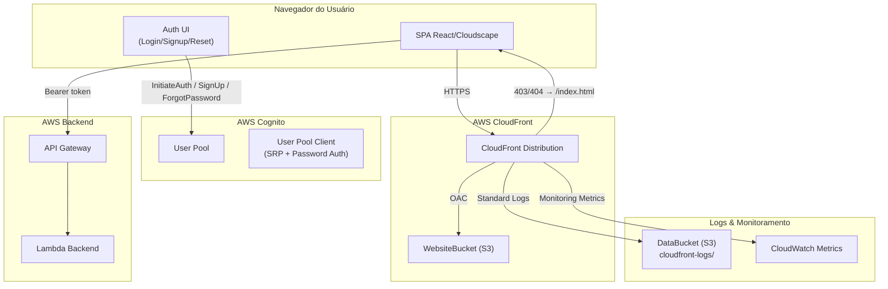
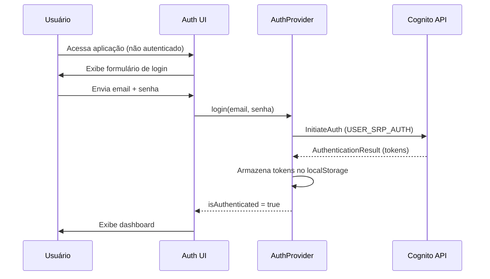

# Documento de Design: Custom Auth + CloudFront

## Visão Geral

Esta feature transforma a arquitetura de autenticação e distribuição do frontend da aplicação Kiro Cost Analyzer. Atualmente, a autenticação depende do fluxo OAuth2/PKCE com redirecionamento para a Hosted UI do Cognito, e o frontend roda apenas localmente em `localhost:5173`. A nova arquitetura implementa:

1. **UI de autenticação customizada** — Páginas de login, cadastro, esqueci-senha e redefinição de senha construídas com componentes Cloudscape no tema escuro, eliminando o redirecionamento para a Hosted UI.
2. **Autenticação direta via API do Cognito** — O `AuthProvider` é refatorado para usar chamadas diretas às APIs do Cognito (`InitiateAuth`, `SignUp`, `ConfirmSignUp`, `ForgotPassword`, `ConfirmForgotPassword`) via o SDK `amazon-cognito-identity-js` ou chamadas HTTP diretas.
3. **Distribuição CloudFront com S3** — Uma distribuição CloudFront serve a SPA do `WebsiteBucket` via OAC, com HTTPS forçado, roteamento SPA e logs avançados.

### Decisões de Design Principais

- **`amazon-cognito-identity-js`**: Será utilizado o pacote `amazon-cognito-identity-js` para as chamadas diretas ao Cognito. Este pacote é a biblioteca oficial da AWS para autenticação client-side com Cognito User Pools, suporta SRP nativamente (sem expor senhas em trânsito), e é amplamente adotado. A alternativa seria usar `@aws-sdk/client-cognito-identity-provider`, mas o `amazon-cognito-identity-js` é mais leve e projetado especificamente para SPAs.
- **Logout local**: O logout será puramente local (limpar tokens do `localStorage` e resetar estado React), sem redirecionar para o endpoint `/logout` da Hosted UI. Isso é possível porque a autenticação não usa mais sessões server-side do Cognito.
- **OAC em vez de OAI**: Será usado Origin Access Control (OAC) em vez do legado Origin Access Identity (OAI), seguindo a recomendação atual da AWS para novas distribuições CloudFront.

## Arquitetura



### Fluxo de Autenticação (Novo)



## Componentes e Interfaces

### 1. Páginas de Autenticação (Auth UI)

Novas páginas React usando componentes Cloudscape:

| Página | Rota | Descrição |
|--------|------|-----------|
| `LoginPage` | `/login` | Formulário de email/senha com links para cadastro e esqueci-senha |
| `SignupPage` | `/signup` | Formulário de cadastro com email, senha e confirmação + etapa de código de verificação |
| `ForgotPasswordPage` | `/forgot-password` | Formulário de email para solicitar código de redefinição |
| `ResetPasswordPage` | `/reset-password` | Formulário com código de verificação, nova senha e confirmação |

**Componentes Cloudscape utilizados**: `Form`, `FormField`, `Input`, `Button`, `Alert`, `Container`, `SpaceBetween`, `Box`, `Header`, `Link`.

Cada página segue o padrão:
```typescript
interface AuthPageProps {
  // Sem props — usa useAuth() para acessar o AuthProvider
}

// Estado interno de cada página:
interface AuthFormState {
  email: string;
  password: string;
  confirmPassword?: string;  // signup e reset
  verificationCode?: string; // confirm signup e reset
  loading: boolean;
  error: string | null;
  success: string | null;
}
```

### 2. AuthProvider Refatorado

O `AuthProvider.tsx` será refatorado para eliminar o fluxo PKCE/redirect e usar chamadas diretas ao Cognito:

```typescript
// Nova interface do AuthContext (expandida)
export interface AuthContextValue {
  isAuthenticated: boolean;
  user: AuthUser | null;
  idToken: string | null;
  loading: boolean;
  login: (email: string, password: string) => Promise<void>;
  signup: (email: string, password: string) => Promise<void>;
  confirmSignup: (email: string, code: string) => Promise<void>;
  forgotPassword: (email: string) => Promise<void>;
  resetPassword: (email: string, code: string, newPassword: string) => Promise<void>;
  logout: () => void;
}
```

**Dependência**: `amazon-cognito-identity-js` — pacote npm que encapsula as chamadas ao Cognito User Pool.

**Funções internas do AuthProvider**:

| Função | API Cognito | Descrição |
|--------|-------------|-----------|
| `login` | `authenticateUser` (SRP) | Autentica via SRP, armazena tokens |
| `signup` | `signUp` | Cria conta no User Pool |
| `confirmSignup` | `confirmRegistration` | Confirma email com código |
| `forgotPassword` | `forgotPassword` | Solicita código de redefinição |
| `resetPassword` | `confirmPassword` | Redefine senha com código |
| `logout` | — (local) | Limpa tokens e estado |
| `refreshSession` | `refreshSession` | Renova tokens com refresh_token |

**Armazenamento de tokens**: Mantém o padrão atual com chaves `kiro_id_token`, `kiro_access_token`, `kiro_refresh_token`, `kiro_token_expiry` no `localStorage`.

### 3. Roteamento da Aplicação (App.tsx)

O `App.tsx` será atualizado para:
- Renderizar as páginas de auth quando `!isAuthenticated` em vez do botão simples "Entrar"
- Adicionar rotas para `/login`, `/signup`, `/forgot-password`, `/reset-password`
- Redirecionar usuários não autenticados para `/login`
- Remover a rota `/callback` (não mais necessária com auth direta)

### 4. Infraestrutura CloudFront (template.yaml)

Novos recursos no `template.yaml`:

```yaml
# Novos recursos:
CloudFrontOAC:              # AWS::CloudFront::OriginAccessControl
CloudFrontDistribution:     # AWS::CloudFront::Distribution
WebsiteBucketPolicy:        # AWS::S3::BucketPolicy (para OAC)
DataBucketLoggingPolicy:    # AWS::S3::BucketPolicy (para logs do CloudFront)
CloudFrontMonitoring:       # AWS::CloudFront::MonitoringSubscription

# Recursos modificados:
CognitoUserPoolClient:      # Adicionar ExplicitAuthFlows + CallbackURLs/LogoutURLs
```

**Configuração da distribuição CloudFront**:
- **Origem**: `WebsiteBucket` via OAC (S3 REST API endpoint, não website endpoint)
- **ViewerProtocolPolicy**: `redirect-to-https`
- **DefaultRootObject**: `index.html`
- **Custom Error Responses**: 403 → `/index.html` (200), 404 → `/index.html` (200)
- **Standard Logging**: Habilitado no `DataBucket` com prefixo `cloudfront-logs/`
- **Monitoring Metrics**: `RealtimeMetricsSubscriptionConfig` habilitado

**Modificações no CognitoUserPoolClient**:
- `ExplicitAuthFlows`: Adicionar `ALLOW_USER_SRP_AUTH` e `ALLOW_USER_PASSWORD_AUTH`
- `CallbackURLs`: Adicionar `https://<CloudFrontDomain>/callback`
- `LogoutURLs`: Adicionar `https://<CloudFrontDomain>/`
- Manter URLs de `localhost:5173` para desenvolvimento local

## Modelos de Dados

### Tokens de Autenticação (localStorage)

Sem alteração no modelo de armazenamento — mantém as mesmas chaves:

| Chave | Tipo | Descrição |
|-------|------|-----------|
| `kiro_id_token` | string (JWT) | Token de identidade com claims do usuário |
| `kiro_access_token` | string (JWT) | Token de acesso para APIs |
| `kiro_refresh_token` | string | Token para renovação de sessão |
| `kiro_token_expiry` | string (timestamp ms) | Timestamp de expiração em milissegundos |

### AuthUser (sem alteração)

```typescript
export interface AuthUser {
  sub: string;
  email: string;
  groups: string[];
  [key: string]: unknown;
}
```

### Variáveis de Ambiente do Frontend

Atualização do `.env.local` e `.env.example`:

| Variável | Valor (dev) | Descrição |
|----------|-------------|-----------|
| `VITE_API_URL` | `https://...execute-api...` | URL da API Gateway (sem alteração) |
| `VITE_COGNITO_USER_POOL_ID` | `sa-east-1_XXXXX` | **Novo** — ID do User Pool para SDK |
| `VITE_COGNITO_CLIENT_ID` | `i16og5udd4s5qilq38dmhfa18` | ID do client (já existe) |
| `VITE_COGNITO_REDIRECT_URI` | *(removido)* | Não mais necessário |
| `VITE_COGNITO_DOMAIN` | *(removido)* | Não mais necessário |

> **Nota**: `VITE_COGNITO_USER_POOL_ID` é necessário para o `amazon-cognito-identity-js` configurar o `CognitoUserPool`.

## Propriedades de Corretude

*Uma propriedade é uma característica ou comportamento que deve ser verdadeiro em todas as execuções válidas de um sistema — essencialmente, uma declaração formal sobre o que o sistema deve fazer. Propriedades servem como ponte entre especificações legíveis por humanos e garantias de corretude verificáveis por máquina.*

### Propriedade 1: Armazenamento de tokens após autenticação (round-trip)

*Para qualquer* resposta de autenticação bem-sucedida do Cognito (mockado), contendo id_token, access_token e refresh_token, o AuthProvider DEVE armazenar todos os três tokens no localStorage com as chaves corretas (`kiro_id_token`, `kiro_access_token`, `kiro_refresh_token`) e definir `kiro_token_expiry` como um timestamp futuro válido. Além disso, ler o id_token armazenado e decodificá-lo DEVE produzir o mesmo payload do token original.

**Valida: Requisitos 1.2, 5.6**

### Propriedade 2: Exibição de erros de autenticação

*Para qualquer* erro retornado pela API de autenticação do Cognito (NotAuthorizedException, UserNotFoundException, UserNotConfirmedException, etc.), a UI de login DEVE exibir uma mensagem de erro não-vazia e visível ao usuário, sem lançar exceções não tratadas.

**Valida: Requisito 1.3**

### Propriedade 3: Exibição de erros de política de senha

*Para qualquer* erro de violação de política de senha retornado pelo Cognito (InvalidPasswordException com mensagens variadas sobre comprimento mínimo, maiúsculas, números, etc.), a Auth UI DEVE exibir uma mensagem de erro descritiva que inclua o requisito específico da política violada.

**Valida: Requisitos 2.6, 3.6**

### Propriedade 4: Autenticação direta sem redirecionamento

*Para qualquer* tentativa de login com credenciais válidas, o AuthProvider DEVE chamar a API do Cognito diretamente (via `authenticateUser` do SDK) e NÃO DEVE alterar `window.location` para redirecionar a um domínio externo do Cognito.

**Valida: Requisito 5.1**

### Propriedade 5: Renovação de tokens expirados

*Para qualquer* estado em que o `id_token` está expirado mas o `refresh_token` é válido, o AuthProvider DEVE tentar renovar a sessão usando `refreshSession` antes de definir `isAuthenticated` como `false` ou exigir re-autenticação.

**Valida: Requisito 5.7**

### Propriedade 6: Logout limpa estado sem redirecionamento externo

*Para qualquer* estado autenticado (com tokens armazenados no localStorage e `isAuthenticated === true`), ao acionar o logout, o AuthProvider DEVE: (a) remover todas as chaves de token do localStorage (`kiro_id_token`, `kiro_access_token`, `kiro_refresh_token`, `kiro_token_expiry`), (b) definir `isAuthenticated` como `false` e `user` como `null`, e (c) NÃO redirecionar para nenhum endpoint externo do Cognito.

**Valida: Requisitos 10.1, 10.2, 10.4**

## Tratamento de Erros

### Erros de Autenticação (Frontend)

| Erro Cognito | Contexto | Mensagem para o Usuário |
|--------------|----------|------------------------|
| `NotAuthorizedException` | Login | "Email ou senha incorretos." |
| `UserNotFoundException` | Login | "Email ou senha incorretos." (mesma mensagem por segurança) |
| `UserNotConfirmedException` | Login | "Conta não confirmada. Verifique seu email." |
| `UsernameExistsException` | Cadastro | "Já existe uma conta com este email." |
| `InvalidPasswordException` | Cadastro/Reset | Mensagem dinâmica do Cognito sobre a política violada |
| `CodeMismatchException` | Confirmação/Reset | "Código de verificação inválido." |
| `ExpiredCodeException` | Confirmação/Reset | "Código de verificação expirado. Solicite um novo." |
| `LimitExceededException` | Qualquer | "Muitas tentativas. Aguarde alguns minutos." |
| `NetworkError` | Qualquer | "Erro de conexão. Verifique sua internet." |

**Princípios de tratamento de erros**:
- Nunca expor detalhes internos do Cognito ao usuário
- Unificar `UserNotFoundException` e `NotAuthorizedException` no login para evitar enumeração de contas
- Exibir erros inline no formulário usando o componente `Alert` do Cloudscape com `type="error"`
- Limpar mensagens de erro quando o usuário começa a digitar novamente

### Erros de Infraestrutura (CloudFront)

- **403/404 do S3**: Tratados automaticamente pelo Custom Error Response do CloudFront, retornando `/index.html` com status 200 para suportar roteamento SPA.
- **5xx do CloudFront**: Comportamento padrão do CloudFront — exibe página de erro genérica. Monitorado via CloudWatch Metrics.

### Renovação de Tokens

- Se o `refresh_token` falhar na renovação (expirado ou revogado), o AuthProvider limpa os tokens e redireciona para a tela de login.
- A renovação é tentada automaticamente quando o `id_token` está expirado e o usuário tenta uma ação que requer autenticação.

## Estratégia de Testes

### Abordagem Dual: Testes Unitários + Testes de Propriedade

Esta feature combina lógica de frontend (autenticação, gerenciamento de estado) com configuração de infraestrutura (CloudFormation). A estratégia de testes reflete essa dualidade:

### Testes de Propriedade (Property-Based Testing)

**Biblioteca**: `fast-check` — biblioteca de PBT para TypeScript/JavaScript, compatível com o ecossistema Vitest.

**Configuração**: Mínimo de 100 iterações por teste de propriedade.

Cada propriedade de corretude será implementada como um teste de propriedade individual:

| Propriedade | Descrição | Gerador |
|-------------|-----------|---------|
| P1 | Token storage round-trip | Gerar tokens JWT aleatórios com payloads variados |
| P2 | Auth error display | Gerar erros Cognito aleatórios de uma lista de tipos conhecidos |
| P3 | Password policy error display | Gerar mensagens de InvalidPasswordException variadas |
| P4 | Direct auth without redirect | Gerar credenciais aleatórias, verificar ausência de redirect |
| P5 | Token refresh on expiry | Gerar estados de token com diferentes combinações de expiração |
| P6 | Logout clears state | Gerar estados autenticados com tokens variados |

**Tag format**: `Feature: custom-auth-cloudfront, Property {N}: {descrição}`

### Testes Unitários (Example-Based)

**Framework**: Vitest + React Testing Library

Testes unitários focados em:
- **Renderização de páginas**: Verificar que cada página de auth renderiza os campos corretos (1.1, 2.1, 3.1, 3.3)
- **Navegação**: Verificar links entre páginas de auth (1.5, 1.6, 2.7)
- **Fluxos de sucesso**: Verificar cadastro → confirmação → login (2.2, 2.3, 2.4)
- **Edge cases**: Email duplicado (2.5), código expirado (3.5)
- **Interface do context**: Verificar que todas as funções estão expostas (5.8)
- **Logout UI**: Verificar que o formulário de login aparece após logout (10.3)

### Testes de Infraestrutura (Smoke Tests)

Validação do `template.yaml` via testes que parsam o YAML e verificam:
- ExplicitAuthFlows contém os valores corretos (4.1–4.4)
- CloudFront Distribution configurada com OAC, HTTPS, DefaultRootObject (6.1–6.4)
- Custom Error Responses para 403 e 404 (7.1–7.2)
- CallbackURLs e LogoutURLs incluem domínio CloudFront e localhost (8.1–8.4)
- Outputs CloudFrontDomainName e CloudFrontDistributionId existem (9.1–9.2)
- Standard Logging e Monitoring Metrics habilitados (11.1–11.3)

## Estratégia de Deploy

### Visão Geral

O deploy é dividido em duas etapas: (1) infraestrutura via SAM e (2) frontend estático via sync S3 + invalidação CloudFront. Um `Makefile` na raiz do projeto orquestra ambas as etapas.

### Makefile

O `Makefile` expõe os seguintes targets:

| Target | Descrição |
|--------|-----------|
| `make deploy` | Deploy completo: infra + frontend |
| `make deploy-infra` | Apenas `sam build` + `sam deploy` |
| `make deploy-frontend` | Build do frontend, sync S3, invalidação CloudFront |
| `make dev` | Sobe o frontend local (`npm run dev`) |

### Fluxo do `make deploy-frontend`

```
1. cd frontend && npm ci && npm run build
2. aws s3 sync dist/ s3://<WebsiteBucket>/ --delete
3. aws cloudfront create-invalidation --distribution-id <DistributionId> --paths "/*"
```

**Detalhes**:
- O `npm run build` gera os estáticos em `frontend/dist/` com as variáveis de ambiente do `.env.local` (ou `.env.production` se existir).
- O `s3 sync --delete` garante que arquivos removidos do build também são removidos do bucket.
- A invalidação do CloudFront (`/*`) força o CDN a buscar os novos arquivos do S3 imediatamente, sem esperar o TTL do cache expirar.
- Os valores de `WebsiteBucket` e `CloudFrontDistributionId` são lidos automaticamente dos outputs do CloudFormation via `aws cloudformation describe-stacks`.

### Fluxo do `make deploy` (completo)

```
1. make deploy-infra     → sam build + sam deploy (cria/atualiza CloudFront, Cognito, etc.)
2. make deploy-frontend  → build + sync S3 + invalidação CloudFront
```

> **Nota**: Na primeira execução, `make deploy-infra` precisa rodar antes do frontend porque o `WebsiteBucket` e o `CloudFrontDistributionId` ainda não existem. Nas execuções subsequentes, `make deploy-frontend` pode rodar independentemente se só o frontend mudou.

### Variáveis de Ambiente para Produção

Para o build de produção, o frontend precisa das variáveis corretas. O Makefile gera um `.env.production` temporário a partir dos outputs do CloudFormation:

```makefile
# Extrai outputs do stack e gera .env.production
STACK_OUTPUTS := $(shell aws cloudformation describe-stacks \
  --stack-name $(STACK_NAME) --query "Stacks[0].Outputs" --output json)

deploy-frontend:
	@echo "Gerando .env.production..."
	@echo "VITE_API_URL=$$(echo '$(STACK_OUTPUTS)' | jq -r '...')" > frontend/.env.production
	@echo "VITE_COGNITO_USER_POOL_ID=..." >> frontend/.env.production
	@echo "VITE_COGNITO_CLIENT_ID=..." >> frontend/.env.production
	cd frontend && npm ci && npm run build
	aws s3 sync frontend/dist/ s3://$(WEBSITE_BUCKET)/ --delete
	aws cloudfront create-invalidation --distribution-id $(CF_DIST_ID) --paths "/*"
```
