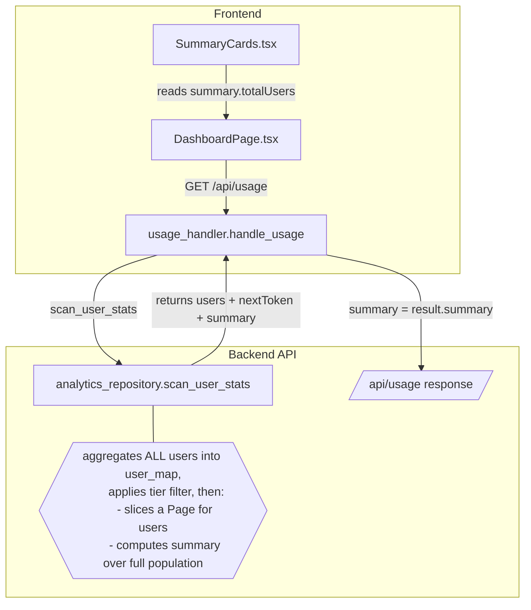

# Design Document — Dashboard Active User Count

## Overview

The `/api/usage` endpoint returns a paginated list of users and an aggregated `summary` block. The summary is currently derived from the returned page only, so every summary metric is truncated to the first 50 users:

- `usage_handler.py:208` caps the page at `limit = min(int(query_params.get("limit", 50)), 50)`.
- `usage_handler.py` calls `_compute_summary(users)` where `users` is the formatted page (≤50).
- `_compute_summary` (`usage_handler.py:67`) sets `total_users = len(users)` and sums credits/overage over that same page.

Meanwhile `Analytics_Repository.scan_user_stats` already scans the **entire** table and aggregates every user into `user_map` before slicing a page (`analytics_repository.py:519`, `page = users[start_index : start_index + limit]`). The full population is known server-side (`len(users)` at line 520) but never returned.

The fix moves summary computation into the repository, where it is calculated once over the full, filtered, aggregated population and returned alongside the page. The handler consumes that summary instead of recomputing it from the page. No extra scan is introduced because the aggregation already happens.

The response schema is unchanged: `summary` keeps the same four fields (`totalUsers`, `totalCredits`, `totalOverageCredits`, `averageCreditsPerUser`); only the values become correct. The frontend `SummaryCards` component already binds to `summary.totalUsers` and requires no change.

---

## Architecture



### Data Flow (after change)

1. `handle_usage` calls `scan_user_stats(limit, next_token, subscription_tier, start_date, end_date)` exactly as today.
2. `scan_user_stats` scans all `STATS#DAILY#` items, aggregates into `user_map`, applies the optional `subscription_tier` filter, and sorts.
3. **New:** before slicing the page, the repository computes the summary over the full filtered list (`totalUsers`, `totalCredits`, `totalOverageCredits`, `averageCreditsPerUser`).
4. The repository returns `{ users: <page>, nextToken, scannedCount, summary: <aggregated> }`.
5. `handle_usage` sets the response `summary` directly from `result["summary"]`, enriches only the page users, and returns.

---

## Components and Interfaces

### 1. Analytics_Repository.scan_user_stats (Backend data layer)

**Current return contract:**

```python
return {
    "users": self._convert_decimals(page),
    "nextToken": result_next_token,
    "scannedCount": scanned_count,
}
```

**New return contract** — add a `summary` key computed over the full filtered `users` list (after the tier filter, before pagination). The aggregation is extracted into a module-level **pure** function `aggregate_user_summary(users)` so it can be exhaustively property-tested without DynamoDB, consistent with the project's pattern of pure functions for Hypothesis:

```python
def aggregate_user_summary(users: list[dict]) -> dict:
    """Aggregate the summary over an entire (already filtered) user list. Pure."""
    total_users = len(users)
    total_credits = round(sum(float(u.get("totalCredits", 0)) for u in users), 2)
    total_overage = round(sum(float(u.get("overageCredits", 0)) for u in users), 2)
    return {
        "totalUsers": total_users,
        "totalCredits": total_credits,
        "totalOverageCredits": total_overage,
        "averageCreditsPerUser": (
            round(total_credits / total_users, 2) if total_users > 0 else 0
        ),
    }
```

`scan_user_stats` then calls it and includes the result in its return dict:

```python
summary = aggregate_user_summary(users)  # users = full, tier-filtered, aggregated list

return {
    "users": self._convert_decimals(page),
    "nextToken": result_next_token,
    "scannedCount": scanned_count,
    "summary": summary,
}
```

Notes:
- `users` here is the fully aggregated, tier-filtered list (the same variable already sliced for the page), so the summary covers the whole Filtered_Population and is invariant to `next_token`/`limit`.
- The summary is computed **before** `_convert_decimals` is applied to the page; the summary values are plain floats/ints, matching the existing `_compute_summary` output types.
- Date-range filtering is already applied inside the scan via the `FilterExpression` on `STATS#DAILY#{date}`, so the aggregated totals already respect the date window.

### 2. Usage_Handler.handle_usage (Backend API layer)

Replace the page-derived summary with the repository summary:

```python
result = repo.scan_user_stats(
    limit=limit,
    next_token=next_token,
    subscription_tier=subscription_tier,
    start_date=query_params.get("startDate"),
    end_date=query_params.get("endDate"),
)

users = [_format_user(u) for u in result.get("users", [])]
# ... existing per-page enrichment (names, tombstone, activity summary) ...

summary = result.get("summary", _compute_summary(users))  # fallback keeps back-compat
```

- `_compute_summary` is retained only as a defensive fallback (e.g. older repository stubs in tests) and for clarity; the authoritative summary comes from the repository.
- Date parameters are now forwarded to `scan_user_stats` so the summary reflects the date window. (The handler already reads `startDate`/`endDate` for the `period` block.)
- The single-user path `_handle_single_user_usage` is untouched — it builds its own summary from one partition.

### 3. SummaryCards (Frontend)

No change. `SummaryCards.tsx:31` already renders `summary?.totalUsers?.toString()`. Once the backend sends the correct value, the card is correct. `DashboardPage.fetchUsers` continues to call `/api/usage` without `limit`/`nextToken`.

### 4. Export path

`GET /api/usage/export` (`export_handler.py`) exports the user rows. The export is per-row and does not depend on the summary block, so it is unaffected. (If the export currently exports only the first page, that is a separate pre-existing limitation and is out of scope here.)

---

## Data Models

No new DynamoDB items, attributes, or SSM parameters. No change to the `UsageResponse` TypeScript interface (`frontend/src/types/index.ts`) — the `summary` shape is identical.

---

## Error Handling

- The change is pure aggregation over already-fetched data; it introduces no new I/O and therefore no new failure modes.
- If `scan_user_stats` returns no `summary` key (e.g. a partial test double), `handle_usage` falls back to `_compute_summary(users)`, preserving current behavior rather than raising.
- Division for `averageCreditsPerUser` guards against an empty population (returns 0), matching Requirement 2.4.

---

## Correctness Properties

These properties are validated by property-based tests (Hypothesis), minimum 100 iterations each, consistent with project testing standards.

- **Property 1 — Count totality.** For any generated set of users with daily stats, `summary.totalUsers` equals the number of distinct users with at least one daily stat in the Filtered_Population, for every `limit` in a representative range. _Validates: 1.1, 1.2, 1.3, 1.4._
- **Property 2 — Summary pagination invariance.** For the same filters, the Summary_Block returned on page 1 equals the Summary_Block returned on every subsequent page reached via `nextToken`. _Validates: 2.5._
- **Property 3 — Total conservation.** `summary.totalCredits` equals the sum of `totalCredits` across the union of all users returned by following pagination to exhaustion; likewise for `totalOverageCredits`. _Validates: 2.1, 2.2, 3.3._
- **Property 4 — Average coherence.** When `totalUsers > 0`, `averageCreditsPerUser == round(totalCredits / totalUsers, 2)`; when `totalUsers == 0`, it is 0. _Validates: 2.3, 2.4._
- **Property 5 — Tier filter soundness.** With a `subscriptionTier` filter, every user counted in the summary has that tier, and the count equals the number of distinct filtered users. _Validates: 3.1, 3.3._

---

## Testing Strategy

- **Unit tests (pytest + moto):** seed the Analytics_Table with more than 50 users across multiple daily stats and assert `summary.totalUsers` equals the seeded distinct-user count (not 50); assert credit/overage sums match the full seeded totals; assert the `users` array is still capped at 50 and `nextToken` is present.
- **Regression test:** a table with exactly 60 active users returns `summary.totalUsers == 60` while `len(response["users"]) == 50`.
- **Filter tests:** tier and date-range filters produce a summary scoped to the filtered population.
- **Fallback test:** a repository stub returning no `summary` key still yields a valid response via `_compute_summary`.
- **Property tests:** implement Properties 1–5 above.
- **Frontend:** existing `SummaryCards`/`DashboardPage` tests remain valid; add a case asserting the card renders the backend-provided total unchanged (no client-side cap).

---

## Out of Scope (recorded for traceability)

- Ingesting the Kiro subscription roster to report **total licenses** and **license utilization** ("N active of M licensed"). No data source exists today; see requirements Out of Scope.
- Detecting **never-active seats** (provisioned but zero usage). Depends on roster ingestion above. The existing `inactiveSubscribers` analysis in `recommendation_handler.py` covers only users the application has ingested at least once.
