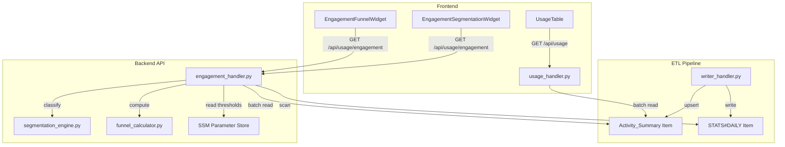

# Design Document — Dormant User Detection

## Overview

This feature extends the Kiro Cost Analyzer's engagement segmentation system with activity frequency awareness. It introduces:

1. **Activity_Summary** — a pre-computed DynamoDB item per user tracking `firstActiveDate`, `lastActiveDate`, and `activeDays`, upserted during ETL writes.
2. **Dormant classification** — a fifth engagement category ("dormant") for users idle beyond a configurable threshold (default 30 days).
3. **Frequency badges** — color-coded status indicators (Active/Recent/Inactive/Dormant) in the Users table based on `daysSinceLastActive`.
4. **Widget updates** — the segmentation pie chart and funnel widget display dormant data and churn risk metrics.
5. **Configurable threshold** — `dormantDaysThreshold` stored in SSM alongside existing engagement thresholds.

The design preserves backward compatibility: when Activity_Summary items are absent, the system degrades gracefully to the existing 4-category classification.

---

## Architecture



### Data Flow

1. **ETL Write Path**: When `writer_handler.py` processes a daily stat record, it calls `AnalyticsWriter.upsert_activity_summary(user_id, date)` which performs a conditional `UpdateItem` on `PK=USER#{userId}, SK=ACTIVITY_SUMMARY`.
2. **API Read Path**: `engagement_handler.py` scans user stats, then batch-fetches Activity_Summary items for all discovered users via `BatchGetItem`. It passes `daysSinceLastActive` per user to the segmentation engine.
3. **Classification**: The segmentation engine applies the existing tier logic first, then reclassifies "idle" users as "dormant" if their `daysSinceLastActive >= dormantDaysThreshold`.
4. **Frontend**: Widgets consume the updated API response which now includes a "dormant" segment and `dormantRate`/`churnRiskRate` derived metrics.

---

## Components and Interfaces

### 1. AnalyticsWriter (ETL Layer)

**New method**: `upsert_activity_summary(user_id: str, date: str) -> None`

```python
def upsert_activity_summary(self, user_id: str, date: str) -> None:
    """Upsert Activity_Summary item for a user.

    Uses conditional expressions:
    - firstActiveDate: SET if_not_exists (first write wins)
    - lastActiveDate: SET if greater than current value
    - activeDays: ADD 1
    """
    self._table.update_item(
        Key={
            "PK": f"USER#{user_id}",
            "SK": "ACTIVITY_SUMMARY",
        },
        UpdateExpression=(
            "SET firstActiveDate = if_not_exists(firstActiveDate, :date), "
            "lastActiveDate = if_not_exists(lastActiveDate, :date) "
            "ADD activeDays :one"
        ),
        ExpressionAttributeValues={
            ":date": date,
            ":one": 1,
        },
    )
    # Separate conditional update for lastActiveDate (only if newer)
    try:
        self._table.update_item(
            Key={
                "PK": f"USER#{user_id}",
                "SK": "ACTIVITY_SUMMARY",
            },
            UpdateExpression="SET lastActiveDate = :date",
            ConditionExpression="lastActiveDate < :date",
            ExpressionAttributeValues={":date": date},
        )
    except self._table.meta.client.exceptions.ConditionalCheckFailedException:
        pass  # Current lastActiveDate is already >= date
```

**Integration point**: Called from `_write_csv_record()` and `_write_prompt_record()` in `writer_handler.py` after writing the daily stat.

### 2. AnalyticsRepository (Backend Layer)

**New methods**:

```python
def get_activity_summary(self, user_id: str) -> dict | None:
    """Get Activity_Summary item for a single user."""
    response = self._table.get_item(
        Key={"PK": f"USER#{user_id}", "SK": "ACTIVITY_SUMMARY"}
    )
    item = response.get("Item")
    return self._convert_decimals(item) if item else None

def batch_get_activity_summaries(self, user_ids: list[str]) -> dict[str, dict]:
    """Batch-retrieve Activity_Summary items for multiple users.

    Uses BatchGetItem with chunks of 100 keys (DynamoDB limit).
    Returns a dict mapping userId -> summary dict (or absent if not found).
    """
    results: dict[str, dict] = {}
    # Process in chunks of 100
    for i in range(0, len(user_ids), 100):
        chunk = user_ids[i:i + 100]
        keys = [{"PK": f"USER#{uid}", "SK": "ACTIVITY_SUMMARY"} for uid in chunk]
        response = self._resource.batch_get_item(
            RequestItems={self._table_name: {"Keys": keys}}
        )
        for item in response.get("Responses", {}).get(self._table_name, []):
            uid = item["PK"].replace("USER#", "", 1)
            results[uid] = self._convert_decimals(item)
        # Handle unprocessed keys (retry)
        unprocessed = response.get("UnprocessedKeys", {}).get(self._table_name)
        while unprocessed:
            response = self._resource.batch_get_item(
                RequestItems={self._table_name: unprocessed}
            )
            for item in response.get("Responses", {}).get(self._table_name, []):
                uid = item["PK"].replace("USER#", "", 1)
                results[uid] = self._convert_decimals(item)
            unprocessed = response.get("UnprocessedKeys", {}).get(self._table_name)
    return results
```

### 3. Segmentation Engine

**Changes to `Thresholds`**:

```python
@dataclass
class Thresholds:
    power_messages: int = 100
    power_days_active: int = 10
    active_messages: int = 20
    active_days_active: int = 3
    dormant_days_threshold: int = 30  # NEW
```

**New type extension**:

```python
EngagementCategory = Literal["power", "active", "light", "idle", "dormant"]
```

**New function** `reclassify_dormant`:

```python
def reclassify_dormant(
    classifications: dict[str, EngagementCategory],
    frequency_data: dict[str, int | None],  # userId -> daysSinceLastActive (None = no data)
    dormant_days_threshold: int,
) -> dict[str, EngagementCategory]:
    """Reclassify idle users as dormant based on frequency data.

    Pure function — no I/O. Frequency data is passed in as a parameter.
    Users classified as "idle" with daysSinceLastActive >= threshold
    become "dormant". Users with no frequency data remain "idle".
    """
    result = dict(classifications)
    for user_id, category in result.items():
        if category == "idle":
            days = frequency_data.get(user_id)
            if days is not None and days >= dormant_days_threshold:
                result[user_id] = "dormant"
    return result
```

**Design decision**: The dormant reclassification is a separate pure function rather than modifying `classify_user`. This keeps the existing classification logic untouched and makes the frequency-based reclassification explicit and independently testable. The segmentation engine remains pure (no I/O) — frequency data is passed in as a parameter by the engagement handler.

### 4. Engagement Handler

**Updated `handle_engagement` flow**:

1. Read thresholds from SSM (now includes `dormantDaysThreshold`)
2. Scan user stats from DynamoDB
3. Build `UserActivity` list
4. Classify users (existing 4-category logic)
5. **NEW**: Extract user IDs, batch-fetch Activity_Summary items
6. **NEW**: Compute `daysSinceLastActive` for each user
7. **NEW**: Call `reclassify_dormant()` to upgrade idle → dormant
8. Compute funnel stages (updated to handle 5 categories)
9. Compute derived metrics (updated to include `dormantRate` and `churnRiskRate`)
10. Build response

### 5. Funnel Calculator

**Updated `compute_derived_metrics`**:

```python
def compute_derived_metrics(
    total_users: int,
    classifications: dict[str, EngagementCategory],
) -> dict:
    # ... existing logic ...
    dormant_count = sum(1 for cat in classifications.values() if cat == "dormant")
    idle_count = sum(1 for cat in classifications.values() if cat == "idle")

    return {
        "powerUserPercentage": ...,
        "activationRate": ...,
        "idleRate": round((idle_count / total_users) * 100, 1) if total_users > 0 else 0.0,
        "dormantRate": round((dormant_count / total_users) * 100, 1) if total_users > 0 else 0.0,
        "churnRiskRate": round(((idle_count + dormant_count) / total_users) * 100, 1) if total_users > 0 else 0.0,
    }
```

### 6. SSM Threshold Schema Extension

The existing SSM parameter JSON is extended with an optional field:

```json
{
  "power": { "messages": 100, "daysActive": 10 },
  "active": { "messages": 20, "daysActive": 3 },
  "dormantDaysThreshold": 30
}
```

**Validation**: `dormantDaysThreshold` is optional. When present, it must be a positive integer. When absent, defaults to 30.

**`parse_thresholds` update**: Extracts `dormantDaysThreshold` from the JSON and populates the new `Thresholds` field.

### 7. Frontend Changes

#### Updated TypeScript Interfaces

```typescript
// types/index.ts
export interface UserUsage {
  // ... existing fields ...
  lastActiveDate?: string | null;
  daysSinceLastActive?: number | null;
}

export interface DerivedEngagementMetrics {
  powerUserPercentage: number;
  activationRate: number;
  idleRate: number;
  dormantRate: number;       // NEW
  churnRiskRate: number;     // NEW
}
```

#### EngagementSegmentationWidget

- Add "dormant" to `CATEGORY_COLORS`: `dormant: '#8b0000'` (dark red/maroon)
- Add `dormantRate` metric display in the `ColumnLayout` (4 columns instead of 3)
- Update category iteration to include "dormant"

#### EngagementFunnelWidget

- Display `churnRiskRate` below the funnel chart
- Apply warning color (`color-text-status-error`) when `churnRiskRate > 50%`

#### UsageTable

- Add "Last Active" column showing `lastActiveDate` formatted via `formatDate()`
- Add "Days Ago" column showing `daysSinceLastActive` as a number
- Add frequency status badge component based on `daysSinceLastActive`:
  - 0–3 days: 🟢 Active (green)
  - 4–14 days: 🟡 Recent (amber)
  - 15–29 days: 🔴 Inactive (red)
  - 30+ days: ⚫ Dormant (dark)
- Add client-side frequency filter (All / Active / Recent / Inactive / Dormant)
- Display "—" for users with no Activity_Summary

---

## Data Models

### Activity_Summary DynamoDB Item

| Attribute | Type | Description |
|-----------|------|-------------|
| PK | String | `USER#{userId}` |
| SK | String | `ACTIVITY_SUMMARY` |
| firstActiveDate | String | ISO date (YYYY-MM-DD) of first recorded activity |
| lastActiveDate | String | ISO date (YYYY-MM-DD) of most recent activity |
| activeDays | Number | Count of distinct days with activity |

### Updated Key Schema Table

| Entity | PK | SK |
|--------|----|----|
| Activity Summary | `USER#{userId}` | `ACTIVITY_SUMMARY` |

### Frequency Status Derivation (computed at read time)

```
daysSinceLastActive = (today - lastActiveDate).days

Status mapping:
  0–3   → Active
  4–14  → Recent
  15–29 → Inactive
  30+   → Dormant
```

### API Response Changes

**GET /api/usage/engagement** — updated response:

```json
{
  "segmentation": [
    { "category": "power", "count": 5, "percentage": 10.0 },
    { "category": "active", "count": 15, "percentage": 30.0 },
    { "category": "light", "count": 10, "percentage": 20.0 },
    { "category": "idle", "count": 12, "percentage": 24.0 },
    { "category": "dormant", "count": 8, "percentage": 16.0 }
  ],
  "funnel": [...],
  "derivedMetrics": {
    "powerUserPercentage": 10.0,
    "activationRate": 60.0,
    "idleRate": 24.0,
    "dormantRate": 16.0,
    "churnRiskRate": 40.0
  },
  "period": { "startDate": "2024-01-01", "endDate": "2024-03-31" }
}
```

**GET /api/usage** — updated user objects:

```json
{
  "users": [
    {
      "userId": "user-123",
      "totalCredits": 150.5,
      "lastActiveDate": "2024-03-15",
      "daysSinceLastActive": 42
    }
  ]
}
```

**GET/PUT /api/config/engagement-thresholds** — extended schema:

```json
{
  "thresholds": {
    "power": { "messages": 100, "daysActive": 10 },
    "active": { "messages": 20, "daysActive": 3 },
    "dormantDaysThreshold": 30
  },
  "status": "valid"
}
```


---

## Correctness Properties

*A property is a characteristic or behavior that should hold true across all valid executions of a system — essentially, a formal statement about what the system should do. Properties serve as the bridge between human-readable specifications and machine-verifiable correctness guarantees.*

### Property 1: Activity_Summary date invariants

*For any* user and *for any* sequence of dates written via `upsert_activity_summary` (in any order), the resulting Activity_Summary item SHALL have `firstActiveDate` equal to the minimum date in the sequence, `lastActiveDate` equal to the maximum date in the sequence, and `activeDays` equal to the number of writes.

**Validates: Requirements 1.2, 1.3, 1.4**

### Property 2: daysSinceLastActive computation

*For any* `lastActiveDate` (valid ISO date) and *for any* reference date `today` where `today >= lastActiveDate`, the computed `daysSinceLastActive` SHALL equal `(today - lastActiveDate).days` (a non-negative integer).

**Validates: Requirements 2.4**

### Property 3: Dormant reclassification correctness

*For any* set of user classifications and *for any* frequency data mapping (where values are either a non-negative integer or None), `reclassify_dormant` SHALL:
- Change a user's classification to "dormant" if and only if their current classification is "idle" AND their `daysSinceLastActive` is not None AND `daysSinceLastActive >= dormant_days_threshold`.
- Leave all other users' classifications unchanged (power, active, light users are never reclassified; idle users without frequency data remain idle; idle users below threshold remain idle).

**Validates: Requirements 3.2, 3.3, 3.4, 11.1, 11.3**

### Property 4: Threshold validation accepts valid dormantDaysThreshold

*For any* valid threshold configuration (where power > active thresholds) combined with *any* positive integer `dormantDaysThreshold`, `validate_thresholds` SHALL return `(True, "")`. *For any* configuration where `dormantDaysThreshold` is present but is not a positive integer (zero, negative, float, string, boolean), `validate_thresholds` SHALL return `(False, error_message)`.

**Validates: Requirements 4.3**

### Property 5: Derived metrics computation

*For any* non-empty set of user classifications (drawn from {power, active, light, idle, dormant}), the computed `dormantRate` SHALL equal `round((dormant_count / total_users) * 100, 1)` and `churnRiskRate` SHALL equal `round(((idle_count + dormant_count) / total_users) * 100, 1)`. When `total_users == 0`, both SHALL be `0.0`.

**Validates: Requirements 5.3, 6.1**

### Property 6: Frequency badge mapping

*For any* non-negative integer `daysSinceLastActive`, the frequency status badge SHALL be:
- "Active" when `0 <= days <= 3`
- "Recent" when `4 <= days <= 14`
- "Inactive" when `15 <= days <= 29`
- "Dormant" when `days >= 30`

The mapping SHALL be total (every non-negative integer maps to exactly one status).

**Validates: Requirements 8.1**

### Property 7: Frequency filter correctness

*For any* list of users with assigned frequency statuses and *for any* selected filter value from {"Active", "Recent", "Inactive", "Dormant"}, the filtered result SHALL contain exactly those users whose frequency status matches the selected filter. When filter is "All", the result SHALL equal the full unfiltered list.

**Validates: Requirements 9.2**

### Property 8: Batch retrieval completeness

*For any* set of user IDs where Activity_Summary items exist in the database, `batch_get_activity_summaries` SHALL return a mapping containing an entry for every user ID that has a stored summary, and SHALL not contain entries for user IDs without stored summaries.

**Validates: Requirements 2.2, 2.3**

---

## Error Handling

### ETL Layer

| Scenario | Handling |
|----------|----------|
| `upsert_activity_summary` DynamoDB write fails | Log error with structured logger, re-raise. Step Functions retry policy handles transient failures. The daily stat write (primary operation) is not affected. |
| `ConditionalCheckFailedException` on lastActiveDate update | Silently caught — means current value is already >= the date being written. This is expected for out-of-order writes. |
| Invalid date format in record | Validated upstream by the parse Lambda. Writer assumes dates are valid ISO strings. |

### Backend API Layer

| Scenario | Handling |
|----------|----------|
| `BatchGetItem` partial failure (UnprocessedKeys) | Retry loop in `batch_get_activity_summaries` until all keys are processed or max retries exceeded. |
| Activity_Summary missing for a user | Return `None` for that user's frequency data. Engagement handler treats as "no frequency data" — user remains in their base classification. |
| SSM parameter missing `dormantDaysThreshold` | Use default value (30). Log warning. |
| `dormantDaysThreshold` is invalid in SSM | `parse_thresholds` falls back to default Thresholds (including default dormant_days_threshold=30). |
| Zero total users | All percentage metrics return 0.0. No division by zero. |

### Frontend Layer

| Scenario | Handling |
|----------|----------|
| API returns no `dormantRate` or `churnRiskRate` (old backend) | Display 0.0 or hide the metric. Use optional chaining. |
| User has `null` lastActiveDate / daysSinceLastActive | Display "—" in table columns. No badge rendered. |
| Engagement response has no "dormant" segment | Pie chart renders only the segments present. No error. |

---

## Testing Strategy

### Unit Tests (Python — pytest + moto)

- **segmentation_engine.py**: Test `reclassify_dormant` with specific examples (idle→dormant, idle→idle, power unchanged, None frequency).
- **funnel_calculator.py**: Test `compute_derived_metrics` with 5-category classifications.
- **engagement_handler.py**: Integration test with mocked DynamoDB and SSM verifying the full flow including batch Activity_Summary fetch.
- **analytics_writer.py**: Test `upsert_activity_summary` with moto-mocked DynamoDB.
- **analytics_repository.py**: Test `get_activity_summary` and `batch_get_activity_summaries` with moto.
- **validate_thresholds**: Test with and without `dormantDaysThreshold` field.

### Property-Based Tests (Python — Hypothesis)

Property-based testing is appropriate for this feature because the segmentation engine, derived metrics computation, and frequency badge mapping are pure functions with clear input/output behavior and large input spaces.

- **Library**: Hypothesis (already used in the project)
- **Minimum iterations**: 100 per property
- **Tag format**: `# Feature: dormant-user-detection, Property {N}: {title}`

Properties to implement:
1. Activity_Summary date invariants (test `upsert_activity_summary` with random date sequences)
2. daysSinceLastActive computation (test date arithmetic with random date pairs)
3. Dormant reclassification correctness (test `reclassify_dormant` with random classifications and frequency data)
4. Threshold validation (test `validate_thresholds` with random valid/invalid configs)
5. Derived metrics computation (test `compute_derived_metrics` with random classification distributions)
6. Frequency badge mapping (test badge function with random non-negative integers)
7. Frequency filter correctness (test client-side filter logic with random user lists)
8. Batch retrieval completeness (test `batch_get_activity_summaries` with random user sets via moto)

### Frontend Tests (TypeScript — Vitest + Testing Library)

- **EngagementSegmentationWidget**: Verify 5 segments render, dormant color is correct, dormantRate metric displays.
- **EngagementFunnelWidget**: Verify churnRiskRate displays, warning color applied when > 50%.
- **UsageTable**: Verify new columns render, "—" for missing data, frequency badge colors, filter functionality.
- **Frequency badge mapping**: Property test with fast-check for the badge assignment function.

### Integration Tests

- Full engagement endpoint flow with mocked DynamoDB containing Activity_Summary items.
- Backward compatibility: engagement endpoint with no Activity_Summary items returns 0 dormant.
- SSM threshold read/write with `dormantDaysThreshold`.
