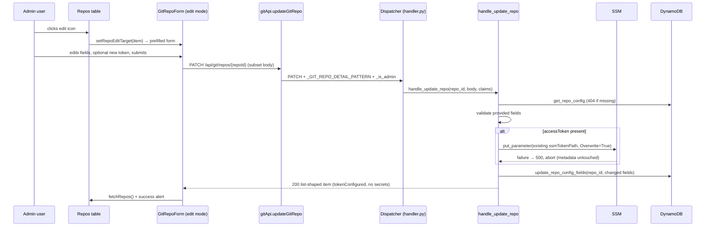

# Design — Git Repo Edit and Token Rotation

## Overview

Add `PATCH /api/git/repos/{repoId}` to the backend (new handler function + dispatcher branch, reusing the create handler's validation and SSM patterns) and an edit mode to `GitRepoForm` (prefill + optional token), wired from a new edit action on the repos table. Order of operations in the handler: validate → write SSM (if token present) → update DynamoDB — so a failed SSM write aborts before any metadata change.

### Design Decisions

1. **PATCH, not PUT**: the issue mandates partial updates (`any subset of { name, url, provider, accessToken }`). The generic API client gains a `patch()` helper next to `get/post/put/del`.
2. **Reuse `ssmTokenPath`**: rotation overwrites the SecureString at the stored path (`put_parameter` with `Overwrite=True`, same call as create). `repoId` and the param path never change, so nothing else (worker, correlation agent) needs re-pointing.
3. **SSM before DynamoDB**: if the token write fails, the request aborts with 500 and metadata is untouched (Req 2.5). If the DynamoDB update fails after a successful token write, the new token is already live — acceptable, since the caller intended to rotate it; the 500 tells them metadata didn't persist. This mirrors the create handler's ordering (SSM first, then DDB with rollback); a rollback here would mean restoring the *old* token, which we deliberately do not keep in memory.
4. **Targeted `UpdateExpression`**: a new `update_repo_config_fields(repo_id, fields)` in the shared `GitRepository` layer updates only provided attributes (aliasing reserved words like `name`/`status`), following the existing `update_repo_sync_status` template — no read-modify-write races with sync status updates.
5. **One form, two modes**: `GitRepoForm` gains an optional `editTarget?: GitRepository` prop. When set: title/submit switch to edit strings, fields prefill, token becomes optional. Mirrors the `repoDeleteTarget` state pattern already on the page (`repoEditTarget`).

## Architecture



## Components and Interfaces

### 1. Backend — `handle_update_repo`

**File:** `backend/handlers/git_repo_handler.py`

```python
def handle_update_repo(repo_id: str, body: dict, claims: dict,
                       dynamodb_resource=None, ssm_client=None) -> dict:
    """Partially updates a git repository config; optionally rotates the token in place."""
    repo = GitRepository(_table_name(), dynamodb_resource=dynamodb_resource)
    config = repo.get_repo_config(repo_id)
    if not config:
        return {"error": "NotFound", "message": f"Repository not found: {repo_id}", "_status_code": 404}

    allowed = {"name", "url", "provider", "accessToken"}
    provided = {k: v for k, v in (body or {}).items() if k in allowed}
    if not provided:
        return {"error": "ValidationError", "message": "Provide at least one of: name, url, provider, accessToken.", "_status_code": 400}

    # Field validation (reusing create rules)
    #   url -> _validate_url; provider -> SUPPORTED_PROVIDERS; accessToken -> 10..500 chars; name -> non-empty str

    access_token = provided.pop("accessToken", None)
    if access_token is not None:
        ssm = ssm_client or boto3.client("ssm")
        ssm.put_parameter(Name=config["ssmTokenPath"], Value=access_token,
                          Type="SecureString", Overwrite=True)   # failure -> 500, abort

    if provided:
        repo.update_repo_config_fields(repo_id, provided)

    updated = repo.get_repo_config(repo_id)
    logger.info("Git repository updated", repoId=repo_id, fields=sorted(list(provided) + (["accessToken"] if access_token else [])))
    return {  # same shape as handle_list_repos items — no token, no ssmTokenPath
        "repoId": repo_id, "name": updated.get("name"), "url": updated.get("url"),
        "provider": updated.get("provider"), "tokenConfigured": bool(updated.get("ssmTokenPath")),
        "status": updated.get("status"), "lastSyncAt": updated.get("lastSyncAt"),
        "createdAt": updated.get("createdAt"),
    }
```

### 2. Backend — repository layer

**File:** `layers/shared/git_shared/git_repository.py`

```python
def update_repo_config_fields(self, repo_id: str, fields: dict) -> None:
    """SET only the provided attributes on the CONFIG item (aliases reserved words)."""
    names = {f"#f{i}": k for i, k in enumerate(fields)}
    values = {f":v{i}": fields[k] for i, k in enumerate(fields)}
    update_expr = "SET " + ", ".join(f"#f{i} = :v{i}" for i in range(len(fields)))
    self._table.update_item(
        Key={"PK": f"GITREPO#{repo_id}", "SK": "CONFIG"},
        UpdateExpression=update_expr,
        ExpressionAttributeNames=names,
        ExpressionAttributeValues=values,
    )
```

### 3. Backend — dispatcher branch

**File:** `backend/handler.py` (next to the existing DELETE branch, same `_GIT_REPO_DETAIL_PATTERN`, same `_is_admin` gate and `_status_code` convention)

```python
# PATCH /api/git/repos/{repoId} — update repository / rotate token
if http_method == "PATCH":
    match = _GIT_REPO_DETAIL_PATTERN.match(path)
    if match:
        if not _is_admin(claims):
            return _build_response(403, {...})
        result = git_repo_handler.handle_update_repo(match.group(1), body, claims)
        status_code = result.pop("_status_code", 200) if isinstance(result, dict) else 200
        return _build_response(status_code, result)
```

### 4. Frontend — API client

**Files:** `frontend/src/api/client.ts` (new `patch<T>` helper), `frontend/src/api/gitApi.ts`

```typescript
export interface GitRepoPatch {
  name?: string;
  url?: string;
  provider?: string;
  accessToken?: string;
}

export function updateGitRepo(repoId: string, body: GitRepoPatch): Promise<GitRepository> {
  return patch<GitRepository>(`/api/git/repos/${repoId}`, body);
}
```

### 5. Frontend — `GitRepoForm` edit mode

**File:** `frontend/src/components/GitRepoForm.tsx`

```typescript
interface GitRepoFormProps {
  visible: boolean;
  onDismiss: () => void;
  onSubmit: (data: { name: string; url: string; provider: string; accessToken: string }) => Promise<void>;
  /** When set, the form opens in edit mode prefilled with this repository. */
  editTarget?: GitRepository | null;
}
```

- `useEffect` on `editTarget`/`visible` prefills name/url/provider and clears the token field.
- Edit mode: title `gitRepoForm.editTitle`, submit `gitRepoForm.submitEdit`, token optional with `gitRepoForm.field.token.editDescription` ("Leave blank to keep the current token"); `validate()` skips the token-required rule.
- Submit in edit mode builds the patch (omitting `accessToken` when blank) — ownership of the API call stays with the page via `onSubmit`.

### 6. Frontend — GitSettingsPage wiring

**File:** `frontend/src/pages/GitSettingsPage.tsx`

- New state `repoEditTarget: GitRepository | null` (mirrors `repoDeleteTarget`).
- Actions column gains an edit icon button (`iconName="edit"`) before the remove button.
- `handleUpdateRepo(patch)` calls `updateGitRepo(repoEditTarget.repoId, patch)`, sets `gitSettings.repos.success.updated`, refreshes list.
- `GitRepoForm` rendered once, with `editTarget={repoEditTarget}` and `visible={showRepoForm || repoEditTarget !== null}`.

### 7. Translation keys

**Files:** `frontend/src/locales/en.json`, `frontend/src/locales/pt-BR.json` (alphabetical, full parity)

| Key | en | pt-BR |
|---|---|---|
| `gitRepoForm.editTitle` | Edit Git Repository | Editar Repositório Git |
| `gitRepoForm.error.update` | Error updating repository | Erro ao atualizar repositório |
| `gitRepoForm.field.token.editDescription` | Leave blank to keep the current token | Deixe em branco para manter o token atual |
| `gitRepoForm.submitEdit` | Save Changes | Salvar Alterações |
| `gitSettings.repos.action.edit` | Edit | Editar |
| `gitSettings.repos.success.updated` | Repository updated. | Repositório atualizado. |

## Data Models

No schema changes. The CONFIG item's mutable attributes are `name`, `url`, `provider` (plus token rotation via SSM). `repoId`, `createdAt`, `createdBy`, `ssmTokenPath` are immutable through this endpoint.

## Correctness Properties

*A correctness property is a characteristic or behavior that must hold in all valid executions of a system.*

### Property 1: Identity stability

*For any* successful PATCH, the repository's `repoId`, `createdAt`, `createdBy`, and `ssmTokenPath` SHALL be identical before and after the request.

**Validates: Requirements 1.1, 2.1**

### Property 2: Partiality

*For any* Patch Body, fields absent from the body SHALL retain their prior values, and the stored token SHALL change if and only if `accessToken` is present.

**Validates: Requirements 1.1, 2.1, 2.3**

### Property 3: Secret hygiene

*For any* PATCH request (success or failure), the token value SHALL appear in no response body and no log line.

**Validates: Requirements 1.6, 2.4**

## Error Handling

| Scenario | Component | Behavior |
|---|---|---|
| Unknown `repoId` | handle_update_repo | 404 `NotFound` |
| Empty/no-op body | handle_update_repo | 400 `ValidationError` |
| Invalid url/provider/token | handle_update_repo | 400 `ValidationError` (create-handler rules) |
| SSM write failure | handle_update_repo | 500, metadata untouched (SSM-before-DDB ordering) |
| DDB update failure after rotation | handle_update_repo | 500; token already rotated (documented; caller intended rotation) |
| Non-admin caller | dispatcher | 403 (same gate as other git routes) |
| API error in edit form | GitRepoForm | Existing in-form error Alert with `gitRepoForm.error.update` fallback |

## Testing Strategy

Backend: pytest + moto (`@mock_aws`), dependency-injected clients, following `tests/test_git_repo_handler.py` conventions (including the inline secret-hygiene assertion `token not in str(...)`). Frontend: vitest + testing-library following `GitRepoForm.test.tsx` conventions.

| Property | Test File | Tag |
|---|---|---|
| Property 1: Identity stability | `tests/test_git_repo_handler.py` | Feature: git-repo-edit-token-rotation, Property 1: Identity stability |
| Property 2: Partiality | `tests/test_git_repo_handler.py` | Feature: git-repo-edit-token-rotation, Property 2: Partiality |
| Property 3: Secret hygiene | `tests/test_git_repo_handler.py` | Feature: git-repo-edit-token-rotation, Property 3: Secret hygiene |

Example-based coverage: 404, empty body 400, each validation 400, rotation overwrites the SSM value in place, metadata-only patch leaves token untouched, SSM failure aborts metadata update, dispatcher PATCH routing + 403. Frontend: edit prefill, blank-token patch omits `accessToken`, success refresh.
