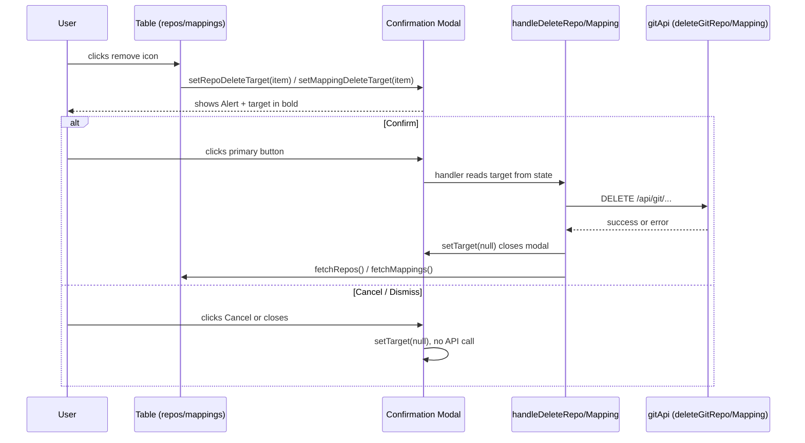

# Design — Git Settings Delete Confirmation Modal

## Overview

Add two confirmation modals to `GitSettingsPage` — one for repository deletion and one for mapping deletion — copying verbatim the "Delete Confirmation Modal" pattern from `UsersPage` (`deleteTarget` state + `<Modal visible={target !== null}>` + warning `Alert` + target identified in bold + Cancel/Confirm footer).

### Design Decisions

1. **Existing pattern, not a new component**: issue #11 mandates mirroring the `UsersPage` modal directly in the page. No generic `ConfirmationModal` component is created — two inline `<Modal>` blocks keep consistency with the reference code and minimize the diff. A generic extraction can happen later if a third case appears.
2. **Target-typed state, not a boolean**: `repoDeleteTarget: GitRepository | null` and `mappingDeleteTarget: GitUserMapping | null` — the target object itself drives visibility (`visible={target !== null}`) and provides the data rendered in the modal body, exactly like `deleteTarget` in `UsersPage`.
3. **Existing handlers reused**: `handleDeleteRepo`/`handleDeleteMapping` keep the API/error/refresh logic; the change is that they are now invoked by the modal's confirm button (reading the target from state) instead of directly by the table button, and they clear the target when done.
4. **Per-modal `deleting` flag**: mirroring the `loading={deleting}` on the `UsersPage` primary button, to prevent double submit.

## Architecture



## Components and Interfaces

### 1. GitSettingsPage — state and handlers

**File:** `frontend/src/pages/GitSettingsPage.tsx`

```typescript
// New state
const [repoDeleteTarget, setRepoDeleteTarget] = useState<GitRepository | null>(null);
const [mappingDeleteTarget, setMappingDeleteTarget] = useState<GitUserMapping | null>(null);
const [deletingRepo, setDeletingRepo] = useState(false);
const [deletingMapping, setDeletingMapping] = useState(false);

// Table buttons now only set the target
cell: (item) => (
  <Button iconName="remove" variant="icon"
    onClick={() => setRepoDeleteTarget(item)}
    ariaLabel={t('gitSettings.repos.action.remove')} />
)

// Handlers now read the target from state and clear it when done
async function handleDeleteRepo() {
  if (!repoDeleteTarget) return;
  setDeletingRepo(true);
  setRepoError(null);
  try {
    await deleteGitRepo(repoDeleteTarget.repoId);
    setRepoSuccess(t('gitSettings.repos.success.removed'));
    fetchRepos();
  } catch (err) {
    setRepoError(err instanceof Error ? err.message : t('gitSettings.repos.error.delete'));
  } finally {
    setDeletingRepo(false);
    setRepoDeleteTarget(null);
  }
}
// handleDeleteMapping is analogous, calling deleteGitMapping(target.userId, target.provider)
```

### 2. GitSettingsPage — modals

**File:** `frontend/src/pages/GitSettingsPage.tsx`

Two `<Modal>` blocks at the end of the JSX, copying the `UsersPage` structure (lines ~361-386):

```tsx
<Modal
  visible={repoDeleteTarget !== null}
  onDismiss={() => setRepoDeleteTarget(null)}
  header={t('gitSettings.repos.deleteModal.title')}
  footer={
    <Box float="right">
      <SpaceBetween size="xs" direction="horizontal">
        <Button variant="link" onClick={() => setRepoDeleteTarget(null)}>
          {t('common.cancel')}
        </Button>
        <Button variant="primary" onClick={handleDeleteRepo} loading={deletingRepo}>
          {t('gitSettings.repos.deleteModal.submit')}
        </Button>
      </SpaceBetween>
    </Box>
  }
>
  <SpaceBetween size="m">
    <Alert type="warning">{t('gitSettings.repos.deleteModal.warning')}</Alert>
    <Box>
      {t('gitSettings.repos.deleteModal.confirm')}{' '}
      <strong>{repoDeleteTarget?.name}</strong> ({repoDeleteTarget?.url})?
    </Box>
  </SpaceBetween>
</Modal>
```

The mapping modal is analogous, rendering `<strong>{mappingDeleteTarget?.userId}</strong>` → `<strong>{mappingDeleteTarget?.gitUsername}</strong>` (`{mappingDeleteTarget?.provider}`).

### 3. Translation keys

**Files:** `frontend/src/locales/en.json`, `frontend/src/locales/pt-BR.json`

New keys (flat, alphabetically ordered inside the existing `gitSettings.mappings.*` / `gitSettings.repos.*` blocks):

| Key | en | pt-BR |
|---|---|---|
| `gitSettings.mappings.deleteModal.confirm` | Are you sure you want to remove the mapping for | Tem certeza de que deseja remover o mapeamento de |
| `gitSettings.mappings.deleteModal.submit` | Remove Mapping | Remover Mapeamento |
| `gitSettings.mappings.deleteModal.title` | Confirm Removal | Confirmar Remoção |
| `gitSettings.mappings.deleteModal.warning` | This action cannot be undone. Git correlation for this user will stop until a new mapping is created. | Esta ação não pode ser desfeita. A correlação Git deste usuário deixará de funcionar até que um novo mapeamento seja criado. |
| `gitSettings.repos.deleteModal.confirm` | Are you sure you want to remove the repository | Tem certeza de que deseja remover o repositório |
| `gitSettings.repos.deleteModal.submit` | Remove Repository | Remover Repositório |
| `gitSettings.repos.deleteModal.title` | Confirm Removal | Confirmar Remoção |
| `gitSettings.repos.deleteModal.warning` | This action cannot be undone. Commits and PRs from this repository will no longer be collected. | Esta ação não pode ser desfeita. Commits e PRs deste repositório deixarão de ser coletados. |

The cancel button reuses `common.cancel` (already present in both locales).

## Data Models

No new models. Existing types reused as delete targets:

```typescript
// frontend/src/types (existing)
GitRepository    // { repoId, name, url, provider, ... }
GitUserMapping   // { userId, gitUsername, provider, ... }
```

## Correctness Properties

*A correctness property is a characteristic or behavior that must hold in all valid executions of a system.*

### Property 1: No deletion without confirmation

*For any* interaction sequence that does not include a click on the modal's primary button, the `GitSettingsPage` SHALL NOT invoke `deleteGitRepo` or `deleteGitMapping` — in particular, clicking the remove icon and then canceling/dismissing the modal results in zero delete calls.

**Validates: Requirements 1.1, 1.4, 2.1, 2.4**

### Property 2: Deletion confirms exactly the displayed target

*For any* target item, WHEN the user confirms the modal, the delete call SHALL use exactly the identifiers of the displayed item (the shown repository's `repoId`; the shown mapping's `userId` + `provider`).

**Validates: Requirements 1.3, 2.3**

### Property 3: Modal identifies the target

*For any* target item, the open modal body SHALL contain the item's `name` and `url` (repository) or `userId`, `gitUsername`, and `provider` (mapping).

**Validates: Requirements 1.2, 2.2**

## Error Handling

| Scenario | Component | Behavior |
|---|---|---|
| Delete API fails (repo) | GitSettingsPage | Shows `gitSettings.repos.error.delete` (existing behavior), closes the modal, list is not refreshed |
| Delete API fails (mapping) | GitSettingsPage | Shows `gitSettings.mappings.error.delete` (existing behavior), closes the modal, list is not refreshed |
| Double click on confirm button | Modal | `loading={deleting}` disables the button during the call, preventing duplicate submit |
| Dismiss via ESC/X | Modal | `onDismiss` clears the target; no API call |

## Testing Strategy

Example-based approach with vitest + @testing-library/react, following the `GitSettingsPage.test.tsx` conventions (mock `gitApi` via `vi.mock`, wrap in `I18nProvider`, assert via `i18n.t(...)`, locate rows via `cell.closest('tr')`).

| Property | Test File | Tag |
|---|---|---|
| Property 1: No deletion without confirmation | `GitSettingsPage.test.tsx` | Feature: git-settings-delete-confirmation, Property 1: No deletion without confirmation |
| Property 2: Deletion confirms exactly the displayed target | `GitSettingsPage.test.tsx` | Feature: git-settings-delete-confirmation, Property 2: Deletion confirms exactly the displayed target |
| Property 3: Modal identifies the target | `GitSettingsPage.test.tsx` | Feature: git-settings-delete-confirmation, Property 3: Modal identifies the target |

The existing mapping-deletion tests in `GitSettingsPage.test.tsx` will be updated: clicking the icon now opens the modal, and deletion only happens after the primary button click.
