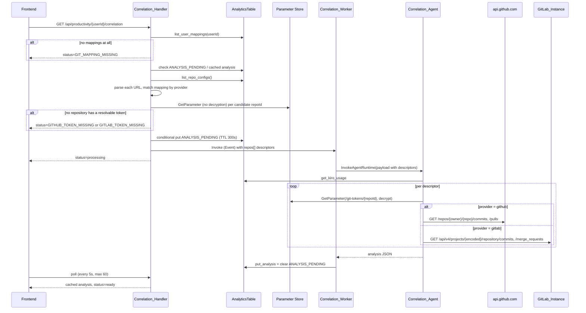

# Design Document

## Overview

This design adds GitLab as a second Git provider to the Kiro Cost Analyzer (KCA), alongside the existing GitHub integration. The change spans four layers: backend handlers, the shared layer, the AgentCore correlation agent, and the frontend SPA.

The current integration is GitHub-only not because the data model is GitHub-shaped — `git_repository.py` is already provider-agnostic and the mapping sort key already embeds the provider — but because of a set of localized hardcodings: a `frozenset({"github"})` in two handlers, a `if "github.com" in url` URL parser, a provider-blind SSM token lookup that picks the most-recently-modified parameter, and a single `github_tool.py` bound to `api.github.com`. The design addresses each of those points directly.

Three things dominate the design:

1. **A provider-tagged repository descriptor** replaces the flat `{owner, repo}` pair that currently flows from the backend into the agent. The descriptor is a discriminated union keyed on `provider`, carrying the provider-specific location parameters and a repository-scoped token identifier. This is the contract change that makes everything downstream provider-aware.
2. **Repository-scoped token resolution** replaces the provider-blind "most recently modified SSM parameter" heuristic. That heuristic is not merely imprecise — it actively breaks once two providers coexist, because a GitLab token could be handed to the GitHub tool. The fix is already latent in the data: `repo_config.ssmTokenPath` is `/kiro-cost-analyzer/git-tokens/{repoId}`, so the descriptor only needs to carry `repoId`.
3. **A structurally unique mapping key.** The mapping sort key `GITMAP#{provider}#{gitUsername}` becomes `GITMAP#{provider}`, with `gitUsername` demoted to an ordinary item attribute. This makes "at most one Git username per Kiro user per provider" unrepresentable rather than merely validated, and it removes the username-selection question from the correlation flow entirely. It is the only change in this feature that touches stored data, so it is the only one that carries a migration (DD-6, Requirement 11).

The normalized activity contract the agent consumes stays byte-compatible: GitLab merge requests are normalized into the existing `pull_requests` field. The agent's output schema (`impactScore`, `impactLevel`, `correlations[].type ∈ {prompt_to_commit, prompt_to_pr}`, bilingual `insights`) is unchanged, so no cached analysis is invalidated and no frontend rendering code for results needs to change.

Target platform is self-hosted **GitLab Community Edition** at an arbitrary hostname, `http` or `https`, non-standard ports allowed, with namespace paths that may contain subgroups.

### Documented Design Decisions

#### DD-1: GitLab REST API v4 direct integration; MCP server rejected

The GitLab integration calls the REST API v4 directly with `requests`, mirroring the existing GitHub tool.

The official GitLab MCP server ships as part of GitLab Duo and requires a Premium or Ultimate subscription plus the cloud-hosted AI Gateway. Neither is available on Community Edition, which is the target platform, so it is not an option. Community MCP servers are technically usable but would require embedding a Node.js runtime and an MCP subprocess inside the AgentCore container purely to broker two HTTP calls (`GET commits`, `GET merge_requests`). That trades a 60-line tool module for a second language runtime in the image, a broad and unaudited tool surface exposed to the model, and a new failure mode (subprocess lifecycle) in a container that already has a cold-start budget. Rejected.

Consequence: KCA owns the GitLab API surface it uses. Two endpoints, both GA on CE since well before the versions in the field.

#### DD-2: Provider-specific status slugs, existing `GITHUB_*` slugs untouched

Three slugs are added: `GITLAB_TOKEN_MISSING`, `GITLAB_AUTH_FAILED`, `GITLAB_RATE_LIMIT`. The existing `GITHUB_TOKEN_MISSING`, `GITHUB_AUTH_FAILED`, `GITHUB_RATE_LIMIT` are not renamed to neutral `GIT_*` names.

Rationale: renaming would be a breaking change to a contract that is persisted in cached analyses and mirrored in three places (`CorrelationStatusSlug` in Python, the same union in TypeScript, and the `productivity.correlation.status.*` locale keys). It would also flatten information the user needs — "GitLab rejected the token" and "GitHub rejected the token" point at different settings entries and different remediation. The cost is a wider slug union and a small amount of map duplication in `UserPage.tsx`, which the totality properties in this design cover.

#### DD-3: The agent receives `repoId`, never a token, and never an SSM path

The invocation payload carries `repoId` per repository. The agent derives the parameter name as `"/kiro-cost-analyzer/git-tokens/" + repoId` from a module constant, after validating `repoId` against `^[0-9a-f]{8}$`.

Sending `repoId` rather than the full `ssmTokenPath` means the agent can never be steered into reading an arbitrary SSM parameter by way of a manipulated payload field, even though its IAM policy is prefix-scoped. Sending `repoId` rather than the token value keeps secrets out of Lambda event payloads and CloudWatch Logs — the property the current design already established, preserved here.

#### DD-4: URL parsing lives in the backend, not in the agent

The backend parses the configured repository URL and puts already-derived location parameters (`baseUrl`, `projectPath` for GitLab; `owner`, `repo` for GitHub) into the descriptor. The agent never sees a raw configured URL and never parses one.

This keeps a single parsing implementation (the agent container cannot import the Lambda shared layer, so putting parsing in the agent would mean two copies), and it lets Requirement 4.5 — "exclude unparseable repositories and log a structured warning" — be enforced at the boundary where structured logging already exists.

#### DD-5: Additive, backward-compatible invocation payload

The backend Lambda and the AgentCore runtime deploy independently (`make deploy-infra` vs `make deploy-agentcore`), so at any moment either side may be one version ahead. The payload change is therefore purely additive:

- New fields (`repos[].provider`, `repos[].repoId`, `repos[].gitUsername`, `repos[].baseUrl`, `repos[].projectPath`) are added; nothing is removed or renamed.
- The top-level `gitUsername` field is retained and populated with the GitHub mapping (falling back to the first mapping) so an older agent build keeps working.
- The new agent treats a descriptor with no `provider` field as `provider: "github"` and falls back to the top-level `gitUsername`, so a newer agent keeps working against an older backend.

#### DD-6: One Git username per provider, enforced by the sort key shape

The mapping sort key becomes `GITMAP#{provider}`. `gitUsername` moves out of the key and becomes an ordinary item attribute. A Kiro user therefore holds at most one mapping per provider, and that limit is a property of the key space rather than a rule the code has to remember to check.

**Why structural rather than application-level.** The alternative is a validation in `handle_create_mapping`: query the user's mappings, reject the request if one already exists for the provider. That has two defects. It is a check-then-write, so two concurrent admin requests for the same user and provider can both pass the check and both write, leaving two items — the exact state the check exists to prevent. And it cannot be made atomic with a DynamoDB condition expression, because a condition expression is evaluated against the single item addressed by the request's key. Under the old shape the two competing writes address *different* keys (`GITMAP#gitlab#alice` and `GITMAP#gitlab#a.silva`), so there is no item either write could assert about. `attribute_not_exists` on the new key, by contrast, is a single-item condition on the item that would be overwritten — but with the new shape the constraint no longer needs asserting at all, because there is only one key for the pair. The correct read path becomes a `GetItem`, not a query plus a tie-break.

**Why future providers stay cheap.** `provider` remains the leading discriminator, so registering `bitbucket` later writes `GITMAP#bitbucket` and touches no existing item, no existing key, and no existing query. The one-time cost of moving off the old shape is paid now, once, rather than becoming a per-provider cost.

**Accepted limitation.** The shape cannot represent two identities for one provider. A user with one username on a self-hosted GitLab CE instance and a different one on gitlab.com gets one mapping, not two; a CodeCommit user with several IAM identities would get one. Both are outside this feature's scope — it targets a single self-hosted CE instance, and gitlab.com SaaS behavior, Bitbucket, and CodeCommit are non-goals. The residual risk is that a future multi-identity requirement forces a second migration. That migration would again be over mapping items only, which are few, admin-owned, and re-creatable by hand, so the cost of being wrong here is small and bounded.

**Rejected: `GITMAP#{provider}#{instanceHost}`.** This would preserve multi-identity per provider while keeping uniqueness per instance. Rejected because it pushes an instance field onto the mapping form — an administrator would have to type a hostname that is already stored in the repository configuration — and it creates a consistency question the system has no way to answer: if the mapping says `gitlab.internal` and the repository configuration says `gitlab.internal:8929`, do they match? Resolving that would mean normalizing hosts on both sides and keeping the two in step, which is more machinery than the multi-identity case currently justifies.

**Consequences.** Three, all of them visible:

- The delete route loses its trailing segment: `DELETE /api/git/mappings/{userId}/{provider}`. A breaking API change, accepted because the endpoint is admin-only and its only consumer is this project's SPA.
- Mapping creation becomes an upsert. Submitting a second username for a provider the user already has replaces the first rather than adding to it, so the response has to say so or the administrator silently loses a mapping they thought they were adding (Requirement 2.7).
- Existing stored mappings are keyed the old way and stop being visible to any code that addresses the new key. That is Requirement 11 and component 14 below.

**On the earlier framing.** An earlier draft of this design justified the change by claiming the old read path picked a username in an order-dependent way. That overstated it: `list_user_mappings` queries without `ScanIndexForward`, so DynamoDB returns items ascending by sort key and the selection was in fact deterministic. The honest argument is weaker. The order was *incidental* rather than declared — nothing in the code said "the first mapping wins", and an unrelated later change (adding `ScanIndexForward=False` for a different reason, restructuring the pagination loop) would have silently changed which username got selected. The only symptom would have been an analysis that attributed fewer commits than it should, with no error anywhere. Structural uniqueness removes the question rather than pinning down its answer.

### Non-Goals

Bitbucket and CodeCommit providers; GitLab.com SaaS-specific behavior; GitLab EE/Duo features; webhook or scheduled sync pipelines; GitLab OAuth (personal access tokens only); review and approval analytics.

### Historical Context

A previous multi-provider design existed under `.kiro/specs/productivity-git-analysis/` (pt-BR, superseded): a `GitConnector` Strategy hierarchy with `GitHubConnector`, `GitLabConnector`, `BitbucketConnector`, and `CodeCommitConnector` behind a factory, feeding a scheduled sync pipeline that materialized `GITCOMMIT#`/`GITPR#`/`GITREVIEW#` items into DynamoDB. It was deliberately removed in favor of the current agent-based, on-demand model (see `docs/changelog.md`).

That connector hierarchy is not resurrected here. The current model has no sync pipeline, no materialized activity items, and no scheduler — the agent calls provider APIs on demand during a single analysis. What this design borrows from the old spec is only the *shape of the abstraction boundary*: one normalization function per provider, and a dispatch point that selects it. What it deliberately does not borrow is the class hierarchy, the factory registry, and the four-provider ambition. Two providers with two small factory functions do not need a Strategy hierarchy; the existing `build_*_tool(...)` closure factory pattern is sufficient and already idiomatic in this codebase.

The dormant `batch_put_commits` / `batch_put_pull_requests` / `batch_put_reviews` / `put_sync_stats` methods in `git_repository.py` are leftovers from that pipeline. They are untouched by this feature.

---

## Architecture

### Layer Impact Summary

| Layer | Module | Change |
|---|---|---|
| Shared | `layers/shared/git_shared/git_url_parser.py` | **New** — provider-aware URL parsing, single source of truth |
| Shared | `layers/shared/git_shared/git_providers.py` | **New** — `SUPPORTED_PROVIDERS`, slug constants, SSM prefix constant, mapping sort-key builder |
| Shared | `layers/shared/git_shared/git_mapping_selection.py` | **New** — `select_mapping`, the one selection rule shared by the correlation handler and the migrator |
| Backend | `handlers/git_repo_handler.py` | `SUPPORTED_PROVIDERS` widened; message generalized; imports shared constants |
| Backend | `handlers/git_mapping_handler.py` | `SUPPORTED_PROVIDERS` widened; create becomes an upsert reporting replacement; delete loses its `git_username` parameter |
| Backend | `handlers/agent_correlation_handler.py` | Descriptor builder replaces `if "github.com" in url`; provider-scoped token presence check replaces `_fetch_github_token`; username resolution simplifies to one mapping per provider; slug union widened |
| Backend | `handlers/correlation_worker.py` | Forwards descriptors verbatim into the agent payload |
| Backend | `handler.py` | `_GIT_MAPPING_DELETE_PATTERN` drops its third capture group |
| Shared | `layers/shared/git_shared/git_repository.py` | Mapping sort key becomes `GITMAP#{provider}`; `put_user_mapping` reports the replaced item; `delete_user_mapping` drops the username; `get_all_mappings_for_provider` predicate corrected |
| Infra | `custom_resources/mapping_migrator.py` | **New** — one-time migration of mapping items off the legacy sort key |
| Agent | `tools/gitlab_tool.py` | **New** — `build_gitlab_tool(repo_id)` returning `get_gitlab_activity` |
| Agent | `tools/github_tool.py` | Signature change to `build_github_tool(repo_id)`; body and output shape unchanged |
| Agent | `tools/ssm_token.py` | **New** — `fetch_repo_token(repo_id)` with `repoId` validation |
| Agent | `main.py` | Registers both tools; drops the provider-blind `_fetch_token_from_ssm` |
| Agent | `prompts.py` | Provider-aware repository listing and terminology |
| Frontend | `constants/gitProviders.ts` | **New** — single provider option source for both forms |
| Frontend | `components/GitRepoForm.tsx` | Consumes the shared provider constant |
| Frontend | `components/GitMappingForm.tsx` | Consumes the shared provider constant; surfaces the replacement outcome |
| Frontend | `api/gitApi.ts` | `deleteGitMapping` loses its `gitUsername` argument; `createGitMapping` return type carries the replacement outcome |
| Frontend | `pages/GitSettingsPage.tsx` | Delete action passes two path parameters; create handler forwards the replacement outcome to the form |
| Frontend | `types/index.ts` | `CorrelationStatusSlug` widened by three members; new `GitMappingCreated` interface |
| Frontend | `pages/UserPage.tsx` | Three new entries in each of the three slug maps |
| Frontend | `locales/en.json`, `locales/pt-BR.json` | Three GitLab status keys plus two mapping keys per catalog |
| Infra | `template.yaml` | `GitMappingsDelete` path shortened; migrator function and custom resource added; one recommended IAM tightening (see Infrastructure) |

### Correlation Flow (provider-aware)



The polling contract (5s interval, 60 attempts), the 300s pending TTL, and the worker's 500s timeout are unchanged. Note that a multi-provider analysis makes more sequential HTTP calls than a single-provider one — two calls per repository instead of two total — which is worth watching against the 500s worker timeout when many repositories are configured. See Error Handling.

### Architecture Diagram

The canonical architecture diagram is a draw.io source under `docs/` per project convention (Mermaid is reserved for sequence diagrams and small state machines). Updating that diagram to show the second provider egress path is an implementation task, not part of this document.

---

## Components and Interfaces

### 1. `git_shared.git_providers` (new)

A tiny module holding the constants that are currently duplicated as literals across handlers. Placed in the shared layer so backend handlers import it once.

```python
SUPPORTED_PROVIDERS: frozenset[str] = frozenset({"github", "gitlab"})

# Deterministic order for tie-breaking and message rendering.
PROVIDER_ORDER: tuple[str, ...] = ("github", "gitlab")

SSM_TOKEN_PATH_PREFIX = "/kiro-cost-analyzer/git-tokens"

TOKEN_MISSING_SLUG: dict[str, str] = {
    "github": "GITHUB_TOKEN_MISSING",
    "gitlab": "GITLAB_TOKEN_MISSING",
}

MAPPING_SK_PREFIX = "GITMAP#"

def mapping_sort_key(provider: str) -> str:
    """Build the Mapping_Sort_Key for a provider (Requirement 2.5)."""
    return f"{MAPPING_SK_PREFIX}{provider}"

def is_legacy_mapping_sort_key(sort_key: str) -> bool:
    """True when a sort key uses the Legacy_Mapping_Sort_Key shape.

    Both shapes share the `GITMAP#` prefix, so the discriminator is the
    number of separators: `GITMAP#gitlab` is current, `GITMAP#gitlab#alice`
    is legacy. Git provider usernames cannot contain `#` on either GitHub or
    GitLab, so a count is sufficient; anything with more than one separator
    is treated as legacy so an unexpected shape migrates rather than being
    silently skipped.
    """
    return sort_key.startswith(MAPPING_SK_PREFIX) and sort_key.count("#") >= 2
```

Having the key builder in one place matters more than its two lines suggest: the sort key is now written by the repository, read by the repository, discriminated by the migrator, and asserted by four properties. A second literal `f"GITMAP#{provider}"` somewhere would be the obvious way for the shapes to drift apart again.

`git_repo_handler` and `git_mapping_handler` replace their local `SUPPORTED_PROVIDERS = frozenset({"github"})` with an import of this constant, and render the rejection message from the set rather than hardcoding "Only GitHub is supported.":

```python
f"Unsupported provider: {provider}. Valid providers: {', '.join(sorted(SUPPORTED_PROVIDERS))}"
```

`git_mapping_handler` already renders its message this way, so only `git_repo_handler` line 92 changes. Import follows the project's try/except fallback pattern.

### 2. `git_shared.git_url_parser` (new)

Provider-aware URL parsing. Total: never raises, returns `None` on unparseable input.

```python
class RepoLocation(TypedDict, total=False):
    """Provider-specific location parameters derived from a repository URL."""
    owner: str        # github
    repo: str         # github
    baseUrl: str      # gitlab — scheme://host[:port], no trailing slash
    projectPath: str  # gitlab — full namespace path, subgroups preserved

def normalize_repo_url(url: str) -> str | None:
    """Normalize a repository URL: strip whitespace, trailing slash, and a
    trailing '.git' suffix. Lowercase the scheme and host; leave the path
    case intact (GitLab namespace paths are case-sensitive in practice).
    Drop a default port that matches the scheme. Returns None if the input
    is not an http(s) URL with a host and at least one path segment.
    """

def parse_repo_url(provider: str, url: str) -> RepoLocation | None:
    """Derive provider-specific location parameters from a repository URL.

    github -> {"owner", "repo"} from the last two path segments.
    gitlab -> {"baseUrl", "projectPath"} where projectPath is every path
              segment joined by '/', preserving subgroups.

    Returns None for an unsupported provider or an unparseable URL.
    """

def build_repo_url(provider: str, location: RepoLocation) -> str | None:
    """Reconstruct a normalized repository URL from location parameters.
    Inverse of parse_repo_url on the normalized URL space. Used by the
    round-trip property and by log/diagnostic rendering.
    """
```

Parsing is `urllib.parse.urlsplit`-based, not regex-based. The existing `_URL_PATTERN` regex in `git_repo_handler` stays as the cheap create-time validity gate (Requirement 1.2 — it already accepts any host, both schemes, and non-standard ports); `parse_repo_url` is the structural derivation used at analysis time.

Worked examples:

| Input | provider | Output |
|---|---|---|
| `https://github.com/acme/billing` | github | `{owner: "acme", repo: "billing"}` |
| `https://gitlab.example.com/acme/billing.git` | gitlab | `{baseUrl: "https://gitlab.example.com", projectPath: "acme/billing"}` |
| `http://gitlab.internal:8929/platform/payments/api/` | gitlab | `{baseUrl: "http://gitlab.internal:8929", projectPath: "platform/payments/api"}` |
| `https://gitlab.example.com/a/b/c/d/e` | gitlab | `{baseUrl: "https://gitlab.example.com", projectPath: "a/b/c/d/e"}` |
| `https://gitlab.example.com` | gitlab | `None` (no project path) |
| `git@gitlab.example.com:acme/billing.git` | gitlab | `None` (not an http(s) URL) |

Note the asymmetry: GitHub parsing takes the **last two** segments and therefore silently tolerates extra leading segments, while GitLab parsing takes **all** segments. That is intentional — GitHub has exactly `owner/repo`, GitLab has arbitrary subgroup depth. The consequence is that `build_repo_url` is only an exact inverse for GitHub when the normalized URL has exactly two path segments, which is what the round-trip property quantifies over.

### 3. `Correlation_Handler` — descriptor construction

Replaces this block:

```python
# current — provider-blind, GitHub-only
for config in repo_configs:
    url = config.get("url", "")
    if "github.com" in url:
        parts = url.rstrip("/").split("/")
        if len(parts) >= 2:
            repos.append({"owner": parts[-2], "repo": parts[-1]})
```

with a descriptor builder. The builder is a pure function so it is directly property-testable:

```python
def build_repo_descriptors(
    repo_configs: list[dict],
    mappings: list[dict],
) -> tuple[list[dict], list[dict]]:
    """Build per-repository descriptors for the agent invocation payload.

    Returns (descriptors, excluded) where `excluded` carries a reason code
    per skipped repository for structured logging. Every input config lands
    in exactly one of the two lists.

    Exclusion reasons:
        UNSUPPORTED_PROVIDER — provider not in SUPPORTED_PROVIDERS
        UNPARSEABLE_URL      — parse_repo_url returned None  (Req 4.5)
        NO_USER_MAPPING      — no mapping for this repo's provider (Req 7.3)
    """
```

Username resolution replaces the current `m.get("provider") == "github"` filter with a provider-keyed lookup built once from `mappings`:

```python
def resolve_usernames_by_provider(mappings: list[dict]) -> dict[str, str]:
    """Map each provider to the single gitUsername the user holds for it.

    Under the DD-6 key shape a user holds at most one mapping per provider
    (Requirement 2.6), so in steady state this is a plain projection. The
    `select_mapping` call only has more than one candidate to choose from
    when reading data written before the migration ran, where two legacy
    items for one provider can still coexist. It keeps the read
    deterministic during that window (Requirement 7.9).
    """
    by_provider: dict[str, list[dict]] = {}
    for m in mappings:
        provider = m.get("provider")
        if provider and m.get("gitUsername"):
            by_provider.setdefault(provider, []).append(m)
    return {
        provider: select_mapping(candidates)["gitUsername"]
        for provider, candidates in by_provider.items()
    }
```

`select_mapping` is the shared selection rule, and it lives in `git_shared.git_mapping_selection` rather than in this handler, because the `Mapping_Migrator` has to make the identical choice — if the reader and the migrator disagreed about which of two legacy mappings wins, the migration window would silently attribute commits to a username the migration is about to discard:

```python
def select_mapping(candidates: list[dict]) -> dict:
    """Pick the surviving mapping from a non-empty set of candidates for one
    (userId, provider) pair.

    Newest `createdAt` wins (Requirements 7.9, 11.2). On equal `createdAt`,
    the lexicographically smallest `gitUsername` wins (Requirement 11.3),
    so the survivor is a function of the stored data alone — no timestamp,
    no read order, no insertion order. A missing `createdAt` sorts as the
    empty string, which makes it the oldest rather than an error.
    """
    newest = max(m.get("createdAt", "") for m in candidates)
    tied = [m for m in candidates if m.get("createdAt", "") == newest]
    return min(tied, key=lambda m: m.get("gitUsername", ""))
```

The two-stage form is deliberate: the rule mixes directions (newest timestamp, smallest username), which a single `sorted(..., reverse=True)` cannot express without also reversing the tie-break.

Descriptors are then filtered by token presence.

### 4. `Correlation_Handler` — token resolution

`_fetch_github_token(user_id)` is removed. It performed `get_parameters_by_path` and returned the most-recently-modified value: provider-blind, repo-blind, and it pulled a decrypted secret into the API Lambda for no reason other than a presence check.

Replacement:

```python
def resolve_token_availability(
    descriptors: list[dict],
    ssm_client=None,
) -> tuple[list[dict], list[dict]]:
    """Partition descriptors into (available, missing) by SSM token presence.

    Calls ssm.get_parameter(Name=f"{SSM_TOKEN_PATH_PREFIX}/{repoId}",
    WithDecryption=False) per descriptor. A ParameterNotFound error means
    the token is missing. The value is never read — only existence matters
    at this layer, so the secret is not decrypted into the API Lambda.
    """

def select_token_missing_slug(missing: list[dict]) -> str:
    """Pick the token-missing slug to surface when NO repository has a token.

    Deterministic rule: the provider with the most affected repositories
    wins; ties break by PROVIDER_ORDER ("github" before "gitlab").
    """
```

Behavior:

- At least one descriptor has a token: proceed with those, log a structured warning per repository without one, and do **not** emit a token-missing slug. A partial analysis is more useful than a hard failure, and this preserves today's behavior for a user who adds a GitLab repository without a token while their GitHub setup keeps working.
- No descriptor has a token: return the slug from `select_token_missing_slug`. Requirement 3.3 says "the token-missing Status_Slug for that repository's provider", which is under-determined when several providers are affected at once; the tie-break rule above makes it a single deterministic answer.

`ssm:GetParameter` is already granted to the backend role by `SSMGitTokensAccess`, so this needs no IAM change. Dropping the decryption also means the `KMSForGitTokens` grant is no longer exercised on this path (it is still needed for `PutParameter` at create time).

### 5. `Correlation_Worker`

`_invoke_agent` currently rebuilds the payload from positional arguments. It changes to forward the descriptor list through unchanged:

```python
payload = {
    "userId": user_id,
    "startDate": start_date,
    "endDate": end_date,
    "gitUsername": git_username,   # retained for backward compatibility (DD-5)
    "repos": repos,                # now provider-tagged descriptors
}
```

No transformation, no filtering, no defaulting. The worker is a transport hop; the round-trip property below pins that down.

### 6. `GitLab_Tool` (new) — `agent/app/GitCorrelationAgent/tools/gitlab_tool.py`

Mirrors `github_tool.py` structurally: closure factory, `@tool`-decorated inner function, same caps, same timeout, same error-return convention.

```python
MAX_COMMITS = 100
MAX_MRS = 50
REQUEST_TIMEOUT_SECONDS = 30
API_PATH = "/api/v4"

def build_gitlab_tool(repo_id: str):
    @tool
    def get_gitlab_activity(
        base_url: str, project_path: str, author: str, since: str
    ) -> dict:
        """Fetch GitLab commits and merge requests for a project.

        Args:
            base_url: GitLab instance base URL (scheme://host[:port])
            project_path: Full namespace path, e.g. group/subgroup/project
            author: GitLab username to filter by
            since: ISO 8601 date — only activity on or after this date

        Returns:
            Dict with commits (list) and pull_requests (list), matching the
            Normalized_Activity_Contract. On failure, a dict with `error`
            and `retryable`.
        """
    return get_gitlab_activity
```

Request construction:

| | Commits | Merge requests |
|---|---|---|
| Path | `{base}/api/v4/projects/{enc}/repository/commits` | `{base}/api/v4/projects/{enc}/merge_requests` |
| Auth | `PRIVATE-TOKEN: {token}` | `PRIVATE-TOKEN: {token}` |
| Params | `since`, `per_page=100` | `author_username`, `created_after`, `state=all`, `per_page=50`, `order_by=updated_at`, `sort=desc` |
| Timeout | 30s | 30s |

`{enc}` is `urllib.parse.quote(project_path, safe="")` — the URL-encoded namespace path (Requirement 4.4). `group/subgroup/project` becomes `group%2Fsubgroup%2Fproject`.

Author filtering is deliberately belt-and-braces:

- **Commits.** The commits endpoint gained an `author` parameter only in GitLab 15.10, and it matches the commit *author name*, not the account username. Sending it on an older CE instance is at best ignored. The tool therefore does **not** rely on a server-side filter and always filters client-side on `author_name` and `author_email`, case-insensitively (Requirement 5.4). Sources: [Commits API](https://docs.gitlab.com/ee/api/commits.html), [author search MR !114417](https://gitlab.com/gitlab-org/gitlab/-/merge_requests/114417). Content was rephrased for compliance with licensing restrictions.
- **Merge requests.** `author_username` is supported and is sent as a query parameter (Requirement 5.5). The tool *also* re-checks `author.username` client-side, matching the defensive pattern the GitHub tool already uses with `pr["user"]["login"]`. Source: [Merge requests API](https://docs.gitlab.com/ee/api/merge_requests). Content was rephrased for compliance with licensing restrictions.

Client-side filtering after a server-side `per_page` cap means the tool can return fewer than `MAX_COMMITS` items even when more matching items exist beyond the first page. That is the same limitation the GitHub tool has today (single page, no pagination) and is accepted: the caps in Requirement 5.7 are upper bounds, not completeness guarantees.

Date restriction (Requirement 5.6) uses `since` for commits and `created_after` for merge requests, both fed the analysis start date. The tool additionally drops any item whose normalized date sorts before the start date, so the floor holds regardless of server-side parameter semantics.

Normalization (Requirements 6.2, 6.3):

| Normalized field | GitLab commit source | GitLab merge request source |
|---|---|---|
| `sha` | `id` | — |
| `message` | `message` | — |
| `date` | `authored_date` (falling back to `committed_date`, then `created_at`) | — |
| `number` | — | `iid` |
| `title` | — | `title` |
| `state` | — | `state` (GitLab value passed through verbatim: `opened`, `closed`, `merged`, `locked`) |
| `created_at` | — | `created_at` |

`state` is passed through unchanged rather than mapped to GitHub's vocabulary. The agent reads state as free text for semantic correlation and the frontend does not render it from this contract, so a translation layer would add a lossy mapping (`opened` → `open`) for no consumer. Requirement 6.3 asks for "the GitLab state value", which is what this does.

Every GitLab field access uses `.get()` with a default, matching `github_tool.py`, so a field missing on an older CE release degrades to an empty string rather than raising inside the agent.

### 7. `GitHub_Tool` — signature change only

`build_github_tool(token)` becomes `build_github_tool(repo_id)`, fetching the token via the shared `fetch_repo_token(repo_id)` helper. The request construction, filtering, caps, error codes, and output shape are untouched (Requirement 6.4).

The token is fetched lazily on first tool invocation rather than at factory time, so an analysis containing only GitLab repositories never reads a GitHub token, and vice versa. The fetched value is memoized in the closure for the lifetime of the invocation.

### 8. `ssm_token.fetch_repo_token` (new, agent-side)

```python
REPO_ID_PATTERN = re.compile(r"^[0-9a-f]{8}$")
SSM_TOKEN_PATH_PREFIX = "/kiro-cost-analyzer/git-tokens"

def fetch_repo_token(repo_id: str, ssm_client=None) -> str:
    """Fetch the decrypted access token for a specific repository config.

    Validates repo_id against REPO_ID_PATTERN before constructing the
    parameter name, so a malformed or hostile payload value cannot be used
    to address an arbitrary SSM parameter. Returns "" on validation
    failure, ParameterNotFound, or any ClientError, logging the reason.
    """
```

This replaces `main._fetch_token_from_ssm()`, which called `get_parameters_by_path` and sorted by `LastModifiedDate`. That function is deleted, not adapted — it has no correct behavior in a two-provider world.

The `8` hex characters in the pattern match `_generate_repo_id()` in `git_repo_handler` (`uuid.uuid4().hex[:8]`). If that generator ever changes, this pattern must change with it; the coupling is noted in both modules' docstrings.

### 9. `Correlation_Agent` — `main.py`

```python
kiro_tool = build_kiro_tool(table_name)
github_tool = build_github_tool()   # repo-scoped token fetched per call
gitlab_tool = build_gitlab_tool()

agent = Agent(
    model=model,
    tools=[kiro_tool, github_tool, gitlab_tool],
    system_prompt=SYSTEM_PROMPT,
)
```

Both provider tools are registered on every invocation regardless of which providers appear in the payload. Registration is free; the model decides which to call based on the prompt, which lists each repository with its provider (Requirement 7.6). Conditional registration would make the tool set depend on payload contents, which is harder to reason about and gains nothing.

Descriptor normalization happens once at the top of `handler`, applying the DD-5 compatibility defaults:

```python
def _normalize_descriptors(repos: list, fallback_username: str) -> list[dict]:
    """Apply backward-compatibility defaults to incoming descriptors.

    A descriptor with no `provider` is treated as github (old backend).
    A descriptor with no `gitUsername` falls back to the payload's
    top-level gitUsername. Descriptors whose provider is unknown or whose
    required location fields are absent are dropped with a warning.
    """
```

Because `repoId` is now per-descriptor, the token fetch moves inside the tool call path: each tool receives `repo_id` as a tool argument alongside the location parameters. This means the tool signature exposed to the model includes `repo_id`, which the prompt supplies verbatim from the repository listing.

### 10. `Correlation_Agent` — `prompts.py`

`SYSTEM_PROMPT` changes in two places:

- The tool inventory gains a third entry and stops implying GitHub is the only Git source:
  > 2. `get_github_activity` — Fetches GitHub commits and pull requests for a repository
  > 3. `get_gitlab_activity` — Fetches GitLab commits and merge requests for a project
- The workflow step "Call `get_github_activity` for EACH repository" becomes "For EACH repository listed, call the tool matching that repository's provider".

A terminology note is added: GitLab merge requests are the same concept as GitHub pull requests for correlation purposes, and both map to `correlations[].type = "prompt_to_pr"`. The `type` enum is **not** extended with a `prompt_to_mr` member — that would break the frontend's `CorrelationItem.type` union and the `productivity.correlation.type.*` locale keys for no analytical gain.

`build_user_prompt` changes the repository listing from `owner/repo` lines to provider-annotated lines, and replaces the fixed `GitHub Username:` line (Requirement 7.7):

```
Repositories to check:
  - [github] acme/billing (repoId=a1b2c3d4, username=jsmith) — call get_github_activity with owner="acme", repo="billing"
  - [gitlab] platform/payments/api at https://gitlab.internal:8929 (repoId=e5f6a7b8, username=j.smith)
    — call get_gitlab_activity with base_url="https://gitlab.internal:8929", project_path="platform/payments/api"
```

Provider terminology appears in the prompt only for providers actually present in the payload — the prompt mentions merge requests when at least one GitLab repository is listed and pull requests when at least one GitHub repository is listed. This keeps the model from hallucinating merge requests for a GitHub-only analysis.

### 11. Frontend

**`constants/gitProviders.ts` (new)** — removes the duplicated single-entry `PROVIDER_OPTIONS` literal from both forms:

```typescript
export const SUPPORTED_GIT_PROVIDERS = ['github', 'gitlab'] as const;
export type SupportedGitProvider = (typeof SUPPORTED_GIT_PROVIDERS)[number];

export function buildProviderOptions(
  t: (key: TranslationKey) => string,
): SelectProps.Option[] {
  return SUPPORTED_GIT_PROVIDERS.map((p) => ({
    value: p,
    label: t(`git.provider.${p}` as TranslationKey),
  }));
}
```

`GitRepoForm.tsx` (line 31) and `GitMappingForm.tsx` (line 19) both call `buildProviderOptions(t)`. The `git.provider.github` and `git.provider.gitlab` keys already exist in both catalogs (as do `bitbucket` and `codecommit`, which stay unused), so Requirements 9.1 and 9.2 need no new translations.

**`types/index.ts`** — `CorrelationStatusSlug` gains three members. `GitRepository.provider` already permits `'gitlab'`; no change. `CorrelationItem.type` unchanged.

**`pages/UserPage.tsx`** — three entries added to each of the three module-scope maps:

| Slug | `slugToTranslationKey` | `slugToAlertType` | In `RETRYABLE_SLUGS` |
|---|---|---|---|
| `GITLAB_TOKEN_MISSING` | `productivity.correlation.status.gitlabTokenMissing` | `warning` | no |
| `GITLAB_AUTH_FAILED` | `productivity.correlation.status.gitlabAuthFailed` | `warning` | no |
| `GITLAB_RATE_LIMIT` | `productivity.correlation.status.gitlabRateLimit` | `info` | yes |

This mirrors the existing GitHub classification exactly (Requirement 9.4). `slugToTranslationKey` and `slugToAlertType` are typed `Record<CorrelationStatusSlug, …>`, so `tsc` rejects the build if a slug is added to the union without a map entry — the compiler enforces totality here, and the property test below covers the runtime side.

**Locale catalogs** — three new status keys per file, inserted in alphabetical position (the `check-locales.ts` sort check is a build gate); two further mapping keys follow below, for five per catalog in total. Drafted values, following the wording pattern of the existing GitHub entries:

| Key | `en` | `pt-BR` |
|---|---|---|
| `productivity.correlation.status.gitlabAuthFailed` | GitLab rejected the token. Refresh the token in Settings and try again. | O GitLab rejeitou o token. Atualize o token em Configurações e tente novamente. |
| `productivity.correlation.status.gitlabRateLimit` | GitLab rate limit reached. Wait a few minutes and refresh the analysis. | Limite de chamadas do GitLab atingido. Aguarde alguns minutos e atualize a análise. |
| `productivity.correlation.status.gitlabTokenMissing` | GitLab token not found. Add your token in Settings so Kiro can read commits and merge requests. | Token do GitLab não encontrado. Adicione seu token em Configurações para o Kiro ler commits e merge requests. |

The existing `git.noMapping.alert` and `productivity.correlation.status.gitMappingMissing` strings both name GitHub explicitly ("Add your GitHub username in Settings"). With two providers that wording is now narrower than the condition it describes. Generalizing it is a small, locale-only change with no code impact; it is not required by any acceptance criterion, so it is flagged here as an optional follow-up rather than folded into this design.

**`api/gitApi.ts`** — two signature changes driven by DD-6:

```typescript
export function deleteGitMapping(
  userId: string,
  provider: string,
): Promise<{ message: string }> {
  return del<{ message: string }>(`/api/git/mappings/${userId}/${provider}`);
}

export function createGitMapping(body: {
  userId: string;
  provider: string;
  gitUsername: string;
}): Promise<GitMappingCreated> {
  return post<GitMappingCreated>('/api/git/mappings', body);
}
```

Dropping the third argument from `deleteGitMapping` is the change most likely to be missed at a call site, and it is the one the compiler catches for free — an existing three-argument call becomes a `tsc` error rather than a URL with a stray segment (Requirement 9.6).

**`types/index.ts`** — a new interface for the create response rather than widening `GitUserMapping`, because `replaced` describes the *transaction*, not the mapping, and every list row would otherwise carry a meaningless flag:

```typescript
export interface GitMappingCreated extends GitUserMapping {
  replaced: boolean;
  previousGitUsername?: string;
}
```

**`pages/GitSettingsPage.tsx`** — `handleDeleteMapping(m)` calls `deleteGitMapping(m.userId, m.provider)` and sets a success message on the mappings panel, matching what the repositories panel already does on delete. `handleCreateMapping` returns the API result so the form can render the replacement outcome:

```typescript
async function handleCreateMapping(data: { userId: string; provider: string; gitUsername: string }) {
  const result = await createGitMapping(data);
  if (selectedMappingUser?.value) fetchMappings(selectedMappingUser.value);
  return result;
}
```

The mappings table itself needs no structural change — `gitUsername` is still a column, now sourced from an item attribute instead of being implicit in the key. What does change is its shape in practice: a user now has at most one row per provider, so the table is bounded at two rows per user rather than unbounded.

**`components/GitMappingForm.tsx`** — the `onSubmit` prop type changes from `Promise<void>` to `Promise<GitMappingCreated>`, and the success branch chooses between two messages:

```typescript
const result = await onSubmit({ ... });
setSuccess(
  result.replaced
    ? t('gitMappingForm.successReplaced', {
        previous: result.previousGitUsername ?? '',
        current: result.gitUsername,
      })
    : t('gitMappingForm.success'),
);
```

Two new locale keys per catalog (Requirements 9.7, 9.8), drafted in the wording register of the existing entries:

| Key | `en` | `pt-BR` |
|---|---|---|
| `gitMappingForm.successReplaced` | Mapping updated. The Git username {{previous}} previously mapped for this provider was replaced by {{current}}. | Mapeamento atualizado. O username Git {{previous}}, antes mapeado para este provedor, foi substituído por {{current}}. |
| `gitSettings.mappings.success.removed` | Mapping removed. | Mapeamento removido. |

The key is `gitMappingForm.successReplaced` rather than `gitMappingForm.success.replaced` because `gitMappingForm.success` already exists as a leaf. i18next treats `.` as a key separator, so a key that is simultaneously a leaf and a prefix of another key resolves unpredictably. Both new keys land in alphabetical position, which `check-locales.ts` enforces.

### 12. `Git_Mapping_Handler`

**`handle_create_mapping` becomes an upsert.** Field validation, provider validation, and the `_user_exists` check are unchanged. What changes is the write and the response.

The handler has to know whether it replaced an existing mapping in order to satisfy Requirement 2.7. Two ways to learn that:

- **Read before write.** `get_item` on the target key, then `put_item`. Two round trips, and the answer can be wrong: between the read and the write another admin request can create the mapping, so the handler reports "created" for what was actually a replacement. The window is small and the consequence is only a misleading message, but it is avoidable.
- **`put_item` with `ReturnValues`.** DynamoDB's `PutItem` accepts only `NONE` and `ALL_OLD` for `ReturnValues` — and `ALL_OLD` is exactly the question being asked. One round trip, and the answer is the state the write actually overwrote, so it cannot be stale.

`ALL_OLD` it is. The repository returns the overwritten item and the handler reports it:

```python
stored, previous = repo.put_user_mapping(user_id, mapping)

logger.info(
    "Git user mapping created",
    userId=user_id,
    provider=provider,
    gitUsername=git_username,
    createdBy=created_by,
    replaced=previous is not None,
    previousGitUsername=(previous or {}).get("gitUsername"),
)

return {
    "userId": user_id,
    "provider": provider,
    "gitUsername": git_username,
    "createdAt": created_at,
    "replaced": previous is not None,
    "previousGitUsername": (previous or {}).get("gitUsername"),
    "_status_code": 201,
}
```

`replaced` and `previousGitUsername` are data, not prose — the frontend composes the sentence from them. That keeps the English-only-backend rule intact (Requirement 8.6): no translated or translatable text crosses the API boundary.

`createdAt` and `createdBy` are written fresh on a replacement rather than carried over from the overwritten item. The item now describes a different Git identity, so preserving the old timestamps would make the mappings table claim the new username was registered at a time when it was not. The previous username survives in the response and in the structured log, not in the item. (This is distinct from Requirement 11.4, which preserves timestamps because migration changes the *key*, not the identity.)

**`handle_delete_mapping` loses its `git_username` parameter.** The signature becomes `handle_delete_mapping(user_id, provider, dynamodb_resource=None)`. There is no pre-existence check and no 404 branch: `delete_item` on an absent key succeeds, and the handler returns the same body either way, which is what makes repeated deletion idempotent (Requirement 2.9). The response names the pair:

```python
return {"userId": user_id, "provider": provider, "deleted": True}
```

`deleted` is unconditionally `True` and means "no mapping is held for this pair", not "an item was removed". Reporting the actual `ALL_OLD` result here would be honest but would hand the frontend a distinction it has no use for and would tempt a future contributor into adding the 404 branch that Requirement 2.9 forbids.

**`backend/handler.py`** — `_GIT_MAPPING_DELETE_PATTERN` becomes `^/api/git/mappings/([^/]+)/([^/]+)$` (Requirement 2.11). It does not collide with `_GIT_MAPPING_USER_PATTERN` (`^/api/git/mappings/([^/]+)$`): different segment counts, and the two are matched under different HTTP methods.

### 13. `Git_Mapping_Repository`

`layers/shared/git_shared/git_repository.py`, section 2 of the class. Three of its four mapping methods change.

**`put_user_mapping`** writes the new sort key and returns what it overwrote:

```python
def put_user_mapping(self, user_id: str, mapping: dict) -> tuple[dict, dict | None]:
    """Create or replace the user's mapping for a provider.

    Returns (stored_item, previous_item) where previous_item is None when no
    mapping existed for the pair. The write is a single PutItem, so the
    at-most-one invariant of Requirement 2.6 holds without a condition
    expression and without a read.
    """
    item = {
        "PK": f"USER#{user_id}",
        "SK": mapping_sort_key(mapping["provider"]),
        **mapping,
    }
    response = self._table.put_item(Item=item, ReturnValues="ALL_OLD")
    previous = response.get("Attributes")
    return (
        self._convert_decimals(item),
        self._convert_decimals(previous) if previous else None,
    )
```

The return type widens from `dict` to a 2-tuple. That is a breaking change to one caller (`handle_create_mapping`) and its tests, which is cheap enough to prefer over the alternative of a second method or a mutable out-parameter.

**`delete_user_mapping`** drops the username:

```python
def delete_user_mapping(self, user_id: str, provider: str) -> None:
    self._table.delete_item(
        Key={"PK": f"USER#{user_id}", "SK": mapping_sort_key(provider)}
    )
```

**`get_all_mappings_for_provider`** has a live bug under the new shape. Its current filter is:

```python
Key("SK").begins_with(f"GITMAP#{provider}#") & Attr("provider").eq(provider)
```

The trailing `#` no longer matches anything — new-shape sort keys end at the provider — so the method would silently return an empty list for every provider. The correction is an **exact equality**, not a shortened `begins_with`:

```python
Attr("SK").eq(mapping_sort_key(provider)) & Attr("provider").eq(provider)
```

Shortening to `begins_with(f"GITMAP#{provider}")` would work today and break on the day someone registers a provider whose name is a prefix of another. It is not a hypothetical shape: `begins_with("GITMAP#git")` matches both `GITMAP#github` and `GITMAP#gitlab`, so a provider literally named `git` would make the method return every GitHub and GitLab mapping in the table as if they belonged to it. Exact equality cannot express that failure. The `Attr("provider").eq(provider)` conjunct is kept as a redundant guard — it costs nothing on a scan that is already reading the item — and Property 22 is what catches a regression to `begins_with`.

Two notes on this method. It uses `Attr` rather than `Key` in the filter now, which is the semantically correct builder for a scan filter; the existing `Key` usage worked by accident of boto3's condition rendering. And because it addresses the new key exactly, it returns nothing for items the migration has not yet converted. That is acceptable: its only caller is the dormant sync pipeline described in Historical Context, and the live read path (`list_user_mappings`) is legacy-tolerant.

**`list_user_mappings`** is unchanged. Its `begins_with("GITMAP#")` key condition matches both shapes, which is precisely what makes the correlation handler's `select_mapping` fallback meaningful during the migration window rather than dead code.

### 14. `Mapping_Migrator` (new)

`custom_resources/mapping_migrator.py`. Converts stored mapping items from the Legacy_Mapping_Sort_Key to the Mapping_Sort_Key (Requirement 11).

**Mechanism: a CloudFormation Custom Resource.** Three candidates were considered.

- **One-off script under `scripts/`.** Rejected. It is a manual step that has to be run in every environment, at the right moment, by someone who knows it exists. Skipping it is silent: the new code reads `GITMAP#{provider}`, finds nothing, and the correlation flow reports `GIT_MAPPING_MISSING` for users who are in fact mapped. A migration whose omission produces a plausible-looking wrong answer should not depend on an operator remembering it.
- **Lazy read-time migration.** Rejected. It puts a write inside `list_user_mappings`, which is a read on the hot path of the correlation flow and of the settings page; it needs the backend's DynamoDB role to gain `DeleteItem` on user items for the sake of a one-time job; it never converges, because a user nobody looks at keeps a legacy item forever; and it leaves the legacy branch in production code indefinitely, which is the opposite of what DD-6 is trying to achieve.
- **Custom Resource.** Chosen. `make deploy-infra` is the only deployment action operators take, so the migration runs exactly when the code that needs it ships. The project already uses this pattern — `custom_resources/admin_user_creator.py` behind the `AdminUserCreation` resource — so the response protocol, the `_send_response` HTTPS guard, and the Create/Update/Delete lifecycle handling are all established here rather than invented.

**Ordering is put-then-delete, and that ordering is load-bearing.** DynamoDB has no rename, so each item moves as a `PutItem` under the new key followed by a `DeleteItem` on the old one. The two are not atomic and nothing makes them so — a transaction across the two keys would be possible but buys nothing, since the failure it would prevent is already benign under this ordering:

- **Put first, then delete.** A crash between them leaves both items. `list_user_mappings` returns two mappings for the pair, `select_mapping` picks one deterministically, and a re-run collapses them. Cost: a duplicate row visible in the admin table for the duration.
- **Delete first, then put.** A crash between them loses the mapping entirely, with no record anywhere of what it was. The administrator has to notice and re-enter it.

The asymmetry is the whole argument. Fail toward a duplicate, never toward a deletion.

**Discovery.** A paginated `Scan` filtered on `Attr("SK").begins_with("GITMAP#")`, with `is_legacy_mapping_sort_key` discriminating legacy items from already-migrated ones. Both shapes share the prefix, so the filter alone cannot separate them and the segment count has to. Provider is read from the item's `provider` attribute when present and derived from the sort key otherwise, so an item with a missing attribute still migrates to the right key.

A full-table scan is the cost of not having a GSI on mapping items. For a one-time job on a table whose mapping items number in the tens, that is the right trade — adding an index to the table so that one deployment-time Lambda can avoid a scan would be a permanent cost for a transient benefit.

**Collapse.** Legacy items are grouped by `(userId, provider)`, and each group is resolved with the shared `select_mapping` from component 3 — the same function the correlation handler uses, so reader and migrator cannot disagree (Requirements 11.2, 11.3). The retained item's `provider`, `gitUsername`, `createdAt`, and `createdBy` are carried over verbatim into the new item (Requirement 11.4).

One subtlety: a group is not only the legacy items. If an item already exists under the new key for the pair — because a previous run migrated it, or because an administrator created a mapping after deployment — that item joins the candidate set. Without this, a re-run after a partial migration would resolve only among the legacy items and could overwrite a newer administrator edit with an older stored value. Including it means the newest `createdAt` wins across both shapes, which is both what an operator would expect and what makes Requirement 11.6 hold.

```python
def migrate(table, logger, remaining_ms) -> dict:
    """Convert every legacy mapping item to the current sort key.

    Returns a report: {scanned, migrated, discarded, failed, unconverted,
    truncated}, where `unconverted` counts the legacy items the run neither
    migrated nor discarded — items an error skipped, plus everything left
    after a truncated run. Never raises — a per-item failure is logged and
    the remaining items are processed (Requirement 11.8).

    `remaining_ms` is a zero-argument callable returning the milliseconds
    left in the invocation; in the Lambda it is
    `context.get_remaining_time_in_millis`. See the time budget below.
    """
```

**Idempotence** (Requirement 11.6) falls out of three facts: the target key is a pure function of `(userId, provider)`; the retained attribute set is a pure function of the candidate set; and a second run finds no legacy items to act on, so it writes nothing and deletes nothing. A store that is already migrated is a fixed point. A partially migrated store converges on the next run, because the surviving legacy items are re-discovered and the same winners are re-selected. Two things leave a store in that state: a crash between the put and the delete, and a run the watchdog truncated. Both converge the same way, and neither is a fixed point until the remainder is converted — which is why a truncated run needs a `MigrationVersion` bump rather than being left alone.

**Logging.** One structured record per migrated pair carrying `userId`, `provider`, the retained `gitUsername`, and the number of discarded duplicates (Requirement 11.7), plus one record per failure carrying `userId` and `provider` (Requirement 11.8), plus one summary record carrying the full report — every count, the `truncated` flag, and the `unconverted` count of legacy items the run left behind, whether an error skipped them or the budget ran out before reaching them.

That summary record is load-bearing, not decoration. A truncated run reports `SUCCESS` and leaves the stack green, so nothing in the deployment output distinguishes a complete migration from a partial one. The summary record is the only place the difference appears, which makes it the signal an operator checks — see Manual Verification step 3. An unconverted count above zero means the migration is unfinished and needs a `MigrationVersion` bump, regardless of what the stack event said.

**Time budget: three independent mechanisms.** A migration that runs out of time used to be the sharpest edge in this design, because CloudFormation's wait and the function's own limit are unrelated controls that are easy to conflate. They are bounded separately, and none of the three substitutes for another.

*1. The function timeout: 900 seconds.* This governs how much work the migrator gets, and nothing else. 900 seconds (15 minutes) is Lambda's maximum; the value is configurable in one-second increments ([Configure Lambda function timeout](https://docs.aws.amazon.com/lambda/latest/dg/configuration-timeout.html)). Content was rephrased for compliance with licensing restrictions. Taking the ceiling buys headroom for a larger table; it does not change how CloudFormation behaves in any way.

*2. `ServiceTimeout` on the custom resource: 960 seconds.* `AWS::CloudFormation::CustomResource` accepts a `ServiceTimeout` property — an integer from 1 to 3600 seconds, defaulting to 3600 (one hour) — which bounds how long CloudFormation waits for the response callback ([AWS::CloudFormation::CustomResource](https://docs.aws.amazon.com/AWSCloudFormation/latest/TemplateReference/aws-resource-cloudformation-customresource.html), [Create custom provisioning logic with custom resources](https://docs.aws.amazon.com/AWSCloudFormation/latest/UserGuide/template-custom-resources.html)). Content was rephrased for compliance with licensing restrictions. It is set to 960 so that it exceeds the function timeout with 60 seconds of margin, because the AWS documentation warns explicitly against setting it too low: a `ServiceTimeout` below the function's own timeout fails the stack while the function is still legitimately working. That constraint is the reason for the specific number, and it makes the two values **coupled** — raising the function timeout without raising `ServiceTimeout` past it reintroduces exactly the premature-failure mode the pair exists to avoid.

The mechanics are worth stating precisely, because this is the part that is easy to get wrong. The stall is CloudFormation waiting on a pre-signed S3 callback URL that never receives a response. If the execution environment is torn down at the function timeout before the handler has sent its response, CloudFormation keeps waiting for the full `ServiceTimeout` regardless of *how* the function died. Raising the function timeout reduces the probability of being killed mid-run; `ServiceTimeout` bounds the cost when it happens anyway. Neither is a substitute for the other, and neither converts the stall into a useful outcome.

*3. A response watchdog in the handler — the actual fix.* The handler consults `context.get_remaining_time_in_millis()` and sends its CloudFormation response **before** the execution environment is torn down, reserving a margin on the order of 10 seconds for the HTTPS callback itself. This turns a would-be stall into a deterministic outcome: `SUCCESS` carrying the partial report, consistent with the existing decision to report `SUCCESS` on per-item failure, with the un-migrated remainder logged and recoverable by a `MigrationVersion` bump.

The shape matters. The migration loop consults `remaining_ms()` **between items**, not only once at the top, so a single slow item cannot overrun the reservation:

```python
RESPONSE_MARGIN_MS = 10_000

for index, item in enumerate(legacy_items):
    if remaining_ms() < RESPONSE_MARGIN_MS:
        report["truncated"] = True
        report["unconverted"] += len(legacy_items) - index
        break            # stop cleanly; the report names what completed
    _migrate_one(item)    # increments unconverted itself on a per-item failure
```

`truncated: True` travels in the report to the summary log record and to the CloudFormation response `Data`, so a partial run is visible without reading every per-item record.

With the watchdog in place `ServiceTimeout` is the backstop for the watchdog itself failing — an unhandled crash in the response path, an environment torn down faster than the margin — not the primary control. The residual risk is that the reservation is a guess: a `PutItem` that hangs for longer than 10 seconds after the last check still loses the race. That is bounded by the DynamoDB SDK's own timeouts and is accepted rather than engineered away.

**Deployment ordering, stated plainly.** The reason the read path tolerates both key shapes is **unconverted residue, not deployment concurrency**. The custom resource deliberately reports `SUCCESS` both when individual items fail to migrate (see the Migration Layer error table and *A per-item failure does not fail the deployment* below) and when the watchdog truncates a run, so an item in either category keeps its legacy sort key **indefinitely** — until an operator reads the summary record, fixes the cause or accepts the remainder, and bumps `MigrationVersion`. That open-ended residue is what `list_user_mappings` matching both shapes actually covers, and `select_mapping` is what keeps the resolution deterministic while the residue exists.

The CloudFormation ordering observation still holds, but it is secondary: nothing in a changeset sequences the custom resource against the updated `BackendFunction`, so the tolerance also covers a deploy performed while traffic is being served. Under the cold-window prerequisite recorded in Operational Prerequisites and Constraints that overlap does not arise for the migration deployment itself — which is exactly why it cannot be the argument for the legacy branch. It remains a live concern for any operator who deploys without taking a cold window, which is why the fact is kept rather than dropped. The conclusion is unchanged: the legacy branch in the read path is part of the design rather than something to remove once the migration ships.

**A per-item failure does not fail the deployment.** The custom resource reports `SUCCESS` with the report counts even when some items failed, and reports `FAILED` only when the scan itself could not run. Rolling a stack back because one mapping item failed to migrate would be a much larger blast radius than the defect it responds to, and the un-migrated item is still readable through `list_user_mappings`. The failure is visible in CloudWatch and the fix is a re-run.

**Re-running.** A custom resource's Update handler only fires when its properties change, so the resource carries a `MigrationVersion` property. Bumping it in `template.yaml` and redeploying is how an operator re-runs the migration after fixing whatever caused a partial run. That is a documented lever, not a workaround — without it, re-running requires deleting and re-adding the resource.

### Infrastructure

Two functional `template.yaml` changes, both from DD-6.

**1. The mapping delete route loses a path segment** (Requirement 2.11):

```yaml
GitMappingsDelete:
  Type: Api
  Properties:
    RestApiId: !Ref ApiGateway
    Path: /api/git/mappings/{userId}/{provider}
    Method: DELETE
```

API Gateway treats this as a new resource path and removes the old one, so a client still calling the three-segment path gets a 403 from the authorizer-less missing route rather than a 404. Acceptable: the SPA is deployed from the same `make deploy` and the endpoint is admin-only.

**2. The migrator function and its custom resource.** Shaped after `AdminUserCreatorFunction` / `AdminUserCreation`:

```yaml
MappingMigratorFunction:
  Type: AWS::Serverless::Function
  Properties:
    FunctionName: !Sub "${AWS::StackName}-mapping-migrator"
    Handler: mapping_migrator.lambda_handler
    CodeUri: custom_resources/
    Description: Custom Resource — migrates Git mapping items to GITMAP#{provider}
    MemorySize: 256
    Timeout: 900
    Layers:
      - !Ref SharedLayer
    Environment:
      Variables:
        ANALYTICS_TABLE: !Ref AnalyticsTable
    Policies:
      - Statement:
          - Sid: MappingMigrationTableAccess
            Effect: Allow
            Action:
              - dynamodb:Scan
              - dynamodb:PutItem
              - dynamodb:DeleteItem
            Resource:
              - !GetAtt AnalyticsTable.Arn

MappingMigration:
  Type: Custom::MappingMigration
  DependsOn:
    - AnalyticsTable
  Properties:
    ServiceToken: !GetAtt MappingMigratorFunction.Arn
    ServiceTimeout: "960"
    TableName: !Ref AnalyticsTable
    MigrationVersion: "1"
```

The IAM statement is the widest new grant in this feature — `PutItem` and `DeleteItem` on the whole table, not scoped to `GITMAP#` items, because DynamoDB IAM conditions cannot constrain a sort key prefix on `DeleteItem`. The mitigation is the function's narrow surface: it is invocable only by CloudFormation, it has no API Gateway route, and its handler acts only on items whose sort key passes `is_legacy_mapping_sort_key`. Worth stating rather than glossing, since a defect in this Lambda could delete arbitrary items.

**Timeouts: two coupled values, plus a watchdog.** `Timeout: 900` is Lambda's maximum, configurable in one-second increments ([Configure Lambda function timeout](https://docs.aws.amazon.com/lambda/latest/dg/configuration-timeout.html)); it bounds a scan of the whole table plus two writes per legacy item and governs nothing else. Taking the ceiling is free headroom rather than a cost decision: Lambda bills the duration a function actually runs, not the ceiling it is configured with, so at the expected volume — mapping items in the tens, a run measured in seconds — 900 costs exactly what a lower value would have cost, while removing a cliff if the mapping population ever grows. `ServiceTimeout: "960"` bounds how long CloudFormation waits for the response callback; the property accepts an integer from 1 to 3600 seconds and defaults to 3600, so omitting it means a function that never responds stalls the stack operation for an hour ([AWS::CloudFormation::CustomResource](https://docs.aws.amazon.com/AWSCloudFormation/latest/TemplateReference/aws-resource-cloudformation-customresource.html), [Create custom provisioning logic with custom resources](https://docs.aws.amazon.com/AWSCloudFormation/latest/UserGuide/template-custom-resources.html)). Content was rephrased for compliance with licensing restrictions.

The 60 seconds between 960 and 900 is deliberate and the ordering runs one way. `ServiceTimeout` must sit **above** the function timeout, with headroom for a cold start and for the response callback to reach its pre-signed S3 URL; the AWS documentation warns explicitly against setting it too low, and the inverse error is the dangerous one — a `ServiceTimeout` below the function timeout fails the stack while the function is still legitimately working, killing a slow-but-succeeding migration and leaving the store mid-conversion. The values are therefore **coupled**: raising `Timeout` without raising `ServiceTimeout` past it reintroduces exactly that failure.

What `ServiceTimeout` does not do is worth stating outright, because the name invites the opposite reading: it makes CloudFormation give up sooner, and it grants the function no additional execution time whatsoever. The function still gets 900 seconds and not a second more. Raising `ServiceTimeout` buys patience on CloudFormation's side; only `Timeout` buys work on the function's side. `ServiceTimeout` is written as a quoted string because custom resource properties are carried as strings in the request payload.

Neither value converts an exhausted budget into a useful outcome — that is the response watchdog's job, described in component 14. With the watchdog in place, `ServiceTimeout` is the backstop for the watchdog itself failing rather than the primary control, and a migrator that runs out of time reports `SUCCESS` with a truncated report instead of stalling. The stall is consequently no longer the worst operational failure mode in this design and is not described as one.

**Restating the failure mode, with all four on the table.** The one case that still reaches CloudFormation's wait is the watchdog itself failing — an unhandled crash in the response path, or an environment torn down faster than the reserved margin. CloudFormation then receives no response and gives up after `ServiceTimeout`: 960 seconds, roughly sixteen minutes, instead of the 3600-second default. That mode is loud. The deploy fails, the operator cannot miss it, and the remedy is a `MigrationVersion` bump and a redeploy.

The other three are quiet, and all three end with a green stack:

- a crash between the put and the delete, leaving a duplicate mapping item that no deployment signal reports;
- the deliberate `SUCCESS` on per-item failure, leaving those items legacy-keyed until someone reads the logs;
- a truncated run, which reports `SUCCESS` carrying `truncated: True` and leaves the un-processed remainder legacy-keyed — the same end state as a per-item failure, arrived at a different way.

So truncation is a third silent path, not merely a tidier version of the stall it replaced. Ranking the four: the sixteen-minute stack failure is the least dangerous, because it announces itself; the duplicate is next, because it is at least visible in the admin mappings table. The last two leave nothing visible outside the logs — a legacy-keyed item looks like nothing at all until a correlation analysis attributes less activity than it should — and between them **the truncated run is the worst**. A per-item failure emits a record per failed item; truncation emits only the single summary record. Miss that one record and an incomplete migration is indistinguishable from a complete one.

That ranking is the reason the summary record carries the truncation flag and the unconverted count (component 14, *Logging*) and the reason Manual Verification step 3 checks it. The put-then-delete ordering and the `MigrationVersion` lever remain the mitigations that carry weight, and they carry it regardless of any timeout value.

**Scaling escape hatch, not currently applicable.** If the mapping population ever needed more than the Lambda ceiling of 900 seconds, the pattern is self-continuation: the function re-invokes itself carrying the scan's pagination token so the job spans several invocations, and only the final invocation sends the CloudFormation response. The watchdog is the natural trigger point — the same budget check that today breaks the loop would instead hand off.

The two mechanisms are sequential, not alternative. The watchdog is what makes exhausting the budget safe; self-continuation is what would make it unnecessary. Today, exhausting the budget yields a truncated run plus an operator-driven `MigrationVersion` re-run, and a population large enough to truncate once will truncate again on the re-run, so the operator pays the manual step repeatedly until the whole population is converted. Self-continuation removes that repetition by finishing the job in one deployment. It does not remove the watchdog, which is still what stops each invocation cleanly. At the expected volume — mapping items in the tens, one run, no truncation — neither the repetition nor the machinery arises, and this is recorded so a future reader does not build it for a problem the data does not have.

The rest of the infrastructure is unchanged:

- `SSMGitTokensAccess` on the backend role already grants `ssm:GetParameter` on `parameter/kiro-cost-analyzer/git-tokens/*`, which covers the new per-repository presence check.
- `AgentCoreAppPermissionsPolicy` / `SSMGitTokenAccess` already grants `ssm:GetParameter` for the agent.
- `CorrelationWorkerFunction` (256 MB, 500 s) is unchanged.
- `CorrelationAgentRuntimeArn` is unchanged.

Two recommended hardenings, both optional and both reducing privilege rather than adding it:

1. Narrow the agent's `SSMGitTokenAccess` resource from `parameter/kiro-cost-analyzer/*` to `parameter/kiro-cost-analyzer/git-tokens/*`, and drop `ssm:GetParametersByPath` — once `_fetch_token_from_ssm` is deleted, the agent only ever calls `GetParameter` on a git-token path.
2. Same treatment for the worker's `SSMAccess` statement, which is also prefix-wide.

### Operational Prerequisites and Constraints

**Cold window for the migration deployment.** The deployment that runs the `Mapping_Migrator` is performed in a cold window — no user traffic against the API while the stack update is in flight. This is a confirmed prerequisite, not a recommendation.

Scope it precisely, because over-generalizing it produces a false conclusion. The cold window is required for **the deployment that runs the migration**: the first deploy of this feature, and any later deploy that bumps `MigrationVersion` to re-run it. It is **not** a standing requirement for KCA deployments in general — a frontend change, a handler fix, an agent rebuild need no maintenance window, and nothing in this feature makes them need one.

What the window buys: no client reads the mapping store while it is partly converted, so no administrator sees a duplicated mapping row and no correlation analysis runs against a half-converted store.

What it does not buy, which is where the reasoning could go wrong:

- A crash or timeout between the migrator's `PutItem` and `DeleteItem` leaves a duplicate that **persists after the window closes** and traffic resumes, so the put-then-delete ordering and the `MigrationVersion` re-run lever stay load-bearing regardless of traffic (component 14).
- A per-item failure leaves an item legacy-keyed **indefinitely** — not for the window's duration, but until an operator reads the CloudWatch record and re-runs. That is what the legacy-tolerant read path actually covers.
- Cold traffic does not shorten the scan, so the window reduces timeout exposure by nothing at all. That exposure is handled by the response watchdog and the coupled timeout pair, not by the window.

This repository is an `aws-samples` project, so an operational prerequisite travels with the code to third-party deployers who were not party to the decision that established it. It has to be documented rather than assumed, and it belongs in the operator-facing deployment documentation under `docs/` and `README.md` — not only in this spec.

**Network reachability.** The AgentCore runtime container makes the outbound HTTPS/HTTP call to the GitLab instance. A self-hosted GitLab that is only reachable inside a private network is therefore not reachable by the agent — this integration requires the instance to be resolvable and reachable from the AgentCore runtime's egress path. This is a hard prerequisite, not a configuration option, and it should be stated in the operator documentation. A `GITLAB_REQUEST_FAILED` on every attempt with no other symptom is the signature of an unreachable instance.

**TLS.** Certificate verification stays enabled. A self-hosted instance using a private CA or a self-signed certificate will fail verification and surface as `GITLAB_REQUEST_FAILED`. The tool does **not** expose a `verify=False` escape hatch — disabling verification for an admin-supplied hostname would turn a configuration convenience into a credential-interception path, since the `PRIVATE-TOKEN` header travels on that connection. Operators with private CAs must install a trusted certificate on the instance.

**Server-side request surface.** The GitLab base URL is admin-configured and drives a server-side request from the agent container, which is a server-side request forgery shape. Mitigations: the repository CRUD endpoints are admin-only behind Cognito group membership; the scheme is constrained to `http`/`https` at create time; the request path is fixed to two API templates and is not influenced by user input; and the response is parsed as JSON and normalized field-by-field rather than echoed. The residual risk — an administrator can cause the agent to issue an authenticated GET to a host of their choosing — is the same trust position the existing GitHub token handling already accepts, and is documented rather than engineered away.

---

## Data Models

### Repository Descriptor (new — invocation payload contract)

A discriminated union on `provider`. Constructed by `Correlation_Handler`, forwarded verbatim by `Correlation_Worker`, consumed by `Correlation_Agent`.

```python
# provider = "github"
{
    "repoId": "a1b2c3d4",       # 8 hex chars, addresses the SSM token parameter
    "provider": "github",
    "gitUsername": "jsmith",    # resolved from the github mapping
    "name": "billing",          # display name, prompt rendering only
    "owner": "acme",
    "repo": "billing",
}

# provider = "gitlab"
{
    "repoId": "e5f6a7b8",
    "provider": "gitlab",
    "gitUsername": "j.smith",   # resolved from the gitlab mapping
    "name": "payments-api",
    "baseUrl": "https://gitlab.internal:8929",
    "projectPath": "platform/payments/api",
}
```

Invariants:

- `provider ∈ SUPPORTED_PROVIDERS`
- `repoId` matches `^[0-9a-f]{8}$`
- `gitUsername` is non-empty
- github descriptors carry exactly `owner` and `repo`; gitlab descriptors carry exactly `baseUrl` and `projectPath`
- No descriptor carries a token value or an SSM parameter path
- The whole structure is JSON-round-trippable (it crosses two service boundaries as JSON)

### Excluded Repository Record (new — logging only)

Never leaves the Lambda; exists so exclusions are observable rather than silent.

```python
{
    "repoId": "c9d0e1f2",
    "provider": "gitlab",
    "reason": "UNPARSEABLE_URL",  # | UNSUPPORTED_PROVIDER | NO_USER_MAPPING | TOKEN_MISSING
}
```

### DynamoDB — one key change, on mapping items

| Entity | PK | SK | Change |
|---|---|---|---|
| Repository config | `GITREPO#{repoId}` | `CONFIG` | none — `provider` and `ssmTokenPath` are already stored |
| User-Git mapping | `USER#{userId}` | `GITMAP#{provider}` | **changed** — `gitUsername` moves out of the sort key and becomes an item attribute (Requirement 2.5) |
| User-Git mapping (legacy) | `USER#{userId}` | `GITMAP#{provider}#{gitUsername}` | **removed** by the Mapping_Migrator; never written again, but stays readable indefinitely because an item whose migration failed keeps this shape until an operator re-runs |
| Analysis cache | `USER#{userId}` | (analysis SK) | none — output schema unchanged |
| Pending flag | `USER#{userId}` | `ANALYSIS_PENDING` | none |

Item shape after the change:

```python
{
    "PK": "USER#a1b2c3",
    "SK": "GITMAP#gitlab",          # was GITMAP#gitlab#j.silva
    "provider": "gitlab",
    "gitUsername": "j.silva",       # now an ordinary attribute
    "createdAt": "2026-04-11T13:02:00+00:00",
    "createdBy": "admin@example.com",
}
```

Requirement 2.3 — one user holding a `github` mapping and a `gitlab` mapping at the same time — remains structural rather than validated: `GITMAP#github` and `GITMAP#gitlab` are distinct sort keys under the same partition key, so neither write can reach the other's item. What the change removes is the ability to hold *two* `gitlab` mappings, which was previously representable and is now not.

**Migration path.** For each `(userId, provider)` pair, the migrator resolves the candidate set — every legacy item for the pair, plus any item already under the new key — with the shared `select_mapping` rule, writes the winner under `GITMAP#{provider}` preserving `provider`, `gitUsername`, `createdAt`, and `createdBy`, then deletes each legacy item.

`list_user_mappings` matches **both** key shapes, and the reason is durability rather than timing. The migrator reports `SUCCESS` on per-item failure, so an item that failed to migrate keeps its legacy sort key indefinitely — surviving the deployment and every subsequent one until an operator notices and re-runs. That open-ended residue is the condition legacy tolerance covers. Secondarily, the same tolerance covers the transient case: between a pair's put and delete it is represented twice, and `list_user_mappings` returns both. In either case the read path resolves duplicates with the same `select_mapping` rule the migrator uses, so the worst visible symptom is a duplicate row in the admin mappings table. See component 14.

**What is not migrated.** Nothing else keys on `gitUsername`. The dormant `GITCOMMIT#` / `GITPR#` / `GITREVIEW#` items key on date and identifier, and the analysis cache keys on the Kiro `userId`, so no cached analysis is invalidated and no activity item needs rewriting.

### Repository Layer Duplication — known risk

`backend/repository/git_repository.py` and `layers/shared/git_shared/git_repository.py` are byte-identical duplicates. Backend handlers import `repository.git_repository`; `tests/test_git_repository.py` imports `git_shared.git_repository`. So the file the tests exercise is not the file the Lambda runs — a latent divergence that a future edit to one copy would make real and invisible.

This feature **does** now change that file — the DD-6 sort key, the `put_user_mapping` return, the `delete_user_mapping` signature, and the `get_all_mappings_for_provider` predicate all live in it. The duplication therefore stops being a latent risk and becomes an active one: editing only the layer copy leaves the Lambda writing legacy sort keys while the tests prove the new ones, and editing only the backend copy does the reverse. Either way the divergence is invisible until an analysis silently finds no mappings.

So this feature has to resolve it rather than merely avoid adding to it:

- **Recommended, and now the default:** collapse to the layer copy. Delete `backend/repository/git_repository.py`, change handler imports to `from git_shared.git_repository import GitRepository` (with the project's try/except fallback), and let `conftest.py`'s existing `layers/shared` path entry keep the tests working. This is mechanical, changes no behavior on its own, and makes the tested file the deployed file — which is a precondition for Properties 6, 22, 24, and 25 to mean anything about production.
- **Fallback if the import change proves disruptive:** apply every mapping change to both copies in the same commit and add a byte-comparison check to the test suite so a future one-sided edit fails the build. This keeps the risk but makes it loud.

Either way, the new modules introduced by this feature (`git_url_parser.py`, `git_providers.py`, `git_mapping_selection.py`) live **only** in `layers/shared/git_shared/` and are imported by handlers through the layer. No new duplicate is created.

The `Mapping_Migrator` is the one component outside the layer that needs `mapping_sort_key` and `select_mapping`. Custom resource Lambdas in this project do not attach the shared layer (`admin_user_creator.py` imports nothing local), so the migrator either gets the layer attached or re-implements two small functions. It gets the layer attached: re-implementing `select_mapping` is exactly the divergence Property 23 exists to catch, and catching it in a test is worse than not creating it.

### SSM Parameter Store — no layout change

`{prefix}/{repoId}` as SecureString, one parameter per repository configuration, provider-independent. The layout was already repository-scoped; only the *read* pattern changes, from "list the prefix and guess" to "get by name".

### Status Slug Registry

| Slug | Owner | HTTP | Provider | New |
|---|---|---|---|---|
| `GIT_MAPPING_MISSING` | Correlation_Handler | 200 | neutral | |
| `GITHUB_TOKEN_MISSING` | Correlation_Handler | 200 | github | |
| `GITHUB_AUTH_FAILED` | Correlation_Worker | 200 | github | |
| `GITHUB_RATE_LIMIT` | Correlation_Worker | 200 | github | |
| `GITLAB_TOKEN_MISSING` | Correlation_Handler | 200 | gitlab | yes |
| `GITLAB_AUTH_FAILED` | Correlation_Worker | 200 | gitlab | yes |
| `GITLAB_RATE_LIMIT` | Correlation_Worker | 200 | gitlab | yes |
| `INSUFFICIENT_DATA` | Correlation_Worker | 200 | neutral | |
| `AGENT_TIMEOUT` | Correlation_Worker | 503 | neutral | |
| `AGENT_ERROR` | Correlation_Worker | 503 | neutral | |

`ready` and `processing` are transient status values, not slugs, and are excluded from `CORRELATION_STATUS_SLUGS` as they are today.

---

## Correctness Properties

*A property is a characteristic or behavior that should hold true across all valid executions of a system — essentially, a formal statement about what the system should do. Properties serve as the bridge between human-readable specifications and machine-verifiable correctness guarantees.*

This feature suits property-based testing well: URL parsing, activity normalization, descriptor construction, error classification, and slug/locale mapping are all pure or easily isolated functions over large input spaces. It does not suit the AgentCore runtime wiring, the CloudFormation IAM changes, or the two form-rendering criteria — those are covered by examples and smoke checks in the Testing Strategy.

Twenty-five properties survive the consolidation described in the prework. Criteria 1.4, 1.6, 2.9, 2.11, 6.4, 7.4, 8.5, 9.1, 9.2, 9.6, 9.7, 11.7, and 11.8 are covered by example-based tests; criterion 10.2 has no computable predicate and is enforced by design decision DD-1 plus the endpoint allowlist inside Property 3.

Two of those example classifications are worth defending, since both look like properties at first glance:

- **Criterion 2.9 (repeated deletion is idempotent)** is an example. `DeleteItem` is unconditionally idempotent in DynamoDB, so what is actually under test is the *absence* of a pre-existence read and a 404 branch in the handler — a single code path that a hundred generated userIds would re-verify identically. Two cases exhaust it: delete an existing pair twice, and delete a pair that never existed. The response-shape half of the criterion is quantified by Property 6.
- **Criterion 11.8 (a failed item does not stop the migration)** is an example, and it has to be. Property 24 quantifies over clean runs — no injected failure, no truncation — because both of those leave legacy-keyed items behind and so falsify its *no item anywhere carries a legacy sort key* clause. An injected failure is therefore outside Property 24 rather than an instance of it. What the example asserts is the weaker surviving-items claim that does hold with residue present: the run continued past the failure, and every pair is still retrievable under one key shape or the other. The injection itself is per-call rather than per-input, which is the other reason a generator adds nothing here.

Criteria 7.8 and 9.8 introduce no new property: 7.8's "at most one username per provider" is Property 6's uniqueness invariant read from the other end, and 9.8 extends Property 21's key list.

### Property 1: Repository URL round trip and normalization idempotence

*For any* repository URL built from a scheme in {`http`, `https`}, an arbitrary host, an optional port, and 2 to 6 path segments — optionally decorated with a trailing `.git`, a trailing slash, or both — parsing the URL for its provider and reconstructing it from the extracted location parameters produces exactly the normalized form of the input; and normalizing an already-normalized URL returns it unchanged.

**Validates: Requirements 4.1, 4.2, 4.3, 4.6**

### Property 2: URL parser totality

*For any* string whatsoever — including the empty string, whitespace, control characters, scp-style `git@host:path` forms, IPv6 literals, hosts with no path, and arbitrary Unicode — `parse_repo_url` terminates without raising and returns either a location dict carrying exactly the keys required by the given provider or `None`.

**Validates: Requirements 4.5**

### Property 3: GitLab request shape

*For any* GitLab base URL (either scheme, arbitrary host, arbitrary port), *any* namespace path with subgroups, and *any* token string, every HTTP request the GitLab tool issues satisfies all of the following: its scheme, host, and port equal those of the base URL from the descriptor; its path matches `^/api/v4/projects/[^/]+$` followed by either `/repository/commits` or `/merge_requests` and nothing else; its project segment is the percent-encoded namespace path containing no unescaped `/` and decoding back to the original path; it carries a `PRIVATE-TOKEN` header equal to the token and no `Authorization` header; and it carries a 30 second timeout.

**Validates: Requirements 4.4, 5.1, 5.2, 5.3, 5.8, 10.1, 10.3, 10.4**

### Property 4: Provider validation is exactly the supported set

*For any* provider string, both the repository creation handler and the mapping creation handler accept it if and only if its lowercased form is a member of `SUPPORTED_PROVIDERS`; every rejection returns HTTP 400 with error `ValidationError` and a message naming every supported provider.

**Validates: Requirements 1.3, 2.2**

### Property 5: Repository configuration round trip and secret non-disclosure

*For any* repository creation request with a non-empty name, an `http` or `https` URL with an arbitrary host and optional port, a supported provider, and a token of length 10 to 500, the handler returns HTTP 201 and a subsequent read reproduces the same provider and URL; and *for any* set of stored repository configurations — including ones carrying arbitrary additional attributes — the list response exposes a `provider` field for every entry while containing no `ssmTokenPath` key, no `accessToken` key, and no stored token value anywhere in its serialized form.

**Validates: Requirements 1.1, 1.2, 1.5**

### Property 6: Mapping storage — coexistence, uniqueness, replacement, and deletion

*For any* Kiro user, *any* pair of supported providers, and *any* non-empty sequence of Git usernames submitted for each of them, all of the following hold after the submissions are applied in order:

- every stored mapping item's sort key equals `GITMAP#{provider}` exactly, with `gitUsername` present as an item attribute and absent from the key;
- the user holds exactly one mapping item per provider, whatever the length of the sequence — so submitting *n* usernames for one provider leaves one item, not *n*;
- the surviving `gitUsername` for each provider is the last one submitted for it, and each creation returns HTTP 201 whose body reports `replaced` as false on the first submission for a provider and true on every later one, carrying the immediately preceding username as `previousGitUsername`;
- the two providers' mappings are mutually independent: neither sequence's writes alter the other provider's item, and both remain retrievable with their own provider and username;
- deleting one provider's mapping removes exactly that item, leaves the other provider's mapping retrievable, and returns a response naming the deleted pair's userId and provider.

**Validates: Requirements 2.1, 2.3, 2.4, 2.5, 2.6, 2.7, 2.8, 7.8**

### Property 7: Repository-scoped token resolution

*For any* set of repository configurations spanning both providers, each holding a distinct token value stored under its own `repoId`, the token resolved for every repository is exactly the value stored under that repository's `repoId` — never a value belonging to another repository, and never dependent on parameter modification order.

**Validates: Requirements 3.1, 3.2**

### Property 8: Agent token parameter derivation

*For any* string matching `^[0-9a-f]{8}$`, the agent's token fetch requests exactly the parameter named `/kiro-cost-analyzer/git-tokens/{repoId}` with decryption enabled; and *for any* string failing that pattern, it issues no Parameter Store call at all and returns the empty string.

**Validates: Requirements 3.4**

### Property 9: Token-missing slug selection totality and determinism

*For any* non-empty list of repositories lacking tokens, the selected status slug is a member of {`GITHUB_TOKEN_MISSING`, `GITLAB_TOKEN_MISSING`}, corresponds to the provider with the greatest number of affected repositories, breaks ties toward `github`, and is invariant under any permutation of the input list.

**Validates: Requirements 3.3**

### Property 10: Repository descriptor well-formedness and provider-matched username

*For any* set of repository configurations and *any* set of user mappings, every emitted descriptor has a provider in `SUPPORTED_PROVIDERS`, a `repoId` matching `^[0-9a-f]{8}$`, a non-empty `gitUsername` drawn from the mapping whose provider equals the descriptor's own provider, exactly the location keys defined for that provider and no others, no token value or Parameter Store path in any field, and survives a JSON encode-decode round trip unchanged.

**Validates: Requirements 7.1, 7.2**

### Property 11: Descriptor and exclusion partition

*For any* set of repository configurations, the emitted descriptors and the emitted exclusion records partition the input exactly: their `repoId` sets are disjoint, their union equals the input `repoId` set, and every exclusion carries a reason from the closed set {`UNSUPPORTED_PROVIDER`, `UNPARSEABLE_URL`, `NO_USER_MAPPING`, `TOKEN_MISSING`} matching the defect that caused it.

**Validates: Requirements 7.3, 4.5**

### Property 12: Agent invocation payload round trip

*For any* list of repository descriptors handed to the correlation worker, the payload the worker sends to the AgentCore runtime decodes to a JSON object whose `repos` value equals that list element-for-element and field-for-field, with no repository dropped, reordered, or stripped of fields, and with `userId`, `startDate`, `endDate`, and `gitUsername` all present.

**Validates: Requirements 7.5**

### Property 13: Provider dispatch totality

*For any* list of incoming descriptors — including entries with an unknown provider, an absent provider, or missing location fields — the agent's descriptor normalizer terminates without raising, selects exactly one Git tool for every descriptor it retains, retains a descriptor only when its provider is supported and its required location fields are present, and never selects the GitLab tool for a GitHub descriptor or the GitHub tool for a GitLab descriptor.

**Validates: Requirements 7.6**

### Property 14: Provider-appropriate prompt terminology

*For any* list of repository descriptors, the generated user prompt names every retained repository together with its `repoId` and its own resolved username, mentions merge-request terminology if and only if at least one GitLab descriptor is present, and mentions pull-request terminology if and only if at least one GitHub descriptor is present.

**Validates: Requirements 7.7**

### Property 15: Normalized activity contract totality across providers

*For any* supported provider and *any* API response payload — including responses with missing fields, null values, wrong value types, empty collections, and oversized collections — the provider's Git tool returns either an error object carrying an `error` code and a `retryable` flag, or an activity object whose keys are exactly `commits` and `pull_requests`, where every commit carries string-typed `sha`, `message`, and `date`, and every pull request carries an integer `number` and string-typed `title`, `state`, and `created_at`.

**Validates: Requirements 6.1**

### Property 16: GitLab normalization field fidelity

*For any* well-formed GitLab commit payload and *any* well-formed GitLab merge request payload, the normalized output reproduces the source values exactly: commit `id` as `sha`, commit `message` as `message`, commit `authored_date` as `date`; merge request `iid` as `number`, `title` as `title`, `state` verbatim in GitLab's own vocabulary as `state`, and `created_at` as `created_at` — with merge requests appearing in the `pull_requests` field and no field named `merge_requests` appearing anywhere in the output.

**Validates: Requirements 6.2, 6.3**

### Property 17: GitLab activity filtering and bounds

*For any* analysis start date, *any* mapped username, and *any* generated collections of commits and merge requests mixing matching and non-matching authors and dates spread before, on, and after the start date, the GitLab tool returns at most 100 commits and at most 50 merge requests, returns no item authored by anyone other than the mapped user under case-insensitive comparison, returns no item whose normalized date sorts before the start date, and sends the mapped username in the merge request `author_username` query parameter together with the start date in the date-restriction parameters.

**Validates: Requirements 5.4, 5.5, 5.6, 5.7**

### Property 18: GitLab error classification totality

*For any* pairing of a failing endpoint (commits or merge requests) with a failure mode drawn from {HTTP 401, HTTP 403, HTTP 429, connection error, timeout, TLS error, too many redirects}, the GitLab tool terminates without raising and returns the error code and retryability mandated by the classification table: `GITLAB_AUTH_FAILED` non-retryable for 401 and 403, `GITLAB_RATE_LIMIT` retryable for 429, and `GITLAB_REQUEST_FAILED` retryable for every network-level failure.

**Validates: Requirements 8.1, 8.2, 8.3**

### Property 19: Correlation status slug closure and absence of prose

*For any* correlation handler input — any combination of present or absent mappings, present or absent per-provider tokens, cached, pending, and fresh states — the response `status` is a member of `CORRELATION_STATUS_SLUGS` united with {`ready`, `processing`}, the response body carries no human-readable prose field, and every log record emitted on the path contains only English human-readable text.

**Validates: Requirements 8.4, 8.6**

### Property 20: Frontend slug map totality

*For any* member of `CorrelationStatusSlug` and *any* supported locale, the slug resolves through `slugToTranslationKey` to a catalog entry whose value is a non-empty string different from the key itself, `slugToAlertType` yields a value in {`info`, `warning`, `error`}, `isStatusSlug` returns true, and membership in `RETRYABLE_SLUGS` matches the classification table — with `GITLAB_TOKEN_MISSING` and `GITLAB_AUTH_FAILED` absent from the retryable set and `GITLAB_RATE_LIMIT` present.

**Validates: Requirements 9.3, 9.4**

### Property 21: Locale catalog key parity

*For all* keys in either locale catalog, the key exists in both `en.json` and `pt-BR.json` with a non-empty string value, both files remain alphabetically sorted, and all five keys added by this feature — the three GitLab status keys plus `gitMappingForm.successReplaced` and `gitSettings.mappings.success.removed` — are present in both; and no key added by this feature is a dot-separated prefix of another key in either catalog.

**Validates: Requirements 9.5, 9.8**

### Property 22: Provider-scoped retrieval returns exactly one provider's mappings

*For any* population of stored mappings spanning both supported providers across arbitrarily many Kiro users — including populations where every user holds both providers and populations where providers appear in unequal numbers — the set returned for a requested provider is exactly the subset of the population whose `provider` equals that provider: same cardinality, same userIds, same usernames, and not one mapping belonging to another provider. The property holds for every supported provider, including for provider names that are string prefixes of one another.

**Validates: Requirements 2.10**

### Property 23: Mapping selection is a function of the stored data, and both components compute it identically

*For any* non-empty set of mapping items for a single `(userId, provider)` pair — with `createdAt` values drawn from a pool small enough that ties occur, with some items missing `createdAt` entirely, and in any insertion order — the selected mapping is the one with the greatest `createdAt`, and among items tied on `createdAt` the one with the lexicographically smallest `gitUsername`; the same item is selected by the correlation handler's username resolution and by the migrator's collapse step; the selection is invariant under permutation of the input; and the item the migrator retains carries `provider`, `gitUsername`, `createdAt`, and `createdBy` values equal to those of the selected candidate.

**Validates: Requirements 7.9, 11.2, 11.3, 11.4**

### Property 24: Migration postcondition — present under the new key, absent under the legacy key

*For any* population of stored mapping items — legacy-keyed, current-keyed, or a mix of both for the same pair — running the migrator **to completion**, meaning a run supplied a remaining-time budget that never falls below `RESPONSE_MARGIN_MS` and whose report therefore comes back with `truncated` false, leaves the table in a state where: every `(userId, provider)` pair present in the input is retrievable through `list_user_mappings` as exactly one item whose sort key equals `GITMAP#{provider}`; no item anywhere in the table carries a legacy sort key; the retained `gitUsername` for each pair is the one Property 23's rule selects from that pair's full candidate set across both shapes; and no pair present in the input is absent from the output.

**Validates: Requirements 11.1, 11.5**

The completeness precondition is load-bearing, not a formality. A truncated run stops between items by design, so every item it never reached keeps its legacy sort key and the clause *no item anywhere in the table carries a legacy sort key* is false by construction. The same holds for a run in which an item's write failed, which is why this property also quantifies over populations with no injected failures. Truncation and per-item failure do not weaken the property — they fall outside its precondition — but it does mean the property says nothing about either case, and both belong to the example tests described in the Testing Strategy. What does survive truncation is the weaker claim that no pair is lost: every pair stays retrievable through `list_user_mappings` under one shape or the other, because the put precedes the delete and the read path matches both shapes. That weaker claim is asserted in the example test, not here.

### Property 25: Migration idempotence

*For any* population of stored mapping items, including populations that are already fully migrated and populations that are partially migrated — a legacy item and a current item coexisting for the same pair, which is the state a crash between the migrator's put and delete leaves behind — the complete set of mapping items in the table after running the migrator twice equals the set after running it once, item for item and attribute for attribute, provided both runs complete untruncated on the same terms as Property 24.

**Validates: Requirements 11.6**

The same precondition applies here and for a sharper reason: a truncated first run leaves work undone, so a second run migrates the remainder and the two states differ. That is convergence toward a fixed point, which is the correct and intended behavior, but it is not the equality this property asserts. Stated without the precondition, Property 25 would be false for every population large enough to truncate. Both migration properties therefore supply a remaining-time callable that returns a large constant; the truncation path is exercised by the example test instead.

---

## Error Handling

Errors are classified at four layers. Each layer's contract is that it never lets an exception escape into the layer above without converting it into a value the layer above understands.

### Tool Layer (inside the agent)

| Condition | Return | Retryable | Effect on the analysis |
|---|---|---|---|
| GitLab 401 / 403 | `{"error": "GITLAB_AUTH_FAILED"}` | no | Repository contributes no activity |
| GitLab 429 | `{"error": "GITLAB_RATE_LIMIT"}` | yes | Repository contributes no activity |
| GitLab connection error, timeout, TLS failure, redirect loop | `{"error": "GITLAB_REQUEST_FAILED"}` | yes | Repository contributes no activity |
| GitLab 404 (project not found or token lacks visibility) | `{"error": "GITLAB_REQUEST_FAILED"}` | yes | Repository contributes no activity |
| GitLab 200 with unexpected body shape | Normalized empty collections | — | Repository contributes no activity |
| Merge request call fails after commits succeeded | Commits plus a `warning` field | — | Partial activity, mirrors the GitHub tool's existing behavior |
| Token empty (repoId invalid or parameter missing) | `{"error": "GITLAB_AUTH_FAILED"}` | no | Repository contributes no activity |

A 404 is folded into `GITLAB_REQUEST_FAILED` rather than given its own code. On a self-hosted instance, a 404 from the projects endpoint is ambiguous — it means either the path is wrong or the token cannot see the project — and GitLab deliberately returns 404 instead of 403 for projects the token cannot see. Inventing a `GITLAB_PROJECT_NOT_FOUND` slug would require the frontend and both locale catalogs to carry a message that cannot tell the user which of the two situations they are in. The structured log carries the distinction for operators.

The tool returns the same error-dict convention as `github_tool.py` rather than raising, because a raise inside a Strands `@tool` surfaces to the model as an opaque failure and can send it into a retry loop. A returned error dict is data the model can reason about and report.

### Agent Layer

| Condition | Behavior |
|---|---|
| Descriptor with unsupported or absent provider | Dropped during normalization, warning logged, analysis continues |
| Descriptor missing required location fields | Dropped during normalization, warning logged, analysis continues |
| All descriptors dropped | Analysis runs on Kiro usage alone; the model reports insufficient Git activity |
| One provider fails, another succeeds | Analysis proceeds on available activity; the failure appears in the model's insights |
| Model output not parseable as JSON | Existing bilingual fallback in `main.handler` is unchanged |

### Worker Layer

| Condition | Slug | HTTP |
|---|---|---|
| AgentCore invocation exceeds the read timeout | `AGENT_TIMEOUT` | 503 |
| AgentCore invocation raises | `AGENT_ERROR` | 503 |
| Agent reported a GitLab auth failure for every repository | `GITLAB_AUTH_FAILED` | 200 |
| Agent reported a GitLab rate limit for every repository | `GITLAB_RATE_LIMIT` | 200 |
| Agent returned `impactScore = null` | `INSUFFICIENT_DATA` | 200 |

The pending flag is cleared in a `finally` block regardless of outcome, as it is today. That matters more with two providers: a longer, multi-repository analysis has more ways to fail, and a stranded pending flag would block the user for the full 300 second TTL.

**Timeout budget.** The worker's 500 second limit now covers two sequential HTTP calls per repository instead of two calls total. With a 30 second per-call timeout, a worst case of *n* repositories all timing out costs roughly `60n` seconds, so around eight repositories exhausts the budget before the model has produced anything. No change is made here — the current configuration is adequate for the expected repository count — but the arithmetic is recorded so it is a known limit rather than a surprise. If repository counts grow, the mitigations in order of preference are: reduce the per-call timeout for the second and later repositories, cap the number of repositories per analysis, or fetch repositories concurrently inside the tool layer.

### Handler Layer

| Condition | Slug | HTTP |
|---|---|---|
| No Git mappings for any provider | `GIT_MAPPING_MISSING` | 200 |
| No repository under analysis has a resolvable token | `GITHUB_TOKEN_MISSING` or `GITLAB_TOKEN_MISSING` per Property 9 | 200 |
| Some repositories lack tokens, at least one has one | none — analysis proceeds, warnings logged | 200 |
| A repository URL is unparseable | none — repository excluded, warning logged | 200 |
| A repository's provider has no user mapping | none — repository excluded, warning logged | 200 |

Every exclusion produces one structured log record carrying `repoId`, `provider`, and `reason`. Silent exclusion is the failure mode this design most wants to avoid: a user seeing a plausible-looking analysis that quietly omitted half their repositories has no way to notice.

### Mapping CRUD Layer

| Condition | Behavior | HTTP |
|---|---|---|
| Create for a pair that already holds a mapping | Upsert; response carries `replaced: true` and `previousGitUsername`; both logged | 201 |
| Create where `put_item` returns no `Attributes` | Treated as a first creation; `replaced: false`, `previousGitUsername` absent | 201 |
| Create with an unsupported provider | `ValidationError` naming the supported providers, before any write | 400 |
| Create with a userId that has no items in the table | `NotFound`, before any write | 404 |
| Delete for a pair that holds no mapping | Same response as a delete that removed an item; no pre-existence read (Requirement 2.9) | 200 |
| Delete called with a three-segment path | Route does not match; request falls through to the router's default | 404 |
| `get_all_mappings_for_provider` reaching a not-yet-migrated item | Item is not returned — the method addresses the current key exactly | — |

The upsert has one failure mode worth naming: a `put_item` that succeeds while the `ALL_OLD` attributes are lost in transit would under-report a replacement, telling the administrator a mapping was created when it replaced one. The write itself is unaffected, so the consequence is a misleading message rather than wrong data. No mitigation is added; the alternative (read, then write, then read again) trades a cosmetic risk for a correctness one.

### Migration Layer

| Condition | Behavior | Effect on deployment |
|---|---|---|
| A single item's `PutItem` or `DeleteItem` fails | Logged with `userId` and `provider`; remaining items processed (Requirement 11.8) | Stack succeeds; item stays legacy-keyed and readable |
| The scan itself fails | Custom resource reports `FAILED` with the error | Stack update rolls back |
| Crash or timeout between the put and the delete | Both items exist for the pair; a re-run collapses them | Duplicate row visible in the admin table until re-run |
| Time budget exhausted with items still to process | The watchdog stops the loop between items and sends `SUCCESS` carrying a report marked `truncated: True` with the completed counts and the unconverted count | Stack update succeeds — neither stalled nor failed; the un-migrated remainder stays legacy-keyed and readable through `list_user_mappings`, and is converted by bumping `MigrationVersion` and redeploying. The summary log record is the only signal that the run was partial |
| Hard function timeout (900 s) reached without a response — the watchdog itself failed | CloudFormation receives no response and waits out `ServiceTimeout: "960"` rather than the 3600 s default | Stack update fails at roughly sixteen minutes; recovered by bumping `MigrationVersion` and redeploying |
| Legacy item missing `createdAt` | Treated as the empty string by `select_mapping`, which sorts it oldest, so an item with a timestamp always wins over one without; if *every* candidate lacks `createdAt` they all tie and the lexicographically smallest `gitUsername` wins | Deterministic; no item is skipped and none raises |
| Legacy item missing the `provider` attribute | Provider derived from the sort key's second segment | Migrates to the correct key |
| Legacy sort key with more than two segments | Treated as legacy and migrated, provider taken from the second segment | Migrates rather than being silently skipped |
| An item is left legacy-keyed after the run — per-item failure or a truncated run | `list_user_mappings` matches both key shapes, so the item stays retrievable for as long as it keeps that shape; `select_mapping` resolves any duplicate | Reads stay correct indefinitely, not merely for a deploy window — this is the primary reason the read path is legacy-tolerant |
| Backend serving reads while the migration is in flight | Same tolerance covers the transient overlap | Reads stay correct throughout; does not arise for a deployment taken in a cold window |

The choice to report `SUCCESS` on partial failure is deliberate and is the one place in this design where an error is intentionally not propagated. A rollback triggered by one unmigrated mapping item would revert the whole stack — API routes, agent payload contract, frontend — to repair a condition that the legacy-tolerant read path already handles. The failure is visible in CloudWatch, its blast radius is one mapping row, and its remedy is a re-run.

### Frontend Layer

The three new slugs follow the existing GitHub classification exactly: `GITLAB_TOKEN_MISSING` and `GITLAB_AUTH_FAILED` render as `warning` alerts that point at Settings with no refresh action; `GITLAB_RATE_LIMIT` renders as an `info` alert with a refresh action. An unknown status string falls through `isStatusSlug` and is ignored rather than rendered raw, which is the current behavior and remains correct as the union grows.

---

## Testing Strategy

### Unit Tests (pytest + moto)

New and extended files under `tests/`:

| File | Covers |
|---|---|
| `test_git_url_parser.py` | Parsing and normalization examples per the worked-examples table; unsupported provider; empty path |
| `test_gitlab_tool.py` | Endpoint construction, header, param, and timeout examples; each error branch; the partial-failure branch |
| `test_agent_correlation_handler.py` (extend) | Descriptor construction examples; the `GIT_MAPPING_MISSING` branch (7.4); token-missing branches per provider |
| `test_correlation_worker.py` (extend) | Payload forwarding example; the unconfigured-runtime-ARN guard |
| `test_git_repo_handler.py` (extend) | `gitlab` accepted; SecureString storage shape (1.4); delete removes both artifacts (1.6) |
| `test_git_mapping_handler.py` (extend) | `gitlab` accepted; both mappings coexist; delete idempotence — delete twice and delete a pair that never existed (2.9); the upsert's `replaced` / `previousGitUsername` body on both branches |
| `test_git_repository.py` (extend) | New sort key written; `put_user_mapping` returns the overwritten item; `delete_user_mapping` two-argument signature; `get_all_mappings_for_provider` returns nothing for a legacy-keyed item |
| `test_handler.py` (extend) | Two-segment DELETE path dispatches with `(userId, provider)`; three-segment path no longer matches (2.11) |
| `test_mapping_migrator.py` (new, `@mock_aws`) | Structured log content per migrated pair (11.7); the summary record's counts, `truncated` flag, and unconverted count; per-item failure resilience with a table double whose `put_item` raises for one chosen item (11.8); the already-migrated no-op; the partially-migrated convergence case; the response watchdog's early stop. Every call supplies the third `migrate` argument — a `remaining_ms` callable — since the signature is `migrate(table, logger, remaining_ms)` |
| `test_github_tool.py` | Unchanged — must pass as-is after the signature change, which is the regression guard for 6.4 and 8.5 |

Existing tests act as the regression boundary. Any change required to `test_github_tool.py` beyond the factory call signature indicates the GitHub output shape moved, which Requirement 6.4 forbids.

**The response watchdog test, specifically.** Seed the table with several legacy items and pass `migrate` a `remaining_ms` callable — the same third argument the Lambda satisfies with `context.get_remaining_time_in_millis` — that returns a comfortable budget for a chosen number of items and then a value below `RESPONSE_MARGIN_MS`. Assert that the loop stopped early at that item index, that the report comes back `truncated: True` with `migrated` and `unconverted` matching the split, that the summary log record carries both, and that a `SUCCESS` response was sent rather than the call running to exhaustion.

This is an example test, not a property, and it carries an assertion no property covers. Property 24 quantifies over untruncated runs only, because its *no legacy sort key remains* postcondition is false by construction for a run that stopped early; Property 25's equality likewise assumes both runs completed. So the truncated case is not a special instance of either property — it is outside both of their preconditions, and this test is the only place it is asserted.

What the test asserts about the surviving data is therefore the weaker postcondition that does hold under truncation: every pair present before the run is still retrievable through `list_user_mappings` afterwards, under the new key if the item was reached and under the legacy key if it was not. Nothing is lost, and the un-migrated remainder is readable. An example is the right shape for this — one control-flow branch on one contrived clock, with no interesting input space to quantify over.

Unit tests stay deliberately thin. Broad input coverage is the property tests' job; the unit tests exist for the concrete branches properties cannot express — a specific call kwarg, a specific empty-input branch, a specific two-step teardown.

### Property-Based Tests

**Python — Hypothesis.** New file `tests/test_gitlab_provider_properties.py` for Properties 1 through 5 and 7 through 19, minimum 100 iterations each (`@settings(max_examples=100)`), with `@mock_aws` for the DynamoDB and Parameter Store backed properties and a captured-request transport double for the tool properties. No real network calls: the GitLab tool properties patch `requests.get` and assert on captured arguments, which is what makes 100+ iterations affordable.

New file `tests/test_git_mapping_properties.py` for Properties 6, 22, 23, 24, and 25, all `@mock_aws` against a mocked `Analytics_Table`, same 100-iteration floor. These are split out from the file above because they share a fixture (a populated mapping table) that none of Properties 1 through 19 needs, and because Properties 24 and 25 need a table they can tear down and rebuild per example — a stateful fixture mixed into the pure-function property file would slow every unrelated property down.

**TypeScript — fast-check.** Properties 20 and 21 under `frontend/src/`, run by Vitest, minimum 100 runs (`fc.assert(..., { numRuns: 100 })`). Both quantify over finite domains (the slug union, the supported locales, the catalog key sets), so the generators enumerate rather than sample.

Each property test carries a tag comment referencing this document:

```python
# Feature: gitlab-provider-support, Property 1: Repository URL round trip and normalization idempotence
```

```typescript
// Feature: gitlab-provider-support, Property 20: Frontend slug map totality
```

Every property in this document is implemented by exactly one property-based test. Where a property makes several assertions on one generated input (Property 3 asserts URL, header, and timeout together), those assertions live in that single test rather than being split across tests that would re-run the same generator.

Generator notes worth fixing up front, because they are where these properties gain or lose their teeth:

- The URL generator composes from parts (scheme, host labels, optional port, 2 to 6 path segments) rather than sampling free text, so it reliably produces the subgroup and non-standard-port cases Requirements 4.2 and 1.2 are about.
- Property 2's generator does the opposite — `st.text()` plus a curated list of hostile shapes — because its claim is precisely that nothing crashes the parser.
- Property 15's response generator must produce malformed payloads (missing keys, `None` values, integers where strings belong, deeply nested junk). A generator that only produces well-formed GitLab responses would make the property pass without testing the totality claim.
- The commit and merge request generators mix authors and dates around the start-date boundary; a generator where every item matches the target author would make Property 17's filtering assertion vacuous.
- Property 6's generator must emit a *sequence* of usernames per provider, with a minimum length of one and a realistic maximum of four or five. A generator that submits exactly one username per provider tests coexistence and nothing else — the at-most-one invariant and the whole replacement branch would never fire, which is most of what Property 6 is now for.
- Property 22's generator must be able to produce provider names that are prefixes of one another. Drawing providers only from `SUPPORTED_PROVIDERS` gives `github` and `gitlab`, which already share the `git` prefix and so already catch a shortened `begins_with`; but the generator should additionally sample from a small set including a bare `git` so the collision is exercised head-on rather than incidentally.
- Property 23's `createdAt` generator must draw from a **small pool** — three or four distinct timestamps — rather than sampling ISO-8601 strings freely. A generator producing fresh timestamps never repeats one, so ties never occur and the lexicographic tie-break of Requirement 11.3 is never executed. It must also emit items with `createdAt` absent, since that is the shape a hand-written or partially-migrated item can have.
- Property 23's candidate-set generator must produce sets of size greater than one. A generator that emits one mapping per pair makes the collapse rule vacuously true: any selection function returns the only candidate. This is the single most likely way for these migration properties to look green while asserting nothing.
- Property 25's generator must be able to produce a *partially migrated* store — a legacy item and a current item for the same pair, with either one holding the newer `createdAt`. That state is unreachable by running the migrator normally; it has to be constructed directly in the fixture, because it is exactly what a crash between the put and the delete leaves behind and therefore exactly what idempotence has to survive.
- Properties 24 and 25 must pass `migrate` a `remaining_ms` callable, since the signature is `migrate(table, logger, remaining_ms)`. For both, that callable returns a large constant — well above `RESPONSE_MARGIN_MS` — which is what puts every generated run inside the untruncated precondition both properties now carry. This is a deliberate blind spot, not an oversight: a callable that always returns a large budget can never exercise the truncation path, so no amount of generated input will reach it.
- The truncation path therefore needs its own clock, and it belongs to `test_mapping_migrator.py` rather than to either property. Supply a callable that returns a comfortable budget for a chosen number of items and then a value below `RESPONSE_MARGIN_MS` — a counter closure over a list, or `itertools.chain(repeat(60_000, k), repeat(1_000))` — so the loop is cut short at a known item index and the expected migrated count, unconverted count, and `truncated` flag are all predictable rather than inferred.

### Frontend Component Tests (Vitest + Testing Library)

Example-based, covering Requirements 9.1 and 9.2: render `GitRepoForm` and `GitMappingForm`, assert the provider select exposes exactly `github` and `gitlab` with labels resolved from `git.provider.*`, and assert both derive their options from `buildProviderOptions` rather than a local literal.

Three more example tests for the mapping changes:

- **Requirement 9.6** — render the `GitSettingsPage` mappings table with one row, click the remove button, assert the mocked `deleteGitMapping` received exactly two arguments equal to the row's `userId` and `provider`. The arity itself is enforced by `tsc`; this test pins the *values*, which the compiler cannot.
- **Requirement 9.7** — mock `createGitMapping` to resolve with `replaced: true` and a `previousGitUsername`, submit `GitMappingForm`, assert the rendered message interpolates both usernames; repeat with `replaced: false` and assert the plain success message. Run in both locales, since the interpolation placeholders differ in position between `en` and `pt-BR`.
- Delete success feedback — assert the mappings panel renders `gitSettings.mappings.success.removed` after a successful delete, matching the repositories panel's existing behavior.

### Build-Time Checks

`scripts/check-locales.ts` already fails the build on key divergence, empty values, and unsorted files, and regenerates `keys.d.ts`. It requires no change; adding any of the five new keys to only one catalog breaks `npm run build`. `tsc` independently enforces exhaustiveness of the two `Record<CorrelationStatusSlug, …>` maps in `UserPage.tsx`, and it catches every stale three-argument `deleteGitMapping` call and every `onSubmit` handler still typed `Promise<void>`.

`cfn-lint` covers the shortened `GitMappingsDelete` path and the new migrator resources. It does not verify that the custom resource actually runs — see Manual Verification.

### Manual Verification

Property and unit tests cover the logic; the following need a real GitLab CE instance and are verified by hand once:

1. Register a repository whose URL contains subgroups on an instance with a non-standard port; confirm HTTP 201 and that the stored provider is `gitlab`.
2. Map a Kiro user to a GitLab username while retaining that user's GitHub mapping; confirm both appear in the mappings list. Then submit a second GitLab username for the same user and confirm the list still shows one GitLab row, holding the new username, and that the form reports the replacement naming the previous username.
3. Deploy over an environment that already holds legacy-keyed mappings, in a cold window per Operational Prerequisites and Constraints. Confirm from the migrator's CloudWatch record set that one record was emitted per migrated pair, and **confirm the summary record reports a complete run — `truncated` false and `unconverted` zero**. Check that before anything else: a truncated run reports `SUCCESS` and leaves a green stack, so the summary record is the only place the difference shows, and its absence is itself a finding. Confirming the mappings look right is not a substitute — a truncated run leaves a correct-looking subset, and every pair it did convert reads back exactly as expected. Then confirm the mappings page shows the same usernames it showed before the deployment, and that a table scan finds no sort key matching `GITMAP#*#*`. Finally bump `MigrationVersion`, redeploy, and confirm the second run reports zero migrated items and leaves the mappings unchanged.
4. Run a correlation analysis with one GitHub and one GitLab repository configured; confirm the result includes correlations attributable to both and that the agent's tool-call log shows one call per provider.
5. Delete the GitLab token from Parameter Store and re-run with only GitLab repositories configured; confirm the UI renders the `GITLAB_TOKEN_MISSING` message in both locales.
6. Point a repository at an unreachable host; confirm the analysis completes without the GitLab activity and the log carries `GITLAB_REQUEST_FAILED`.

### Not Covered by Automated Tests

- Requirement 10.2 (no dependency on GitLab Duo, the AI Gateway, or licensed features) has no computable predicate. It is enforced by design decision DD-1 and partially guarded by Property 3's endpoint allowlist, which fails if a request path outside the two CE endpoints is ever constructed.
- AgentCore container packaging and runtime deployment are verified by `make deploy-agentcore` and manual verification step 4.
- The recommended IAM tightenings are verified by `cfn-lint` and by deployment, not by unit tests.
- The migrator's *invocation* — that CloudFormation actually calls it on a stack update, and that its Create/Update/Delete lifecycle handling and `_send_response` callback behave — is verified by manual verification step 3. The property tests exercise `migrate()` directly against a mocked table; they say nothing about whether the custom resource is wired up. That gap is the reason step 3 checks the CloudWatch records rather than only the resulting data.
