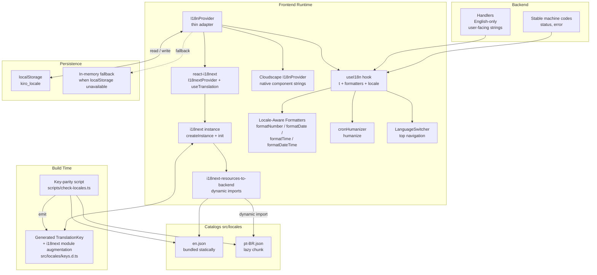
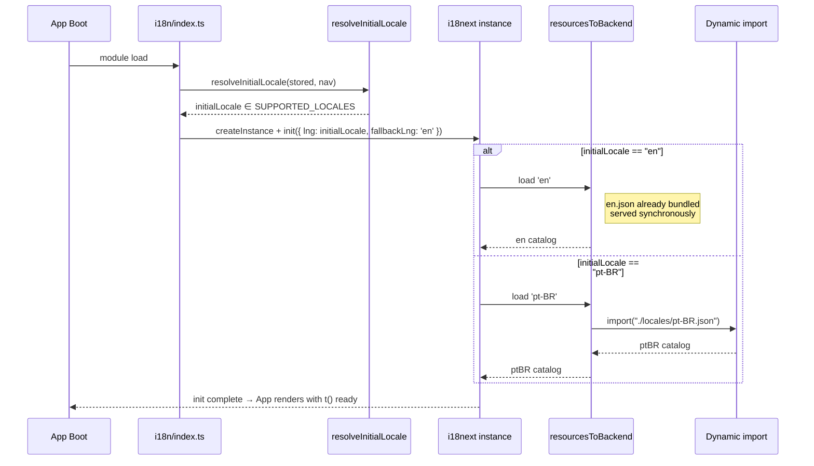
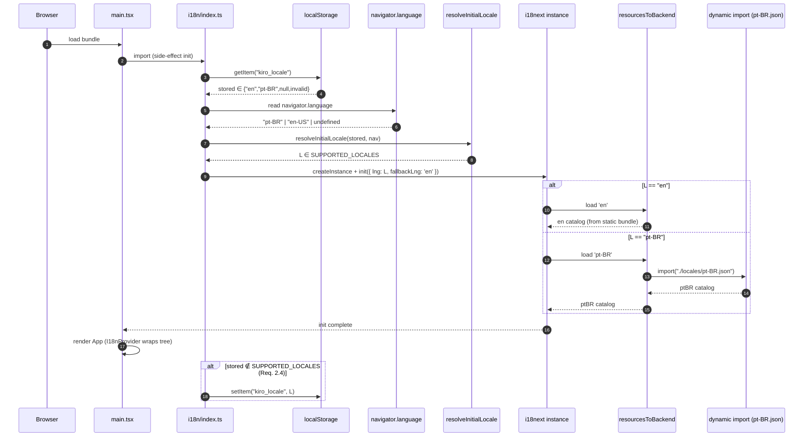
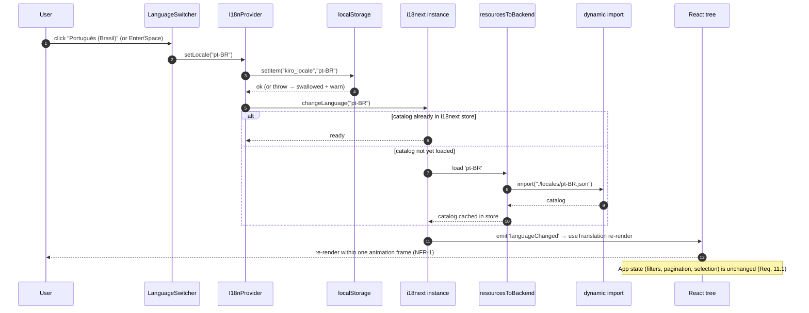
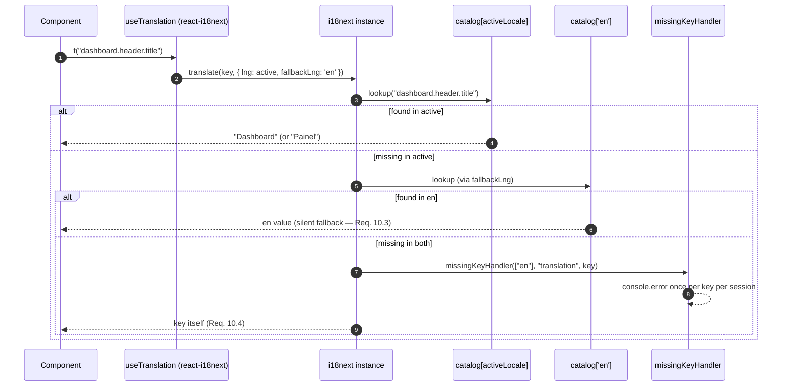
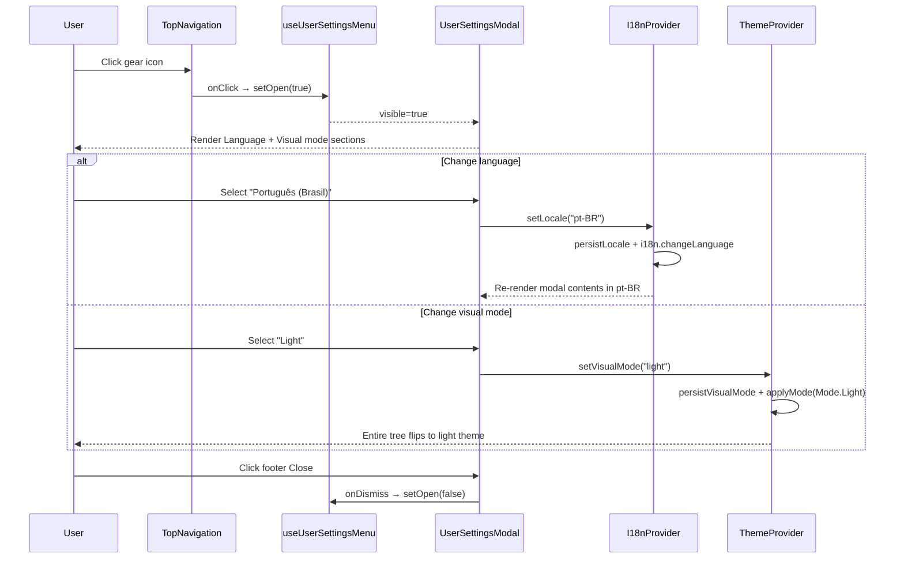

# Design Document — i18n and English as Default Locale

## Overview

This design introduces an internationalization (i18n) layer in the Kiro Cost Analyzer (KCA) frontend on top of `react-i18next`, flips the default UI language to English, preserves pt-BR as a first-class supported locale, and makes the backend speak English only for user-facing strings. It also migrates the top-level documentation and the project steering file to reflect the new convention.

The design leans on a widely-adopted i18n framework (`react-i18next` + `i18next`) so contributors can use a familiar API (`useTranslation()`, `t('key')`), and so we inherit battle-tested features (fallback chain, interpolation, lazy backends, TypeScript integration via declaration merging). A thin app-specific wrapper (`useI18n()` hook aliasing `useTranslation`, our own `LanguageSwitcher`, locale-aware formatters) keeps call sites clean. Cloudscape's `I18nProvider` is composed under the `I18nextProvider` so native Cloudscape component strings follow the same locale.

Scope covered by this design:

1. An i18n runtime (`I18nProvider` wrapping `I18nextProvider` + Cloudscape `I18nProvider`, `useI18n()` hook, locale-aware formatters, `LanguageSwitcher`, cron humanizer, catalogs).
2. A build-time key-parity check run as part of `vite build`.
3. A narrow backend change: every user-facing string in `backend/handlers/**` becomes English, with stable machine codes unchanged.
4. Documentation migration (`README.md` → English, `README.pt-BR.md` preserved).
5. Steering-file update (English as default UI language; code still English; i18n conventions documented).

Out of scope (confirmed by requirements): RTL locales, Accept-Language-driven backend negotiation, IP geolocation, per-user server-side locale preference, translation of stored data.

## Architecture

### Decision: `react-i18next` + `i18next` composed with Cloudscape `I18nProvider`

We evaluated three options:

| Criterion | Option A: Thin custom layer + Cloudscape `I18nProvider` | Option B: Cloudscape `I18nProvider` only | **Option C: `react-i18next` + `i18next` + Cloudscape `I18nProvider` (chosen)** |
|---|---|---|---|
| Gzipped runtime added to bundle | ~0.8 KB | 0 KB added (already in the dependency graph) | `i18next` ≈ 14–16 KB + `react-i18next` ≈ 7–8 KB → **~22 KB** |
| Translates Cloudscape native strings (DatePicker, Table empty state, etc.) | Yes (we compose Cloudscape `I18nProvider` under our provider) | Yes, natively | Yes (we compose Cloudscape `I18nProvider` under `I18nextProvider`) |
| Translates app strings (pages, components, hooks) | Yes (our `t(key)` resolves app strings from catalogs) | **No.** Cloudscape `I18nProvider` only covers Cloudscape's own component strings; it is not a general-purpose translator for app text. | Yes (`react-i18next`'s `t(key)` resolves app strings from catalogs) |
| TypeScript ergonomics | Fully typed via generated `TranslationKey` union | N/A for app text | Fully typed via `i18next` module augmentation (declaration merging of `CustomTypeOptions.resources`) — native `t()` call-site type checking and autocomplete |
| Interpolation, fallback, pluralization | We implement `{name}` interpolation by hand | N/A | Built-in ICU-lite interpolation, fallback chain, pluralization (future-proof if we need it) |
| Lazy-loading | Dynamic `import('./locales/${locale}.json')` + in-memory cache | N/A | Via `i18next-resources-to-backend` (wraps dynamic imports) or manual `i18n.addResourceBundle()` |
| Testability | Pure React context; trivial to mock | Simple | Requires `i18n.init()` in test setup, but `react-i18next` ships a documented test mode and `useTranslation` is straightforward to mock |
| Long-term contributor familiarity | Medium (custom surface) | Low (Cloudscape-specific) | **Highest** (industry-standard API; any React dev recognizes it on day one) |
| Ecosystem | — | — | Backends (HTTP, filesystem, resources-to-backend), detectors (browser language), formatters, plugins — all optional |

**Decision.** Option C — `react-i18next` + `i18next` composed with Cloudscape's `I18nProvider`. Rationale:

1. **Contributor familiarity is high-leverage.** KCA aims to be published under `aws-samples`. External contributors are much more likely to recognize `useTranslation()` / `t()` than a bespoke `useI18n()` surface, even if the API shape is identical. The friction to contribute drops to zero.
2. **We inherit a battle-tested runtime.** Fallback chains, interpolation, missing-key handlers, placeholders, detectors, declaration merging for typed keys — all solved. Custom code for these is risk without upside.
3. **Pluggable for future growth.** If we add locales, need pluralization, or want to swap catalog storage (HTTP backend, dynamic namespaces), the extension points are already there.
4. **Bundle size observed, not gated.** Requirement 15 was relaxed: we report runtime + catalog sizes in the build output, but there is no CI gate. The ~22 KB cost buys us the three advantages above.
5. **Cloudscape I18nProvider composition is free.** Cloudscape ships `en` and `pt-BR` message bundles (`@cloudscape-design/components/i18n/messages/all.en.json`, `...all.pt-BR.json`) at no extra dependency cost. Wrapping children in `<CloudscapeI18nProvider locale={locale} messages={[...]}>` inside the tree is one line.

Our own code becomes a thin adapter: an `I18nProvider` component that wraps `I18nextProvider` + Cloudscape `I18nProvider` and exposes locale-aware formatters; a `useI18n()` hook that is essentially a typed alias for `useTranslation()` with the formatters attached; a `LanguageSwitcher` component; and the `cronHumanizer` refactor. Call sites look like: `const { t, formatNumber, formatDateTime } = useI18n(); return <Header>{t('dashboard.header.title')}</Header>;`.

_Addresses: Requirement 1.1, 1.4, 15.1, 15.2, 15.3, NFR-3, NFR-5._

### High-level component diagram



_Addresses: Requirement 1.1, 1.4, 1.6, 7.1, 10.5, 15.1, 15.2._

### Module layout

```
frontend/src/
├── i18n/
│   ├── index.ts                # i18next initialization (createInstance + init + plugins)
│   ├── I18nProvider.tsx        # Thin adapter: wires i18next + Cloudscape + formatters + persistence
│   ├── useI18n.ts              # Hook: useTranslation + locale-aware formatters
│   ├── resolveLocale.ts        # Pure function: (stored, navigator) → SupportedLocale
│   ├── formatters.ts           # formatNumber / formatDate / formatTime / formatDateTime factory
│   ├── persistence.ts          # localStorage read/write with try/catch and dedup warn
│   ├── types.ts                # SupportedLocale, FormatterOptions, I18nContextExtras
│   └── constants.ts            # SUPPORTED_LOCALES, DEFAULT_LOCALE, LOCALE_STORAGE_KEY
├── locales/
│   ├── en.json                 # default locale (source of truth for key set; flat dot-notation)
│   ├── pt-BR.json              # byte-identical pt-BR strings for regression parity
│   └── keys.d.ts               # generated TranslationKey union + i18next module augmentation
├── components/
│   └── LanguageSwitcher.tsx    # Cloudscape ButtonDropdown in TopNavigation utilities
└── utils/
    └── cronHumanizer.ts        # refactored to humanize(expression, t)

scripts/
└── check-locales.ts            # build-time key parity + emptiness + emit keys.d.ts
```

Runtime dependencies added: `i18next`, `react-i18next`, `i18next-resources-to-backend` (for dynamic catalog loading). `i18next-browser-languagedetector` is **not** used — we own the resolution chain for determinism and testability.

_Addresses: Requirement 1.2, 1.5, 13.3, 13.4._

## Components and Interfaces

### `SupportedLocale`, typed `t`, `I18nContextExtras`

Translation keys are typed via **i18next module augmentation**: we declare `CustomTypeOptions.resources` so that `t('key')` at call sites is fully type-checked and autocompleted without a custom `TranslationKey` union.

```ts
// src/i18n/types.ts
import type { Formatters } from './formatters';

export type SupportedLocale = 'en' | 'pt-BR';

// Extras published via React context on top of react-i18next's own context.
// (react-i18next exposes `t`, `i18n`; we add the formatters and a typed `locale`/`setLocale`.)
export interface I18nContextExtras extends Formatters {
  locale: SupportedLocale;
  setLocale: (next: SupportedLocale) => Promise<void>;
}
```

```ts
// src/locales/keys.d.ts (generated at build time by scripts/check-locales.ts)
// 1) Emit a TranslationKey union for callers that want it explicitly.
// 2) Augment i18next's CustomTypeOptions so `t('...')` is typed.
import 'i18next';
import type enCatalog from './en.json';

export type TranslationKey = keyof typeof enCatalog;

declare module 'i18next' {
  interface CustomTypeOptions {
    defaultNS: 'translation';
    // Every key is a string value. Flat dot-notation means keys are literal
    // strings; we disable i18next's key-separator to avoid it treating dots
    // as nested-object navigation.
    returnNull: false;
    resources: {
      translation: typeof enCatalog;
    };
  }
}
```

Consequence: at every call site `t('dashboard.header.title')` is typed as returning `string`, and typos are caught at `tsc` time. We disable i18next's default `keySeparator` (see `i18next` init below) so dots stay literal inside keys.

_Addresses: Requirement 1.1, 5.1, 10.1._

### `i18next` initialization

```ts
// src/i18n/index.ts
import i18next, { type i18n as I18n } from 'i18next';
import { initReactI18next } from 'react-i18next';
import resourcesToBackend from 'i18next-resources-to-backend';
import enCatalog from '../locales/en.json';
import { DEFAULT_LOCALE, SUPPORTED_LOCALES } from './constants';
import { resolveInitialLocale } from './resolveLocale';
import { readStored, persistLocale } from './persistence';

const initialLocale = resolveInitialLocale(
  readStored(),
  typeof navigator !== 'undefined' ? navigator.language : undefined,
);

// Single app-wide i18next instance. Exported for tests and advanced call sites.
export const i18n: I18n = i18next.createInstance();

i18n
  .use(initReactI18next)
  // Lazy-load non-default locales as separate chunks via dynamic import.
  // en.json is bundled statically (addResourceBundle below) so the first render
  // never waits on the network (Req. 2.6 / 15.1).
  .use(
    resourcesToBackend(async (language: string, _namespace: string) => {
      if (language === 'en') return enCatalog; // served from the static bundle
      // Dynamic import — Vite emits one chunk per locale (Req. 15.2).
      const mod = await import(`../locales/${language}.json`);
      return mod.default;
    }),
  )
  .init({
    lng: initialLocale,
    fallbackLng: DEFAULT_LOCALE,
    supportedLngs: SUPPORTED_LOCALES as unknown as string[],
    defaultNS: 'translation',
    ns: ['translation'],
    // Flat dot-notation keys. Disable i18next's default separators so "a.b.c"
    // stays literal and is not treated as nested-object navigation.
    keySeparator: false,
    nsSeparator: false,
    interpolation: {
      // React already escapes output, so i18next's escapeValue must be off.
      escapeValue: false,
      // We use {{name}} syntax (i18next default), not {name}. All catalog
      // placeholders follow this convention.
      prefix: '{{',
      suffix: '}}',
    },
    returnNull: false,
    // Key-parity, emptiness and sorting are enforced at build time
    // (scripts/check-locales.ts). At runtime we still log if a key is missing
    // in both active and fallback catalogs.
    saveMissing: import.meta.env.DEV,
    missingKeyHandler: (lngs, _ns, key) => {
      if (!import.meta.env.PROD) {
        // One warn per key per session, deduped inside the handler.
        reportMissing(key, lngs as readonly string[]);
      }
    },
    // If stored locale is invalid it was already rejected by resolveInitialLocale;
    // still, align localStorage with the effective locale on first boot.
  })
  .then(() => {
    if (readStored() !== i18n.language) persistLocale(i18n.language as SupportedLocale);
  });

// Keep i18next's internal language in sync if code outside React calls it.
i18n.on('languageChanged', (lng) => {
  persistLocale(lng as SupportedLocale);
});
```

### `I18nProvider` (adapter)

The provider is a thin adapter: it wires `I18nextProvider` and Cloudscape's `I18nProvider`, plus exposes our locale-aware formatters on a small React context (`I18nExtrasContext`). Call sites do not read this context directly — `useI18n()` reads both `useTranslation()` and the extras context and merges the result.

```tsx
// src/i18n/I18nProvider.tsx
import { createContext, useCallback, useMemo, useState, type ReactNode } from 'react';
import { I18nextProvider, useTranslation } from 'react-i18next';
import { I18nProvider as CloudscapeI18nProvider } from '@cloudscape-design/components/i18n';
import enMessages from '@cloudscape-design/components/i18n/messages/all.en.json';
import ptBRMessages from '@cloudscape-design/components/i18n/messages/all.pt-BR.json';
import { i18n } from './index';
import { createFormatters, type Formatters } from './formatters';
import { persistLocale } from './persistence';
import type { I18nContextExtras, SupportedLocale } from './types';

const CS_MESSAGES: Record<SupportedLocale, unknown> = {
  'en': enMessages,
  'pt-BR': ptBRMessages,
};

export const I18nExtrasContext = createContext<I18nContextExtras | null>(null);

export function I18nProvider({ children }: { children: ReactNode }) {
  return (
    <I18nextProvider i18n={i18n}>
      <InnerProvider>{children}</InnerProvider>
    </I18nextProvider>
  );
}

function InnerProvider({ children }: { children: ReactNode }) {
  // `useTranslation` re-renders this subtree whenever i18n.language changes.
  const { i18n: instance } = useTranslation();
  const locale = instance.language as SupportedLocale;

  const setLocale = useCallback(async (next: SupportedLocale) => {
    // Persist first so the preference is causally upstream of the re-render.
    persistLocale(next);
    // i18next loads the catalog lazily if not already loaded, then triggers
    // a single `languageChanged` event → single React commit (NFR-1).
    await instance.changeLanguage(next);
  }, [instance]);

  const formatters = useMemo<Formatters>(() => createFormatters(locale), [locale]);

  const extras = useMemo<I18nContextExtras>(
    () => ({ locale, setLocale, ...formatters }),
    [locale, setLocale, formatters],
  );

  return (
    <I18nExtrasContext.Provider value={extras}>
      <CloudscapeI18nProvider locale={locale} messages={[CS_MESSAGES[locale]]}>
        {children}
      </CloudscapeI18nProvider>
    </I18nExtrasContext.Provider>
  );
}
```

**Behavior (contracts):**

- `i18next` is initialized **once**, synchronously on module load. `en.json` is bundled statically and registered via `resourcesToBackend`, so the first render never waits on the network when the resolved locale is `en`. _Addresses: 2.6, 15.1._
- `setLocale` calls `persistLocale(next)` before `i18n.changeLanguage(next)`, so the `localStorage` write is causally upstream of the React re-render. _Addresses: 3.2, 4.1._
- On `localStorage` failure, `persistLocale` swallows the error and emits a single `console.warn` per session. _Addresses: 4.3._
- `CloudscapeI18nProvider` wraps children with the matching locale so native Cloudscape strings flip atomically with our app strings. _Addresses: 1.4._
- A locale change produces exactly **one** React commit: `i18next` fires `languageChanged`, `useTranslation` re-renders `InnerProvider` once, `useMemo`-wrapped `extras` yields one new object, Cloudscape receives the new `locale`. _Addresses: NFR-1._

_Addresses: Requirement 1.1, 2.6, 3.2, 3.3, 4.1, 4.3, 15.1._

### `useI18n()` hook

```ts
// src/i18n/useI18n.ts
import { useContext } from 'react';
import { useTranslation } from 'react-i18next';
import { I18nExtrasContext } from './I18nProvider';
import type { I18nContextExtras } from './types';
import type { TFunction } from 'i18next';

export interface UseI18nResult extends I18nContextExtras {
  t: TFunction;
}

export function useI18n(): UseI18nResult {
  const { t } = useTranslation();
  const extras = useContext(I18nExtrasContext);
  if (!extras) throw new Error('useI18n must be used within <I18nProvider>');
  return { ...extras, t };
}
```

Usage:

```tsx
const { t, formatNumber, formatDateTime, locale, setLocale } = useI18n();
return <Header>{t('dashboard.header.title')}</Header>;
```

Components that only need `t` can still call `react-i18next`'s `useTranslation()` directly — it produces the same typed `t`. `useI18n()` is the preferred path when the component also needs formatters or locale control.

_Addresses: Requirement 1.1, 3.3._

### `t(key, vars?)` contract and variable interpolation

`t` is `react-i18next`'s `TFunction`, typed against our catalog via module augmentation (see `keys.d.ts`). Contracts relevant to this spec:

- `t(key)` returns the string bound to `key` in the active catalog.
- `t(key, vars)` replaces every occurrence of `{{name}}` in the resolved string with `String(vars.name)`. This is i18next's default interpolation — documented, battle-tested, and not something we reimplement.
- **Placeholder syntax is `{{name}}` (double braces), not `{name}`**, following i18next convention. Every catalog template must use the double-brace form.
- Interpolation is strictly `{{name}}` substitution — no ICU plural, no nesting, no HTML. We also disable `keySeparator` and `nsSeparator` (see `index.ts`) so dots inside keys are literal and single-namespace lookup is implicit. If we ever need pluralization, i18next's built-in plural suffixes (`key_one`, `key_other`) are available without code changes.
- Missing `vars.name` leaves the literal placeholder in the output — i18next's default behavior with `interpolation.skipOnVariables = true` (the default since v21).
- Fallback chain is enforced by i18next's `fallbackLng` (`'en'`) plus our `missingKeyHandler`:
  1. `catalog[activeLocale][key]`
  2. `catalog['en'][key]` (Missing_Key_Fallback via `fallbackLng`)
  3. `key` itself (returned as the rendered string by `react-i18next`, with a `console.error` emitted by our `missingKeyHandler`, deduped per session).

Grammar (as used by i18next):

```
template ::= (literal | placeholder)*
placeholder ::= "{{" ident "}}"
ident ::= [a-zA-Z_][a-zA-Z0-9_]*
```

_Addresses: Requirement 10.3, 10.4._

### `Locale_Aware_Formatter` helpers

```ts
// src/i18n/formatters.ts
import type { SupportedLocale } from './types';

export interface Formatters {
  formatNumber: (value: number, options?: Intl.NumberFormatOptions) => string;
  formatDate: (value: Date | number | string, options?: Intl.DateTimeFormatOptions) => string;
  formatTime: (value: Date | number | string, options?: Intl.DateTimeFormatOptions) => string;
  formatDateTime: (value: Date | number | string, options?: Intl.DateTimeFormatOptions) => string;
}

const DEFAULT_DATE: Intl.DateTimeFormatOptions = { year: 'numeric', month: '2-digit', day: '2-digit' };
const DEFAULT_TIME: Intl.DateTimeFormatOptions = { hour: '2-digit', minute: '2-digit' };
const DEFAULT_DATETIME: Intl.DateTimeFormatOptions = { ...DEFAULT_DATE, ...DEFAULT_TIME };

function toDate(value: Date | number | string): Date {
  if (value instanceof Date) return value;
  if (typeof value === 'number') return new Date(value);
  return new Date(value);
}

export function createFormatters(locale: SupportedLocale): Formatters {
  return {
    formatNumber: (value, options) => new Intl.NumberFormat(locale, options).format(value),
    formatDate: (value, options) =>
      new Intl.DateTimeFormat(locale, options ?? DEFAULT_DATE).format(toDate(value)),
    formatTime: (value, options) =>
      new Intl.DateTimeFormat(locale, options ?? DEFAULT_TIME).format(toDate(value)),
    formatDateTime: (value, options) =>
      new Intl.DateTimeFormat(locale, options ?? DEFAULT_DATETIME).format(toDate(value)),
  };
}
```

**Contract:**

- Every formatter delegates to `Intl.NumberFormat` / `Intl.DateTimeFormat` seeded with the active locale.
- An invalid date (e.g. `NaN`) resolves to `Intl`'s native behavior (the literal `"Invalid Date"` string on modern engines). Callers keep their existing `try/catch` fallbacks where they wrap bad inputs.
- The formatter module has **zero state** across renders. Memoization happens in `I18nProvider`'s `useMemo`, so a locale change produces exactly one new `Formatters` object and therefore one React re-render (NFR-1).

Every existing call to `toLocaleString('pt-BR')`, `toLocaleDateString('pt-BR')`, `toLocaleTimeString('pt-BR')` in `frontend/src/**` is replaced by the corresponding helper. Enumerated call sites (grep-verified):

| File | Current call | Replacement |
|---|---|---|
| `components/AccountSummaryCards.tsx` | `n.toLocaleString('pt-BR', {...})` (2 sites) | `formatNumber(n, {...})` |
| `components/UserSummaryCards.tsx` | `n.toLocaleString('pt-BR', {...})` (2 sites) | `formatNumber(n, {...})` |
| `components/UsageTable.tsx` | `item.totalMessages.toLocaleString('pt-BR')` (2 sites) | `formatNumber(value)` |
| `components/RecentPromptsTable.tsx` | `d.toLocaleString('pt-BR')`, `item.promptLength.toLocaleString('pt-BR')` (3 sites) | `formatDateTime(d)`, `formatNumber(value)` |
| `components/PromptDetailPanel.tsx` | `d.toLocaleString('pt-BR')` | `formatDateTime(d)` |
| `components/DistributionCharts.tsx` | `datum.value.toLocaleString('pt-BR')` (6 sites) | `formatNumber(datum.value)` |
| `pages/SettingsPage.tsx` | `new Date(value).toLocaleString('pt-BR')` | `formatDateTime(value)` |
| `pages/UsersPage.tsx` | `new Date(item.createdAt).toLocaleString('pt-BR')` | `formatDateTime(item.createdAt)` |
| `pages/FeedbackAdminPage.tsx` | `new Date(iso).toLocaleString('pt-BR')` | `formatDateTime(iso)` |

_Addresses: Requirement 5.1, 5.2, 5.3, 5.4, 5.5, NFR-1._

### `LanguageSwitcher` component

Placement: utility slot of the existing `TopNavigation` in `App.tsx`, to the left of the user menu.

```tsx
// src/components/LanguageSwitcher.tsx
import ButtonDropdown, { type ButtonDropdownProps } from '@cloudscape-design/components/button-dropdown';
import { useI18n } from '../i18n/useI18n';
import { SUPPORTED_LOCALES } from '../i18n/constants';
import type { SupportedLocale } from '../i18n/types';

const LOCALE_LABELS: Record<SupportedLocale, string> = {
  // Labels are written in the target language (Requirement 14.3):
  'en': 'English',
  'pt-BR': 'Português (Brasil)',
};

export interface LanguageSwitcherProps {
  id?: string;
}

export default function LanguageSwitcher({ id = 'language-switcher' }: LanguageSwitcherProps) {
  const { locale, setLocale, t } = useI18n();
  const items: ButtonDropdownProps.Item[] = SUPPORTED_LOCALES.map((code) => ({
    id: code,
    text: LOCALE_LABELS[code],
    iconName: code === locale ? 'check' : undefined,
  }));
  return (
    <ButtonDropdown
      id={id}
      items={items}
      onItemClick={({ detail }) => setLocale(detail.id as SupportedLocale)}
      ariaLabel={t('common.languageSwitcher.ariaLabel')}
      expandableGroups={false}
    >
      {LOCALE_LABELS[locale]}
    </ButtonDropdown>
  );
}
```

Accessibility (Requirement 14):

- `ButtonDropdown` is natively keyboard-reachable and participates in the standard `Tab` order (14.1).
- `ariaLabel` is resolved from the active catalog (14.2): `"Language"` in `en`, `"Idioma"` in `pt-BR`.
- Option text is written in the target language (14.3): `"Português (Brasil)"`, `"English"`. The `check` icon on the active option communicates current selection to AT.
- When opened via keyboard, `ButtonDropdown` focuses its first item (Cloudscape default) (14.4).
- `Enter` / `Space` on an item triggers `onItemClick`, identical to mouse click (14.5).

Wiring in `App.tsx`:

```tsx
<TopNavigation
  identity={{ title: 'Kiro Cost Analyzer', href: '/' }}
  utilities={[
    { type: 'menu-dropdown', text: <LanguageSwitcher /> , /* ... */ },
    { /* user menu as today */ },
  ]}
/>
```

(Implementation note: `TopNavigation.utilities` accepts only a restricted shape, so the switcher is rendered as a custom `type: 'button'` utility using the `iconName="script"` placeholder, or — preferred — next to the user menu via a small sibling node. The precise placement is an implementation detail; the contract is "reachable, keyboard-accessible, labeled".)

_Addresses: Requirement 3.1, 3.2, 3.5, 14.1–14.5._

### Lazy-loading strategy

Lazy loading is delegated to `i18next-resources-to-backend`, configured in `src/i18n/index.ts` (see initialization above). The strategy:

- `en.json` is imported **statically** in `src/i18n/index.ts` (Vite inlines it into the initial JS bundle). It is the only catalog that contributes to initial load when `Active_Locale = 'en'` (Requirement 15.1).
- Every other locale is a **dynamic `import()`** wrapped by `resourcesToBackend`, so Vite emits one separate chunk per locale. Users on `en` never download `pt-BR.json` unless they click the switcher (Requirement 15.2).
- i18next's internal resource store **caches catalogs after first load** automatically — a second switch to an already-loaded catalog is free (no network, no parse).
- If the resolved initial locale is `pt-BR` (user on a Brazilian browser), we pay one extra network round-trip on first load. Acceptable per NFR-1 (at most one additional request on first page load). A future optimization could prefetch the alternative catalog with `<link rel="prefetch">` on idle.

Sequence:



_Addresses: Requirement 1.6, 2.1–2.6, 15.1, 15.2._

### Fallback / missing-key handling

- **Runtime missing key in active locale, present in en**: `react-i18next` resolves via `fallbackLng: 'en'`; no warning emitted (this is the defined happy path under Req. 10.3's fallback behavior). If we ever want visibility into silent fallbacks, we enable `i18next`'s `returnedObjectHandler` / `parseMissingKeyHandler`.
- **Runtime missing key in both**: our `missingKeyHandler` (wired in `src/i18n/index.ts`) is invoked. It calls `reportMissing(key, lngs)`, which `console.error`s exactly once per key per session in non-production builds. `react-i18next` then returns the key itself as the rendered string (Requirement 10.4).
- **Build-time missing key**: `scripts/check-locales.ts` fails the build (Requirement 10.5).
- **Interpolation placeholder with no matching var**: i18next keeps the placeholder literal (`{{name}}`) in the output. A Vitest lint rule in our test suite asserts that every catalog value whose placeholder set does not match the placeholder set of the `en` value for the same key is flagged — so cross-locale placeholder drift is caught.

```ts
// src/i18n/index.ts (excerpt)
const seen = new Set<string>();
function reportMissing(key: string, langs: readonly string[]): void {
  if (seen.has(key)) return;
  seen.add(key);
  console.error(`[i18n] Missing key in catalogs ${langs.join(', ')}: ${key}`);
}
```

Dedup is intentionally **per-session** — developers see each missing key exactly once, not once per render.

### Integration with Cloudscape `I18nProvider`

- Cloudscape ships `en` and `pt-BR` message bundles (`@cloudscape-design/components/i18n/messages/all.en.json`, `...all.pt-BR.json`). We import both statically (they are small; Cloudscape dedupes per component).
- The `CloudscapeI18nProvider` wraps the application root inside our `I18nProvider` so the Cloudscape locale is always in sync with the app locale. A locale switch produces a single React tree re-render, flipping both our app strings and Cloudscape's native strings atomically.
- If we add a locale that Cloudscape does not ship (none planned), we will pass an empty message set and rely on Cloudscape's English defaults for native strings.

_Addresses: Requirement 1.4._

### Resolution chain

```ts
// src/i18n/resolveLocale.ts
import { DEFAULT_LOCALE, SUPPORTED_LOCALES } from './constants';
import type { SupportedLocale } from './types';

export function resolveInitialLocale(
  stored: string | null,
  navigatorLanguage: string | undefined,
): SupportedLocale {
  // 1. Stored value wins if supported
  if (stored && isSupported(stored)) return stored as SupportedLocale;
  // 2. navigator.language normalized to a supported primary subtag
  const fromNav = normalizeToSupported(navigatorLanguage);
  if (fromNav) return fromNav;
  // 3. Default
  return DEFAULT_LOCALE;
}

function isSupported(tag: string): boolean {
  return (SUPPORTED_LOCALES as readonly string[]).includes(tag);
}

function normalizeToSupported(tag: string | undefined): SupportedLocale | null {
  if (!tag) return null;
  const lower = tag.toLowerCase();
  // Exact BCP-47 matches for pt-BR (any casing)
  if (lower === 'pt-br' || lower === 'pt_br') return 'pt-BR';
  // Primary subtag for Portuguese → pt-BR (only pt variant supported)
  if (lower === 'pt' || lower.startsWith('pt-') || lower.startsWith('pt_')) return 'pt-BR';
  // Primary subtag for English → en
  if (lower === 'en' || lower.startsWith('en-') || lower.startsWith('en_')) return 'en';
  return null;
}
```

The function is **total** over `(string | null, string | undefined)` — it always returns a value in `SupportedLocale` (Requirement 16.1). It is also **pure**, which makes it trivial to property-test.

_Addresses: Requirement 2.1, 2.2, 2.4, 2.5._

### Persistence layer

```ts
const LOCALE_STORAGE_KEY = 'kiro_locale';

function readStored(): string | null {
  try { return window.localStorage.getItem(LOCALE_STORAGE_KEY); }
  catch { return null; }
}

function persistLocale(locale: SupportedLocale): void {
  try { window.localStorage.setItem(LOCALE_STORAGE_KEY, locale); }
  catch (err) {
    if (!persistWarned) {
      console.warn('[i18n] localStorage unavailable; locale preference will not persist.', err);
      persistWarned = true;
    }
  }
}

let persistWarned = false;
```

`localStorage` throws in some corners (Safari private mode pre-2021, iframe sandbox, storage quota). All call sites use try/catch and fall back to in-memory state for the duration of the session. One warning per session — deduped by the module-scoped `persistWarned` flag (Requirement 4.3).

### `cronHumanizer` refactor

**New signature:**

```ts
// src/utils/cronHumanizer.ts
import type { TFunction } from 'i18next';

export function humanize(expression: string, t: TFunction): string;
```

**Rationale:** the refactor keeps the **parser** (rate, cron daily, cron DOW, cron DOM) untouched — that is the part that earns its keep. Only the **display strings** move to the catalogs, consumed through an injected `t`. This keeps the function pure (no hidden `locale` coupling) and unit-testable with a synthetic `t`.

**Catalog keys added to both `en.json` and `pt-BR.json`** (placeholder syntax is i18next's `{{name}}`):

```
cron.rate.daily              → "Every day" / "Todos os dias"
cron.rate.days               → "Every {{n}} days" / "A cada {{n}} dias"
cron.rate.hourly             → "Every hour" / "A cada hora"
cron.rate.hours              → "Every {{n}} hours" / "A cada {{n}} horas"
cron.rate.minute             → "Every minute" / "A cada minuto"
cron.rate.minutes            → "Every {{n}} minutes" / "A cada {{n}} minutos"
cron.cron.daily              → "Every day at {{time}}" / "Todos os dias às {{time}}"
cron.cron.dayOfMonth         → "Every day {{day}} at {{time}}" / "Todo dia {{day}} às {{time}}"
cron.cron.daysRange          → "From {{start}} to {{end}} at {{time}}" / "De {{start}} a {{end}} às {{time}}"
cron.cron.daysList           → "{{days}} at {{time}}" / "{{days}} às {{time}}"
cron.days.SUN                → "Sunday" / "domingo"
cron.days.MON                → "Monday" / "segunda"
cron.days.TUE                → "Tuesday" / "terça"
cron.days.WED                → "Wednesday" / "quarta"
cron.days.THU                → "Thursday" / "quinta"
cron.days.FRI                → "Friday" / "sexta"
cron.days.SAT                → "Saturday" / "sábado"
```

Call site:

```tsx
// pages/SettingsPage.tsx
const { t } = useI18n();
const scheduleText = humanize(schedule?.expression ?? '', t);
```

The backend's `EtlSchedule.humanReadable` remains in the response (NFR-5 — API shape is frozen), but the frontend ignores it for display (Requirement 6.5, 7.3). The field becomes informational-only.

For unparsable expressions, `humanize` returns the input verbatim (Requirement 6.4), matching the current behavior.

_Addresses: Requirement 6.1–6.5._

## Data Models

### Catalog JSON shape

**Decision: flat dot-notation keys, not nested objects.**

```json
// src/locales/en.json
{
  "common.buttons.save": "Save",
  "common.buttons.cancel": "Cancel",
  "common.languageSwitcher.ariaLabel": "Language",
  "dashboard.header.title": "Dashboard",
  "dashboard.filters.period": "Period",
  "settings.etl.status.title": "ETL status",
  "settings.etl.schedule.unavailable": "Schedule unavailable",
  "cron.rate.daily": "Every day",
  "cron.days.MON": "Monday",
  "brand.productName": "Kiro Cost Analyzer",
  "brand.short": "Kiro"
}
```

Rationale:

1. **Simpler tooling.** Key parity is a `Set` difference. A recursive deep-merge step is not needed.
2. **Easier diff review.** One line per key. Adding or renaming a key changes exactly one line per catalog.
3. **Better IDE autocomplete via generated types.** `TranslationKey` becomes a string-literal union (e.g. `'dashboard.header.title' | 'common.buttons.save' | ...`). Nested objects require a deep-key extraction type and degrade ergonomics.
4. **JSON-sortable.** We enforce alphabetical ordering at build time (see Testing Strategy), which makes merges painless.

Keys use **kebab-free dot notation** with a namespaced pattern: `<area>.<component>.<role>`. Areas: `common`, `brand`, `cron`, `dashboard`, `account`, `settings`, `users`, `userDetail`, `login`, `forgotPassword`, `feedback`, `prompts`.

### `SupportedLocale` and constants

```ts
// src/i18n/constants.ts
import type { SupportedLocale } from './types';

export const SUPPORTED_LOCALES: readonly SupportedLocale[] = ['en', 'pt-BR'] as const;
export const DEFAULT_LOCALE: SupportedLocale = 'en';
export const LOCALE_STORAGE_KEY = 'kiro_locale';
export const BRAND_STRINGS = {
  productName: 'Kiro Cost Analyzer',
  short: 'Kiro',
} as const;
```

### Build-time key-parity + emptiness + codegen check

`scripts/check-locales.ts` runs as:

- `npm run build` → added to the `build` script before `tsc -b` (`"build": "node scripts/check-locales.ts && tsc -b && vite build"`).
- CI also runs `npm run check:locales` as a dedicated step.

Contract:

- Exit code `1` if `keys(en.json) != keys(pt-BR.json)` (set equality).
- Exit code `1` if any `(locale, key)` resolves to an empty string, non-string, or missing value.
- Exit code `1` if either file is not sorted alphabetically by key.
- On success, write `src/locales/keys.d.ts` containing `export type TranslationKey = 'key1' | 'key2' | ...`.

The script uses only Node stdlib — no new dependency.

_Addresses: Requirement 10.1, 10.2, 10.5._

### Backend pt-BR literal enumeration

Every pt-BR user-facing string in `backend/handlers/**` is replaced with an English equivalent. `_humanize_schedule` is retained but emits English (it is informational-only on the frontend now; external consumers still get a readable line).

| File | Current (pt-BR) | Replacement (en) |
|---|---|---|
| `backend/handlers/config_handler.py` `handle_put_config_bucket` | `"Bucket acessível e configuração salva com sucesso"` | `"Bucket is accessible and configuration saved successfully"` |
| `backend/handlers/config_handler.py` `handle_put_config_prompts_prefix` | `"Prompts prefix salvo com sucesso"` | `"Prompts prefix saved successfully"` |
| `backend/handlers/config_handler.py` `handle_put_config_identity_store_id` | `"Identity Store ID salvo com sucesso"` | `"Identity Store ID saved successfully"` |
| `backend/handlers/config_handler.py` `handle_put_config_source_bucket_role_arn` | `"Formato de ARN inválido. Esperado: arn:aws:iam::<account-id>:role/<role-name>"` | `"Invalid ARN format. Expected: arn:aws:iam::<account-id>:role/<role-name>"` |
| `backend/handlers/config_handler.py` `handle_put_config_source_bucket_role_arn` | `"Source bucket role ARN salvo com sucesso"` | `"Source bucket role ARN saved successfully"` |
| `backend/handlers/config_handler.py` `handle_put_config_source_bucket_role_arn` | `"Modo cross-account desabilitado"` | `"Cross-account mode disabled"` |
| `backend/handlers/config_handler.py` `_humanize_schedule` | `"Todos os dias"`, `"A cada N horas"`, `"A cada N minutos"`, `"Todos os dias às HH:MM"` | `"Every day"`, `"Every N hours"`, `"Every N minutes"`, `"Every day at HH:MM"` |
| `backend/handlers/config_handler.py` `handle_get_schedule` | `"Agendamento indisponível"` | `"Schedule unavailable"` |
| `backend/handlers/feedback_handler.py` | `"Prompt com requestId '{}' não encontrado"` | `"Prompt with requestId '{}' not found"` |
| `backend/handlers/feedback_handler.py` | `"Feedback enviado com sucesso"` | `"Feedback submitted successfully"` |
| `backend/handlers/feedback_handler.py` | `"Feedback não encontrado"` | `"Feedback not found"` |
| `backend/handlers/feedback_handler.py` | `"Feedback revisado com sucesso"` | `"Feedback reviewed successfully"` |
| `backend/handlers/prompts_handler.py` | `"O parâmetro userId é obrigatório para listagem de prompts"` | `"The userId query parameter is required to list prompts"` |
| `backend/handlers/prompts_handler.py` | `"Prompt com requestId '{}' não encontrado"` | `"Prompt with requestId '{}' not found"` |
| `backend/handlers/prompts_handler.py` | `"Conteúdo do prompt '{}' não encontrado no S3"` | `"Prompt content for '{}' not found in S3"` |
| `backend/handlers/users_handler.py` | `"Usuário '{}' não encontrado"` (×2) | `"User '{}' not found"` |

**Invariant.** For every handler under `backend/handlers/`, every response field whose semantic is "human-readable text" is English. Stable machine codes (`status: "error"`, `status: "valid"`, `error: "NotFound"`, `error: "InvalidParameters"`) are untouched — they are slugs, not prose (Requirement 7.4).

**Few-shot examples (`few_shot_exporter.py`).** Out of scope for this spec — these are Bedrock training inputs (Portuguese prompts categorized as examples), not user-facing strings. Out of Scope #2 explicitly excludes translating category training data.

API schemas are unchanged (NFR-5). `EtlSchedule.humanReadable` stays in the response type and keeps being returned — only its meaning shifts from "display string" to "informational English summary".

_Addresses: Requirement 7.1–7.5, NFR-5._

## Correctness Properties

_A property is a characteristic or behavior that should hold true across all valid executions of a system — essentially, a formal statement about what the system should do. Properties serve as the bridge between human-readable specifications and machine-verifiable correctness guarantees._

The feature has a large pure-function core (resolution, formatting, catalog lookup, cron humanizer) with clear input → output contracts over a large input space. This is exactly where property-based testing earns its keep, so we write Correctness Properties below. The UI-side state-preservation property is tested against a pure reducer model (see Testing Strategy).

### Property 1: Resolution totality

*For any* pair `(stored, navigatorLanguage)` where `stored ∈ string | null` and `navigatorLanguage ∈ string | undefined`, `resolveInitialLocale(stored, navigatorLanguage) ∈ SUPPORTED_LOCALES`.

**Validates: Requirement 2.1, 2.2, 2.4, 2.5, 16.1.**

### Property 2: Preference round-trip

*For any* locale `L ∈ SUPPORTED_LOCALES`, if `setLocale(L)` is called, then after a simulated app restart (re-read from `localStorage`, re-run the resolution chain), `Active_Locale == L`.

**Validates: Requirement 3.2, 4.1, 4.2, 16.2.**

### Property 3: State preservation under locale switch

*For any* application-state snapshot `S` (filter/pagination/sort/selection record) and *for any* locale `L ∈ SUPPORTED_LOCALES`, switching `Active_Locale` to `L` via `setLocale(L)` leaves `S` byte-identical before and after the transition.

**Validates: Requirement 3.4, 11.1, 11.3, 16.3.**

### Property 4: Number formatter locale coherence

*For any* finite number `n ∈ ℝ` and *for any* locale `L ∈ SUPPORTED_LOCALES` and *for any* options `opts ∈ Intl.NumberFormatOptions`, `formatNumber(n, opts)` evaluated under a provider with `locale = L` equals `new Intl.NumberFormat(L, opts).format(n)`.

**Validates: Requirement 5.1, 5.3, 5.4, 16.4.**

### Property 5: Date and time formatter locale coherence

*For any* timestamp `t ∈ Date` and *for any* locale `L ∈ SUPPORTED_LOCALES` and *for any* options `opts ∈ Intl.DateTimeFormatOptions`, `formatDateTime(t, opts)` evaluated under a provider with `locale = L` equals `new Intl.DateTimeFormat(L, opts).format(t)`. The same holds for `formatDate` and `formatTime`.

**Validates: Requirement 5.1, 5.3, 5.4, 5.5, 16.5.**

### Property 6: Cron humanizer locale coherence and fallback

*For any* parsable EventBridge expression `E` and *for any* locale `L ∈ SUPPORTED_LOCALES`, `humanize(E, tFor(L))` equals the template composed from `catalog[L]` applied to `parse(E)`. *For any* unparsable `E`, `humanize(E, tFor(L)) == E`.

**Validates: Requirement 6.1–6.4, 16.6.**

### Property 7: Catalog key parity

`keys(en.json) == keys(pt-BR.json)` as sets (symmetric difference is empty).

**Validates: Requirement 10.1, 16.7.**

### Property 8: No empty translations

*For every* `(locale, key)` in the catalogs, `catalog[locale][key]` is a non-empty string.

**Validates: Requirement 10.2, 16.8.**

### Property 9: Missing-key fallback

*For every* `Translation_Key k` present in `catalog['en']` but absent from the active locale catalog (simulated via a partial catalog), `t(k)` equals `catalog['en'][k]`.

**Validates: Requirement 10.3, 16.9.**

### Property 10: Brand invariance

*For every* locale `L ∈ SUPPORTED_LOCALES` and *for every* brand key `b ∈ { 'brand.productName', 'brand.short' }`, `catalog[L][b]` equals the canonical brand literal (`"Kiro Cost Analyzer"` and `"Kiro"` respectively).

**Validates: Requirement 9.1, 9.2, 16.10.**

## Error Handling

| Failure | Detection | Behavior | Observability |
|---|---|---|---|
| `localStorage` unavailable (Safari private, quota, disabled) | `try/catch` around `getItem` / `setItem` in `persistence.ts` | Fall back to in-memory state; first-render locale resolves via the remaining chain links | One `console.warn` per session (deduped by `persistWarned` flag). _Req. 4.3._ |
| Invalid stored locale (`v ∉ SUPPORTED_LOCALES`) | `isSupported(v)` check in `resolveInitialLocale` | Ignore `v`, continue resolution chain, **overwrite `Locale_Storage_Key` with the resolved value after `i18n.init` resolves** | No console output (expected corner after deploy churn). _Req. 2.4._ |
| Missing key in active locale, present in `en` | i18next's internal lookup (via `fallbackLng: 'en'`) | Return `catalog['en'][key]` | Silent (defined happy path per Req. 10.3; no warning) |
| Missing key in both catalogs | i18next's `missingKeyHandler` fires | Return the key itself as the rendered string | `console.error` exactly once per key per session (Req. 10.4), non-production only. |
| Build-time key divergence | `scripts/check-locales.ts` | Exit code `1`; build fails | stderr diff showing `en \ pt-BR` and `pt-BR \ en` sets. _Req. 10.5._ |
| Empty translation at build time | `scripts/check-locales.ts` | Exit code `1` | stderr listing offending `(locale, key)`. _Req. 10.2._ |
| Network failure loading a non-default catalog | `i18n.changeLanguage(...)` promise rejects | Keep current locale, surface a Cloudscape `Flashbar` notification, emit one `console.error` | Dedicated error key: `i18n.error.catalogLoadFailed`. User can retry via switcher. |
| Invalid date passed to a formatter | `Intl` native `"Invalid Date"` string | Return the `Intl` native string (no throw) | Existing callers keep their `try/catch` display fallbacks. |
| Interpolation placeholder missing in `vars` | `{{name}}` not substituted by i18next | Return string with the literal placeholder | Test-suite lint asserts placeholder sets match across locales for every key. |

## Testing Strategy

**Dual approach:** unit tests pin down concrete examples and edge conditions; property-based tests cover universal invariants across the large input space.

### Frameworks

- **Frontend unit / component tests:** Vitest + @testing-library/react + @testing-library/user-event + @testing-library/jest-dom (already installed).
- **Frontend PBT:** fast-check 4.x (already installed as `devDependency`).
- **Backend unit / integration:** pytest + moto (already installed).
- **Backend PBT:** Hypothesis (already installed via `.hypothesis/` cache).

Minimum **100 iterations** per property-based test (`fc.assert(..., { numRuns: 100 })` and `@settings(max_examples=100)`), matching the project standard.

### Unit and component tests

| Subject | Tests |
|---|---|
| `resolveInitialLocale` | Concrete examples for every branch: stored valid, stored invalid, navigator "en-US", "pt-BR", "pt", "fr-FR" (→ default), undefined navigator, null stored. |
| `I18nProvider` adapter | Renders children; `useI18n()` throws outside provider; `setLocale` persists to localStorage first, then calls `i18n.changeLanguage`; switching locale triggers exactly one re-render of a probe component (assert via render-counter). |
| i18next init | `i18n.init` resolves with `fallbackLng: 'en'`; `keySeparator`/`nsSeparator` are `false`; `missingKeyHandler` fires exactly once per missing key per session. |
| `LanguageSwitcher` | Renders the two options; `Tab`/`Enter`/`Space` keyboard flows; `ariaLabel` reflects active locale; clicking an option calls `setLocale`. |
| `formatters` | `formatNumber(1234.5, 'en')` → `"1,234.5"`; `formatNumber(1234.5, 'pt-BR')` → `"1.234,5"`; analogous for date/time with `en` and `pt-BR` expected outputs. |
| `cronHumanizer` | Every current test kept; rewritten so `humanize(expr, t)` uses an injected `t`. Tests use a synthetic `t(key, vars)` that reads directly from the catalog JSON plus a tiny `{{name}}` interpolator, so cron tests don't require spinning up i18next. Add tests for `en` outputs matching the new catalog keys. |
| pt-BR regression | Snapshot tests for every major page (`Dashboard`, `UserDetail`, `Settings`, `Users`, `FeedbackAdmin`, `Login`) under `locale = 'pt-BR'`. Snapshots match the current pt-BR UI byte-for-byte for the translated strings, scoped to translated text content (not the entire DOM) to stay robust to Cloudscape internal DOM churn. _Req. 8.1–8.3._ |

### Property-based test plans

Each plan below uses `fast-check` (frontend) or `hypothesis` (backend) and runs ≥ 100 iterations.

#### Property 1 — Resolution totality (fast-check)

```ts
import fc from 'fast-check';
import { SUPPORTED_LOCALES } from '../i18n/constants';
import { resolveInitialLocale } from '../i18n/resolveLocale';

test('resolveInitialLocale is total over all inputs', () => {
  const storedArb = fc.oneof(fc.constant(null), fc.string());
  const navArb = fc.oneof(fc.constant(undefined), fc.string(), fc.constantFrom('en', 'en-US', 'en-GB', 'pt', 'pt-BR', 'pt-br', 'fr', 'de'));
  fc.assert(
    fc.property(storedArb, navArb, (stored, nav) => {
      const result = resolveInitialLocale(stored, nav);
      return (SUPPORTED_LOCALES as readonly string[]).includes(result);
    }),
    { numRuns: 500 },
  );
});
```

Generators: arbitrary string or null for `stored`; arbitrary string / undefined / realistic BCP-47 mix for `nav`. Assert: result is in `SUPPORTED_LOCALES`.

#### Property 2 — Preference round-trip (fast-check + jsdom)

```ts
test('setLocale then simulated restart restores the locale', () => {
  fc.assert(
    fc.property(fc.constantFrom<SupportedLocale>('en', 'pt-BR'), (L) => {
      const storage = createMemoryStorage();
      writeStored(storage, L);
      const restored = resolveInitialLocale(storage.getItem('kiro_locale'), 'en-US');
      return restored === L;
    }),
    { numRuns: 100 },
  );
});
```

Generator: locale ∈ `SUPPORTED_LOCALES`. Arrange: in-memory storage (since PBT against real `localStorage` would leak between runs). Act: set then read. Assert: equality.

#### Property 3 — State preservation (fast-check)

```ts
test('locale switch is a no-op over application state', () => {
  const stateArb: fc.Arbitrary<AppStateSnapshot> = fc.record({
    dateRange: fc.record({ startDate: fc.date(), endDate: fc.date() }),
    pageSize: fc.integer({ min: 10, max: 500 }),
    pageIndex: fc.nat({ max: 50 }),
    sortingField: fc.option(fc.string()),
    filterValue: fc.string(),
    selectedRowId: fc.option(fc.string()),
    splitPanelOpen: fc.boolean(),
  });
  fc.assert(
    fc.property(stateArb, fc.constantFrom<SupportedLocale>('en', 'pt-BR'), (s, L) => {
      const before = structuredClone(s);
      const reducer = (state: AppStateSnapshot, action: { type: 'SET_LOCALE'; locale: SupportedLocale }) =>
        action.type === 'SET_LOCALE' ? state : state;
      const after = reducer(s, { type: 'SET_LOCALE', locale: L });
      return JSON.stringify(before) === JSON.stringify(after);
    }),
    { numRuns: 200 },
  );
});
```

The property is against a **pure reducer model** — the actual components use `useState` hoisted above the provider, so no provider-local state touches app state. The reducer model captures the architectural contract and is what we actually test.

#### Property 4 — Number formatter coherence (fast-check)

```ts
test('formatNumber matches Intl.NumberFormat for every input', () => {
  fc.assert(
    fc.property(
      fc.double({ noNaN: false, noDefaultInfinity: false }),
      fc.constantFrom<SupportedLocale>('en', 'pt-BR'),
      (n, L) => {
        const fmt = createFormatters(L);
        return fmt.formatNumber(n) === new Intl.NumberFormat(L).format(n);
      },
    ),
    { numRuns: 200 },
  );
});
```

Also parameterize over a small arbitrary of option objects (`{ minimumFractionDigits: 0..4, maximumFractionDigits: 0..4, style: 'decimal' | 'percent' }`) and assert the same equality.

#### Property 5 — Date/time formatter coherence (fast-check)

```ts
test('formatDateTime matches Intl.DateTimeFormat', () => {
  fc.assert(
    fc.property(
      fc.date({ min: new Date('1970-01-01'), max: new Date('2100-12-31') }),
      fc.constantFrom<SupportedLocale>('en', 'pt-BR'),
      (d, L) => {
        const fmt = createFormatters(L);
        return fmt.formatDateTime(d) === new Intl.DateTimeFormat(L, { year: 'numeric', month: '2-digit', day: '2-digit', hour: '2-digit', minute: '2-digit' }).format(d);
      },
    ),
    { numRuns: 200 },
  );
});
```

Separate runs cover `formatDate` and `formatTime` with their own default option objects.

#### Property 6 — Cron humanizer locale coherence and fallback (fast-check)

```ts
// Synthetic `t` that reads directly from a given catalog object. This mirrors
// what i18next produces for our flat keys + {{var}} interpolation, without
// requiring us to spin up i18next for every property iteration.
function synthT(catalog: Record<string, string>) {
  return ((key: string, vars?: Record<string, string | number>): string => {
    const tpl = catalog[key] ?? key;
    if (!vars) return tpl;
    return tpl.replace(/\{\{(\w+)\}\}/g, (_, name) => String(vars[name] ?? `{{${name}}}`));
  }) as TFunction;
}

test('humanize matches the catalog template for parsable cron/rate expressions', () => {
  const parsableArb = fc.oneof(
    fc.tuple(fc.integer({ min: 1, max: 99 })).map(([n]) => `rate(${n} minutes)`),
    fc.tuple(fc.integer({ min: 1, max: 99 })).map(([n]) => `rate(${n} hours)`),
    fc.tuple(fc.nat({ max: 59 }), fc.nat({ max: 23 })).map(([m, h]) => `cron(${m} ${h} * * ? *)`),
    // DOM and DOW variants...
  );
  fc.assert(
    fc.property(parsableArb, fc.constantFrom<SupportedLocale>('en', 'pt-BR'), (expr, L) => {
      const cat = L === 'en' ? enCatalog : ptBRCatalog;
      const t = synthT(cat as Record<string, string>);
      const actual = humanize(expr, t);
      const expected = expectedFromCatalog(expr, cat);
      return actual === expected;
    }),
    { numRuns: 300 },
  );
});

test('humanize is identity on unparsable expressions', () => {
  const unparsableArb = fc.string().filter((s) => !isParsable(s));
  fc.assert(
    fc.property(unparsableArb, fc.constantFrom<SupportedLocale>('en', 'pt-BR'), (e, L) => {
      const t = synthT({}); // empty catalog — should not be called on unparsable input
      return humanize(e, t) === e;
    }),
    { numRuns: 200 },
  );
});
```

#### Property 7 — Catalog key parity (vitest + node)

```ts
test('en and pt-BR have identical key sets', () => {
  const en = new Set(Object.keys(enCatalog));
  const pt = new Set(Object.keys(ptBRCatalog));
  expect([...en].filter((k) => !pt.has(k))).toEqual([]);
  expect([...pt].filter((k) => !en.has(k))).toEqual([]);
});
```

Also enforced at build time by `scripts/check-locales.ts`.

#### Property 8 — No empty translations (vitest)

```ts
test('every (locale, key) resolves to a non-empty string', () => {
  for (const cat of [enCatalog, ptBRCatalog]) {
    for (const [k, v] of Object.entries(cat)) {
      expect(typeof v).toBe('string');
      expect(v.length).toBeGreaterThan(0);
    }
  }
});
```

#### Property 9 — Missing-key fallback (fast-check)

```ts
import i18next from 'i18next';
import enCatalog from '../locales/en.json';
import ptBRCatalog from '../locales/pt-BR.json';

test('missing keys in active locale fall back to en value', async () => {
  await fc.assert(
    fc.asyncProperty(
      fc.subarray(Object.keys(enCatalog), { minLength: 1 }),
      async (holeKeys) => {
        const partialPtBR: Record<string, string> = { ...ptBRCatalog };
        for (const k of holeKeys) delete partialPtBR[k];
        const instance = i18next.createInstance();
        await instance.init({
          lng: 'pt-BR',
          fallbackLng: 'en',
          resources: {
            en: { translation: enCatalog },
            'pt-BR': { translation: partialPtBR },
          },
          keySeparator: false,
          nsSeparator: false,
        });
        for (const k of holeKeys) {
          if (instance.t(k) !== (enCatalog as Record<string, string>)[k]) return false;
        }
        return true;
      },
    ),
    { numRuns: 100 },
  );
});
```

Arrange: seed i18next with the full `en` catalog and a partial `pt-BR` catalog. Act: query every "holed" key with `t()`. Assert: the result equals the `en` catalog value (i18next's `fallbackLng` does this automatically, we just verify the contract holds).

#### Property 10 — Brand invariance (vitest)

```ts
test.each(['en', 'pt-BR'] as const)('brand key is canonical in %s', (L) => {
  const cat = L === 'en' ? enCatalog : ptBRCatalog;
  expect(cat['brand.productName']).toBe('Kiro Cost Analyzer');
  expect(cat['brand.short']).toBe('Kiro');
});
```

Paired with a fast-check property that reads every brand key from every locale and asserts canonical equality, so new brand strings are automatically enforced:

```ts
test('every brand key equals its canonical literal in every locale', () => {
  fc.assert(
    fc.property(fc.constantFrom(...SUPPORTED_LOCALES), fc.constantFrom(...Object.keys(BRAND_STRINGS)), (L, key) => {
      const cat = L === 'en' ? enCatalog : ptBRCatalog;
      return cat[`brand.${key}`] === (BRAND_STRINGS as Record<string, string>)[key];
    }),
    { numRuns: 100 },
  );
});
```

### Integration tests

- **State preservation end-to-end:** render `DashboardPage` with a non-default date range, sort the UsersPage table, switch locale via `LanguageSwitcher`, assert (a) the date range is the same, (b) the sort indicator is still on the same column, (c) the translated column headers changed.
- **In-flight request across switch:** fire a mocked `GET /api/usage` with a delay, switch locale while pending, resolve the promise, assert the rendered response uses the new-locale formatters (Requirement 11.2).
- **Modal open across switch:** open `FeedbackModal`, switch locale, assert the modal is still open and its labels updated (Requirement 11.3).

### Backend tests (pytest + moto)

- For every handler under `backend/handlers/`, a test asserts that every response field whose contract is "human-readable" matches `^[\x00-\x7f]+$` (ASCII) and does not contain the banned strings `"sucesso"`, `"não"`, `"usuário"`, `"inválido"`, `"acessível"`, `"obrigatório"`, `"agendamento"`, `"desabilitado"`, `"salvo"`, `"habilitado"`, `"indisponível"`, case-insensitive.
- Explicit tests for the replacements listed in the enumeration table (Data Models → Backend pt-BR literal enumeration).
- `_humanize_schedule` tests expand to cover English outputs for each supported expression shape.

### Build-time parity check

`scripts/check-locales.ts` is wired into:

1. `frontend/package.json` `build` script, before `tsc -b`.
2. CI as a standalone `npm run check:locales` step so a failure is diagnosable without a full build.

### Bundle size observability (no CI gate)

Per Requirement 15.3/15.4, we observe bundle size but do not gate the build on it. Vite already prints per-chunk sizes during `npm run build`; we surface the i18n-relevant sizes (runtime + each locale catalog) in the build log so regressions are visible in PR checks and deploy output.

```bash
npm run build
# Vite prints the gzipped size of each emitted chunk. Our post-build step
# extracts the sizes for i18next/react-i18next/resources-to-backend
# plus locale catalog chunks and prints a summary table.
node scripts/report-i18n-sizes.js
```

The script reads `dist/.vite/manifest.json` and on-disk chunk sizes, gzips each chunk, and prints a table. Exit code is always `0`; the output is informational.

## Migration / Rollout Plan

No feature flag — the UI change is small, fully reversible via the switcher, and the pt-BR experience is preserved byte-for-byte under `locale = 'pt-BR'` (Requirement 8). A feature flag would add wiring complexity with no benefit.

### Step-by-step order (designed to keep `main` green at every step)

1. **Scaffold the i18n module with no call sites yet.**
   - Add `src/i18n/*`, `src/locales/{en,pt-BR}.json` (seeded with brand + common keys only).
   - Add `scripts/check-locales.ts` and wire it into `npm run build`.
   - Add `I18nProvider` at the root (`main.tsx`), above `AuthProvider`.
   - Validation: `npm run build` passes; `npm run test` passes (no UI change yet).
2. **Refactor the formatters.**
   - Replace every `toLocaleString('pt-BR')` call site with `formatNumber` / `formatDateTime` from `useI18n()`. Under `locale = 'pt-BR'` (default not yet flipped), outputs are byte-identical.
   - Validation: pt-BR snapshot tests pass; manual sanity pass on each page.
3. **Refactor the `cronHumanizer` and add cron catalog keys.**
   - Move all display strings to the catalog; tests assert identical pt-BR output.
   - Validation: all cron tests pass.
4. **Migrate page/component strings to `t(key)`.**
   - Do this page-by-page, each as its own commit, so a regression can be bisected.
   - After each page is migrated, run the full test suite + visual check against pt-BR snapshots.
   - Validation: after all pages done, `Set(keys) in each catalog` is identical and the key-parity script passes.
5. **Add the `LanguageSwitcher` to `TopNavigation`.**
   - Verify the switcher works end-to-end under the current pt-BR default.
   - Validation: Testing Library flow passes; manual keyboard test.
6. **Flip the default locale from pt-BR to `en` (`DEFAULT_LOCALE = 'en'`).**
   - The resolution chain honors `navigator.language`, so Brazilian browsers still see pt-BR by default (they always did). Non-pt, non-en browsers now get `en` instead of pt-BR — the intended change.
   - Validation: explicit tests for all branches of the resolution chain; manual test with `navigator.language` spoofed to `"en-US"`, `"fr-FR"`, `"pt-BR"`.
7. **Backend handler migration.**
   - Replace pt-BR literals per the enumeration table. Add the banned-strings regression test.
   - Validation: pytest suite (including the banned-strings test) passes.
8. **Documentation migration.**
   - `git mv README.md README.pt-BR.md`; create new English `README.md`; add cross-link.
   - Update `.kiro/steering/development-standards.md` (section 2.3 and 4.2) to reflect English as the default UI language; code still English; i18n conventions documented (key naming, catalog structure, steps to add a new locale, reference to this spec).
   - Validation: manual read-through; link check.
9. **i18n bundle size observability.**
   - Add `scripts/report-i18n-sizes.js` and wire it into the `npm run build` output so PRs show the gzipped sizes of the i18n runtime and each catalog chunk. This is last so it catches the steady-state sizes after all migration steps land.
   - Validation: script prints the sizes of runtime + each catalog chunk. No CI gate (Requirement 15.4).

Each step is independently deployable and keeps the `pt-BR` experience intact (Requirement 8). The default flip (step 6) is the only step that changes default behavior for new users.

## Sequence Diagrams

### App boot → locale resolution



### Language switcher interaction



### Translated render → catalog lookup → fallback chain



## Non-Functional Considerations

### Bundle size

Expected breakdown (gzipped, steady-state estimate):

| Artifact | Approx. size | Contribution |
|---|---|---|
| `i18next` runtime | ~14–16 KB | Initial bundle |
| `react-i18next` runtime | ~7–8 KB | Initial bundle |
| `i18next-resources-to-backend` | ~0.5 KB | Initial bundle |
| `src/i18n/*` adapter (Provider + hook + formatters + resolver + persistence) | ~0.8 KB | Initial bundle |
| `src/components/LanguageSwitcher.tsx` | ~0.3 KB | Initial bundle |
| `src/locales/en.json` (inlined as initial catalog) | ~3–5 KB | Initial bundle |
| `src/locales/pt-BR.json` (dynamic chunk) | ~3–5 KB | Lazy chunk (loaded on demand) |
| `@cloudscape-design/components/i18n` messages (`all.en.json` + `all.pt-BR.json`) | Shared with Cloudscape already | Pre-existing (no new cost) |
| **Total i18n cost on initial bundle** | **~25–30 KB gzipped** | — |

Per Requirement 15, this is **observed** and surfaced in the build output — there is no CI gate. The cost is explicit and intentional (see Architecture decision rationale).

### Accessibility

- Every `TopNavigation` utility is keyboard-reachable; `LanguageSwitcher` uses Cloudscape `ButtonDropdown`, which ships `Tab` / `Shift+Tab` / `Enter` / `Space` / `Arrow` support and ARIA role `menu` with `role="menuitem"` per option.
- `aria-label` of the dropdown comes from the active catalog: `Language` (en), `Idioma` (pt-BR).
- Each option's text is written in the target language, which is the WAI-ARIA pattern for language switchers: users recognize "Português (Brasil)" or "English" regardless of current UI language. Additionally, `lang="pt-BR"` is set on the `pt-BR` option's text node so screen readers pronounce it correctly.
- Focus management: opening the menu focuses the first item (Cloudscape default). After selection, focus returns to the trigger (Cloudscape default). No app-level override.
- Translated strings preserve every `aria-label`, `aria-describedby`, and accessible-name attribute present in the current pt-BR UI. The migration rule is: if a component today sets `aria-label="Filtro"`, the migrated version sets `aria-label={t('...')}` — the attribute itself never disappears.

### Performance

- A locale change produces **one** React commit: `setLocale(L)` calls `i18n.changeLanguage(L)`, i18next emits a single `languageChanged` event, `useTranslation()` re-renders `InnerProvider` once, `useMemo` on formatters yields one new `extras` object, Cloudscape `I18nProvider` receives the new `locale`, and the subtree re-renders once. We assert this in a unit test by counting renders of a probe child.
- Context value is memoized so unrelated state changes do not cascade.
- Catalog load: `en.json` is synchronous (bundled via `resourcesToBackend` returning it directly). `pt-BR.json` is a dynamic chunk; first load on a pt-BR browser costs one HTTP request inside the same origin. i18next caches the catalog in its internal store after first load.
- Re-render budget: one animation frame (≤ 16 ms) on the baseline reference machine, measured excluding network time (NFR-1). Achievable because Cloudscape components are already memoized and our `extras` context value is stable across renders when locale is stable.

## Traceability Addendum

Each section maps to specific requirements; the mapping is repeated inline above. Summary:

| Section | Requirements covered |
|---|---|
| Architecture, Module layout | 1.1, 1.2, 1.4, 1.5, 1.6, 13.3, 13.4, 15.1, 15.2 |
| I18nProvider | 1.1, 2.6, 3.2, 3.3, 4.1, 4.3, 15.1 |
| useI18n, t contract | 1.1, 3.3, 10.3, 10.4 |
| Formatters | 5.1, 5.2, 5.3, 5.4, 5.5, NFR-1 |
| LanguageSwitcher | 3.1, 3.2, 3.3, 3.5, 14.1–14.5 |
| Lazy loading | 1.6, 15.1, 15.2 |
| Resolution chain | 2.1, 2.2, 2.3, 2.4, 2.5, 2.6, 16.1 |
| Persistence | 4.1, 4.2, 4.3 |
| cronHumanizer refactor | 6.1, 6.2, 6.3, 6.4, 6.5, 7.3, NFR-5 |
| Catalog shape and parity check | 1.5, 10.1, 10.2, 10.5, 13.3 |
| Backend enumeration | 7.1, 7.2, 7.3, 7.4, 7.5, NFR-5 |
| Correctness Properties | 2.x, 3.4, 4.x, 5.x, 6.x, 9.x, 10.x, 11.x, 16.1–16.10 |
| Error Handling | 2.4, 4.3, 10.3, 10.4, 10.5 |
| Testing Strategy | 8.1, 8.2, 8.3, 10.1, 10.2, 10.5, 11.1, 11.2, 11.3, 15.4, 16.1–16.10 |
| Migration plan | 8.1, 12.1–12.4, 13.1–13.5 |
| Non-Functional Considerations | NFR-1, NFR-2, NFR-3, 14.x, 15.1–15.4 |


## Step 11 addendum: User settings menu

This addendum captures the post-MVP refactor that unified the standalone `LanguageSwitcher` and the new theme selector into a single gear-icon "User settings" menu modeled after the AWS Console settings drawer.

### Motivation

Two problems with the original Step-5 wiring:

1. **Overlap with the user-email dropdown**. The `LanguageSwitcher` was rendered as an `absolute`-positioned sibling of the `TopNavigation` because `TopNavigation.utilities` does not accept custom component shapes — only `'button' | 'menu-dropdown'`. With longer email addresses (e.g. `alice@amazon.com`), the absolute switcher covered the start of the email. This was reported as a UX bug during review.
2. **No obvious home for future preferences**. As the product gains more client-side preferences (visual mode, density, per-page defaults), each one would need its own slot in the top bar, quickly cluttering the header.

The AWS Console solves the same problem with a single gear icon opening a "Current user settings" drawer. We adopt that pattern.

### Module layout

```
frontend/src/
├── theme/
│   ├── constants.ts            # THEME_STORAGE_KEY, DEFAULT_VISUAL_MODE
│   ├── types.ts                # VisualMode, ResolvedMode, SUPPORTED_VISUAL_MODES
│   ├── persistence.ts          # readStoredVisualMode, persistVisualMode
│   ├── resolveVisualMode.ts    # resolveInitialVisualMode, resolveToCloudscapeMode
│   ├── ThemeContext.ts         # ThemeContext + ThemeContextValue
│   ├── ThemeProvider.tsx       # Applies Cloudscape `applyMode` based on preference
│   └── useTheme.ts             # Hook throws when outside provider
├── components/
│   ├── UserSettingsMenu.tsx    # useUserSettingsMenu() → { utility, modalNode }
│   └── UserSettingsModal.tsx   # Modal with Language + Visual mode sections
```

### Interaction flow



### Theme resolution

```
VisualMode ∈ { "browser-default", "light", "dark" }   ← user-facing selection
ResolvedMode ∈ { "light", "dark" }                      ← what Cloudscape applies

resolveToCloudscapeMode("light")            = "light"
resolveToCloudscapeMode("dark")             = "dark"
resolveToCloudscapeMode("browser-default")  = matchMedia("(prefers-color-scheme: dark)")
                                               .matches ? "dark" : "light"
```

When `VisualMode = "browser-default"`, `ThemeProvider` subscribes to the `change` event on the `matchMedia` result so the `ResolvedMode` follows the system preference live (no page reload required).

### Contracts (summary)

| Concern | Contract |
|---|---|
| Default `VisualMode` | `"dark"` — preserves pre-feature behavior (the app shipped with a static `applyMode(Mode.Dark)` in `main.tsx`) |
| Storage key | `kiro_theme` (mirrors `kiro_locale` convention) |
| Resolution totality | `resolveInitialVisualMode(s)` is total over `string \| null` — Property 11 |
| Round-trip | Persisting `V` and restarting yields `Visual_Mode = V` — Property 12 |
| State preservation | Changing visual mode does not mutate any application state (filters, sorting, selection, etc.) — covered by Requirement 18.4, same invariant as Requirement 11.1 for locale |
| Modal visibility | Cloudscape `Modal` keeps header markup in the DOM when `visible=false`; tests assert the positive case (`visible=true` renders content) |
| Accessibility | Gear icon has `ariaLabel` from `common.userSettings.openAriaLabel`; keyboard-reachable via the standard Tab order of `TopNavigation.utilities` |

### What the refactor changes in the existing design

- `LanguageSwitcher.tsx` **remains** as a self-contained component (still used by the integration tests) but is **not** wired into `App.tsx` anymore.
- `main.tsx` loses its static `applyMode(Mode.Dark)` call; the initial mode is applied by `ThemeProvider` based on the persisted preference.
- `App.tsx` gains one hook call (`useUserSettingsMenu()`) and spreads `settingsMenu.utility` into `TopNavigation.utilities`. The absolute-positioned overlay is gone.
- The `TopNavigation` utility array now has two items (authenticated) or one (unauthenticated) — all within the supported `button | menu-dropdown` shape, so no more positioning hacks.
