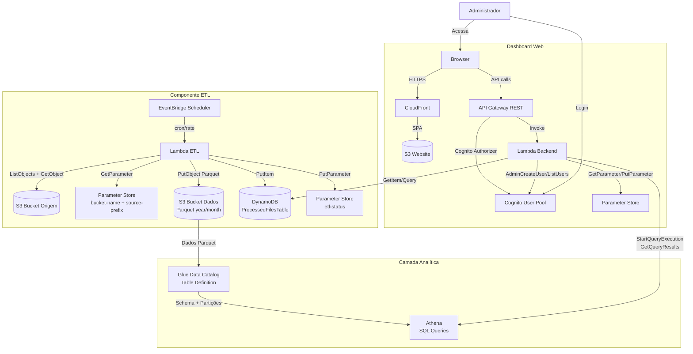
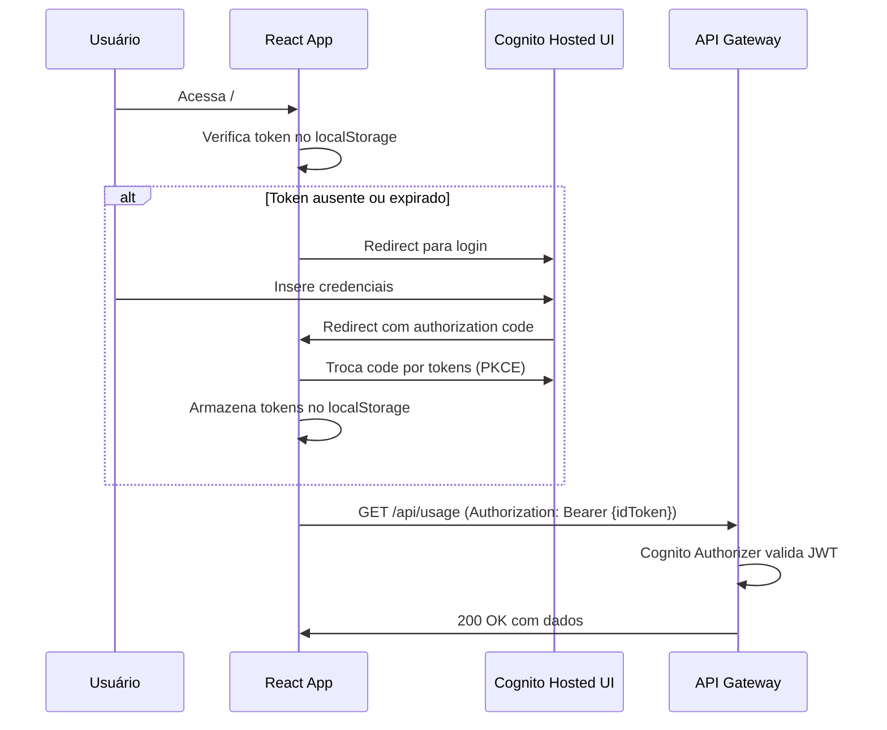
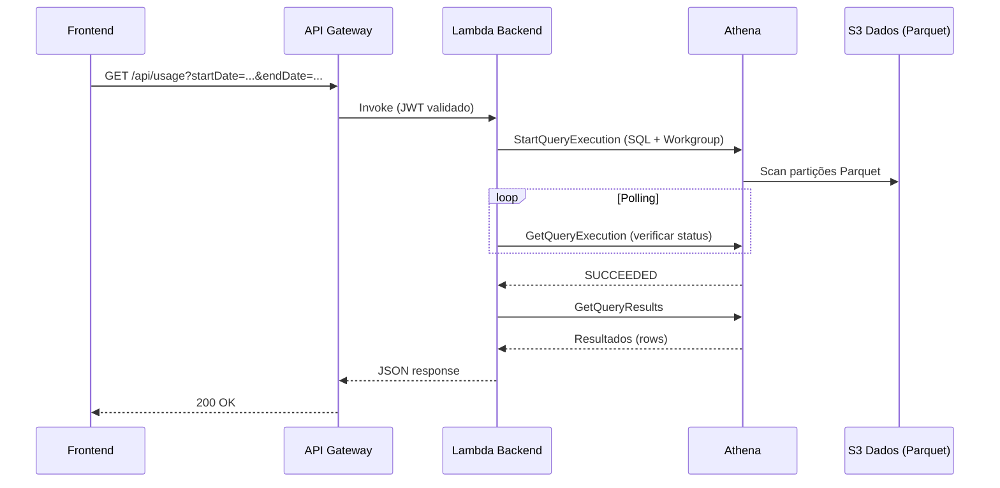

# Documento de Design — Kiro Cost Analyzer

## Visão Geral

O Kiro Cost Analyzer é uma aplicação serverless composta por dois componentes principais:

1. **Componente ETL**: Uma função Lambda acionada por EventBridge Scheduler que extrai CSVs do S3 de origem (apenas formato novo `user_report/`), normaliza os dados e grava como Parquet no S3 de dados (particionado por ano/mês). DynamoDB é usado apenas para dados operacionais (arquivos processados, status ETL). O formato legado (`by_user_analytic/`, era Q Developer) não é suportado.
2. **Dashboard Web**: Uma aplicação React com AWS Cloudscape servida como SPA (Single Page Application), com API Gateway + Lambda no backend para servir dados agregados via Athena, gerenciar usuários Cognito e configurações via Parameter Store.

A camada analítica usa S3 (Parquet) + Glue Data Catalog + Athena para consultas SQL eficientes sobre os dados de atividade, evitando carregar grandes volumes em memória no Lambda e delegando agregações para o motor SQL nativo do Athena. A autenticação é gerenciada pelo Amazon Cognito User Pool com um authorizer integrado ao API Gateway. Toda a infraestrutura é definida em um template AWS SAM.

### Decisões de Design

| Decisão | Escolha | Justificativa |
|---------|---------|---------------|
| API Type | REST API (`AWS::Serverless::Api`) | Suporte nativo a Cognito User Pool Authorizer no SAM |
| Datastore analítico | S3 (Parquet) + Glue Catalog + Athena | Agregações SQL nativas, sem carregar dados em memória no Lambda, custo ~$0.51/mês para 200 usuários + 10 admins |
| Datastore operacional | DynamoDB | Leitura rápida para dados operacionais (arquivos processados, status ETL) |
| Formato de dados | Apache Parquet (particionado por year/month) | Compressão eficiente, leitura colunar otimizada para Athena, particionamento reduz scan |
| Frontend hosting | S3 + CloudFront (ou build local) | SPA estática, sem necessidade de SSR |
| ETL trigger | EventBridge Scheduler (ScheduleV2) | Suporte nativo no SAM, cron/rate configurável |
| Auth | Cognito User Pool + JWT | Integração direta com API Gateway, gestão de usuários built-in |
| IaC | AWS SAM | Simplifica definição de Lambda, API Gateway, DynamoDB e eventos |
| CSV Parsing | Lógica interna para formato novo (user_report) | Formato único, sem necessidade de detecção complexa |
| ~~Detecção de formato~~ | *(Removido)* | Apenas formato novo suportado — legado Q Developer ignorado |
| Configuração de prefixo | Parameter Store (`source-prefix`) | Prefixo completo até `KiroLogs/` evita hardcode de accountId/region |

## Arquitetura



### Fluxo de Dados

1. **Ingestão**: EventBridge Scheduler → Lambda ETL → S3 Origem (navega `user_report/` sob o prefixo configurado, leitura CSVs) → Normalização → S3 Dados (escrita Parquet particionado por year/month) + DynamoDB (registro de arquivos processados). Formato legado (`by_user_analytic/`) é ignorado.
2. **Consulta**: Browser → API Gateway (JWT auth) → Lambda Backend → Athena (StartQueryExecution + GetQueryResults sobre S3/Parquet) → Response JSON
3. **Configuração**: Browser → API Gateway → Lambda Backend → Parameter Store (read/write)
4. **Gestão de Usuários**: Browser → API Gateway → Lambda Backend → Cognito (AdminCreateUser, AdminDisableUser, ListUsers)

## Estrutura do Bucket S3 de Origem (Referência)

O bucket S3 de origem (ex: `s3-logs-kiro-vinibat-serpro`) contém dois prefixos principais:

### Prefixo `activities/` — Dados de Atividade (CSVs)

Estrutura hierárquica sob `activities/AWSLogs/{accountId}/KiroLogs/`:

```
activities/AWSLogs/{accountId}/KiroLogs/
├── by_user_analytic/                          ← FORMATO LEGADO
│   └── {region}/
│       └── {year}/
│           └── {month}/
│               └── {day}/
│                   └── 00/
│                       └── {accountId}_by_user_analytic_{timestamp}_report.csv
├── user_report/                               ← FORMATO NOVO
│   └── {region}/
│       └── {year}/
│           └── {month}/
│               └── {day}/
│                   └── 00/
│                       └── {clientType}_{accountId}_user_report_{timestamp}.csv
├── {uuid-1}                                   ← UUIDs soltos (IGNORAR)
├── {uuid-2}
└── ...
```

**Formato Legado** (`by_user_analytic/`):
- Path: `by_user_analytic/{region}/{year}/{month}/{day}/00/{accountId}_by_user_analytic_{timestamp}_report.csv`
- Exemplo: `by_user_analytic/us-east-1/2026/01/28/00/673826570926_by_user_analytic_202601280000_report.csv`
- Nome do arquivo NÃO inclui client type

**Formato Novo** (`user_report/`):
- Path: `user_report/{region}/{year}/{month}/{day}/00/{clientType}_{accountId}_user_report_{timestamp}.csv`
- Exemplo: `user_report/us-east-1/2026/04/02/00/KIRO_IDE_673826570926_user_report_202604020000.csv`
- Nome do arquivo INCLUI o client type (KIRO_IDE, KIRO_CLI, etc.)
- Pode haver múltiplos arquivos por dia (um por client type)

**UUIDs soltos**: Existem diretórios com UUIDs diretamente sob `KiroLogs/` (ex: `2d5eb9bb-703f-40d6-b6d9-2df4b0eeff1d`). Estes são provavelmente sessões individuais e devem ser **ignorados** pelo ETL.

### Prefixo `prompts/` — Dados de Prompts/Queries (JSON.gz) — BACKLOG FUTURO

> ⚠️ **Documentado como referência para o Requisito 13 (backlog). NÃO será implementado na versão atual.**

Estrutura hierárquica sob `prompts/AWSLogs/{accountId}/KiroLogs/`:

```
prompts/AWSLogs/{accountId}/KiroLogs/
├── GenerateAssistantResponse/
│   └── {region}/
│       └── {year}/
│           └── {month}/
│               └── {day}/
│                   └── {hour}/
│                       ├── {accountId}_GenerateAssistantResponse_{timestamp}_{id}.json.gz
│                       ├── {accountId}_GenerateAssistantResponse_{timestamp}_{id}.json.gz
│                       └── ...
├── {uuid-1}                                   ← UUIDs soltos (IGNORAR)
└── ...
```

**Características**:
- Particionado até a **hora** (mais granular que activities)
- Arquivos são `.json.gz` (gzipped JSON)
- Volume alto: dezenas de arquivos por hora de uso ativo
- Cada arquivo contém dados de uma interação/prompt individual
- UUIDs soltos sob `KiroLogs/` devem ser ignorados (mesmo padrão de activities)

**Relevância futura**: Esses dados podem ser correlacionados com os dados de atividade para entender o que os usuários mais "caros" estão fazendo (ver Requisito 13).

---

## Componentes e Interfaces

### 1. Componente ETL (Lambda)

**Runtime**: Python 3.12 (ou Node.js 20 — a definir com o time)
**Trigger**: EventBridge Scheduler com expressão `rate(1 day)` (configurável)
**Timeout**: 5 minutos (ajustável conforme volume de dados)
**Memória**: 512 MB

#### Módulos Internos

```
etl/
├── handler.py              # Entry point Lambda
├── csv_parser.py           # Parser com detecção de formato
├── normalizer.py           # Normalização formato legado → comum
├── parquet_writer.py       # Escrita de dados em formato Parquet no S3
├── s3_reader.py            # Navegação na estrutura real do bucket e leitura de CSVs
├── path_resolver.py        # Resolução de paths e extração de metadados do path S3
├── processing_tracker.py   # Controle de arquivos já processados (DynamoDB)
└── config.py               # Leitura de Parameter Store (bucket, prefixo, etc.)
```

#### Fluxo de Execução do ETL

```mermaid
flowchart TD
    A[Início - EventBridge trigger] --> B[Ler configuração do Parameter Store<br/>bucket-name + source-prefix]
    B --> C[Construir prefixos de busca:<br/>1. {prefix}/by_user_analytic/<br/>2. {prefix}/user_report/]
    C --> D1[Listar CSVs em by_user_analytic/<br/>recursivamente]
    C --> D2[Listar CSVs em user_report/<br/>recursivamente]
    D1 --> E[Unir listas de CSVs encontrados<br/>Ignorar UUIDs soltos]
    D2 --> E
    E --> F[Filtrar arquivos já processados via DynamoDB]
    F --> G{Há arquivos novos?}
    G -->|Não| H[Registrar status: nenhum arquivo novo]
    G -->|Sim| I[Para cada arquivo CSV]
    I --> J[Detectar formato pelo path:<br/>by_user_analytic → Legado<br/>user_report → Novo]
    J --> K[Extrair metadados do path:<br/>accountId, region, year, month, day]
    K --> L{Formato válido?<br/>Confirmar via header}
    L -->|Não| M[Log erro com colunas esperadas vs encontradas]
    L -->|Sim| N[Fazer parsing do CSV]
    N --> O{Arquivo vazio ou só header?}
    O -->|Sim| P[Ignorar arquivo]
    O -->|Não| Q[Normalizar registros para estrutura comum]
    Q --> R[Acumular registros]
    M --> I
    P --> I
    R --> I
    I --> S[Gravar registros como Parquet no S3 Dados<br/>particionado por year/month]
    S --> T[Marcar arquivos como processados no DynamoDB]
    T --> U[Registrar status da execução no Parameter Store]
    H --> U
```

#### Navegação na Estrutura do Bucket de Origem

O módulo `s3_reader.py` navega a estrutura real do bucket usando o prefixo configurável:

```python
# Prefixo base configurado via Parameter Store
# Ex: "activities/AWSLogs/673826570926/KiroLogs/"
source_prefix = config.get_source_prefix()

# Dois sub-caminhos a percorrer
LEGACY_SUBPATH = "by_user_analytic/"
NEW_SUBPATH = "user_report/"

# Listar CSVs em ambos os caminhos
legacy_files = s3.list_objects(Prefix=f"{source_prefix}{LEGACY_SUBPATH}")
new_files = s3.list_objects(Prefix=f"{source_prefix}{NEW_SUBPATH}")
```

**Regras de navegação**:
1. Listar CSVs recursivamente em `{prefix}/by_user_analytic/` (formato legado)
2. Listar CSVs recursivamente em `{prefix}/user_report/` (formato novo)
3. Filtrar apenas arquivos com extensão `.csv`
4. Ignorar qualquer objeto fora desses dois sub-caminhos (UUIDs soltos, etc.)
5. Extrair metadados do path (accountId, region, year, month, day) para enriquecer os registros

#### Módulo `path_resolver.py` — Extração de Metadados do Path

O path S3 contém informações úteis que complementam os dados do CSV:

```python
# Formato Legado:
# by_user_analytic/{region}/{year}/{month}/{day}/00/{accountId}_by_user_analytic_{timestamp}_report.csv
# → Extrai: region, year, month, day, accountId

# Formato Novo:
# user_report/{region}/{year}/{month}/{day}/00/{clientType}_{accountId}_user_report_{timestamp}.csv
# → Extrai: region, year, month, day, clientType, accountId

def resolve_path_metadata(s3_key: str, source_prefix: str) -> dict:
    """
    Extrai metadados do path S3 do arquivo CSV.
    Retorna dict com: format_type, region, year, month, day, account_id, client_type (se novo)
    """
    relative_path = s3_key.removeprefix(source_prefix)
    
    if relative_path.startswith("by_user_analytic/"):
        # Formato Legado
        # by_user_analytic/{region}/{year}/{month}/{day}/00/{filename}
        parts = relative_path.split("/")
        return {
            "format_type": "legacy",
            "region": parts[1],
            "year": parts[2],
            "month": parts[3],
            "day": parts[4],
            "account_id": extract_account_from_filename(parts[6]),
        }
    elif relative_path.startswith("user_report/"):
        # Formato Novo
        # user_report/{region}/{year}/{month}/{day}/00/{clientType}_{accountId}_user_report_{timestamp}.csv
        parts = relative_path.split("/")
        filename = parts[6]
        client_type = filename.split("_")[0]  # Ex: "KIRO_IDE" — atenção: pode ter underscore
        return {
            "format_type": "new",
            "region": parts[1],
            "year": parts[2],
            "month": parts[3],
            "day": parts[4],
            "client_type": extract_client_type_from_filename(filename),
            "account_id": extract_account_from_filename(filename),
        }
    else:
        return None  # Path não reconhecido — ignorar
```

#### Detecção de Formato CSV

O formato é determinado por **duas camadas de detecção** (path + header):

**Camada 1 — Detecção pelo path S3** (primária):

| Sub-caminho no path | Formato |
|---------------------|---------|
| `by_user_analytic/` | Formato Legado |
| `user_report/` | Formato Novo |
| Outro | Ignorar arquivo |

**Camada 2 — Confirmação pelo header CSV** (validação):

| Coluna Discriminante | Formato |
|---------------------|---------|
| `Credits_Used` presente | Formato Novo |
| `Chat_MessagesSent` presente e `Credits_Used` ausente | Formato Legado |
| Nenhum dos dois | Formato Desconhecido → log de erro |

**Regra**: O path determina o formato esperado. O header confirma. Se houver divergência (ex: arquivo em `user_report/` mas sem `Credits_Used`), registrar log de warning e tentar processar pelo header.

#### Estrutura Comum Normalizada (após parsing)

```typescript
interface UserActivityRecord {
  userId: string;          // UserId do CSV
  date: string;            // Date no formato YYYY-MM-DD
  clientType: string;      // Client_Type (KIRO_IDE, KIRO_CLI, PLUGIN)
  subscriptionTier: string; // Subscription_Tier (PRO, PRO_PLUS, POWER)
  profileId: string;       // ProfileId
  totalMessages: number;   // Total_Messages (ou Chat_MessagesSent no legado)
  chatConversations: number; // Chat_Conversations (0 se ausente)
  creditsUsed: number;     // Credits_Used (0 se ausente no legado)
  overageEnabled: boolean; // Overage_Enabled (false se ausente)
  overageCap: number;      // Overage_Cap (0 se ausente)
  overageCreditsUsed: number; // Overage_Credits_Used (0 se ausente)
}
```

#### Mapeamento Formato Legado → Estrutura Comum

| Campo Comum | Fonte no Legado | Valor Padrão |
|-------------|----------------|--------------|
| totalMessages | Chat_MessagesSent | 0 |
| creditsUsed | (ausente) | 0 |
| chatConversations | (ausente) | 0 |
| overageEnabled | (ausente) | false |
| overageCap | (ausente) | 0 |
| overageCreditsUsed | (ausente) | 0 |
| clientType | Client_Type | "" |
| subscriptionTier | Subscription_Tier | "" |

### 2. Lambda Backend (API)

**Runtime**: Python 3.12 (ou Node.js 20)
**Timeout**: 30 segundos
**Memória**: 256 MB

#### Endpoints da API

| Método | Path | Descrição | Auth |
|--------|------|-----------|------|
| GET | `/api/usage` | Dados agregados de consumo por usuário (via Athena) | Cognito JWT |
| GET | `/api/usage/account` | Dados agregados de consumo total da conta (account-level) | Cognito JWT |
| GET | `/api/usage/export` | Exportar dados filtrados (CSV ou JSON) | Cognito JWT |
| GET | `/api/config` | Obter configuração atual (bucket, prefixo, status ETL) | Cognito JWT |
| PUT | `/api/config/bucket` | Atualizar bucket de origem e prefixo | Cognito JWT (Admin) |
| POST | `/api/etl/trigger` | Disparar execução manual do ETL | Cognito JWT (Admin) |
| GET | `/api/users` | Listar usuários do Cognito | Cognito JWT (Admin) |
| POST | `/api/users` | Criar novo usuário no Cognito | Cognito JWT (Admin) |
| DELETE | `/api/users/{userId}` | Desativar usuário no Cognito | Cognito JWT (Admin) |

#### Detalhes dos Endpoints

**GET /api/usage**

Executa uma query Athena (`StartQueryExecution` + `GetQueryResults`) sobre os dados Parquet no S3 para agregar consumo por usuário.

Query Parameters:
- `startDate` (opcional): Data inicial no formato YYYY-MM-DD
- `endDate` (opcional): Data final no formato YYYY-MM-DD
- `subscriptionTier` (opcional): Filtro por tier (PRO, PRO_PLUS, POWER)
- `clientType` (opcional): Filtro por tipo de cliente (KIRO_IDE, KIRO_CLI, PLUGIN)
- `overageOnly` (opcional): `true` para filtrar apenas usuários com overage > 0

Athena Query (exemplo):
```sql
SELECT
  userId,
  MAX(subscriptionTier) AS subscriptionTier,
  SUM(creditsUsed) AS totalCredits,
  SUM(overageCreditsUsed) AS overageCredits,
  SUM(totalMessages) AS totalMessages,
  SUM(chatConversations) AS totalConversations,
  SUM(creditsUsed) / COUNT(DISTINCT date) AS averageDailyCredits
FROM kiro_usage.activity
WHERE year >= '2026' AND month >= '04'
  AND date BETWEEN '2026-04-01' AND '2026-04-30'
GROUP BY userId
ORDER BY totalCredits DESC
```

Response:
```json
{
  "summary": {
    "totalUsers": 42,
    "totalCredits": 1523.45,
    "totalOverageCredits": 87.20,
    "averageCreditsPerUser": 36.27
  },
  "users": [
    {
      "userId": "53ecfaaa-80a1-7073-9432-e0d2acdbd172",
      "subscriptionTier": "PRO_PLUS",
      "totalCredits": 125.50,
      "overageCredits": 12.30,
      "totalMessages": 450,
      "totalConversations": 28,
      "averageDailyCredits": 4.18
    }
  ],
  "period": {
    "startDate": "2026-04-01",
    "endDate": "2026-04-30"
  }
}
```

**GET /api/usage/account**

Executa queries Athena para retornar dados agregados de consumo total da conta (account-level), incluindo evolução temporal e breakdowns por tier e tipo de cliente.

Query Parameters:
- `startDate` (opcional): Data inicial no formato YYYY-MM-DD
- `endDate` (opcional): Data final no formato YYYY-MM-DD
- `granularity` (opcional): Granularidade temporal — `day`, `week` ou `month` (padrão: `day`)

Response:
```json
{
  "totals": {
    "totalCredits": 15234.56,
    "totalOverageCredits": 872.10,
    "totalMessages": 45230,
    "totalConversations": 2810
  },
  "timeline": [
    {
      "period": "2026-04-01",
      "totalCredits": 512.30,
      "totalOverageCredits": 28.50,
      "totalMessages": 1520,
      "totalConversations": 95
    }
  ],
  "breakdownByTier": [
    {
      "subscriptionTier": "PRO_PLUS",
      "totalCredits": 8500.00,
      "totalOverageCredits": 600.00,
      "totalMessages": 25000
    },
    {
      "subscriptionTier": "PRO",
      "totalCredits": 5200.00,
      "totalOverageCredits": 200.00,
      "totalMessages": 15000
    }
  ],
  "breakdownByClientType": [
    {
      "clientType": "KIRO_IDE",
      "totalCredits": 12000.00,
      "totalOverageCredits": 750.00,
      "totalMessages": 38000
    },
    {
      "clientType": "KIRO_CLI",
      "totalCredits": 2500.00,
      "totalOverageCredits": 100.00,
      "totalMessages": 5000
    }
  ],
  "period": {
    "startDate": "2026-04-01",
    "endDate": "2026-04-30",
    "granularity": "day"
  }
}
```

Athena Queries (exemplos):

Totais da conta:
```sql
SELECT
  SUM(creditsUsed) AS totalCredits,
  SUM(overageCreditsUsed) AS totalOverageCredits,
  SUM(totalMessages) AS totalMessages,
  SUM(chatConversations) AS totalConversations
FROM kiro_usage.activity
WHERE date BETWEEN '2026-04-01' AND '2026-04-30'
```

Evolução temporal (granularidade dia):
```sql
SELECT
  date AS period,
  SUM(creditsUsed) AS totalCredits,
  SUM(overageCreditsUsed) AS totalOverageCredits,
  SUM(totalMessages) AS totalMessages,
  SUM(chatConversations) AS totalConversations
FROM kiro_usage.activity
WHERE date BETWEEN '2026-04-01' AND '2026-04-30'
GROUP BY date
ORDER BY date
```

Breakdown por tier:
```sql
SELECT
  subscriptionTier,
  SUM(creditsUsed) AS totalCredits,
  SUM(overageCreditsUsed) AS totalOverageCredits,
  SUM(totalMessages) AS totalMessages
FROM kiro_usage.activity
WHERE date BETWEEN '2026-04-01' AND '2026-04-30'
GROUP BY subscriptionTier
```

Breakdown por tipo de cliente:
```sql
SELECT
  clientType,
  SUM(creditsUsed) AS totalCredits,
  SUM(overageCreditsUsed) AS totalOverageCredits,
  SUM(totalMessages) AS totalMessages
FROM kiro_usage.activity
WHERE date BETWEEN '2026-04-01' AND '2026-04-30'
GROUP BY clientType
```

**GET /api/usage/export**

Query Parameters: mesmos de `/api/usage` + `format` (`csv` ou `json`)

Response CSV:
```
UserId,SubscriptionTier,TotalCredits,OverageCredits,TotalMessages,TotalConversations,AverageDailyCredits
53ecfaaa-...,PRO_PLUS,125.50,12.30,450,28,4.18
```

Response JSON: mesmo formato do campo `users` de `/api/usage`

**PUT /api/config/bucket**

Request Body:
```json
{
  "bucketName": "my-kiro-reports-bucket",
  "sourcePrefix": "activities/AWSLogs/673826570926/KiroLogs/"
}
```

Response:
```json
{
  "bucketName": "my-kiro-reports-bucket",
  "sourcePrefix": "activities/AWSLogs/673826570926/KiroLogs/",
  "status": "valid",
  "message": "Bucket acessível e configuração salva com sucesso"
}
```

**POST /api/users**

Request Body:
```json
{
  "email": "novo.usuario@empresa.com"
}
```

**POST /api/etl/trigger**

Response:
```json
{
  "status": "triggered",
  "executionId": "arn:aws:lambda:..."
}
```

### 3. Frontend React (Dashboard)

**Framework**: React 18+ com TypeScript
**Design System**: AWS Cloudscape Design System
**Build**: Vite
**Roteamento**: React Router v6

#### Estrutura de Páginas

```
src/
├── App.tsx                    # Router principal + AuthProvider
├── auth/
│   ├── AuthProvider.tsx       # Context de autenticação Cognito
│   ├── LoginPage.tsx          # Redirect para Cognito Hosted UI
│   └── useAuth.ts             # Hook de autenticação
├── pages/
│   ├── DashboardPage.tsx      # Tabela de consumo por usuário + resumo + filtros
│   ├── AccountUsagePage.tsx   # Consumo total da conta (account-level) + gráficos
│   ├── SettingsPage.tsx       # Configuração de bucket + prefixo + status ETL
│   └── UsersPage.tsx          # Gestão de usuários (admin only)
├── components/
│   ├── UsageTable.tsx         # Tabela Cloudscape com dados de consumo por usuário
│   ├── SummaryCards.tsx       # Cards de resumo geral
│   ├── AccountSummaryCards.tsx # Cards de resumo account-level (totais da conta)
│   ├── TimelineChart.tsx      # Gráfico de linha — evolução temporal do consumo da conta
│   ├── BreakdownCharts.tsx    # Gráficos de breakdown por tier e tipo de cliente
│   ├── DateRangeFilter.tsx    # Seletor de período
│   ├── GranularitySelector.tsx # Seletor de granularidade (dia/semana/mês)
│   ├── TierFilter.tsx         # Filtro por subscription tier
│   ├── ClientTypeFilter.tsx   # Filtro por tipo de cliente
│   ├── ExportButton.tsx       # Botão de exportação CSV/JSON
│   └── UserManagement.tsx     # Formulário de gestão de usuários
├── api/
│   └── client.ts              # Cliente HTTP com token JWT
└── types/
    └── index.ts               # Tipos TypeScript compartilhados
```

#### Componentes Cloudscape Utilizados

| Componente | Uso |
|-----------|-----|
| `AppLayout` | Layout principal com navegação lateral |
| `Table` | Tabela de consumo por usuário (sortable, filterable) |
| `Cards` | Resumo geral (total usuários, créditos, etc.) e resumo account-level |
| `DateRangePicker` | Seleção de período |
| `Select` | Filtros de tier, tipo de cliente e granularidade temporal |
| `Toggle` | Filtro de overage only |
| `Button` | Ações (exportar, trigger ETL, adicionar usuário) |
| `Form` / `FormField` | Formulários de configuração e gestão |
| `Input` | Campos de texto (bucket name, email) |
| `Alert` | Mensagens de erro e sucesso |
| `StatusIndicator` | Status do ETL (sucesso/falha) |
| `Header` | Cabeçalhos de seção |
| `SpaceBetween` | Layout de espaçamento |
| `SideNavigation` | Menu lateral (Dashboard, Consumo da Conta, Configurações, Usuários) |
| `LineChart` | Gráfico de evolução temporal do consumo da conta |
| `PieChart` / `BarChart` | Gráficos de breakdown por tier e tipo de cliente |

#### Fluxo de Autenticação



### 4. Template SAM

#### Recursos Definidos

```yaml
Resources:
  # --- Cognito ---
  CognitoUserPool:           # AWS::Cognito::UserPool
  CognitoUserPoolClient:     # AWS::Cognito::UserPoolClient (SPA, PKCE)
  CognitoUserPoolDomain:     # AWS::Cognito::UserPoolDomain
  AdminUserCreation:          # Custom Resource (Lambda) para criar admin user no deploy

  # --- S3 (Dados Parquet) ---
  DataBucket:                 # AWS::S3::Bucket (dados Parquet particionados)

  # --- Glue Data Catalog ---
  GlueDatabase:              # AWS::Glue::Database (kiro_usage)
  GlueActivityTable:         # AWS::Glue::Table (activity — schema Parquet, partições year/month)

  # --- Athena ---
  AthenaWorkgroup:           # AWS::Athena::WorkGroup (kiro-cost-analyzer, output no DataBucket)

  # --- DynamoDB (apenas operacional) ---
  ProcessedFilesTable:        # AWS::DynamoDB::Table (rastreamento de arquivos processados)

  # --- API Gateway ---
  ApiGateway:                 # AWS::Serverless::Api (com CognitoAuthorizer)

  # --- Lambda Functions ---
  BackendFunction:            # AWS::Serverless::Function (API handler — queries Athena)
  EtlFunction:                # AWS::Serverless::Function (ETL processor — output Parquet no S3)
  AdminUserCreatorFunction:   # AWS::Serverless::Function (Custom Resource)

  # --- EventBridge Scheduler ---
  # Definido como evento ScheduleV2 no EtlFunction

  # --- Parameter Store ---
  BucketNameParameter:        # AWS::SSM::Parameter (bucket de origem)
  SourcePrefixParameter:      # AWS::SSM::Parameter (prefixo base até KiroLogs/)
  EtlStatusParameter:         # AWS::SSM::Parameter (status última execução)

  # --- S3 (Website) ---
  WebsiteBucket:              # AWS::S3::Bucket (SPA hosting)
  CloudFrontDistribution:     # AWS::CloudFront::Distribution (opcional)
```

#### Parâmetros do Template

```yaml
Parameters:
  StackName:
    Type: String
    Description: Nome do stack CloudFormation
  SourceBucketName:
    Type: String
    Description: Nome do bucket S3 com os CSVs do Kiro
  SourcePrefix:
    Type: String
    Description: Prefixo base até KiroLogs/ (ex: activities/AWSLogs/673826570926/KiroLogs/)
    Default: ""
  AdminEmail:
    Type: String
    Description: Email do administrador inicial
  EtlScheduleExpression:
    Type: String
    Default: "rate(1 day)"
    Description: Expressão de agendamento do ETL
```

## Modelos de Dados

### S3 — Bucket de Dados (Parquet)

**Propósito**: Armazenar registros de atividade de usuário normalizados em formato Parquet, particionados por ano e mês.

**Estrutura de Particionamento**:
```
s3://kiro-cost-analyzer-data/
└── activity/
    └── year=2026/
        └── month=04/
            ├── part-00000.parquet
            └── part-00001.parquet
```

**Schema Parquet (colunas)**:

| Coluna | Tipo | Descrição |
|--------|------|-----------|
| `userId` | STRING | ID do usuário |
| `date` | STRING | Data no formato YYYY-MM-DD |
| `clientType` | STRING | Tipo de cliente (KIRO_IDE, KIRO_CLI, PLUGIN) |
| `subscriptionTier` | STRING | Tier do plano (PRO, PRO_PLUS, POWER) |
| `profileId` | STRING | Profile ARN |
| `totalMessages` | INT64 | Total de mensagens |
| `chatConversations` | INT64 | Total de conversas |
| `creditsUsed` | DOUBLE | Créditos consumidos |
| `overageEnabled` | BOOLEAN | Overage habilitado |
| `overageCap` | DOUBLE | Limite de overage |
| `overageCreditsUsed` | DOUBLE | Créditos de overage consumidos |

**Partição Key**: `year` (STRING), `month` (STRING) — derivados do campo `date`

### Glue Data Catalog — Tabela `activity`

**Propósito**: Definir o schema e partições da tabela de atividade para consultas Athena.

**Database**: `kiro_usage`
**Table**: `activity`
**Location**: `s3://kiro-cost-analyzer-data/activity/`
**Input Format**: Parquet (`org.apache.hadoop.hive.ql.io.parquet.MapredParquetInputFormat`)
**SerDe**: `org.apache.hadoop.hive.ql.io.parquet.serde.ParquetHiveSerDe`

**Partition Keys**: `year` (string), `month` (string)

### Athena — Workgroup e Queries

**Propósito**: Motor de consultas SQL serverless para executar agregações sobre os dados Parquet.

**Workgroup**: `kiro-cost-analyzer`
**Output Location**: `s3://kiro-cost-analyzer-data/athena-results/`

#### Padrões de Acesso (Athena SQL)

| Padrão | Query SQL |
|--------|-----------|
| Consumo de um usuário em um período | `SELECT ... FROM activity WHERE userId = ? AND date BETWEEN ? AND ? GROUP BY userId` |
| Todos os usuários em um período | `SELECT ... FROM activity WHERE date BETWEEN ? AND ? GROUP BY userId ORDER BY totalCredits DESC` |
| Filtrar por tier | `SELECT ... FROM activity WHERE subscriptionTier = ? AND date BETWEEN ? AND ? GROUP BY userId` |
| Consumo total da conta | `SELECT SUM(creditsUsed), SUM(overageCreditsUsed), SUM(totalMessages), SUM(chatConversations) FROM activity WHERE date BETWEEN ? AND ?` |
| Evolução temporal da conta | `SELECT date, SUM(creditsUsed), ... FROM activity WHERE date BETWEEN ? AND ? GROUP BY date ORDER BY date` |
| Breakdown por tier | `SELECT subscriptionTier, SUM(creditsUsed), ... FROM activity GROUP BY subscriptionTier` |
| Breakdown por tipo de cliente | `SELECT clientType, SUM(creditsUsed), ... FROM activity GROUP BY clientType` |

#### Fluxo de Consulta Athena no Backend Lambda



### DynamoDB — Tabela `ProcessedFilesTable`

**Propósito**: Rastrear quais arquivos CSV já foram processados pelo ETL.

| Atributo | Tipo | Papel |
|----------|------|-------|
| `PK` (fileKey) | String | Partition Key — S3 key do arquivo |
| `processedAt` | String | Timestamp ISO 8601 da última processamento |
| `recordCount` | Number | Quantidade de registros extraídos |
| `status` | String | `SUCCESS` ou `ERROR` |
| `errorMessage` | String | Mensagem de erro (se aplicável) |

### Parameter Store — Parâmetros

| Nome do Parâmetro | Tipo | Descrição |
|-------------------|------|-----------|
| `/kiro-cost-analyzer/bucket-name` | String | Nome do bucket S3 de origem |
| `/kiro-cost-analyzer/source-prefix` | String | Prefixo base até KiroLogs/ (ex: `activities/AWSLogs/673826570926/KiroLogs/`) |
| `/kiro-cost-analyzer/etl-status` | String | JSON com status da última execução ETL |

**Nota sobre `source-prefix`**: O ETL precisa saber o caminho completo até `KiroLogs/` para navegar os sub-caminhos `by_user_analytic/` e `user_report/`. Este prefixo inclui o accountId e é configurável via Parameter Store (ou via parâmetro do template SAM no deploy inicial). Exemplo: `activities/AWSLogs/673826570926/KiroLogs/`.

Formato do `etl-status`:
```json
{
  "lastExecution": "2026-04-02T03:00:00Z",
  "status": "SUCCESS",
  "filesProcessed": 3,
  "recordsWritten": 150,
  "errors": []
}
```


## Propriedades de Corretude (Correctness Properties)

*Uma propriedade é uma característica ou comportamento que deve ser verdadeiro em todas as execuções válidas de um sistema — essencialmente, uma declaração formal sobre o que o sistema deve fazer. Propriedades servem como ponte entre especificações legíveis por humanos e garantias de corretude verificáveis por máquina.*

### Property 1: Parsing e normalização de CSV preserva dados

*Para qualquer* CSV válido no Formato Novo ou Formato Legado, fazer parsing e normalizar o conteúdo deve produzir uma lista de `UserActivityRecord` onde cada registro contém todos os campos obrigatórios com valores corretos: no Formato Novo os valores são extraídos diretamente; no Formato Legado, `Chat_MessagesSent` mapeia para `totalMessages`, campos ausentes recebem valores padrão (0 para numéricos, string vazia para texto, false para booleanos), e a estrutura de saída é idêntica à do Formato Novo.

**Validates: Requirements 4.3, 4.4, 5.1, 5.2, 5.3, 5.4**

### Property 2: Identificação de arquivos novos

*Para qualquer* conjunto de chaves S3 (arquivos no bucket) e qualquer conjunto de chaves já processadas, a função de identificação de arquivos novos deve retornar exatamente o conjunto diferença (chaves no bucket que não estão no conjunto processado), sem omissões e sem inclusões indevidas.

**Validates: Requirements 4.2**

### Property 3: Combinação de arquivos part

*Para qualquer* conjunto de arquivos CSV particionados (part_1, part_2, ..., part_N), combinar os registros de todos os arquivos deve produzir uma lista cujo tamanho é igual à soma dos tamanhos individuais, e que contém exatamente todos os registros de cada parte, sem duplicação e sem perda.

**Validates: Requirements 4.7**

### Property 4: Particionamento Parquet por ano/mês

*Para qualquer* lista de registros de atividade com datas variadas, o particionamento deve agrupar os registros corretamente por ano e mês (derivados do campo `date`), e a união de todos os registros em todas as partições deve conter exatamente todos os registros originais sem perda ou duplicação.

**Validates: Requirements 6.1, 6.5**

### Property 5: Agregação de consumo por usuário

*Para qualquer* conjunto de registros de atividade de um mesmo `userId` (possivelmente com múltiplos `clientType` e múltiplas datas), a agregação (seja via Athena SQL ou lógica de aplicação) deve produzir: `totalCredits` igual à soma de todos os `creditsUsed`, `overageCredits` igual à soma de todos os `overageCreditsUsed`, `totalMessages` igual à soma de todos os `totalMessages`, `totalConversations` igual à soma de todos os `chatConversations`, e `averageDailyCredits` igual a `totalCredits` dividido pelo número de datas distintas.

**Validates: Requirements 7.1, 7.2, 7.3, 7.4**

### Property 6: Filtragem por intervalo de datas

*Para qualquer* conjunto de registros e qualquer intervalo de datas [startDate, endDate], a filtragem deve retornar exatamente os registros cujo campo `date` está dentro do intervalo (inclusivo em ambos os extremos). Nenhum registro fora do intervalo deve ser incluído, e nenhum registro dentro do intervalo deve ser omitido.

**Validates: Requirements 7.5**

### Property 7: Ordenação por créditos decrescente

*Para qualquer* lista de agregados de usuário, a ordenação por `totalCredits` decrescente deve produzir uma lista onde cada elemento tem `totalCredits` maior ou igual ao próximo elemento.

**Validates: Requirements 9.3**

### Property 8: Filtragem por overage

*Para qualquer* lista de agregados de usuário, filtrar por `overageCredits > 0` deve retornar apenas usuários cujo `overageCredits` é estritamente maior que zero, e todos os usuários com `overageCredits > 0` devem estar presentes no resultado.

**Validates: Requirements 9.7**

### Property 9: Cálculo do resumo geral

*Para qualquer* lista de agregados de usuário, o resumo deve conter: `totalUsers` igual ao número de elementos na lista, `totalCredits` igual à soma de `totalCredits` de todos os usuários, `totalOverageCredits` igual à soma de `overageCredits` de todos os usuários, e `averageCreditsPerUser` igual a `totalCredits / totalUsers` (ou 0 se a lista estiver vazia).

**Validates: Requirements 9.8**

### Property 10: Agregação de consumo total da conta (account-level)

*Para qualquer* conjunto de registros de atividade de múltiplos usuários, a agregação account-level deve produzir: `totalCredits` igual à soma de todos os `creditsUsed` de todos os usuários, `totalOverageCredits` igual à soma de todos os `overageCreditsUsed`, `totalMessages` igual à soma de todos os `totalMessages`, e `totalConversations` igual à soma de todos os `chatConversations`. Esses valores devem ser iguais à soma dos agregados individuais por usuário.

**Validates: Requirements 8.1, 8.2, 8.3, 8.4**

### Property 11: Breakdown por dimensão preserva totais

*Para qualquer* conjunto de registros de atividade, a soma dos `totalCredits` de todos os itens do breakdown por Subscription_Tier deve ser igual ao `totalCredits` da conta. A mesma propriedade deve valer para o breakdown por Tipo_Cliente. Nenhum registro deve ser omitido ou contado duas vezes nos breakdowns.

**Validates: Requirements 8.6, 8.7**

### Property 12: Evolução temporal preserva totais

*Para qualquer* conjunto de registros de atividade e qualquer granularidade (dia, semana, mês), a soma dos `totalCredits` de todos os períodos na timeline deve ser igual ao `totalCredits` total da conta no mesmo intervalo de datas.

**Validates: Requirements 8.5**

### Property 13: Round-trip CSV

*Para qualquer* lista de registros agregados válidos, serializar para CSV e fazer parsing do CSV resultante deve produzir uma lista de objetos equivalente à original (mesmos campos, mesmos valores, mesma ordem).

**Validates: Requirements 12.1, 12.3**

### Property 14: Round-trip JSON

*Para qualquer* lista de registros agregados válidos, serializar para JSON e fazer parsing do JSON resultante deve produzir uma lista de objetos equivalente à original (mesmos campos, mesmos valores, mesma ordem).

**Validates: Requirements 12.2, 12.4**

## Tratamento de Erros

### Componente ETL

| Cenário de Erro | Comportamento | Ação |
|-----------------|---------------|------|
| Bucket S3 Origem inacessível | ETL falha no início | Registrar erro no Parameter Store (`etl-status`), log CloudWatch |
| CSV com formato desconhecido | Pular arquivo | Log de erro com colunas esperadas vs encontradas, continuar com demais arquivos |
| CSV vazio ou só header | Ignorar silenciosamente | Nenhum log de erro, arquivo marcado como processado |
| Erro de parsing em linha específica | Pular linha | Log warning com número da linha e conteúdo, continuar parsing |
| Erro ao gravar Parquet no S3 Dados | Retry com backoff | Até 3 retries com exponential backoff, log de erro se falhar |
| Bucket S3 Dados inacessível | ETL falha na escrita | Registrar erro no Parameter Store, log CloudWatch |
| DynamoDB throttling (ProcessedFilesTable) | Retry com backoff | Usar exponential backoff nativo do SDK, até 3 retries |
| Parameter Store inacessível | ETL falha no início | Log de erro, Lambda retorna erro |
| Timeout da Lambda | Execução interrompida | Arquivos parcialmente processados serão reprocessados na próxima execução (idempotente via sobrescrita de partição) |

### API Backend

| Cenário de Erro | HTTP Status | Response |
|-----------------|-------------|----------|
| Token JWT inválido/expirado | 401 | `{"error": "Unauthorized", "message": "Token inválido ou expirado"}` |
| Usuário não é admin (endpoints admin) | 403 | `{"error": "Forbidden", "message": "Acesso restrito a administradores"}` |
| Bucket não existe ou inacessível | 400 | `{"error": "InvalidBucket", "message": "Bucket 'X' não encontrado ou sem permissão de acesso"}` |
| Parâmetros de query inválidos | 400 | `{"error": "InvalidParameters", "message": "Formato de data inválido. Use YYYY-MM-DD"}` |
| Admin tenta remover a si mesmo | 400 | `{"error": "SelfRemoval", "message": "Não é possível remover o próprio usuário administrador"}` |
| Email duplicado ao criar usuário | 409 | `{"error": "UserExists", "message": "Já existe um usuário com este email"}` |
| Athena query falha | 500 | `{"error": "QueryError", "message": "Erro ao executar consulta analítica. Tente novamente."}` |
| Athena query timeout | 504 | `{"error": "QueryTimeout", "message": "Consulta excedeu o tempo limite. Tente com um período menor."}` |
| Cognito API falha | 500 | `{"error": "InternalError", "message": "Erro ao gerenciar usuários. Tente novamente."}` |

### Frontend

| Cenário de Erro | Comportamento |
|-----------------|---------------|
| Token expirado durante uso | Redirect automático para Cognito para refresh/re-login |
| API retorna 401 | Limpar tokens locais, redirect para login |
| API retorna 4xx | Exibir `Alert` Cloudscape com mensagem de erro da API |
| API retorna 5xx | Exibir `Alert` Cloudscape com mensagem genérica + botão "Tentar novamente" |
| Rede indisponível | Exibir `Alert` Cloudscape indicando problema de conexão |
| Dados vazios (nenhum registro) | Exibir estado vazio com mensagem orientativa ("Nenhum dado encontrado para o período selecionado") |

## Estratégia de Testes

### Abordagem Dual: Testes Unitários + Testes de Propriedade

A estratégia de testes combina testes unitários (exemplos específicos e edge cases) com testes de propriedade (verificação universal via inputs gerados aleatoriamente).

### Testes de Propriedade (Property-Based Testing)

**Biblioteca**: `fast-check` (TypeScript/JavaScript) ou `hypothesis` (Python) — conforme runtime escolhido
**Configuração**: Mínimo de 100 iterações por propriedade
**Tag**: Cada teste deve referenciar a propriedade do design com o formato:
`Feature: kiro-cost-analyzer, Property {N}: {título}`

| Property | Módulo Testado | Gerador Necessário |
|----------|---------------|-------------------|
| P1: Parsing e normalização | `csv_parser`, `normalizer` | CSV strings válidas (novo e legado) |
| P2: Identificação de arquivos novos | `processing_tracker` | Conjuntos de strings (S3 keys) |
| P3: Combinação de parts | `csv_parser` | Listas de listas de registros |
| P4: Particionamento Parquet | `parquet_writer` | Listas de registros com datas variadas |
| P5: Agregação de consumo | `aggregator` (backend) | Listas de `UserActivityRecord` |
| P6: Filtragem por datas | `aggregator` (backend) | Registros com datas aleatórias + range |
| P7: Ordenação decrescente | `aggregator` (backend) | Listas de agregados com créditos aleatórios |
| P8: Filtragem por overage | `aggregator` (backend) | Listas de agregados com overage aleatório |
| P9: Cálculo do resumo | `aggregator` (backend) | Listas de agregados |
| P10: Agregação account-level | `account_aggregator` (backend) | Listas de registros de múltiplos usuários |
| P11: Breakdown preserva totais | `account_aggregator` (backend) | Listas de registros com tiers e client types variados |
| P12: Timeline preserva totais | `account_aggregator` (backend) | Listas de registros com datas variadas + granularidade |
| P13: Round-trip CSV | `exporter` (backend) | Listas de agregados válidos |
| P14: Round-trip JSON | `exporter` (backend) | Listas de agregados válidos |

### Testes Unitários (Example-Based)

| Área | Exemplos de Teste |
|------|-------------------|
| CSV Parser | Arquivo com 1 linha, arquivo com caracteres especiais, arquivo com campos entre aspas |
| Normalizer | Registro legado com todos os campos, registro legado com campos ausentes |
| Parquet Writer | Escrita de registros com datas de partições diferentes, sobrescrita de partição existente |
| Aggregator | Usuário com 1 registro, usuário com registros de múltiplos client types |
| Account Aggregator | Conta com 1 usuário, conta com múltiplos usuários e tiers, breakdown por tier e client type |
| API endpoints | Cada endpoint com request válido, request com parâmetros inválidos |
| Auth | Request sem token, request com token expirado, request de não-admin em rota admin |
| UI Components | Renderização da tabela com dados, estado vazio, filtros aplicados, gráficos account-level |

### Testes de Integração

| Área | Escopo |
|------|--------|
| ETL end-to-end | S3 Origem → Parser → Parquet no S3 Dados (com mocks ou LocalStack) |
| API end-to-end | Request HTTP → Lambda → Athena (mock) → Response |
| Account-level API | Request HTTP → Lambda → Athena (mock) → Response com totais, timeline e breakdowns |
| Auth flow | Cognito token → API Gateway authorizer → Lambda |
| Deploy | `sam deploy` em ambiente de teste, verificar recursos criados |

### Testes de Smoke

| Área | Verificação |
|------|-------------|
| SAM Template | Template contém todos os recursos esperados (`sam validate`) — inclui DataBucket, GlueDatabase, GlueActivityTable, AthenaWorkgroup |
| DynamoDB Schema | ProcessedFilesTable tem keys corretos |
| Glue Catalog | Database e tabela existem com schema correto |
| Athena Workgroup | Workgroup existe com output location correto |
| S3 Data Bucket | Bucket de dados existe e é acessível |
| Parameter Store | Parâmetros iniciais existem após deploy |
| EventBridge Schedule | Schedule existe com expressão correta |
