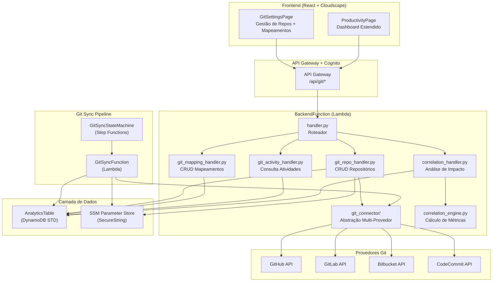
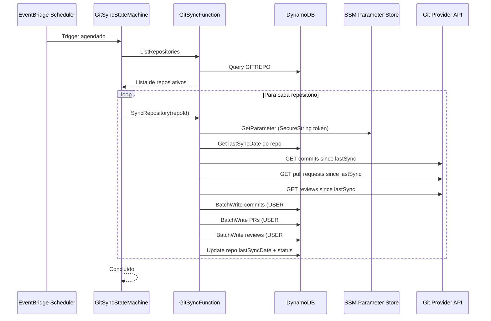

# Design Técnico — Análise de Produtividade com Git

## Visão Geral

Esta feature estende o Kiro Cost Analyzer para integrar dados de repositórios Git (GitHub, GitLab, Bitbucket, CodeCommit) com os dados de uso do Kiro já existentes. O objetivo é permitir que gestores correlacionem o uso do Kiro com entregas reais dos desenvolvedores (commits, PRs, reviews), gerando um Índice de Impacto que quantifica essa relação.

A solução segue a arquitetura serverless existente, adicionando:
- Novos endpoints REST no `BackendFunction` existente
- Uma Lambda dedicada para sincronização Git (`GitSyncFunction`) orquestrada por Step Functions
- Novos padrões de chave no DynamoDB Single-Table Design
- Novos parâmetros SSM para tokens Git (SecureString com KMS)
- Novas páginas e componentes no frontend com Cloudscape Design System

### Decisões Arquiteturais

1. **Lambda única para sync Git**: Uma Lambda dedicada (`GitSyncFunction`) em vez de reutilizar o ETL existente, pois o ciclo de vida e as dependências (requests HTTP para APIs Git) são distintos do pipeline CSV/S3.
2. **Abstração multi-provedor via Strategy Pattern**: Um `GitConnector` base com implementações por provedor (GitHub, GitLab, Bitbucket, CodeCommit), permitindo extensão futura sem alterar a lógica de sincronização.
3. **Tokens no SSM SecureString**: Tokens de acesso Git armazenados no SSM Parameter Store com tipo `SecureString` e criptografia KMS, com apenas a referência SSM no DynamoDB.
4. **Correlation Engine como módulo puro**: O cálculo de correlação é implementado como funções puras (sem I/O) no backend, facilitando testes property-based.
5. **Reutilização do BackendFunction**: Os novos endpoints Git são adicionados ao roteador existente (`handler.py`), mantendo a arquitetura de Lambda única para a API.

## Arquitetura

### Diagrama de Componentes



### Fluxo de Dados da Sincronização



## Componentes e Interfaces

### API Endpoints

Todos os novos endpoints seguem o padrão existente no `handler.py`, com autenticação Cognito e verificação de grupo Admins para operações de escrita.

#### Repositórios Git

| Método | Path | Acesso | Descrição |
|--------|------|--------|-----------|
| `POST` | `/api/git/repos` | Admin | Criar repositório configurado |
| `GET` | `/api/git/repos` | Admin | Listar repositórios configurados |
| `DELETE` | `/api/git/repos/{repoId}` | Admin | Remover repositório e token SSM |
| `POST` | `/api/git/repos/{repoId}/sync` | Admin | Sincronização manual |

**POST /api/git/repos — Request:**
```json
{
  "name": "meu-repo",
  "url": "https://github.com/org/repo",
  "provider": "github",
  "accessToken": "ghp_xxxxxxxxxxxx"
}
```

**POST /api/git/repos — Response (201):**
```json
{
  "repoId": "a1b2c3d4",
  "name": "meu-repo",
  "url": "https://github.com/org/repo",
  "provider": "github",
  "tokenConfigured": true,
  "status": "ACTIVE",
  "createdAt": "2025-01-15T10:30:00Z"
}
```

**GET /api/git/repos — Response (200):**
```json
{
  "repositories": [
    {
      "repoId": "a1b2c3d4",
      "name": "meu-repo",
      "url": "https://github.com/org/repo",
      "provider": "github",
      "tokenConfigured": true,
      "status": "SYNC_OK",
      "lastSyncAt": "2025-01-15T23:59:00Z",
      "createdAt": "2025-01-15T10:30:00Z"
    }
  ]
}
```

**POST /api/git/repos/{repoId}/sync — Response (200):**
```json
{
  "status": "started",
  "message": "Sincronização iniciada para o repositório a1b2c3d4"
}
```

**Erros:**
- `400`: URL inválida, provedor não suportado, campos obrigatórios ausentes
- `404`: Repositório não encontrado (DELETE, sync)
- `422`: Falha de conectividade/autenticação com o Git Provider
- `429`: Rate limit de sincronização manual (máx 1 a cada 5 min por repo)

#### Mapeamentos de Usuários

| Método | Path | Acesso | Descrição |
|--------|------|--------|-----------|
| `POST` | `/api/git/mappings` | Admin | Criar mapeamento Kiro-Git |
| `GET` | `/api/git/mappings/{userId}` | Admin | Listar mapeamentos de um usuário |
| `DELETE` | `/api/git/mappings/{userId}/{provider}/{gitUsername}` | Admin | Remover mapeamento |

**POST /api/git/mappings — Request:**
```json
{
  "userId": "user-kiro-123",
  "provider": "github",
  "gitUsername": "dev-john"
}
```

**POST /api/git/mappings — Response (201):**
```json
{
  "userId": "user-kiro-123",
  "provider": "github",
  "gitUsername": "dev-john",
  "createdAt": "2025-01-15T10:30:00Z"
}
```

#### Atividades Git

| Método | Path | Acesso | Descrição |
|--------|------|--------|-----------|
| `GET` | `/api/git/activity/{userId}` | Autenticado | Atividades Git do usuário |

**GET /api/git/activity/{userId}?startDate=2025-01-01&endDate=2025-01-31 — Response (200):**
```json
{
  "userId": "user-kiro-123",
  "summary": {
    "totalCommits": 45,
    "totalPRsOpened": 12,
    "totalPRsMerged": 10,
    "totalReviews": 18,
    "avgLinesPerCommit": 87.5,
    "avgMergeTimeHours": 4.2
  },
  "timeline": [
    { "date": "2025-01-15", "commits": 3, "prsOpened": 1, "prsMerged": 0, "reviews": 2 }
  ],
  "recentPRs": [
    {
      "prId": "pr-123",
      "title": "feat: add user auth",
      "repository": "org/repo",
      "state": "merged",
      "createdAt": "2025-01-14T09:00:00Z",
      "mergedAt": "2025-01-14T15:30:00Z",
      "commitsCount": 3,
      "reviewsCount": 2
    }
  ],
  "period": { "startDate": "2025-01-01", "endDate": "2025-01-31" },
  "hasMapping": true
}
```

#### Análise de Correlação

| Método | Path | Acesso | Descrição |
|--------|------|--------|-----------|
| `GET` | `/api/git/correlation/{userId}` | Autenticado | Análise de impacto Kiro-Git |

**GET /api/git/correlation/{userId}?startDate=2025-01-01&endDate=2025-01-31 — Response (200):**
```json
{
  "userId": "user-kiro-123",
  "impactIndex": 72,
  "impactLevel": "Alto",
  "metrics": {
    "promptsPerCommit": 8.5,
    "mergeRate": 83.3,
    "avgReviewTimeHours": 3.8,
    "relativeProductivity": 1.35
  },
  "comparativeTimeline": [
    {
      "date": "2025-01-15",
      "kiroPrompts": 25,
      "gitCommits": 3,
      "gitPRs": 1,
      "dailyImpactIndex": 68
    }
  ],
  "period": { "startDate": "2025-01-01", "endDate": "2025-01-31" },
  "sufficientData": true,
  "message": null
}
```

Quando dados insuficientes (`sufficientData: false`):
```json
{
  "userId": "user-kiro-123",
  "impactIndex": null,
  "impactLevel": null,
  "metrics": null,
  "comparativeTimeline": [],
  "period": { "startDate": "2025-01-01", "endDate": "2025-01-31" },
  "sufficientData": false,
  "message": "Dados insuficientes para correlação. São necessários pelo menos 3 dias com atividade em ambas as plataformas."
}
```

### Git Connector — Abstração Multi-Provedor

```python
# backend/git_connector/base.py
class GitConnector(ABC):
    """Interface base para conectores Git."""

    @abstractmethod
    def validate_connection(self) -> bool:
        """Valida conectividade e autenticação com o provedor."""

    @abstractmethod
    def get_commits(self, repo_url: str, since: str) -> list[dict]:
        """Retorna commits desde a data informada."""

    @abstractmethod
    def get_pull_requests(self, repo_url: str, since: str) -> list[dict]:
        """Retorna PRs desde a data informada."""

    @abstractmethod
    def get_reviews(self, repo_url: str, pr_id: str) -> list[dict]:
        """Retorna reviews de uma PR."""
```

Implementações concretas:
- `GitHubConnector` — usa GitHub REST API v3 (`api.github.com`)
- `GitLabConnector` — usa GitLab REST API v4 (`gitlab.com/api/v4`)
- `BitbucketConnector` — usa Bitbucket REST API 2.0 (`api.bitbucket.org/2.0`)
- `CodeCommitConnector` — usa boto3 `codecommit` client

Factory:
```python
# backend/git_connector/factory.py
PROVIDERS = {
    "github": GitHubConnector,
    "gitlab": GitLabConnector,
    "bitbucket": BitbucketConnector,
    "codecommit": CodeCommitConnector,
}

def create_connector(provider: str, access_token: str) -> GitConnector:
    cls = PROVIDERS.get(provider)
    if not cls:
        raise ValueError(f"Provedor não suportado: {provider}")
    return cls(access_token=access_token)
```

### Correlation Engine — Algoritmo de Cálculo

O `CorrelationEngine` é um módulo de funções puras que calcula métricas de correlação entre dados Kiro e Git.

```python
# backend/correlation_engine.py

def compute_impact_index(
    kiro_daily: list[dict],  # [{"date": "2025-01-15", "prompts": 25, "interactions": 40}]
    git_daily: list[dict],   # [{"date": "2025-01-15", "commits": 3, "prs": 1, "reviews": 2}]
) -> dict:
    """Calcula o Índice de Impacto e métricas de correlação.
    
    Algoritmo:
    1. Alinhar timelines por data (inner join)
    2. Calcular coeficiente de correlação de Pearson entre prompts Kiro e atividades Git
    3. Normalizar para escala 0-100
    4. Calcular métricas derivadas (prompts/commit, merge rate, etc.)
    
    Retorna None se menos de 3 dias com atividade em ambas as plataformas.
    """
```

**Fórmula do Índice de Impacto:**
1. Calcular correlação de Pearson entre `kiro_prompts_diarios` e `git_activities_diarias` (commits + PRs)
2. Normalizar: `impact_index = round((pearson_r + 1) / 2 * 100)` (mapeia [-1,1] para [0,100])
3. Classificar: Baixo (0-25), Moderado (26-50), Alto (51-75), Muito Alto (76-100)

**Métricas derivadas:**
- `prompts_per_commit`: total_prompts / total_commits
- `merge_rate`: (prs_merged / prs_opened) * 100
- `avg_review_time_hours`: média de (first_review_date - pr_created_date) em horas
- `relative_productivity`: média de git_activities nos dias com uso Kiro acima da mediana / média nos dias abaixo

**Requisito de dados mínimos:** pelo menos 3 dias com atividade em ambas as plataformas (Kiro e Git).


## Modelos de Dados

### DynamoDB — Novos Padrões de Chave (Single-Table Design)

Todos os novos registros são armazenados na `AnalyticsTable` existente, seguindo o padrão Single-Table Design.

| Entidade | PK | SK | Atributos |
|----------|----|----|-----------|
| Repositório configurado | `GITREPO#{repoId}` | `CONFIG` | name, url, provider, ssmTokenPath, status, lastSyncAt, createdAt, createdBy |
| Mapeamento usuário-Git | `USER#{userId}` | `GITMAP#{provider}#{gitUsername}` | provider, gitUsername, gitEmail, createdAt, createdBy |
| Commit Git | `USER#{userId}` | `GITCOMMIT#{date}#{commitHash}` | repoId, repository, message, filesChanged, linesAdded, linesRemoved, authorDate |
| Pull Request Git | `USER#{userId}` | `GITPR#{date}#{prId}` | repoId, repository, title, state, createdAt, mergedAt, commitsCount, reviewsCount |
| Review Git | `USER#{userId}` | `GITREVIEW#{date}#{reviewId}` | repoId, repository, prId, reviewType, createdAt |
| Stats de sync do repo | `GITREPO#{repoId}` | `SYNC#{date}` | commitsCount, prsCount, reviewsCount, duration, status |

### Exemplo de Itens DynamoDB

**Repositório Configurado:**
```json
{
  "PK": "GITREPO#a1b2c3d4",
  "SK": "CONFIG",
  "name": "meu-repo",
  "url": "https://github.com/org/repo",
  "provider": "github",
  "ssmTokenPath": "/kiro-cost-analyzer/git-tokens/a1b2c3d4",
  "status": "SYNC_OK",
  "lastSyncAt": "2025-01-15T23:59:00Z",
  "createdAt": "2025-01-15T10:30:00Z",
  "createdBy": "admin-user-id"
}
```

**Mapeamento Usuário-Git:**
```json
{
  "PK": "USER#user-kiro-123",
  "SK": "GITMAP#github#dev-john",
  "provider": "github",
  "gitUsername": "dev-john",
  "gitEmail": "john@example.com",
  "createdAt": "2025-01-15T10:30:00Z",
  "createdBy": "admin-user-id"
}
```

**Commit Git:**
```json
{
  "PK": "USER#user-kiro-123",
  "SK": "GITCOMMIT#2025-01-15#abc123def",
  "repoId": "a1b2c3d4",
  "repository": "org/repo",
  "message": "feat: add user authentication",
  "filesChanged": 5,
  "linesAdded": 120,
  "linesRemoved": 30,
  "authorDate": "2025-01-15T14:30:00Z"
}
```

**Pull Request Git:**
```json
{
  "PK": "USER#user-kiro-123",
  "SK": "GITPR#2025-01-14#pr-456",
  "repoId": "a1b2c3d4",
  "repository": "org/repo",
  "title": "feat: add user auth",
  "state": "merged",
  "createdAt": "2025-01-14T09:00:00Z",
  "mergedAt": "2025-01-14T15:30:00Z",
  "commitsCount": 3,
  "reviewsCount": 2
}
```

### SSM Parameter Store — Novos Parâmetros

| Caminho | Tipo | Descrição |
|---------|------|-----------|
| `/kiro-cost-analyzer/git-tokens/{repoId}` | `SecureString` | Access Token do repositório Git (criptografado com KMS) |

### Interfaces TypeScript (Frontend)

```typescript
// Novos tipos em frontend/src/types/index.ts

interface GitRepository {
  repoId: string;
  name: string;
  url: string;
  provider: 'github' | 'gitlab' | 'bitbucket' | 'codecommit';
  tokenConfigured: boolean;
  status: 'ACTIVE' | 'SYNC_OK' | 'SYNC_ERROR' | 'SYNCING';
  lastSyncAt: string | null;
  createdAt: string;
}

interface GitUserMapping {
  userId: string;
  provider: string;
  gitUsername: string;
  gitEmail?: string;
  createdAt: string;
}

interface GitActivitySummary {
  totalCommits: number;
  totalPRsOpened: number;
  totalPRsMerged: number;
  totalReviews: number;
  avgLinesPerCommit: number;
  avgMergeTimeHours: number;
}

interface GitTimelineEntry {
  date: string;
  commits: number;
  prsOpened: number;
  prsMerged: number;
  reviews: number;
}

interface GitPullRequest {
  prId: string;
  title: string;
  repository: string;
  state: 'open' | 'merged' | 'closed';
  createdAt: string;
  mergedAt: string | null;
  commitsCount: number;
  reviewsCount: number;
}

interface GitActivityResponse {
  userId: string;
  summary: GitActivitySummary;
  timeline: GitTimelineEntry[];
  recentPRs: GitPullRequest[];
  period: { startDate?: string; endDate?: string };
  hasMapping: boolean;
}

interface CorrelationMetrics {
  promptsPerCommit: number;
  mergeRate: number;
  avgReviewTimeHours: number;
  relativeProductivity: number;
}

interface ComparativeTimelineEntry {
  date: string;
  kiroPrompts: number;
  gitCommits: number;
  gitPRs: number;
  dailyImpactIndex: number;
}

interface CorrelationResponse {
  userId: string;
  impactIndex: number | null;
  impactLevel: 'Baixo' | 'Moderado' | 'Alto' | 'Muito Alto' | null;
  metrics: CorrelationMetrics | null;
  comparativeTimeline: ComparativeTimelineEntry[];
  period: { startDate?: string; endDate?: string };
  sufficientData: boolean;
  message: string | null;
}
```

### Infraestrutura — Novos Recursos SAM

#### GitSyncFunction (Lambda)

```yaml
GitSyncFunction:
  Type: AWS::Serverless::Function
  Properties:
    FunctionName: !Sub "${StackName}-git-sync"
    Handler: git_sync_handler.lambda_handler
    CodeUri: etl/
    Description: Git Sync — sincroniza atividades Git dos repositórios configurados
    MemorySize: 512
    Timeout: 300
    Layers:
      - !Ref RequestsLayer  # Layer com biblioteca requests para HTTP
    Environment:
      Variables:
        ANALYTICS_TABLE: !Ref AnalyticsTable
    Policies:
      - Statement:
          - Sid: AnalyticsTableAccess
            Effect: Allow
            Action:
              - dynamodb:Query
              - dynamodb:PutItem
              - dynamodb:UpdateItem
              - dynamodb:BatchWriteItem
            Resource:
              - !GetAtt AnalyticsTable.Arn
          - Sid: SSMReadTokens
            Effect: Allow
            Action:
              - ssm:GetParameter
            Resource:
              - !Sub "arn:aws:ssm:${AWS::Region}:${AWS::AccountId}:parameter/kiro-cost-analyzer/git-tokens/*"
          - Sid: KMSDecryptTokens
            Effect: Allow
            Action:
              - kms:Decrypt
            Resource: "*"
          - Sid: CodeCommitAccess
            Effect: Allow
            Action:
              - codecommit:GetRepository
              - codecommit:GetBranch
              - codecommit:GetCommit
              - codecommit:ListPullRequests
              - codecommit:GetPullRequest
              - codecommit:GetCommentsForPullRequest
            Resource: "*"
```

#### GitSyncStateMachine (Step Functions)

```yaml
GitSyncStateMachine:
  Type: AWS::Serverless::StateMachine
  Properties:
    Name: !Sub "${StackName}-git-sync-state-machine"
    Type: STANDARD
    Events:
      GitSyncSchedule:
        Type: ScheduleV2
        Properties:
          ScheduleExpression: "cron(30 0 * * ? *)"  # 00:30 UTC diariamente
          Description: Sincronização diária de atividades Git
    Definition:
      StartAt: ListRepositories
      States:
        ListRepositories:
          Type: Task
          Resource: !GetAtt GitSyncFunction.Arn
          Parameters:
            action: "list_repos"
          ResultPath: "$.repos"
          Next: CheckRepos
        CheckRepos:
          Type: Choice
          Choices:
            - Variable: "$.repos.count"
              NumericGreaterThan: 0
              Next: SyncRepositories
          Default: Done
        SyncRepositories:
          Type: Map
          ItemsPath: "$.repos.items"
          MaxConcurrency: 5
          ItemProcessor:
            StartAt: SyncOneRepo
            States:
              SyncOneRepo:
                Type: Task
                Resource: !GetAtt GitSyncFunction.Arn
                Parameters:
                  action: "sync_repo"
                  repoId.$: "$.repoId"
                End: true
                Retry:
                  - ErrorEquals: ["RateLimitError"]
                    IntervalSeconds: 60
                    MaxAttempts: 3
                    BackoffRate: 2.0
                Catch:
                  - ErrorEquals: ["States.ALL"]
                    ResultPath: "$.error"
                    Next: MarkSyncError
              MarkSyncError:
                Type: Pass
                End: true
          Next: Done
        Done:
          Type: Pass
          End: true
```

#### Novos Eventos no BackendFunction

Adicionar ao `BackendFunction.Events`:

```yaml
GitReposPost:
  Type: Api
  Properties:
    RestApiId: !Ref ApiGateway
    Path: /api/git/repos
    Method: POST
GitReposGet:
  Type: Api
  Properties:
    RestApiId: !Ref ApiGateway
    Path: /api/git/repos
    Method: GET
GitReposDelete:
  Type: Api
  Properties:
    RestApiId: !Ref ApiGateway
    Path: /api/git/repos/{repoId}
    Method: DELETE
GitRepoSync:
  Type: Api
  Properties:
    RestApiId: !Ref ApiGateway
    Path: /api/git/repos/{repoId}/sync
    Method: POST
GitMappingsPost:
  Type: Api
  Properties:
    RestApiId: !Ref ApiGateway
    Path: /api/git/mappings
    Method: POST
GitMappingsGet:
  Type: Api
  Properties:
    RestApiId: !Ref ApiGateway
    Path: /api/git/mappings/{userId}
    Method: GET
GitMappingsDelete:
  Type: Api
  Properties:
    RestApiId: !Ref ApiGateway
    Path: /api/git/mappings/{userId}/{provider}/{gitUsername}
    Method: DELETE
GitActivityGet:
  Type: Api
  Properties:
    RestApiId: !Ref ApiGateway
    Path: /api/git/activity/{userId}
    Method: GET
GitCorrelationGet:
  Type: Api
  Properties:
    RestApiId: !Ref ApiGateway
    Path: /api/git/correlation/{userId}
    Method: GET
```

#### Novas IAM Policies no BackendFunction

Adicionar ao `BackendFunction.Policies`:

```yaml
- Sid: SSMGitTokensAccess
  Effect: Allow
  Action:
    - ssm:GetParameter
    - ssm:PutParameter
    - ssm:DeleteParameter
  Resource:
    - !Sub "arn:aws:ssm:${AWS::Region}:${AWS::AccountId}:parameter/kiro-cost-analyzer/git-tokens/*"
- Sid: KMSForGitTokens
  Effect: Allow
  Action:
    - kms:Encrypt
    - kms:Decrypt
  Resource: "*"
- Sid: AnalyticsTableWriteForGit
  Effect: Allow
  Action:
    - dynamodb:PutItem
    - dynamodb:DeleteItem
    - dynamodb:UpdateItem
  Resource:
    - !GetAtt AnalyticsTable.Arn
- Sid: GitSyncStateMachineAccess
  Effect: Allow
  Action:
    - states:StartExecution
  Resource:
    - !Ref GitSyncStateMachine
```

### Componentes Frontend

#### Novas Páginas

1. **`GitSettingsPage.tsx`** — Página de configuração de repositórios e mapeamentos (acesso Admin)
   - Seção "Repositórios Git": tabela com CRUD, formulário modal para adicionar
   - Seção "Mapeamentos de Usuários": tabela com CRUD, formulário inline

2. **Extensão de `ProductivityPage.tsx`** — Novas seções no dashboard existente
   - Seção "Atividades Git": cards de resumo + timeline
   - Seção "Índice de Impacto": indicador visual + métricas
   - Seção "Pull Requests Recentes": tabela

#### Novos Componentes

| Componente | Descrição |
|------------|-----------|
| `GitSummaryCards.tsx` | Cards com total commits, PRs merged, reviews, avg lines/commit |
| `ComparativeTimelineChart.tsx` | LineChart com duas séries (Kiro + Git) no mesmo eixo temporal |
| `ImpactIndexIndicator.tsx` | ProgressBar + Badge com faixa (Baixo/Moderado/Alto/Muito Alto) |
| `GitPullRequestsTable.tsx` | Table com PRs recentes (título, repo, estado, datas, commits) |
| `GitRepoForm.tsx` | Form modal para adicionar repositório (nome, URL, provedor, token) |
| `GitMappingForm.tsx` | Form inline para adicionar mapeamento (userId, provedor, gitUsername) |

#### Navegação

Adicionar ao `NAV_ITEMS` em `App.tsx`:
```typescript
{ type: 'link', text: 'Repositórios Git', href: '/git-settings' },
```

Adicionar rota:
```typescript
<Route path="/git-settings" element={<GitSettingsPage />} />
```


## Propriedades de Corretude

*Uma propriedade é uma característica ou comportamento que deve ser verdadeiro em todas as execuções válidas de um sistema — essencialmente, uma declaração formal sobre o que o sistema deve fazer. Propriedades servem como ponte entre especificações legíveis por humanos e garantias de corretude verificáveis por máquina.*

### Propriedade 1: Tokens Git nunca são expostos no DynamoDB nem nas respostas da API

*Para qualquer* repositório configurado com um Access_Token, o item DynamoDB correspondente (PK=`GITREPO#{repoId}`, SK=`CONFIG`) SHALL conter apenas o caminho SSM (`ssmTokenPath`) e NUNCA o token bruto. Adicionalmente, *para qualquer* chamada ao endpoint de listagem de repositórios, nenhum item da resposta SHALL conter o valor do Access_Token.

**Valida: Requisitos 1.4, 1.5, 8.1**

### Propriedade 2: Validação de entrada rejeita URLs inválidas e provedores não suportados

*Para qualquer* string que não corresponda a um padrão de URL válido (esquema http/https com host) ou *para qualquer* string de provedor que não esteja em `{github, gitlab, bitbucket, codecommit}`, a criação de repositório SHALL retornar status 400 com mensagem descritiva e NÃO persistir nenhum item no DynamoDB.

**Valida: Requisitos 1.2**

### Propriedade 3: Mapeamentos múltiplos por usuário são armazenados e recuperados integralmente

*Para qualquer* userId do Kiro e *para qualquer* conjunto de N mapeamentos (variando provider e gitUsername), após a criação de todos os N mapeamentos, a listagem de mapeamentos do userId SHALL retornar exatamente N itens, cada um com o PK=`USER#{userId}` e SK=`GITMAP#{provider}#{gitUsername}` corretos.

**Valida: Requisitos 2.1, 2.3, 2.4**

### Propriedade 4: Mapeamento com userId inexistente retorna 404

*Para qualquer* string de userId que não exista como usuário no sistema, a tentativa de criar um Mapeamento_de_Usuário SHALL retornar status 404 com mensagem indicando que o usuário não foi encontrado.

**Valida: Requisitos 2.2**

### Propriedade 5: Sincronização resolve corretamente o userId Kiro via mapeamentos

*Para qualquer* conjunto de mapeamentos configurados e *para qualquer* commit/PR/review cujo autor corresponda a um gitUsername mapeado, o Sistema_Git_Sync SHALL armazenar a atividade com PK=`USER#{userId}` onde userId é o identificador Kiro correspondente ao mapeamento.

**Valida: Requisitos 2.6**

### Propriedade 6: Atividades Git são armazenadas com padrão de chave correto e campos completos

*Para qualquer* commit, Pull Request ou Review processado pelo Sistema_Git_Sync, o item DynamoDB SHALL ter PK=`USER#{userId}` e SK seguindo o padrão `GITCOMMIT#{date}#{hash}`, `GITPR#{date}#{prId}` ou `GITREVIEW#{date}#{reviewId}` respectivamente, e SHALL conter todos os campos obrigatórios definidos no modelo de dados.

**Valida: Requisitos 3.2, 3.3, 3.4**

### Propriedade 7: Consulta de atividades Git respeita filtro de período

*Para qualquer* conjunto de atividades Git armazenadas e *para qualquer* intervalo de datas (startDate, endDate), a resposta do endpoint de atividades SHALL conter apenas itens cuja data esteja dentro do intervalo solicitado.

**Valida: Requisitos 4.1**

### Propriedade 8: Métricas agregadas de atividades Git são matematicamente corretas

*Para qualquer* conjunto de commits e Pull Requests de um usuário em um período, as métricas agregadas SHALL satisfazer: `totalCommits` = contagem de commits, `totalPRsMerged` = contagem de PRs com state=merged, `avgLinesPerCommit` = soma(linesAdded + linesRemoved) / totalCommits, e `mergeRate` = (totalPRsMerged / totalPRsOpened) * 100.

**Valida: Requisitos 4.2, 5.2**

### Propriedade 9: Timeline diária de atividades Git é ordenada e tem contagens corretas

*Para qualquer* conjunto de atividades Git, a timeline diária SHALL estar ordenada por data ascendente e, para cada dia, a contagem de commits, PRs e reviews SHALL corresponder exatamente ao número de itens daquele dia no conjunto de entrada.

**Valida: Requisitos 4.3**

### Propriedade 10: Índice de Impacto é calculado corretamente a partir da correlação de Pearson

*Para qualquer* par de séries temporais diárias (prompts Kiro e atividades Git) com pelo menos 3 dias de sobreposição, o Índice de Impacto SHALL ser igual a `round((pearson_r + 1) / 2 * 100)` onde `pearson_r` é o coeficiente de correlação de Pearson entre as duas séries.

**Valida: Requisitos 5.1**

### Propriedade 11: Classificação do Índice de Impacto respeita as faixas definidas

*Para qualquer* valor inteiro de Índice de Impacto no intervalo [0, 100], a classificação SHALL ser: "Baixo" para [0, 25], "Moderado" para [26, 50], "Alto" para [51, 75] e "Muito Alto" para [76, 100].

**Valida: Requisitos 5.4**

### Propriedade 12: Dados insuficientes resultam em Índice de Impacto nulo

*Para qualquer* par de séries temporais diárias com menos de 3 dias com atividade em ambas as plataformas (Kiro e Git), o Índice de Impacto SHALL ser `null`, `sufficientData` SHALL ser `false` e uma mensagem descritiva SHALL ser retornada.

**Valida: Requisitos 5.5**

### Propriedade 13: Endpoints de configuração Git exigem grupo Admins

*Para qualquer* requisição aos endpoints de configuração de repositórios (`/api/git/repos`) ou mapeamentos (`/api/git/mappings`) feita por um usuário que NÃO pertence ao grupo Admins, a resposta SHALL ter status 403 com mensagem "Acesso restrito a administradores".

**Valida: Requisitos 8.4**

### Propriedade 14: Logs de erro de autenticação Git nunca expõem o Access_Token

*Para qualquer* Access_Token e *para qualquer* erro de autenticação (HTTP 401 ou 403) retornado por um Git_Provider, a mensagem de log estruturado SHALL NÃO conter a string do Access_Token.

**Valida: Requisitos 8.5**

## Tratamento de Erros

### Estratégia por Camada

| Camada | Estratégia | Exemplo |
|--------|-----------|---------|
| **API Handler** | Capturar exceções, retornar HTTP status code apropriado com mensagem JSON | 400 (validação), 403 (autorização), 404 (não encontrado), 422 (conectividade Git), 429 (rate limit), 500 (erro interno) |
| **Git Connector** | Capturar exceções HTTP, converter para exceções de domínio (`GitAuthError`, `GitRateLimitError`, `GitConnectionError`) | HTTP 401/403 → `GitAuthError`, HTTP 429 → `GitRateLimitError` |
| **Git Sync Lambda** | Logar erro com StructuredLogger, marcar repo como `SYNC_ERROR`, continuar com próximo repo | Token expirado → log + SYNC_ERROR + continua |
| **Correlation Engine** | Retornar resultado com `sufficientData=false` quando dados insuficientes, nunca lançar exceção | < 3 dias sobrepostos → impactIndex=null |
| **Frontend** | Exibir Alert com mensagem do backend, retry automático para erros 5xx | ApiError com isServerError → botão "Tentar novamente" |

### Exceções de Domínio (Python)

```python
# backend/git_connector/exceptions.py

class GitConnectorError(Exception):
    """Erro base do Git Connector."""

class GitAuthError(GitConnectorError):
    """Falha de autenticação com o Git Provider (401/403)."""

class GitRateLimitError(GitConnectorError):
    """Rate limit excedido no Git Provider (429)."""

class GitConnectionError(GitConnectorError):
    """Falha de conectividade com o Git Provider."""

class GitRepoNotFoundError(GitConnectorError):
    """Repositório não encontrado no Git Provider (404)."""
```

### Rate Limiting de Sincronização Manual

Para evitar abuso, o endpoint `POST /api/git/repos/{repoId}/sync` implementa rate limiting baseado em timestamp:

1. Ao receber a requisição, consultar o campo `lastManualSyncAt` do repositório no DynamoDB
2. Se `now - lastManualSyncAt < 5 minutos`, retornar HTTP 429 com mensagem
3. Caso contrário, atualizar `lastManualSyncAt` e iniciar a sincronização

### Backoff Exponencial para APIs Git

O Git Connector implementa retry com backoff exponencial + jitter para respostas HTTP 429:

```python
def _request_with_retry(self, method, url, max_retries=3, base_delay=1.0):
    for attempt in range(max_retries + 1):
        response = requests.request(method, url, headers=self._headers)
        if response.status_code != 429:
            return response
        if attempt == max_retries:
            raise GitRateLimitError(f"Rate limit excedido após {max_retries} tentativas")
        delay = base_delay * (2 ** attempt) + random.uniform(0, 1)
        time.sleep(delay)
```

## Estratégia de Testes

### Testes Unitários (pytest + moto)

| Módulo | Arquivo de Teste | Foco |
|--------|-----------------|------|
| `git_repo_handler.py` | `test_git_repo_handler.py` | CRUD de repositórios, validação de entrada, armazenamento SSM |
| `git_mapping_handler.py` | `test_git_mapping_handler.py` | CRUD de mapeamentos, validação de userId |
| `git_activity_handler.py` | `test_git_activity_handler.py` | Consulta com filtros de data, agregação, paginação |
| `correlation_handler.py` | `test_correlation_handler.py` | Integração com correlation_engine, resposta da API |
| `correlation_engine.py` | `test_correlation_engine.py` | Cálculos puros (Pearson, métricas, classificação) |
| `git_connector/*.py` | `test_git_connectors.py` | Parsing de respostas, tratamento de erros, retry |
| `git_sync_handler.py` | `test_git_sync_handler.py` | Fluxo de sincronização, resolução de mapeamentos |
| `handler.py` (rotas Git) | `test_backend_handler.py` | Roteamento, autorização Admin |

### Testes Property-Based (Hypothesis)

Biblioteca: **Hypothesis** (Python) com mínimo de 100 iterações por propriedade.

Cada teste property-based referencia a propriedade do design:

```python
# Tag format: Feature: productivity-git-analysis, Property {N}: {título}

@given(st.text(min_size=1), st.sampled_from(["github", "gitlab", "bitbucket", "codecommit"]))
@settings(max_examples=100)
def test_property_1_tokens_never_exposed(token, provider):
    """Feature: productivity-git-analysis, Property 1: Tokens Git nunca são expostos"""
    ...
```

Propriedades prioritárias para PBT:
- **Propriedade 1**: Token security (gerar tokens aleatórios, verificar não-exposição)
- **Propriedade 2**: Input validation (gerar URLs e provedores inválidos)
- **Propriedade 8**: Aggregation correctness (gerar conjuntos de atividades, verificar métricas)
- **Propriedade 10**: Impact index calculation (gerar séries temporais, verificar Pearson)
- **Propriedade 11**: Impact level classification (gerar inteiros [0,100], verificar faixas)
- **Propriedade 12**: Insufficient data guard (gerar dados com < 3 dias sobrepostos)
- **Propriedade 14**: Token not in logs (gerar tokens e erros, verificar logs)

### Testes Frontend (Vitest + Testing Library)

| Componente | Foco |
|------------|------|
| `GitSummaryCards` | Renderização com dados mock, valores formatados |
| `ComparativeTimelineChart` | Presença das duas séries (Kiro + Git) |
| `ImpactIndexIndicator` | Classificação visual correta por faixa |
| `GitPullRequestsTable` | Colunas e dados exibidos corretamente |
| `GitSettingsPage` | Formulários, validação, estados de loading/error |

### Testes de Integração

- Fluxo completo: criar repo → criar mapeamento → sincronizar → consultar atividades → calcular correlação
- Verificar que o roteador (`handler.py`) direciona corretamente para os novos handlers
- Verificar autorização Admin em todos os endpoints de configuração
