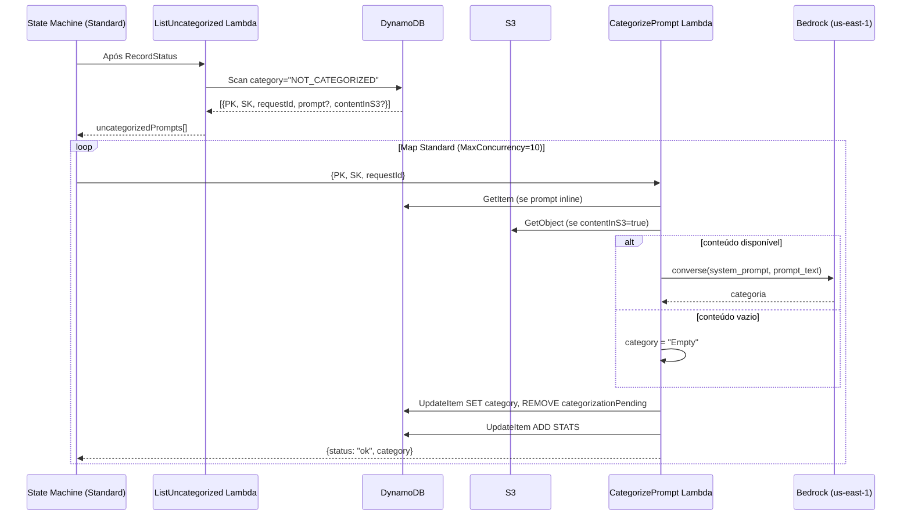
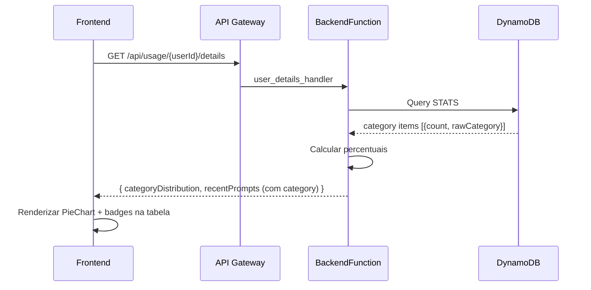

# Documento de Design — Categorização Automática de Prompts

## Visão Geral

Esta feature adiciona categorização automática de prompts ao pipeline ETL existente. Um novo módulo `prompt_categorizer.py` invoca o Amazon Bedrock (Nova Micro) via inferência cross-region para classificar cada prompt em uma das 14 categorias pré-definidas (+ "Empty" para prompts vazios). A categoria é persistida no DynamoDB junto aos metadados do prompt, contadores de distribuição por categoria são mantidos por usuário, e o frontend exibe badges coloridos na tabela de prompts e um gráfico de pizza de distribuição de categorias.

### Decisões de Design

1. **Módulo isolado**: O categorizador é um módulo Python independente (`etl/prompt_categorizer.py`) sem dependências do pipeline ETL, facilitando testes unitários e reutilização.
2. **Categorização FORA do fluxo Express**: O pipeline ETL existente (Distributed Map Express) continua inalterado — salva prompts com `category: "NOT_CATEGORIZED"`. A categorização roda como um step **Standard** separado após o RecordStatus, eliminando riscos de timeout da Express workflow (5 min) e simplificando o rate limiting.
3. **Map Standard com concorrência controlada**: O step de categorização usa um Map Standard com `MaxConcurrency=10`, processando ~10 prompts/s — bem abaixo do limite de 66 req/s do Bedrock. Retry nativo do Step Functions com backoff configurável.
4. **Fallback silencioso**: Erros do Bedrock resultam em categoria "Other" com log de erro, sem interromper o pipeline.
5. **Reutilização do few-shot prompt validado**: O system prompt com exemplos concretos já foi validado em `scripts/test_categorization.py` (taxa de "Other" reduzida de 67% para 6,5%).
6. **Padrão de distribuição existente**: Os contadores `STATS#CATEGORY#{category}` seguem exatamente o padrão de `STATS#MODEL#` e `STATS#TRIGGER#` já implementados.
7. **Grid de 3 colunas**: O DistributionCharts passa de 2 para 3 colunas (modelo, trigger, categoria) usando o Grid do Cloudscape.

## Arquitetura

### Fluxo Geral do ETL (atualizado)

```
ListNewFiles → CheckNewFiles → ProcessFiles (Distributed Map Express)
    ├── ParseAndNormalize
    ├── WriteToDynamoDB (salva com category="NOT_CATEGORIZED")
    └── MarkFileProcessed
→ RecordStatus
→ ListUncategorizedPrompts (NOVO)
→ CategorizePrompts (Map Standard, MaxConcurrency=10) (NOVO)
    └── CategorizeOnePrompt (Lambda)
→ RecordCategorizationStatus (NOVO)
```

### Diagrama de Fluxo — Categorização (Standard Map)



### Diagrama de Leitura (Backend → Frontend)



## Componentes e Interfaces

### 1. `etl/prompt_categorizer.py` — Módulo Categorizador

Módulo isolado responsável por invocar o Bedrock e retornar a categoria.

```python
# Interface pública
class PromptCategorizer:
    def __init__(self, model_id: str, region: str, bedrock_client=None):
        """Inicializa com model ID e região do Bedrock.
        
        Args:
            model_id: ID do modelo Bedrock (ex: "us.amazon.nova-micro-v1:0")
            region: Região do Bedrock (ex: "us-east-1")
            bedrock_client: Cliente boto3 bedrock-runtime opcional (para testes)
        """
        ...

    def categorize(self, prompt_text: str) -> str:
        """Classifica o prompt em uma categoria.
        
        Args:
            prompt_text: Conteúdo do prompt a ser classificado.
            
        Returns:
            Uma das 14 categorias válidas, "Other" em caso de erro/resposta inválida,
            ou "Empty" se o prompt estiver vazio.
        """
        ...
```

**Comportamento:**
- Se `prompt_text` é vazio ou só whitespace → retorna `"Empty"` sem chamar Bedrock
- Trunca para 5000 caracteres antes de enviar
- Usa `converse()` API com `temperature=0.0`, `maxTokens=20`
- Valida resposta contra `VALID_CATEGORIES`; se inválida → `"Other"`
- Em caso de exceção → propaga a exceção (retry é responsabilidade do Step Functions)

**System prompt:** Reutiliza o few-shot prompt validado em `scripts/test_categorization.py`, com exemplos concretos para cada categoria em português e inglês.

### 1b. `etl/list_uncategorized_handler.py` — Listar Prompts Pendentes

Nova Lambda que lista prompts com `category = "NOT_CATEGORIZED"`:

```python
def list_uncategorized_handler(event: dict, context) -> dict:
    """Scan por prompts com category='NOT_CATEGORIZED'.
    
    Returns:
        Dict com uncategorizedPrompts (lista de {PK, SK, requestId, contentInS3, prompt})
        e count.
    """
```

**Comportamento:**
- Scan com `FilterExpression: category = "NOT_CATEGORIZED"`
- Retorna lista com campos mínimos: PK, SK, requestId, contentInS3, prompt (se inline)
- Paginação completa (scan todas as páginas)

### 1c. `etl/categorize_prompt_handler.py` — Categorizar Um Prompt

Nova Lambda invocada pelo Map Standard para categorizar um único prompt:

```python
def categorize_prompt_handler(event: dict, context) -> dict:
    """Categoriza um único prompt e atualiza o DynamoDB.
    
    Args:
        event: {PK, SK, requestId, contentInS3?, prompt?}
    
    Returns:
        Dict com {status, category, requestId}
    """
```

**Comportamento:**
- Lê o conteúdo do prompt (inline do event ou S3 via `prompts-content/{requestId}.json`)
- Chama `PromptCategorizer.categorize(prompt_text)`
- UpdateItem no DynamoDB: SET `category` = resultado
- Incrementa `STATS#CATEGORY#{category}` via UpdateItem ADD
- Se Bedrock falhar: propaga exceção → Step Functions faz retry com backoff
- Se conteúdo vazio: SET `category = "Empty"`

**Categorias válidas:**
```python
VALID_CATEGORIES = [
    "Code Generation", "Debugging", "Refactoring", "Documentation",
    "Testing", "Code Review", "Architecture/Design", "DevOps/Infrastructure",
    "Data Analysis", "Production Troubleshooting", "Feedback/Critique",
    "Planning/Discussion", "General Q&A", "Other",
]
```

**Comportamento:**
- Se `prompt_text` é vazio ou só whitespace → retorna `"Empty"` sem chamar Bedrock
- Trunca para 5000 caracteres antes de enviar
- Usa `converse()` API com `temperature=0.0`, `maxTokens=20`
- Valida resposta contra `VALID_CATEGORIES`; se inválida → `"Other"`
- Em caso de exceção → retorna `"Other"` e loga o erro

**System prompt:** Reutiliza o few-shot prompt validado em `scripts/test_categorization.py`, com exemplos concretos para cada categoria em português e inglês.

### 2. `etl/writer_handler.py` — Integração no WriterFunction

Modificação da função `_write_prompt_record()`:

```python
def _write_prompt_record(writer: AnalyticsWriter, record: dict) -> int:
    # ... código existente ...
    
    # NOVO: Categorizar o prompt
    prompt_text = record.get("prompt", "")
    if prompt_text.strip():
        categorizer = _get_categorizer()  # singleton lazy
        category = categorizer.categorize(prompt_text)
    else:
        category = "Empty"
    
    # Passa category para write_prompt
    writer.write_prompt(user_id, record, prompt, response, category=category)
    
    # NOVO: Incrementar distribuição de categoria
    if category:
        writer.increment_category_count(user_id, normalize_sk_value(category), category)
        items += 1
    
    # ... resto do código existente ...
```

**Singleton do categorizador:** O `PromptCategorizer` é instanciado uma vez por invocação da Lambda (lazy init) para reutilizar a conexão do Bedrock client.

### 3. `etl/repository/analytics_writer.py` — Escrita de Categoria

Novas operações no AnalyticsWriter:

```python
def write_prompt(self, user_id, prompt_record, prompt_content, response_content, category=""):
    """PutItem para prompt — agora inclui campo 'category'."""
    # ... código existente ...
    item["category"] = category  # NOVO campo
    # ... resto ...

def increment_category_count(self, user_id: str, normalized_category: str, raw_category: str):
    """UpdateItem ADD para STATS#CATEGORY#{normalizedCategory}.
    
    Segue o padrão de increment_model_count e increment_trigger_count.
    """
    self._table.update_item(
        Key={
            "PK": f"USER#{user_id}",
            "SK": f"STATS#CATEGORY#{normalized_category}",
        },
        UpdateExpression=(
            "ADD #count :one "
            "SET rawCategory = if_not_exists(rawCategory, :raw)"
        ),
        ExpressionAttributeNames={"#count": "count"},
        ExpressionAttributeValues={":one": 1, ":raw": raw_category},
    )
```

### 4. `backend/repository/analytics_repository.py` — Leitura de Categorias

Nova query no AnalyticsRepository:

```python
def get_user_category_distribution(self, user_id: str) -> list[dict]:
    """Query STATS#CATEGORY# items para um usuário."""
    pk = f"USER#{user_id}"
    key_condition = Key("PK").eq(pk) & Key("SK").begins_with("STATS#CATEGORY#")
    # ... padrão idêntico a get_user_model_distribution ...
```

### 5. `backend/handlers/user_details_handler.py` — Resposta da API

Modificações:
- Chamar `repo.get_user_category_distribution(user_id)`
- Calcular distribuição com `_compute_distributions(category_items, "category", "rawCategory")`
- Incluir `categoryDistribution` na resposta

### 6. `backend/handlers/prompts_handler.py` — Campo category nos prompts

Modificação em `_parse_prompt_item()`:
```python
def _parse_prompt_item(item: dict) -> dict:
    # ... campos existentes ...
    return {
        # ... campos existentes ...
        "category": item.get("category", ""),  # NOVO
    }
```

### 7. Frontend — Tipos TypeScript (`frontend/src/types/index.ts`)

```typescript
// NOVO tipo
export interface CategoryDistribution {
  category: string;
  count: number;
  percentage: number;
}

// Campos adicionados a tipos existentes
export interface RecentPrompt {
  // ... campos existentes ...
  category: string;  // NOVO
}

export interface PromptMetadata {
  // ... campos existentes ...
  category: string;  // NOVO
}

export interface UserDetailResponse {
  // ... campos existentes ...
  categoryDistribution: CategoryDistribution[];  // NOVO
}
```

### 8. Frontend — `RecentPromptsTable.tsx`

Nova coluna "Categoria" com badge colorido:

```typescript
// Mapa de cores por categoria (usando StatusIndicator ou Badge do Cloudscape)
const CATEGORY_COLORS: Record<string, string> = {
  "Code Generation": "blue",
  "Debugging": "red",
  "Refactoring": "green",
  // ... demais categorias ...
};

// Nova coluna na tabela
{
  id: 'category',
  header: 'Categoria',
  cell: (item) => <Badge color={CATEGORY_COLORS[item.category] || 'grey'}>{item.category || 'N/A'}</Badge>,
  width: 180,
}
```

### 9. Frontend — `DistributionCharts.tsx`

Adição do terceiro gráfico de pizza:

```typescript
interface DistributionChartsProps {
  modelDistribution: ModelDistribution[];
  triggerDistribution: TriggerDistribution[];
  categoryDistribution: CategoryDistribution[];  // NOVO
  loading: boolean;
}

// Grid passa de 2 para 3 colunas
<Grid gridDefinition={[{ colspan: 4 }, { colspan: 4 }, { colspan: 4 }]}>
  {/* Modelo */}
  {/* Trigger */}
  {/* Categoria (NOVO) */}
</Grid>
```

### 10. Infraestrutura — `template.yaml`

Modificações no WriterFunction:

```yaml
WriterFunction:
  Properties:
    Environment:
      Variables:
        # ... existentes ...
        BEDROCK_MODEL_ID: "us.amazon.nova-micro-v1:0"   # NOVO
        BEDROCK_REGION: "us-east-1"                       # NOVO
    Policies:
      - Statement:
          # ... existentes ...
          - Sid: BedrockInvokeModel                        # NOVO
            Effect: Allow
            Action:
              - bedrock:InvokeModel
            Resource:
              - !Sub "arn:aws:bedrock:us-east-1::foundation-model/amazon.nova-micro-v1:0"
              - "arn:aws:bedrock:us-east-1:*:inference-profile/us.amazon.nova-micro-v1:0"
```

## Modelos de Dados

### DynamoDB — Novos Itens/Campos

#### Item de Prompt (modificado)

| Campo | Tipo | Descrição |
|-------|------|-----------|
| PK | String | `USER#{userId}` |
| SK | String | `PROMPT#{timestamp}#{requestId}` |
| category | String | Categoria do prompt (ex: "Code Generation", "Empty") |
| ... | ... | Demais campos existentes inalterados |

#### Item de Distribuição de Categoria (novo)

| Campo | Tipo | Descrição |
|-------|------|-----------|
| PK | String | `USER#{userId}` |
| SK | String | `STATS#CATEGORY#{normalizedCategory}` |
| count | Number | Contador atômico (ADD) |
| rawCategory | String | Valor original da categoria (SET if_not_exists) |

**Padrão de normalização:** Usa `normalize_sk_value()` existente. Exemplo: `"Code Generation"` → `"code-generation"`, `"Architecture/Design"` → `"architecture-design"`.

### API Response — `GET /api/usage/{userId}/details`

Campo adicionado à resposta:

```json
{
  "categoryDistribution": [
    { "category": "Code Generation", "count": 45, "percentage": 30.0 },
    { "category": "Debugging", "count": 22, "percentage": 14.7 },
    ...
  ],
  "recentPrompts": [
    {
      "timestamp": "...",
      "modelId": "...",
      "category": "Code Generation",
      ...
    }
  ]
}
```

### API Response — `GET /api/prompts` e `GET /api/prompts/{requestId}`

Campo `category` adicionado aos metadados de cada prompt:

```json
{
  "prompts": [
    {
      "userId": "...",
      "category": "Debugging",
      ...
    }
  ]
}
```


## Propriedades de Corretude

*Uma propriedade é uma característica ou comportamento que deve ser verdadeiro em todas as execuções válidas de um sistema — essencialmente, uma declaração formal sobre o que o sistema deve fazer. Propriedades servem como ponte entre especificações legíveis por humanos e garantias de corretude verificáveis por máquina.*

### Propriedade 1: Saída do categorizador é sempre válida

*Para qualquer* texto de prompt e *para qualquer* resposta do Bedrock (válida, inválida ou vazia), `categorize()` deve retornar um valor pertencente ao conjunto `VALID_CATEGORIES ∪ {"Empty"}`. Se a resposta do Bedrock não corresponder a nenhuma categoria válida, o resultado deve ser `"Other"`.

**Valida: Requisitos 1.1, 1.6**

### Propriedade 2: Truncamento para 5000 caracteres

*Para qualquer* texto de prompt com comprimento arbitrário, o texto enviado ao Bedrock na chamada `converse()` deve ter no máximo 5000 caracteres.

**Valida: Requisito 1.4**

### Propriedade 3: Resiliência a erros do Bedrock

*Para qualquer* exceção lançada durante a invocação do Bedrock (timeout, throttling, erro de serviço, etc.), `categorize()` deve retornar `"Other"` sem propagar a exceção.

**Valida: Requisito 1.7**

### Propriedade 4: Prompt vazio retorna "Empty" sem chamar Bedrock

*Para qualquer* string composta inteiramente de whitespace (incluindo string vazia), `categorize()` deve retornar `"Empty"` e o cliente Bedrock não deve ser invocado.

**Valida: Requisitos 1.8, 2.2**

### Propriedade 5: Campo category é persistido no DynamoDB

*Para qualquer* registro de prompt com uma categoria atribuída, o item escrito no DynamoDB via `write_prompt()` deve conter o campo `category` com o valor correto da categoria.

**Valida: Requisito 2.3**

### Propriedade 6: Contador de categoria é incrementado

*Para qualquer* prompt categorizado com sucesso, `increment_category_count()` deve ser chamado com o SK no formato `STATS#CATEGORY#{normalizedCategory}` e a operação ADD deve incrementar o contador em 1.

**Valida: Requisito 2.4**

### Propriedade 7: Cálculo de porcentagem de distribuição

*Para qualquer* lista não-vazia de contagens de categorias, a porcentagem de cada categoria deve ser igual a `count / total * 100` (arredondado para 1 casa decimal), e a soma de todas as porcentagens deve ser aproximadamente 100% (±1% por arredondamento).

**Valida: Requisito 3.3**

### Propriedade 8: Metadados de prompt incluem categoria

*Para qualquer* item de prompt do DynamoDB que contenha o campo `category`, a função `_parse_prompt_item()` deve incluir o campo `category` no dicionário de saída com o mesmo valor.

**Valida: Requisito 3.4**

## Tratamento de Erros

### Erros do Bedrock

| Cenário | Comportamento | Impacto |
|---------|---------------|---------|
| Timeout na chamada `converse()` | Lambda propaga exceção → Step Functions retry (backoff 2s, 4s, 8s, max 10 tentativas) | Prompt será retentado automaticamente |
| Throttling (TooManyRequestsException) | Lambda propaga exceção → Step Functions retry com backoff exponencial | Map Standard com MaxConcurrency=10 limita a ~10 req/s, bem abaixo do limite de 66 req/s |
| Throttling sustentado | Step Functions retry esgota → prompt vai pro Catch → marcado como erro no resultado | Reprocessável na próxima execução do ETL |
| Modelo indisponível | Lambda propaga exceção → Step Functions retry | Retentado automaticamente |
| Resposta inválida (não é uma categoria) | Categorizador retorna "Other" (sem exceção) | Prompt salvo com fallback, sem retry |
| Credenciais/permissão insuficiente | Lambda propaga exceção → Step Functions Catch | Todos ficam pendentes até fix de permissão |

**Limites do Nova Micro (Geo Cross-Region):**
- **4.000 RPM** (~66 req/s)
- **8M TPM** (tokens por minuto)
- Com ~1000 tokens/request, o limite de TPM não é o gargalo — o RPM é.
- O Map Standard com `MaxConcurrency=10` garante ~10 req/s — **6x abaixo do limite**.
- Retry do Step Functions com backoff exponencial absorve picos de throttling sem lógica custom na Lambda.

**Princípio:** Erros de categorização nunca devem interromper o pipeline ETL. O prompt é salvo normalmente com categoria "Other".

### Erros de Escrita no DynamoDB

O `increment_category_count()` segue o mesmo padrão de retry do `increment_model_count()` e `increment_trigger_count()` — o Step Functions já tem retry configurado para `DynamoDB.ProvisionedThroughputExceededException`.

### Dados Ausentes no Frontend

- Se `categoryDistribution` estiver vazio ou ausente → gráfico de pizza mostra "Nenhum dado disponível."
- Se `category` de um prompt estiver vazio → badge mostra "N/A" em cor neutra
- Se a API retornar erro → o componente já tem tratamento de erro existente via Alert

## Estratégia de Testes

### Testes Unitários (Python)

| Módulo | Testes | Tipo |
|--------|--------|------|
| `prompt_categorizer.py` | Categorização com mock Bedrock, validação de categorias, truncamento, empty handling, error handling | Unit + Property |
| `analytics_writer.py` | `increment_category_count()` com mock DynamoDB, `write_prompt()` com campo category | Unit + Property |
| `writer_handler.py` | `_write_prompt_record()` com mock categorizer, integração empty/non-empty | Unit |
| `analytics_repository.py` | `get_user_category_distribution()` com mock DynamoDB | Unit |
| `user_details_handler.py` | Resposta com `categoryDistribution`, cálculo de porcentagens | Unit + Property |
| `prompts_handler.py` | `_parse_prompt_item()` com campo category | Unit + Property |

### Testes Property-Based (Python — Hypothesis)

A biblioteca **Hypothesis** será utilizada para testes property-based. Cada teste deve rodar no mínimo 100 iterações.

| Propriedade | Teste | Tag |
|-------------|-------|-----|
| P1: Saída sempre válida | Gerar strings aleatórias + respostas mock aleatórias, verificar saída ∈ categorias válidas | `Feature: prompt-categorization, Property 1: Output is always a valid category` |
| P2: Truncamento | Gerar strings de comprimento variável, verificar texto enviado ≤ 5000 chars | `Feature: prompt-categorization, Property 2: Text sent to Bedrock is truncated to 5000 chars` |
| P3: Resiliência a erros | Gerar exceções aleatórias, verificar retorno "Other" | `Feature: prompt-categorization, Property 3: Bedrock errors return Other` |
| P4: Empty → "Empty" | Gerar strings whitespace-only, verificar retorno "Empty" e Bedrock não chamado | `Feature: prompt-categorization, Property 4: Empty prompts return Empty without Bedrock call` |
| P5: Category persistido | Gerar registros com categorias aleatórias, verificar campo no PutItem | `Feature: prompt-categorization, Property 5: Category field is persisted in DynamoDB` |
| P6: Contador incrementado | Gerar categorias aleatórias, verificar UpdateItem ADD | `Feature: prompt-categorization, Property 6: Category counter is incremented` |
| P7: Porcentagem correta | Gerar listas de contagens, verificar cálculo de porcentagem | `Feature: prompt-categorization, Property 7: Percentage calculation is correct` |
| P8: Metadata inclui category | Gerar items DynamoDB com campo category, verificar saída de _parse_prompt_item | `Feature: prompt-categorization, Property 8: Prompt metadata includes category` |

### Testes Unitários (TypeScript/React)

| Componente | Testes | Tipo |
|------------|--------|------|
| `RecentPromptsTable` | Renderiza coluna "Categoria" com badge, badge "N/A" para category vazio | Example |
| `DistributionCharts` | Renderiza 3 gráficos de pizza, estado vazio, estado loading | Example |
| Tipos TypeScript | Compilação verifica interfaces `CategoryDistribution`, campos adicionados | Smoke (compilação) |

### Testes de Integração

| Cenário | Descrição |
|---------|-----------|
| ETL end-to-end | Processar um arquivo de prompts mock e verificar que os itens no DynamoDB contêm o campo `category` e os contadores `STATS#CATEGORY#` foram incrementados |
| API response | Chamar `GET /api/usage/{userId}/details` com dados mock e verificar que `categoryDistribution` está presente na resposta |
