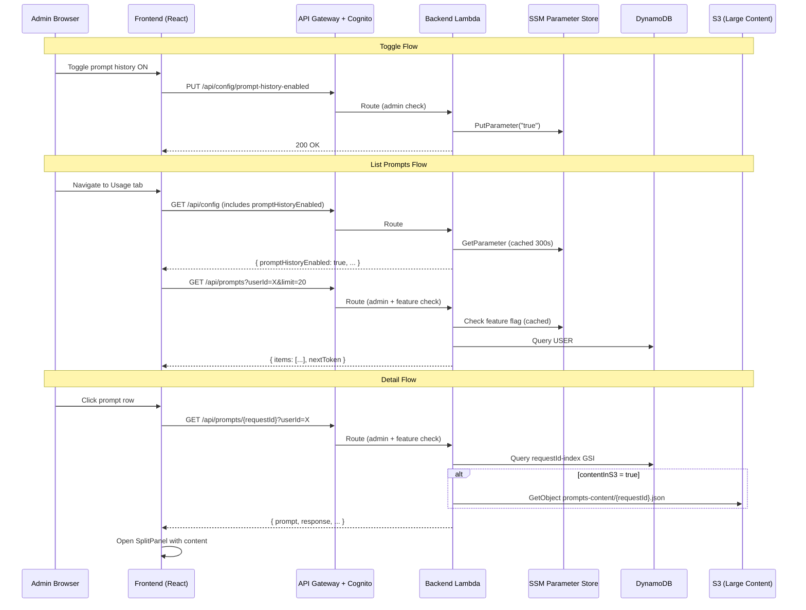

# Design Document: Prompt History Visibility

## Overview

This design re-introduces the prompt history display feature with admin-controlled visibility. The feature was previously removed for privacy reasons and is now being restored with stricter access control: only administrators can view prompt history, and only when an admin has explicitly enabled a global toggle in the Settings page.

The implementation adds:
1. A new SSM parameter (`/kiro-cost-analyzer/prompt-history-enabled`) as the feature flag
2. A new "Prompts" sub-tab in the Settings page with a toggle control
3. Two new API endpoints (`GET /api/prompts`, `GET /api/prompts/{requestId}`) with dual-gate access control (admin + feature enabled)
4. A new `PromptsTable` component in the Usage tab with a `SplitPanel`-based detail view
5. Strict logging discipline: prompt content MUST NEVER appear in logs

### Key Design Decisions

- **Dual-gate access control**: Every prompts API request is validated against both admin group membership AND the feature-enabled flag. If either check fails, the request is rejected with 403.
- **SSM caching with 300s TTL**: The feature flag is read from SSM on each request but cached in-memory for up to 5 minutes to reduce SSM API calls while keeping staleness bounded.
- **Fail-closed on SSM errors**: If SSM is unreachable, the feature is treated as disabled (403).
- **No content in logs**: The `StructuredLogger` fields for prompts endpoints are restricted to metadata only. This is enforced by design — the handler never passes content strings to the logger.
- **Reuse existing repository methods**: `analytics_repository.get_user_prompts()` and `get_prompt_by_request_id()` already exist and provide the data access patterns needed.

## Architecture



## Components and Interfaces

### Backend Components

#### 1. `backend/handlers/prompts_handler.py` (new)

Handles both prompts endpoints with dual-gate access control.

```python
def handle_list_prompts(
    query_params: dict,
    dynamodb_resource=None,
    ssm_client=None,
) -> dict:
    """GET /api/prompts — paginated prompt metadata list.
    
    Query params: userId (required), limit, nextToken, startDate, endDate, category.
    Returns: { items: [...], nextToken, total }
    Errors: 400 (missing userId), 403 (not enabled / not admin)
    """

def handle_get_prompt_detail(
    request_id: str,
    query_params: dict,
    dynamodb_resource=None,
    s3_client=None,
    ssm_client=None,
) -> dict:
    """GET /api/prompts/{requestId} — full prompt + response content.
    
    Query params: userId (required for DDB lookup).
    Returns: { requestId, timestamp, category, modelId, prompt, response, ... }
    Errors: 403 (not enabled / not admin), 404 (not found), 500 (S3 failure)
    """
```

#### 2. `backend/handlers/config_handler.py` (modified)

Add handler for the new toggle endpoint and include the flag in GET /api/config response.

```python
def handle_put_config_prompt_history_enabled(body: dict, ssm_client=None) -> dict:
    """PUT /api/config/prompt-history-enabled — persist toggle state.
    
    Body: { "enabled": true | false }
    SSM key: /kiro-cost-analyzer/prompt-history-enabled
    Value: "true" or "false"
    """

# Modified: handle_get_config now also reads prompt-history-enabled
# and returns it as `promptHistoryEnabled: bool` in the response.
```

#### 3. Feature Flag Cache (`_FeatureFlagCache`)

A simple in-memory cache with TTL for the SSM parameter value:

```python
class _FeatureFlagCache:
    """In-memory cache for the prompt-history-enabled SSM parameter.
    
    Max staleness: 300 seconds. Fail-closed: returns False on SSM errors.
    """
    _value: bool = False
    _last_fetched: float = 0.0
    _ttl: int = 300  # seconds

    @classmethod
    def is_enabled(cls, ssm_client=None) -> bool:
        """Check if prompt history is enabled. Caches for 300s."""
```

#### 4. `backend/handler.py` (modified)

Add route entries for the new endpoints:
- `GET /api/prompts` → admin-only → `prompts_handler.handle_list_prompts`
- `GET /api/prompts/{requestId}` → admin-only → `prompts_handler.handle_get_prompt_detail`
- `PUT /api/config/prompt-history-enabled` → admin-only → `config_handler.handle_put_config_prompt_history_enabled`

##### Self-lookup `userId` translation

Both `GET /api/prompts` routes accept a `userId` query parameter. PROMPT# items in DynamoDB are keyed by the **Kiro userId** (Identity Center UUID, derived during ETL by `extract_uuid` on the raw `d-{directoryId}.{uuid}` value), but the SPA URL routes use the **Cognito sub** in the path (`/user/{sub}`) when an admin opens their own profile. Without translation, an admin viewing their own page calls `GET /api/prompts?userId={cognito-sub}` and gets an empty list because no PROMPT# items exist under that PK.

The router applies a narrow translation via `_resolve_self_kiro_user_id(query_params, claims)`: if the requested `userId` equals the caller's Cognito sub **and** the JWT carries a `custom:kiro_user_id` claim, swap `userId` to that claim's value before delegating. Any other case (different `userId`, missing claim, missing query params) is unchanged.

The substitution is safe by construction: the new value comes from JWT claims signed by Cognito and validated by the API Gateway authorizer. A caller cannot forge another user's mapping, and the route remains admin-only — admins can already query any `userId` directly.

##### System category constants

The list of categories considered "system" (excluded from the Prompt History listing by default) lives in `layers/shared/shared/categories.py`:

- `CATEGORY_EMPTY = "Empty"`
- `CATEGORY_NOT_CATEGORIZED = "NOT_CATEGORIZED"`
- `CATEGORY_CLASSIFICATION_ERROR = "Classification Error"`
- `SYSTEM_CATEGORIES = frozenset({...})`

Every producer (`etl/writer_handler.py`, `etl/prompt_categorizer.py`) and every read-path filter (`backend/handlers/prompts_handler.py`, `etl/list_uncategorized_handler.py`) imports from this module. Inlining literals is what allowed the original casing drift — the handler had `{"empty", "not_categorized", "classification error"}` while the writer and the categorizer wrote `Empty`, `NOT_CATEGORIZED`, `Classification Error`. DynamoDB `Attr.ne()` is case-sensitive, so the FilterExpression silently matched nothing and the handler returned 100 system items per page (the frontend then filtered them all out client-side).

The literals in `shared/categories.py` ARE the on-disk shape of the `category` attribute. Changing them requires either backfilling existing PROMPT# items or adding a transitional matcher that accepts both casings — `tests/test_categories.py` pins the values so the impact is visible at code-review time.

### Frontend Components

#### 5. `frontend/src/components/PromptsTable.tsx` (new)

Cloudscape Table component displaying prompt metadata for a user.

```typescript
interface PromptsTableProps {
  userId: string;
  dateRange: DateRangePickerProps.Value | null;
}

export default function PromptsTable({ userId, dateRange }: PromptsTableProps) {
  // Fetches GET /api/prompts?userId=...&limit=...&startDate=...&endDate=...
  // Columns: promptPreview (100 chars + ellipsis), dateTime, category
  // Pagination: 10 | 20 | 50 per page
  // Category filter via PropertyFilter or Select
  // Excludes System_Categories by default
  // On row select → opens SplitPanel via useSplitPanel hook
}
```

#### 6. `frontend/src/components/PromptDetailPanel.tsx` (new)

Content rendered inside the SplitPanel when a prompt row is selected.

```typescript
interface PromptDetailPanelProps {
  requestId: string;
  userId: string;
  onClose: () => void;
}

export default function PromptDetailPanel({ requestId, userId, onClose }: PromptDetailPanelProps) {
  // Fetches GET /api/prompts/{requestId}?userId=...
  // Displays: timestamp, category, modelId
  // Two scrollable sections: Prompt content, Response content
  // Loading state: Spinner
  // Error state: Alert + Retry button
}
```

#### 7. `frontend/src/components/PromptHistoryToggle.tsx` (new)

Toggle control for the Settings page "Prompts" sub-tab.

```typescript
export default function PromptHistoryToggle() {
  // Reads current state from AppConfig (already fetched by SettingsPage)
  // PUT /api/config/prompt-history-enabled on change
  // Success/error notifications
  // Reverts on failure
}
```

#### 8. `frontend/src/pages/SettingsPage.tsx` (modified)

Add a new "Prompts" tab to the `configTabs` array (admin-only, like Pricing).

#### 9. `frontend/src/pages/UserPage.tsx` (modified)

In the Usage tab content, conditionally render `<PromptsTable>` below `<DistributionCharts>` when:
- `promptHistoryEnabled === true` (from config API)
- `isAdmin === true` (from auth context)

### API Contracts

#### GET /api/config (modified response)

```json
{
  "bucketName": "...",
  "sourcePrefix": "...",
  "promptsPrefix": "...",
  "identityStoreId": "...",
  "sourceBucketRoleArn": "...",
  "identityStoreRoleArn": "...",
  "etlStatus": { ... },
  "promptHistoryEnabled": false
}
```

#### PUT /api/config/prompt-history-enabled

Request:
```json
{ "enabled": true }
```

Response:
```json
{ "status": "valid", "message": "Prompt history visibility updated", "enabled": true }
```

#### GET /api/prompts

Query params: `userId` (required), `limit` (default 20, max 100), `nextToken`, `startDate`, `endDate`, `category`

Response:
```json
{
  "items": [
    {
      "requestId": "req-abc",
      "timestamp": "2026-04-10T14:18:03.103Z",
      "category": "Code Generation",
      "promptPreview": "Write a function that calculates the Fibonacci...",
      "modelId": "claude-sonnet",
      "triggerType": "CHAT",
      "promptLength": 245,
      "responseLength": 1830
    }
  ],
  "nextToken": "base64-encoded-cursor-or-null"
}
```

#### GET /api/prompts/{requestId}

Query params: `userId` (required)

Response:
```json
{
  "requestId": "req-abc",
  "timestamp": "2026-04-10T14:18:03.103Z",
  "category": "Code Generation",
  "modelId": "claude-sonnet",
  "prompt": "Write a function that calculates the Fibonacci sequence...",
  "response": "Here's a Python function that calculates...",
  "promptLength": 245,
  "responseLength": 1830,
  "contentInS3": false
}
```

## Data Models

### SSM Parameter Store

| Parameter | Type | Default | Description |
|-----------|------|---------|-------------|
| `/kiro-cost-analyzer/prompt-history-enabled` | String | `"false"` | Feature toggle. Values: `"true"` or `"false"` |

### DynamoDB (existing — no schema changes)

Prompt items already exist in the Analytics_Table:

| Field | Type | Description |
|-------|------|-------------|
| PK | String | `USER#{userId}` |
| SK | String | `PROMPT#{timestamp}#{requestId}` |
| requestId | String | Unique prompt identifier (GSI key) |
| timestamp | String | ISO 8601 timestamp |
| category | String | Classification category |
| modelId | String | Model used |
| triggerType | String | How the prompt was triggered |
| promptLength | Number | Character count of prompt |
| responseLength | Number | Character count of response |
| contentInS3 | Boolean | Whether content is stored in S3 |
| prompt | String | Inline prompt content (when contentInS3=false) |
| response | String | Inline response content (when contentInS3=false) |

### S3 (existing — no changes)

Large prompt content stored at: `s3://{DATA_BUCKET}/prompts-content/{requestId}.json`

```json
{ "prompt": "...", "response": "..." }
```

### TypeScript Interfaces (new)

```typescript
// frontend/src/types/index.ts

export interface PromptMetadata {
  requestId: string;
  timestamp: string;
  category: string;
  promptPreview: string;
  modelId: string;
  triggerType: string;
  promptLength: number;
  responseLength: number;
}

export interface PromptsListResponse {
  items: PromptMetadata[];
  nextToken: string | null;
}

export interface PromptDetail {
  requestId: string;
  timestamp: string;
  category: string;
  modelId: string;
  prompt: string;
  response: string;
  promptLength: number;
  responseLength: number;
  contentInS3: boolean;
}
```

### AppConfig Interface (modified)

```typescript
export interface AppConfig {
  bucketName: string;
  sourcePrefix: string;
  promptsPrefix: string;
  identityStoreId: string;
  sourceBucketRoleArn?: string;
  identityStoreRoleArn?: string;
  etlStatus: EtlStatus;
  promptHistoryEnabled: boolean;  // NEW
}
```


## Correctness Properties

*A property is a characteristic or behavior that should hold true across all valid executions of a system — essentially, a formal statement about what the system should do. Properties serve as the bridge between human-readable specifications and machine-verifiable correctness guarantees.*

### Property 1: Pagination returns at most `limit` items

*For any* set of prompts in DynamoDB for a given user, and *for any* valid limit value, the `GET /api/prompts` response SHALL contain at most `limit` items in the `items` array, and when `nextToken` is non-null, fetching the next page with that token SHALL return a disjoint set of items.

**Validates: Requirements 3.1, 3.8**

### Property 2: System categories excluded by default

*For any* set of prompts belonging to a user where some prompts have categories in the System_Categories set (Empty, NOT_CATEGORIZED, Classification Error), the default `GET /api/prompts` response (no explicit category parameter) SHALL NOT include any item whose category belongs to System_Categories.

**Validates: Requirements 3.3, 5.5**

### Property 3: Content preview truncation (API — 200 chars)

*For any* prompt item with a `prompt` field of arbitrary length, the `promptPreview` field in the list response SHALL have length ≤ 200 characters. When the original prompt length exceeds 200 characters, the preview SHALL end with `"..."` (ellipsis). When the original prompt length is ≤ 200 characters, the preview SHALL equal the original prompt text.

**Validates: Requirements 3.6**

### Property 4: Limit clamping

*For any* numeric `limit` query parameter value, the effective limit applied by `GET /api/prompts` SHALL be clamped to the range [1, 100]. When `limit` is absent or non-numeric, the effective limit SHALL be 20. When `limit` exceeds 100, the effective limit SHALL be 100.

**Validates: Requirements 3.8**

### Property 5: UI content truncation (Table — 100 chars)

*For any* `promptPreview` string displayed in the PromptsTable, the rendered cell text SHALL have length ≤ 100 characters. When the original `promptPreview` exceeds 100 characters, the displayed text SHALL end with `"…"` (ellipsis indicator).

**Validates: Requirements 5.2**

### Property 6: DateTime formatting uses locale-aware formatter

*For any* valid ISO 8601 timestamp string displayed in the PromptsTable date/time column, the rendered value SHALL equal the output of `formatDateTime(new Date(timestamp))` from the `useI18n()` hook for the active locale.

**Validates: Requirements 5.7**

### Property 7: Log entries contain only allowed metadata fields

*For any* request served by the prompts handler (list or detail), all emitted structured log entries SHALL contain only fields from the allowed set: `timestamp`, `level`, `message`, `lambda`, `correlationId`, `requestId`, `userId`, `category`, `httpMethod`, `path`, `statusCode`, `latencyMs`, `errorType`. No log field value SHALL contain any substring of the prompt content or response content that was served or processed during that request.

**Validates: Requirements 9.1, 9.3, 9.6, 9.7**

### Property 8: SSM parameter values and error content never logged

*For any* SSM read or write operation performed by the prompts handler or config handler for the `prompt-history-enabled` parameter, the log output SHALL NOT contain the SSM parameter path or its value. *For any* error during content retrieval, the log entry SHALL contain the `errorType` field but SHALL NOT contain any portion of the prompt or response content.

**Validates: Requirements 9.2, 9.4**

### Property 9: Locale catalog integrity for prompt history keys

*For any* translation key with prefix `prompts.*` or `promptDetail.*` present in `en.json`, that same key SHALL exist in `pt-BR.json` with a non-empty string value, and vice versa. *For any* such key containing interpolation placeholders (`{{name}}`), the set of placeholder names SHALL be identical in both locale files.

**Validates: Requirements 7.2, 7.3, 7.5**

## Error Handling

### Backend Error Scenarios

| Scenario | HTTP Status | Response Body | Logging |
|----------|-------------|---------------|---------|
| Non-admin calls Prompts_API | 403 | `{"error": "Forbidden", "message": "Access restricted to administrators"}` | Log: userId, path, statusCode=403 |
| Feature disabled | 403 | `{"error": "Forbidden", "message": "Prompt history is not enabled"}` | Log: path, statusCode=403 |
| SSM unreachable (feature check) | 403 | `{"error": "Forbidden", "message": "Prompt history is not enabled"}` | Log: errorType="SSMUnavailable", statusCode=403 |
| Missing userId param | 400 | `{"error": "InvalidParameters", "message": "userId is required"}` | Log: path, statusCode=400 |
| Prompt not found (detail) | 404 | `{"error": "NotFound", "message": "Prompt not found"}` | Log: requestId, statusCode=404 |
| S3 content retrieval failure | 500 | `{"error": "ContentRetrievalFailed", "message": "Failed to retrieve prompt content"}` | Log: requestId, errorType, statusCode=500 (NO content) |
| DynamoDB throttling | 503 | `{"error": "ServiceUnavailable", "message": "Service temporarily unavailable..."}` | Log: errorType="ThrottlingException" |
| Toggle PUT with invalid body | 400 | `{"error": "InvalidBody", "message": "enabled field must be a boolean"}` | Log: path, statusCode=400 |

### Frontend Error Handling

| Scenario | Behavior |
|----------|----------|
| Config API fails | Treat `promptHistoryEnabled` as `false`; do not render PromptsTable |
| Prompts list API fails | Show Alert with error message and retry button inside the table container |
| Prompt detail API fails | Show error message + retry button inside the SplitPanel body |
| Toggle PUT fails | Show error Alert, revert toggle to previous state |
| Network timeout | Standard ApiError handling with retry option |

### Sensitive Data Protection Summary

The following invariants are enforced by design (not just convention):

1. **Handler never passes content to logger**: The `prompts_handler.py` functions extract metadata fields for logging BEFORE retrieving content. Content retrieval happens after logging setup, and the content variables are never referenced in any logger call.

2. **SSM parameter name is read from env var**: The handler uses `os.environ.get("SSM_PROMPT_HISTORY_ENABLED", ...)` and never logs the env var value or the SSM response.

3. **Error paths log generic messages**: All `except` blocks log `errorType=type(exc).__name__` and a fixed message string — never `str(exc)` when the exception might contain content data.

4. **Frontend production guard**: Any `console.log` of content is wrapped in `if (import.meta.env.DEV)` blocks.

## Testing Strategy

### Unit Tests (pytest + moto)

- **prompts_handler**: Test list and detail endpoints with mocked DynamoDB and S3
  - Happy path: returns correct data shape
  - Access control: 403 for non-admin, 403 when feature disabled
  - Edge cases: missing userId (400), not found (404), S3 failure (500)
  - Pagination: nextToken round-trip
  - Category filtering: excludes System_Categories by default

- **config_handler**: Test new toggle endpoint
  - Persists "true"/"false" to SSM
  - Returns correct response shape
  - Invalid body handling

- **Feature flag cache**: Test TTL behavior, fail-closed on SSM error

### Property-Based Tests (Hypothesis — Python)

Library: **Hypothesis** (already in use in this project)

Each property test runs a minimum of **100 iterations**.

| Property | Test Description | Tag |
|----------|-----------------|-----|
| 1 | Generate random prompt sets, verify pagination invariants | `Feature: prompt-history-visibility, Property 1: Pagination returns at most limit items` |
| 2 | Generate prompts with mixed categories, verify system categories excluded | `Feature: prompt-history-visibility, Property 2: System categories excluded by default` |
| 3 | Generate random strings of varying length, verify 200-char truncation with ellipsis | `Feature: prompt-history-visibility, Property 3: Content preview truncation (API — 200 chars)` |
| 4 | Generate random integers for limit param, verify clamping to [1, 100] | `Feature: prompt-history-visibility, Property 4: Limit clamping` |
| 7 | Generate random prompt content, serve through handler, capture logs, verify no content in logs | `Feature: prompt-history-visibility, Property 7: Log entries contain only allowed metadata fields` |
| 8 | Perform SSM operations, capture logs, verify no SSM values in output | `Feature: prompt-history-visibility, Property 8: SSM parameter values and error content never logged` |

### Property-Based Tests (fast-check — TypeScript)

Library: **fast-check** (already in use in this project)

| Property | Test Description | Tag |
|----------|-----------------|-----|
| 5 | Generate random strings, verify 100-char UI truncation | `Feature: prompt-history-visibility, Property 5: UI content truncation (Table — 100 chars)` |
| 6 | Generate random ISO timestamps, verify formatDateTime consistency | `Feature: prompt-history-visibility, Property 6: DateTime formatting uses locale-aware formatter` |
| 9 | Load both locale files, verify key parity and placeholder consistency for prompts.*/promptDetail.* keys | `Feature: prompt-history-visibility, Property 9: Locale catalog integrity for prompt history keys` |

### Integration Tests

- End-to-end flow: enable toggle → list prompts → get detail
- Feature flag cache expiry behavior (time-based)
- S3 content retrieval for large prompts

### Frontend Component Tests (Vitest + Testing Library)

- PromptsTable: renders with data, pagination controls, category filter, empty state
- PromptDetailPanel: loading state, content display, error + retry, close behavior
- PromptHistoryToggle: toggle interaction, success/error notifications, revert on failure
- Conditional rendering: feature flag + admin check gates PromptsTable visibility
