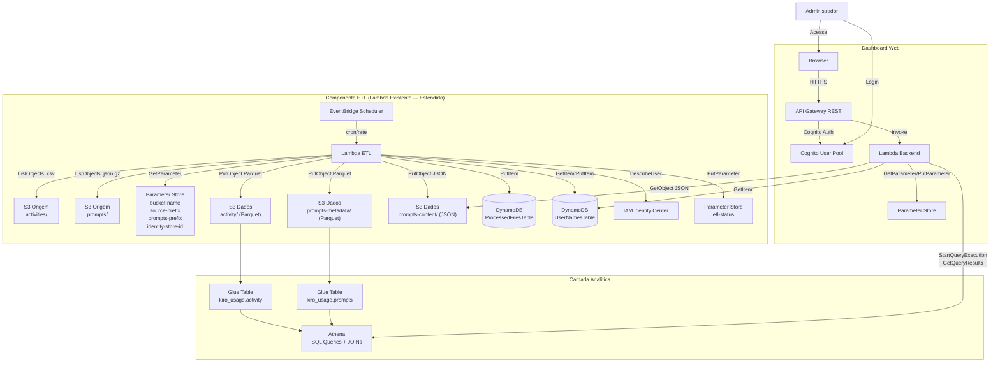
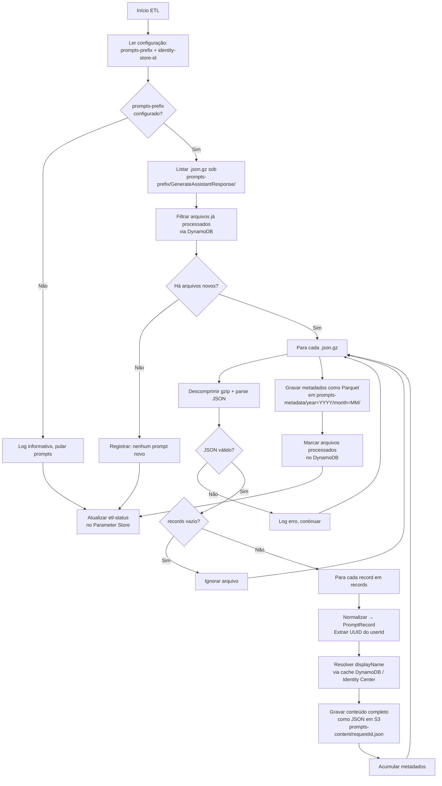
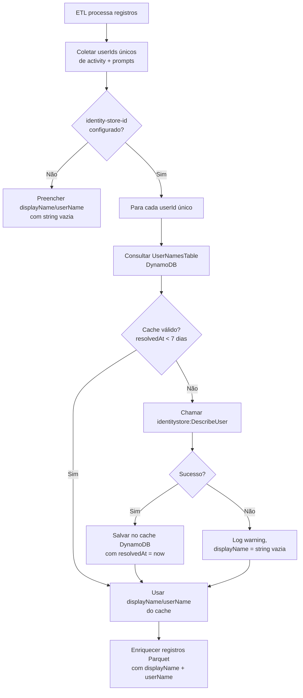
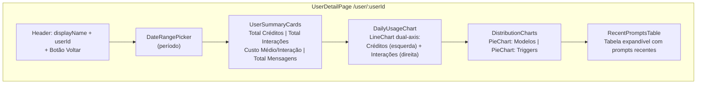

# Documento de Design — Ingestão de Prompts e Correlação com Atividade

## Visão Geral

Esta feature estende o Kiro Cost Analyzer para ingerir logs de prompt/resposta do bucket S3 de origem, correlacioná-los com os dados de atividade existentes via Athena SQL, e expor métricas de correlação em uma nova página de detalhes do usuário no dashboard.

A arquitetura segue o padrão já estabelecido (ETL Lambda → S3 Parquet → Glue Catalog → Athena → API Gateway → React), adicionando:

1. **ETL de Prompts**: Novos módulos no Lambda ETL existente para processar arquivos `.json.gz` do prefixo `prompts/`
2. **Armazenamento em duas camadas**: Metadados em Parquet/Athena (consultas analíticas rápidas) + conteúdo completo como JSON individual no S3 (acesso sob demanda)
3. **Resolução de nomes**: Batch resolve `userId → displayName` via IAM Identity Center durante ETL, com cache em DynamoDB
4. **Correlação dinâmica**: JOINs Athena entre tabelas `activity` e `prompts` por `userId` + `date`
5. **Página de detalhes**: Nova rota `/user/:userId` no frontend com métricas de consumo + interação

### Decisões de Design

| Decisão | Escolha | Justificativa |
|---------|---------|---------------|
| Armazenamento de prompts | Duas camadas (Parquet metadados + JSON conteúdo) | Prompts/respostas podem ter dezenas de KB; armazenar no Parquet inflaria o scan do Athena. Metadados leves no Parquet para agregações, conteúdo sob demanda via S3 GetObject |
| Extensão do ETL | Mesma Lambda, novos módulos | Reutiliza infraestrutura existente (DynamoDB tracker, Parameter Store, IAM roles). Prefixo de prompts configurável independentemente |
| Resolução de nomes | Batch no ETL + cache DynamoDB (TTL 7 dias) | Evita chamadas repetidas à API Identity Center. Nomes gravados diretamente no Parquet para queries Athena sem JOINs adicionais |
| Correlação activity ↔ prompts | LEFT JOIN via Athena SQL em runtime | Sem pré-computação — dados sempre atualizados. Particionamento por year/month otimiza scan |
| Extração de UUID | Split no caractere `.` do userId de prompts | Formato `d-{directoryId}.{uuid}` — a parte após o `.` corresponde ao UUID da tabela activity |
| Paginação de prompts | `nextToken` baseado em offset Athena | Consistente com padrão existente da API. Limite de 50 registros por página |
| Frontend — página de detalhes | Rota `/user/:userId` com React Router | Integração natural com navegação existente. Link clicável na tabela principal |


## Arquitetura



### Fluxo de Dados — Ingestão de Prompts



### Fluxo de Dados — Resolução de Nomes




## Componentes e Interfaces

### 1. Componente ETL — Novos Módulos

O Lambda ETL existente (`etl/handler.py`) será estendido com novos módulos. O `handler.py` orquestrará ambos os pipelines (activity + prompts) em sequência.

#### Estrutura de Módulos (Adições)

```
etl/
├── handler.py                  # Estendido — orquestra activity + prompts
├── config.py                   # Estendido — lê prompts-prefix e identity-store-id
├── prompt_parser.py            # NOVO — descomprime .json.gz e faz parsing
├── prompt_normalizer.py        # NOVO — normaliza records → PromptRecord
├── prompt_writer.py            # NOVO — grava Parquet metadados + JSON conteúdo
├── prompt_s3_reader.py         # NOVO — lista e lê .json.gz do bucket origem
├── user_name_resolver.py       # NOVO — resolve userId → displayName via Identity Center + cache DynamoDB
├── csv_parser.py               # Existente (sem alteração)
├── normalizer.py               # Existente (sem alteração)
├── parquet_writer.py           # Estendido — suporta colunas displayName/userName
├── s3_reader.py                # Existente (sem alteração)
├── path_resolver.py            # Existente (sem alteração)
├── processing_tracker.py       # Existente (reutilizado para prompts)
└── requirements.txt            # Estendido — adiciona boto3 identitystore
```

#### Módulo `prompt_s3_reader.py`

Navega a estrutura `GenerateAssistantResponse/{region}/{year}/{month}/{day}/{hour}/` sob o prefixo de prompts configurado.

```python
PROMPT_SUBPATH = "GenerateAssistantResponse/"

def list_prompt_files(bucket: str, prompts_prefix: str) -> list[str]:
    """Lista todos os .json.gz recursivamente sob o prefixo de prompts.
    
    Navega: {prompts_prefix}/GenerateAssistantResponse/{region}/{year}/{month}/{day}/{hour}/*.json.gz
    Ignora UUIDs soltos e outros sub-caminhos.
    """
    full_prefix = f"{prompts_prefix}{PROMPT_SUBPATH}"
    # Usa paginação S3 (ContinuationToken)
    # Filtra apenas arquivos .json.gz
    ...

def read_prompt_file(bucket: str, key: str) -> bytes:
    """Lê o conteúdo bruto (gzipped) de um arquivo .json.gz do S3."""
    ...
```

#### Módulo `prompt_parser.py`

Descomprime gzip e faz parsing do JSON.

```python
@dataclass
class RawPromptRecord:
    """Registro bruto extraído do JSON de prompt."""
    prompt: str
    response: str
    userId: str           # formato d-{directoryId}.{uuid}
    timestamp: str        # ISO 8601
    modelId: str
    triggerType: str      # chatTriggerType
    customizationArn: str | None
    requestId: str
    conversationId: str | None
    utteranceId: str | None
    followupPrompts: str
    codeReferenceEvents: list
    supplementaryWebLinksEvent: list

def parse_prompt_file(gzipped_content: bytes) -> list[RawPromptRecord]:
    """Descomprime gzip, faz parsing JSON, extrai records."""
    # 1. gzip.decompress(gzipped_content)
    # 2. json.loads(decompressed)
    # 3. Para cada item em data["records"]:
    #    - Extrair campos de generateAssistantResponseEventRequest
    #    - Extrair campos de generateAssistantResponseEventResponse
    #    - Retornar RawPromptRecord
    ...
```

#### Módulo `prompt_normalizer.py`

Normaliza registros brutos para a estrutura plana do Parquet.

```python
@dataclass
class PromptRecord:
    """Registro normalizado de prompt para Parquet."""
    userId: str            # UUID extraído (parte após o '.')
    originalUserId: str    # userId original completo
    displayName: str       # Resolvido via Identity Center (ou vazio)
    userName: str          # Email resolvido via Identity Center (ou vazio)
    timestamp: str         # ISO 8601
    date: str              # YYYY-MM-DD derivado do timestamp
    hour: str              # HH derivado do timestamp
    modelId: str
    triggerType: str
    customizationArn: str  # string vazia se null
    requestId: str
    conversationId: str    # string vazia se null
    utteranceId: str       # string vazia se null
    region: str            # Extraído do path S3
    accountId: str         # Extraído do path S3
    promptLength: int      # len(prompt)
    responseLength: int    # len(response)

def extract_uuid(user_id: str) -> str:
    """Extrai a parte UUID do userId de prompts.
    
    Formato: 'd-{directoryId}.{uuid}' → retorna '{uuid}'
    Se não contém '.', retorna o valor original.
    """
    if '.' in user_id:
        return user_id.split('.', 1)[1]
    return user_id

def normalize_prompt_records(
    raw_records: list[RawPromptRecord],
    path_metadata: dict,
    name_cache: dict[str, tuple[str, str]],  # userId → (displayName, userName)
) -> list[PromptRecord]:
    """Normaliza registros brutos para PromptRecord.
    
    - Extrai UUID do userId
    - Deriva date (YYYY-MM-DD) e hour (HH) do timestamp
    - Substitui None por string vazia em campos opcionais
    - Calcula promptLength e responseLength
    - Enriquece com displayName/userName do cache
    """
    ...
```

#### Módulo `prompt_writer.py`

Grava metadados em Parquet e conteúdo completo como JSON individual.

```python
PROMPTS_METADATA_SCHEMA = pa.schema([
    pa.field("userId", pa.string()),
    pa.field("originalUserId", pa.string()),
    pa.field("displayName", pa.string()),
    pa.field("userName", pa.string()),
    pa.field("timestamp", pa.string()),
    pa.field("date", pa.string()),
    pa.field("hour", pa.string()),
    pa.field("modelId", pa.string()),
    pa.field("triggerType", pa.string()),
    pa.field("customizationArn", pa.string()),
    pa.field("requestId", pa.string()),
    pa.field("conversationId", pa.string()),
    pa.field("utteranceId", pa.string()),
    pa.field("region", pa.string()),
    pa.field("accountId", pa.string()),
    pa.field("promptLength", pa.int64()),
    pa.field("responseLength", pa.int64()),
])

def write_prompt_metadata_parquet(
    records: list[PromptRecord],
    data_bucket: str,
) -> list[str]:
    """Grava metadados de prompts como Parquet particionado por year/month.
    
    Path: s3://{data_bucket}/prompts-metadata/year=YYYY/month=MM/data.parquet
    """
    ...

def write_prompt_content_json(
    raw_record: RawPromptRecord,
    normalized: PromptRecord,
    data_bucket: str,
) -> str:
    """Grava conteúdo completo de um prompt como JSON individual no S3.
    
    Path: s3://{data_bucket}/prompts-content/{requestId}.json
    Conteúdo: todos os metadados + prompt text + response text
    """
    ...
```

#### Módulo `user_name_resolver.py`

Resolve userIds para displayNames via IAM Identity Center com cache DynamoDB.

```python
CACHE_TTL_DAYS = 7

@dataclass
class UserNameEntry:
    userId: str
    displayName: str
    userName: str       # email
    resolvedAt: str     # ISO 8601

def resolve_user_names(
    user_ids: set[str],
    identity_store_id: str,
    table_name: str,
) -> dict[str, tuple[str, str]]:
    """Resolve batch de userIds → (displayName, userName).
    
    1. Consulta cache DynamoDB para cada userId
    2. Se cache válido (resolvedAt < 7 dias), usa valor cacheado
    3. Se cache expirado ou ausente, chama identitystore:DescribeUser
    4. Salva resultado no cache DynamoDB
    5. Se API falha, log warning e retorna ("", "") para esse userId
    
    Returns: dict[userId, (displayName, userName)]
    """
    ...
```

#### Extensão do `config.py`

```python
@dataclass(frozen=True)
class EtlConfig:
    bucket_name: str
    source_prefix: str
    prompts_prefix: str       # NOVO — prefixo de prompts (pode ser vazio)
    identity_store_id: str    # NOVO — Identity Store ID (pode ser vazio)
```

#### Extensão do `handler.py`

O handler principal orquestrará ambos os pipelines:

```python
def lambda_handler(event, context):
    # 1. Ler configuração (inclui prompts_prefix e identity_store_id)
    cfg = get_config()
    
    # 2. Pipeline de Activity (existente)
    activity_records = process_activity_files(cfg)
    
    # 3. Pipeline de Prompts (NOVO — só se prompts_prefix configurado)
    prompt_records = []
    if cfg.prompts_prefix:
        prompt_records = process_prompt_files(cfg)
    
    # 4. Resolver nomes (NOVO — para ambos os pipelines)
    all_user_ids = collect_unique_user_ids(activity_records, prompt_records)
    name_cache = {}
    if cfg.identity_store_id:
        name_cache = resolve_user_names(all_user_ids, cfg.identity_store_id, ...)
    
    # 5. Enriquecer e gravar registros com displayName/userName
    enrich_and_write_activity(activity_records, name_cache, ...)
    enrich_and_write_prompts(prompt_records, name_cache, ...)
    
    # 6. Registrar status
    ...
```

### 2. Lambda Backend — Novos Endpoints

#### Endpoints Adicionados

| Método | Path | Descrição | Auth |
|--------|------|-----------|------|
| GET | `/api/prompts` | Lista paginada de prompts com filtros (via Athena) | Cognito JWT |
| GET | `/api/prompts/{requestId}` | Conteúdo completo de um prompt (via S3 GetObject) | Cognito JWT |
| GET | `/api/usage/{userId}/details` | Detalhes do usuário com correlação activity ↔ prompts | Cognito JWT |

#### Novos Módulos Backend

```
backend/
├── handler.py                  # Estendido — novas rotas
├── prompts_handler.py          # NOVO — GET /api/prompts e /api/prompts/{requestId}
├── user_details_handler.py     # NOVO — GET /api/usage/{userId}/details
├── config_handler.py           # Estendido — prompts-prefix e identity-store-id
├── athena_client.py            # Existente (sem alteração)
├── usage_handler.py            # Estendido — inclui displayName/userName nos resultados
├── account_usage_handler.py    # Existente (sem alteração)
└── ...
```


#### Detalhes dos Endpoints

**GET /api/prompts**

Lista paginada de metadados de prompts via Athena.

Query Parameters:
- `userId` (opcional): Filtrar por userId
- `startDate` (opcional): Data inicial YYYY-MM-DD
- `endDate` (opcional): Data final YYYY-MM-DD
- `modelId` (opcional): Filtrar por modelo
- `triggerType` (opcional): Filtrar por tipo de trigger
- `limit` (opcional): Máximo de registros (padrão: 50, máximo: 50)
- `nextToken` (opcional): Token de paginação (offset codificado em base64)

Athena Query (exemplo):
```sql
SELECT userId, originalUserId, displayName, userName, timestamp, date, hour,
       modelId, triggerType, customizationArn, requestId,
       conversationId, utteranceId, region, accountId,
       promptLength, responseLength
FROM kiro_usage.prompts
WHERE year = '2026' AND month = '04'
  AND userId = '53ecfaaa-80a1-7073-9432-e0d2acdbd172'
  AND date BETWEEN '2026-04-01' AND '2026-04-30'
ORDER BY timestamp DESC
LIMIT 50 OFFSET 0
```

Response:
```json
{
  "prompts": [
    {
      "userId": "53ecfaaa-80a1-7073-9432-e0d2acdbd172",
      "originalUserId": "d-94671e1709.53ecfaaa-80a1-7073-9432-e0d2acdbd172",
      "displayName": "Vinicius Batista",
      "userName": "vinicius.batista@empresa.com",
      "timestamp": "2026-04-10T14:18:03.103Z",
      "date": "2026-04-10",
      "hour": "14",
      "modelId": "claude-opus-4.6",
      "triggerType": "MANUAL",
      "customizationArn": "",
      "requestId": "a1b2c3d4-e5f6-7890-abcd-ef1234567890",
      "conversationId": "",
      "utteranceId": "",
      "region": "us-east-1",
      "accountId": "673826570926",
      "promptLength": 245,
      "responseLength": 1830
    }
  ],
  "nextToken": "eyJvZmZzZXQiOiA1MH0=",
  "total": 1523
}
```

**GET /api/prompts/{requestId}**

Retorna o conteúdo completo de um prompt/resposta lendo diretamente do S3.

Response:
```json
{
  "userId": "53ecfaaa-80a1-7073-9432-e0d2acdbd172",
  "originalUserId": "d-94671e1709.53ecfaaa-80a1-7073-9432-e0d2acdbd172",
  "displayName": "Vinicius Batista",
  "userName": "vinicius.batista@empresa.com",
  "timestamp": "2026-04-10T14:18:03.103Z",
  "modelId": "claude-opus-4.6",
  "triggerType": "MANUAL",
  "requestId": "a1b2c3d4-e5f6-7890-abcd-ef1234567890",
  "prompt": "Como implementar autenticação JWT em Python?",
  "response": "Para implementar autenticação JWT em Python, você pode usar a biblioteca PyJWT...",
  "promptLength": 245,
  "responseLength": 1830,
  "conversationId": "",
  "utteranceId": "",
  "customizationArn": "",
  "region": "us-east-1",
  "accountId": "673826570926"
}
```

Error Response (404):
```json
{
  "error": "NotFound",
  "message": "Prompt com requestId 'xyz' não encontrado"
}
```

**GET /api/usage/{userId}/details**

Retorna dados detalhados de um usuário combinando activity e prompts via JOINs Athena.

Query Parameters:
- `startDate` (opcional): Data inicial YYYY-MM-DD
- `endDate` (opcional): Data final YYYY-MM-DD

Athena Queries executadas:

1. **Consumo diário** (activity):
```sql
SELECT date,
       SUM(creditsUsed) AS credits,
       SUM(totalMessages) AS messages,
       SUM(chatConversations) AS conversations,
       SUM(overageCreditsUsed) AS overageCredits
FROM kiro_usage.activity
WHERE userId = '{userId}'
  AND date BETWEEN '{startDate}' AND '{endDate}'
  AND (year = '2026' AND month = '04')
GROUP BY date
ORDER BY date
```

2. **Interações diárias** (prompts):
```sql
SELECT date,
       COUNT(*) AS interactions
FROM kiro_usage.prompts
WHERE userId = '{userId}'
  AND date BETWEEN '{startDate}' AND '{endDate}'
  AND (year = '2026' AND month = '04')
GROUP BY date
ORDER BY date
```

3. **Distribuição por modelo**:
```sql
SELECT modelId,
       COUNT(*) AS count
FROM kiro_usage.prompts
WHERE userId = '{userId}'
  AND date BETWEEN '{startDate}' AND '{endDate}'
  AND (year = '2026' AND month = '04')
GROUP BY modelId
ORDER BY count DESC
```

4. **Distribuição por trigger**:
```sql
SELECT triggerType,
       COUNT(*) AS count
FROM kiro_usage.prompts
WHERE userId = '{userId}'
  AND date BETWEEN '{startDate}' AND '{endDate}'
  AND (year = '2026' AND month = '04')
GROUP BY triggerType
ORDER BY count DESC
```

5. **Prompts recentes**:
```sql
SELECT timestamp, modelId, triggerType, promptLength, responseLength, requestId
FROM kiro_usage.prompts
WHERE userId = '{userId}'
ORDER BY timestamp DESC
LIMIT 20
```

6. **Custo por interação** (JOIN):
```sql
SELECT a.date,
       SUM(a.creditsUsed) AS dailyCredits,
       COALESCE(p.interactions, 0) AS dailyInteractions,
       CASE WHEN COALESCE(p.interactions, 0) > 0
            THEN SUM(a.creditsUsed) / p.interactions
            ELSE NULL END AS costPerInteraction
FROM kiro_usage.activity a
LEFT JOIN (
    SELECT date, COUNT(*) AS interactions
    FROM kiro_usage.prompts
    WHERE userId = '{userId}'
      AND date BETWEEN '{startDate}' AND '{endDate}'
    GROUP BY date
) p ON a.date = p.date
WHERE a.userId = '{userId}'
  AND a.date BETWEEN '{startDate}' AND '{endDate}'
GROUP BY a.date, p.interactions
ORDER BY a.date
```

Response:
```json
{
  "userId": "53ecfaaa-80a1-7073-9432-e0d2acdbd172",
  "displayName": "Vinicius Batista",
  "userName": "vinicius.batista@empresa.com",
  "summary": {
    "totalCredits": 125.50,
    "totalInteractions": 342,
    "averageCostPerInteraction": 0.37,
    "totalMessages": 450
  },
  "dailyUsage": [
    {
      "date": "2026-04-10",
      "credits": 4.18,
      "interactions": 12,
      "costPerInteraction": 0.35,
      "messages": 15,
      "overageCredits": 0.0
    }
  ],
  "modelDistribution": [
    { "modelId": "claude-opus-4.6", "count": 180, "percentage": 52.6 },
    { "modelId": "claude-sonnet-4", "count": 162, "percentage": 47.4 }
  ],
  "triggerDistribution": [
    { "triggerType": "MANUAL", "count": 200, "percentage": 58.5 },
    { "triggerType": "AUTO", "count": 142, "percentage": 41.5 }
  ],
  "recentPrompts": [
    {
      "timestamp": "2026-04-10T14:18:03.103Z",
      "modelId": "claude-opus-4.6",
      "triggerType": "MANUAL",
      "promptLength": 245,
      "responseLength": 1830,
      "requestId": "a1b2c3d4-e5f6-7890-abcd-ef1234567890"
    }
  ],
  "period": {
    "startDate": "2026-04-01",
    "endDate": "2026-04-30"
  }
}
```

Error Response (404):
```json
{
  "error": "NotFound",
  "message": "Nenhum dado encontrado para o userId '53ecfaaa-...'"
}
```

### 3. Frontend — Página de Detalhes do Usuário

#### Novos Componentes e Páginas

```
frontend/src/
├── pages/
│   └── UserDetailPage.tsx          # NOVA — página de detalhes do usuário
├── components/
│   ├── UserSummaryCards.tsx         # NOVO — cards de resumo (créditos, interações, custo/interação)
│   ├── DailyUsageChart.tsx          # NOVO — gráfico de linha dual-axis (créditos + interações)
│   ├── DistributionCharts.tsx       # NOVO — gráficos de pizza (modelo + trigger)
│   ├── RecentPromptsTable.tsx       # NOVO — tabela de prompts recentes com expand
│   ├── UsageTable.tsx               # ESTENDIDO — userId como link clicável, coluna displayName
│   └── ...
├── types/
│   └── index.ts                    # ESTENDIDO — novos tipos
└── App.tsx                         # ESTENDIDO — nova rota /user/:userId
```

#### Estrutura da Página `UserDetailPage.tsx`



#### Componentes Cloudscape Utilizados (Novos)

| Componente | Uso |
|-----------|-----|
| `ContentLayout` | Layout da página de detalhes com header |
| `BreadcrumbGroup` | Navegação: Dashboard > Detalhes do Usuário |
| `ColumnLayout` | Layout dos cards de resumo |
| `LineChart` | Gráfico dual-axis (créditos + interações por dia) |
| `PieChart` | Distribuição por modelo e por trigger |
| `Table` | Tabela de prompts recentes com expand row |
| `ExpandableSection` | Conteúdo expandido do prompt/resposta |
| `DateRangePicker` | Seletor de período (reutilizado) |
| `Link` | userId clicável na tabela principal |
| `Button` | Botão "Voltar" para retornar ao dashboard |

#### Extensão do `App.tsx`

```tsx
// Nova rota adicionada
<Route path="/user/:userId" element={<UserDetailPage />} />
```

#### Extensão do `UsageTable.tsx`

O userId na tabela principal passa a ser um `Link` clicável que navega para `/user/{userId}`:

```tsx
// Coluna userId atualizada
{
  id: 'userId',
  header: 'Usuário',
  cell: (item) => (
    <>
      <Link href={`/user/${item.userId}`} onFollow={(e) => { e.preventDefault(); navigate(`/user/${item.userId}`); }}>
        {item.displayName || item.userId}
      </Link>
      {item.displayName && <Box variant="small" color="text-body-secondary">{item.userId}</Box>}
    </>
  ),
  sortingField: 'displayName',
  width: 280,
}
```

#### Novos Tipos TypeScript

```typescript
// Adições ao types/index.ts

export interface UserUsage {
  userId: string;
  displayName: string;      // NOVO
  userName: string;          // NOVO
  subscriptionTier: string;
  totalCredits: number;
  overageCredits: number;
  totalMessages: number;
  totalConversations: number;
  averageDailyCredits: number;
}

export interface PromptMetadata {
  userId: string;
  originalUserId: string;
  displayName: string;
  userName: string;
  timestamp: string;
  date: string;
  hour: string;
  modelId: string;
  triggerType: string;
  customizationArn: string;
  requestId: string;
  conversationId: string;
  utteranceId: string;
  region: string;
  accountId: string;
  promptLength: number;
  responseLength: number;
}

export interface PromptDetail extends PromptMetadata {
  prompt: string;
  response: string;
}

export interface PromptsListResponse {
  prompts: PromptMetadata[];
  nextToken: string | null;
  total: number;
}

export interface DailyUsageEntry {
  date: string;
  credits: number;
  interactions: number;
  costPerInteraction: number | null;
  messages: number;
  overageCredits: number;
}

export interface ModelDistribution {
  modelId: string;
  count: number;
  percentage: number;
}

export interface TriggerDistribution {
  triggerType: string;
  count: number;
  percentage: number;
}

export interface RecentPrompt {
  timestamp: string;
  modelId: string;
  triggerType: string;
  promptLength: number;
  responseLength: number;
  requestId: string;
}

export interface UserDetailSummary {
  totalCredits: number;
  totalInteractions: number;
  averageCostPerInteraction: number;
  totalMessages: number;
}

export interface UserDetailResponse {
  userId: string;
  displayName: string;
  userName: string;
  summary: UserDetailSummary;
  dailyUsage: DailyUsageEntry[];
  modelDistribution: ModelDistribution[];
  triggerDistribution: TriggerDistribution[];
  recentPrompts: RecentPrompt[];
  period: { startDate?: string; endDate?: string };
}
```


## Modelos de Dados

### S3 — Bucket de Dados (Estrutura Atualizada)

```
s3://{DataBucket}/
├── activity/                           # Existente (Parquet — dados de atividade)
│   └── year=2026/
│       └── month=04/
│           └── data.parquet
├── prompts-metadata/                   # NOVO (Parquet — metadados de prompts)
│   └── year=2026/
│       └── month=04/
│           └── data.parquet
├── prompts-content/                    # NOVO (JSON — conteúdo completo individual)
│   ├── a1b2c3d4-e5f6-7890-abcd-ef1234567890.json
│   ├── b2c3d4e5-f6a7-8901-bcde-f12345678901.json
│   └── ...
└── athena-results/                     # Existente (resultados de queries Athena)
```

### Schema Parquet — Tabela `activity` (Atualizada)

Colunas adicionadas: `displayName` e `userName`.

| Coluna | Tipo | Descrição |
|--------|------|-----------|
| `userId` | STRING | ID do usuário (UUID) |
| `date` | STRING | Data YYYY-MM-DD |
| `clientType` | STRING | KIRO_IDE, KIRO_CLI, PLUGIN |
| `subscriptionTier` | STRING | PRO, PRO_PLUS, POWER |
| `profileId` | STRING | Profile ARN |
| `totalMessages` | INT64 | Total de mensagens |
| `chatConversations` | INT64 | Total de conversas |
| `creditsUsed` | DOUBLE | Créditos consumidos |
| `overageEnabled` | BOOLEAN | Overage habilitado |
| `overageCap` | DOUBLE | Limite de overage |
| `overageCreditsUsed` | DOUBLE | Créditos de overage |
| `displayName` | STRING | **NOVO** — Nome real do usuário (ou vazio) |
| `userName` | STRING | **NOVO** — Email do usuário (ou vazio) |

**Partição**: `year` (STRING), `month` (STRING)

### Schema Parquet — Tabela `prompts` (Nova)

| Coluna | Tipo | Descrição |
|--------|------|-----------|
| `userId` | STRING | UUID extraído do userId de prompts |
| `originalUserId` | STRING | userId original completo (d-xxx.uuid) |
| `displayName` | STRING | Nome real do usuário (ou vazio) |
| `userName` | STRING | Email do usuário (ou vazio) |
| `timestamp` | STRING | ISO 8601 do momento da interação |
| `date` | STRING | YYYY-MM-DD derivado do timestamp |
| `hour` | STRING | HH derivado do timestamp |
| `modelId` | STRING | Modelo utilizado (ex: claude-opus-4.6) |
| `triggerType` | STRING | Tipo de trigger (MANUAL, AUTO, etc.) |
| `customizationArn` | STRING | ARN de customização (ou vazio) |
| `requestId` | STRING | ID único da requisição |
| `conversationId` | STRING | ID da conversa (ou vazio) |
| `utteranceId` | STRING | ID do utterance (ou vazio) |
| `region` | STRING | Região AWS do log |
| `accountId` | STRING | Account ID AWS |
| `promptLength` | INT64 | Tamanho do prompt em caracteres |
| `responseLength` | INT64 | Tamanho da resposta em caracteres |

**Partição**: `year` (STRING), `month` (STRING)
**Location**: `s3://{DataBucket}/prompts-metadata/`

### Schema JSON — Conteúdo de Prompt (S3)

Cada arquivo `prompts-content/{requestId}.json` contém:

```json
{
  "userId": "53ecfaaa-80a1-7073-9432-e0d2acdbd172",
  "originalUserId": "d-94671e1709.53ecfaaa-80a1-7073-9432-e0d2acdbd172",
  "displayName": "Vinicius Batista",
  "userName": "vinicius.batista@empresa.com",
  "timestamp": "2026-04-10T14:18:03.103Z",
  "date": "2026-04-10",
  "hour": "14",
  "modelId": "claude-opus-4.6",
  "triggerType": "MANUAL",
  "customizationArn": "",
  "requestId": "a1b2c3d4-e5f6-7890-abcd-ef1234567890",
  "conversationId": "",
  "utteranceId": "",
  "region": "us-east-1",
  "accountId": "673826570926",
  "prompt": "Como implementar autenticação JWT em Python?",
  "response": "Para implementar autenticação JWT em Python...",
  "promptLength": 245,
  "responseLength": 1830
}
```

### Glue Data Catalog — Tabela `prompts` (Nova)

**Database**: `kiro_usage`
**Table**: `prompts`
**Location**: `s3://{DataBucket}/prompts-metadata/`
**Input Format**: Parquet (`org.apache.hadoop.hive.ql.io.parquet.MapredParquetInputFormat`)
**SerDe**: `org.apache.hadoop.hive.ql.io.parquet.serde.ParquetHiveSerDe`
**Partition Keys**: `year` (string), `month` (string)

### Glue Data Catalog — Tabela `activity` (Atualizada)

Colunas `displayName` (string) e `userName` (string) adicionadas ao schema existente.

### DynamoDB — Tabela `UserNamesTable` (Nova)

**Propósito**: Cache de resolução userId → displayName/userName via IAM Identity Center.

| Atributo | Tipo | Papel |
|----------|------|-------|
| `userId` | String | Partition Key — UUID do usuário |
| `displayName` | String | Nome real do usuário |
| `userName` | String | Email do usuário |
| `resolvedAt` | String | Timestamp ISO 8601 da última resolução |

**Billing**: PAY_PER_REQUEST
**TTL**: Não configurado no DynamoDB (controle via lógica de aplicação — 7 dias)

### Parameter Store — Parâmetros (Adições)

| Nome do Parâmetro | Tipo | Descrição |
|-------------------|------|-----------|
| `/kiro-cost-analyzer/prompts-prefix` | String | **NOVO** — Prefixo base dos logs de prompt (ex: `prompts/AWSLogs/673826570926/KiroLogs/`) |
| `/kiro-cost-analyzer/identity-store-id` | String | **NOVO** — Identity Store ID do IAM Identity Center (ex: `d-94671e1709`) |

### Template SAM — Recursos Adicionados

```yaml
Parameters:
  # Novos parâmetros
  PromptsPrefix:
    Type: String
    Description: "Prefixo base dos logs de prompt (ex: prompts/AWSLogs/673826570926/KiroLogs/)"
    Default: ""
  IdentityStoreId:
    Type: String
    Description: "Identity Store ID do IAM Identity Center (ex: d-94671e1709)"
    Default: ""

Resources:
  # --- Glue Table (prompts) ---
  GluePromptsTable:
    Type: AWS::Glue::Table
    DependsOn: GlueDatabase
    Properties:
      CatalogId: !Ref AWS::AccountId
      DatabaseName: kiro_usage
      TableInput:
        Name: prompts
        Description: Prompt interaction metadata in Parquet format
        TableType: EXTERNAL_TABLE
        Parameters:
          classification: parquet
        StorageDescriptor:
          Location: !Sub "s3://${DataBucket}/prompts-metadata/"
          InputFormat: org.apache.hadoop.hive.ql.io.parquet.MapredParquetInputFormat
          OutputFormat: org.apache.hadoop.hive.ql.io.parquet.MapredParquetOutputFormat
          SerdeInfo:
            SerializationLibrary: org.apache.hadoop.hive.ql.io.parquet.serde.ParquetHiveSerDe
          Columns:
            - Name: userId
              Type: string
            - Name: originalUserId
              Type: string
            - Name: displayName
              Type: string
            - Name: userName
              Type: string
            - Name: timestamp
              Type: string
            - Name: date
              Type: string
            - Name: hour
              Type: string
            - Name: modelId
              Type: string
            - Name: triggerType
              Type: string
            - Name: customizationArn
              Type: string
            - Name: requestId
              Type: string
            - Name: conversationId
              Type: string
            - Name: utteranceId
              Type: string
            - Name: region
              Type: string
            - Name: accountId
              Type: string
            - Name: promptLength
              Type: bigint
            - Name: responseLength
              Type: bigint
          PartitionKeys:
            - Name: year
              Type: string
            - Name: month
              Type: string

  # --- DynamoDB (UserNamesTable) ---
  UserNamesTable:
    Type: AWS::DynamoDB::Table
    Properties:
      TableName: !Sub "${StackName}-user-names"
      BillingMode: PAY_PER_REQUEST
      AttributeDefinitions:
        - AttributeName: userId
          AttributeType: S
      KeySchema:
        - AttributeName: userId
          KeyType: HASH

  # --- Parameter Store (novos) ---
  PromptsPrefixParameter:
    Type: AWS::SSM::Parameter
    Properties:
      Name: /kiro-cost-analyzer/prompts-prefix
      Type: String
      Value: !Ref PromptsPrefix
      Description: Prefixo base dos logs de prompt no bucket de origem

  IdentityStoreIdParameter:
    Type: AWS::SSM::Parameter
    Properties:
      Name: /kiro-cost-analyzer/identity-store-id
      Type: String
      Value: !Ref IdentityStoreId
      Description: Identity Store ID do IAM Identity Center

  # --- Lake Formation (prompts table) ---
  LakeFormationEtlPromptsTable:
    Type: AWS::LakeFormation::Permissions
    Properties:
      DataLakePrincipal:
        DataLakePrincipalIdentifier: !GetAtt EtlFunctionRole.Arn
      Resource:
        TableResource:
          DatabaseName: kiro_usage
          Name: prompts
      Permissions: [SELECT, DESCRIBE, ALTER, INSERT, DELETE]

  LakeFormationBackendPromptsTable:
    Type: AWS::LakeFormation::Permissions
    Properties:
      DataLakePrincipal:
        DataLakePrincipalIdentifier: !GetAtt BackendFunctionRole.Arn
      Resource:
        TableResource:
          DatabaseName: kiro_usage
          Name: prompts
      Permissions: [SELECT, DESCRIBE, ALTER]
```

#### Variáveis de Ambiente Adicionadas

**EtlFunction** (adições):
```yaml
SSM_PROMPTS_PREFIX: /kiro-cost-analyzer/prompts-prefix
SSM_IDENTITY_STORE_ID: /kiro-cost-analyzer/identity-store-id
USER_NAMES_TABLE: !Ref UserNamesTable
GLUE_PROMPTS_TABLE: prompts
```

**BackendFunction** (adições):
```yaml
GLUE_PROMPTS_TABLE: prompts
SSM_PROMPTS_PREFIX: /kiro-cost-analyzer/prompts-prefix
SSM_IDENTITY_STORE_ID: /kiro-cost-analyzer/identity-store-id
USER_NAMES_TABLE: !Ref UserNamesTable
```

#### Permissões IAM Adicionadas

**EtlFunction** (adições):
```yaml
# Leitura de .json.gz do bucket origem (prefixo prompts/)
- Sid: ReadSourceBucketPrompts
  Effect: Allow
  Action: [s3:GetObject, s3:ListBucket]
  Resource:
    - !Sub "arn:aws:s3:::${SourceBucketName}"
    - !Sub "arn:aws:s3:::${SourceBucketName}/prompts/*"

# Escrita no DataBucket (prompts-metadata/ e prompts-content/)
# Já coberto pela policy WriteDataBucket existente

# DynamoDB UserNamesTable
- Sid: UserNamesTableAccess
  Effect: Allow
  Action: [dynamodb:GetItem, dynamodb:PutItem, dynamodb:BatchGetItem]
  Resource: !GetAtt UserNamesTable.Arn

# IAM Identity Center
- Sid: IdentityCenterAccess
  Effect: Allow
  Action: [identitystore:DescribeUser, identitystore:ListUsers]
  Resource: "*"

# Glue prompts table
- Sid: GluePromptsAccess
  Effect: Allow
  Action: [glue:GetTable, glue:GetPartitions, glue:BatchCreatePartition, glue:CreatePartition, glue:UpdatePartition]
  Resource:
    - !Sub "arn:aws:glue:${AWS::Region}:${AWS::AccountId}:table/kiro_usage/prompts"
```

**BackendFunction** (adições):
```yaml
# Leitura de JSON de conteúdo do DataBucket (prompts-content/)
# Já coberto pela policy ReadDataBucket existente

# Glue prompts table
- Sid: GluePromptsReadAccess
  Effect: Allow
  Action: [glue:GetTable, glue:GetPartition, glue:GetPartitions, glue:BatchGetPartition]
  Resource:
    - !Sub "arn:aws:glue:${AWS::Region}:${AWS::AccountId}:table/kiro_usage/prompts"

# DynamoDB UserNamesTable (leitura)
- Sid: UserNamesTableRead
  Effect: Allow
  Action: [dynamodb:GetItem]
  Resource: !GetAtt UserNamesTable.Arn
```

#### Novos Endpoints no API Gateway

```yaml
# BackendFunction Events (adições)
PromptsGet:
  Type: Api
  Properties:
    RestApiId: !Ref ApiGateway
    Path: /api/prompts
    Method: GET
PromptsDetailGet:
  Type: Api
  Properties:
    RestApiId: !Ref ApiGateway
    Path: /api/prompts/{requestId}
    Method: GET
UserDetailsGet:
  Type: Api
  Properties:
    RestApiId: !Ref ApiGateway
    Path: /api/usage/{userId}/details
    Method: GET
```


## Propriedades de Corretude (Correctness Properties)

*Uma propriedade é uma característica ou comportamento que deve ser verdadeiro em todas as execuções válidas de um sistema — essencialmente, uma declaração formal sobre o que o sistema deve fazer. Propriedades servem como ponte entre especificações legíveis por humanos e garantias de corretude verificáveis por máquina.*

### Property 1: Round-trip gzip + JSON de logs de prompt

*Para qualquer* estrutura JSON válida de log de prompt (contendo um array `records` com 0 ou mais registros), comprimir com gzip e depois descomprimir + fazer parsing JSON deve produzir uma estrutura equivalente à original, com todos os campos preservados.

**Validates: Requirements 1.2, 11.1**

### Property 2: Normalização completa de registros de prompt

*Para qualquer* array `records` contendo N registros válidos de prompt, a normalização deve produzir exatamente N `PromptRecord`s, onde cada registro contém: `modelId` extraído de `generateAssistantResponseEventRequest.modelId`, `triggerType` extraído de `chatTriggerType`, `date` (YYYY-MM-DD) e `hour` (HH) derivados corretamente do `timeStamp`, `requestId`/`conversationId`/`utteranceId` extraídos de `generateAssistantResponseEventResponse`, `promptLength` igual a `len(prompt)`, `responseLength` igual a `len(response)`, e campos `null` substituídos por string vazia.

**Validates: Requirements 1.3, 4.1, 4.2, 4.3, 4.4, 4.5, 4.6, 11.2**

### Property 3: Extração de UUID e preservação do userId original

*Para qualquer* string `userId` de prompt, a função `extract_uuid` deve: (a) se o userId contém `.`, retornar a parte após o primeiro `.`; (b) se o userId não contém `.`, retornar o valor original inalterado. Em ambos os casos, o campo `originalUserId` do registro normalizado deve ser igual ao userId de entrada completo.

**Validates: Requirements 1.4, 5.1, 5.2, 5.3, 5.4**

### Property 4: Round-trip de conteúdo JSON de prompt

*Para qualquer* `PromptRecord` válido com texto de prompt e resposta, gravar como JSON no S3 (`prompts-content/{requestId}.json`) e depois ler e fazer parsing deve produzir um objeto com todos os campos equivalentes ao original — incluindo `prompt`, `response`, `userId`, `modelId`, `timestamp` e todos os metadados.

**Validates: Requirements 3.5, 4.7**

### Property 5: Round-trip de metadados Parquet de prompt

*Para qualquer* lista de `PromptRecord`s válidos, serializar para Parquet e depois ler de volta deve produzir registros com valores equivalentes aos originais para todos os campos de metadados: `userId`, `originalUserId`, `displayName`, `userName`, `timestamp`, `date`, `hour`, `modelId`, `triggerType`, `customizationArn`, `requestId`, `conversationId`, `utteranceId`, `region`, `accountId`, `promptLength`, `responseLength`.

**Validates: Requirements 11.3**

### Property 6: Geração correta de filtros SQL para consultas de prompts

*Para qualquer* combinação válida de parâmetros de filtro (`userId`, `startDate`, `endDate`, `modelId`, `triggerType`), o SQL gerado para consulta na tabela `prompts` deve conter: cláusulas WHERE correspondentes a cada filtro fornecido, filtros de partição `year`/`month` quando datas são especificadas, e nenhum filtro para parâmetros ausentes.

**Validates: Requirements 6.3, 6.4, 9.3**

### Property 7: Limite de paginação de prompts

*Para qualquer* conjunto de resultados de consulta de prompts com N registros (onde N pode ser 0, 1, 50, ou mais), a resposta do endpoint `/api/prompts` deve conter no máximo 50 registros, e deve incluir `nextToken` quando houver mais registros disponíveis.

**Validates: Requirements 6.7**

### Property 8: Cálculo de custo por interação

*Para qualquer* par de valores (créditos diários, contagem de interações diárias), o custo por interação deve ser igual a `créditos / interações` quando `interações > 0`, e `null` quando `interações == 0`. A soma dos custos ponderados por dia deve ser consistente com o custo médio geral.

**Validates: Requirements 7.4**

### Property 9: Distribuição por dimensão preserva totais

*Para qualquer* conjunto de registros de prompts de um usuário, a distribuição por `modelId` deve satisfazer: a soma de `count` de todos os modelos é igual ao total de prompts, e a soma de `percentage` de todos os modelos é igual a 100%. A mesma propriedade deve valer para a distribuição por `triggerType`.

**Validates: Requirements 7.5, 7.6**

### Property 10: Prompts recentes ordenados e limitados

*Para qualquer* conjunto de prompts de um usuário, a lista de prompts recentes retornada deve: (a) conter no máximo 20 registros, (b) estar ordenada por `timestamp` em ordem decrescente (mais recente primeiro), e (c) se houver mais de 20 prompts, conter exatamente os 20 mais recentes.

**Validates: Requirements 7.7**

### Property 11: Cache de nomes respeita TTL de 7 dias

*Para qualquer* entrada no cache `UserNamesTable` com `resolvedAt` dentro dos últimos 7 dias, o resolver deve retornar o valor cacheado sem chamar a API do Identity Center. *Para qualquer* entrada com `resolvedAt` há mais de 7 dias (ou ausente), o resolver deve chamar a API do Identity Center e atualizar o cache.

**Validates: Requirements 13.5**

### Property 12: Enriquecimento de registros Parquet com displayName/userName

*Para qualquer* registro de atividade ou prompt processado pelo ETL, se o `userId` possui uma entrada no cache de nomes, os campos `displayName` e `userName` no Parquet devem conter os valores resolvidos. Se o `userId` não possui entrada no cache (ou a resolução falhou), os campos devem conter string vazia.

**Validates: Requirements 13.10, 13.11, 13.12**


## Tratamento de Erros

### ETL — Pipeline de Prompts

| Cenário de Erro | Comportamento | Ação |
|-----------------|---------------|------|
| Prefixo de prompts vazio/não configurado | Pular processamento de prompts | Log informativo, continuar com pipeline de activity |
| Arquivo `.json.gz` não pode ser descomprimido | Pular arquivo | Log erro com nome do arquivo e exceção, continuar com demais |
| Conteúdo descomprimido não é JSON válido | Pular arquivo | Log erro descritivo, continuar com demais |
| Array `records` vazio no JSON | Ignorar silenciosamente | Nenhum log de erro, arquivo marcado como processado |
| Campo obrigatório ausente em um record | Pular record | Log warning com detalhes, continuar com demais records |
| Erro ao gravar JSON de conteúdo no S3 | Retry com backoff | Até 3 retries, log erro se falhar, continuar com demais |
| Erro ao gravar Parquet de metadados | Retry com backoff | Até 3 retries com exponential backoff, log erro se falhar |
| DynamoDB throttling (ProcessedFilesTable) | Retry com backoff | Exponential backoff nativo do SDK |

### ETL — Resolução de Nomes

| Cenário de Erro | Comportamento | Ação |
|-----------------|---------------|------|
| Identity Store ID vazio/não configurado | Pular resolução de nomes | Log informativo, displayName/userName ficam vazios |
| `identitystore:DescribeUser` falha para um userId | Continuar sem nome | Log warning, displayName/userName ficam vazios para esse userId |
| `identitystore:DescribeUser` throttling | Retry com backoff | Exponential backoff, se persistir log warning e continuar |
| DynamoDB UserNamesTable inacessível | Continuar sem cache | Log warning, chamar API diretamente (sem cache) |
| userId não encontrado no Identity Center | Continuar sem nome | Log warning, gravar string vazia |

### API Backend — Novos Endpoints

| Cenário de Erro | HTTP Status | Response |
|-----------------|-------------|----------|
| `requestId` não encontrado no S3 | 404 | `{"error": "NotFound", "message": "Prompt com requestId 'xyz' não encontrado"}` |
| `userId` sem dados em activity nem prompts | 404 | `{"error": "NotFound", "message": "Nenhum dado encontrado para o userId 'xyz'"}` |
| Parâmetros de data inválidos | 400 | `{"error": "InvalidParameters", "message": "Formato de data inválido. Use YYYY-MM-DD"}` |
| Athena query falha | 500 | `{"error": "QueryError", "message": "Erro ao executar consulta analítica"}` |
| Athena query timeout | 504 | `{"error": "QueryTimeout", "message": "Consulta excedeu o tempo limite"}` |
| S3 GetObject falha (prompts-content) | 500 | `{"error": "InternalError", "message": "Erro ao ler conteúdo do prompt"}` |

### Frontend — Página de Detalhes

| Cenário de Erro | Comportamento |
|-----------------|---------------|
| API retorna 404 para userId | Exibir `Alert` com mensagem "Nenhum dado encontrado para este usuário" + botão voltar |
| API retorna 5xx | Exibir `Alert` com mensagem genérica + botão "Tentar novamente" |
| Erro ao carregar conteúdo de prompt (expand) | Exibir mensagem de erro inline na linha expandida |
| Dados de prompts vazios (sem prompts no período) | Exibir estado vazio nos gráficos e tabela com mensagem orientativa |
| Dados de correlação parciais (activity sem prompts) | Exibir métricas de activity normalmente, campos de correlação zerados |

## Estratégia de Testes

### Abordagem Dual: Testes Unitários + Testes de Propriedade

A estratégia combina testes unitários (exemplos específicos e edge cases) com testes de propriedade (verificação universal via inputs gerados aleatoriamente), seguindo o mesmo padrão do Kiro Cost Analyzer original.

### Testes de Propriedade (Property-Based Testing)

**Biblioteca**: `hypothesis` (Python — ETL e Backend)
**Configuração**: Mínimo de 100 iterações por propriedade
**Tag**: Cada teste deve referenciar a propriedade do design com o formato:
`Feature: prompt-ingestion, Property {N}: {título}`

| Property | Módulo Testado | Gerador Necessário |
|----------|---------------|-------------------|
| P1: Round-trip gzip + JSON | `prompt_parser` | Dicts JSON válidos com estrutura de prompt log |
| P2: Normalização completa | `prompt_normalizer` | Arrays de raw prompt records com campos variados |
| P3: Extração de UUID | `prompt_normalizer.extract_uuid` | Strings no formato `d-xxx.uuid` e strings sem `.` |
| P4: Round-trip JSON conteúdo | `prompt_writer` | `PromptRecord`s com textos de prompt/resposta variados |
| P5: Round-trip Parquet metadados | `prompt_writer` | Listas de `PromptRecord`s com campos variados |
| P6: Filtros SQL | `prompts_handler`, `user_details_handler` | Combinações de parâmetros de filtro (userId, datas, modelId, triggerType) |
| P7: Limite de paginação | `prompts_handler` | Listas de resultados Athena de tamanhos variados (0 a 200) |
| P8: Custo por interação | `user_details_handler` | Pares (créditos, interações) com valores aleatórios incluindo 0 |
| P9: Distribuição preserva totais | `user_details_handler` | Listas de prompts com modelIds e triggerTypes variados |
| P10: Prompts recentes ordenados | `user_details_handler` | Listas de prompts com timestamps aleatórios (0 a 100 itens) |
| P11: Cache TTL | `user_name_resolver` | Entradas de cache com `resolvedAt` variando de 0 a 14 dias atrás |
| P12: Enriquecimento displayName | `parquet_writer`, `prompt_writer` | Registros com e sem entradas no cache de nomes |

### Testes Unitários (Example-Based)

| Área | Exemplos de Teste |
|------|-------------------|
| `prompt_parser` | JSON com 1 record, JSON com 10 records, JSON inválido, gzip inválido, records vazio |
| `prompt_normalizer` | Record com todos os campos, record com nulls, userId sem ponto, userId com múltiplos pontos |
| `prompt_writer` | Escrita de 1 prompt, escrita de prompts em partições diferentes, prompt com texto Unicode |
| `prompt_s3_reader` | Listagem com paginação S3, nenhum arquivo encontrado, filtro .json.gz |
| `user_name_resolver` | Cache hit, cache miss, cache expirado, API failure, Identity Store não configurado |
| `prompts_handler` | GET /api/prompts sem filtros, com todos os filtros, requestId existente, requestId inexistente |
| `user_details_handler` | Usuário com activity + prompts, usuário só com activity, usuário inexistente |
| `config_handler` | GET/PUT prompts-prefix, GET/PUT identity-store-id |
| Frontend `UserDetailPage` | Renderização com dados completos, dados parciais, estado vazio, erro de API |
| Frontend `UsageTable` | userId como link, displayName com fallback para UUID |

### Testes de Integração

| Área | Escopo |
|------|--------|
| ETL prompts end-to-end | S3 Origem (.json.gz) → Parser → Normalizer → Parquet + JSON no S3 Dados (com mocks) |
| ETL name resolution | Mock Identity Center → DynamoDB cache → Parquet com displayName |
| API prompts list | Request HTTP → Lambda → Athena (mock) → Response paginada |
| API prompt detail | Request HTTP → Lambda → S3 GetObject (mock) → Response com conteúdo |
| API user details | Request HTTP → Lambda → Athena JOINs (mock) → Response com correlação |
| Frontend navigation | Click userId → navegação para /user/:userId → carregamento de dados |

### Testes de Smoke

| Área | Verificação |
|------|-------------|
| SAM Template | Template contém GluePromptsTable, UserNamesTable, novos parâmetros SSM, novos endpoints API |
| Glue Catalog | Tabela `prompts` existe com schema correto e partições year/month |
| DynamoDB | UserNamesTable existe com PK=userId |
| Parameter Store | Parâmetros prompts-prefix e identity-store-id existem |
| Lake Formation | Permissões para ETL e Backend na tabela prompts |
| API Gateway | Endpoints /api/prompts, /api/prompts/{requestId}, /api/usage/{userId}/details registrados |

