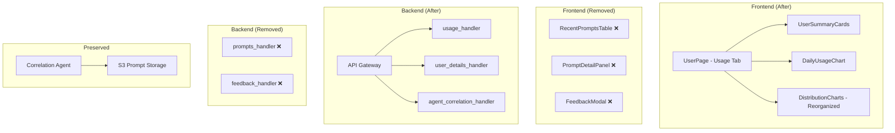

# Design Document: Remove Prompt Content Visibility

## Overview

This design describes the removal of all prompt content visibility from the Kiro Cost Analyzer (KCA) application. The change eliminates the prompts table, detail panel, feedback workflow, and backend prompts API endpoints to prevent exposure of proprietary code, internal file names, business logic, and infrastructure details through the UI.

The distribution charts (model, trigger, category) are preserved and reorganized into a more spacious layout that takes advantage of the freed space. The correlation agent continues to operate unchanged — its `promptSummary` field contains only brief AI-generated descriptions, not raw content.

### Scope

**In scope:**
- Delete `RecentPromptsTable`, `PromptDetailPanel`, and `FeedbackModal` components
- Remove prompts-related state, fetching logic, and split panel usage from `UserPage`
- Remove `/api/prompts` and `/api/prompts/{requestId}` backend routes
- Remove `/api/feedback` and `/api/prompts/{requestId}/feedback` backend routes
- Remove `FeedbackAdminPage` (if it exists as a route/page) from navigation and routing
- Reorganize `DistributionCharts` to use a larger layout (2-column + full-width row, `size="large"`)
- Clean up unused TypeScript types and translation keys

**Out of scope:**
- Correlation agent modifications (preserved as-is)
- DynamoDB data or S3 prompt storage (data remains for ETL/agent use)
- ETL pipeline changes

## Architecture

The change is a subtraction from the existing architecture. No new services or components are introduced.



### Key Decisions

1. **Delete files rather than empty them** — Components that are fully removed (`RecentPromptsTable`, `PromptDetailPanel`, `FeedbackModal`) are deleted from the codebase rather than left as empty shells. This keeps the codebase clean.

2. **Backend routes return 404** — After removing the handler imports and route logic, the existing catch-all `_route` function already returns 404 for unknown paths. No explicit "gone" response is needed.

3. **Keep `useSplitPanel` hook** — The `SplitPanelProvider` and `useSplitPanel` hook remain in the codebase since they are a general-purpose utility that may be used by other features. Only the prompt-specific usage in `UserPage` is removed.

4. **Distribution charts layout: 2+1 pattern** — Model and Trigger charts share the first row (6 columns each), and the Category chart gets a full-width row below. This gives each chart significantly more space than the current equal-thirds layout.

## Components and Interfaces

### Frontend Components Modified

| Component | Change |
|-----------|--------|
| `UserPage.tsx` | Remove prompts state, fetching, split panel usage, `RecentPromptsTable` render, `PromptDetailPanel` render |
| `DistributionCharts.tsx` | Change grid from `[4,4,4]` to `[6,6]` + full-width row; change pie chart `size` from `"medium"` to `"large"` |
| `App.tsx` | Remove `FeedbackAdminPage` route and navigation link (if present) |

### Frontend Components Deleted

| Component | Reason |
|-----------|--------|
| `RecentPromptsTable.tsx` | No longer rendered; prompts table removed |
| `PromptDetailPanel.tsx` | No longer rendered; prompt detail removed |
| `FeedbackModal.tsx` | No longer rendered; feedback workflow removed |
| `FeedbackAdminPage.tsx` | No longer routed; admin feedback review removed |

### Backend Handlers Modified

| Handler | Change |
|---------|--------|
| `handler.py` | Remove imports of `prompts_handler` and `feedback_handler`; remove route patterns and route logic for `/api/prompts`, `/api/prompts/{requestId}`, `/api/prompts/{requestId}/feedback`, `/api/feedback`, `/api/feedback/{feedbackId}/review` |

### Backend Handlers Deleted (or left unused)

| Handler | Decision |
|---------|----------|
| `prompts_handler.py` | Delete — no longer called from any route |
| `feedback_handler.py` | Delete — no longer called from any route |

### DistributionCharts New Layout

```tsx
// Before: Grid with [4, 4, 4] — three equal columns
<Grid gridDefinition={[{ colspan: 4 }, { colspan: 4 }, { colspan: 4 }]}>

// After: Grid with [6, 6] for first row, then full-width category chart
<SpaceBetween size="l">
  <Grid gridDefinition={[{ colspan: 6 }, { colspan: 6 }]}>
    {/* Model chart */}
    {/* Trigger chart */}
  </Grid>
  <div>
    {/* Category chart — full width */}
  </div>
</SpaceBetween>
```

Pie charts change from `size="medium"` to `size="large"` to fill the additional space.

## Data Models

### TypeScript Types Removed

```typescript
// Remove from types/index.ts:
interface PromptDetail { ... }        // Used only by PromptDetailPanel
interface PromptsListResponse { ... } // Used only by UserPage prompts fetching
interface FeedbackSubmission { ... }  // Used only by FeedbackModal
interface FeedbackRecord { ... }      // Used only by FeedbackAdminPage
interface FeedbackListResponse { ... } // Used only by FeedbackAdminPage
interface FeedbackReviewAction { ... } // Used only by FeedbackAdminPage
```

### TypeScript Types Preserved

```typescript
interface PromptMetadata { ... }  // Check if still used by correlation or other components
// If only used by RecentPromptsTable → remove
// If used by correlation agent types → preserve
```

After inspection: `PromptMetadata` is used only by `RecentPromptsTable` and `PromptsListResponse`. It should be removed.

### Backend Data (Unchanged)

- DynamoDB prompt metadata records (`PROMPT#{timestamp}#{requestId}`) remain — they are read by the ETL and correlation agent
- S3 prompt content files remain — read by the correlation agent's `get_kiro_usage` tool
- No data migration or deletion is required

### Translation Keys Removed

Keys with these prefixes are removed from both `en.json` and `pt-BR.json`:
- `prompts.*` — table headers, filters, empty states
- `promptDetail.*` — detail panel labels, sections
- `feedback.*` — modal labels, admin page, status messages

## Error Handling

This feature is primarily a removal. Error handling considerations are minimal:

1. **Backend 404 responses** — After removing the prompts and feedback routes, any request to `/api/prompts/*` or `/api/feedback/*` falls through to the existing catch-all in `_route()`, which returns:
   ```json
   {"error": "NotFound", "message": "Route not found: GET /api/prompts"}
   ```
   No new error handling code is needed.

2. **Frontend removed state** — By deleting the prompts-related state and fetch logic from `UserPage`, there are no error states to handle for prompts. The Usage tab's error handling for `usageData` (summary, daily usage, distributions) remains unchanged.

3. **Build-time validation** — TypeScript compilation and the `check-locales.ts` script catch any dangling references to removed types or translation keys. If a reference is missed, the build fails with a clear error.

4. **Correlation agent resilience** — The agent is not modified. Its existing error handling for S3 reads and prompt analysis remains intact.

## Testing Strategy

### Why Property-Based Testing Does Not Apply

This feature involves:
- **Deleting components and routes** — no new logic to test with varied inputs
- **Reorganizing a UI layout** — visual rendering concern, not algorithmic
- **Removing TypeScript types** — verified by compilation

There are no pure functions, data transformations, parsers, or algorithms introduced. No acceptance criterion benefits from 100+ randomized iterations. All criteria are verifiable through example-based tests, smoke tests, or integration tests.

### Test Approach

#### Unit Tests (Frontend — Vitest + Testing Library)

| Test | Validates |
|------|-----------|
| Usage tab renders without `RecentPromptsTable` | Req 1.1 |
| Usage tab renders without `PromptDetailPanel` | Req 2.1 |
| Usage tab does not call `/api/prompts` on load | Req 1.2, 1.4 |
| `DistributionCharts` renders with `size="large"` pie charts | Req 4.3 |
| `DistributionCharts` uses 2-column + full-width layout | Req 4.1, 4.4 |
| Navigation does not contain feedback admin link | Req 3.5 |
| App routes do not include feedback admin page | Req 3.3 |

#### Unit Tests (Backend — pytest + moto)

| Test | Validates |
|------|-----------|
| `GET /api/prompts` returns 404 | Req 5.1 |
| `GET /api/prompts/{requestId}` returns 404 | Req 5.2 |
| `POST /api/prompts/{requestId}/feedback` returns 404 | Req 5.3 |
| `GET /api/feedback` returns 404 | Req 3.4 |
| `PUT /api/feedback/{id}/review` returns 404 | Req 3.4 |
| Existing routes (usage, config, correlation) still work | Req 6.1 |

#### Smoke Tests

| Test | Validates |
|------|-----------|
| `npm run build` succeeds (TypeScript compilation + locale check) | Req 7.5, 7.6 |
| Deleted files do not exist: `RecentPromptsTable.tsx`, `PromptDetailPanel.tsx`, `FeedbackModal.tsx` | Req 2.3, 2.4, 3.1 |
| No references to `/api/feedback` in frontend source | Req 3.2 |
| No `prompts.`, `promptDetail.`, `feedback.` keys in locale files | Req 7.4 |

#### Integration Tests

| Test | Validates |
|------|-----------|
| Correlation endpoint still returns `promptSummary` field | Req 6.1 |
| Correlation agent `get_kiro_usage` tool still accesses S3 prompt data | Req 6.3 |

### Test Execution

- Frontend tests: `cd frontend && npm run test` (vitest --run)
- Backend tests: `pytest tests/` from project root
- Build verification: `cd frontend && npm run build`

