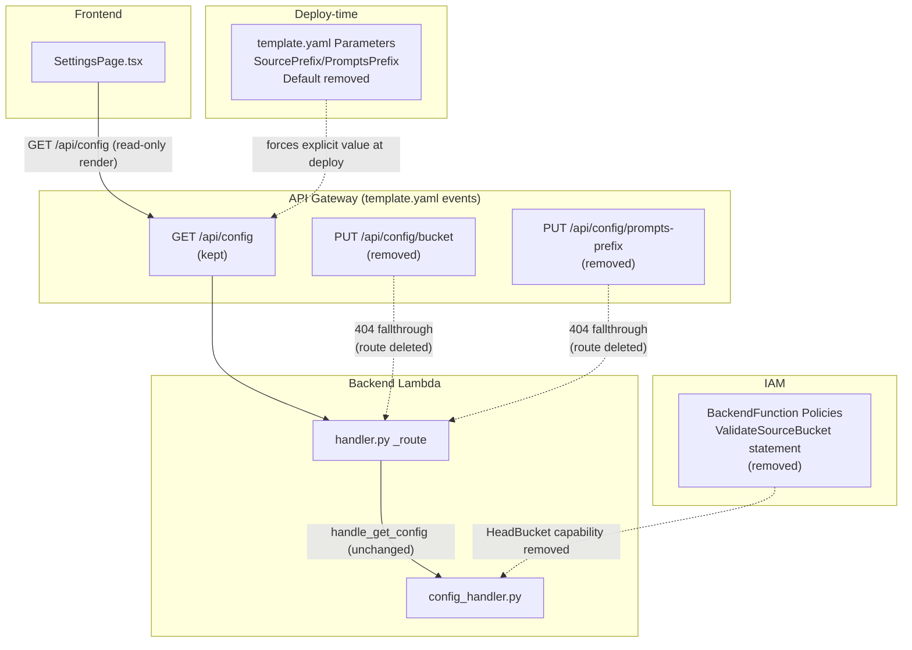

# Design Document

## Overview

This feature removes the "reconfigure source bucket at runtime" capability from Kiro Cost Analyzer and replaces it with read-only visibility. Concretely:

- The Settings page's "Source Bucket" and "Prompts Configuration" containers switch from editable `Form`/`Input`/`Button` blocks to read-only key-value display, sourced from the existing `GET /api/config` response.
- `PUT /api/config/bucket` and `PUT /api/config/prompts-prefix` are removed end-to-end: the API Gateway event definitions in `template.yaml`, the dispatch branches in `backend/handler.py`, and the handler functions (`handle_put_config_bucket`, `handle_put_config_prompts_prefix`) in `backend/handlers/config_handler.py`.
- The `ValidateSourceBucket` IAM statement on `BackendFunction` — the wildcard `s3:ListBucket` on `Resource: "arn:aws:s3:::*"` that existed only to let `handle_put_config_bucket` call `HeadBucket` against an admin-supplied bucket name — is deleted along with the handler it served.
- `SourcePrefix` and `PromptsPrefix` become required template parameters (no `Default` key), matching `SourceBucketName`'s existing shape, while still accepting an explicitly-supplied empty string for bucket-root deployments.
- Dead tests, translation keys, and documentation describing the removed write path are cleaned up; `docs/security.md` and `docs/changelog.md` are updated to record the fix as implemented rather than planned.

The read path (`GET /api/config`, `handle_get_config`) is untouched — this is a subtraction of write surface, not a change to how configuration is read or stored.

### Why this design

The alternative most likely to be proposed instead of full removal is "narrow the `ValidateSourceBucket` resource to the configured bucket." That doesn't work here: the bucket name in `handle_put_config_bucket` is arbitrary *admin-supplied request-time input* (potentially a cross-account bucket, per `.kiro/specs/cross-account-s3-access/`), not a value known at deploy time that a template-parameter-scoped `Resource` ARN could reference. The only way to shrink the grant is to remove the code path that needs it — which is what `docs/security.md` and `docs/changelog.md` already record as the planned, not-yet-implemented fix this feature completes.

## Architecture

No new components are introduced. This is a subtractive change across four existing layers:



Data flow for the retained path is unchanged: `SettingsPage` calls `GET /api/config` on mount, `handler.py` dispatches to `config_handler.handle_get_config`, which reads `bucketName`, `sourcePrefix`, `promptsPrefix` (and other fields, out of scope here) from SSM Parameter Store and returns them as strings. The removed paths simply drop out of the dispatch chain and fall through to the existing generic `404 NotFound` response, which already exists in `handler.py` and requires no new code.

## Components and Interfaces

### 1. `frontend/src/pages/SettingsPage.tsx` — read-only Data tab

The `dataContent` block currently renders three `Container`s on the "Data" tab: "Source Bucket" (editable), "Prompts Configuration" (editable), and "Cross-Account Access" (editable, out of scope — untouched). Only the first two change.

**Removed from `dataContent`:**
- The `Form`/`FormField`/`Input` markup for `bucketName` and `sourcePrefix` inside the "Source Bucket" `Container`, and its `Form actions` `Button` (`settings.bucket.submit`).
- The `Form`/`FormField`/`Input` markup for `promptsPrefix` inside the "Prompts Configuration" `Container`, and its `Form actions` `Button` (`settings.prompts.submit`).
- State: `saving`, `savingPrompts` (no longer needed — nothing to save).
- Handlers: `handleSave`, `handleSavePromptsPrefix`.
- The `bucketName`/`sourcePrefix`/`promptsPrefix` `useState` setters remain (still populated from `fetchConfig`), but they now feed read-only display instead of controlled `Input`s. `setBucketName`/`setSourcePrefix`/`setPromptsPrefix` are called only from `fetchConfig`; no `onChange` handler calls them anymore.

**Added — read-only key-value display**, replacing the removed `Form` blocks. A small local helper handles the placeholder substitution (Requirements 1.6, 2.2), reused for all three read-only fields to avoid duplicating the empty-string check three times:

```tsx
const NOT_CONFIGURED_PLACEHOLDER = '—';

function displayValue(value: string): string {
  return value.trim() === '' ? NOT_CONFIGURED_PLACEHOLDER : value;
}
```

`displayValue` operates on the raw string already fetched into state — it does not re-fetch or re-derive `loading`/`error`, which are handled separately (see below). Trimming, not just an empty-string check, is deliberate: the backend's `_get_parameter` can only return `""` on failure, but treating a whitespace-only stored value the same as empty keeps the placeholder logic consistent with how the rest of the page already treats blank input (see the existing `bucketName.trim()` check being removed elsewhere — this preserves the "whitespace counts as not configured" intuition without introducing new backend behavior).

"Source Bucket" container becomes:

```tsx
<Container header={<Header variant="h2">{t('settings.bucket.title')}</Header>}>
  <ColumnLayout columns={2} variant="text-grid">
    <div>
      <Box variant="awsui-key-label">{t('settings.bucket.nameField.label')}</Box>
      <div>{displayValue(bucketName)}</div>
    </div>
    <div>
      <Box variant="awsui-key-label">{t('settings.bucket.sourcePrefixField.label')}</Box>
      <div>{displayValue(sourcePrefix)}</div>
    </div>
  </ColumnLayout>
</Container>
```

This reuses the exact `ColumnLayout`/`Box variant="awsui-key-label"` pattern already used for the ETL status container elsewhere in the same file (see `etlContent`), keeping the page visually consistent. The field `description` keys (`settings.bucket.nameField.description`, `settings.bucket.sourcePrefixField.description`) are retained per Requirement 7.5 but are no longer rendered as `FormField` descriptions — Cloudscape's key-value `Box` pattern has no description slot. They are kept in the catalog (unused by this container) because Requirement 7.5 requires their retention; nothing in the requirements mandates they be visually surfaced from this specific container going forward.

"Prompts Configuration" container becomes state-aware because it has its own loading/error requirements (2.3, 2.4) independent of the page-level `loading`/`error`, which cover the combined `GET /api/config` + `GET /api/config/schedule` fetch used by other tabs:

```tsx
<Container header={<Header variant="h2">{t('settings.prompts.title')}</Header>}>
  {loading ? (
    <StatusIndicator type="loading">{t('common.loading')}</StatusIndicator>
  ) : promptsConfigError ? (
    <StatusIndicator type="error">{t('common.error.loadData')}</StatusIndicator>
  ) : (
    <div>
      <Box variant="awsui-key-label">{t('settings.prompts.prefixField.label')}</Box>
      <div>{displayValue(promptsPrefix)}</div>
    </div>
  )}
</Container>
```

`promptsConfigError` is a new derived value — not new state — computed from the existing `error` state (`error !== null`) at render time; no new `useState` is introduced. Requirement 2.4 additionally requires that a failed refetch must not show a previously-loaded value. `fetchConfig`'s existing `try/catch` structure already only calls `setPromptsPrefix` inside the `try` block on success, so a failed `fetchConfig` call naturally leaves the *previous* value in state — Requirement 2.4 is violated only if the container renders that stale value instead of the error branch. Because the render above checks `error` (truthy) before falling through to the value display, a failed refetch shows the error state regardless of what stale value remains in `promptsPrefix`, satisfying 2.4 without any special-casing of "first load" vs. "refetch."

**Frontend translation keys removed from `en.json`/`pt-BR.json`** (Requirement 7.4): `settings.bucket.submit`, `settings.bucket.nameField.placeholder`, `settings.bucket.sourcePrefixField.placeholder`, `settings.error.bucketNameRequired`, `settings.error.save`, `settings.success.saved`, `settings.prompts.submit`, `settings.prompts.prefixField.placeholder`, `settings.error.savePromptsPrefix`, `settings.success.promptsPrefixSaved`.

**Retained** (Requirement 7.5): `settings.bucket.nameField.label`, `settings.bucket.nameField.description`, `settings.bucket.sourcePrefixField.label`, `settings.bucket.sourcePrefixField.description`, `settings.prompts.prefixField.label`, `settings.prompts.prefixField.description`, `settings.bucket.title`, `settings.prompts.title`.

No new translation keys are needed: `common.loading` and `common.error.loadData` already exist in both catalogs (confirmed in `frontend/src/locales/en.json`), so the read-only Prompts Configuration loading/error states reuse them rather than introducing new keys that would need parity bookkeeping.

### 2. `backend/handler.py` — dispatch chain removal

Two `if http_method == "PUT" and path == ...` branches are deleted verbatim from `_route`:

```python
# REMOVED
if http_method == "PUT" and path == "/api/config/bucket":
    if not _is_admin(claims):
        return _build_response(403, {...})
    result = config_handler.handle_put_config_bucket(body)
    return _build_response(200, result)

# REMOVED
if http_method == "PUT" and path == "/api/config/prompts-prefix":
    if not _is_admin(claims):
        return _build_response(403, {...})
    result = config_handler.handle_put_config_prompts_prefix(body)
    return _build_response(200, result)
```

No replacement branch is added. A `PUT /api/config/bucket` or `PUT /api/config/prompts-prefix` request now falls through every remaining `if` in `_route` and reaches the existing tail:

```python
# --- Unknown route ---
return _build_response(404, {
    "error": "NotFound",
    "message": f"Route not found: {http_method} {path}",
})
```

This satisfies Requirement 3.4/4.4 (404 fallthrough) without any new code — it is a direct consequence of deleting the two branches above. Nothing else in `_route` changes; the surrounding admin-check branches for `/api/config/identity-store-id`, `/api/config/source-bucket-role-arn`, `/api/config/identity-store-role-arn`, `/api/config/prompt-history-enabled`, `/api/config/engagement-thresholds`, `/api/config/tier-pricing` are untouched.

### 3. `backend/handlers/config_handler.py` — handler function removal

`handle_put_config_bucket` (lines ~97–150) and `handle_put_config_prompts_prefix` (lines ~160–180) are deleted in full. `_get_s3_client` becomes unused within this module once `handle_put_config_bucket` (the only caller) is removed, and is deleted too — nothing else in `config_handler.py` imports or calls an S3 client. `_get_ssm_client`, `_get_parameter`, `handle_get_config`, and every other `handle_put_config_*`/`handle_get_schedule` function are unmodified.

The module docstring (`"""Handlers for GET /api/config, PUT /api/config/bucket, PUT /api/config/source-bucket-role-arn, and GET /api/config/schedule."""`) is updated to drop the removed route from its description:

```python
"""Handlers for GET /api/config, PUT /api/config/source-bucket-role-arn, and GET /api/config/schedule."""
```

### 4. `template.yaml` — `BackendFunction` API events

Two `Events` entries under `BackendFunction` are deleted:

```yaml
# REMOVED
ConfigBucketPut:
  Type: Api
  Properties:
    RestApiId: !Ref ApiGateway
    Path: /api/config/bucket
    Method: PUT

# REMOVED
ConfigPromptsPrefixPut:
  Type: Api
  Properties:
    RestApiId: !Ref ApiGateway
    Path: /api/config/prompts-prefix
    Method: PUT
```

Removing the SAM `Events` entry means API Gateway itself no longer has a `PUT /api/config/bucket`/`PUT /api/config/prompts-prefix` resource/method wired to `BackendFunction` after redeploy — a request to that path+method returns API Gateway's own `{"message":"Missing Authentication Token"}` 403, not the Lambda's 404. Requirement 3.4 is explicit that the Lambda-level 404 guarantee (Component 2 above) holds "regardless of whether any residual `ConfigBucketPut` API Gateway event definition remains configured" — i.e., the dispatch-chain removal alone satisfies the requirement even before a redeploy propagates the `template.yaml` change. Both are still removed together for a clean deploy state.

### 5. `template.yaml` — `BackendFunction` IAM policy (`ValidateSourceBucket` removal + least-privilege review)

The `ValidateSourceBucket` statement is deleted in full, including its large `holmes:suppress`/`TODO` comment block (the comment itself documented the *planned* removal — once removed, the comment describing the accepted trade-off is obsolete):

```yaml
# REMOVED
- Sid: ValidateSourceBucket
  Effect: Allow
  Action:
    - s3:ListBucket
  # ...holmes:suppress / TODO comment block...
  Resource: "arn:aws:s3:::*"
```

**Least-privilege review of the remaining `BackendFunction` statements** (Requirement 5.2 requires confirming no *other* statement grants an action unused by retained code, or a resource broader than what retained code accesses):

| Statement (`Sid`) | Actions | Resource | Retained caller | Verdict |
|---|---|---|---|---|
| `ReadDataBucket` | `s3:GetObject`, `s3:ListBucket`, `s3:GetBucketLocation`, `s3:PutObject` | `DataBucket` + `/*` | `prompts_handler.handle_get_prompt_detail` (`get_object` for `contentInS3` prompts); `few_shot_exporter.FewShotExporter` (`get_object`/`put_object` for `config/few-shot-examples.json`, consumed by the ETL prompt categorizer per `.kiro/specs/category-feedback-loop/`) | Kept unchanged — scoped to a single named bucket, and every action listed is exercised by retained code. `s3:ListBucket`/`s3:GetBucketLocation` here are already resource-scoped to `DataBucket`, unlike the removed statement's `arn:aws:s3:::*`, so this is not the finding Requirement 5 targets. |
| `DynamoDBReadAccess`, `AnalyticsTableReadAccess`, `FeedbackTableAccess`, `AnalyticsTableWriteForGit` | `dynamodb:*` (Get/Query/Scan/Put/Update/BatchGetItem/DeleteItem as listed) | Named table ARNs / `/index/*` | `usage_handler`, `user_details_handler`, `git_repo_handler`, `git_mapping_handler`, etc. | Kept unchanged — each action maps to a retained handler's DynamoDB call; resources are per-table ARNs, not wildcards. |
| `StepFunctionsAccess` | `states:StartExecution` | `EtlStateMachine` | `etl_trigger_handler.handle_etl_trigger` | Kept unchanged. |
| `SSMAccess` | `ssm:GetParameter`, `ssm:PutParameter` | `parameter/kiro-cost-analyzer/*` | `config_handler.handle_get_config` (Get); `handle_put_config_identity_store_id`, `handle_put_config_source_bucket_role_arn`, `handle_put_config_identity_store_role_arn`, `handle_put_config_prompt_history_enabled` (Put — all retained) | Kept unchanged — `ssm:PutParameter` remains necessary because other retained write endpoints under `/api/config/*` still write to this prefix; only the bucket/prompts-prefix writers are removed, not SSM write access generally. |
| `CognitoAdminAccess` | `cognito-idp:Admin*`, `ListUsers` | `CognitoUserPool` | `users_handler` | Kept unchanged. |
| `SchedulerReadAccess` | `scheduler:GetSchedule` | `schedule/default/*` | `config_handler.handle_get_schedule` | Kept unchanged. |
| `SSMGitTokensAccess`, `KMSForGitTokens` | SSM/KMS for Git PATs | `parameter/kiro-cost-analyzer/git-tokens/*`, KMS via `ssm` service | `git_repo_handler` | Kept unchanged. |
| `KMSForDynamoDB` | `kms:Decrypt`/`GenerateDataKey`/`DescribeKey` | `KCAEncryptionKey` | All DynamoDB-backed handlers | Kept unchanged. |
| `BedrockAgentCoreInvoke`, `InvokeCorrelationWorker` | `bedrock-agentcore:InvokeAgentRuntime`, `lambda:InvokeFunction` | Runtime ARN pattern, `CorrelationWorkerFunction` | `agent_correlation_handler` | Kept unchanged. |

No statement besides `ValidateSourceBucket` is removed or narrowed. Every remaining action is exercised by a retained code path in `backend/handler.py`/`backend/handlers/*.py`, and every remaining resource is already scoped to a specific stack resource (table ARN, bucket ARN, key ARN, or a service-specific pattern) rather than an account-wide wildcard — `ValidateSourceBucket`'s `arn:aws:s3:::*` was the sole outlier, which is why it is the only statement this requirement removes.

### 6. `template.yaml` — `Parameters.SourcePrefix` / `Parameters.PromptsPrefix`

```yaml
# BEFORE
SourcePrefix:
  Type: String
  Description: "Base prefix up to KiroLogs/ (e.g., activities/AWSLogs/123456789012/KiroLogs/)"
  Default: ""

# AFTER
SourcePrefix:
  Type: String
  Description: "Base prefix up to KiroLogs/ (e.g., activities/AWSLogs/123456789012/KiroLogs/)"
```

```yaml
# BEFORE
PromptsPrefix:
  Type: String
  Default: ""
  Description: "Base prefix for prompt logs in the source bucket (e.g., prompts/AWSLogs/123456789012/KiroLogs/)"

# AFTER
PromptsPrefix:
  Type: String
  Description: "Base prefix for prompt logs in the source bucket (e.g., prompts/AWSLogs/123456789012/KiroLogs/)"
```

Only the `Default: ""` line is removed from each; `Type`, `Description`, and every other parameter (`SourceBucketName`, `AdminEmail`, `EtlScheduleExpression`, `IdentityStoreId`, `SourceBucketRoleArn`, `IdentityStoreRoleArn`, `CorrelationAgentRuntimeArn`) are untouched. `SourceBucketName` already has no `Default` today and needs no change (Requirement 9.1 is a no-op confirmation). This makes CloudFormation reject a deploy that omits `SourcePrefix`/`PromptsPrefix` from `parameter_overrides`, while still accepting an explicitly-passed `SourcePrefix=""`/`PromptsPrefix=""` — CloudFormation's required-parameter validation only rejects *absence* of a value in the request, not an explicit empty string (this is AWS-managed CloudFormation behavior, not something this codebase implements or can unit test directly; see Correctness Properties for how this is validated at the template-structure level instead).

`Conditions.HasSourceBucketRoleArn`/`HasIdentityStoreRoleArn`, the `ReadSourceBucket` statements on `ListFilesFunction`/`ParseFunction` (scoped to `SourceBucketName` only, never referencing `SourcePrefix`), and every other use of `SourcePrefix`/`PromptsPrefix` (the `SourcePrefixParameter`/`PromptsPrefixParameter` `AWS::SSM::Parameter` resources, which pass `!Ref SourcePrefix`/`!Ref PromptsPrefix` straight through unchanged) are unaffected — the `Default` removal only changes whether SAM/CloudFormation requires the value to be supplied, not any downstream `!Ref` usage.

### 7. `samconfig.toml` — no change required

`default.deploy.parameters.parameter_overrides` already includes explicit, non-empty `SourceBucketName`, `SourcePrefix`, and `PromptsPrefix` entries:

```
parameter_overrides = "SourceBucketName=\"s3-logs-kiro-vinibat-serpro\" SourcePrefix=\"activities/AWSLogs/673826570926/KiroLogs/\" PromptsPrefix=\"prompts/AWSLogs/673826570926/KiroLogs/\" ..."
```

Requirement 9.5 only requires this to *remain* the case after the `Default` removal — since these values are already explicitly present, no edit to `samconfig.toml` is needed. This is confirmed, not modified.

### 8. `docs/deploy.md` — parameter table update

The `--guided` parameter table changes two rows:

```markdown
<!-- BEFORE -->
| `SourcePrefix` | no | CSV prefix, e.g. `activities/AWSLogs/<source-account-id>/KiroLogs/` |
| `PromptsPrefix` | no | prompt-log prefix, e.g. `prompts/AWSLogs/<source-account-id>/KiroLogs/` |

<!-- AFTER -->
| `SourcePrefix` | yes | CSV prefix, e.g. `activities/AWSLogs/<source-account-id>/KiroLogs/`. An explicitly empty string (`SourcePrefix=""`) is accepted for a bucket-root deployment. |
| `PromptsPrefix` | yes | prompt-log prefix, e.g. `prompts/AWSLogs/<source-account-id>/KiroLogs/`. An explicitly empty string (`PromptsPrefix=""`) is accepted for a bucket-root deployment. |
```

No other row in the table (`SourceBucketName`, `AdminEmail`, `IdentityStoreId`, `SourceBucketRoleArn`) changes. The `--parameter-overrides` example command blocks later in the same file already pass explicit `SourcePrefix=`/`PromptsPrefix=` values and need no edit.

### 9. `docs/security.md` — finding closed out

The "Known finding, planned fix" section is replaced with a closed-finding note:

```markdown
<!-- REMOVED -->
## Known finding, planned fix — `s3:ListBucket` wildcard on the source-bucket validation endpoint
...(planned-fix paragraph)...

<!-- ADDED -->
## Resolved finding — source-bucket reconfiguration feature removed

`template.yaml`'s `ValidateSourceBucket` IAM statement, which granted `s3:ListBucket` on `Resource: "arn:aws:s3:::*"` so `PUT /api/config/bucket` could validate an admin-supplied bucket name via `HeadBucket`, has been removed. The Settings page's bucket/prefix/prompts-prefix fields are now read-only, and `PUT /api/config/bucket`/`PUT /api/config/prompts-prefix` no longer exist. Changing the source bucket, source prefix, or prompts prefix after initial deployment now requires a redeploy with updated `SourceBucketName`, `SourcePrefix`, and `PromptsPrefix` template parameters (all three are required parameters — see `docs/deploy.md`).
```

### 10. `docs/changelog.md` — new entry + TODO rewrite

A new entry is added under the `## Unreleased` heading (the top of the file), since this is a new change not yet part of a numbered release, per the file's existing convention of collecting unreleased work at the top before it is promoted to a version heading:

```markdown
## Unreleased

### Security — Removed the source-bucket hot-swap feature and its wildcard IAM grant

- **Fixed, not just documented.** The Settings page's bucket name, source prefix, and prompts prefix fields are now read-only. `PUT /api/config/bucket`, `PUT /api/config/prompts-prefix`, `handle_put_config_bucket`, `handle_put_config_prompts_prefix`, and the `ValidateSourceBucket` IAM statement (`s3:ListBucket` on `Resource: "arn:aws:s3:::*"`) are all removed.
- **Why now**: this closes out the `TODO` tracked in the `v3.3` entry below and in `docs/security.md` — the wildcard grant was carried as a documented, accepted trade-off because the endpoint needed to validate arbitrary admin-supplied bucket names via `HeadBucket`. Removing the endpoint removes the need for the grant.
- **Deploy-time trade-off**: `SourcePrefix` and `PromptsPrefix` are now required template parameters (no `Default`), matching `SourceBucketName`. An explicitly empty string is still accepted for a bucket-root deployment. Changing the source bucket, source prefix, or prompts prefix now requires a redeploy.
- **Tests** — removed `TestPutConfigBucket` (`tests/test_backend_handler.py`) and `TestHandlePutConfigBucket` (`tests/test_config_handler.py`); removed the corresponding write-path assertions from `frontend/src/pages/__tests__/SettingsPage.test.tsx` and `ptBrSnapshots.test.tsx`. Ten now-dead translation keys removed from `en.json`/`pt-BR.json`, verified with `npm run check:locales`.
```

The existing `## v3.3` entry's TODO block is rewritten in place, not left as-is, per Requirement 8.4:

```markdown
<!-- BEFORE, under ## v3.3 -->
### TODO (planned, not yet implemented) — Remove the source-bucket hot-swap feature
...

<!-- AFTER, under ## v3.3 -->
### Note — source-bucket hot-swap feature removal tracked and completed

This entry originally tracked the `ValidateSourceBucket` wildcard IAM finding as a `TODO`. The feature removal described here has since been completed — see the "Security — Removed the source-bucket hot-swap feature and its wildcard IAM grant" entry above.
```

Rewriting in place (rather than deleting the `v3.3` entry outright) preserves the historical record of *when the finding was first identified* while satisfying Requirement 8.4's demand that it no longer read as "planned, not yet implemented."

## Data Models

No data model changes. `AppConfig` (`frontend/src/types/index.ts`) is unchanged — `bucketName`, `sourcePrefix`, and `promptsPrefix` remain `string` fields, still populated by the unmodified `handle_get_config`. No backend response schema changes; no DynamoDB or SSM parameter schema changes. The removal is purely of write-side code paths and UI controls, not of any stored or transmitted shape.

## Correctness Properties

*A property is a characteristic or behavior that should hold true across all valid executions of a system-essentially, a formal statement about what the system should do. Properties serve as the bridge between human-readable specifications and machine-verifiable correctness guarantees.*

This feature is largely a removal of code and configuration, so most acceptance criteria resolve to static/structural checks (import-time absence of a function, absence of a YAML key, absence or presence of a doc string) that a single example-based or smoke test verifies once — not to a behavior that varies meaningfully across a large input space. Two genuine PBT-suitable properties remain, both stated below, using Hypothesis (Python) for the backend and fast-check (TypeScript) for the frontend, consistent with this project's existing conventions (`.kiro/steering/development-standards.md` §7.2).

### Property 1: Removed write routes always 404 regardless of request content

*For any* HTTP request body (including empty, malformed-looking, or a well-formed `{"bucketName": ..., "sourcePrefix": ...}`/`{"promptsPrefix": ...}` payload) sent as `PUT /api/config/bucket` or `PUT /api/config/prompts-prefix` to the Config_API, the response SHALL be the generic 404 `NotFound` fallback (`statusCode == 404`, `body.error == "NotFound"`), regardless of the caller's admin status.

**Validates: Requirements 3.1, 3.4, 4.1, 4.4**

*Rationale*: this generalizes Requirements 3.1/3.4/4.1/4.4 into one property parameterized over the two removed paths and an arbitrary request body/admin-group combination. Varying the body proves there is truly no reachable conditional branch left in the dispatch chain — a residual, incorrectly-guarded branch would only reveal itself under some inputs (e.g., a specific body shape or an admin vs. non-admin caller), so a single fixed example is weaker evidence of "no reachable branch" than testing across a randomized input space. This is testing our own routing logic with an in-memory Lambda handler call — no AWS calls — so 100 iterations are cheap.

### Property 2: `GET /api/config` display fields are total and empty-parameter-tolerant

*For any* combination of SSM parameter states for `bucketName`, `sourcePrefix`, and `promptsPrefix` — each independently either present with an arbitrary string value, present with an empty string, or absent (raising on `get_parameter`) — `handle_get_config` SHALL return a 200-shaped dict where `bucketName`, `sourcePrefix`, and `promptsPrefix` are always present as `str` values, each equal to the underlying parameter's value when present, and equal to `""` when the parameter is absent or empty (the two cases being indistinguishable in the response).

**Validates: Requirements 1.1, 1.6, 2.1, 2.2, 6.1, 6.3**

*Rationale*: this generalizes the "read-only display always shows the fetched value, or a placeholder when empty" requirements (1.1/1.6/2.1/2.2 — which describe the same display-mapping behavior for three different fields) together with the backend contract those fields depend on (6.1's "always returns a string field" and 6.3's "missing vs. empty are observably identical") into a single property about the config-reading pipeline. Testing this at the `handle_get_config` layer with a mocked SSM client (no real AWS calls) is cheap and covers the input space (arbitrary strings, unicode, empty, absent) that a fixed example cannot. The frontend `displayValue` placeholder substitution (empty → `'—'`) is a one-line pure function; it is exercised by this same property's frontend counterpart below rather than a separate property, since both properties describe the identical "empty is normalized to a fixed non-blank marker" behavior at different layers.

### Consolidation Notes

Initial candidate properties also included: (a) a standalone "bucket name display shows fetched value" property, (b) a standalone "source prefix display shows fetched value" property, (c) a standalone "prompts prefix display shows fetched value" property, and (d) a standalone "empty string yields placeholder" property per field. These are all instances of the same underlying display-mapping function applied to three different fields and two branches (empty vs. non-empty) of the same input space, so they are consolidated into Property 2 above, generalized over which field and over the empty/non-empty branch, rather than kept as four-to-six near-duplicate properties. Similarly, the four route-removal criteria (3.1, 3.4, 4.1, 4.4) collapse into Property 1, parameterized over which of the two removed paths is exercised, rather than two nearly identical properties.

The catalog key-parity check (Requirement 7.6) is not written as a new property test: the project already has a build-time enforcement of this exact invariant (`scripts/check-locales.ts`, run via `npm run check:locales` before every `tsc -b`), and this feature's job is to remove ten keys and keep the two catalogs in sync under that existing mechanism — not to re-implement or re-validate the parity-checking algorithm itself. Running `npm run check:locales` once against the edited catalogs (a smoke check) is the correct-weight verification here; inventing a fast-check property that mutates synthetic catalog pairs to test the checker's *own* logic would be testing code this feature does not touch.

## Error Handling

- **Removed routes** (`PUT /api/config/bucket`, `PUT /api/config/prompts-prefix`): no new error handling is introduced. The existing generic 404 (`{"error": "NotFound", "message": "Route not found: {method} {path}"}`) and the existing top-level `try/except` in `lambda_handler` (500 on unexpected exceptions, 503 on DynamoDB throttling) already cover every case, since there is no new code path for either to fail in.
- **Frontend load failure** (Requirement 2.4): `fetchConfig`'s existing `catch` block already sets `error` on failure; the read-only Prompts Configuration container's render logic (Component 1 above) checks `error` before rendering a value, so a failed fetch shows `StatusIndicator type="error"` instead of a stale or blank prefix. No new error state or new catch block is introduced — the existing `error` state is reused.
- **Frontend loading state** (Requirement 2.3): reuses the existing page-level `loading` boolean, already set `true` for the duration of `fetchConfig` and `false` in its `finally` block. No new loading state.
- **SSM read failures** (Requirement 6.3): unchanged — `_get_parameter`'s existing `except Exception: return ""` continues to convert any SSM read failure (missing parameter, throttling, permission issue) into an empty string for that field only, without failing the overall `GET /api/config` request. This behavior is not modified by this feature; it is only exercised more directly now that it is the *only* way those three fields are ever unset (there is no longer a write path that could set them to a non-empty value from an admin's browser).
- **Deploy-time parameter omission** (Requirement 9.4): handled entirely by CloudFormation's own required-parameter validation once `Default` is removed from `SourcePrefix`/`PromptsPrefix` — `sam deploy` fails before any Lambda code runs if either parameter is omitted from `parameter_overrides` and not supplied via a guided prompt. No new code in this repository implements or duplicates that validation.

## Testing Strategy

**Backend (pytest + moto + Hypothesis):**

- `tests/test_backend_handler.py`: remove `TestPutConfigBucket`. Add a Hypothesis-based property test for Property 1 (parameterized over `path in ("/api/config/bucket", "/api/config/prompts-prefix")`, arbitrary JSON-serializable body via `st.dictionaries`/`st.one_of`, and `groups in ("Admins", "Viewers", "")`), minimum 100 iterations, tagged `# Feature: s3-source-config-readonly, Property 1: Removed write routes always 404 regardless of request content`. Keep `TestGetConfig` (unchanged route, already covered).
- `tests/test_config_handler.py`: remove `TestHandlePutConfigBucket` and the `handle_put_config_bucket` import. Add a Hypothesis-based property test for Property 2 against `handle_get_config`, using a mocked SSM client whose `get_parameter` is configured per-call to return an arbitrary string, an empty string, or raise, independently for the bucket-name/source-prefix/prompts-prefix parameter names; minimum 100 iterations, tagged `# Feature: s3-source-config-readonly, Property 2: GET /api/config display fields are total and empty-parameter-tolerant`. `TestHandleGetConfig*` classes already present are extended, not replaced.
- `tests/test_config_handler.py` (or a new small module-shape test): one example test asserting `hasattr(config_handler, "handle_put_config_bucket") is False` and `hasattr(config_handler, "handle_put_config_prompts_prefix") is False`, satisfying Requirements 3.2/4.2/6.2 without needing a property test.
- A template-structure smoke test (e.g., extending an existing `tests/test_*_template.py`-style module, following the pattern already used for `identity-store-role.yaml` per `docs/changelog.md`) that parses `template.yaml` once and asserts: no `ValidateSourceBucket` `Sid` under `BackendFunction.Properties.Policies`; no `ConfigBucketPut`/`ConfigPromptsPrefixPut` under `BackendFunction.Properties.Events`; `Parameters.SourcePrefix` and `Parameters.PromptsPrefix` have no `Default` key; `Parameters.SourceBucketName` still has no `Default` key; the `ReadSourceBucket` statements on `ListFilesFunction`/`ParseFunction` are byte-for-byte unchanged. Satisfies Requirements 3.3, 4.3, 5.1, 9.1, 9.2, 9.3, 9.6 as a single fast, deterministic smoke test — these are all fixed-artifact assertions, not something 100 randomized iterations would strengthen.
- A doc-content smoke test (grep-style, following the project's existing `test_backend_english_only.py`-style static-content-assertion pattern) asserting `docs/security.md` no longer contains the string `"Known finding, planned fix"` and does contain a reference to the redeploy requirement; `docs/changelog.md` no longer contains `"### TODO (planned, not yet implemented) — Remove the source-bucket hot-swap feature"` verbatim and does contain a new `Unreleased` entry mentioning `ValidateSourceBucket`. Satisfies Requirements 8.1–8.4.
- A locale-content smoke test (or extension of an existing locale test) asserting none of the ten removed keys are present in either `en.json` or `pt-BR.json`, and all eight retained keys are present in both. Satisfies Requirements 7.4/7.5. `npm run check:locales` is run as part of the standard build/test cycle to satisfy 7.6 — no new test wraps it.

**Frontend (Vitest + Testing Library + fast-check):**

- `frontend/src/pages/__tests__/SettingsPage.test.tsx`: no existing test in this file simulates bucket/prefix/prompts-prefix editing (confirmed by inspection — this file currently covers only the Identity Store Role ARN block), so Requirement 7.3 requires no removal here. Add: (a) an example test asserting the "Source Bucket" and "Prompts Configuration" containers render no `<input>`/`<textarea>` element and no button with the removed `settings.bucket.submit`/`settings.prompts.submit` label text, satisfying Requirements 1.2/1.3/1.4/2.5/2.6; (b) an example test for the loading state (fetch held pending) asserting a loading indicator renders in the Prompts Configuration container instead of a value, satisfying Requirement 2.3; (c) an example test for the fetch-failure state asserting an error indicator renders and no prefix text is shown, satisfying Requirement 2.4; (d) a fast-check property test for the frontend half of Property 2 — for arbitrary strings (including the empty string and whitespace-only strings) supplied as `bucketName`/`sourcePrefix`/`promptsPrefix` in the mocked `GET /api/config` response, the rendered container text equals the input value when non-blank, or the `'—'` placeholder when blank — minimum 100 runs, tagged with a comment referencing `Feature: s3-source-config-readonly, Property 2`.
- `frontend/src/pages/ptBrSnapshots.test.tsx`: no existing assertion in the `SettingsPage` snapshot test simulates editing (it renders once with an empty config and snapshots visible text). The snapshot itself will change (no more "Save Configuration"/"Save Prompts Prefix" button text, no more placeholder-attribute-only text, and the new `'—'` placeholders for the empty `bucketName`/`sourcePrefix`/`promptsPrefix` in the mocked response appear as visible text). The snapshot is regenerated as part of this change, not hand-edited, satisfying Requirement 7.3 (no editing assertions existed to remove) while keeping the file's existing role as a drift detector.
- No changes needed to `SettingsPage.test.tsx`'s existing Identity Store Role ARN tests or `PromptHistoryToggle`/`PricingSettingsPanel`/`EngagementSettingsPanel` component tests — those containers and their write paths are untouched by this feature.

**Unit test balance**: per project convention, unit/example tests are kept to the small number of genuinely distinct states (loading, error, absence-of-controls) and structural/static checks (function absence, YAML key absence, doc string absence); the two properties above carry the input-space coverage (arbitrary strings, arbitrary request bodies, arbitrary SSM parameter presence/absence) so that unit tests don't need to enumerate many near-duplicate string examples by hand.
