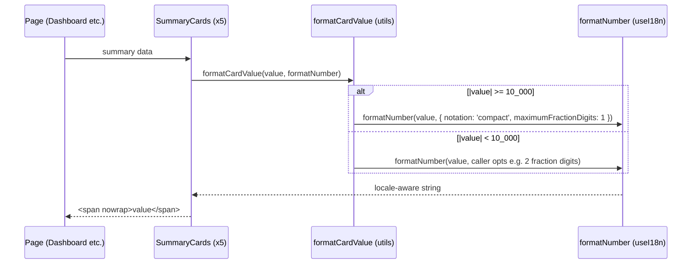

# Design — Summary Card Number Overflow

## Overview

Fix the mid-number line wrap on KPI cards by (a) abbreviating values ≥ 10,000 with locale-aware compact notation and (b) adding `white-space: nowrap` to value elements. A single shared utility (`formatCardValue`) encapsulates the threshold logic; each component passes its own `formatNumber` (from `useI18n()`), keeping formatting locale-bound.

### Design Decisions

1. **Compact notation over font shrinking**: the issue offers three options (nowrap, responsive font-size, abbreviation). Responsive font sizes fight Cloudscape's typography scale; abbreviation + nowrap fixes the root cause (value wider than the column) at every viewport, and `formatNumber` already passes `Intl.NumberFormatOptions` through, so `notation: 'compact'` works today with zero new dependencies.
2. **Threshold at 10,000**: values below 10K (e.g. `9,876.54`) fit the 4-column grid and keep full precision, which matters for credits. The reported repro (`10,342.18`) is exactly the first class of values that breaks.
3. **Helper receives `formatNumber`**: `formatCardValue(value, formatNumber, opts?)` — the utility stays a pure function (unit-testable without React) and never constructs its own `Intl.NumberFormat`, so the active locale is always respected.
4. **`nowrap` via inline style on the value `Box`**: Cloudscape `Box` accepts nested elements; a `<span style={{ whiteSpace: 'nowrap' }}>` wrapper avoids custom CSS files (per steering §4.2 "do not write custom CSS for components that already exist in Cloudscape" — an inline style on our own span is not a component override).

## Architecture



## Components and Interfaces

### 1. formatCardValue utility

**File:** `frontend/src/utils/formatCardValue.ts` (new)

```typescript
import type { Formatters } from '../i18n/formatters';

export const COMPACT_THRESHOLD = 10_000;

export interface CardValueOptions {
  /** Fraction digits used below the threshold (default 2, e.g. credits). */
  fractionDigits?: number;
}

/**
 * Formats a KPI card value. At or above COMPACT_THRESHOLD (absolute),
 * switches to locale-aware compact notation (e.g. 10.3K / 10,3 mil);
 * below it, keeps standard notation with the given fraction digits.
 */
export function formatCardValue(
  value: number,
  formatNumber: Formatters['formatNumber'],
  options?: CardValueOptions,
): string {
  const fractionDigits = options?.fractionDigits ?? 2;
  if (Math.abs(value) >= COMPACT_THRESHOLD) {
    return formatNumber(value, { notation: 'compact', maximumFractionDigits: 1 });
  }
  return formatNumber(value, {
    minimumFractionDigits: fractionDigits,
    maximumFractionDigits: fractionDigits,
  });
}
```

### 2. Component updates (x5)

**Files:** `frontend/src/components/{SummaryCards,AccountSummaryCards,UserSummaryCards,GitSummaryCards,ProductivitySummaryCards}.tsx`

Pattern per component (example from `SummaryCards.tsx`):

```tsx
const { t, formatNumber } = useI18n();
const fmt = (n: number) => formatCardValue(n, formatNumber);          // credits: 2-dec below 10K
const fmtInt = (n: number) => formatCardValue(n, formatNumber, { fractionDigits: 0 }); // counts

// value cell
<Box variant="awsui-value-large">
  <span style={{ whiteSpace: 'nowrap' }}>{summary ? fmt(summary.totalCredits) : '—'}</span>
</Box>
```

Integer fields currently rendered raw (`totalUsers.toString()`, message/conversation counts) switch to `fmtInt` so they also gain compact + nowrap behavior.

## Data Models

No new models. All summary fields are `number` (`UsageSummary`, `AccountTotals`, `UserDetailSummary`, git/productivity summaries).

## Correctness Properties

*A correctness property is a characteristic or behavior that must hold in all valid executions of a system.*

### Property 1: Threshold split

*For any* finite number `v`, `formatCardValue(v, formatNumber)` SHALL use compact notation if and only if `|v| >= 10_000`; below the threshold the output equals `formatNumber(v, { minimumFractionDigits: d, maximumFractionDigits: d })` for the configured `d`.

**Validates: Requirements 1.1, 1.2**

### Property 2: Locale coherence

*For any* value and any supported locale, the output of `formatCardValue` SHALL equal what `Intl.NumberFormat(locale, <same options>)` produces — i.e. the helper adds no locale-independent formatting of its own.

**Validates: Requirements 1.3**

## Error Handling

| Scenario | Component | Behavior |
|---|---|---|
| `summary` undefined (loading) | Summary cards | Existing `'—'` placeholder preserved, helper not called |
| Non-finite value (NaN/Infinity) | formatCardValue | Delegated to `Intl.NumberFormat` (renders `NaN`/`∞`) — no crash; upstream API contract makes this unreachable |

## Testing Strategy

Property-based (fast-check) + example-based tests for the pure utility; the five components are covered indirectly (helper is the single formatting path).

| Property | Test File | Tag |
|---|---|---|
| Property 1: Threshold split | `frontend/src/utils/formatCardValue.test.ts` | Feature: summary-card-number-overflow, Property 1: Threshold split |
| Property 2: Locale coherence | `frontend/src/utils/formatCardValue.test.ts` | Feature: summary-card-number-overflow, Property 2: Locale coherence |

Example cases: `10342.18 → "10.3K"` (en) / `"10,3 mil"` (pt-BR); `9876.54 → "9,876.54"` (en); `0`, negative values, integer counts with `fractionDigits: 0`.
