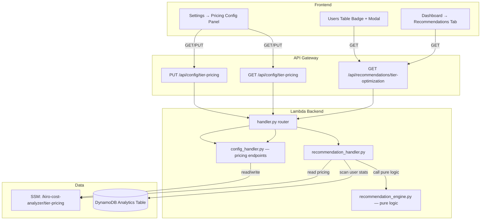

# Design Document — Tier Optimization Recommendations

## Overview

The Tier Optimization Recommendations feature adds a recommendation engine that analyzes per-user credit consumption, projects monthly usage, and determines whether upgrading or downgrading a subscription tier would reduce costs. The engine is implemented as a **pure-function module** (`recommendation_engine.py`) with no I/O, receiving all inputs explicitly. A thin handler (`recommendation_handler.py`) wires SSM config reads and DynamoDB queries into the engine.

On the frontend, recommendations surface in three places:
1. A new **Recommendations tab** on the Dashboard page
2. **Badges** in the existing Users table (↑ Upgrade / ↓ Downgrade)
3. A **detail Modal** on badge click

Pricing configuration is managed via a new **Pricing Settings Panel** in the Settings page, persisted to SSM Parameter Store.

---

## Architecture



### Key Design Decisions

1. **Pure engine, thin handler**: `recommendation_engine.py` contains all computation logic with zero I/O. It accepts explicit inputs (user data, pricing config, today's date) and returns recommendations. This enables comprehensive property-based testing without mocks.

2. **Decimal arithmetic**: All monetary calculations use Python's `decimal.Decimal` to avoid floating-point precision errors. The overage price per credit ($0.003) and tier deltas require exact decimal math.

3. **No caching (MVP)**: Each API call recomputes recommendations from current data. Caching can be added later via DynamoDB TTL items.

4. **Optimal tier search**: The upgrade logic doesn't just check the next tier — it evaluates all higher tiers and recommends the one that maximizes annual savings.

5. **Projection basis**: `average_credits_per_day × 30` using current-month data only. The "30" is a fixed constant (not calendar-month days) for simplicity and determinism.

---

## Components and Interfaces

### Backend Module: `recommendation_engine.py`

Pure-function module. No imports of boto3, os, or logging.

```python
from dataclasses import dataclass
from decimal import Decimal
from typing import Literal


@dataclass(frozen=True)
class TierConfig:
    """Single tier definition."""
    name: str
    monthly_price: Decimal
    included_credits: int


@dataclass(frozen=True)
class PricingConfig:
    """Complete pricing configuration."""
    tiers: list[TierConfig]  # Ordered by ascending monthly_price
    overage_price_per_credit: Decimal


@dataclass(frozen=True)
class UserUsageData:
    """Aggregated usage data for a single user."""
    user_id: str
    display_name: str
    current_tier_name: str
    total_credits_current_month: Decimal
    days_elapsed: int    # Calendar days in the requested date range
    days_active: int     # Days the user actually generated activity (≤ days_elapsed)
    overage_enabled: bool


@dataclass(frozen=True)
class Recommendation:
    """A single tier optimization recommendation."""
    user_id: str
    display_name: str
    current_tier: str
    recommended_tier: str
    recommendation_type: Literal["upgrade", "downgrade"]
    projected_monthly_usage: Decimal
    projected_overage_cost: Decimal
    annual_savings: Decimal
    current_monthly_cost: Decimal
    recommended_monthly_cost: Decimal


@dataclass(frozen=True)
class RecommendationResult:
    """Complete result from the recommendation engine."""
    recommendations: list[Recommendation]
    summary: "RecommendationSummary"


@dataclass(frozen=True)
class RecommendationSummary:
    """Aggregate summary of all recommendations."""
    total_recommendations: int
    total_projected_annual_savings: Decimal
    upgrade_count: int
    downgrade_count: int


# --- Public API ---

def validate_pricing_config(config_dict: dict) -> tuple[bool, str]:
    """Validate a raw pricing config dict. Returns (is_valid, error_message)."""
    ...

def parse_pricing_config(config_dict: dict) -> PricingConfig:
    """Parse a validated config dict into a PricingConfig. Raises ValueError if invalid."""
    ...

def compute_recommendations(
    users: list[UserUsageData],
    pricing: PricingConfig,
) -> RecommendationResult:
    """Compute tier optimization recommendations for all users.
    
    Pure function — deterministic for identical inputs.
    """
    ...
```

### Backend Module: `recommendation_handler.py`

Thin handler following the `engagement_handler.py` pattern.

```python
def handle_get_recommendations(query_params: dict, dynamodb_resource=None, ssm_client=None) -> dict:
    """Handle GET /api/recommendations/tier-optimization.
    
    1. Read pricing config from SSM
    2. Scan user stats from DynamoDB (current month)
    3. Call compute_recommendations()
    4. Serialize and return
    """
    ...

def handle_get_tier_pricing(ssm_client=None) -> dict:
    """Handle GET /api/config/tier-pricing. Returns current pricing config."""
    ...

def handle_put_tier_pricing(body: dict, ssm_client=None) -> dict:
    """Handle PUT /api/config/tier-pricing. Validates and stores pricing config."""
    ...
```

### Frontend Components

| Component | Location | Purpose |
|-----------|----------|---------|
| `RecommendationsTab` | `components/RecommendationsTab.tsx` | Table + summary card + filters for the Dashboard |
| `TierBadge` | `components/TierBadge.tsx` | Badge shown in UsageTable when recommendation exists |
| `RecommendationModal` | `components/RecommendationModal.tsx` | Detail modal opened on badge click |
| `PricingSettingsPanel` | `components/PricingSettingsPanel.tsx` | Editable pricing form in Settings page |

### API Contract

#### GET /api/recommendations/tier-optimization

**Access**: Admin-only

**Response 200**:
```json
{
  "recommendations": [
    {
      "userId": "user-123",
      "displayName": "Jane Doe",
      "currentTier": "PRO",
      "recommendedTier": "PRO_PLUS",
      "recommendationType": "upgrade",
      "projectedMonthlyUsage": 15000,
      "projectedOverageCost": 15.00,
      "annualSavings": 60.00,
      "currentMonthlyCost": 44.00,
      "recommendedMonthlyCost": 39.00
    }
  ],
  "summary": {
    "totalRecommendations": 5,
    "totalProjectedAnnualSavings": 1200.00,
    "upgradeCount": 3,
    "downgradeCount": 2
  },
  "period": {
    "startDate": "2026-04-26",
    "endDate": "2026-05-26",
    "daysWindow": 31
  },
  "inactiveSubscribers": [
    {
      "userId": "user-456",
      "displayName": "Bob",
      "currentTier": "PRO_PLUS",
      "currentMonthlyCost": 40.00,
      "daysInactive": 45,
      "lastActiveDate": "2026-04-11",
      "annualWastedCost": 480.00
    }
  ],
  "inactiveSummary": {
    "totalInactive": 1,
    "totalAnnualWastedCost": 480.00,
    "thresholdDays": 30
  }
}
```

The `period` block lets the frontend show the analysis window
("Based on usage from 2026-04-26 to 2026-05-26 — 31 days"). When the
caller supplies `startDate`/`endDate` query params, those values are
echoed back; otherwise the handler computes a 30-day rolling default
ending today.

The `inactiveSubscribers` block is a **lifetime** view, independent of
the date picker. It enumerates paid users whose last activity (read from
`Activity_Summary`) is at least `inactiveSummary.thresholdDays` ago —
exactly the case "is this user paying for an idle seat?". The handler
runs a second, unwindowed `scan_user_stats` call to enumerate every paid
user (the windowed call only returns users active inside the date range,
so dormant users would otherwise be invisible). The threshold is fixed
at 30 days in this iteration; promoting it to the `engagement-thresholds`
SSM parameter is a follow-up.

`daysInactive` and `lastActiveDate` may both be `null` for users present
in the user list with a paid tier but with no `Activity_Summary` record
at all — the engine flags those unconditionally because we have no
evidence they have ever used the product.

**Response 400** (pricing not configured):
```json
{
  "error": "PricingNotConfigured",
  "message": "Tier pricing configuration is required. Configure it in Settings."
}
```

#### GET /api/config/tier-pricing

**Access**: Admin-only

**Response 200**:
```json
{
  "config": {
    "tiers": {
      "PRO": { "monthlyPrice": 19, "includedCredits": 1000 },
      "PRO_PLUS": { "monthlyPrice": 39, "includedCredits": 3000 },
      "POWER": { "monthlyPrice": 79, "includedCredits": 10000 }
    },
    "overagePricePerCredit": 0.003
  },
  "status": "valid"
}
```

**Response 404** (not configured):
```json
{
  "config": null,
  "status": "not_configured",
  "message": "Tier pricing has not been configured yet."
}
```

#### PUT /api/config/tier-pricing

**Access**: Admin-only

**Request body**:
```json
{
  "tiers": {
    "PRO": { "monthlyPrice": 19, "includedCredits": 1000 },
    "PRO_PLUS": { "monthlyPrice": 39, "includedCredits": 3000 },
    "POWER": { "monthlyPrice": 79, "includedCredits": 10000 }
  },
  "overagePricePerCredit": 0.003
}
```

**Response 200** (success):
```json
{
  "status": "valid",
  "message": "Tier pricing configuration updated successfully."
}
```

**Response 400** (validation error):
```json
{
  "status": "error",
  "message": "tiers.PRO.monthlyPrice must be a non-negative number"
}
```

---

## Data Models

### SSM Parameter: `/kiro-cost-analyzer/tier-pricing`

```json
{
  "tiers": {
    "PRO": { "monthlyPrice": 19, "includedCredits": 1000 },
    "PRO_PLUS": { "monthlyPrice": 39, "includedCredits": 3000 },
    "POWER": { "monthlyPrice": 79, "includedCredits": 10000 }
  },
  "overagePricePerCredit": 0.003
}
```

Constraints:
- 2–10 tiers
- Tiers ordered by ascending `monthlyPrice`
- `monthlyPrice`: non-negative number (Decimal)
- `includedCredits`: positive integer
- `overagePricePerCredit`: positive number (Decimal)
- Tier names: non-empty strings

### DynamoDB Access Patterns

The recommendation handler reads from the existing Analytics Table:

| Access Pattern | PK | SK | Purpose |
|---|---|---|---|
| User daily stats (current month) | `USER#{userId}` | `STATS#DAILY#{date}` (range: month start → today) | Compute average_credits_per_day |

The handler uses `AnalyticsRepository.scan_user_stats()` with `start_date` set to the first day of the current month and `end_date` set to today. This returns aggregated user data including `totalCredits`, `subscriptionTier`, and `daysActive`.

No new DynamoDB items or tables are required.

### Frontend Types (additions to `types/index.ts`)

```typescript
export interface TierRecommendation {
  userId: string;
  displayName: string;
  currentTier: string;
  recommendedTier: string;
  recommendationType: 'upgrade' | 'downgrade';
  projectedMonthlyUsage: number;
  projectedOverageCost: number;
  annualSavings: number;
  currentMonthlyCost: number;
  recommendedMonthlyCost: number;
}

export interface RecommendationSummary {
  totalRecommendations: number;
  totalProjectedAnnualSavings: number;
  upgradeCount: number;
  downgradeCount: number;
}

export interface TierRecommendationsResponse {
  recommendations: TierRecommendation[];
  summary: RecommendationSummary;
}

export interface TierPricingEntry {
  monthlyPrice: number;
  includedCredits: number;
}

export interface TierPricingConfig {
  tiers: Record<string, TierPricingEntry>;
  overagePricePerCredit: number;
}

export interface TierPricingResponse {
  config: TierPricingConfig | null;
  status: 'valid' | 'not_configured';
  message?: string;
}
```

---

## Correctness Properties

*A property is a characteristic or behavior that should hold true across all valid executions of a system — essentially, a formal statement about what the system should do. Properties serve as the bridge between human-readable specifications and machine-verifiable correctness guarantees.*

### Property 1: Pricing config validation round-trip

*For any* valid pricing configuration (2–10 tiers, ascending prices, positive included credits, positive overage rate), `validate_pricing_config` SHALL accept it, and `parse_pricing_config` followed by serialization SHALL produce an equivalent configuration.

**Validates: Requirements 1.2, 1.4, 1.6, 2.1, 2.2, 2.3, 2.5**

### Property 2: Invalid configs are rejected with field-specific errors

*For any* pricing configuration that violates at least one validation rule (non-positive credits, non-ascending prices, empty tier name, tier count outside 2–10, non-positive overage rate), `validate_pricing_config` SHALL return `(False, error_message)` where `error_message` is non-empty.

**Validates: Requirements 2.1, 2.2, 2.3, 2.4, 2.5**

### Property 3: Projection linearity

The engine projects monthly usage from **active days**, not calendar days:
`projected_monthly_usage = (total_credits_current_month / days_active) × 30`.

*For any* positive `days_active`, `total_credits_current_month`, and any scalar multiplier `k > 0`, multiplying `total_credits_current_month` by `k` (with `days_active` held constant) SHALL multiply `projected_monthly_usage` by exactly `k`.

Active-day projection is intentional: a user who consumes 50 credits across 2 days of activity within a 30-day window is projected at `(50 / 2) × 30 = 750/month`, not `(50 / 30) × 30 = 50/month`. The signal is the *intensity* of the days the user actually showed up — calendar-day extrapolation drowns out the upgrade signal for sporadic users while inflating the downgrade signal for users with concentrated bursts. Users with `days_active == 0` are skipped because there is no usage signal to project from.

**Validates: Requirements 3.2, 10.6**

### Property 4: Overage computation correctness

*For any* projected monthly usage `P` and tier with `includedCredits = C` and `overagePricePerCredit = R`, the projected overage cost SHALL equal `max(0, P - C) × R`. When `P ≤ C`, overage cost SHALL be exactly zero.

**Validates: Requirements 3.3, 3.4**

### Property 5: Upgrade recommendations have non-negative annual savings

*For any* valid set of users and pricing configuration, every recommendation with `recommendation_type = "upgrade"` SHALL have `annual_savings >= 0`.

**Validates: Requirements 4.4, 10.3**

### Property 6: Zero overage implies no upgrade recommendation

*For any* user whose `projected_monthly_usage ≤ current_tier.includedCredits` (i.e., zero projected overage), the engine SHALL NOT produce an upgrade recommendation for that user.

**Validates: Requirements 4.7, 10.4**

### Property 7: Highest-tier users receive no upgrade

*For any* user already on the highest configured tier (maximum `monthlyPrice`), the engine SHALL NOT produce an upgrade recommendation regardless of usage level.

**Validates: Requirements 4.5**

### Property 8: Optimal tier maximizes savings

*For any* upgrade recommendation, the `recommended_tier` SHALL be the tier that maximizes `annual_savings` among all tiers higher than the user's current tier. No alternative higher tier SHALL produce greater savings.

**Validates: Requirements 4.6**

### Property 9: Downgrade only when projected usage fits lower tier

*For any* user, a downgrade recommendation SHALL be produced if and only if the user's `projected_monthly_usage < next_lower_tier.includedCredits`. Conversely, if `projected_monthly_usage >= next_lower_tier.includedCredits`, no downgrade SHALL be recommended.

**Validates: Requirements 5.1, 5.3, 10.5**

### Property 10: Lowest-tier users receive no downgrade

*For any* user already on the lowest configured tier (minimum `monthlyPrice`), the engine SHALL NOT produce a downgrade recommendation regardless of usage level.

**Validates: Requirements 5.4**

### Property 11: Only overage-enabled users receive recommendations

*For any* user with `overage_enabled = False`, the engine SHALL NOT produce any recommendation (neither upgrade nor downgrade).

**Validates: Requirements 3.5**

### Property 12: Response summary consistency

*For any* `RecommendationResult`, the summary SHALL satisfy:
- `total_recommendations == len(recommendations)`
- `upgrade_count == count(r for r in recommendations if r.recommendation_type == "upgrade")`
- `downgrade_count == count(r for r in recommendations if r.recommendation_type == "downgrade")`
- `total_projected_annual_savings == sum(r.annual_savings for r in recommendations)`
- Recommendations SHALL be sorted by `annual_savings` descending.

**Validates: Requirements 6.3, 6.4**

### Property 13: Determinism

*For any* identical inputs (same user data list, same pricing config), calling `compute_recommendations` SHALL produce byte-for-byte identical output. The function has no hidden state, randomness, or time dependency.

**Validates: Requirements 10.1, 10.2**

---

## Error Handling

### Backend Errors

| Scenario | HTTP Status | Error Code | Message |
|----------|-------------|------------|---------|
| Pricing config not in SSM | 400 | `PricingNotConfigured` | "Tier pricing configuration is required. Configure it in Settings." |
| Pricing config invalid JSON in SSM | 500 | `InternalError` | "Pricing configuration is corrupted. Please reconfigure." |
| PUT validation failure | 400 | `ValidationError` | Field-specific message (e.g., "tiers.PRO.monthlyPrice must be a non-negative number") |
| Non-admin access | 403 | `Forbidden` | "Access restricted to administrators" |
| DynamoDB throttling | 503 | `ServiceUnavailable` | "Service temporarily unavailable. Please try again in a few moments." |
| No user data available | 200 | — | Returns empty recommendations array with zero summary |

### Frontend Error Handling

- **API errors**: Display Cloudscape `Alert` with `type="error"` and retry button
- **Pricing not configured (400)**: Display informational alert with link to Settings page
- **Loading states**: Cloudscape `SkeletonLoader` for table and summary card
- **Empty state**: Display message "No recommendations at this time" when array is empty

---

## Testing Strategy

### Unit Tests (Python — pytest + moto)

- `test_recommendation_engine.py`: Tests for `validate_pricing_config`, `parse_pricing_config`, `compute_recommendations` with specific examples and edge cases
- `test_recommendation_handler.py`: Tests for handler functions with mocked SSM and DynamoDB

### Property-Based Tests (Python — Hypothesis)

- Library: **Hypothesis**
- Minimum **100 iterations** per property
- Each test tagged with: `# Feature: tier-optimization-recommendations, Property {N}: {title}`
- File: `tests/test_recommendation_engine_properties.py`

Hypothesis strategies will generate:
- Random `PricingConfig` instances (2–10 tiers, ascending prices, valid credits)
- Random `UserUsageData` lists (various tiers, usage levels, overage states)
- Edge cases: zero usage, maximum usage, single-tier configs, boundary tier users

### Unit Tests (TypeScript — Vitest)

- `PricingSettingsPanel.test.tsx`: Form validation, submission, error display
- `RecommendationsTab.test.tsx`: Table rendering, filtering, loading/error states
- `TierBadge.test.tsx`: Badge display logic
- `RecommendationModal.test.tsx`: Modal content rendering

### Property-Based Tests (TypeScript — fast-check)

- Client-side pricing validation mirrors server-side rules
- File: `frontend/src/components/__tests__/pricingValidation.property.test.ts`

### Integration Tests

- Full API flow: configure pricing → scan users → get recommendations
- Admin-only access enforcement
- SSM read/write round-trip
