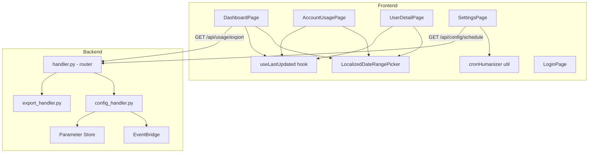

# Design — Quick Wins UI/UX (M1–M6)

## Visão Geral

Este documento descreve o design técnico para as seis melhorias rápidas de UI/UX do Kiro Cost Analyzer. As mudanças abrangem frontend (React + Cloudscape) e backend (Python Lambda), com foco em eliminar duplicação de código, corrigir bugs e melhorar a experiência do usuário.

As melhorias são:
1. **Período padrão "Últimos 30 dias"** — valor inicial do DateRangePicker em 3 páginas
2. **LocalizedDateRangePicker** — componente reutilizável que elimina ~120 linhas duplicadas
3. **Timestamp de última atualização** — feedback visual "Última atualização: HH:mm"
4. **Correção do export CSV** — remover `JSON.stringify` indevido em respostas CSV
5. **Branding na LoginPage** — logo + título + tagline
6. **Agendamento do ETL na SettingsPage** — exibição read-only com conversão cron → pt-BR

### Decisões de Design

- **Componente agnóstico de locale**: O `LocalizedDateRangePicker` recebe strings i18n como prop com defaults em pt-BR, permitindo reutilização futura com outros idiomas sem refatoração.
- **Hook `useLastUpdated`**: Encapsula a lógica de timestamp em um custom hook reutilizável, evitando duplicação em cada página.
- **Cron humanizer no frontend**: A conversão de expressões EventBridge para texto legível é feita no frontend via utility function pura, pois o backend já retorna a expressão raw. Isso mantém a lógica de apresentação no frontend e facilita testes unitários.
- **Agendamento padrão diário às 23:59**: O parâmetro `EtlScheduleExpression` no `template.yaml` usa `cron(59 23 * * ? *)` como valor padrão, garantindo que o ETL execute todos os dias às 23:59 UTC. Isso substitui o anterior `rate(1 day)` para dar previsibilidade ao horário de execução.
- **Export condicional por content-type**: O fix do CSV usa o tipo de resposta para decidir se aplica `JSON.stringify` ou usa a string diretamente, sem alterar a API do backend.

## Arquitetura



## Componentes e Interfaces

### 1. LocalizedDateRangePicker

**Arquivo:** `frontend/src/components/LocalizedDateRangePicker.tsx`

Componente wrapper do `DateRangePicker` do Cloudscape que encapsula:
- Strings i18n (padrão pt-BR)
- Opções relativas padrão (7d, 30d, 90d)
- Validação de range absoluto
- Valor padrão "Últimos 30 dias"

```typescript
interface LocalizedDateRangePickerProps {
  value: DateRangePickerProps.Value | null;
  onChange: (value: DateRangePickerProps.Value | null) => void;
  placeholder?: string; // default: "Selecione o período"
  relativeOptions?: DateRangePickerProps.RelativeOption[]; // default: 7d, 30d, 90d
  i18nStrings?: DateRangePickerProps.I18nStrings; // default: pt-BR strings
}

// Valor padrão exportado para uso nas páginas
export const DEFAULT_DATE_RANGE: DateRangePickerProps.Value = {
  type: 'relative',
  amount: 30,
  unit: 'day',
};
```

**Uso nas páginas:**
```typescript
// Antes (em cada página):
const [dateRange, setDateRange] = useState<DateRangePickerProps.Value | null>(null);

// Depois:
import { DEFAULT_DATE_RANGE } from '../components/LocalizedDateRangePicker';
const [dateRange, setDateRange] = useState<DateRangePickerProps.Value | null>(DEFAULT_DATE_RANGE);
```

### 2. Hook useLastUpdated

**Arquivo:** `frontend/src/hooks/useLastUpdated.ts`

Custom hook que gerencia o timestamp de última atualização.

```typescript
interface UseLastUpdatedReturn {
  lastUpdated: Date | null;
  formattedTime: string | null; // "HH:mm" em pt-BR
  markUpdated: () => void;      // chamado após fetch bem-sucedido
}

function useLastUpdated(): UseLastUpdatedReturn;
```

**Lógica:**
- `markUpdated()` salva `new Date()` no state
- `formattedTime` formata com `toLocaleTimeString('pt-BR', { hour: '2-digit', minute: '2-digit' })`
- Só atualiza em caso de sucesso (a página chama `markUpdated()` no bloco `try` após `setData`)

**Integração nas páginas:**
```typescript
const { lastUpdated, formattedTime, markUpdated } = useLastUpdated();

// No fetchData, após setData(resp):
markUpdated();

// No Header:
<Header variant="h1" description={formattedTime ? `Última atualização: ${formattedTime}` : undefined}>
  Dashboard
</Header>
```

### 3. Correção do Export CSV

**Arquivo:** `frontend/src/pages/DashboardPage.tsx` — função `handleExport`

**Problema atual:**
```typescript
// Bug: JSON.stringify em string CSV adiciona aspas extras
const blob = new Blob([JSON.stringify(resp)], { type: 'text/csv' });
```

**Solução:**
```typescript
const handleExport = async (format: string) => {
  try {
    // ... params setup ...
    const resp = await get<string | object>('/api/usage/export', params);
    
    const content = format === 'csv' 
      ? (resp as string)                    // CSV: usar string diretamente
      : JSON.stringify(resp, null, 2);      // JSON: serializar objeto
    
    const blob = new Blob([content], {
      type: format === 'csv' ? 'text/csv;charset=utf-8' : 'application/json',
    });
    // ... download logic ...
  } catch {
    setError('Erro ao exportar dados');
  }
};
```

**Nota:** O `api/client.ts` atualmente faz `res.json()` em todas as respostas. Para CSV, o backend retorna a string CSV como body da resposta com `content-type: text/csv`. O client precisa ser ajustado para retornar texto raw quando o content-type não é JSON. Alternativa mais simples: o backend já retorna o CSV como string dentro de um JSON wrapper (via `export_handler.py` que retorna `{"statusCode": 200, "body": "csv_string", "contentType": "text/csv"}`), e o router em `handler.py` já passa o body como string. O frontend recebe a string CSV diretamente do `res.json()` como uma string JSON-encoded. A correção é simplesmente não aplicar `JSON.stringify` quando o formato é CSV.

### 4. Branding na LoginPage

**Arquivo:** `frontend/src/pages/LoginPage.tsx`

**Mudanças:**
- Importar logo: `import logo from '../../docs/logo.png';` (ou copiar para `src/assets/logo.png`)
- Adicionar bloco de branding acima do Container do formulário
- Centralizar verticalmente com flexbox

```typescript
// Estrutura do branding
<div style={{ textAlign: 'center', marginBottom: 24 }}>
   { (e.target as HTMLImageElement).style.display = 'none'; }}
  />
  <Box variant="h1" textAlign="center">Kiro Cost Analyzer</Box>
  <Box variant="p" color="text-body-secondary" textAlign="center">
    Monitoramento de custos e uso de IA
  </Box>
</div>
```

**Decisão:** Copiar `docs/logo.png` para `frontend/src/assets/logo.png` para que o Vite processe como asset estático com hash no build. Isso garante cache-busting e bundling correto.

### 5. Agendamento do ETL na SettingsPage

#### 5a. Backend — Schedule Endpoint

**Arquivo:** `backend/handlers/config_handler.py` — nova função `handle_get_schedule`

**Novo endpoint:** `GET /api/config/schedule`

```python
def handle_get_schedule(events_client=None) -> dict:
    """Consulta a regra do EventBridge e retorna o agendamento do ETL."""
    client = events_client or boto3.client("scheduler")
    schedule_name = os.environ.get("ETL_SCHEDULE_NAME", "")
    
    try:
        response = client.get_schedule(Name=schedule_name)
        expression = response.get("ScheduleExpression", "")
        enabled = response.get("State", "ENABLED") == "ENABLED"
        
        return {
            "expression": expression,
            "enabled": enabled,
            "humanReadable": humanize_schedule(expression),
        }
    except Exception:
        return {
            "expression": None,
            "enabled": False,
            "humanReadable": "Agendamento indisponível",
            "error": True,
        }
```

**Rota no handler.py:**
```python
if http_method == "GET" and path == "/api/config/schedule":
    result = config_handler.handle_get_schedule()
    return _build_response(200, result)
```

**Infraestrutura (template.yaml):**
- O parâmetro `EtlScheduleExpression` no `template.yaml` SHALL ter o valor padrão `cron(59 23 * * ? *)` (todos os dias às 23:59 UTC)
- Adicionar variável de ambiente `ETL_SCHEDULE_NAME` ao `BackendFunction` referenciando o nome do schedule do EventBridge
- Adicionar permissão `scheduler:GetSchedule` ao `BackendFunction`
- Adicionar novo evento API Gateway `GET /api/config/schedule`

#### 5b. Frontend — Cron Humanizer

**Arquivo:** `frontend/src/utils/cronHumanizer.ts`

Função pura que converte expressões EventBridge para texto legível em pt-BR.

```typescript
/**
 * Converte uma expressão de agendamento do EventBridge para texto legível em pt-BR.
 * 
 * Suporta:
 * - rate(1 day) → "Todos os dias"
 * - rate(2 hours) → "A cada 2 horas"
 * - cron(0 0 * * ? *) → "Todos os dias às 00:00"
 * - cron(59 23 * * ? *) → "Todos os dias às 23:59" (padrão do ETL)
 * - cron(0 12 ? * MON-FRI *) → "De segunda a sexta às 12:00"
 * - cron(0 8 1 * ? *) → "Todo dia 1 às 08:00"
 */
export function humanizeSchedule(expression: string): string;
```

**Padrões suportados:**

| Expressão EventBridge | Saída pt-BR |
|---|---|
| `rate(1 day)` | "Todos os dias" |
| `rate(1 hour)` | "A cada hora" |
| `rate(N hours)` | "A cada N horas" |
| `rate(N minutes)` | "A cada N minutos" |
| `cron(59 23 * * ? *)` | "Todos os dias às 23:59" |
| `cron(M H * * ? *)` | "Todos os dias às HH:MM" |
| `cron(M H ? * DOW *)` | "Dias da semana às HH:MM" |
| `cron(M H D * ? *)` | "Todo dia D às HH:MM" |

#### 5c. Frontend — SettingsPage

**Mudanças no `SettingsPage.tsx`:**
- Novo state `schedule` para armazenar dados do endpoint
- Fetch do schedule junto com o config existente
- Exibir dentro do container "Status do ETL" existente
- Campo read-only com `Box variant="awsui-key-label"` + texto

```typescript
// Novo campo no ColumnLayout do container "Status do ETL"
<div>
  <Box variant="awsui-key-label">Agendamento</Box>
  {schedule?.error ? (
    <StatusIndicator type="warning">Agendamento indisponível</StatusIndicator>
  ) : !schedule?.enabled ? (
    <StatusIndicator type="stopped">Agendamento desabilitado</StatusIndicator>
  ) : (
    <div>{schedule.humanReadable}</div>
  )}
</div>
```

## Modelos de Dados

### Tipos existentes (sem alteração)
- `DateRangePickerProps.Value` — tipo do Cloudscape para valor do date picker
- `AppConfig` — configuração da aplicação (já existe em `types/index.ts`)

### Novos tipos

```typescript
// frontend/src/types/index.ts

export interface EtlSchedule {
  expression: string | null;  // expressão raw do EventBridge (ex: "cron(59 23 * * ? *)")
  enabled: boolean;           // se a regra está habilitada
  humanReadable: string;      // texto legível em pt-BR (ex: "Todos os dias às 23:59")
  error?: boolean;            // true se houve erro ao consultar
}
```

### Resposta do backend (novo endpoint)

```json
// GET /api/config/schedule — exemplo com o agendamento padrão
{
  "expression": "cron(59 23 * * ? *)",
  "enabled": true,
  "humanReadable": "Todos os dias às 23:59"
}
```

## Correctness Properties

*Uma propriedade de corretude é uma característica ou comportamento que deve ser verdadeiro em todas as execuções válidas de um sistema — essencialmente, uma declaração formal sobre o que o sistema deve fazer. Propriedades servem como ponte entre especificações legíveis por humanos e garantias de corretude verificáveis por máquina.*

### Property 1: Validação de range absoluto rejeita datas invertidas

*Para quaisquer* duas datas onde `startDate > endDate`, a função de validação do `LocalizedDateRangePicker` SHALL retornar `{ valid: false }`. *Para quaisquer* duas datas onde `startDate <= endDate`, SHALL retornar `{ valid: true }`.

**Validates: Requirements 2.5**

### Property 2: Formatação de timestamp produz formato HH:mm válido

*Para qualquer* objeto `Date` válido, a função de formatação do hook `useLastUpdated` SHALL produzir uma string no formato `HH:mm` (24h) que corresponde ao horário do objeto Date no locale pt-BR.

**Validates: Requirements 3.6**

### Property 3: CSV Blob preserva conteúdo original

*Para qualquer* string CSV retornada pelo backend, o conteúdo do Blob gerado pela função `handleExport` com formato "csv" SHALL ser idêntico à string original, sem wrapping de `JSON.stringify`.

**Validates: Requirements 4.2**

### Property 4: JSON Blob aplica stringify

*Para qualquer* objeto retornado pelo backend, o conteúdo do Blob gerado pela função `handleExport` com formato "json" SHALL ser igual a `JSON.stringify(objeto, null, 2)`.

**Validates: Requirements 4.3**

### Property 5: Humanizer de schedule EventBridge produz texto pt-BR válido

*Para qualquer* expressão de agendamento válida do EventBridge (rate ou cron), a função `humanizeSchedule` SHALL produzir uma string não-vazia em pt-BR. Se a expressão contém um horário fixo (hora e minuto definidos), a saída SHALL incluir o componente de horário no formato `HH:MM`.

**Validates: Requirements 6.3, 6.4**

## Tratamento de Erros

| Cenário | Componente | Comportamento |
|---|---|---|
| Fetch de dados falha | Dashboard, AccountUsage, UserDetail | Alert de erro dismissível + botão "Tentar novamente" (já existente). Timestamp de última atualização mantém valor anterior. |
| Export falha | DashboardPage | Alert com "Erro ao exportar dados" (já existente). |
| Logo falha ao carregar | LoginPage | `onError` handler esconde a imagem. Título e tagline permanecem visíveis. |
| Schedule endpoint falha | SettingsPage | Exibe "Agendamento indisponível" com `StatusIndicator type="warning"`. |
| Regra EventBridge desabilitada | SettingsPage | Exibe "Agendamento desabilitado" com `StatusIndicator type="stopped"`. |
| Expressão cron não reconhecida | cronHumanizer | Retorna a expressão original como fallback (ex: `"cron(0 0 L * ? *)"` → `"cron(0 0 L * ? *)"`) |

## Estratégia de Testes

### Abordagem Dual

- **Testes unitários (example-based)**: Verificam cenários específicos, edge cases e integrações entre componentes.
- **Testes de propriedade (property-based)**: Verificam propriedades universais com inputs gerados aleatoriamente.

### Testes de Propriedade (PBT)

**Biblioteca:** `fast-check` (já instalada no projeto — `frontend/package.json`)

**Configuração:** Mínimo de 100 iterações por teste de propriedade.

Cada teste de propriedade referencia a propriedade do design document:

| Property | Arquivo de Teste | Tag |
|---|---|---|
| Property 1: Validação de range absoluto | `LocalizedDateRangePicker.test.ts` | Feature: ui-ux-quick-wins, Property 1: Validação de range absoluto rejeita datas invertidas |
| Property 2: Formatação de timestamp | `useLastUpdated.test.ts` | Feature: ui-ux-quick-wins, Property 2: Formatação de timestamp produz formato HH:mm válido |
| Property 3: CSV Blob preserva conteúdo | `handleExport.test.ts` | Feature: ui-ux-quick-wins, Property 3: CSV Blob preserva conteúdo original |
| Property 4: JSON Blob aplica stringify | `handleExport.test.ts` | Feature: ui-ux-quick-wins, Property 4: JSON Blob aplica stringify |
| Property 5: Humanizer de schedule | `cronHumanizer.test.ts` | Feature: ui-ux-quick-wins, Property 5: Humanizer de schedule EventBridge produz texto pt-BR válido |

### Testes Unitários (Example-Based)

| Componente | Cenários |
|---|---|
| `LocalizedDateRangePicker` | Renderiza com defaults pt-BR; aceita placeholder customizado; opções relativas 7d/30d/90d presentes |
| `useLastUpdated` | `markUpdated()` atualiza timestamp; `formattedTime` retorna null antes do primeiro update; não atualiza em caso de erro |
| `DashboardPage` | DateRangePicker inicia com "Últimos 30 dias"; API recebe startDate/endDate corretos; limpar picker remove filtro de data |
| `handleExport` | CSV export gera arquivo .csv válido; JSON export gera arquivo .json; erro exibe Alert |
| `LoginPage` | Logo, título e tagline visíveis; fallback quando logo falha |
| `SettingsPage` | Exibe schedule legível; exibe "indisponível" em erro; exibe "desabilitado" quando regra off |
| `cronHumanizer` | `rate(1 day)` → "Todos os dias"; `cron(59 23 * * ? *)` → "Todos os dias às 23:59"; `cron(0 0 * * ? *)` → "Todos os dias às 00:00"; expressão desconhecida → fallback |
| `handle_get_schedule` (backend) | Retorna expression + humanReadable + enabled; retorna erro quando EventBridge falha |

### Testes de Integração (Backend)

| Handler | Cenários |
|---|---|
| `handle_get_schedule` | Mock do EventBridge client retorna schedule válido; mock retorna exceção; mock retorna regra desabilitada |
| `handle_export` | Verifica que CSV body é string válida sem JSON wrapping (já coberto por testes existentes) |
