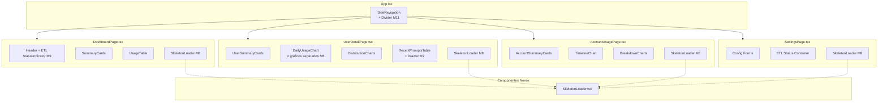
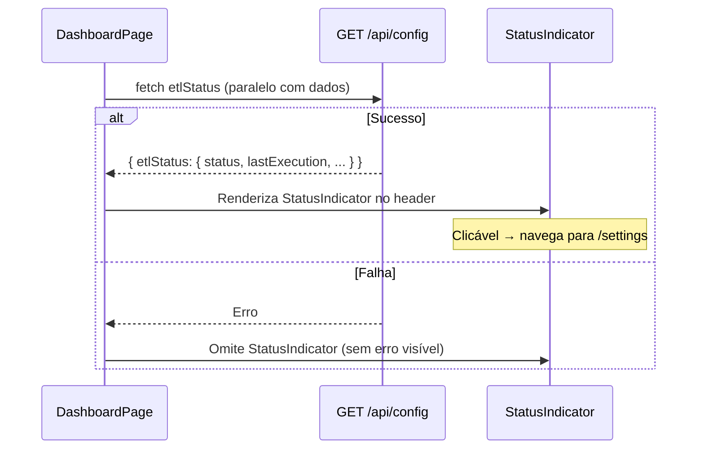

# Documento de Design — Melhorias UI/UX Tier 2

## Visão Geral

Este documento descreve o design técnico para cinco melhorias de experiência do usuário (Tier 2) no Kiro Cost Analyzer. As mudanças são exclusivamente no frontend React/TypeScript com Cloudscape Design System — nenhuma alteração no backend é necessária, pois todos os endpoints e dados já existem.

### Escopo das Mudanças

| ID | Melhoria | Componentes Afetados |
|----|----------|---------------------|
| M6 | Separar gráficos de créditos e interações | `DailyUsageChart.tsx` |
| M7 | Drawer lateral para detalhes de prompt | `RecentPromptsTable.tsx`, `UserDetailPage.tsx` |
| M8 | Skeleton loading em todas as páginas | `DashboardPage.tsx`, `AccountUsagePage.tsx`, `UserDetailPage.tsx`, `SettingsPage.tsx` + novo componente `SkeletonLoader.tsx` |
| M9 | Status do ETL no header do Dashboard | `DashboardPage.tsx` |
| M11 | Divider na navegação lateral | `App.tsx` |

### Decisões de Design

1. **Dois gráficos separados em vez de eixo Y duplo (M6):** O Cloudscape `LineChart` não suporta eixo Y duplo nativamente. Separar em dois gráficos é mais simples, mais legível e alinhado com o padrão do Cloudscape. Cada gráfico terá seu próprio `yDomain` calculado exclusivamente a partir da sua métrica.

2. **Drawer nativo do Cloudscape em vez de Modal (M7):** O componente `Drawer` do Cloudscape é projetado para conteúdo contextual sem alterar o layout principal. Diferente do `ExpandableSection` atual que distorce a tabela, o Drawer abre como painel lateral independente. Usaremos o `SplitPanel` do `AppLayout` ou um `Drawer` standalone.

3. **Componente SkeletonLoader reutilizável (M8):** Em vez de criar skeletons inline em cada página, criaremos um componente `SkeletonLoader` com variantes (`cards`, `table`, `chart`, `container`) que pode ser reutilizado. Usaremos CSS animations com `@keyframes` para o efeito de shimmer, seguindo o padrão visual do Cloudscape.

4. **StatusIndicator como Link clicável (M9):** Envolveremos o `StatusIndicator` do Cloudscape em um `Link` para navegação até `/settings`. A chamada ao endpoint `GET /api/config` será feita em paralelo com a carga de dados do Dashboard, sem bloquear a renderização principal.

5. **Divider nativo do SideNavigation (M11):** O Cloudscape `SideNavigation` suporta itens do tipo `divider` nativamente. Basta adicionar `{ type: 'divider' }` no array `NAV_ITEMS` e reordenar os itens.

## Arquitetura

### Diagrama de Componentes



### Fluxo de Dados (M9 — ETL Status)



## Componentes e Interfaces

### M6 — DailyUsageChart (Refatoração)

**Arquivo:** `frontend/src/components/DailyUsageChart.tsx`

**Mudança:** O componente atual renderiza um único `LineChart` com duas séries (Créditos e Interações) compartilhando o mesmo eixo Y. Será refatorado para renderizar dois `LineChart` separados, cada um com seu próprio `yDomain`.

**Interface (sem mudança):**
```typescript
interface DailyUsageChartProps {
  data: DailyUsageEntry[];
  loading: boolean;
}
```

**Lógica de separação:**
```typescript
// Funções puras para cálculo de domínios
function computeYDomain(values: number[]): [number, number] {
  return [0, Math.max(...values, 1)];
}

function computeXDomain(data: DailyUsageEntry[]): [Date, Date] | undefined {
  if (data.length === 0) return undefined;
  return [new Date(data[0].date), new Date(data[data.length - 1].date)];
}

// Gráfico de Créditos
const creditsSeries = [{
  title: 'Créditos',
  type: 'line' as const,
  data: data.map(e => ({ x: new Date(e.date), y: e.credits })),
}];
const creditsYDomain = computeYDomain(data.map(e => e.credits));

// Gráfico de Interações
const interactionsSeries = [{
  title: 'Interações',
  type: 'line' as const,
  data: data.map(e => ({ x: new Date(e.date), y: e.interactions })),
}];
const interactionsYDomain = computeYDomain(data.map(e => e.interactions));

// Ambos compartilham o mesmo xDomain
const xDomain = computeXDomain(data);
```

**Layout:** Dois gráficos empilhados verticalmente dentro de um `SpaceBetween`, cada um com seu próprio `Header variant="h3"` ("Créditos" e "Interações"), envolvidos por um `Header variant="h2"` ("Consumo Diário").

### M7 — RecentPromptsTable + Drawer

**Arquivo:** `frontend/src/components/RecentPromptsTable.tsx`

**Mudança:** Substituir o `ExpandableSection` dentro da célula da tabela por um `Drawer` lateral. A coluna "Data/Hora" passa a ser um `Link` clicável em vez de um `ExpandableSection`. O Drawer abre pela direita com os detalhes do prompt.

**Interface atualizada:**
```typescript
interface RecentPromptsTableProps {
  prompts: RecentPrompt[];
  loading: boolean;
}
// Sem mudança na interface pública — o Drawer é gerenciado internamente
```

**Estado interno:**
```typescript
const [selectedRequestId, setSelectedRequestId] = useState<string | null>(null);
const [promptDetail, setPromptDetail] = useState<PromptDetail | null>(null);
const [detailLoading, setDetailLoading] = useState(false);
const [detailError, setDetailError] = useState<string | null>(null);
```

**Comportamento do Drawer:**
- Abre quando `selectedRequestId !== null`
- Fecha ao clicar no botão de fechar (seta ou X)
- Ao clicar em outra linha, atualiza `selectedRequestId` e faz nova requisição
- Exibe: timestamp formatado, modelo, tipo de trigger, conteúdo do prompt, conteúdo da resposta
- Durante carregamento: exibe `Spinner` dentro do Drawer
- Em caso de erro: exibe `Alert type="error"` dentro do Drawer

**Implementação do Drawer:** Usaremos o componente `Drawer` do Cloudscape (disponível como `SplitPanel` no `AppLayout` ou como componente standalone). Como o `RecentPromptsTable` é renderizado dentro do `AppLayout`, a abordagem mais limpa é usar um `Modal` com `size="large"` posicionado à direita via CSS, ou o `SplitPanel` do `AppLayout`. A abordagem recomendada é usar um componente `Drawer` customizado com CSS para simular o painel lateral, já que o Cloudscape não expõe um `Drawer` standalone fora do `AppLayout`.

**Decisão final:** Usaremos o `SplitPanel` do Cloudscape integrado ao `AppLayout` na `UserDetailPage`. O `RecentPromptsTable` comunicará o `requestId` selecionado via callback para o `UserDetailPage`, que controlará o `SplitPanel`.

**Interface revisada:**
```typescript
interface RecentPromptsTableProps {
  prompts: RecentPrompt[];
  loading: boolean;
  onPromptSelect: (requestId: string | null) => void;
  selectedRequestId: string | null;
}
```

O `UserDetailPage` gerenciará o estado do `SplitPanel`:
```typescript
// Em UserDetailPage.tsx
const [selectedPromptId, setSelectedPromptId] = useState<string | null>(null);

// No AppLayout ou ContentLayout
<AppLayout
  splitPanel={selectedPromptId ? <PromptDetailPanel requestId={selectedPromptId} onClose={() => setSelectedPromptId(null)} /> : undefined}
  splitPanelOpen={selectedPromptId !== null}
  onSplitPanelToggle={({ detail }) => { if (!detail.open) setSelectedPromptId(null); }}
  ...
/>
```

**Novo componente:** `PromptDetailPanel.tsx`
```typescript
interface PromptDetailPanelProps {
  requestId: string;
  onClose: () => void;
}
```

### M8 — SkeletonLoader

**Novo arquivo:** `frontend/src/components/SkeletonLoader.tsx`

**Variantes:**
```typescript
type SkeletonVariant = 'cards' | 'table' | 'chart' | 'container' | 'key-value';

interface SkeletonLoaderProps {
  variant: SkeletonVariant;
  count?: number;       // Número de itens (cards, linhas de tabela)
  height?: number;      // Altura em pixels (para chart)
  columns?: number;     // Número de colunas (para cards, key-value)
}
```

**Implementação:** Blocos `div` com background animado via CSS `@keyframes shimmer`:
```css
@keyframes shimmer {
  0% { background-position: -200px 0; }
  100% { background-position: calc(200px + 100%) 0; }
}

.skeleton-block {
  background: linear-gradient(90deg, var(--color-background-layout-main) 25%, var(--color-background-container-content) 50%, var(--color-background-layout-main) 75%);
  background-size: 200px 100%;
  animation: shimmer 1.5s ease-in-out infinite;
  border-radius: 4px;
}
```

**Uso por página:**

| Página | Variante | Parâmetros |
|--------|----------|------------|
| DashboardPage | `cards` + `table` | `count=4, columns=4` + `count=5` |
| AccountUsagePage | `cards` + `chart` + `chart` | `count=4, columns=4` + `height=300` × 2 |
| UserDetailPage | `container` + `chart` + `chart` + `table` | key-value + `height=300` × 2 + `count=5` |
| SettingsPage | `container` × 3 | 3 containers com key-value |

### M9 — ETL Status no Dashboard Header

**Arquivo:** `frontend/src/pages/DashboardPage.tsx`

**Mudança:** Adicionar chamada `GET /api/config` no `useEffect` do Dashboard e renderizar um `StatusIndicator` clicável no `Header`.

**Função de mapeamento de status (pura):**
```typescript
interface EtlStatusDisplay {
  type: 'success' | 'error' | 'info' | 'stopped';
  text: string;
}

function mapEtlStatus(status: string | null | undefined): EtlStatusDisplay {
  switch (status) {
    case 'success':
      return { type: 'success', text: 'ETL: Sucesso' };
    case 'error':
    case 'failed':
      return { type: 'error', text: 'ETL: Erro' };
    case 'running':
    case 'in_progress':
      return { type: 'info', text: 'ETL: Em execução' };
    default:
      return { type: 'stopped', text: 'ETL: Sem execução' };
  }
}
```

**Renderização no Header:**
```tsx
<Header
  variant="h1"
  description={formattedTime ? `Última atualização: ${formattedTime}` : undefined}
  actions={
    etlStatusDisplay ? (
      <Link href="/settings" onFollow={(e) => { e.preventDefault(); navigate('/settings'); }}>
        <StatusIndicator type={etlStatusDisplay.type}>
          {etlStatusDisplay.text}
        </StatusIndicator>
      </Link>
    ) : undefined
  }
>
  Dashboard
</Header>
```

**Tratamento de erro:** Se a chamada `GET /api/config` falhar, `etlStatusDisplay` permanece `null` e o `StatusIndicator` não é renderizado. Nenhum erro é exibido ao usuário.

### M11 — Divider na SideNavigation

**Arquivo:** `frontend/src/App.tsx`

**Mudança:** Atualizar o array `NAV_ITEMS` para incluir um `divider` e reordenar os itens.

**Antes:**
```typescript
const NAV_ITEMS: SideNavigationProps.Item[] = [
  { type: 'link', text: 'Dashboard', href: '/' },
  { type: 'link', text: 'Consumo da Conta', href: '/account' },
  { type: 'link', text: 'Configurações', href: '/settings' },
  { type: 'link', text: 'Usuários', href: '/users' },
];
```

**Depois:**
```typescript
const NAV_ITEMS: SideNavigationProps.Item[] = [
  { type: 'link', text: 'Dashboard', href: '/' },
  { type: 'link', text: 'Consumo da Conta', href: '/account' },
  { type: 'divider' },
  { type: 'link', text: 'Usuários', href: '/users' },
  { type: 'link', text: 'Configurações', href: '/settings' },
];
```

O `type: 'divider'` é suportado nativamente pelo Cloudscape `SideNavigation`. A ordem coloca "Usuários" antes de "Configurações" no grupo administrativo, conforme requisito 5.3.

## Modelos de Dados

Nenhum modelo de dados novo é necessário. Todos os tipos já existem em `frontend/src/types/index.ts`:

- `DailyUsageEntry` — usado pelo `DailyUsageChart` (M6)
- `PromptDetail`, `RecentPrompt` — usados pelo `RecentPromptsTable` e Drawer (M7)
- `AppConfig`, `EtlStatus` — usados para o status do ETL no Dashboard (M9)

**Tipo novo para o SkeletonLoader (M8):**
```typescript
// Interno ao componente, não exportado para types/index.ts
type SkeletonVariant = 'cards' | 'table' | 'chart' | 'container' | 'key-value';
```

**Tipo novo para mapeamento de ETL status (M9):**
```typescript
// Pode ser exportado ou mantido local ao DashboardPage
interface EtlStatusDisplay {
  type: 'success' | 'error' | 'info' | 'stopped';
  text: string;
}
```

## Propriedades de Corretude

*Uma propriedade é uma característica ou comportamento que deve ser verdadeiro em todas as execuções válidas de um sistema — essencialmente, uma declaração formal sobre o que o sistema deve fazer. Propriedades servem como ponte entre especificações legíveis por humanos e garantias de corretude verificáveis por máquina.*

### Propriedade 1: Escalas Y independentes por métrica

*Para qualquer* array de `DailyUsageEntry`, o valor máximo do `yDomain` do gráfico de Créditos deve ser igual ao máximo dos valores `credits` do array (sem influência de `interactions`), e o valor máximo do `yDomain` do gráfico de Interações deve ser igual ao máximo dos valores `interactions` do array (sem influência de `credits`).

**Valida: Requisitos 1.2, 1.3**

### Propriedade 2: Sincronização do eixo X entre gráficos

*Para qualquer* array não-vazio de `DailyUsageEntry`, o `xDomain` do gráfico de Créditos e o `xDomain` do gráfico de Interações devem ser idênticos, correspondendo à primeira e última data do array de entrada.

**Valida: Requisito 1.5**

### Propriedade 3: Preservação de dados na separação dos gráficos

*Para qualquer* array de `DailyUsageEntry`, o número de pontos de dados na série do gráfico de Créditos e o número de pontos na série do gráfico de Interações devem ser iguais ao comprimento do array de entrada.

**Valida: Requisito 1.6**

### Propriedade 4: Completude do conteúdo do Drawer

*Para qualquer* objeto `PromptDetail` válido, o conteúdo renderizado no Drawer deve incluir o timestamp formatado, o `modelId`, o `triggerType`, o conteúdo do `prompt` e o conteúdo da `response`.

**Valida: Requisito 2.2**

### Propriedade 5: Mapeamento correto do status ETL

*Para qualquer* string de status ETL, a função `mapEtlStatus` deve retornar o tipo de indicador e o texto corretos conforme as regras: "success" → (success, "ETL: Sucesso"), "error"|"failed" → (error, "ETL: Erro"), "running"|"in_progress" → (info, "ETL: Em execução"), qualquer outro valor ou null → (stopped, "ETL: Sem execução").

**Valida: Requisitos 4.2, 4.3, 4.4, 4.5**

## Tratamento de Erros

### M6 — DailyUsageChart
- **Dados vazios:** Cada gráfico exibe sua própria mensagem de estado vazio ("Nenhum dado disponível para o período selecionado.")
- **Dados com valores zero:** O `yDomain` usa `Math.max(...values, 1)` para garantir mínimo de 1 no eixo Y, evitando divisão por zero no Cloudscape.

### M7 — Drawer de Detalhes do Prompt
- **Erro na API `GET /api/prompts/{requestId}`:** Exibe `Alert type="error"` dentro do Drawer com a mensagem de erro. O usuário pode clicar em outra linha para tentar outro prompt.
- **Carregamento lento:** Exibe `Spinner` com texto "Carregando detalhes..." dentro do Drawer.
- **Prompt sem conteúdo:** Se `prompt` ou `response` forem strings vazias, exibe "Sem conteúdo disponível" em itálico.

### M8 — Skeleton Loading
- **Sem tratamento de erro específico:** O skeleton é exibido durante `loading=true` e substituído pelo conteúdo real quando `loading=false`. Se houver erro, o padrão existente de `Alert` é mantido.

### M9 — ETL Status no Dashboard
- **Falha na requisição `GET /api/config`:** O `StatusIndicator` é omitido silenciosamente. Nenhum erro é exibido ao usuário. O Dashboard continua funcional.
- **Status desconhecido:** A função `mapEtlStatus` tem um caso `default` que retorna `{ type: 'stopped', text: 'ETL: Sem execução' }`.

### M11 — Divider na SideNavigation
- **Sem tratamento de erro:** É uma mudança estática no array de configuração. Não há cenário de erro.

## Estratégia de Testes

### Abordagem Dual: Testes Unitários + Testes de Propriedade

O projeto já utiliza **Vitest** como test runner e **fast-check** como biblioteca de property-based testing (ambos presentes no `package.json`). A estratégia combina:

1. **Testes de propriedade (PBT):** Para validar as 5 propriedades de corretude definidas acima. Cada teste usa `fast-check` com mínimo de 100 iterações.
2. **Testes unitários (example-based):** Para cenários específicos de UI, edge cases e integrações.

### Testes de Propriedade

| Propriedade | Arquivo de Teste | Gerador |
|-------------|-----------------|---------|
| P1: Escalas Y independentes | `DailyUsageChart.test.tsx` | `fc.array(fc.record({ date: fc.date(), credits: fc.float({min:0, max:1000}), interactions: fc.nat({max:10000}), ... }))` |
| P2: Sincronização eixo X | `DailyUsageChart.test.tsx` | Mesmo gerador de P1 |
| P3: Preservação de dados | `DailyUsageChart.test.tsx` | Mesmo gerador de P1 |
| P4: Completude do Drawer | `PromptDetailPanel.test.tsx` | `fc.record({ prompt: fc.string(), response: fc.string(), modelId: fc.string(), triggerType: fc.string(), timestamp: fc.date().map(d => d.toISOString()), ... })` |
| P5: Mapeamento ETL status | `DashboardPage.test.tsx` | `fc.oneof(fc.constant('success'), fc.constant('error'), fc.constant('failed'), fc.constant('running'), fc.constant('in_progress'), fc.constant(null), fc.string())` |

**Configuração:** Cada teste de propriedade deve rodar com `{ numRuns: 100 }` e incluir tag no formato:
```
// Feature: ui-ux-tier2, Property N: <texto da propriedade>
```

### Testes Unitários (Example-Based)

| Componente | Cenários |
|-----------|----------|
| `DailyUsageChart` | Estado vazio (dados=[]), loading=true |
| `RecentPromptsTable` | Clique abre drawer, clique em outra linha atualiza, fechar drawer |
| `PromptDetailPanel` | Loading state, error state, conteúdo vazio |
| `SkeletonLoader` | Cada variante renderiza corretamente |
| `DashboardPage` | ETL status renderizado no header, navegação ao clicar, omissão em caso de erro |
| `App.tsx (NAV_ITEMS)` | Ordem correta dos itens, divider presente na posição correta |

### Ferramentas

- **Test Runner:** Vitest (`vitest --run`)
- **Renderização:** `@testing-library/react` + `jsdom`
- **Property-Based Testing:** `fast-check` v4
- **Assertions:** `@testing-library/jest-dom`
