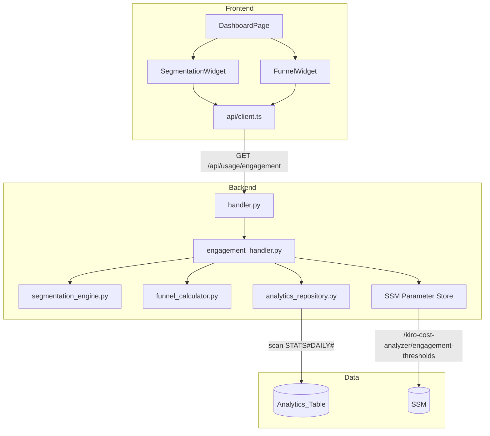

# Design Document — User Engagement Segmentation

## Overview

This feature adds an engagement segmentation system that classifies users into four categories (Power, Active, Light, Idle) based on their aggregated activity within a selected period, and presents an engagement funnel visualization showing conversion rates between stages. The system consists of:

1. **Backend**: A new `engagement_handler.py` that reads aggregated `STATS#DAILY#` items from DynamoDB, classifies users via a pure segmentation engine, computes funnel stages, and returns structured JSON.
2. **Configuration**: Configurable thresholds stored in SSM Parameter Store, managed via the existing config API pattern.
3. **Frontend**: Two new widgets integrated into the Dashboard's overview tab — a Cloudscape PieChart for segmentation and a custom D3.js funnel chart for the engagement funnel — with derived engagement health metrics. D3.js is used directly (not via a wrapper library) to establish a reusable pattern for future custom visualizations.

The segmentation logic is intentionally kept as a **pure function** (no I/O) to enable comprehensive property-based testing of the classification invariants.

## Architecture



### Data Flow

1. Frontend calls `GET /api/usage/engagement?startDate=X&endDate=Y`
2. `handler.py` routes to `engagement_handler.handle_engagement()`
3. Handler reads thresholds from SSM (with fallback to defaults)
4. Handler calls `AnalyticsRepository.scan_user_stats()` to get aggregated user activity
5. Pure `SegmentationEngine.classify_users()` assigns categories
6. Pure `FunnelCalculator.compute_funnel()` builds funnel stages
7. Handler assembles response with segmentation, funnel, and derived metrics

## Components and Interfaces

### Backend Components

#### `backend/handlers/engagement_handler.py`

Follows the same pattern as `usage_handler.py` and `account_usage_handler.py`:

```python
def handle_engagement(query_params: dict, dynamodb_resource=None, ssm_client=None) -> dict:
    """Handle GET /api/usage/engagement request.

    Args:
        query_params: Dict with optional startDate, endDate.
        dynamodb_resource: Optional boto3 DynamoDB resource for testing.
        ssm_client: Optional boto3 SSM client for testing.

    Returns:
        Response dict with segmentation, funnel, derivedMetrics, and period.
    """
```

#### `backend/handlers/segmentation_engine.py`

Pure functions with no I/O — designed for property-based testing:

```python
@dataclass
class Thresholds:
    power_messages: int = 100
    power_conversations: int = 20
    active_messages: int = 20
    active_conversations: int = 5

@dataclass
class UserActivity:
    user_id: str
    total_messages: int
    total_conversations: int

EngagementCategory = Literal["power", "active", "light", "idle"]

def classify_user(activity: UserActivity, thresholds: Thresholds) -> EngagementCategory:
    """Classify a single user into an engagement category.

    Priority order: power > active > light > idle.
    Uses OR logic: meeting EITHER messages OR conversations threshold qualifies.
    """

def classify_users(activities: list[UserActivity], thresholds: Thresholds) -> dict[str, EngagementCategory]:
    """Classify all users, returning a mapping of userId -> category."""

def validate_thresholds(config: dict) -> tuple[bool, str]:
    """Validate threshold configuration.

    Returns (is_valid, error_message). Error message is empty when valid.
    Checks: positive integers, power > active for both dimensions.
    """

def parse_thresholds(raw_json: str) -> Thresholds:
    """Parse JSON string into Thresholds, returning defaults on failure."""
```

#### `backend/handlers/funnel_calculator.py`

Pure functions for funnel computation:

```python
@dataclass
class FunnelStage:
    name: str
    count: int
    conversion_rate: float  # percentage relative to previous stage

def compute_funnel(
    activities: list[UserActivity],
    classifications: dict[str, EngagementCategory],
) -> list[FunnelStage]:
    """Compute the engagement funnel stages.

    Stages (in order):
    1. All Users — total count
    2. Sent Messages — users with messages > 0
    3. Had Conversations — users with conversations > 0
    4. Active Users — classified as 'active' or 'power'
    5. Power Users — classified as 'power'

    Conversion rate for stage N = (count_N / count_N-1) * 100.
    If count_N-1 is 0, conversion rate is 0.0.
    """

def compute_derived_metrics(
    total_users: int,
    classifications: dict[str, EngagementCategory],
) -> dict:
    """Compute derived engagement health metrics.

    Returns:
        {
            "powerUserPercentage": float,  # 1 decimal place
            "activationRate": float,       # % users with at least 1 message
            "idleRate": float,             # % idle users
        }
    """
```

#### Route Registration in `backend/handler.py`

Add to the router:

```python
if http_method == "GET" and path == "/api/usage/engagement":
    result = engagement_handler.handle_engagement(query_params)
    return _build_response(200, result)
```

And for threshold configuration (admin-only):

```python
if http_method == "PUT" and path == "/api/config/engagement-thresholds":
    if not _is_admin(claims):
        return _build_response(403, {...})
    result = engagement_handler.handle_put_thresholds(body)
    return _build_response(200, result)

if http_method == "GET" and path == "/api/config/engagement-thresholds":
    result = engagement_handler.handle_get_thresholds()
    return _build_response(200, result)
```

### Frontend Components

#### `frontend/src/components/EngagementSegmentationWidget.tsx`

```typescript
interface EngagementSegmentationWidgetProps {
  dateParams: Record<string, string>;
}

// Uses Cloudscape PieChart component
// Displays: pie chart + derived metrics (Box components)
// Colors: 4 distinct colors, NO emojis in labels
// Loading: SkeletonLoader
// Error: Alert with retry button
```

#### `frontend/src/components/EngagementFunnelWidget.tsx`

```typescript
interface EngagementFunnelWidgetProps {
  dateParams: Record<string, string>;
}

// Uses a custom D3.js funnel chart (d3 direct, no wrapper library)
// Renders SVG trapezoids with decreasing widths per stage
// Displays: stage name, count, conversion rate label between stages
// D3 is used directly to establish a reusable pattern for future custom charts
// Loading: SkeletonLoader (Cloudscape)
// Error: Alert with retry button (Cloudscape)
```

#### `frontend/src/components/charts/D3FunnelChart.tsx`

Reusable D3-based funnel chart component:

```typescript
interface FunnelChartData {
  label: string;
  value: number;
  percentage: number;
}

interface D3FunnelChartProps {
  data: FunnelChartData[];
  width?: number;
  height?: number;
  colors?: string[];
  showConversionRates?: boolean;
}

// Pure D3.js rendering into an SVG element via useRef + useEffect
// Responsive: recalculates on container resize
// Renders trapezoid shapes (wider at top, narrower at bottom)
// Labels: stage name + count on each segment, conversion rate between segments
// Theming: uses CSS custom properties compatible with Cloudscape's visual context
// No external D3 funnel libraries — built from d3-scale, d3-shape, d3-selection
```

**D3 dependencies** (added to `package.json`):
- `d3-selection` — DOM manipulation
- `d3-scale` — linear/band scales for sizing
- `d3-shape` — path generation for trapezoids
- `d3-transition` — smooth data updates (optional)

#### API Response Type (`frontend/src/types/index.ts`)

```typescript
export interface EngagementSegmentation {
  category: string;
  count: number;
  percentage: number;
}

export interface FunnelStage {
  name: string;
  count: number;
  conversionRate: number;
}

export interface DerivedEngagementMetrics {
  powerUserPercentage: number;
  activationRate: number;
  idleRate: number;
}

export interface EngagementResponse {
  segmentation: EngagementSegmentation[];
  funnel: FunnelStage[];
  derivedMetrics: DerivedEngagementMetrics;
  period: { startDate?: string; endDate?: string };
}
```

### Internationalization Keys

New keys added to both `en.json` and `pt-BR.json`:

```
engagement.header.title
engagement.category.power
engagement.category.active
engagement.category.light
engagement.category.idle
engagement.funnel.title
engagement.funnel.stage.allUsers
engagement.funnel.stage.sentMessages
engagement.funnel.stage.hadConversations
engagement.funnel.stage.activeUsers
engagement.funnel.stage.powerUsers
engagement.funnel.conversionRate
engagement.metrics.powerUserPercentage
engagement.metrics.powerUserPercentage.description
engagement.metrics.activationRate
engagement.metrics.activationRate.description
engagement.metrics.idleRate
engagement.metrics.idleRate.description
engagement.loading
engagement.error
engagement.error.retry
```

## Data Models

### DynamoDB Access Pattern

The engagement handler reuses the existing `scan_user_stats()` method from `AnalyticsRepository`, which scans `STATS#DAILY#` items and aggregates by user. Each aggregated user record contains:

| Field | Type | Description |
|-------|------|-------------|
| userId | string | User identifier (from PK `USER#{userId}`) |
| totalMessages | int | Sum of messages across all daily stats |
| totalConversations | int | Sum of conversations across all daily stats |
| totalCredits | float | Sum of credits (not used for segmentation) |

### SSM Parameter: `/kiro-cost-analyzer/engagement-thresholds`

```json
{
  "power": { "messages": 100, "conversations": 20 },
  "active": { "messages": 20, "conversations": 5 }
}
```

Light Users threshold is implicit: messages >= 1 (not configurable separately since it's the minimum meaningful activity).

### API Response Schema

```json
{
  "segmentation": [
    { "category": "power", "count": 5, "percentage": 12.5 },
    { "category": "active", "count": 12, "percentage": 30.0 },
    { "category": "light", "count": 15, "percentage": 37.5 },
    { "category": "idle", "count": 8, "percentage": 20.0 }
  ],
  "funnel": [
    { "name": "allUsers", "count": 40, "conversionRate": 100.0 },
    { "name": "sentMessages", "count": 32, "conversionRate": 80.0 },
    { "name": "hadConversations", "count": 25, "conversionRate": 78.1 },
    { "name": "activeUsers", "count": 17, "conversionRate": 68.0 },
    { "name": "powerUsers", "count": 5, "conversionRate": 29.4 }
  ],
  "derivedMetrics": {
    "powerUserPercentage": 12.5,
    "activationRate": 80.0,
    "idleRate": 20.0
  },
  "period": { "startDate": "2025-01-01", "endDate": "2025-01-31" }
}
```

## Correctness Properties

*A property is a characteristic or behavior that should hold true across all valid executions of a system — essentially, a formal statement about what the system should do. Properties serve as the bridge between human-readable specifications and machine-verifiable correctness guarantees.*

### Property 1: Classification completeness and mutual exclusivity

*For any* non-negative integer pair (messages, conversations) and *any* valid thresholds configuration, the `classify_user` function SHALL assign exactly one engagement category from {power, active, light, idle}, following the priority order power > active > light > idle, such that:
- If messages >= power_messages OR conversations >= power_conversations → power
- Else if messages >= active_messages OR conversations >= active_conversations → active
- Else if messages >= 1 → light
- Else → idle

**Validates: Requirements 1.1, 1.2, 1.3, 1.4, 1.5, 1.6**

### Property 2: Threshold validation correctness

*For any* threshold configuration dictionary, `validate_thresholds` SHALL return `(True, "")` if and only if all values are positive integers AND power.messages > active.messages AND power.conversations > active.conversations. For all other inputs, it SHALL return `(False, non_empty_error_message)`.

**Validates: Requirements 2.5, 2.6**

### Property 3: Funnel stage counts are consistent with classifications

*For any* list of user activities and their classifications, the funnel computed by `compute_funnel` SHALL produce exactly 5 stages where:
- `allUsers.count` == total number of users
- `sentMessages.count` == number of users with messages > 0
- `hadConversations.count` == number of users with conversations > 0
- `activeUsers.count` == number of users classified as "active" or "power"
- `powerUsers.count` == number of users classified as "power"

And each stage count is <= the previous stage count (monotonically non-increasing).

**Validates: Requirements 3.1, 3.2, 3.3, 3.4, 3.5, 3.6**

### Property 4: Funnel conversion rates are mathematically correct

*For any* funnel with stages [s0, s1, ..., sN], the conversion rate of stage sK SHALL equal `(sK.count / s(K-1).count) * 100` when `s(K-1).count > 0`, and `0.0` when `s(K-1).count == 0`. The first stage always has conversion rate 100.0.

**Validates: Requirements 3.7, 3.8**

### Property 5: Derived metrics are consistent with segmentation

*For any* set of classified users where total_users > 0, the derived metrics SHALL satisfy:
- `powerUserPercentage` == (count of "power" users / total_users) * 100, rounded to 1 decimal
- `activationRate` == (count of users with messages > 0 / total_users) * 100, rounded to 1 decimal
- `idleRate` == (count of "idle" users / total_users) * 100, rounded to 1 decimal
- `powerUserPercentage + idleRate <= 100.0`
- `activationRate + idleRate == 100.0` (every user either sent a message or is idle)

**Validates: Requirements 4.4, 7.1, 7.2, 7.3**

### Property 6: Classification is deterministic and threshold-monotonic

*For any* user activity and *any* two valid threshold configurations T1 and T2 where T1.power_messages <= T2.power_messages AND T1.power_conversations <= T2.power_conversations (i.e., T2 is stricter), a user classified as "power" under T2 SHALL also be classified as "power" under T1 (lowering thresholds never demotes users).

**Validates: Requirements 1.1, 2.5**

## Error Handling

### Backend

| Scenario | Response | HTTP Status |
|----------|----------|-------------|
| Invalid date format in query params | Ignore invalid dates, use all data | 200 |
| SSM parameter not found | Use default thresholds, proceed normally | 200 |
| SSM parameter invalid JSON | Use default thresholds, log warning | 200 |
| DynamoDB throttling | `{"error": "ServiceUnavailable", "message": "..."}` | 503 |
| Invalid threshold update (validation fails) | `{"status": "error", "message": "..."}` | 200 |
| Unhandled exception | `{"error": "InternalError", "message": "..."}` | 500 |

### Frontend

| Scenario | Behavior |
|----------|----------|
| API returns 503 | Show error Alert with retry button |
| API returns 500 | Show error Alert with retry button |
| API returns empty segmentation | Show pie chart with "No data" state |
| Network error | Show error Alert with retry button |
| Loading state | Show SkeletonLoader placeholders |

## Testing Strategy

### Property-Based Tests (Hypothesis — Python)

The segmentation engine and funnel calculator are pure functions, making them ideal for property-based testing. Each property test runs a minimum of **100 iterations**.

| Property | Module Under Test | Library |
|----------|-------------------|---------|
| Property 1: Classification completeness | `segmentation_engine.classify_user` | Hypothesis |
| Property 2: Threshold validation | `segmentation_engine.validate_thresholds` | Hypothesis |
| Property 3: Funnel stage counts | `funnel_calculator.compute_funnel` | Hypothesis |
| Property 4: Conversion rates | `funnel_calculator.compute_funnel` | Hypothesis |
| Property 5: Derived metrics consistency | `funnel_calculator.compute_derived_metrics` | Hypothesis |
| Property 6: Threshold monotonicity | `segmentation_engine.classify_user` | Hypothesis |

**Tag format**: `# Feature: user-engagement-segmentation, Property {N}: {title}`

**Generators**:
- `UserActivity`: arbitrary non-negative integers for messages and conversations (st.integers(min_value=0, max_value=10000))
- `Thresholds`: valid configurations where power > active > 0
- Lists of `UserActivity`: st.lists with min_size=0, max_size=200

### Unit Tests (pytest + moto)

- `test_engagement_handler.py`: Integration tests with mocked DynamoDB and SSM
  - Verify correct response structure
  - Verify date filtering passes through
  - Verify SSM fallback to defaults
  - Verify threshold CRUD operations
- `test_segmentation_engine.py`: Example-based tests for edge cases
  - Zero messages, zero conversations → idle
  - Exactly at threshold boundaries
  - Default thresholds parsing
- `test_funnel_calculator.py`: Example-based tests
  - Empty user list → all zeros
  - Single user scenarios

### Frontend Tests (Vitest + Testing Library)

- `EngagementSegmentationWidget.test.tsx`: Render tests
  - Loading skeleton display
  - Error alert with retry
  - Correct pie chart data
  - No emojis in labels
  - i18n key usage
- `EngagementFunnelWidget.test.tsx`: Render tests
  - Loading skeleton display
  - Error alert with retry
  - Correct stage ordering
  - Conversion rate labels
  - SVG element rendered (D3 integration)
- `D3FunnelChart.test.tsx`: Render tests
  - Correct number of SVG trapezoid segments
  - Labels match provided data
  - Handles empty data gracefully
  - Responsive resize behavior

### Frontend Property Tests (fast-check)

- Percentage formatting always produces one decimal place (Property 5 frontend analog)
- Segmentation percentages sum to approximately 100% for any valid response data
