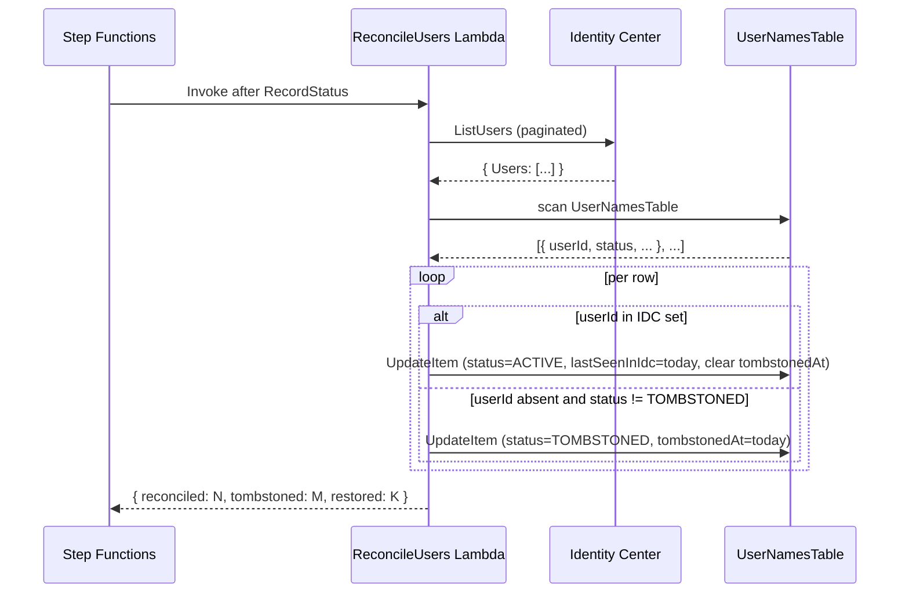

# Design Document — User Tombstoning

## Overview

A new state at the tail of the ETL state machine — `ReconcileUsers` — invokes a Lambda that compares the live Identity Center user set against the `UserNamesTable` cache and updates per-row status flags. Read paths consult the new `status` field to hide tombstoned users from actionable views (Recommendations, Inactive Subscribers) while preserving them in the historical Users tab with a "Removed from IDC" badge.

The reconcile is fail-safe: any `ListUsers` failure aborts the run silently without modifying any row. This is the only safe behavior — a partial or empty IDC response would otherwise tombstone every user the next run.



---

## Components and Interfaces

### 1. `etl/reconcile_users_handler.py` (new)

Lambda entry point. Pure orchestration over the helper functions below; no business logic.

```python
def reconcile_users_handler(event, context):
    """ReconcileUsers Lambda entry point.

    Event shape (currently empty — invoked from Step Functions with no
    arguments; future runs may carry correlation IDs).

    Returns:
        Summary dict with reconciled_count, tombstoned_count,
        restored_count, and skipped_count. Errors do not propagate —
        the Lambda returns a partial summary with status="error" so the
        state machine's Catch terminates cleanly.
    """
```

### 2. `etl/user_reconciler.py` (new — pure logic)

Three pure functions, all unit-tested without mocks:

```python
def classify_row(
    row: dict,
    idc_user_ids: set[str],
    today: str,
) -> Literal["update_active", "tombstone", "restore", "noop"]:
    """Decide what to do with a single UserNamesTable row.

    Returns:
        - "update_active":  in IDC, status is ACTIVE/missing → only update lastSeenInIdc
        - "restore":        in IDC, status is TOMBSTONED   → flip back to ACTIVE
        - "tombstone":      not in IDC, status is ACTIVE/missing → mark tombstoned
        - "noop":           not in IDC, status is TOMBSTONED → already marked, leave alone
    """


def build_update_kwargs(
    user_id: str,
    decision: str,
    today: str,
) -> dict:
    """Build a DynamoDB UpdateItem kwargs dict for a given decision.

    Encapsulates the SET/REMOVE expressions so the reconcile loop never
    constructs raw expressions. Keeps the byte-shape of the row a contract
    that lives in one file.
    """
```

The Lambda calls `classify_row` for each scanned row, then `build_update_kwargs` for non-`noop` decisions, then `table.update_item(**kwargs)`.

### 3. `etl/user_name_resolver.py` (existing — unchanged)

The resolver continues to operate the same way during parse: cache hit → return; cache miss → IDC `DescribeUser` → cache write. New rows it writes inherit the read-side default (`status` field absent → treated as `ACTIVE`). The reconcile step picks up these new rows on the next run and stamps `lastSeenInIdc`.

### 4. `template.yaml` (modified)

Add a new Lambda function `ReconcileUsersFunction` with the same IAM as `ParseFunction` (IDC list/describe + UserNamesTable read/write). Add a step to the ETL state machine after `RecordStatus`:

```yaml
ReconcileUsers:
  Type: Task
  Resource: arn:aws:states:::lambda:invoke
  Parameters:
    FunctionName: !Ref ReconcileUsersFunction
    Payload: {}
  ResultSelector:
    summary.$: $.Payload
  ResultPath: $.reconcile
  Catch:
    - ErrorEquals: ["States.ALL"]
      ResultPath: $.reconcileError
      Next: Done
  Next: Done
```

The `Catch` ensures reconcile failures never bubble up — the pipeline succeeds regardless. Any error is captured in the execution history and visible in the Step Functions console.

### 5. `backend/repository/analytics_repository.py` (modified)

`scan_user_stats` and the user-detail endpoints already join with `UserNamesTable` for display name enrichment. Extend the existing helper that reads UserNamesTable to also return `status` and `tombstonedAt`:

```python
def lookup_user_metadata(user_ids: list[str]) -> dict[str, dict]:
    """Returns {userId: {displayName, userName, status, tombstonedAt}}.

    Missing status defaults to "ACTIVE" for backward compatibility.
    """
```

### 6. `backend/handlers/recommendation_handler.py` (modified)

The handler runs two scans (windowed for projection, lifetime for tier presence). Extend both with a tombstone filter applied **after** name enrichment but **before** the engine call. Tombstone status is read from the same `UserNamesTable` lookup that already runs for display names, so the change is one boolean filter, no extra DynamoDB calls.

### 7. `backend/handlers/usage_handler.py` (modified)

The Users tab shows tombstoned users with the badge. The handler simply forwards `tombstoned: bool` on each user payload, computed from `status`. No filtering.

### 8. Frontend (modified)

- `frontend/src/components/UsageTable.tsx` — render a `<Badge color="grey">Removed from IDC</Badge>` next to the display name when `user.tombstoned === true`. Wrap the badge in a `Popover` with explanation copy.
- `frontend/src/types/index.ts` — extend `UserUsage` with `tombstoned?: boolean`.
- `frontend/src/locales/{en,pt-BR}.json` — three new keys under `users.tombstone.*`.

---

## Data Models

### UserNamesTable schema (extended)

| Field | Type | Description |
|---|---|---|
| `userId` (PK) | String | Identity Center UUID. |
| `displayName` | String | Cached human-readable name. |
| `userName` | String | Cached login name (email). |
| `resolvedAt` | String (ISO) | When the name was last resolved from IDC. |
| `status` | String | `"ACTIVE"` or `"TOMBSTONED"`. Missing field is treated as `"ACTIVE"` (backward compat). |
| `tombstonedAt` | String (ISO) \| absent | Set when `status` flips to `"TOMBSTONED"`. Cleared on restore. |
| `lastSeenInIdc` | String (ISO) \| absent | Last reconcile date that confirmed presence in IDC. |

No GSI changes. No migration script — read paths default missing `status` to `"ACTIVE"` and the first reconcile run populates the new fields lazily.

---

## Correctness Properties

### Property 1: Reconcile is idempotent (Requirement P1)

*For any* `UserNamesTable` state and any `idc_user_set`, running `reconcile_users_handler` twice in a row SHALL leave the table byte-identical except for `lastSeenInIdc` (always refreshed) and `tombstonedAt` (only changes on first transition).

Validated by `tests/test_user_reconciler.py::test_idempotent_run`.

### Property 2: No false tombstones on IDC errors (Requirement 2.1, 2.2, P2)

*For any* IDC error mode (boto3 ClientError, empty list, network exception), the count of rows that transition from `status="ACTIVE"` to `status="TOMBSTONED"` SHALL be exactly zero. The handler aborts before iterating UserNamesTable.

Validated by `tests/test_reconcile_users_handler.py::test_idc_error_no_changes`.

### Property 3: Tombstone preserves history (Requirement 1.8, P3)

*For any* row, the values of `userId`, `displayName`, and `userName` SHALL be unchanged across any tombstone or restore transition. Only `status`, `tombstonedAt`, and `lastSeenInIdc` are mutated.

Validated by `tests/test_user_reconciler.py::test_history_preserved`.

### Property 4: Restore is symmetric (Requirement P4)

*For any* row that is tombstoned and then restored in two consecutive runs, the final row SHALL equal the pre-tombstone row except for `lastSeenInIdc` and the absence of `tombstonedAt`.

Validated by `tests/test_user_reconciler.py::test_restore_round_trip`.

---

## Open Questions

- **Should we set a TTL on tombstoned rows?** Today the tombstone is permanent. If a user is removed from IDC and never returns, the row sits there forever. Option: 365-day TTL on `tombstonedAt`. Defer until we see real cardinality.
- **Should the Users tab default to hiding tombstoned users (filter chip)?** Today they are always shown with the badge. If admins find the historical view too cluttered, add a Cloudscape filter chip "Hide users removed from IDC".
- **Should reconcile run on a separate schedule?** Today it runs at the end of the ETL. If ETL becomes hourly and the reconcile starts to dominate cost, split it onto its own EventBridge schedule (daily). Defer until measured.
