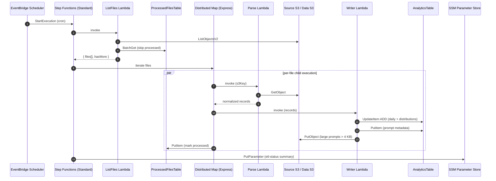
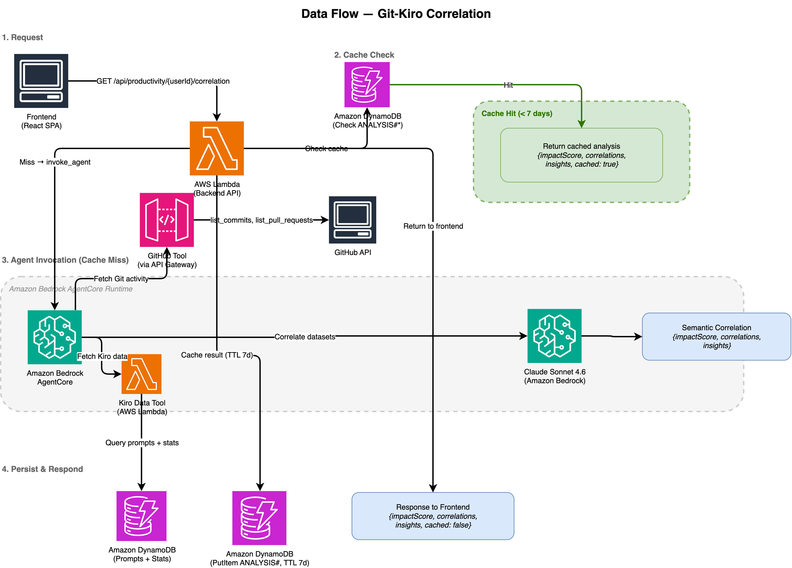
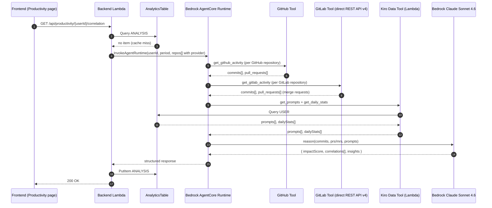

# Architecture

> Back to [README](../README.md)

This document describes the architecture of the Kiro Cost Analyzer sample: the high-level component layout, the two main runtime flows (ETL and Git-Kiro correlation), the DynamoDB schema, and the design decisions behind the choices that are most likely to surprise a reader. The goal is to make the code easier to read, fork, and adapt.

## Contents

- [High-level overview](#high-level-overview)
- [ETL pipeline](#etl-pipeline)
- [Git-Kiro correlation agent](#git-kiro-correlation-agent)
- [DynamoDB schema](#dynamodb-schema)
- [Project structure](#project-structure)
- [Design decisions](#design-decisions)

---

## High-level overview


> The `.drawio` source now includes the GitLab egress path alongside the existing GitHub one (see the [GitLab integration prerequisites](deploy.md#gitlab-integration-prerequisites) in the deploy guide). Re-exporting `architecture.png` from the updated source is a manual draw.io step left to the maintainer — the image above still shows the GitHub-only agent group.

**Stack:** AWS SAM · Python 3.13 · React 19 · TypeScript · Cloudscape · AWS Step Functions · Amazon DynamoDB · Amazon S3 · Amazon Cognito · AWS IAM Identity Center · Amazon Bedrock · Amazon Bedrock AgentCore.

The system is composed of four runtime surfaces:

| Surface | Technology | Responsibility |
|---|---|---|
| **Frontend SPA** | React 19, TypeScript, Cloudscape, `react-i18next` | Cognito-authenticated dashboard. Consumes the Backend API and renders metrics, tier optimization, engagement, and Git correlation. |
| **Backend API** | AWS Lambda (Python 3.13), API Gateway REST, Cognito Authorizer | Stateless request/response. Reads from DynamoDB, writes feature-flag and threshold values to SSM, triggers ETL on demand, calls AgentCore for correlation. |
| **ETL pipeline** | AWS Step Functions Standard + Distributed Map Express, AWS Lambda, EventBridge Scheduler | Daily (or on-demand) ingestion of Kiro activity CSVs and prompt logs from S3 into DynamoDB. Runs a categorization phase backed by Bedrock and a reconcile pass against Identity Center. |
| **Correlation agent** | Amazon Bedrock AgentCore, Claude Sonnet 4.6, MCP and direct-HTTPS tools | On-demand semantic correlation between a developer's Kiro prompts and their Git activity on GitHub and/or GitLab, selected per repository by that repository's configured provider. Result is cached in DynamoDB for 7 days. |

All four sit inside a single AWS account by default, with an opt-in cross-account variant for the source S3 bucket and IAM Identity Center.

---

## ETL pipeline


### Step Functions topology (Standard + Distributed Map Express)

A Standard state machine wraps a **Distributed Map** that runs **Express** child workflows. The combination is intentional — see [Distributed Map Express](#why-distributed-map-express) under Design Decisions.

| # | Lambda | Responsibility |
|---|---|---|
| 1 | **ListFiles** | Lists CSVs and prompt logs in S3, queries `ProcessedFilesTable` to skip already-processed entries, returns up to 500 new files per batch. When `hasMore=true`, the state machine loops back. |
| 2 | **Parse** | Reads the file from S3 (CSV or gzipped JSON), parses, normalizes records, and resolves `userId → displayName` via IAM Identity Center with a `UserNamesTable` cache. |
| 3 | **Writer** | Persists normalized records to DynamoDB: `UpdateItem ADD` for daily and global stats, `PutItem` for prompt metadata, `UpdateItem ADD` for model/trigger/category distributions. Prompts whose combined content exceeds 4 KB are offloaded to S3. |
| 4 | **MarkProcessed** | Direct Step Functions → DynamoDB `PutItem` task — no Lambda code. Marks the file processed with timestamp and record count. |
| 5 | **RecordStatus** | Reads child-execution results from S3 (via `ResultWriter`), summarizes processed/failed counts, and writes the result to SSM Parameter Store for the dashboard to render. |

When `ListFiles` returns zero new files, the state machine takes a short-circuit path that writes a `RecordStatusNoFiles` SSM summary and then **rejoins the categorization and reconcile phases** below. The categorization pass runs on every execution so an admin can re-categorize prompts already in the table by manually resetting their `category` to `NOT_CATEGORIZED`, without re-ingesting source data.

### Categorization phase (Standard Map, post-ETL)

Runs on every execution, regardless of whether the ingestion phase processed any new files:

| # | Lambda | Responsibility |
|---|---|---|
| 6 | **ListUncategorized** | Scans DynamoDB for prompts where `category = "NOT_CATEGORIZED"` and writes the list to S3 for the Map iterator. |
| 7 | **CategorizePrompt** | Loads the prompt content (inline or from S3), invokes Bedrock Claude Haiku 4.5 via the `global.anthropic.claude-haiku-4-5-*` cross-region inference profile (Global CRIS) so the call lands in the same region as the regional `AWS::Bedrock::Guardrail`. Classifies into one of 14 categories and updates the DynamoDB item. Transient errors (throttling, service exception) retry with exponential backoff up to 6 times; fatal errors propagate without catch. |

The Standard Map runs with `MaxConcurrency=50`. Errors are tagged `"Classification Error"` instead of being silently coerced to `"Other"`, so they remain visible in the dashboard.

### Reconcile phase (terminal step)

After the categorization pass, the state machine invokes the **ReconcileUsers** Lambda. It paginates `identitystore:ListUsers`, scans the `UserNamesTable`, and updates each row's `status` / `tombstonedAt` / `lastSeenInIdc` based on whether the user still exists in IDC. The step is wrapped in `Catch: ["States.ALL"]` so reconcile failures cannot fail the pipeline. See `.kiro/specs/user-tombstoning/` for the full design and the four correctness properties (idempotence, no false tombstones on errors, history preservation, restore symmetry).

### Sequence diagram — happy path



---

## Git-Kiro correlation agent

On-demand semantic correlation powered by Amazon Bedrock AgentCore (Claude Sonnet 4.6), across GitHub and GitLab repositories.



> The `.drawio` source now adds the GitLab egress path (repository descriptor → GitLab Tool → GitLab instance) alongside the existing GitHub path. Re-exporting `git-kiro-correlation-flow.png` from the updated source is a manual draw.io step left to the maintainer — the image above still shows the GitHub-only correlation flow.

### How a correlation request is served

1. The user opens the Productivity page and selects a developer.
2. The Backend API checks `AnalyticsTable` for a cached `ANALYSIS#…` item with TTL still valid (7 days).
3. On cache miss, the backend builds a provider-tagged repository descriptor per configured repository (provider, location parameters, and a repository-scoped SSM token identifier — never the token value itself) and invokes the AgentCore runtime, which orchestrates three tools:
   - **GitHub Tool** — calls the GitHub REST API. Lists commits and PRs for the developer's mapped GitHub username.
   - **GitLab Tool** — calls the configured GitLab instance's REST API v4 directly (no gateway hop), authenticating with the `PRIVATE-TOKEN` header. Lists commits and merge requests for the developer's mapped GitLab username.
   - **Kiro Data Tool** — a Lambda invoked with IAM auth. Returns the developer's prompts and daily stats from DynamoDB.

   The agent calls the tool matching each repository descriptor's provider; a repository with no user mapping for its provider is excluded from the analysis rather than guessed at.
4. Claude Sonnet 4.6 reasons over all datasets and produces a structured response: `impactScore` (0–100), individual `correlations` (prompt ↔ commit/PR/MR with confidence), and natural-language `insights`. GitLab merge requests and GitHub pull requests are treated as the same concept for correlation purposes.
5. The result is written back to `AnalyticsTable` with a 7-day TTL and returned to the client.

### Sequence diagram — cache miss



### GitHub token permissions

| Permission | Access | Reason |
|---|---|---|
| Contents | Read-only | List commits |
| Pull requests | Read-only | List PRs |
| Metadata | Read-only | Required by GitHub for any repo access |

Restrict the token to only the repositories you intend to analyze. `Administration` and `Commit statuses` are not required.

### GitLab token scopes

The GitLab integration uses a GitLab Personal Access Token, sent on the `PRIVATE-TOKEN` header rather than `Authorization` — a distinct authentication mechanism from GitHub's OAuth-style token header, not a variant of it.

| Scope | Reason |
|---|---|
| `read_api` | List commits and merge requests via the REST API v4 |
| `read_repository` | Read commit history for the configured project |

Personal Access Tokens only — GitLab OAuth apps are out of scope for this sample. The token is stored per repository in SSM Parameter Store (`SecureString`, path `/kiro-cost-analyzer/git-tokens/{repoId}`), the same layout used for GitHub tokens — provider-independent. Certificate verification is enabled by default for GitLab requests. `GITLAB_SSL_VERIFY=false` disables it as a documented, narrow exception for self-signed instances — **this MUST NOT be used in production**; see [TLS certificate trust](deploy.md#tls-certificate-trust). See [GitLab integration prerequisites](deploy.md#gitlab-integration-prerequisites) for the self-hosted network-reachability and TLS-trust preconditions.

---

## DynamoDB schema

The project uses a single-table design for analytics data, plus a small auxiliary table for category-correction feedback. See [Single-table design](#why-single-table-design) under Design Decisions.

### AnalyticsTable

| PK | SK | Description | Key attributes |
|---|---|---|---|
| `USER#{userId}` | `STATS#DAILY#{YYYY-MM-DD}` | Daily per-user stats | `totalCredits`, `overageCredits`, `totalMessages`, `totalConversations`, `totalInteractions`, `subscriptionTier`, `clientType`, `modelMessages` (Map) |
| `USER#{userId}` | `STATS#MODEL#{normalizedModelId}` | Distribution by model | `count`, `rawModelId` |
| `USER#{userId}` | `STATS#TRIGGER#{normalizedTrigger}` | Distribution by trigger | `count`, `rawTriggerType` |
| `USER#{userId}` | `STATS#CATEGORY#{normalizedCategory}` | Distribution by category | `count`, `rawCategory` |
| `USER#{userId}` | `PROMPT#{timestamp}#{requestId}` | Prompt metadata | `requestId`, `modelId`, `triggerType`, `promptLength`, `responseLength`, `displayName`, `userName`, `region`, `accountId`, `conversationId`, `utteranceId`, `customizationArn`, `contentInS3`, `category`, `[prompt, response]` |
| `USER#{userId}` | `ACTIVITY_SUMMARY` | User activity frequency tracking | `firstActiveDate`, `lastActiveDate`, `activeDays` |
| `USER#{userId}` | `ANALYSIS#{date}#{time}#{id}` | Cached correlation analysis | `impactScore`, `impactLevel`, `correlations`, `insights`, `period`, `model`, `tokensUsed`, `analyzedAt`, `TTL` |
| `USER#{userId}` | `GITMAP#{provider}#{gitUsername}` | Git username mapping | `provider`, `gitUsername`, `gitEmail`, `createdAt`, `createdBy` |
| `USER#{userId}` | `GITCOMMIT#{date}#{commitHash}` | Git commit activity | `repoId`, `repository`, `message`, `filesChanged`, `linesAdded`, `linesRemoved`, `authorDate` |
| `USER#{userId}` | `GITPR#{date}#{prId}` | Git pull request activity | `prId`, `repoId`, `repository`, `title`, `state`, `createdAt`, `mergedAt`, `commitsCount`, `reviewsCount` |
| `USER#{userId}` | `GITREVIEW#{date}#{reviewId}` | Git review activity | `repoId`, `repository`, `prId`, `reviewType`, `createdAt` |
| `GLOBAL` | `STATS#DAILY#{YYYY-MM-DD}` | Global daily stats | `totalCredits`, `overageCredits`, `totalMessages`, `totalConversations`, `totalUsers` (SS) |
| `GLOBAL` | `STATS#TIER#{tier}#{date}` | Breakdown by subscription tier | `totalCredits`, `overageCredits`, `totalMessages`, `totalConversations` |
| `GLOBAL` | `STATS#CLIENT#{clientType}#{date}` | Breakdown by client type | `totalCredits`, `overageCredits`, `totalMessages`, `totalConversations` |
| `ETL_STATUS` | `EXEC#{executionName}` | ETL execution status | `status`, `filesProcessed`, `recordsWritten`, `timestamp`, `executionArn` |
| `GITREPO#{repoId}` | `CONFIG` | Git repository configuration | `name`, `url`, `provider`, `ssmTokenPath`, `status`, `createdAt`, `createdBy`, `lastSyncAt`, `lastManualSyncAt` |
| `GITREPO#{repoId}` | `SYNC#{date}` | Git sync run statistics | `commitsCount`, `prsCount`, `reviewsCount`, `duration`, `status` |

**GSI:** `requestId-index` (PK: `requestId`, Projection: `ALL`) — lookup prompts by `requestId`.

### FeedbackTable

| PK | SK | Description |
|---|---|---|
| `FEEDBACK#{requestId}` | `FEEDBACK#{timestamp}` | Category-correction feedback submitted by users for admin review |

### UserNamesTable

A small auxiliary table populated by the **Parse** Lambda's `name_resolver` (cache write on first sight) and refreshed by the **ReconcileUsers** Lambda (status flip and timestamp refresh):

| PK | Description | Key attributes |
|---|---|---|
| `userId` | One row per Kiro user that has ever generated activity | `displayName`, `userName`, `resolvedAt`, `status` (`ACTIVE` or `TOMBSTONED`), `tombstonedAt` (set when flipped to `TOMBSTONED`), `lastSeenInIdc` (last reconcile date that confirmed presence) |

Read paths default a missing `status` field to `ACTIVE` for backward compatibility with rows written before tombstoning. Tombstoned users stay in the table forever — the row preserves the `displayName` so historical analytics keep human-readable names. See `.kiro/specs/user-tombstoning/` for the full design.

### Sort-key normalization

Distribution items use a normalized sort-key suffix produced by `normalize_sk_value()` from `shared/sk_normalizer.py`: lowercase → trim → replace special characters with hyphens → collapse hyphens → truncate at 128 chars. The original raw value is preserved in a `raw…` attribute (e.g., `rawModelId`) via `SET if_not_exists` so the dashboard can display the un-normalized form.

---

## Project structure

```
├── template.yaml              # SAM — full infrastructure
├── source-account-role.yaml   # CloudFormation helper — cross-account IAM Role
├── agent/                     # Git-Kiro Correlation Agent (Amazon Bedrock AgentCore)
│   ├── agentcore/             #   AgentCore configuration (model, tools, credentials)
│   └── app/                   #   Agent code (entrypoint, prompts, MCP tools)
├── etl/                       # ETL pipeline Lambdas (Python)
│   ├── *_handler.py           #   Lambda entry points (list, parse, writer, …)
│   ├── processors/            #   csv_processor, prompt_processor
│   └── repository/            #   analytics_writer (DynamoDB writes)
├── backend/                   # Backend API Lambda (Python)
│   ├── handler.py             #   Router — API Gateway → handlers
│   ├── handlers/              #   One handler per domain
│   ├── repository/            #   Data access layer (DynamoDB)
│   └── models/                #   Dataclasses for typing
├── shared/                    # Code shared between backend and etl
├── layers/                    # Lambda Layer (single SharedLayer with all cross-cutting code)
├── frontend/                  # React SPA (Cloudscape)
│   └── src/
│       ├── pages/             #   Dashboard, UserDetail, Productivity, Admin, Login
│       ├── components/        #   Reusable UI components
│       ├── i18n/              #   i18n runtime (provider, hook, formatters, resolver)
│       ├── locales/           #   Translation catalogs (en.json, pt-BR.json)
│       ├── theme/             #   Visual mode (light/dark)
│       ├── auth/              #   Cognito SRP auth
│       └── api/               #   HTTP client with JWT
├── custom_resources/          # CloudFormation Custom Resources
├── scripts/                   # Build-time scripts (check-locales.ts, etc.)
└── tests/                     # Python tests (pytest + moto + hypothesis)
```

---

## Design decisions

This section explains the choices that are likely to look surprising at first glance. Each subsection states the decision, why it was made, and what was rejected.

### Why Distributed Map Express

**Decision.** The fan-out across files uses a Distributed Map with **Express** child workflows, wrapped in a Standard parent state machine.

**Why.**
- The parent stays Standard so its execution history is durable for audit and debugging.
- The fan-out uses a Distributed Map (not Map Inline) because Map Inline caps at 25K events per execution and 256 KB of payload — limits that 7K+ child executions would exceed.
- The children are Express because each one is short, idempotent, and high-volume; Express bills per request and avoids the per-state-transition cost of Standard. Express children also keep the Distributed Map's per-iteration overhead low.

**Rejected alternatives.**
- *Single Standard state machine with Map Inline.* Hits the 25K event limit at this volume.
- *All-Express.* Loses durable audit history at the parent level for the daily ETL run.
- *Lambda fan-out via SQS.* Works, but reproduces orchestration logic the Step Functions Distributed Map already provides (concurrency, retries, error catching, ResultWriter), and is harder to monitor.

### Why single-table design

**Decision.** All analytics data lives in `AnalyticsTable`. Different entities are partitioned by PK prefix (`USER#`, `GLOBAL`, `ETL_STATUS`, `GITREPO#`) and discriminated by SK prefix (`STATS#DAILY#`, `PROMPT#`, `ANALYSIS#`, …). A separate `FeedbackTable` exists only because feedback has a different lifecycle and access pattern (write-once, admin-reviewed, periodically purged).

**Why.**
- Most dashboard queries fetch one user's full timeline plus their distributions. Single-table keeps these on the same partition, reducing reads to one or two `Query` calls.
- Atomic counters via `UpdateItem ADD` work on per-item basis; co-locating per-user distributions with per-user stats keeps writes atomic and ordered.
- On-demand billing makes single-table cheap: no overprovisioned capacity per table.
- Hot-key risk is mitigated because `USER#{userId}` partitions are naturally distributed across users.

**Rejected alternatives.**
- *One table per entity (multi-table relational style).* Triples the read count for the most common dashboard view, multiplies operational surface, and complicates cross-entity transactions.
- *Aurora Serverless v2.* More flexible queries, but at this volume the cost would dominate the bill. Single-table DynamoDB on-demand stays under $1/month for the reference workload.

### Why Bedrock AgentCore for correlation, not a direct Bedrock InvokeModel call

**Decision.** Git-Kiro correlation runs on Amazon Bedrock AgentCore with three tools: GitHub (via the AgentCore Gateway), GitLab (a direct HTTPS call to the configured instance, no gateway hop), and Kiro data (via Lambda).

**Why.**
- The correlation requires **independent data sources per provider plus Kiro's own data** (one or more Git providers + DynamoDB). Giving Claude a tool-use contract instead of having the backend pre-stuff a single mega-prompt lets the model decide which calls to issue, for which repositories, and in what order — including calling both the GitHub and GitLab tools in the same run when a developer has repositories on both.
- AgentCore handles OAuth credential rotation for the GitHub Tool through the Gateway, so the backend never sees the GitHub PAT directly. The GitLab Tool does not go through the Gateway — GitLab authenticates with a static Personal Access Token on the `PRIVATE-TOKEN` header, resolved by the agent from a repository-scoped SSM parameter rather than an OAuth flow — so gateway-mediated rotation does not apply there.
- AgentCore Runtime scales to zero when idle, which matches the on-demand usage pattern (a handful of invocations per week per organization).

**Rejected alternatives.**
- *Direct Bedrock `InvokeModel`.* The backend would need to (a) pre-fetch all Git provider data and all Kiro data, (b) pre-format the prompt, and (c) parse the response. Larger prompt, brittle JSON formatting requirements, no tool-use loop.
- *Periodic Pearson correlation in a scheduled Lambda.* Was the v2.x approach. Statistical correlation is fast and cheap but produces brittle results — Kiro prompts and Git commits do not co-occur on the same day for many real workflows. Semantic correlation produces actionable insights.

### Why Cloudscape

**Decision.** The SPA uses Cloudscape Design System exclusively.

**Why.**
- The audience for this sample (AWS customers analyzing Kiro spend) already recognizes Cloudscape from the AWS Console. Familiar patterns lower the cognitive load.
- Cloudscape ships accessible components (keyboard navigation, ARIA, screen-reader semantics) so the sample does not have to re-implement them.
- Cloudscape themes light and dark modes natively.

**Rejected alternatives.**
- *MUI / Chakra / shadcn-ui.* Each requires hand-rolling a design system on top, building tables/charts, and validating accessibility — none of which are the focus of this sample.
- *Plain Tailwind.* Same downside, plus no out-of-the-box table primitive.

### Why two Bedrock models (Haiku and Sonnet)

**Decision.** Categorization uses Claude Haiku 4.5; correlation uses Claude Sonnet 4.6.

**Why.**
- Categorization runs on every prompt ingested by the daily ETL — high volume, narrow task, structured output (one of 14 labels). Haiku 4.5 hits ~95% accuracy on the labeled validation set at $1/$5 per 1M input/output tokens.
- Correlation runs on demand (a few times per week per organization), reasons over a heterogeneous mixed corpus (commits + PRs + prompts), and produces nuanced narrative insights. Sonnet 4.6 is meaningfully better at this kind of multi-source synthesis at $3/$15 per 1M tokens; the lower volume keeps the bill bounded.

**Rejected alternatives.**
- *Sonnet for both.* Triples the categorization cost line for marginal accuracy gain.
- *Haiku for both.* Correlation quality drops noticeably; insights become generic.

### Why English-default i18n with pt-BR as a first-class locale

**Decision.** UI strings flow through `react-i18next`. English is the default; Brazilian Portuguese is a first-class locale (no string is allowed to exist in one catalog and not the other). The build fails if catalogs diverge.

**Why.**
- The repository ships an English README to a global audience. The UI must match.
- The original codebase started in pt-BR. Removing pt-BR would lose work and signal that "first-class non-English locale" support is unrealistic; keeping it documents the migration pattern other adopters can follow.
- The build-time parity check catches divergence in CI rather than at runtime, where users would see an English fallback.

**Rejected alternatives.**
- *English-only.* Closes the door on the i18n pattern this sample is partly meant to illustrate.
- *No build-time check.* Catalogs drift within weeks; the sample loses its claim that pt-BR is first-class.

### Why region defaults to `sa-east-1`

**Decision.** `samconfig.toml` ships with `region = "sa-east-1"`.

**Why.**
- The original deployment target was a São Paulo–based team and `sa-east-1` is closer for that workload.
- All services used by the sample (Bedrock Claude Haiku 4.5 / Sonnet 4.6, AgentCore, Cognito SRP, Step Functions Distributed Map, EventBridge Scheduler) are available in `sa-east-1` at the time of this writing.

**To deploy elsewhere.** Override `region` and verify each Bedrock model is available there. See [docs/deploy.md](deploy.md#region-and-model-availability).
