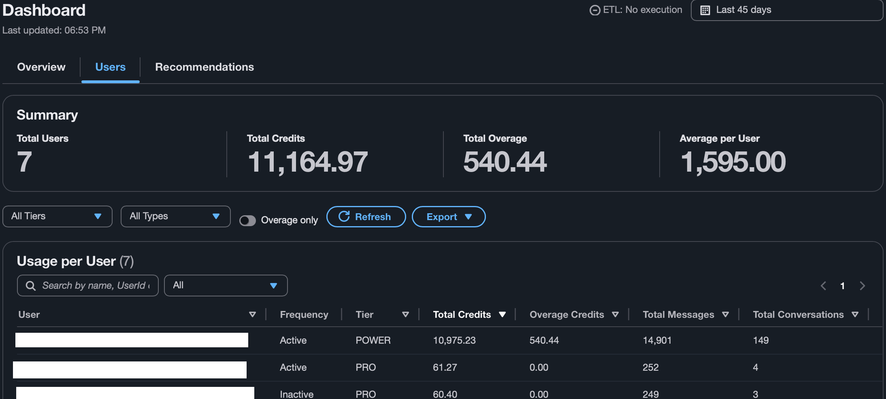
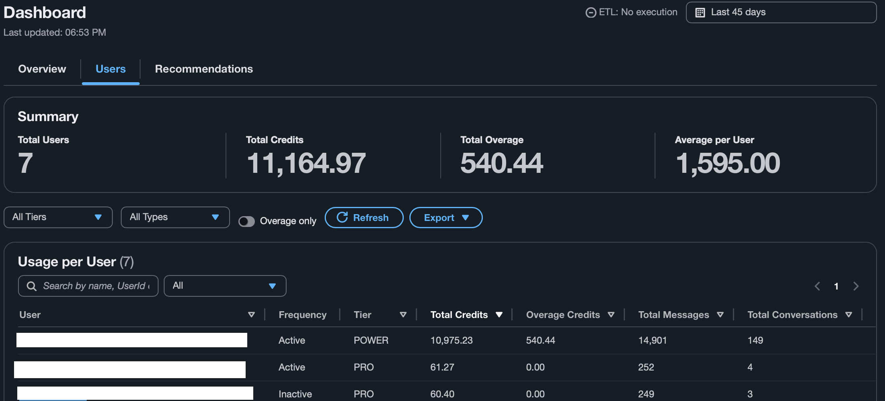
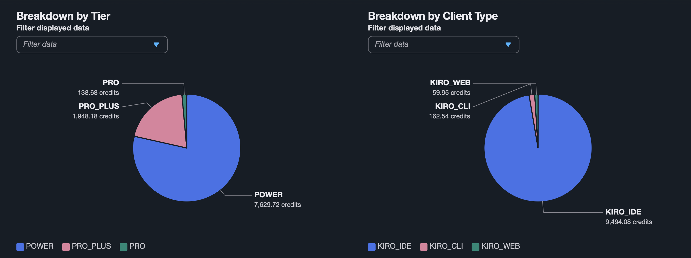
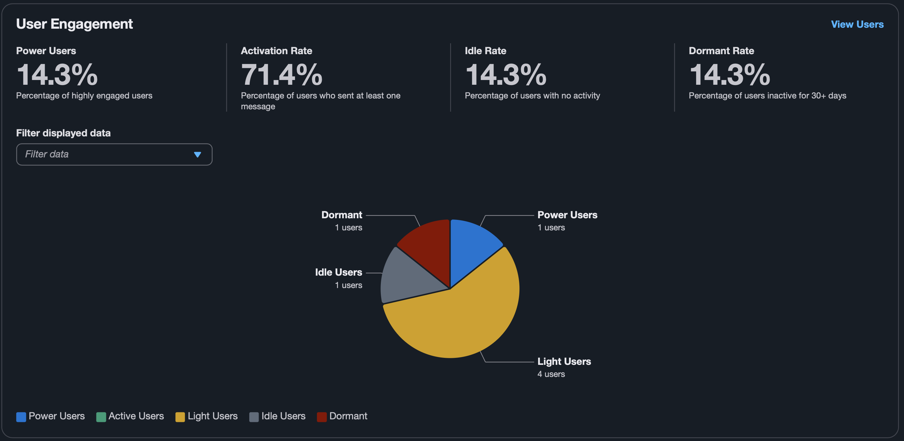

# Features

> Back to [README](../README.md)

This document walks through the Kiro Cost Analyzer feature set with screenshots. The README keeps a condensed list; this page is the full tour.

## Contents

- [Dashboard and analytics](#dashboard-and-analytics)
- [Tier optimization](#tier-optimization)
- [User engagement and segmentation](#user-engagement-and-segmentation)
- [AI-powered analysis](#ai-powered-analysis)
- [Internationalization and UX](#internationalization-and-ux)
- [Multi-account deployment](#multi-account-deployment)
- [Administration](#administration)

---

## Dashboard and analytics

- **Account Overview** — Total credits consumed, daily/weekly timeline charts, breakdown by tier (Free/Pro/Enterprise) and client type (IDE/CLI/Web).
- **Per-User Usage Table** — Sortable, filterable table with search, pagination, and export to CSV/JSON.
- **Model Distribution** — Pie chart showing which AI models are being used and how often.
- **Trigger Distribution** — Breakdown of how prompts are initiated (manual, auto-complete, inline, etc.).

<!--
SCREENSHOT — hero
File: screenshots/dashboard.png
Replace via the workflow in screenshots/README.md (anonymize per the rules there).
-->

<!--
SCREENSHOT — per-user usage table
File: screenshots/users.png
-->

<!--
SCREENSHOT — tier and client-type breakdowns
File: screenshots/breakdown-by-tier.png
-->

## Tier optimization

- **Upgrade/downgrade recommendations** — Projects monthly credit trajectory per user, identifies who would benefit from a tier change.
- **Annual savings calculator** — Estimates cost savings from right-sizing tiers across the organization.
- **Visual indicators** — Inline badges on user rows mark candidates for upgrade, downgrade, or already-optimal tier.

<!--
SCREENSHOT — tier optimization recommendations
File: screenshots/recommendations.png
-->

## User engagement and segmentation

- **Engagement funnel** — Visual funnel segmenting users into Power / Active / Light / Idle / Dormant based on configurable thresholds.
- **Churn risk detection** — Flags users trending toward inactivity with declining usage patterns.
- **Dormant user detection** — Identifies users inactive for 30+ days with frequency badges and last-active timestamps.
- **Configurable thresholds** — Adjust engagement segment boundaries via the Settings page.

<!--
SCREENSHOT — engagement funnel and segmentation
File: screenshots/user-engagement.png
-->

## AI-powered analysis

- **Git-Kiro correlation** — On-demand AI agent (Claude Sonnet 4.6 via Amazon Bedrock AgentCore) semantically correlates Kiro prompts with GitHub commits/PRs and produces an Impact Score (0–100) with per-item confidence.
- **Bilingual insights** — Insights are generated in English and Brazilian Portuguese in a single LLM call, so switching the UI locale renders the same recommendations in the active language with no additional cost.
- **Prompt categorization** — Automatic classification via Amazon Bedrock Claude Haiku 4.5 across 14 categories (Code Generation, Debugging, Refactoring, Documentation, Testing, etc.).
- **Feedback loop** — Users correct categories via modal; admins approve corrections; approved examples enrich the classifier's few-shot prompt dynamically.

<!--
SCREENSHOT — per-user productivity report with Git-Kiro Impact Score
File: screenshots/user-activity-report-1.png
-->

<!--
SCREENSHOT — bilingual AI-generated insights
File: screenshots/insights.png
-->

## Internationalization and UX

- **Multi-language** — English (default) plus Brazilian Portuguese, runtime switching with no page reload.
- **Dark mode** — Full Cloudscape dark theme support.
- **Locale-aware formatting** — Numbers, dates, and times formatted per active locale.
- **Cron humanizer** — Translates cron/rate expressions into human-readable schedule descriptions.

## Multi-account deployment

- **Cross-account S3** — AWS STS AssumeRole for reading logs from S3 buckets in other AWS accounts.
- **Cross-account Identity Center** — Resolves user names from IAM Identity Center in a separate account.
- **Defense-in-depth** — Cognito + API Gateway authorizer + JWT claim scoping + CSP headers + CORS restriction.

See [deploy.md](deploy.md#scenario-b--cross-account) for the cross-account setup steps.

## Administration

- **ETL management** — Manual trigger, schedule configuration (cron/rate), execution history with status.
- **User management** — Cognito user CRUD, admin group assignment, custom attribute mapping.
- **Git repository config** — Add/remove GitHub repos for correlation analysis, user-to-git-username mapping.
- **Settings** — Source bucket, prefixes, cross-account role ARNs, engagement thresholds.
